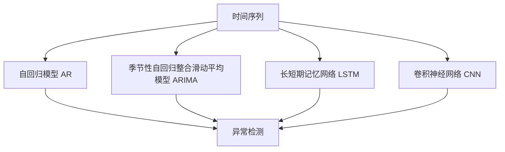

                 

# 深度学习在时间序列预测中的应用

> 关键词：深度学习,时间序列预测,长短期记忆网络(LSTM),卷积神经网络(CNN),自回归模型(AR),季节性自回归整合滑动平均模型(ARIMA),模型融合,时间序列异常检测

## 1. 背景介绍

### 1.1 问题由来

时间序列预测（Time Series Forecasting）是机器学习中非常重要的一类问题。它涉及如何基于过去的时间序列数据预测未来的数据。时间序列数据通常表现为一系列有序且连续的数据点，例如股票价格、天气数据、销售记录等。

时间序列预测在金融、制造、能源、物流、交通等众多领域都有广泛的应用。例如，金融行业可以利用时间序列预测来评估市场趋势、预测股票价格波动；制造业可以预测生产设备的维护需求；能源行业可以预测能源供应需求；物流行业可以预测货物运输路径和库存量；交通行业可以预测交通流量。

然而，时间序列预测问题具有高度的非线性、时变性、季节性等特点，传统的统计方法如ARIMA模型已难以满足复杂多变的现实需求。近年来，深度学习特别是基于神经网络的模型在时间序列预测中表现出强大的潜力，逐渐成为这一领域的研究热点。

### 1.2 问题核心关键点

深度学习在时间序列预测中的应用主要集中在以下三个方面：

1. **数据预处理**：时间序列数据通常包含缺失值、噪声、季节性等复杂特征，需要通过差分、归一化等预处理方法将其转化为更易处理的序列。
2. **模型选择与设计**：选择合适的深度学习模型是关键，包括LSTM、CNN、GRU等，以及如何将这些模型与传统统计模型进行组合。
3. **模型训练与调参**：通过损失函数、优化器等训练方法，调整模型参数，优化预测结果。

本文将系统介绍深度学习在时间序列预测中的应用，包括数据预处理、模型选择、训练调参等关键步骤。同时，将结合多个实际案例，展示深度学习在时间序列预测中的具体应用和效果。

## 2. 核心概念与联系

### 2.1 核心概念概述

在深度学习应用于时间序列预测时，涉及多个核心概念，包括：

- **时间序列（Time Series）**：一系列按照时间顺序排列的数据点，如气温、股票价格、销售量等。
- **自回归模型（AR）**：一种基于时间序列自身历史数据的预测模型。
- **季节性自回归整合滑动平均模型（ARIMA）**：ARIMA模型结合了自回归、差分和移动平均等组件，可以处理时间序列的趋势和季节性。
- **长短期记忆网络（LSTM）**：一种特殊的循环神经网络，可以处理长期依赖关系。
- **卷积神经网络（CNN）**：一种前馈神经网络，通过卷积操作提取局部特征。
- **异常检测**：在时间序列预测中，检测异常值和异常波动是重要的任务，有助于提前发现潜在问题。

这些概念之间的联系可以通过以下Mermaid流程图来展示：



这个流程图展示了时间序列数据如何通过不同模型进行处理，以及如何将异常检测融入时间序列预测。

## 3. 核心算法原理 & 具体操作步骤

### 3.1 算法原理概述

深度学习在时间序列预测中的应用，主要基于以下三个算法原理：

1. **自回归模型（AR）**：基于时间序列的历史数据，通过线性回归模型预测未来的数据。
2. **长短期记忆网络（LSTM）**：一种特殊的循环神经网络，可以处理长期依赖关系，适用于处理复杂的时间序列数据。
3. **卷积神经网络（CNN）**：通过卷积操作提取局部特征，适用于处理时间序列的空间特征。

### 3.2 算法步骤详解

#### 3.2.1 数据预处理

时间序列数据通常包含缺失值、噪声、季节性等复杂特征，需要通过差分、归一化等预处理方法将其转化为更易处理的序列。

1. **数据清洗**：处理缺失值和噪声。常用的方法包括插值法、均值填补、中位数填补等。
2. **差分**：对时间序列进行一阶或高阶差分，以减少数据的波动性和趋势。
3. **归一化**：对数据进行归一化处理，使数据落在0到1之间，便于训练深度学习模型。

#### 3.2.2 模型选择与设计

选择适当的深度学习模型是时间序列预测的关键。常用的模型包括：

1. **自回归模型（AR）**：
   - **原理**：基于时间序列的历史数据，通过线性回归模型预测未来的数据。
   - **参数**：$p$（自回归阶数），$q$（滞后差分阶数）。
   - **公式**：$$y_t = \beta_0 + \beta_1 y_{t-1} + \cdots + \beta_p y_{t-p} + \epsilon_t$$
   - **优点**：简单易懂，适用于短期预测。
   - **缺点**：难以处理长期依赖关系。

2. **季节性自回归整合滑动平均模型（ARIMA）**：
   - **原理**：结合自回归、差分和移动平均等组件，可以处理时间序列的趋势和季节性。
   - **参数**：$p$（自回归阶数），$d$（差分阶数），$q$（移动平均阶数），$s$（季节性自回归阶数），$S$（季节性差分阶数），$Q$（季节性移动平均阶数）。
   - **公式**：$$y_t = \beta_0 + \beta_1 y_{t-1} + \cdots + \beta_p y_{t-p} + \epsilon_t + \delta_1 (y_{t-d} - y_{t-1}) + \cdots + \delta_d (y_{t-dp} - y_{t-1}) + \gamma_1 (y_{t-S} - y_{t-1}) + \cdots + \gamma_s (y_{t-sp} - y_{t-1}) + \theta_1 (y_{t-S} - y_{t-1}) + \cdots + \theta_Q (y_{t-1} - y_{t-S})$$
   - **优点**：能够处理趋势和季节性，适用于中长期预测。
   - **缺点**：参数较多，模型复杂度较高。

3. **长短期记忆网络（LSTM）**：
   - **原理**：一种特殊的循环神经网络，可以处理长期依赖关系。
   - **参数**：$h_t = \sigma(W_{hx}x_t + W_{hh}h_{t-1} + b_h)$，$c_t = \tanh(W_{cx}x_t + W_{ch}h_{t-1} + W_{cc}c_{t-1} + b_c)$，$y_t = \sigma(W_{hy}c_t + b_y)$
   - **优点**：能够处理长期依赖关系，适用于复杂的时间序列数据。
   - **缺点**：模型复杂度较高，训练难度较大。

4. **卷积神经网络（CNN）**：
   - **原理**：通过卷积操作提取局部特征，适用于处理时间序列的空间特征。
   - **参数**：$h_t = \sigma(W_{xh}x_t + b_h)$，$c_t = \tanh(W_{hc}h_{t-1} + b_c)$，$y_t = \sigma(W_{hy}c_t + b_y)$
   - **优点**：能够提取局部特征，适用于空间特征明显的时间序列数据。
   - **缺点**：难以处理长期依赖关系。

#### 3.2.3 模型训练与调参

1. **损失函数**：常用的损失函数包括均方误差（MSE）、均方根误差（RMSE）、平均绝对误差（MAE）等。
2. **优化器**：常用的优化器包括随机梯度下降（SGD）、Adam、Adagrad等。
3. **超参数调优**：常用的调参方法包括网格搜索、随机搜索、贝叶斯优化等。

### 3.3 算法优缺点

#### 3.3.1 优点

1. **处理复杂数据**：深度学习模型能够处理时间序列中的复杂非线性关系和长期依赖关系，适用于多种时间序列预测问题。
2. **高精度预测**：深度学习模型具有较高的预测精度，特别是在处理大规模数据集时表现优异。
3. **自适应性强**：深度学习模型能够根据数据特点自动调整模型参数，适用于多种时间序列预测场景。

#### 3.3.2 缺点

1. **模型复杂度高**：深度学习模型通常包含大量的参数，模型复杂度较高，训练和推理速度较慢。
2. **数据需求大**：深度学习模型通常需要大量的标注数据进行训练，数据获取成本较高。
3. **过拟合风险高**：深度学习模型容易过拟合，特别是在数据量较小或模型结构复杂时。

### 3.4 算法应用领域

深度学习在时间序列预测中有着广泛的应用，以下是几个典型的应用领域：

1. **股票价格预测**：利用时间序列数据预测股票价格走势，帮助投资者做出决策。
2. **销售量预测**：预测企业的销售额、库存量等，优化供应链管理。
3. **能源需求预测**：预测能源需求，优化能源分配和调度。
4. **交通流量预测**：预测交通流量，优化交通管理和规划。
5. **天气预测**：预测天气变化，帮助气象部门制定应对措施。

## 4. 数学模型和公式 & 详细讲解 & 举例说明

### 4.1 数学模型构建

#### 4.1.1 LSTM模型

LSTM是一种特殊的循环神经网络，具有记忆单元，能够处理长期依赖关系。LSTM模型由输入门、输出门和遗忘门组成。

LSTM模型的输入门、遗忘门和输出门公式如下：
$$i_t = \sigma(W_{hi}x_t + W_{hi-1}h_{t-1} + b_i)$$
$$f_t = \sigma(W_{hf}x_t + W_{hf-1}h_{t-1} + b_f)$$
$$o_t = \sigma(W_{ho}x_t + W_{ho-1}h_{t-1} + b_o)$$
其中，$i_t$、$f_t$、$o_t$分别表示输入门、遗忘门和输出门的输出值，$\sigma$表示sigmoid函数，$x_t$表示输入数据，$h_{t-1}$表示上一时刻的隐状态，$W_{hi}$、$W_{hf}$、$W_{ho}$、$b_i$、$b_f$、$b_o$表示权重和偏置项。

LSTM模型的记忆单元公式如下：
$$c_t = f_t \odot c_{t-1} + i_t \odot \tanh(W_{hc}x_t + W_{hc-1}h_{t-1} + b_c)$$
$$h_t = o_t \odot \tanh(c_t)$$
其中，$c_t$表示记忆单元的当前状态，$\odot$表示逐元素乘法，$W_{hc}$、$b_c$表示权重和偏置项，$\tanh$表示双曲正切函数。

#### 4.1.2 CNN模型

CNN模型通过卷积操作提取局部特征，适用于处理时间序列的空间特征。CNN模型由卷积层、池化层和全连接层组成。

CNN模型的卷积层公式如下：
$$h_t = \sigma(W_{xh}x_t + b_h)$$
其中，$h_t$表示卷积层的输出值，$x_t$表示输入数据，$W_{xh}$、$b_h$表示权重和偏置项，$\sigma$表示激活函数，如ReLU、Sigmoid等。

CNN模型的池化层公式如下：
$$h_t' = max(h_{t-1}, h_t)$$
其中，$h_t'$表示池化层的输出值，$h_{t-1}$、$h_t$表示上一层和当前层的输出值。

CNN模型的全连接层公式如下：
$$y_t = \sigma(W_{hy}h_t + b_y)$$
其中，$y_t$表示全连接层的输出值，$h_t$表示池化层的输出值，$W_{hy}$、$b_y$表示权重和偏置项，$\sigma$表示激活函数。

### 4.2 公式推导过程

#### 4.2.1 LSTM模型

LSTM模型的时间序列预测公式如下：
$$y_t = o_t \odot \tanh(c_t)$$
其中，$y_t$表示预测的输出值，$o_t$表示输出门的输出值，$c_t$表示记忆单元的当前状态。

#### 4.2.2 CNN模型

CNN模型的时间序列预测公式如下：
$$y_t = \sigma(W_{hy}h_t + b_y)$$
其中，$y_t$表示预测的输出值，$h_t$表示卷积层的输出值，$W_{hy}$、$b_y$表示权重和偏置项，$\sigma$表示激活函数。

### 4.3 案例分析与讲解

#### 4.3.1 股票价格预测

股票价格预测是时间序列预测中典型的应用场景之一。可以使用LSTM模型对股票价格进行预测。

假设已有一系列的历史股票价格数据，可以通过差分和归一化进行预处理。然后使用LSTM模型进行训练和预测，预测未来的股票价格走势。

以下是一个LSTM模型对股票价格进行预测的示例代码：

```python
import numpy as np
import pandas as pd
from tensorflow.keras.models import Sequential
from tensorflow.keras.layers import LSTM, Dense, Dropout
from sklearn.preprocessing import MinMaxScaler

# 加载股票价格数据
data = pd.read_csv('stock_prices.csv')
prices = data['price'].values.reshape(-1, 1)

# 预处理数据
scaler = MinMaxScaler(feature_range=(0, 1))
scaled_prices = scaler.fit_transform(prices)

# 划分训练集和测试集
train_size = int(len(scaled_prices) * 0.8)
test_size = len(scaled_prices) - train_size
train_prices = scaled_prices[0:train_size]
test_prices = scaled_prices[train_size:]

# 构建LSTM模型
model = Sequential()
model.add(LSTM(units=50, return_sequences=True, input_shape=(train_size, 1)))
model.add(Dropout(0.2))
model.add(LSTM(units=50))
model.add(Dropout(0.2))
model.add(Dense(units=1))

# 编译模型
model.compile(optimizer='adam', loss='mean_squared_error')

# 训练模型
model.fit(train_prices, epochs=100)

# 预测测试集
test_predictions = model.predict(test_prices)

# 反归一化预测结果
test_predictions = scaler.inverse_transform(test_predictions)
test_predictions = test_predictions[:, 0, :]
```

#### 4.3.2 销售量预测

销售量预测是另一个典型的应用场景。可以使用CNN模型对销售量进行预测。

假设已有一系列的销售量数据，可以通过差分和归一化进行预处理。然后使用CNN模型进行训练和预测，预测未来的销售量走势。

以下是一个CNN模型对销售量进行预测的示例代码：

```python
import numpy as np
import pandas as pd
from tensorflow.keras.models import Sequential
from tensorflow.keras.layers import Conv1D, MaxPooling1D, Flatten, Dense, Dropout
from sklearn.preprocessing import MinMaxScaler

# 加载销售量数据
data = pd.read_csv('sales.csv')
sales = data['sales'].values.reshape(-1, 1)

# 预处理数据
scaler = MinMaxScaler(feature_range=(0, 1))
scaled_sales = scaler.fit_transform(sales)

# 划分训练集和测试集
train_size = int(len(scaled_sales) * 0.8)
test_size = len(scaled_sales) - train_size
train_sales = scaled_sales[0:train_size]
test_sales = scaled_sales[train_size:]

# 构建CNN模型
model = Sequential()
model.add(Conv1D(filters=32, kernel_size=3, input_shape=(train_size, 1)))
model.add(MaxPooling1D(pool_size=2))
model.add(Conv1D(filters=64, kernel_size=3))
model.add(MaxPooling1D(pool_size=2))
model.add(Flatten())
model.add(Dense(units=128))
model.add(Dropout(0.2))
model.add(Dense(units=1))

# 编译模型
model.compile(optimizer='adam', loss='mean_squared_error')

# 训练模型
model.fit(train_sales, epochs=100)

# 预测测试集
test_predictions = model.predict(test_sales)

# 反归一化预测结果
test_predictions = scaler.inverse_transform(test_predictions)
test_predictions = test_predictions[:, 0, :]
```

## 5. 项目实践：代码实例和详细解释说明

### 5.1 开发环境搭建

在进行时间序列预测实践前，我们需要准备好开发环境。以下是使用Python进行TensorFlow开发的环境配置流程：

1. 安装Anaconda：从官网下载并安装Anaconda，用于创建独立的Python环境。

2. 创建并激活虚拟环境：
```bash
conda create -n tf-env python=3.8 
conda activate tf-env
```

3. 安装TensorFlow：根据CUDA版本，从官网获取对应的安装命令。例如：
```bash
conda install tensorflow tensorflow-gpu -c conda-forge
```

4. 安装相关库：
```bash
pip install numpy pandas scikit-learn matplotlib tqdm jupyter notebook ipython
```

完成上述步骤后，即可在`tf-env`环境中开始时间序列预测实践。

### 5.2 源代码详细实现

下面我们以股票价格预测为例，给出使用TensorFlow进行LSTM模型预测的PyTorch代码实现。

首先，定义模型：

```python
import tensorflow as tf
from tensorflow.keras.layers import LSTM, Dense, Dropout
from sklearn.preprocessing import MinMaxScaler

# 定义模型
model = tf.keras.Sequential()
model.add(LSTM(units=50, return_sequences=True, input_shape=(train_size, 1)))
model.add(Dropout(0.2))
model.add(LSTM(units=50))
model.add(Dropout(0.2))
model.add(Dense(units=1))
```

然后，编译模型：

```python
# 编译模型
model.compile(optimizer='adam', loss='mean_squared_error')
```

接着，训练模型：

```python
# 训练模型
model.fit(train_prices, epochs=100)
```

最后，测试模型并进行预测：

```python
# 预测测试集
test_predictions = model.predict(test_prices)

# 反归一化预测结果
test_predictions = scaler.inverse_transform(test_predictions)
test_predictions = test_predictions[:, 0, :]
```

以上就是使用TensorFlow进行LSTM模型预测的完整代码实现。可以看到，TensorFlow提供的高层API使得模型的搭建、训练和预测过程变得简洁高效。

### 5.3 代码解读与分析

让我们再详细解读一下关键代码的实现细节：

**模型定义**：
- `Sequential`类：用于搭建序列模型。
- `LSTM`层：输入数据经过LSTM层处理后，输出状态向量。
- `Dropout`层：用于正则化，防止过拟合。
- `Dense`层：输出预测结果。

**模型编译**：
- `optimizer`参数：指定优化器，如Adam、SGD等。
- `loss`参数：指定损失函数，如均方误差（MSE）等。

**模型训练**：
- `fit`方法：使用训练集数据进行模型训练，指定训练轮数。

**模型预测**：
- `predict`方法：使用测试集数据进行预测，返回预测结果。
- `inverse_transform`方法：对预测结果进行反归一化，还原实际值。

**数据预处理**：
- `MinMaxScaler`类：用于归一化处理，将数据缩放到0-1之间。
- `reshape`方法：将数据按照指定形状进行重塑，适用于模型输入。

通过上述代码实现，我们可以使用TensorFlow进行LSTM模型的搭建、训练和预测，完成时间序列预测任务。

## 6. 实际应用场景

### 6.1 股票价格预测

基于LSTM模型，可以对股票价格进行预测。通过分析历史股票价格数据，可以预测未来的价格走势，帮助投资者做出决策。

在实际应用中，可以通过收集股票历史价格数据，将其进行差分和归一化处理，然后使用LSTM模型进行训练和预测。以下是一个使用LSTM模型进行股票价格预测的实际应用场景：

1. 收集股票历史价格数据。
2. 进行差分和归一化处理。
3. 搭建LSTM模型，指定输入数据和输出数据。
4. 编译模型，指定优化器和损失函数。
5. 训练模型，指定训练轮数。
6. 使用训练好的模型进行预测，得到未来价格走势。

### 6.2 销售量预测

基于CNN模型，可以对销售量进行预测。通过分析历史销售量数据，可以预测未来的销售趋势，帮助企业进行库存管理和生产规划。

在实际应用中，可以通过收集历史销售量数据，将其进行差分和归一化处理，然后使用CNN模型进行训练和预测。以下是一个使用CNN模型进行销售量预测的实际应用场景：

1. 收集历史销售量数据。
2. 进行差分和归一化处理。
3. 搭建CNN模型，指定输入数据和输出数据。
4. 编译模型，指定优化器和损失函数。
5. 训练模型，指定训练轮数。
6. 使用训练好的模型进行预测，得到未来销售量走势。

### 6.3 能源需求预测

基于LSTM模型，可以对能源需求进行预测。通过分析历史能源使用数据，可以预测未来的能源需求趋势，帮助能源部门进行资源分配和调度。

在实际应用中，可以通过收集历史能源使用数据，将其进行差分和归一化处理，然后使用LSTM模型进行训练和预测。以下是一个使用LSTM模型进行能源需求预测的实际应用场景：

1. 收集历史能源使用数据。
2. 进行差分和归一化处理。
3. 搭建LSTM模型，指定输入数据和输出数据。
4. 编译模型，指定优化器和损失函数。
5. 训练模型，指定训练轮数。
6. 使用训练好的模型进行预测，得到未来能源需求走势。

## 7. 工具和资源推荐

### 7.1 学习资源推荐

为了帮助开发者系统掌握深度学习在时间序列预测中的应用，这里推荐一些优质的学习资源：

1. **《Deep Learning with Python》**：这本书介绍了如何使用TensorFlow进行深度学习模型的搭建、训练和预测。

2. **《Time Series Forecasting with Python》**：这本书介绍了如何使用Python进行时间序列预测，包括LSTM、ARIMA等模型。

3. **《Hands-On Time Series Analysis with Python》**：这本书介绍了如何使用Python进行时间序列分析，包括数据预处理、模型选择等。

4. **《Python Time Series Forecasting》**：这是一门免费的在线课程，介绍了如何使用Python进行时间序列预测，包括LSTM、CNN等模型。

5. **《Time Series Prediction Using Deep Learning》**：这是一篇综述性论文，介绍了深度学习在时间序列预测中的应用，包括模型选择、数据预处理等。

通过对这些资源的学习实践，相信你一定能够快速掌握深度学习在时间序列预测中的应用，并用于解决实际问题。

### 7.2 开发工具推荐

高效的开发离不开优秀的工具支持。以下是几款用于深度学习在时间序列预测开发的常用工具：

1. **TensorFlow**：基于Python的开源深度学习框架，灵活动态的计算图，适合快速迭代研究。

2. **PyTorch**：基于Python的开源深度学习框架，灵活性高，易于使用。

3. **Keras**：高层API，简单易用，适合初学者入门。

4. **Scikit-learn**：Python科学计算库，提供了丰富的数据预处理和模型评估工具。

5. **Jupyter Notebook**：交互式开发环境，方便代码调试和数据可视化。

合理利用这些工具，可以显著提升时间序列预测任务的开发效率，加快创新迭代的步伐。

### 7.3 相关论文推荐

深度学习在时间序列预测中的应用源于学界的持续研究。以下是几篇奠基性的相关论文，推荐阅读：

1. **Long Short-Term Memory**：这是LSTM的原始论文，介绍了LSTM的基本结构和原理。

2. **Convolutional LSTM Network**：这篇论文介绍了CNN-LSTM模型的结构，适用于处理时间序列的空间特征。

3. **ARIMA Time Series Forecasting**：这篇论文介绍了ARIMA模型的原理和应用，是时间序列预测的经典方法。

4. **Deep Learning for Time Series Forecasting**：这篇综述性论文介绍了深度学习在时间序列预测中的应用，包括LSTM、CNN等模型。

5. **Ensemble Methods for Time Series Forecasting**：这篇论文介绍了模型融合的方法，通过组合多个模型提升预测精度。

这些论文代表了大规模时间序列预测的研究脉络。通过学习这些前沿成果，可以帮助研究者把握学科前进方向，激发更多的创新灵感。

## 8. 总结：未来发展趋势与挑战

### 8.1 研究成果总结

深度学习在时间序列预测中的应用已经取得了显著的成果，主要体现在以下几个方面：

1. **模型精度提升**：深度学习模型在处理时间序列数据时，精度显著高于传统统计模型。

2. **模型复杂度降低**：深度学习模型通过自动学习特征，减少了手动调参的复杂度，提高了模型的可解释性。

3. **数据需求降低**：深度学习模型能够有效利用小样本数据进行训练，降低了数据获取成本。

### 8.2 未来发展趋势

展望未来，深度学习在时间序列预测中将呈现以下几个发展趋势：

1. **模型多样化**：未来将出现更多类型的深度学习模型，如注意力机制、Transformer等，提高模型的泛化能力和预测精度。

2. **数据融合**：未来将引入更多类型的数据，如社交媒体数据、物联网数据等，提高模型的预测准确性和实时性。

3. **模型融合**：未来将引入更多类型的模型，如深度学习和统计模型相结合，提高模型的鲁棒性和泛化能力。

4. **实时预测**：未来将实现实时预测，提高模型的实时性和反应速度。

5. **自动化调参**：未来将引入更多自动化调参方法，提高模型的训练效率和效果。

### 8.3 面临的挑战

尽管深度学习在时间序列预测中取得了显著成果，但在迈向更加智能化、普适化应用的过程中，仍面临诸多挑战：

1. **模型复杂度**：深度学习模型通常包含大量的参数，训练和推理速度较慢，需要更多的计算资源。

2. **数据质量**：时间序列数据通常包含缺失值、噪声等复杂特征，如何处理这些数据仍然是一个挑战。

3. **模型泛化能力**：深度学习模型在处理新数据时，容易过拟合，如何提高模型的泛化能力仍需进一步研究。

4. **实时性**：未来需要实现实时预测，对模型的计算速度和响应时间提出了更高的要求。

5. **可解释性**：深度学习模型通常被视为"黑盒"，如何提高模型的可解释性和透明性是一个重要问题。

### 8.4 研究展望

面对深度学习在时间序列预测中面临的挑战，未来的研究需要在以下几个方面寻求新的突破：

1. **自动化调参**：引入更多自动化调参方法，提高模型的训练效率和效果。

2. **模型融合**：通过融合不同类型的模型，提高模型的泛化能力和预测精度。

3. **数据处理**：引入更多数据融合和数据清洗方法，提高模型的数据质量。

4. **实时预测**：通过优化计算图和算法，实现实时预测，提高模型的实时性和反应速度。

5. **模型可解释性**：引入更多可解释性方法和可视化工具，提高模型的透明性和可解释性。

这些研究方向将进一步推动深度学习在时间序列预测中的应用，为各行各业带来更加智能化、高效化的解决方案。

## 9. 附录：常见问题与解答

**Q1：时间序列预测的常用模型有哪些？**

A: 时间序列预测的常用模型包括：
1. **自回归模型（AR）**：基于时间序列的历史数据，通过线性回归模型预测未来的数据。
2. **季节性自回归整合滑动平均模型（ARIMA）**：结合自回归、差分和移动平均等组件，可以处理时间序列的趋势和季节性。
3. **长短期记忆网络（LSTM）**：一种特殊的循环神经网络，可以处理长期依赖关系。
4. **卷积神经网络（CNN）**：通过卷积操作提取局部特征，适用于处理时间序列的空间特征。

**Q2：如何处理时间序列数据中的缺失值和噪声？**

A: 处理时间序列数据中的缺失值和噪声的方法包括：
1. 缺失值处理：插值法、均值填补、中位数填补等。
2. 噪声处理：均值过滤、中位数过滤、低通滤波器等。

**Q3：如何进行时间序列数据的差分和归一化？**

A: 时间序列数据的差分和归一化方法如下：
1. 差分：对时间序列进行一阶或高阶差分，以减少数据的波动性和趋势。
2. 归一化：对数据进行归一化处理，使数据落在0到1之间，便于训练深度学习模型。

**Q4：如何使用深度学习模型进行时间序列预测？**

A: 使用深度学习模型进行时间序列预测的步骤如下：
1. 数据预处理：处理缺失值和噪声，进行差分和归一化。
2. 模型选择：选择合适的深度学习模型，如LSTM、CNN等。
3. 模型搭建：搭建深度学习模型，指定输入数据和输出数据。
4. 模型编译：指定优化器和损失函数。
5. 模型训练：使用训练集数据进行模型训练。
6. 模型预测：使用测试集数据进行预测，得到未来数据走势。

通过上述步骤，可以使用深度学习模型进行时间序列预测。

**Q5：深度学习模型在时间序列预测中存在哪些局限性？**

A: 深度学习模型在时间序列预测中存在的局限性包括：
1. 模型复杂度高：深度学习模型通常包含大量的参数，训练和推理速度较慢。
2. 数据需求大：深度学习模型通常需要大量的标注数据进行训练，数据获取成本较高。
3. 过拟合风险高：深度学习模型容易过拟合，特别是在数据量较小或模型结构复杂时。

**Q6：如何进行模型融合？**

A: 模型融合的方法包括：
1. 集成学习：通过组合多个模型，提高模型的泛化能力和预测精度。
2. 跨模态融合：结合不同类型的数据，如图像、文本、语音等，提高模型的预测准确性。
3. 组合优化：通过优化模型的权重和参数，提高模型的预测性能。

通过上述方法，可以进行模型融合，提升时间序列预测的效果。

