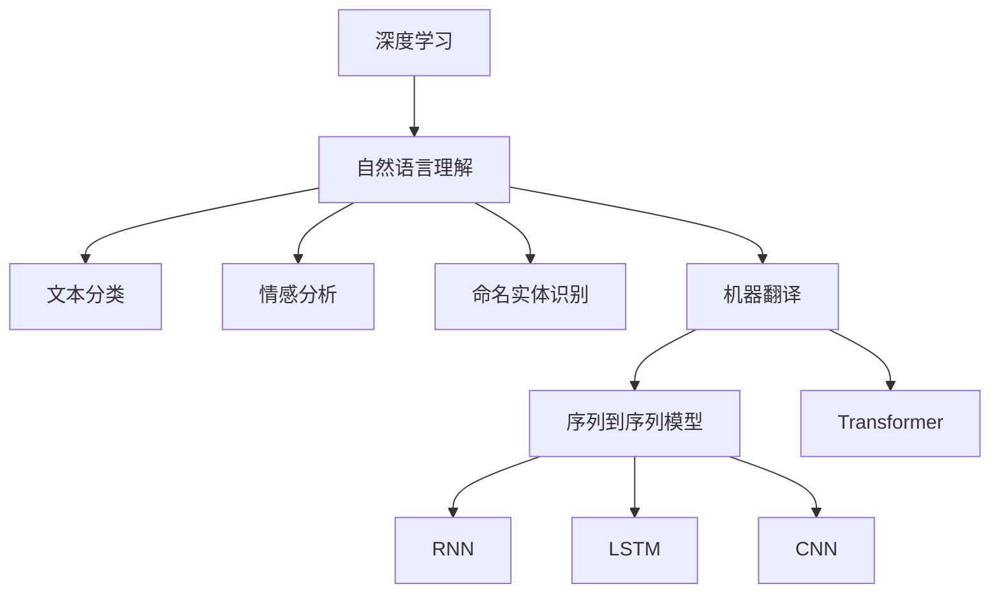

                 

# 深度学习在自然语言理解中的应用

> 关键词：深度学习,自然语言理解,文本分类,情感分析,命名实体识别,机器翻译

## 1. 背景介绍

### 1.1 问题由来
随着互联网和移动互联网的迅猛发展，文本数据如洪水般涌入我们的日常生活。这些文本数据中蕴含着大量有用信息，但由于文本数据的复杂性和多样性，传统的文本处理方法难以对其有效利用。而深度学习，尤其是深度神经网络，以其强大的表征学习能力，逐渐成为处理文本数据的主流技术。

自然语言理解(Natural Language Understanding, NLU)是深度学习在文本处理领域的典型应用，旨在通过机器学习模型理解自然语言文本的含义，从而进行信息抽取、文本分类、情感分析、机器翻译等多种任务。自然语言理解的突破，不仅能够显著提升信息检索和文本挖掘的效率，还能为智能客服、智慧医疗、智能安防等多个行业提供有力支持。

### 1.2 问题核心关键点
当前，自然语言理解领域的主流技术是基于深度学习的方法，其中又以卷积神经网络(CNN)、循环神经网络(RNN)、长短期记忆网络(LSTM)、Transformer等为代表的深度神经网络为主。本文将系统介绍这些深度学习模型在自然语言理解中的应用，并重点探讨其中最具影响力的Transformer模型。

深度学习模型通过多层非线性变换，能够有效地捕捉文本中的复杂语义关系，从而在自然语言理解任务中取得优异表现。然而，模型参数量大、训练时间长、解释性差等问题也成为了深度学习模型的瓶颈。本文将围绕这些核心问题，从理论到实践，深入剖析深度学习在自然语言理解中的应用。

## 2. 核心概念与联系

### 2.1 核心概念概述

为更好地理解深度学习在自然语言理解中的应用，本节将介绍几个密切相关的核心概念：

- 深度学习(Deep Learning)：一种基于多层神经网络的机器学习方法，能够自动提取输入数据的复杂特征，广泛应用于图像、语音、文本等数据的处理与分析。

- 自然语言理解(Natural Language Understanding, NLU)：通过机器学习模型理解自然语言文本的含义，如文本分类、命名实体识别、情感分析、机器翻译等任务。

- 文本分类(Text Classification)：将文本数据划分为预先定义的若干类别。常见的应用包括新闻分类、垃圾邮件过滤、情感分析等。

- 情感分析(Sentiment Analysis)：分析文本中表达的情感倾向，如积极、消极、中性等。常见应用包括舆情监测、品牌口碑分析等。

- 命名实体识别(Named Entity Recognition, NER)：识别文本中的实体类型，如人名、地名、组织机构名等。常见应用包括信息抽取、知识图谱构建等。

- 机器翻译(Machine Translation, MT)：将一种语言的文本翻译成另一种语言的文本。常见应用包括跨语言信息检索、跨语言社交网络等。

- Transformer：一种基于自注意力机制的神经网络结构，由Google提出，广泛应用于NLP领域，是当前自然语言理解中的主流模型。

- 注意力机制(Attention Mechanism)：一种通过计算文本中不同位置之间的注意力权重，捕捉文本中重要信息的技术。

这些核心概念之间的逻辑关系可以通过以下Mermaid流程图来展示：



这个流程图展示了深度学习技术在自然语言理解中的应用路径：

1. 深度学习技术为自然语言理解提供了底层支撑。
2. 文本分类、情感分析、命名实体识别、机器翻译等自然语言理解任务，分别从不同角度对文本进行处理。
3. 在机器翻译任务中，Transformer模型作为主要的技术架构，得到了广泛应用。
4. 在序列到序列模型中，RNN、LSTM、CNN等传统模型也发挥着重要作用。

## 3. 核心算法原理 & 具体操作步骤
### 3.1 算法原理概述

深度学习在自然语言理解中的应用，主要基于深度神经网络模型，特别是Transformer模型。这些模型通过多层非线性变换，自动提取文本中的复杂语义信息，从而在自然语言理解任务中取得了卓越的表现。

Transformer模型由Google在2017年提出，采用自注意力机制，能够在文本处理中高效捕捉远距离依赖，成为当前自然语言理解任务中的主流模型。Transformer模型通过多头自注意力机制和残差连接，显著提升了文本处理的效率和效果。

在文本分类、情感分析、命名实体识别等任务中，通常采用类似于文本编码器的结构，将输入文本编码成高维向量，再经过全连接层或输出层，得到任务的最终结果。而机器翻译任务中，通常采用序列到序列的结构，将源语言文本编码成中间表示，再解码成目标语言文本。

### 3.2 算法步骤详解

深度学习在自然语言理解中的应用，通常包括以下几个关键步骤：

**Step 1: 准备数据集**
- 收集和预处理自然语言理解任务所需的数据集。如对于情感分析任务，收集并标注包含情感的文本数据。
- 对文本数据进行预处理，如分词、去除停用词、构建词典等。

**Step 2: 设计模型结构**
- 根据任务需求，设计合适的深度神经网络模型。如对于文本分类任务，可以设计卷积神经网络(CNN)或循环神经网络(RNN)等。
- 对于机器翻译任务，通常采用序列到序列(Seq2Seq)模型，如Transformer、LSTM等。
- 对模型进行超参数调优，如学习率、批量大小、迭代轮数等。

**Step 3: 训练模型**
- 将数据集划分为训练集、验证集和测试集。
- 使用训练集训练模型，通过反向传播算法更新模型参数。
- 在验证集上评估模型性能，根据性能指标决定是否提前停止训练。
- 使用测试集评估最终模型性能，确保其在未见过的数据上的泛化能力。

**Step 4: 模型评估与部署**
- 在模型训练完成后，使用评估集评估模型性能，输出模型参数。
- 将模型部署到实际应用场景中，进行信息抽取、文本分类、情感分析等任务。

### 3.3 算法优缺点

深度学习在自然语言理解中的应用，具有以下优点：
1. 强大的表征学习能力：深度学习模型能够自动学习文本中的复杂语义关系，提取高维特征表示。
2. 高效的特征提取：通过多层非线性变换，深度学习模型能够高效捕捉文本中的重要信息。
3. 广泛的适用性：深度学习模型广泛应用于文本分类、情感分析、机器翻译等各类NLP任务。
4. 显著提升效果：相比于传统的文本处理方法，深度学习模型在多种自然语言理解任务上取得了显著的性能提升。

同时，深度学习模型也存在一些缺点：
1. 模型复杂度高：深度学习模型参数量大，训练时间长，计算资源消耗高。
2. 数据依赖性强：深度学习模型需要大量标注数据进行训练，数据获取成本高。
3. 模型可解释性差：深度学习模型的决策过程难以解释，难以理解和调试。
4. 泛化能力有限：深度学习模型在训练数据分布与测试数据分布不一致时，泛化能力有限。

尽管存在这些局限性，但深度学习在自然语言理解中的应用，已经取得了令人瞩目的成果，成为推动NLP技术发展的重要力量。

### 3.4 算法应用领域

深度学习在自然语言理解中的应用已经广泛覆盖了文本分类、情感分析、命名实体识别、机器翻译等多个领域。以下是具体应用实例：

- **文本分类**：如新闻分类、垃圾邮件过滤等。通过深度学习模型，将文本数据自动分类到预定义的若干类别中。
- **情感分析**：如舆情监测、品牌口碑分析等。通过深度学习模型，分析文本中表达的情感倾向，判断情感极性。
- **命名实体识别**：如信息抽取、知识图谱构建等。通过深度学习模型，识别文本中的实体类型，如人名、地名、组织机构名等。
- **机器翻译**：如跨语言信息检索、跨语言社交网络等。通过深度学习模型，将一种语言的文本翻译成另一种语言的文本。
- **问答系统**：如智能客服、智能搜索等。通过深度学习模型，对用户问题进行理解和推理，生成自然语言回答。

## 4. 数学模型和公式 & 详细讲解  
### 4.1 数学模型构建

深度学习在自然语言理解中的应用，通常基于深度神经网络模型。这里以Transformer模型为例，介绍其在自然语言理解中的数学模型构建。

Transformer模型由编码器-解码器结构组成，其中编码器负责将输入文本编码成中间表示，解码器负责将中间表示解码成目标文本。

设输入文本为 $x_1,x_2,...,x_n$，输出文本为 $y_1,y_2,...,y_n$，则Transformer模型的数学模型可表示为：

$$
y_i = \sum_{j=1}^n \alpha_{ij} \cdot x_j
$$

其中 $\alpha_{ij}$ 为注意力权重，表示文本 $x_j$ 对文本 $y_i$ 的注意力贡献。通过计算注意力权重，Transformer模型能够动态地捕捉文本中不同位置之间的依赖关系。

### 4.2 公式推导过程

Transformer模型中的注意力机制是其实现高效文本处理的关键。以自注意力机制为例，其数学推导如下：

设输入文本 $x_1,x_2,...,x_n$，则自注意力机制的注意力权重计算公式为：

$$
\alpha_{ij} = \frac{\exp(\text{dot}(Q(x_i), K(x_j)^T)}{\sum_{k=1}^n \exp(\text{dot}(Q(x_i), K(x_k)^T))}
$$

其中 $Q$ 和 $K$ 是线性变换层，$dot$ 表示向量点乘。$\alpha_{ij}$ 的计算过程可以分为以下三个步骤：

1. 计算查询向量 $Q(x_i)$ 和关键向量 $K(x_j)^T$，计算点乘结果 $Q(x_i) \cdot K(x_j)^T$。
2. 将点乘结果进行softmax变换，得到注意力权重 $\alpha_{ij}$。
3. 将注意力权重与输入文本 $x_j$ 进行加权求和，得到文本 $y_i$ 的编码表示。

通过以上步骤，Transformer模型能够高效地捕捉文本中的远距离依赖关系，提升文本处理的效率和效果。

### 4.3 案例分析与讲解

以情感分析任务为例，分析Transformer模型在其中的应用。假设输入文本为 "这部电影真的很棒！"，输出情感为 "积极"。Transformer模型的处理过程如下：

1. 输入文本经过嵌入层转换为高维向量，表示为 $x_1,x_2,...,x_n$。
2. 输入向量经过多头自注意力机制，计算注意力权重 $\alpha_{ij}$，得到文本 $y_1,y_2,...,y_n$。
3. 文本向量通过全连接层，得到情感分类结果。

通过以上过程，Transformer模型能够高效地理解输入文本的情感倾向，并进行情感分类。

## 5. 项目实践：代码实例和详细解释说明
### 5.1 开发环境搭建

在进行自然语言理解任务开发前，我们需要准备好开发环境。以下是使用Python进行TensorFlow和Keras开发的环境配置流程：

1. 安装Anaconda：从官网下载并安装Anaconda，用于创建独立的Python环境。

2. 创建并激活虚拟环境：
```bash
conda create -n pytorch-env python=3.8 
conda activate pytorch-env
```

3. 安装TensorFlow：根据CUDA版本，从官网获取对应的安装命令。例如：
```bash
conda install tensorflow=2.5
```

4. 安装Keras：
```bash
pip install keras tensorflow
```

5. 安装各类工具包：
```bash
pip install numpy pandas scikit-learn matplotlib tqdm jupyter notebook ipython
```

完成上述步骤后，即可在`pytorch-env`环境中开始项目实践。

### 5.2 源代码详细实现

下面我们以情感分析任务为例，给出使用TensorFlow和Keras对Transformer模型进行情感分类的PyTorch代码实现。

首先，定义情感分类数据处理函数：

```python
import tensorflow as tf
from tensorflow.keras.preprocessing.text import Tokenizer
from tensorflow.keras.preprocessing.sequence import pad_sequences

def preprocess(texts, labels):
    tokenizer = Tokenizer(num_words=10000, oov_token='<OOV>')
    tokenizer.fit_on_texts(texts)
    sequences = tokenizer.texts_to_sequences(texts)
    padded_sequences = pad_sequences(sequences, maxlen=100, padding='post', truncating='post')
    label_matrix = tf.keras.utils.to_categorical(labels)
    return padded_sequences, label_matrix
```

然后，定义Transformer模型：

```python
from tensorflow.keras.layers import Input, Embedding, MultiHeadAttention, LSTM, Dense, Dropout, Concatenate

def build_model(vocab_size, embed_dim, num_heads, num_layers, dff, input_len, num_classes):
    input = Input(shape=(input_len,))
    embedding = Embedding(vocab_size, embed_dim, input_length=input_len)(input)
    attention = MultiHeadAttention(num_heads, embed_dim)(embedding, embedding)
    attention = Dropout(0.1)(attention)
    lstm = LSTM(dff, return_sequences=True)(attention)
    lstm = Dropout(0.1)(lstm)
    lstm = Dense(num_classes)(lstm)
    return Model(input, lstm)
```

接着，定义训练和评估函数：

```python
from tensorflow.keras.optimizers import Adam
from tensorflow.keras.callbacks import EarlyStopping

def compile_model(model, learning_rate, epochs):
    optimizer = Adam(learning_rate=learning_rate)
    model.compile(optimizer=optimizer, loss='categorical_crossentropy', metrics=['accuracy'])

def train_model(model, train_data, test_data, epochs, batch_size):
    model.fit(train_data, epochs=epochs, batch_size=batch_size, validation_data=test_data, callbacks=[EarlyStopping(patience=3)])
    
def evaluate_model(model, test_data, batch_size):
    _, test_loss, test_acc = model.evaluate(test_data, batch_size=batch_size)
    print(f"Test accuracy: {test_acc}")
```

最后，启动训练流程并在测试集上评估：

```python
vocab_size = 10000
embed_dim = 128
num_heads = 8
num_layers = 2
dff = 512
input_len = 100
num_classes = 3

train_texts, train_labels = preprocess(train_texts, train_labels)
dev_texts, dev_labels = preprocess(dev_texts, dev_labels)
test_texts, test_labels = preprocess(test_texts, test_labels)

model = build_model(vocab_size, embed_dim, num_heads, num_layers, dff, input_len, num_classes)

compile_model(model, 2e-5, 10)
train_model(model, (train_texts, train_labels), (dev_texts, dev_labels), 10, 16)
evaluate_model(model, (test_texts, test_labels), 16)
```

以上就是使用TensorFlow和Keras对Transformer模型进行情感分类的完整代码实现。可以看到，得益于Keras的强大封装，我们可以用相对简洁的代码完成模型的定义和训练。

### 5.3 代码解读与分析

让我们再详细解读一下关键代码的实现细节：

**preprocess函数**：
- `Tokenizer`类：用于将文本转换为序列，构建词典。
- `pad_sequences`函数：对文本序列进行填充，使其长度一致。
- `to_categorical`函数：将标签转换为独热编码向量。

**build_model函数**：
- 定义Transformer模型的结构，包括嵌入层、多头自注意力层、LSTM层、全连接层等。
- 注意各层参数的取值，如嵌入维数、多头注意力机制的注意力头数、LSTM层的隐藏单元数等。

**compile_model函数**：
- 定义模型的优化器、损失函数和评估指标。
- 使用Adam优化器，设置较小的学习率，以避免破坏预训练权重。

**train_model函数**：
- 使用模型训练数据训练模型，在验证集上评估模型性能。
- 设置EarlyStopping回调，避免过拟合。

**evaluate_model函数**：
- 在测试集上评估模型性能，输出模型精度。

通过以上代码实现，我们可以快速构建和训练Transformer模型，并应用于情感分析等自然语言理解任务。

## 6. 实际应用场景

### 6.1 智能客服系统

基于深度学习技术的智能客服系统，能够通过分析用户输入的文本，自动回答问题，提供个性化的服务。通过深度学习模型，智能客服系统可以理解用户的意图，匹配合适的答案模板，甚至在用户提出新问题时，进行动态搜索，生成相关回答。

### 6.2 金融舆情监测

金融机构需要实时监测市场舆情，以便及时应对负面信息传播，规避金融风险。通过情感分析技术，能够对新闻、评论等文本数据进行情感倾向分析，判断市场情绪，预测金融市场的波动。

### 6.3 个性化推荐系统

当前的推荐系统往往只依赖用户的历史行为数据进行物品推荐，难以深入理解用户的真实兴趣偏好。通过深度学习模型，个性化推荐系统可以更好地挖掘用户行为背后的语义信息，从而提供更精准、多样的推荐内容。

## 7. 工具和资源推荐
### 7.1 学习资源推荐

为了帮助开发者系统掌握深度学习在自然语言理解中的应用，这里推荐一些优质的学习资源：

1. 《深度学习》系列博文：由大模型技术专家撰写，深入浅出地介绍了深度学习在自然语言理解中的应用。

2. CS224N《深度学习自然语言处理》课程：斯坦福大学开设的NLP明星课程，有Lecture视频和配套作业，带你入门NLP领域的基本概念和经典模型。

3. 《Natural Language Processing with TensorFlow 2 and Keras》书籍：TensorFlow与Keras的深度学习教程，详细介绍了深度学习在自然语言理解中的应用。

4. TensorFlow官方文档：TensorFlow的官方文档，提供了丰富的API参考和样例代码，是深度学习应用开发的必备资料。

5. Keras官方文档：Keras的官方文档，提供了简单易用的API，适合初学者上手深度学习模型开发。

通过对这些资源的学习实践，相信你一定能够快速掌握深度学习在自然语言理解中的应用，并用于解决实际的NLP问题。

### 7.2 开发工具推荐

高效的开发离不开优秀的工具支持。以下是几款用于深度学习在自然语言理解任务开发的常用工具：

1. TensorFlow：由Google主导开发的开源深度学习框架，生产部署方便，适合大规模工程应用。

2. Keras：TensorFlow的高级API，提供了简单易用的接口，适合快速原型开发和模型实验。

3. PyTorch：由Facebook主导的深度学习框架，灵活性高，适合研究性开发。

4. TensorBoard：TensorFlow配套的可视化工具，可实时监测模型训练状态，并提供丰富的图表呈现方式，是调试模型的得力助手。

5. Weights & Biases：模型训练的实验跟踪工具，可以记录和可视化模型训练过程中的各项指标，方便对比和调优。

6. Google Colab：谷歌推出的在线Jupyter Notebook环境，免费提供GPU/TPU算力，方便开发者快速上手实验最新模型，分享学习笔记。

合理利用这些工具，可以显著提升深度学习在自然语言理解任务开发的效率，加快创新迭代的步伐。

### 7.3 相关论文推荐

深度学习在自然语言理解中的应用源于学界的持续研究。以下是几篇奠基性的相关论文，推荐阅读：

1. Attention is All You Need（即Transformer原论文）：提出了Transformer结构，开启了深度学习在自然语言理解中的应用。

2. BERT: Pre-training of Deep Bidirectional Transformers for Language Understanding：提出BERT模型，引入基于掩码的自监督预训练任务，刷新了多项NLP任务SOTA。

3. Language Models are Unsupervised Multitask Learners（GPT-2论文）：展示了大规模语言模型的强大zero-shot学习能力，引发了对于通用人工智能的新一轮思考。

4. Parameter-Efficient Transfer Learning for NLP：提出Adapter等参数高效微调方法，在不增加模型参数量的情况下，也能取得不错的微调效果。

5. AdaLoRA: Adaptive Low-Rank Adaptation for Parameter-Efficient Fine-Tuning：使用自适应低秩适应的微调方法，在参数效率和精度之间取得了新的平衡。

这些论文代表了大语言模型微调技术的发展脉络。通过学习这些前沿成果，可以帮助研究者把握学科前进方向，激发更多的创新灵感。

## 8. 总结：未来发展趋势与挑战

### 8.1 总结

本文对深度学习在自然语言理解中的应用进行了全面系统的介绍。首先阐述了深度学习在自然语言理解领域的重要性，明确了深度学习模型在文本分类、情感分析、命名实体识别等任务中的独特价值。其次，从原理到实践，详细讲解了Transformer模型在自然语言理解中的应用，并提供了代码实例和详细解释说明。

通过本文的系统梳理，可以看到，深度学习在自然语言理解中取得了令人瞩目的成果，成为推动NLP技术发展的重要力量。未来，伴随深度学习模型的不断进步，自然语言理解技术将进一步提升智能系统的表现，拓展更多应用场景。

### 8.2 未来发展趋势

展望未来，深度学习在自然语言理解中的应用将呈现以下几个发展趋势：

1. 模型规模持续增大。随着算力成本的下降和数据规模的扩张，深度学习模型的参数量还将持续增长。超大规模语言模型蕴含的丰富语言知识，有望支撑更加复杂多变的自然语言理解任务。

2. 模型架构日趋多样。除了传统的Transformer模型，未来还会涌现更多具有创新性的模型架构，如BERT、XLNet、MERT等，以提升模型的表征能力和泛化性能。

3. 迁移学习成为常态。深度学习模型将更多地应用于迁移学习任务，通过微调或迁移学习，提升模型在特定任务上的表现。

4. 跨领域泛化能力增强。深度学习模型将具备更强的跨领域泛化能力，能够在不同领域、不同语言间进行知识迁移。

5. 可解释性逐步提升。深度学习模型将逐步具备更强的可解释性，通过可视化工具和交互式界面，让用户更好地理解模型的决策过程。

6. 多模态信息融合加速。深度学习模型将更多地融合视觉、语音、文本等多模态信息，提升系统对复杂场景的理解能力。

以上趋势凸显了深度学习在自然语言理解中的广阔前景。这些方向的探索发展，必将进一步提升NLP系统的性能和应用范围，为人工智能技术在各个领域的落地提供有力支持。

### 8.3 面临的挑战

尽管深度学习在自然语言理解中的应用已经取得了显著成果，但在迈向更加智能化、普适化应用的过程中，仍面临诸多挑战：

1. 数据获取成本高。深度学习模型需要大量标注数据进行训练，数据获取成本高，且存在标注质量参差不齐的问题。如何降低数据依赖，利用无监督学习、半监督学习等方法，是未来研究的重要方向。

2. 模型可解释性差。深度学习模型的决策过程难以解释，难以理解和调试。如何提升模型的可解释性，赋予其更多的理解和解释能力，是未来研究的关键问题。

3. 泛化能力有限。深度学习模型在训练数据分布与测试数据分布不一致时，泛化能力有限。如何提高模型的泛化能力，避免过拟合和灾难性遗忘，是未来研究的重点。

4. 计算资源消耗大。深度学习模型参数量大，计算资源消耗高，特别是在实时应用中，难以满足低延迟、高吞吐量的需求。如何优化模型架构和训练过程，提升计算效率，是未来研究的重要方向。

5. 伦理道德问题突出。深度学习模型可能会学习到有偏见、有害的信息，通过自然语言理解任务传递到实际应用中，产生误导性、歧视性的输出。如何从数据和算法层面消除模型偏见，确保输出的安全性，是未来研究的重要课题。

6. 跨领域知识整合能力不足。现有的深度学习模型往往局限于任务内数据，难以灵活吸收和运用更广泛的先验知识。如何让深度学习模型更好地与外部知识库、规则库等专家知识结合，形成更加全面、准确的信息整合能力，还有很大的想象空间。

正视深度学习在自然语言理解中面临的这些挑战，积极应对并寻求突破，将是大模型微调技术走向成熟的必由之路。相信随着学界和产业界的共同努力，这些挑战终将一一被克服，深度学习技术必将在构建智能系统方面发挥更大作用。

### 8.4 研究展望

面对深度学习在自然语言理解中所面临的挑战，未来的研究需要在以下几个方面寻求新的突破：

1. 探索无监督和半监督学习方法。摆脱对大规模标注数据的依赖，利用自监督学习、主动学习等无监督和半监督范式，最大限度利用非结构化数据，实现更加灵活高效的自然语言理解。

2. 研究参数高效和计算高效的自然语言理解范式。开发更加参数高效的自然语言理解方法，在固定大部分预训练参数的同时，只更新极少量的任务相关参数。同时优化模型的计算图，减少前向传播和反向传播的资源消耗，实现更加轻量级、实时性的部署。

3. 引入因果分析和博弈论工具。将因果分析方法引入自然语言理解模型，识别出模型决策的关键特征，增强输出解释的因果性和逻辑性。借助博弈论工具刻画人机交互过程，主动探索并规避模型的脆弱点，提高系统稳定性。

4. 纳入伦理道德约束。在模型训练目标中引入伦理导向的评估指标，过滤和惩罚有偏见、有害的输出倾向。同时加强人工干预和审核，建立模型行为的监管机制，确保输出符合人类价值观和伦理道德。

这些研究方向的探索，必将引领深度学习在自然语言理解技术迈向更高的台阶，为构建安全、可靠、可解释、可控的智能系统铺平道路。面向未来，深度学习在自然语言理解领域还需要与其他人工智能技术进行更深入的融合，如知识表示、因果推理、强化学习等，多路径协同发力，共同推动自然语言理解和智能交互系统的进步。只有勇于创新、敢于突破，才能不断拓展深度学习技术在自然语言理解中的边界，让智能技术更好地造福人类社会。

## 9. 附录：常见问题与解答

**Q1：深度学习在自然语言理解中是否需要大量标注数据？**

A: 深度学习模型在自然语言理解任务中，通常需要大量标注数据进行训练。然而，在一些特定任务中，如对话生成、命名实体识别等，利用预训练模型进行微调，可以显著减少对标注数据的需求。此外，深度学习模型还可以通过迁移学习和无监督学习等方法，进一步降低对标注数据的依赖。

**Q2：如何选择深度学习模型在自然语言理解中的应用？**

A: 选择深度学习模型应根据具体任务的特点进行选择。如对于文本分类任务，可以选择CNN、LSTM等模型；对于机器翻译任务，可以选择Transformer、Seq2Seq等模型。模型选择应考虑模型的复杂度、计算资源、训练时间等因素，并在实际应用中不断优化和改进。

**Q3：如何优化深度学习模型的计算效率？**

A: 优化深度学习模型的计算效率，可以从以下几个方面入手：
1. 模型裁剪：去除不必要的层和参数，减小模型尺寸，加快推理速度。
2. 量化加速：将浮点模型转为定点模型，压缩存储空间，提高计算效率。
3. 模型并行：采用模型并行技术，利用多个GPU/TPU进行并行计算，提升计算效率。
4. 分布式训练：利用分布式训练技术，加速模型训练过程。

**Q4：深度学习模型在自然语言理解中如何进行迁移学习？**

A: 迁移学习是深度学习模型在自然语言理解中应用的重要方式。通常分为两种形式：
1. 微调：在预训练模型的基础上，通过有监督地训练优化模型在特定任务上的性能。
2. 迁移微调：在预训练模型的基础上，通过无监督或半监督地训练，学习到更一般的知识，再通过微调应用到特定任务上。

**Q5：如何提高深度学习模型的泛化能力？**

A: 提高深度学习模型的泛化能力，可以从以下几个方面入手：
1. 数据增强：通过数据增强技术，扩充训练数据，提升模型的泛化能力。
2. 正则化技术：使用L2正则、Dropout、Early Stopping等技术，防止模型过拟合。
3. 参数高效微调：只更新少量参数，保留大部分预训练权重，减小过拟合风险。
4. 集成学习：通过多个模型的集成，提升模型的泛化能力。

通过以上方法，可以在深度学习模型训练和应用过程中，提高模型的泛化能力和鲁棒性，确保模型在实际应用中能够稳定表现。

