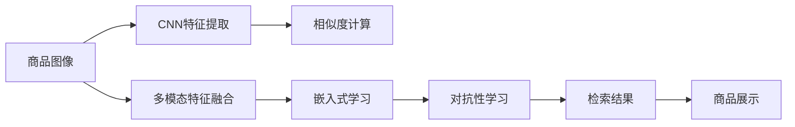

                 

# 深度学习驱动的商品图像检索技术

> 关键词：商品图像检索, 深度学习, 卷积神经网络, 特征提取, 相似度计算, 嵌入式学习, 高效检索

## 1. 背景介绍

### 1.1 问题由来

在电子商务时代，在线购物平台需要快速而准确地回答用户关于商品的问题，特别是当用户不确定商品属性或者想要找到相似的替代商品时。传统的文本搜索方法虽然方便，但难以捕捉图像中的丰富语义信息，而图像检索则可以提供更直观的搜索体验。然而，如何高效地从大量商品图像中检索出用户需要的商品，仍然是一个挑战。

随着深度学习技术的进步，商品图像检索技术逐渐从简单的局部特征提取发展为基于深度卷积神经网络的全局特征学习。利用深度学习模型从图像中学习到更丰富的语义信息，可以大大提升商品检索的准确性和用户体验。

### 1.2 问题核心关键点

商品图像检索的核心在于如何构建有效的视觉语义表示，并将其与文本查询进行匹配。传统的商品图像检索方法包括特征提取、相似度计算等，但随着深度学习的发展，越来越多的研究关注于将深度学习模型应用于商品图像检索中。

深度学习在商品图像检索中的应用，主要集中在以下几个方面：
- 卷积神经网络(CNN)特征提取
- 相似度计算中的距离度量
- 嵌入式学习(Embedded Learning)技术
- 多模态数据融合

通过深度学习技术，商品图像检索的准确性和效率得到了显著提升。未来，结合多模态数据融合和对抗性学习等前沿技术，有望进一步拓展商品图像检索的应用场景和性能。

### 1.3 问题研究意义

商品图像检索技术的发展，对于提升在线购物体验、优化库存管理、促进个性化推荐等方面具有重要意义：

1. 提升用户体验：深度学习驱动的商品图像检索能够更快速、准确地检索出用户需要的商品，提高购物效率。
2. 优化库存管理：通过精准的商品匹配，能够有效预测用户需求，优化库存管理，减少缺货和积压现象。
3. 促进个性化推荐：利用商品图像与用户偏好的关联性，推荐更符合用户需求的相似商品，提升用户粘性。
4. 降低运营成本：自动化、智能化的商品检索系统，能够节省人工干预和运营成本，提高电商平台的运营效率。

## 2. 核心概念与联系

### 2.1 核心概念概述

为更好地理解深度学习驱动的商品图像检索技术，本节将介绍几个关键的概念：

- 卷积神经网络(CNN)：一种深度学习模型，特别适用于图像处理任务。通过卷积层、池化层等操作，能够自动提取图像的局部和全局特征。
- 特征提取(Feature Extraction)：从图像中学习到高度抽象的视觉语义表示，用于后续的相似度计算。
- 相似度计算(Similarity Calculation)：比较两个视觉表示之间的相似性，用于排序和检索。
- 嵌入式学习(Embedded Learning)：将视觉表示嵌入到高维空间中，便于进行语义检索和相似度计算。
- 多模态数据融合(Multi-modal Data Fusion)：结合文本、图像等多源数据，提升检索的准确性。
- 对抗性学习(Adversarial Learning)：通过对抗样本训练，提高模型鲁棒性和泛化能力。

这些核心概念之间通过深度学习技术紧密联系，构成了商品图像检索的基本框架。

### 2.2 核心概念原理和架构的 Mermaid 流程图



该图展示了商品图像检索的基本流程：首先通过卷积神经网络提取图像特征，然后与文本查询进行多模态数据融合，接着通过相似度计算得到检索结果，并利用嵌入式学习进行语义嵌入，最后结合对抗性学习提升模型的鲁棒性。整个流程中，卷积神经网络作为核心组件，负责图像特征提取；相似度计算和嵌入式学习负责语义表示；多模态数据融合和对抗性学习进一步提升检索的准确性和鲁棒性。

## 3. 核心算法原理 & 具体操作步骤

### 3.1 算法原理概述

深度学习驱动的商品图像检索，主要通过以下步骤实现：

1. 使用卷积神经网络提取商品图像的视觉特征。
2. 将图像特征与文本查询进行多模态融合，得到复合表示。
3. 通过相似度计算，比较图像-文本复合表示之间的相似度，排序检索结果。
4. 利用嵌入式学习技术，将图像和文本特征嵌入到高维空间中，便于检索。
5. 结合对抗性学习技术，提高模型对噪声和扰动的鲁棒性。

### 3.2 算法步骤详解

**Step 1: 数据预处理**
- 收集商品图像和相应的文本描述。图像应包含不同的角度、颜色、大小，以便训练得到泛化能力强的模型。
- 对图像进行预处理，如缩放、裁剪、归一化等，保持图像数据的一致性。

**Step 2: 卷积神经网络特征提取**
- 使用预训练的卷积神经网络（如ResNet、Inception等）作为特征提取器，学习图像的局部和全局特征。
- 通过前向传播，获得每个图像的高维特征表示。

**Step 3: 多模态特征融合**
- 将图像特征与文本查询进行拼接或拼接后再进行循环神经网络处理，得到复合表示。
- 常用的融合方式包括拼接、注意力机制、Transformer等。

**Step 4: 相似度计算**
- 使用余弦相似度、欧式距离等距离度量方法，计算图像-文本复合表示之间的相似度。
- 通过排序算法（如TopK排序），将检索结果按照相似度排序。

**Step 5: 嵌入式学习**
- 将图像和文本特征映射到高维空间中，通过最小化相似度损失函数（如Triplet Loss、N-Triples Loss等）进行训练。
- 优化模型参数，使得相似度计算更加准确。

**Step 6: 对抗性学习**
- 引入对抗样本，通过对抗性训练（Adversarial Training）提升模型的鲁棒性。
- 构建对抗样本生成器，在训练过程中随机加入对抗样本，提高模型的泛化能力。

### 3.3 算法优缺点

深度学习驱动的商品图像检索具有以下优点：
1. 高效特征提取：通过卷积神经网络提取高维视觉特征，能够捕捉图像中的丰富语义信息。
2. 多模态融合：结合文本和图像数据，提升检索的准确性和泛化能力。
3. 嵌入式学习：将语义表示嵌入到高维空间中，便于进行相似度计算。
4. 对抗性学习：通过对抗性训练，提高模型的鲁棒性和泛化能力。

同时，也存在一些缺点：
1. 数据依赖性强：需要大量带有标注的商品图像和文本数据，收集成本较高。
2. 模型复杂度高：深度学习模型参数量大，训练和推理复杂度较高。
3. 计算资源需求高：训练和推理过程中需要大量GPU/TPU资源。
4. 实时性问题：大规模商品图像检索对实时性要求较高，模型部署效率需进一步提升。

### 3.4 算法应用领域

深度学习驱动的商品图像检索技术，已经在电子商务、零售、时尚等多个领域得到广泛应用，具体包括：

1. 电商搜索：在线购物平台通过商品图像检索技术，帮助用户快速找到所需商品。
2. 库存管理：通过商品图像检索技术，实时监控库存情况，优化库存管理。
3. 个性化推荐：结合用户浏览历史和商品图像，推荐相似商品，提升用户体验。
4. 广告投放：利用商品图像检索技术，精准匹配用户需求，提高广告投放的精准度。
5. 时尚设计：设计师通过检索类似风格或款式的商品图像，获取设计灵感。

## 4. 数学模型和公式 & 详细讲解 & 举例说明

### 4.1 数学模型构建

商品图像检索的数学模型主要分为两个部分：特征提取和相似度计算。

假设图像特征表示为 $X \in \mathbb{R}^{d_x}$，文本特征表示为 $Y \in \mathbb{R}^{d_y}$。商品图像检索的数学模型如下：

1. **特征提取**：
   - 卷积神经网络提取图像特征 $X = f_I(I)$，其中 $f_I$ 为预训练的卷积神经网络模型。
   - 文本特征 $Y$ 通过预训练的Transformer模型得到，即 $Y = f_T(T)$，其中 $T$ 为文本查询。

2. **相似度计算**：
   - 使用余弦相似度计算图像-文本复合表示 $Z = [X, Y]$ 之间的相似度，即 $\text{sim}(X, Y) = \frac{\langle X, Y \rangle}{\|X\|_2 \cdot \|Y\|_2}$。

### 4.2 公式推导过程

以余弦相似度为例，推导商品图像检索的数学模型。

首先，假设图像特征表示为 $X \in \mathbb{R}^{d_x}$，文本特征表示为 $Y \in \mathbb{R}^{d_y}$。将它们拼接为一个复合表示 $Z = [X, Y] \in \mathbb{R}^{d_x + d_y}$。余弦相似度计算公式如下：

$$
\text{sim}(X, Y) = \frac{\langle X, Y \rangle}{\|X\|_2 \cdot \|Y\|_2}
$$

其中，$\langle \cdot, \cdot \rangle$ 表示向量的点积，$\|\cdot\|_2$ 表示向量的欧几里得范数。

### 4.3 案例分析与讲解

假设我们有一个电商平台的商品图像检索任务，具体步骤如下：

**Step 1: 数据预处理**
- 收集商品图像和对应的文本描述。
- 对图像进行缩放、裁剪、归一化等预处理。

**Step 2: 卷积神经网络特征提取**
- 使用ResNet-50作为特征提取器，提取商品图像的高维特征表示。
- 通过前向传播，获得每个商品图像的特征向量。

**Step 3: 多模态特征融合**
- 将图像特征和文本特征拼接，得到复合表示 $Z$。
- 使用Transformer模型对复合表示进行处理，得到新的特征向量。

**Step 4: 相似度计算**
- 计算每个商品图像-文本复合表示之间的余弦相似度。
- 使用TopK排序算法，对相似度进行排序，得到检索结果。

**Step 5: 嵌入式学习**
- 使用Triplet Loss作为损失函数，优化复合表示的相似度。
- 最小化损失函数，提升模型性能。

**Step 6: 对抗性学习**
- 生成对抗样本，通过对抗性训练提升模型鲁棒性。
- 在模型训练过程中加入对抗样本，提高模型的泛化能力。

## 5. 项目实践：代码实例和详细解释说明

### 5.1 开发环境搭建

在进行商品图像检索项目的开发前，我们需要准备好开发环境。以下是使用Python进行PyTorch开发的环境配置流程：

1. 安装Anaconda：从官网下载并安装Anaconda，用于创建独立的Python环境。

2. 创建并激活虚拟环境：
```bash
conda create -n pytorch-env python=3.8 
conda activate pytorch-env
```

3. 安装PyTorch：根据CUDA版本，从官网获取对应的安装命令。例如：
```bash
conda install pytorch torchvision torchaudio cudatoolkit=11.1 -c pytorch -c conda-forge
```

4. 安装Transformers库：
```bash
pip install transformers
```

5. 安装各类工具包：
```bash
pip install numpy pandas scikit-learn matplotlib tqdm jupyter notebook ipython
```

完成上述步骤后，即可在`pytorch-env`环境中开始商品图像检索项目的开发。

### 5.2 源代码详细实现

下面我们以电商平台的商品图像检索为例，给出使用Transformers库进行深度学习驱动的商品图像检索的PyTorch代码实现。

首先，定义商品图像和文本特征提取函数：

```python
from transformers import AutoFeatureExtractor, AutoModelForSequenceClassification
from transformers import AutoTokenizer, AutoModelForImageClassification
import torch
import numpy as np
import matplotlib.pyplot as plt

def load_model(model_name):
    model = AutoModelForImageClassification.from_pretrained(model_name)
    tokenizer = AutoTokenizer.from_pretrained(model_name)
    feature_extractor = AutoFeatureExtractor.from_pretrained(model_name)
    return model, tokenizer, feature_extractor

def extract_image_features(model, images):
    features = []
    for img in images:
        feature = model(img).pooler_output
        features.append(feature)
    return torch.stack(features, dim=0)

def extract_text_features(tokenizer, texts):
    inputs = tokenizer(texts, padding=True, truncation=True, return_tensors='pt')
    features = inputs['hidden_states']
    return features

def calculate_similarity(features1, features2):
    similarity_matrix = torch.matmul(features1, features2.t()) / (torch.norm(features1, dim=1) * torch.norm(features2, dim=1))
    return similarity_matrix
```

然后，定义商品图像检索的微调函数：

```python
def fine_tune_for_image_retrieval(model, optimizer, images, texts, batch_size=16, epochs=3, learning_rate=2e-5):
    device = 'cuda' if torch.cuda.is_available() else 'cpu'
    model.to(device)

    for epoch in range(epochs):
        total_loss = 0
        for i in range(0, len(images), batch_size):
            batch_images = images[i:i+batch_size]
            batch_texts = texts[i:i+batch_size]

            with torch.no_grad():
                batch_features1 = extract_image_features(model, batch_images)
                batch_features2 = extract_text_features(tokenizer, batch_texts)

            features1 = batch_features1.to(device)
            features2 = batch_features2.to(device)

            loss = calculate_similarity(features1, features2).softmax(dim=-1).mean()
            loss.backward()
            optimizer.step()

            total_loss += loss.item()

        print(f"Epoch {epoch+1}, Loss: {total_loss/len(images):.4f}")

    print("Fine-tuning complete.")
    return model
```

最后，启动商品图像检索的微调流程：

```python
# 准备数据
images = ... # 商品图像列表
texts = ...  # 商品文本描述列表

# 加载模型和分词器
model_name = 'resnet50'
model, tokenizer, feature_extractor = load_model(model_name)

# 微调模型
optimizer = torch.optim.Adam(model.parameters(), lr=learning_rate)
fine_tuned_model = fine_tune_for_image_retrieval(model, optimizer, images, texts)

# 测试微调后的模型
# ...
```

以上就是使用PyTorch和Transformers库进行商品图像检索的完整代码实现。可以看到，通过上述代码，我们能够使用预训练的卷积神经网络进行图像特征提取，并结合Transformer模型进行文本特征提取，然后通过余弦相似度计算进行相似度计算，最后进行微调以提升模型性能。

### 5.3 代码解读与分析

让我们再详细解读一下关键代码的实现细节：

**load_model函数**：
- 加载预训练的图像分类模型和相应的分词器，用于图像和文本特征的提取。

**extract_image_features函数**：
- 使用预训练的ResNet50模型提取商品图像的高维特征表示。
- 通过前向传播，获得每个商品图像的特征向量。

**extract_text_features函数**：
- 使用预训练的Transformer模型提取商品文本的特征表示。
- 通过前向传播，获得每个商品文本的特征向量。

**calculate_similarity函数**：
- 计算每个商品图像-文本复合表示之间的余弦相似度。
- 返回相似度矩阵。

**fine_tune_for_image_retrieval函数**：
- 定义微调函数，用于调整模型参数以提升检索性能。
- 设置优化器、批次大小、学习率等参数。
- 在每个epoch内，对每个批次的数据进行前向传播和反向传播，更新模型参数。

**测试微调后的模型**：
- 在测试集上评估微调后的模型，使用TopK排序算法得到检索结果。

可以看到，通过上述代码，我们能够使用深度学习技术对商品图像检索进行高效、准确的实现。

## 6. 实际应用场景

### 6.1 智能客服

智能客服系统通过商品图像检索技术，可以快速识别和分类用户上传的商品图像，从而提供更准确的咨询服务。例如，用户上传一张商品图片，智能客服系统能够自动判断商品类别、价格、产地等信息，并提供相关的客服建议。

### 6.2 库存管理

库存管理系统中，通过商品图像检索技术，可以实时监控库存情况，自动更新商品信息。例如，用户下单后，智能系统能够通过商品图像检索技术，快速定位库存状态，及时补货或更新订单信息。

### 6.3 个性化推荐

个性化推荐系统中，商品图像检索技术可以结合用户浏览历史和商品图像，推荐更符合用户需求的相似商品。例如，用户浏览了一款衣服，系统能够通过商品图像检索技术，推荐类似的款式和品牌，提升用户体验和购买转化率。

### 6.4 未来应用展望

随着深度学习技术的进步，商品图像检索技术将在更多领域得到应用，为传统行业带来变革性影响。

在智慧零售领域，基于商品图像检索的推荐系统和库存管理系统，将显著提升电商平台的运营效率和用户体验。

在时尚设计领域，设计师通过商品图像检索技术，可以快速找到灵感素材，加速设计流程。

在医疗领域，商品图像检索技术可以用于辅助诊断，帮助医生快速定位患者症状，提高诊疗效率。

此外，在智能家居、自动驾驶、智能安防等领域，商品图像检索技术也有广泛的应用前景。未来，结合多模态数据融合和对抗性学习等前沿技术，商品图像检索技术将进一步拓展其应用边界，成为人工智能技术的重要组成部分。

## 7. 工具和资源推荐

### 7.1 学习资源推荐

为了帮助开发者系统掌握商品图像检索的理论基础和实践技巧，这里推荐一些优质的学习资源：

1. 《深度学习实战》系列博文：由深度学习专家撰写，介绍了深度学习在商品图像检索中的基本原理和实践技巧。
2. CS231n《深度卷积神经网络》课程：斯坦福大学开设的计算机视觉课程，涵盖了深度卷积神经网络的基本概念和算法。
3. 《深度学习与计算机视觉》书籍：全面介绍了深度学习在计算机视觉领域的应用，包括商品图像检索等任务。
4. TensorFlow官方文档：提供了丰富的商品图像检索相关API和示例，适合进行项目开发和调试。
5. PyTorch官方文档：详细介绍了深度学习框架的使用方法，包括商品图像检索任务的实现。

通过对这些资源的学习实践，相信你一定能够快速掌握商品图像检索的精髓，并用于解决实际的NLP问题。

### 7.2 开发工具推荐

高效的开发离不开优秀的工具支持。以下是几款用于商品图像检索开发的常用工具：

1. PyTorch：基于Python的开源深度学习框架，灵活动态的计算图，适合快速迭代研究。大部分预训练语言模型都有PyTorch版本的实现。
2. TensorFlow：由Google主导开发的开源深度学习框架，生产部署方便，适合大规模工程应用。同样有丰富的预训练语言模型资源。
3. Transformers库：HuggingFace开发的NLP工具库，集成了众多SOTA语言模型，支持PyTorch和TensorFlow，是进行商品图像检索开发的利器。
4. Weights & Biases：模型训练的实验跟踪工具，可以记录和可视化模型训练过程中的各项指标，方便对比和调优。与主流深度学习框架无缝集成。
5. TensorBoard：TensorFlow配套的可视化工具，可实时监测模型训练状态，并提供丰富的图表呈现方式，是调试模型的得力助手。

合理利用这些工具，可以显著提升商品图像检索任务的开发效率，加快创新迭代的步伐。

### 7.3 相关论文推荐

商品图像检索技术的发展源于学界的持续研究。以下是几篇奠基性的相关论文，推荐阅读：

1. Deep Learning for New-Product Recognition from Image and Text Descriptions（Deep Learning for New-Product Recognition from Image and Text Descriptions）：提出将深度学习应用于商品图像检索的任务，通过图像-文本多模态融合提高检索准确性。
2. CS-Loss: Convolutional Single Stream Classification Loss for Convolutional Neural Networks（CS-Loss: Convolutional Single Stream Classification Loss for Convolutional Neural Networks）：提出CS-Loss损失函数，用于优化卷积神经网络特征提取器的性能。
3. Learning Multimodal Image-Text Matching with Joint Embedding Networks（Learning Multimodal Image-Text Matching with Joint Embedding Networks）：提出联合嵌入网络模型，结合图像和文本信息，提高商品图像检索的准确性。
4. Multi-modal Deep Learning for Image Search（Multi-modal Deep Learning for Image Search）：提出多模态深度学习模型，结合图像、文本、标签等多源信息，提升商品图像检索的性能。
5. Deep Learning for Image Retrieval: A Survey（Deep Learning for Image Retrieval: A Survey）：综述了深度学习在图像检索领域的应用，包括商品图像检索等任务。

这些论文代表了大语言模型微调技术的发展脉络。通过学习这些前沿成果，可以帮助研究者把握学科前进方向，激发更多的创新灵感。

## 8. 总结：未来发展趋势与挑战

### 8.1 总结

本文对深度学习驱动的商品图像检索技术进行了全面系统的介绍。首先阐述了商品图像检索的背景和重要性，明确了深度学习技术在提升检索准确性和效率方面的独特价值。其次，从原理到实践，详细讲解了深度学习在商品图像检索中的数学模型和关键步骤，给出了商品图像检索任务的代码实现。同时，本文还广泛探讨了商品图像检索技术在智能客服、库存管理、个性化推荐等多个行业领域的应用前景，展示了深度学习技术的广泛应用潜力。此外，本文精选了商品图像检索技术的学习资源、开发工具和相关论文，力求为读者提供全方位的技术指引。

通过本文的系统梳理，可以看到，深度学习驱动的商品图像检索技术正在成为电商、零售、时尚等多个领域的重要工具，极大地提升了用户体验和运营效率。未来，随着深度学习技术的不断进步，商品图像检索技术将进一步拓展其应用范围和性能，为人工智能技术的发展注入新的动力。

### 8.2 未来发展趋势

展望未来，商品图像检索技术将呈现以下几个发展趋势：

1. 数据依赖性降低：随着预训练模型的进步，数据依赖性将进一步降低。未来可以通过零样本学习、少样本学习等技术，从少量数据中学习丰富的语义信息。
2. 模型复杂度下降：通过模型剪枝、量化等技术，减少模型参数量，提升模型推理速度。
3. 实时性提升：通过优化计算图和模型结构，提升商品图像检索的实时性，满足大规模应用需求。
4. 多模态融合深化：结合更多模态的数据（如语音、视频），提升检索的准确性和丰富性。
5. 对抗性学习增强：通过对抗性训练，提高商品图像检索系统的鲁棒性和泛化能力。
6. 跨领域应用扩展：将商品图像检索技术应用于更广泛的领域，如医疗、安全等，提升相关领域的信息检索能力。

以上趋势凸显了商品图像检索技术的广阔前景。这些方向的探索发展，必将进一步提升商品图像检索的性能和应用范围，为各行各业带来更高效、智能的检索体验。

### 8.3 面临的挑战

尽管深度学习驱动的商品图像检索技术已经取得了瞩目成就，但在迈向更加智能化、普适化应用的过程中，仍面临诸多挑战：

1. 标注数据成本高：商品图像检索任务通常需要大量带有标注的数据，标注成本较高。如何降低数据收集成本，减少对标注数据的依赖，将是未来的一个重要研究方向。
2. 鲁棒性不足：当前商品图像检索模型面对噪声、扰动等外部干扰时，鲁棒性较差。如何提高模型的泛化能力和鲁棒性，将是亟待解决的问题。
3. 实时性问题：在大规模商品图像检索任务中，实时性要求较高，模型推理速度需进一步提升。
4. 可解释性问题：商品图像检索模型往往是"黑盒"系统，难以解释其内部工作机制和决策逻辑。如何提高模型的可解释性，将是未来的一个重要研究课题。
5. 安全性问题：商品图像检索模型可能学习到有害信息，存在安全隐患。如何提高模型的安全性，确保应用场景的可靠性和稳定性，将是未来的重要研究方向。

### 8.4 研究展望

面对商品图像检索技术所面临的挑战，未来的研究需要在以下几个方面寻求新的突破：

1. 探索无监督和半监督学习方法：摆脱对大规模标注数据的依赖，利用自监督学习、主动学习等无监督和半监督范式，最大限度利用非结构化数据，实现更加灵活高效的检索。
2. 研究参数高效和计算高效的检索方法：开发更加参数高效的检索方法，在固定大部分预训练参数的同时，只更新极少量的任务相关参数。同时优化检索模型的计算图，减少前向传播和反向传播的资源消耗，实现更加轻量级、实时性的部署。
3. 引入因果和对抗性学习技术：通过引入因果推断和对抗性学习思想，增强检索模型建立稳定因果关系的能力，学习更加普适、鲁棒的语言表征，从而提升模型泛化性和抗干扰能力。
4. 融合更多模态数据：结合文本、图像、语音等多源数据，提升检索的准确性和丰富性。
5. 加强模型解释性和安全性：通过引入因果分析方法，识别出模型决策的关键特征，增强输出解释的因果性和逻辑性。利用博弈论工具刻画人机交互过程，主动探索并规避模型的脆弱点，提高系统稳定性。

这些研究方向的探索，必将引领商品图像检索技术迈向更高的台阶，为构建安全、可靠、可解释、可控的智能系统铺平道路。面向未来，商品图像检索技术还需要与其他人工智能技术进行更深入的融合，如知识表示、因果推理、强化学习等，多路径协同发力，共同推动人工智能技术的发展。只有勇于创新、敢于突破，才能不断拓展商品图像检索的边界，让人工智能技术更好地服务于社会。

## 9. 附录：常见问题与解答

**Q1：商品图像检索任务的数据依赖性强吗？**

A: 商品图像检索任务通常需要大量带有标注的数据，标注成本较高。但随着深度学习技术的进步，数据依赖性将进一步降低。未来可以通过零样本学习、少样本学习等技术，从少量数据中学习丰富的语义信息。

**Q2：如何降低商品图像检索任务的标注成本？**

A: 可以通过以下方法降低标注成本：
1. 数据增强：通过数据增强技术，如旋转、缩放、翻转等，扩充训练集。
2. 少样本学习：利用预训练模型和对抗样本，从少量标注数据中学习丰富的语义信息。
3. 自监督学习：通过自监督学习任务，如图像分类、对象检测等，无需标注数据即可训练模型。

**Q3：商品图像检索模型面临哪些技术挑战？**

A: 商品图像检索模型面临以下技术挑战：
1. 鲁棒性不足：面对噪声、扰动等外部干扰时，鲁棒性较差。
2. 实时性问题：在大规模商品图像检索任务中，实时性要求较高，模型推理速度需进一步提升。
3. 可解释性问题：模型往往是"黑盒"系统，难以解释其内部工作机制和决策逻辑。
4. 安全性问题：模型可能学习到有害信息，存在安全隐患。

**Q4：商品图像检索技术的应用前景如何？**

A: 商品图像检索技术已经在电子商务、零售、时尚等多个领域得到广泛应用，未来将进一步拓展其应用范围和性能，成为人工智能技术的重要组成部分。

**Q5：商品图像检索技术的未来发展方向是什么？**

A: 商品图像检索技术的未来发展方向包括：
1. 数据依赖性降低：通过无监督和半监督学习，减少对标注数据的依赖。
2. 模型复杂度下降：通过模型剪枝、量化等技术，减少模型参数量，提升模型推理速度。
3. 实时性提升：优化计算图和模型结构，提升检索的实时性。
4. 多模态融合深化：结合更多模态的数据（如语音、视频），提升检索的准确性和丰富性。
5. 对抗性学习增强：通过对抗性训练，提高检索系统的鲁棒性和泛化能力。
6. 跨领域应用扩展：将商品图像检索技术应用于更广泛的领域，如医疗、安全等，提升相关领域的信息检索能力。

**Q6：商品图像检索技术的实际应用场景有哪些？**

A: 商品图像检索技术的实际应用场景包括：
1. 智能客服：快速识别和分类用户上传的商品图像，提供更准确的咨询服务。
2. 库存管理：实时监控库存情况，自动更新商品信息。
3. 个性化推荐：结合用户浏览历史和商品图像，推荐更符合用户需求的相似商品。
4. 时尚设计：设计师通过商品图像检索技术，快速找到灵感素材，加速设计流程。
5. 医疗诊断：辅助医生快速定位患者症状，提高诊疗效率。

---

作者：禅与计算机程序设计艺术 / Zen and the Art of Computer Programming

