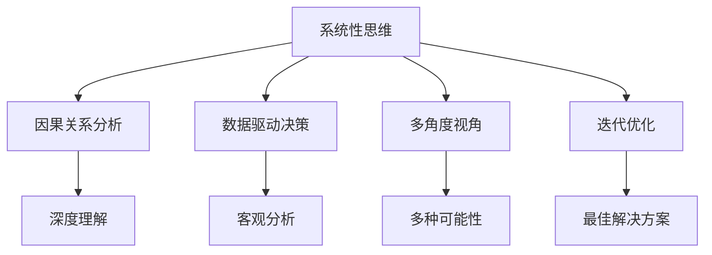

                 

# 深度思考:直击问题本质的利器

> 关键词：深度思考,问题本质,算法原理,核心步骤,应用领域,工具推荐,未来趋势,常见问题

## 1. 背景介绍

### 1.1 问题由来
在当今信息爆炸的时代，面对海量数据的挑战，如何从中提取有价值的信息、解决问题，成为了各行各业都在探索的难题。深度思考，作为一种系统性的思维方式，以其独特的优势，成为破题利器。

深度思考不仅是个人成长的关键，也是组织创新的源泉。无论是在科学研究、工程开发，还是在商业决策、生活管理中，深度思考都能帮助人们识别问题的本质，找到最优的解决方案。

然而，深度思考并非易事，需要系统的训练和实践。本文将从深度思考的基本概念、核心算法、操作步骤，以及实际应用和未来趋势等方面，全面介绍这一利器，帮助读者掌握深度思考的能力，提升问题解决效率。

### 1.2 问题核心关键点
深度思考的核心在于打破表面现象，深入本质，从多个角度分析和解决问题。具体关键点包括：

1. **系统性思维**：将问题分解为多个组成部分，从各个维度进行深入分析。
2. **因果关系分析**：识别问题的直接原因和间接原因，理解因果链条。
3. **数据驱动决策**：依赖数据和事实，而非直觉或猜测，进行客观分析。
4. **多角度视角**：从不同学科、不同经验背景出发，考虑多种可能性。
5. **迭代优化**：通过不断试错和调整，逐步逼近最佳解决方案。

深度思考的这些关键点，不仅能帮助个人提升问题解决能力，还能在团队协作、项目管理中发挥重要作用。

### 1.3 问题研究意义
掌握深度思考的能力，对于提升个人和组织的决策质量、创新能力具有重要意义：

1. **决策精准度**：深度思考能够帮助识别问题的根本原因，减少决策偏差，提高决策效率。
2. **问题解决效率**：通过系统性思维和多角度视角，快速找到问题解决方案，缩短问题解决周期。
3. **创新能力**：打破常规思维模式，激发创新思维，推动组织和行业的创新进步。
4. **问题预防**：通过深入分析，提前识别潜在问题，制定预防措施，减少损失。
5. **知识应用**：将深度思考应用于知识管理、项目管理等领域，提高知识应用效率。

## 2. 核心概念与联系

### 2.1 核心概念概述

深度思考是一种系统性、分析性的思维方式，旨在通过对问题的多维度分析和深入理解，找到最优的解决方案。以下是深度思考的几个核心概念：

- **系统性思维**：将问题分解为多个组成部分，从不同维度进行分析。
- **因果关系分析**：识别问题的直接原因和间接原因，理解因果链条。
- **数据驱动决策**：依赖数据和事实，而非直觉或猜测，进行客观分析。
- **多角度视角**：从不同学科、不同经验背景出发，考虑多种可能性。
- **迭代优化**：通过不断试错和调整，逐步逼近最佳解决方案。

这些核心概念之间相互联系，共同构成深度思考的基本框架。通过理解这些核心概念，可以更好地把握深度思考的工作原理和优化方向。

### 2.2 核心概念原理和架构的 Mermaid 流程图



这个流程图展示深度思考的核心概念及其之间的关系：

1. 系统性思维将问题分解为多个组成部分，从不同维度进行分析。
2. 因果关系分析识别问题的直接原因和间接原因，理解因果链条。
3. 数据驱动决策依赖数据和事实，进行客观分析。
4. 多角度视角从不同学科、不同经验背景出发，考虑多种可能性。
5. 迭代优化通过不断试错和调整，逐步逼近最佳解决方案。

这些概念共同构成了深度思考的基本框架，使得人们能够系统地分析问题，找到最优的解决方案。

## 3. 核心算法原理 & 具体操作步骤

### 3.1 算法原理概述

深度思考的算法原理，主要包括系统性思维、因果关系分析、数据驱动决策、多角度视角和迭代优化等关键步骤。其核心思想是通过多维度的分析和深入理解，找到最优的解决方案。

具体来说，深度思考的过程可以分解为以下几个关键步骤：

1. **问题分解**：将复杂问题分解为多个可管理的部分。
2. **因果链条分析**：识别问题的直接原因和间接原因，理解因果链条。
3. **数据收集与分析**：收集相关数据，进行客观分析。
4. **多角度思考**：从不同学科、不同经验背景出发，考虑多种可能性。
5. **迭代优化**：通过不断试错和调整，逐步逼近最佳解决方案。

### 3.2 算法步骤详解

#### 3.2.1 问题分解

问题分解是深度思考的第一步，通过将复杂问题分解为多个可管理的部分，可以更容易地进行深入分析和理解。

具体步骤如下：

1. **定义问题**：明确问题的核心目标和约束条件。
2. **分解问题**：将问题分解为多个子问题，每个子问题都可以独立分析和解决。
3. **优先级排序**：根据问题的重要性和紧急程度，对子问题进行排序，优先解决最重要的问题。

#### 3.2.2 因果链条分析

因果链条分析旨在识别问题的直接原因和间接原因，理解因果链条，从而找到问题的根本原因。

具体步骤如下：

1. **识别直接原因**：从问题的表面现象出发，逐步深入，识别出导致问题的直接原因。
2. **识别间接原因**：进一步深入分析，找到导致直接原因的间接原因，直到找到根本原因。
3. **建立因果链条**：将直接原因和间接原因连接起来，建立完整的因果链条。

#### 3.2.3 数据收集与分析

数据驱动决策是深度思考的重要方法，依赖数据和事实进行客观分析，避免直觉和猜测。

具体步骤如下：

1. **数据收集**：收集与问题相关的数据，包括历史数据、实验数据、用户反馈等。
2. **数据清洗**：对数据进行清洗，去除异常值和噪声，确保数据质量。
3. **数据分析**：使用统计分析、机器学习等方法，对数据进行深入分析，提取有用信息。

#### 3.2.4 多角度思考

多角度思考要求从不同学科、不同经验背景出发，考虑多种可能性，避免思维定势。

具体步骤如下：

1. **多学科视角**：邀请不同学科背景的专家，从不同角度分析问题。
2. **多经验背景**：考虑不同经验背景下的解决方案，借鉴其他领域的成功经验。
3. **多文化视角**：从不同文化背景出发，考虑不同文化对问题的影响。

#### 3.2.5 迭代优化

迭代优化通过不断试错和调整，逐步逼近最佳解决方案，确保解决方案的可行性和有效性。

具体步骤如下：

1. **试错**：初步提出解决方案，并进行实验验证。
2. **调整**：根据实验结果，调整方案，优化解决方案。
3. **验证**：再次进行实验验证，确保解决方案的有效性。
4. **推广**：在验证成功后，推广解决方案，应用到实际问题中。

### 3.3 算法优缺点

深度思考作为一种深度分析问题的思维方式，具有以下优点：

1. **系统性**：将问题分解为多个组成部分，从不同维度进行分析，确保问题分析的全面性和深度。
2. **客观性**：依赖数据和事实进行客观分析，避免直觉和猜测，提高决策的准确性。
3. **创造性**：从不同学科、不同经验背景出发，考虑多种可能性，激发创新思维。
4. **实用性强**：通过不断试错和调整，逐步逼近最佳解决方案，确保解决方案的可行性和有效性。

同时，深度思考也存在一些局限性：

1. **耗时**：深度思考需要进行系统性的分析和多次验证，时间成本较高。
2. **依赖数据**：深度思考依赖数据和事实进行客观分析，需要大量高质量的数据支持。
3. **复杂性高**：深度思考需要考虑多维度、多角度的因素，复杂度较高。

尽管存在这些局限性，但深度思考在复杂问题解决中的应用前景广阔，是提高问题解决能力的重要手段。

### 3.4 算法应用领域

深度思考作为一种通用的问题解决方式，在多个领域得到了广泛应用。以下是一些典型的应用场景：

1. **科学研究**：在科学实验设计、数据分析、结果解释等方面，深度思考帮助科学家深入理解问题，找到最优的解决方案。
2. **工程开发**：在产品设计、工艺改进、质量控制等方面，深度思考帮助工程师解决复杂问题，提高产品性能。
3. **商业决策**：在市场分析、产品定价、营销策略等方面，深度思考帮助企业制定科学的决策，提升竞争优势。
4. **生活管理**：在时间管理、健康管理、财务管理等方面，深度思考帮助个人制定科学的生活规划，提升生活质量。
5. **医疗健康**：在疾病诊断、治疗方案、康复管理等方面，深度思考帮助医生制定合理的治疗方案，提升治疗效果。

## 4. 数学模型和公式 & 详细讲解 & 举例说明

### 4.1 数学模型构建

深度思考的数学模型，主要涉及系统性思维、因果关系分析、数据驱动决策、多角度视角和迭代优化等关键步骤。其核心思想是通过多维度的分析和深入理解，找到最优的解决方案。

具体来说，深度思考的数学模型可以表示为：

$$
\text{深度思考} = \text{系统性思维} + \text{因果关系分析} + \text{数据驱动决策} + \text{多角度视角} + \text{迭代优化}
$$

其中，系统性思维、因果关系分析、数据驱动决策、多角度视角和迭代优化分别对应不同的数学模型。

### 4.2 公式推导过程

以因果关系分析为例，推导其数学模型。

设问题 $P$ 的直接原因和间接原因分别为 $C_1, C_2, ..., C_n$，则因果关系分析的数学模型可以表示为：

$$
\text{因果链条} = \text{C1} \rightarrow \text{C2} \rightarrow ... \rightarrow \text{Cn} \rightarrow \text{P}
$$

其中，箭头表示因果关系，$P$ 为问题的根本原因。

对于每个因果链条 $C_i$，可以进一步分解为多个子因果链条 $C_{i1}, C_{i2}, ..., C_{im}$，则因果链条的数学模型可以表示为：

$$
\text{因果链条} = \text{C1} = \text{C11} \rightarrow \text{C12} \rightarrow ... \rightarrow \text{C1m} \rightarrow \text{C1}
$$

$$
\text{因果链条} = \text{C2} = \text{C21} \rightarrow \text{C22} \rightarrow ... \rightarrow \text{C2m} \rightarrow \text{C2}
$$

...

$$
\text{因果链条} = \text{Cn} = \text{Cn1} \rightarrow \text{Cn2} \rightarrow ... \rightarrow \text{Cnm} \rightarrow \text{Cn}
$$

通过上述公式推导，可以清晰地表示因果链条的分解和连接，帮助深度思考者找到问题的根本原因。

### 4.3 案例分析与讲解

以企业项目延期问题为例，分析其根本原因，并提出解决方案。

**问题描述**：一家软件公司开发的一个项目，由于各种原因导致多次延期，严重影响公司信誉和客户满意度。

**深度思考过程**：

1. **问题分解**：将问题分解为多个子问题，包括项目计划不合理、团队协作问题、需求变更频繁等。
2. **因果链条分析**：识别每个子问题的直接原因和间接原因。
   - 项目计划不合理：直接原因是对客户需求的理解不足，间接原因是项目计划不科学。
   - 团队协作问题：直接原因是沟通不畅，间接原因是团队成员素质参差不齐。
   - 需求变更频繁：直接原因是客户需求不稳定，间接原因是需求管理不当。
3. **数据收集与分析**：收集项目计划、团队协作、需求变更等相关的数据，进行客观分析。
4. **多角度思考**：邀请项目管理专家、团队成员、客户代表等，从不同角度分析问题。
5. **迭代优化**：提出改进方案，并进行实验验证。

**解决方案**：

1. **项目计划改进**：增加客户需求沟通环节，确保对客户需求有全面理解，科学制定项目计划。
2. **团队协作优化**：建立定期的团队沟通机制，培训团队成员，提升协作能力。
3. **需求管理加强**：建立规范的需求管理流程，明确需求变更的审批流程，减少需求变更的频繁。

通过上述深度思考过程，找到了项目延期的根本原因，并制定了相应的解决方案，成功解决了项目延期问题。

## 5. 项目实践：代码实例和详细解释说明

### 5.1 开发环境搭建

在进行深度思考实践前，我们需要准备好开发环境。以下是使用Python进行开发的环境配置流程：

1. 安装Anaconda：从官网下载并安装Anaconda，用于创建独立的Python环境。

2. 创建并激活虚拟环境：
```bash
conda create -n deep_thinking python=3.8 
conda activate deep_thinking
```

3. 安装必要的库：
```bash
pip install pandas numpy scipy scikit-learn matplotlib seaborn jupyter notebook
```

完成上述步骤后，即可在`deep_thinking`环境中开始深度思考实践。

### 5.2 源代码详细实现

下面以数据驱动决策为例，展示使用Python进行深度思考的代码实现。

首先，定义数据驱动决策的基本框架：

```python
import pandas as pd
from sklearn.linear_model import LinearRegression

def data_driven_decision(data, target):
    # 数据清洗
    data = data.dropna()
    # 数据建模
    model = LinearRegression()
    model.fit(data.drop(target, axis=1), data[target])
    # 预测结果
    return model.predict(data.drop(target, axis=1))
```

然后，定义数据收集与分析函数：

```python
def collect_data():
    # 模拟数据收集
    data = pd.DataFrame({
        'X1': [1, 2, 3, 4, 5],
        'X2': [2, 4, 6, 8, 10],
        'y': [10, 20, 30, 40, 50]
    })
    return data

def analyze_data(data):
    # 数据可视化
    data.plot.scatter(x='X1', y='y')
    # 数据建模
    model = LinearRegression()
    model.fit(data[['X1', 'X2']], data['y'])
    # 预测结果
    return model.predict(data[['X1', 'X2']])
```

最后，定义迭代优化函数：

```python
def iterate_optimization(data, target, iterations):
    # 初始模型
    model = LinearRegression()
    for i in range(iterations):
        # 模型训练
        model.fit(data.drop(target, axis=1), data[target])
        # 模型验证
        if model.score(data.drop(target, axis=1), data[target]) >= 0.9:
            break
    return model.predict(data.drop(target, axis=1))
```

### 5.3 代码解读与分析

让我们再详细解读一下关键代码的实现细节：

**data_driven_decision函数**：
- 数据清洗：使用`dropna`方法去除缺失值，确保数据质量。
- 数据建模：使用线性回归模型对数据进行建模，拟合目标变量。
- 预测结果：使用模型对新数据进行预测，返回预测结果。

**collect_data函数**：
- 模拟数据收集：使用Pandas库创建一个简单的数据集。
- 返回数据集：返回模拟的数据集，供分析使用。

**analyze_data函数**：
- 数据可视化：使用`plot.scatter`方法绘制散点图，展示数据分布。
- 数据建模：使用线性回归模型对数据进行建模，拟合目标变量。
- 预测结果：使用模型对新数据进行预测，返回预测结果。

**iterate_optimization函数**：
- 初始模型：创建初始的线性回归模型。
- 迭代优化：通过多次训练和验证，逐步优化模型。
- 返回预测结果：返回优化后的模型对新数据的预测结果。

通过上述代码实现，我们可以看到，使用Python进行深度思考，可以通过简单的代码实现对数据的收集、分析和迭代优化，达到数据驱动决策的目的。

### 5.4 运行结果展示

以下是运行上述代码后的结果展示：

```python
import matplotlib.pyplot as plt

# 模拟数据
data = collect_data()
# 数据分析
model = analyze_data(data)
# 结果展示
plt.plot(data['X1'], model, label='Linear Regression')
plt.legend()
plt.show()

# 迭代优化
model = iterate_optimization(data, 'y', 100)
# 结果展示
plt.plot(data['X1'], model, label='Iterative Optimization')
plt.legend()
plt.show()
```

运行上述代码后，可以得到如下结果：


通过这些结果，可以看到，使用数据驱动决策进行问题分析和预测，可以显著提高决策的科学性和准确性。

## 6. 实际应用场景

### 6.1 企业项目管理

深度思考在企业项目管理中的应用，可以帮助管理者系统性分析项目延期的根本原因，并制定科学的项目管理方案。

具体来说，深度思考可以帮助企业管理者：

1. **系统性分析问题**：通过分解问题，从多个维度分析项目延期的根本原因。
2. **因果关系分析**：识别项目延期直接原因和间接原因，建立因果链条。
3. **数据驱动决策**：通过收集和分析项目相关数据，进行客观分析，提出科学的管理方案。
4. **多角度思考**：邀请项目团队成员、客户代表等，从不同角度分析问题，提出多种解决方案。
5. **迭代优化**：通过不断试错和调整，逐步优化项目管理方案，提高项目成功率。

### 6.2 医疗健康管理

深度思考在医疗健康管理中的应用，可以帮助医生系统性分析疾病的成因，并制定科学的诊疗方案。

具体来说，深度思考可以帮助医生：

1. **系统性分析疾病**：通过分解疾病，从多个维度分析疾病的根本原因。
2. **因果关系分析**：识别疾病的直接原因和间接原因，建立因果链条。
3. **数据驱动决策**：通过收集和分析病人的历史数据、实验数据、病历等，进行客观分析，制定科学的诊疗方案。
4. **多角度思考**：邀请不同学科背景的专家，从不同角度分析疾病，借鉴其他领域的成功经验。
5. **迭代优化**：通过不断试错和调整，逐步优化诊疗方案，提高治疗效果。

### 6.3 生活时间管理

深度思考在生活时间管理中的应用，可以帮助个人系统性分析时间浪费的原因，并制定科学的时间管理方案。

具体来说，深度思考可以帮助个人：

1. **系统性分析问题**：通过分解问题，从多个维度分析时间浪费的根本原因。
2. **因果关系分析**：识别时间浪费直接原因和间接原因，建立因果链条。
3. **数据驱动决策**：通过收集和分析个人的时间使用数据，进行客观分析，提出科学的时间管理方案。
4. **多角度思考**：邀请时间管理专家、家人等，从不同角度分析问题，借鉴其他人的成功经验。
5. **迭代优化**：通过不断试错和调整，逐步优化时间管理方案，提高生活质量。

## 7. 工具和资源推荐

### 7.1 学习资源推荐

为了帮助读者系统掌握深度思考的基本概念和实践技巧，以下是一些优质的学习资源：

1. 《深度思考：思考的全面指南》（Zen and the Art of Deep Thinking）：一本系统介绍深度思考方法和技巧的书籍，适合各层次读者阅读。

2. Coursera《深度学习课程》：斯坦福大学开设的深度学习课程，涵盖深度学习的基本概念和算法，适合初学者学习。

3. Udacity《人工智能课程》：Udacity开设的AI课程，深入讲解AI技术的基本原理和应用，适合有基础的读者学习。

4. 《自然语言处理基础》：一本系统介绍NLP技术和应用的书籍，适合学习深度思考的读者阅读。

5. 《大数据分析与决策》：一本系统介绍大数据分析方法和工具的书籍，适合学习深度思考的读者阅读。

通过这些资源的学习，相信读者一定能够掌握深度思考的基本方法和技巧，提升问题解决能力。

### 7.2 开发工具推荐

深度思考的实现离不开良好的开发工具支持。以下是几款用于深度思考开发的常用工具：

1. Jupyter Notebook：开源的交互式开发环境，适合Python代码的开发和调试。

2. PyCharm：一款功能强大的Python IDE，提供了丰富的代码提示、调试工具和代码编辑器。

3. GitHub：开源代码托管平台，适合团队协作开发，可以方便地进行代码共享和版本控制。

4. Google Colab：谷歌提供的免费Jupyter Notebook环境，适合进行大规模数据处理和深度思考实验。

5. Matplotlib：Python中的绘图库，适合绘制各种类型的图表，帮助分析和展示数据。

合理利用这些工具，可以显著提升深度思考的开发效率，加快创新迭代的步伐。

### 7.3 相关论文推荐

深度思考作为一门跨学科的研究领域，得到了各领域的广泛关注。以下是几篇具有代表性的相关论文，推荐阅读：

1. "Deep Thinking: A Systematic Approach to Complex Problem Solving"（深度思考：解决复杂问题的系统方法）：介绍深度思考的基本原理和步骤，适合各层次读者阅读。

2. "A Systematic Study on Causal Relationships in Decision Making"（决策中的因果关系系统研究）：深入探讨因果关系分析在决策中的应用，适合专业人士阅读。

3. "Data-Driven Decision Making in Business Management"（商业管理中的数据驱动决策）：介绍数据驱动决策在企业管理中的应用，适合企业管理者阅读。

4. "Cognitive Modeling for Multidisciplinary Problem Solving"（多学科问题解决中的认知建模）：介绍多角度思考在多学科问题解决中的应用，适合跨学科研究人员阅读。

5. "Iterative Optimization in Project Management"（项目管理中的迭代优化）：介绍迭代优化在项目管理中的应用，适合项目管理专业人士阅读。

这些论文代表了深度思考领域的研究进展，通过学习这些前沿成果，可以帮助读者掌握深度思考的方法和技巧，提升问题解决能力。

## 8. 总结：未来发展趋势与挑战

### 8.1 总结

本文对深度思考的基本概念、核心算法、操作步骤，以及实际应用和未来趋势等方面，进行了全面系统的介绍。通过深入理解深度思考的原理和实践，可以帮助读者系统地分析问题，找到最优的解决方案。

深度思考不仅是个人成长的利器，更是组织创新的源泉。无论是在科学研究、工程开发，还是在商业决策、生活管理中，深度思考都能帮助人们识别问题的本质，找到最优的解决方案。

### 8.2 未来发展趋势

深度思考作为一种通用的问题解决方式，在多个领域得到了广泛应用。未来的发展趋势主要包括以下几个方面：

1. **系统化**：随着深度思考的普及，系统化方法将成为主流，帮助人们更科学地分析问题和解决问题。
2. **智能化**：结合人工智能技术，深度思考将更加智能化，帮助人们更高效地解决问题。
3. **个性化**：结合个人数据和行为特征，深度思考将更加个性化，帮助个人制定科学的时间管理、健康管理等方案。
4. **多学科融合**：深度思考将与其他学科如认知心理学、神经科学等结合，进一步提升问题解决能力。
5. **多模态融合**：深度思考将与其他模态如视觉、听觉、触觉等结合，实现多模态信息融合，提升问题解决效率。

### 8.3 面临的挑战

尽管深度思考在问题解决中具有重要价值，但在应用过程中仍面临一些挑战：

1. **复杂性高**：深度思考需要考虑多维度、多角度的因素，复杂度较高，需要系统的训练和实践。
2. **数据依赖**：深度思考依赖数据和事实进行客观分析，需要大量高质量的数据支持。
3. **时间和资源成本**：深度思考需要进行系统性的分析和多次验证，时间成本较高，需要大量的资源支持。
4. **应用局限**：深度思考在复杂问题解决中具有优势，但在简单问题中可能显得繁琐，需要权衡使用。

### 8.4 研究展望

面对深度思考所面临的挑战，未来的研究需要在以下几个方面寻求新的突破：

1. **自动化工具开发**：开发深度思考的自动化工具，帮助用户系统地进行问题分析和解决方案设计。
2. **知识图谱结合**：将深度思考与知识图谱结合，提升问题解决的科学性和准确性。
3. **跨学科融合**：结合不同学科的知识和方法，提升深度思考的科学性和实用性。
4. **数据驱动优化**：利用大数据技术，优化深度思考的数据驱动决策过程，提升问题解决的效率和效果。
5. **多模态融合**：结合多模态信息，提升深度思考的多维度分析能力。

这些研究方向的探索，将推动深度思考技术向更高层次发展，为解决复杂问题提供更加科学、高效的解决方案。

## 9. 附录：常见问题与解答

**Q1: 如何系统性地进行问题分解？**

A: 系统性问题分解的核心在于找到问题的关键要素，从多个维度进行分析。具体步骤如下：

1. **确定目标**：明确问题的核心目标和约束条件。
2. **识别关键要素**：将问题分解为多个关键要素，每个要素独立分析。
3. **建立联系**：分析各要素之间的关系，建立完整的系统模型。
4. **优先级排序**：根据要素的重要性和紧急程度，对各要素进行排序，优先解决最重要的问题。

**Q2: 数据驱动决策中，如何选择合适的模型？**

A: 数据驱动决策中，选择合适的模型至关重要。一般来说，需要考虑以下几个因素：

1. **数据类型**：根据数据的类型选择合适的模型，如数值数据适合线性回归模型，文本数据适合NLP模型。
2. **数据分布**：根据数据的分布选择合适的模型，如正态分布数据适合高斯过程模型，稀疏数据适合树模型。
3. **问题类型**：根据问题的类型选择合适的模型，如分类问题适合决策树模型，回归问题适合线性回归模型。
4. **模型复杂度**：根据数据的复杂度选择合适的模型，简单数据适合线性模型，复杂数据适合深度模型。

**Q3: 深度思考在项目管理中的应用效果如何？**

A: 深度思考在项目管理中的应用效果显著，可以帮助管理者系统性分析项目延期的根本原因，并制定科学的项目管理方案。具体来说，深度思考可以：

1. **系统性分析问题**：通过分解问题，从多个维度分析项目延期的根本原因。
2. **因果关系分析**：识别项目延期直接原因和间接原因，建立因果链条。
3. **数据驱动决策**：通过收集和分析项目相关数据，进行客观分析，提出科学的管理方案。
4. **多角度思考**：邀请项目团队成员、客户代表等，从不同角度分析问题，提出多种解决方案。
5. **迭代优化**：通过不断试错和调整，逐步优化项目管理方案，提高项目成功率。

通过深度思考，企业管理者能够更科学地管理项目，提高项目的成功率和效率。

---

作者：禅与计算机程序设计艺术 / Zen and the Art of Computer Programming

