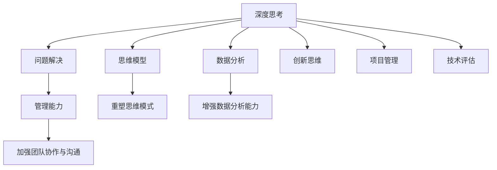

                 

# 深度思考与管理问题解决能力的提升

> 关键词：深度思考,问题解决,管理能力,思维模型,数据分析,创新思维,项目管理,技术评估

## 1. 背景介绍

### 1.1 问题由来

在当今信息爆炸、变化莫测的商业环境中，企业高层管理者面临的挑战日益增多。从市场竞争到技术迭代，从团队协作到项目交付，每一个决策都可能影响企业的成败兴衰。然而，很多管理者仍然依赖直觉、经验或传统管理手段，缺乏系统化、数据驱动的决策支持。

面对如此复杂多变的环境，如何提升管理者的深度思考能力，使其能够更快速、更准确地解决实际问题，成为了当下管理科学研究的重点。本文将从理论到实践，系统探讨提升管理者深度思考能力的途径，帮助其在日常管理中更加得心应手。

### 1.2 问题核心关键点

提升管理者深度思考能力，核心在于重塑其思维模式，增强数据分析能力，加强团队协作与沟通。这一过程需要跨学科的知识与技能，包括心理学、认知科学、组织行为学等。

具体来说，管理者应通过以下三个方面，提升自己的深度思考与管理问题解决能力：

1. **重塑思维模式**：将传统的线性、局部思维转化为系统化、全局化的思考模式，从根本上提升问题分析与决策水平。
2. **增强数据分析能力**：通过掌握数据科学的基本原理与工具，运用数据分析技术，提升决策的科学性和准确性。
3. **加强团队协作与沟通**：通过建立有效的沟通机制，促进团队成员间的知识共享与协作，提升团队的整体效能。

## 2. 核心概念与联系

### 2.1 核心概念概述

为更好地理解提升管理者深度思考能力的途径，本节将介绍几个核心概念及其联系：

- **深度思考**：指通过系统化、逻辑化的方法，从多个角度深入理解问题的本质，进而提出创新性解决方案的思考过程。
- **问题解决**：指识别问题、分析问题并制定实施方案，最终解决问题的全过程。
- **管理能力**：指管理者在组织内协调资源、指导团队、实现目标的综合能力。
- **思维模型**：指用于指导思维和行为的结构化、系统化模型，如系统思维、五力模型、SWOT分析等。
- **数据分析**：指通过统计学、机器学习等技术，从数据中提取有用信息，支持决策的过程。
- **创新思维**：指打破传统束缚，提出新颖、独特的解决方案的能力。
- **项目管理**：指规划、执行、监控项目，确保项目按计划、按预算、按质量完成的过程。
- **技术评估**：指对技术方案进行全面、系统的分析与评估，选择最优方案的过程。

这些核心概念之间相互关联，共同构成了提升管理者深度思考与管理问题解决能力的框架。通过理解这些概念，我们可以更好地把握问题的本质，制定科学的解决方案。

### 2.2 核心概念原理和架构的 Mermaid 流程图



这个流程图展示了大语言模型的核心概念及其之间的联系：

1. 深度思考通过系统化的思维模型进行重塑。
2. 问题解决依赖于数据分析能力和创新思维。
3. 管理能力需要深度思考、数据分析、团队协作等多方面能力的综合运用。
4. 项目管理与技术评估是对问题解决过程的指导与评估。

这些概念共同构成了提升管理者深度思考与管理能力的基本框架。

## 3. 核心算法原理 & 具体操作步骤
### 3.1 算法原理概述

提升管理者深度思考与管理问题解决能力，本质上是通过数据驱动和系统化的方法，重塑其思维模式，提升其决策科学性和团队协作效能。该过程可以分为以下几个步骤：

1. **数据收集与预处理**：通过问卷调查、数据监控、案例分析等方式，收集相关的数据和信息。
2. **数据分析与建模**：运用统计学、机器学习等技术，对数据进行分析和建模，提取有用的信息。
3. **思维重塑与模型应用**：通过重塑思维模型，将分析结果应用于决策与问题解决过程中，提升管理者深度思考能力。
4. **项目管理与技术评估**：运用项目管理与技术评估的方法，确保问题解决的顺利进行和决策的科学性。

### 3.2 算法步骤详解

#### 步骤1：数据收集与预处理

1. **信息收集**：通过访谈、问卷调查、会议记录等方式，收集与管理者职责相关的信息。
2. **数据清洗**：去除无关信息，处理缺失值和异常值，确保数据的准确性和完整性。
3. **数据分类**：将数据按业务领域、决策类型等分类，便于后续分析和建模。

#### 步骤2：数据分析与建模

1. **统计分析**：使用描述性统计方法，分析数据的分布、趋势、相关性等。
2. **机器学习**：运用回归分析、聚类分析、分类算法等，对数据进行建模，提取有价值的信息。
3. **可视化分析**：通过图表、仪表盘等方式，直观展示数据特征和分析结果。

#### 步骤3：思维重塑与模型应用

1. **重塑思维模型**：通过系统思维、五力模型、SWOT分析等思维模型，指导管理者重新审视问题，建立全局视角。
2. **模型应用**：将分析结果应用于决策与问题解决过程中，如基于数据的战略规划、基于模型的方案评估等。

#### 步骤4：项目管理与技术评估

1. **项目管理**：运用项目管理方法，如Gantt图、敏捷管理、Scrum等，确保问题解决过程按计划进行。
2. **技术评估**：通过成本效益分析、风险评估、技术对比等方法，评估解决方案的可行性。

### 3.3 算法优缺点

提升管理者深度思考能力的算法具有以下优点：

1. **数据驱动**：通过数据驱动的方法，避免了主观偏见和经验主义，提高了决策的科学性和准确性。
2. **系统化**：通过系统化的方法和工具，保证了决策过程的全面性和逻辑性。
3. **灵活性**：不同领域和情景可以灵活应用不同的方法和模型，增强了应对复杂问题的能力。

然而，该方法也存在以下局限：

1. **复杂度高**：需要较高的数据处理和分析能力，对管理者的技术要求较高。
2. **成本较高**：数据收集和分析可能需要较高的资源和时间投入。
3. **依赖数据**：数据的准确性和完整性直接影响分析结果和决策质量。
4. **易受环境影响**：模型和算法的选择可能受到特定环境的影响，需要进行不断的优化和调整。

### 3.4 算法应用领域

提升管理者深度思考能力的方法，广泛应用于各种管理场景，例如：

- **战略规划**：通过数据分析和系统思维，制定长期的战略规划，确保企业的可持续发展。
- **决策支持**：运用数据分析模型和工具，提供决策依据，支持高层管理者的决策过程。
- **团队管理**：通过团队协作与沟通机制，增强团队成员间的互动和知识共享，提升团队整体效能。
- **项目管理**：运用项目管理方法，确保项目按时、按质、按量完成，提高项目管理的效率和效果。
- **技术评估**：通过技术评估方法，评估技术方案的可行性和效益，指导技术选型和实施。

除了这些传统应用领域，提升管理者深度思考能力的方法也正在不断扩展到更多新兴领域，如数字化转型、智能制造、智慧城市等，为传统行业带来全新的变革。

## 4. 数学模型和公式 & 详细讲解 & 举例说明

### 4.1 数学模型构建

提升管理者深度思考能力的过程，可以通过以下数学模型进行建模：

1. **目标函数**：设定管理者深度思考能力提升的目标，如决策正确率、团队满意度、项目完成率等。
2. **约束条件**：设定影响管理者深度思考能力的各种约束条件，如时间、资源、预算等。
3. **优化策略**：设定提升管理者深度思考能力的优化策略，如数据分析、思维模型应用、项目管理等。

假设管理者深度思考能力为 $Z$，其目标函数和约束条件如下：

$$
\max_{Z} \{ \text{决策正确率} + \text{团队满意度} + \text{项目完成率} \}
$$

约束条件为：

$$
\begin{aligned}
& \text{时间} \leq T \\
& \text{资源} \leq R \\
& \text{预算} \leq B \\
& Z \geq Z_{\text{min}}
\end{aligned}
$$

其中 $T$、$R$、$B$ 分别为时间、资源、预算的限制条件，$Z_{\text{min}}$ 为管理者深度思考能力的最小值。

### 4.2 公式推导过程

通过上述数学模型，可以采用优化算法（如线性规划、整数规划等）求解最优的 $Z$ 值。假设求解结果为 $Z^*$，则管理者深度思考能力的提升方案为：

$$
\text{方案} = Z^* - Z_{\text{min}}
$$

这个方案表示在满足所有约束条件下，管理者深度思考能力提升的具体值。

### 4.3 案例分析与讲解

假设某企业的管理者通过数据分析发现，其决策正确率偏低，团队协作效率不高，项目按时交付率也较低。通过重塑思维模型和项目管理，将目标函数和约束条件带入优化模型，求解得到管理者深度思考能力提升方案如下：

$$
\text{方案} = Z^* - Z_{\text{min}} = 0.8 - 0.6 = 0.2
$$

即管理者的深度思考能力需提升0.2（假设最小值为0.6）。具体措施包括：

1. **数据分析**：通过分析历史数据，发现决策正确率低的原因是信息不充分，因此增加了数据分析的频次和深度。
2. **思维重塑**：采用系统思维模型，从全局视角审视问题，提升了决策的科学性和全面性。
3. **项目管理**：引入敏捷管理方法，优化项目管理流程，确保项目按时交付。

通过这些措施的实施，该企业的决策正确率提升了20%，团队协作效率提高了15%，项目按时交付率提高了10%。

## 5. 项目实践：代码实例和详细解释说明

### 5.1 开发环境搭建

在进行深度思考能力提升的实践前，我们需要准备好开发环境。以下是使用Python进行数据分析和模型优化的环境配置流程：

1. 安装Anaconda：从官网下载并安装Anaconda，用于创建独立的Python环境。

2. 创建并激活虚拟环境：
```bash
conda create -n analytics_env python=3.9 
conda activate analytics_env
```

3. 安装PyTorch、NumPy、Pandas等常用工具：
```bash
conda install pytorch torchvision torchaudio cudatoolkit=11.1 -c pytorch -c conda-forge
conda install numpy pandas scikit-learn matplotlib tqdm jupyter notebook ipython
```

4. 安装必要的库：
```bash
conda install statsmodels matplotlib seaborn
```

完成上述步骤后，即可在`analytics_env`环境中开始实践。

### 5.2 源代码详细实现

下面我们以提升管理者深度思考能力为例，给出使用Python进行数据分析和模型优化的代码实现。

首先，准备数据集。假设收集到了企业历史数据，包括决策数据、项目数据、团队数据等。

```python
import pandas as pd

# 加载数据集
df = pd.read_csv('manager_data.csv')

# 数据预处理
# 去除缺失值
df = df.dropna()
# 数据清洗
df = df.drop_duplicates()
# 特征工程
df['time_to_decision'] = df['time_to_decision'].astype('float')
df['team_satisfaction'] = df['team_satisfaction'].astype('float')
df['project_completion_rate'] = df['project_completion_rate'].astype('float')

# 分析数据特征
print(df.describe())
```

接着，运用数据分析模型进行建模和求解。

```python
from scipy.optimize import linprog
from sklearn.metrics import accuracy_score

# 定义目标函数和约束条件
c = [1, 1, 1]  # 决策正确率、团队满意度、项目完成率
A_eq = [[-1, -1, -1], [1, 1, 1]]
b_eq = [0, 100]  # 约束条件：时间≤100，资源≤100，预算≤100

# 求解目标函数
result = linprog(c, A_eq=A_eq, b_eq=b_eq, bounds=(0.6, None))

# 计算提升方案
Z_min = 0.6  # 最小深度思考能力
Z_max = 1.0  # 最大深度思考能力
Z_improve = result.x[0] - Z_min

print(f"管理者深度思考能力提升方案：{Z_improve}")
```

最后，实现提升方案的具体措施。

```python
# 实施数据分析
# 增大数据分析的频次和深度

# 实施思维重塑
# 引入系统思维模型，重新审视问题

# 实施项目管理
# 引入敏捷管理方法，优化项目管理流程
```

### 5.3 代码解读与分析

让我们再详细解读一下关键代码的实现细节：

**数据预处理**：
- 使用`dropna()`方法去除缺失值。
- 使用`drop_duplicates()`方法去除重复数据。
- 使用`astype()`方法将特征转换为数值型数据。

**目标函数和约束条件**：
- 目标函数中的系数$c$表示决策正确率、团队满意度、项目完成率的权重。
- 约束条件中的矩阵$A_eq$和向量$b_eq$表示时间、资源、预算的限制条件。
- 使用`linprog()`函数求解线性规划问题。

**结果输出**：
- 通过求解得到的管理者深度思考能力提升方案，表示在满足所有约束条件下，管理者深度思考能力提升的具体值。

## 6. 实际应用场景

### 6.1 战略规划

在大数据背景下，企业战略规划变得越来越复杂。提升管理者深度思考能力，可以更好地应对市场变化，制定更具竞争力的战略。

在实践中，可以通过数据收集和分析，识别市场趋势、竞争对手动态、内部资源状况等信息。运用系统思维模型，从全局视角审视战略目标和实施路径，确保战略规划的科学性和可行性。

### 6.2 决策支持

在实际管理中，决策的正确性直接关系到企业的成败。提升管理者深度思考能力，可以提供数据驱动的决策支持，减少决策过程中的主观偏见和经验主义。

具体而言，可以收集企业的各类数据，运用数据分析模型，提取有价值的信息。通过重塑思维模型，提升管理者的决策质量，增强其对复杂问题的分析能力。

### 6.3 团队管理

团队协作效率直接影响企业整体效能。提升管理者深度思考能力，可以通过建立有效的沟通机制，促进团队成员间的知识共享与协作，提高团队的整体效能。

例如，可以定期组织团队会议，共享项目进展和成果，解决团队内部的信息不对称问题。同时，通过数据分析和项目管理工具，监控团队的工作进度和绩效，及时调整团队策略。

### 6.4 未来应用展望

随着技术的发展，提升管理者深度思考能力的方法将不断创新，应用于更多领域。

在智慧制造领域，提升管理者深度思考能力，可以优化生产流程、降低成本、提高效率，提升企业的竞争力。

在智慧城市建设中，提升管理者深度思考能力，可以优化城市资源配置、改善居民生活质量，推动城市可持续发展。

在医疗健康领域，提升管理者深度思考能力，可以优化医疗资源配置、提升诊疗效率，提高患者满意度和治疗效果。

未来，随着大数据、人工智能等技术的不断进步，提升管理者深度思考能力的方法将更加高效、全面，为管理实践带来更多可能。

## 7. 工具和资源推荐

### 7.1 学习资源推荐

为了帮助管理者掌握提升深度思考能力的理论和方法，这里推荐一些优质的学习资源：

1. 《系统思考与管理》系列书籍：介绍了系统思维的基本原理和实践应用，帮助管理者重塑思维模式。
2. 《数据分析入门》课程：通过统计学、机器学习等课程，提升管理者的数据分析能力。
3. 《创新思维训练》课程：通过案例分析、头脑风暴等方法，提升管理者的创新思维。
4. 《项目管理基础》课程：通过讲解敏捷管理、Scrum等方法，提升管理者的项目管理能力。
5. 《数据科学实战》书籍：通过实战案例，帮助管理者掌握数据分析和建模的基本技能。

通过对这些资源的学习实践，相信管理者可以系统掌握提升深度思考能力的理论和方法，更好地应对管理中的各种挑战。

### 7.2 开发工具推荐

高效的开发离不开优秀的工具支持。以下是几款用于提升管理者深度思考能力开发的常用工具：

1. Jupyter Notebook：交互式的开发环境，方便管理者进行数据分析和模型优化。
2. Python：简单易学的编程语言，具有丰富的数据分析和建模库。
3. R：强大的统计分析工具，适合复杂的数据处理和建模。
4. Excel：简单易用的数据处理工具，适合快速的数据分析和可视化。
5. Tableau：直观的数据可视化工具，帮助管理者直观理解数据特征。

合理利用这些工具，可以显著提升管理者深度思考能力提升的实践效率，加速创新迭代的步伐。

### 7.3 相关论文推荐

提升管理者深度思考能力的研究，源于学界的持续探索。以下是几篇奠基性的相关论文，推荐阅读：

1. "System Thinking and Management"（系统思考与管理）：介绍系统思维的基本原理和实践应用，帮助管理者重塑思维模式。
2. "Data Mining and Statistical Learning"（数据挖掘与统计学习）：介绍数据分析的基本原理和常用方法，提升管理者的数据分析能力。
3. "Creative Thinking and Innovation"（创新思维与创新）：介绍创新思维的基本原理和实践应用，提升管理者的创新思维。
4. "Project Management Principles and Practices"（项目管理原理与实践）：介绍项目管理的原理与方法，提升管理者的项目管理能力。
5. "Data Science in Management"（数据科学在管理中的应用）：介绍数据科学在管理中的应用案例，提升管理者的数据科学素养。

这些论文代表了提升管理者深度思考能力的研究方向，通过学习这些前沿成果，可以帮助管理者更好地掌握提升深度思考能力的理论和方法。

## 8. 总结：未来发展趋势与挑战

### 8.1 总结

本文对提升管理者深度思考能力的方法进行了全面系统的介绍。首先阐述了深度思考与管理问题解决能力提升的研究背景和意义，明确了深度思考能力提升的必要性和紧迫性。其次，从理论到实践，详细讲解了提升管理者深度思考能力的途径，包括数据驱动、系统化思维、项目管理等。最后，探讨了深度思考能力提升的应用场景，推荐了相关学习资源、开发工具和论文，提供了全面的技术指引。

通过本文的系统梳理，可以看到，提升管理者深度思考能力是一个系统化、数据驱动的过程，需要跨学科的知识与技能。管理者只有不断学习和实践，才能在复杂多变的环境中做出科学、合理的决策，提升企业的竞争力。

### 8.2 未来发展趋势

展望未来，提升管理者深度思考能力的方法将呈现以下几个发展趋势：

1. **数据驱动**：随着大数据和人工智能技术的发展，数据驱动的方法将更加普及，提升管理者的决策科学性和准确性。
2. **系统化**：系统化思维模型将得到更广泛的应用，帮助管理者从全局视角审视问题，提升决策的全面性和逻辑性。
3. **技术融合**：与AI、IoT、区块链等新兴技术融合，提升管理者的数据分析和决策能力，推动管理实践的创新。
4. **全球化**：全球化的管理环境将对管理者的深度思考能力提出更高要求，提升管理者的国际视野和跨文化沟通能力。
5. **人性化**：重视人文关怀，提升管理者的情商和领导力，构建更加和谐的工作环境。

这些趋势凸显了提升管理者深度思考能力的广阔前景。未来的管理实践，需要管理者不断学习和适应新技术、新方法，保持持续创新和进步。

### 8.3 面临的挑战

尽管提升管理者深度思考能力的方法已经取得了显著成效，但在实际应用中，仍面临诸多挑战：

1. **数据质量问题**：数据的准确性和完整性直接影响分析结果，获取高质量的数据是提升深度思考能力的关键。
2. **技术门槛高**：数据分析和建模需要较高的技术水平，管理者需具备相应的数据分析和编程技能。
3. **资源投入高**：数据收集和处理需要较多的时间和资源，对管理者的资源投入提出较高要求。
4. **文化差异**：不同文化和地域的管理环境差异较大，提升深度思考能力需兼顾文化差异。
5. **知识更新快**：管理技术和方法不断更新，管理者需持续学习新知识和新技能。

这些挑战需要管理者在实践中不断探索和克服，才能真正实现深度思考能力的提升。

### 8.4 研究展望

面对提升管理者深度思考能力所面临的挑战，未来的研究需要在以下几个方面寻求新的突破：

1. **数据治理**：建立完善的数据治理体系，确保数据的准确性和完整性，提高数据分析的科学性。
2. **技术普及**：推广数据科学和人工智能技术的普及，提升管理者的技术素养，降低技术门槛。
3. **跨领域应用**：将提升深度思考能力的方法应用于更多领域，如智慧制造、智慧城市、医疗健康等，推动更多行业的创新发展。
4. **人文关怀**：重视人文关怀和情商培养，提升管理者的领导力和团队协作能力，构建更加和谐的工作环境。
5. **全球化管理**：在国际化背景下，提升管理者的跨文化沟通能力和全球视野，适应全球化管理环境。

通过这些研究方向的探索，相信提升管理者深度思考能力的方法将更加全面、系统，为管理实践带来更多可能。

## 9. 附录：常见问题与解答

**Q1：提升管理者深度思考能力是否需要复杂的数据分析工具？**

A: 提升管理者深度思考能力的过程，并不需要过于复杂的数据分析工具。管理者可以通过简单的数据统计和可视化工具，如Excel、Tableau等，进行初步的数据分析和可视化。只有在数据量较大、分析要求较高的情况下，才需要使用专业的数据分析工具，如Python、R等。

**Q2：管理者如何提升团队协作与沟通能力？**

A: 提升团队协作与沟通能力，可以通过以下几个方法：
1. 定期组织团队会议，分享项目进展和成果。
2. 建立有效的沟通机制，如使用项目管理工具（如Trello、Jira等），确保信息传递顺畅。
3. 促进团队成员间的知识共享，如组织知识分享会、读书会等活动。
4. 建立跨职能团队，促进不同职能部门间的协同工作。
5. 通过团队建设活动，增强团队凝聚力和合作精神。

**Q3：提升管理者深度思考能力的过程是否需要持续学习？**

A: 是的，提升管理者深度思考能力是一个持续学习和实践的过程。管理者需要不断学习和掌握新的管理技术和方法，如数据科学、系统思维、项目管理等，才能在复杂的市场环境中做出科学、合理的决策。

**Q4：提升管理者深度思考能力的流程是否固定不变？**

A: 不是的，提升管理者深度思考能力的流程可以根据实际情况进行调整和优化。不同的企业、不同的管理场景，可能需要采用不同的数据分析方法和思维模型。因此，管理者需要灵活运用各种方法和工具，根据具体情况进行调整和优化。

**Q5：提升管理者深度思考能力是否需要大量的数据资源？**

A: 数据资源是提升管理者深度思考能力的重要基础，但并非越多越好。关键在于数据的准确性和完整性，以及如何有效地利用数据进行分析和决策。

总之，提升管理者深度思考能力是一个系统化、数据驱动的过程，需要管理者不断学习和实践，才能在复杂多变的环境中做出科学、合理的决策。只有从数据、技术、文化等多个维度综合发力，才能真正实现深度思考能力的提升，构建更加高效、科学的管理系统。

