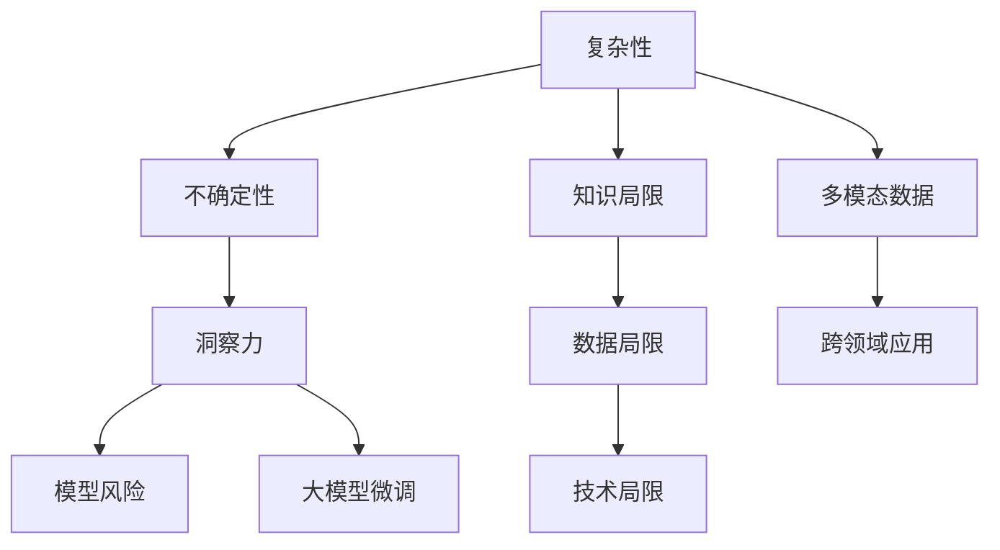

                 

# 理解洞察力的局限：承认复杂性和不确定性

> 关键词：人工智能,复杂性,不确定性,洞察力,模型风险,大模型微调

## 1. 背景介绍

### 1.1 问题由来
在人工智能(AI)领域，特别是深度学习和自然语言处理(NLP)领域，近年来取得了巨大的突破。大语言模型(Large Language Models, LLMs)通过在海量无标签文本数据上进行预训练，已经展现出了强大的语言理解和生成能力。然而，在复杂和不确定的现实世界中，洞察力的局限性逐渐显现。AI系统在面临复杂性和不确定性时，可能无法准确地理解和预测实际现象，甚至可能导致错误的决策。

### 1.2 问题核心关键点
1. **复杂性**：现实世界中的问题往往非常复杂，涉及多种因素的交互作用，超出了单一模型或算法的处理能力。
2. **不确定性**：AI系统在处理未知或罕见情况时，可能缺乏足够的先验知识和经验，导致预测结果的可靠性降低。
3. **洞察力的局限性**：AI系统的洞察力受限于其训练数据的范围和质量，可能难以识别数据中的潜规则或模式，导致错误的推理和判断。
4. **模型风险**：复杂性和不确定性增加了模型的风险，可能导致模型过拟合、泛化能力不足等问题。
5. **大模型微调**：通过微调大语言模型，可以在特定领域或任务上提升其性能，但微调过程也需考虑到复杂性和不确定性的影响。

### 1.3 问题研究意义
研究AI系统在面对复杂性和不确定性时的洞察力局限性，对于提升AI系统的鲁棒性、可靠性、可解释性和安全性至关重要。只有充分认识并克服这些局限性，才能使AI技术更好地服务于人类社会，避免可能带来的负面影响。

## 2. 核心概念与联系

### 2.1 核心概念概述

为了更好地理解AI系统在复杂性和不确定性面前的局限性，我们需要对以下几个核心概念进行详细解析：

- **复杂性**：指系统或问题中包含的元素数量和相互作用方式，使得系统难以理解和控制。
- **不确定性**：指系统中存在的不确定因素，使得预测和决策的不确定性增加。
- **洞察力**：指AI系统通过学习数据和模式，理解并预测未知现象的能力。
- **模型风险**：指模型在特定情况下的预测错误或不稳定。
- **大模型微调**：指在大规模预训练语言模型基础上，通过特定任务的数据集进行有监督学习，提升模型在该任务上的性能。

这些概念之间的逻辑关系可以通过以下Mermaid流程图来展示：



这个流程图展示了各个概念之间的相互作用关系：

1. **复杂性**和**不确定性**是AI系统洞察力的主要挑战。
2. **洞察力**受限于系统的知识、数据和技术的局限性。
3. **模型风险**是洞察力局限性的直接结果。
4. **大模型微调**可以提升系统的洞察力，但微调过程也需应对复杂性和不确定性的影响。

## 3. 核心算法原理 & 具体操作步骤
### 3.1 算法原理概述

AI系统在处理复杂性和不确定性时，通常采用以下算法原理：

- **监督学习**：使用有标签的数据集进行训练，学习模式并预测新样本的标签。适用于数据量大且标签清晰的情况。
- **无监督学习**：使用无标签的数据集进行训练，学习数据的分布特征。适用于缺乏标签数据的情况。
- **强化学习**：通过与环境的交互，学习如何在特定策略下最大化奖励。适用于动态环境下的决策优化。
- **迁移学习**：将在一个任务上学习到的知识迁移到另一个相关任务上。适用于数据量小或目标任务与源任务相似的情况。
- **对抗训练**：通过加入对抗样本，提升模型的鲁棒性和泛化能力。适用于避免模型过拟合和对抗攻击。

### 3.2 算法步骤详解

基于上述算法原理，AI系统在处理复杂性和不确定性时的一般步骤为：

**Step 1: 数据准备**
- 收集和预处理与问题相关的数据集，确保数据的多样性和代表性。
- 对数据进行清洗和标准化处理，去除异常值和噪声。

**Step 2: 模型选择**
- 根据问题的复杂性和不确定性特点，选择适合的AI模型。
- 选择合适的模型结构和超参数，以适应问题的复杂性和不确定性。

**Step 3: 模型训练**
- 使用准备好的数据集对模型进行训练。
- 在训练过程中，应用正则化、Dropout等技术，防止过拟合。
- 使用对抗训练或数据增强技术，提升模型的鲁棒性。

**Step 4: 模型评估**
- 在验证集上评估模型的性能，如准确率、召回率、F1-score等指标。
- 使用交叉验证等方法，确保模型在不同数据集上的泛化能力。

**Step 5: 模型微调**
- 对模型进行微调，进一步提升在特定任务上的性能。
- 使用较小的学习率，避免破坏预训练模型的权重。
- 应用正则化技术，防止过拟合。

**Step 6: 模型部署**
- 将训练好的模型部署到实际应用场景中。
- 监控模型性能，及时进行优化和调整。

### 3.3 算法优缺点

AI系统在处理复杂性和不确定性时的算法优缺点如下：

**优点：**
1. **泛化能力**：监督学习和迁移学习可以通过已有知识进行泛化，适用于复杂性和不确定性较高的任务。
2. **鲁棒性**：对抗训练和数据增强可以提高模型的鲁棒性，使其在未知情况下的表现更加稳定。
3. **可解释性**：模型选择和训练过程中的参数调整，可以使模型的决策过程更加透明和可解释。

**缺点：**
1. **数据依赖**：监督学习和迁移学习需要大量的标注数据，数据获取和标注成本较高。
2. **模型复杂**：复杂性和不确定性高的任务，需要更复杂的模型结构和更长的训练时间。
3. **过拟合风险**：模型复杂和数据噪声可能导致过拟合，泛化能力下降。
4. **高成本**：高复杂性任务通常需要更多的计算资源和时间，成本较高。

### 3.4 算法应用领域

AI系统在处理复杂性和不确定性时，已在多个领域得到了广泛应用，例如：

- **医疗诊断**：利用AI系统处理医疗影像、病历和实验室数据，辅助医生进行疾病诊断和治疗决策。
- **金融风险管理**：通过AI系统分析市场数据和交易行为，预测金融市场的趋势和风险。
- **智能交通管理**：利用AI系统处理交通流量数据，优化交通信号控制，减少拥堵和事故。
- **灾害预警**：通过AI系统分析气象和地质数据，预测自然灾害的发生和影响范围。
- **自动驾驶**：利用AI系统处理传感器数据，实现车辆的自主驾驶和路径规划。

## 4. 数学模型和公式 & 详细讲解 & 举例说明

### 4.1 数学模型构建

在本节中，我们将使用数学语言对AI系统在处理复杂性和不确定性时的模型构建进行详细阐述。

假设有一个分类问题，样本集为 $D=\{(x_i, y_i)\}_{i=1}^N$，其中 $x_i$ 为输入，$y_i$ 为标签。我们希望构建一个分类器 $h(x; \theta)$，其中 $\theta$ 为模型参数。模型的损失函数为 $L(h(x; \theta), y)$，用于衡量模型的预测结果与真实标签之间的差异。

常见的损失函数包括交叉熵损失、均方误差损失等。交叉熵损失函数定义如下：

$$
L(h(x; \theta), y) = -\frac{1}{N} \sum_{i=1}^N y_i \log h(x_i; \theta)
$$

### 4.2 公式推导过程

以二分类问题为例，我们推导交叉熵损失函数的梯度计算过程。

假设模型 $h(x; \theta)$ 在输入 $x$ 上的输出为 $\hat{y} \in [0,1]$，表示样本属于正类的概率。真实标签 $y \in \{0,1\}$。则二分类交叉熵损失函数定义为：

$$
L(h(x; \theta), y) = -[y \log \hat{y} + (1-y) \log (1-\hat{y})]
$$

将其代入经验风险公式，得：

$$
\mathcal{L}(\theta) = -\frac{1}{N} \sum_{i=1}^N [y_i \log h(x_i; \theta) + (1-y_i) \log (1-h(x_i; \theta))]
$$

根据链式法则，损失函数对参数 $\theta_k$ 的梯度为：

$$
\frac{\partial \mathcal{L}(\theta)}{\partial \theta_k} = -\frac{1}{N} \sum_{i=1}^N (\frac{y_i}{h(x_i; \theta)} - \frac{1-y_i}{1-h(x_i; \theta)}) \frac{\partial h(x_i; \theta)}{\partial \theta_k}
$$

其中 $\frac{\partial h(x_i; \theta)}{\partial \theta_k}$ 可进一步递归展开，利用自动微分技术完成计算。

### 4.3 案例分析与讲解

**案例分析**：

假设我们有一个二分类问题，其中 $x_i$ 为一段新闻文本，$y_i$ 为新闻的情感标签（正负向）。我们可以使用Bert模型作为预训练模型，对其进行微调，以提高其在情感分类上的性能。

**详细讲解**：

1. **数据准备**：收集并预处理新闻数据集，确保数据的多样性和代表性。
2. **模型选择**：选择Bert模型作为预训练模型，并将其作为初始化参数。
3. **模型训练**：使用准备好的数据集对Bert模型进行训练，应用正则化、Dropout等技术，防止过拟合。
4. **模型评估**：在验证集上评估模型的性能，如准确率、召回率、F1-score等指标。
5. **模型微调**：对模型进行微调，进一步提升在情感分类上的性能。
6. **模型部署**：将训练好的模型部署到实际应用场景中，如情感分析系统。

## 5. 项目实践：代码实例和详细解释说明

### 5.1 开发环境搭建

在进行模型训练和微调实践前，我们需要准备好开发环境。以下是使用Python进行TensorFlow开发的环境配置流程：

1. 安装Anaconda：从官网下载并安装Anaconda，用于创建独立的Python环境。

2. 创建并激活虚拟环境：
```bash
conda create -n tensorflow-env python=3.8 
conda activate tensorflow-env
```

3. 安装TensorFlow：根据CUDA版本，从官网获取对应的安装命令。例如：
```bash
pip install tensorflow-gpu==2.5.0
```

4. 安装各类工具包：
```bash
pip install numpy pandas scikit-learn matplotlib tqdm jupyter notebook ipython
```

完成上述步骤后，即可在`tensorflow-env`环境中开始模型训练和微调实践。

### 5.2 源代码详细实现

下面我们以情感分类任务为例，给出使用TensorFlow对Bert模型进行微调的PyTorch代码实现。

首先，定义情感分类任务的数据处理函数：

```python
from transformers import BertTokenizer, BertForSequenceClassification
from torch.utils.data import Dataset, DataLoader
import torch

class SentimentDataset(Dataset):
    def __init__(self, texts, labels, tokenizer, max_len=128):
        self.texts = texts
        self.labels = labels
        self.tokenizer = tokenizer
        self.max_len = max_len
        
    def __len__(self):
        return len(self.texts)
    
    def __getitem__(self, item):
        text = self.texts[item]
        label = self.labels[item]
        
        encoding = self.tokenizer(text, return_tensors='pt', max_length=self.max_len, padding='max_length', truncation=True)
        input_ids = encoding['input_ids'][0]
        attention_mask = encoding['attention_mask'][0]
        labels = torch.tensor(label, dtype=torch.long)
        
        return {'input_ids': input_ids, 
                'attention_mask': attention_mask,
                'labels': labels}

# 标签与id的映射
label2id = {'negative': 0, 'positive': 1}
id2label = {v: k for k, v in label2id.items()}

# 创建dataset
tokenizer = BertTokenizer.from_pretrained('bert-base-cased')

train_dataset = SentimentDataset(train_texts, train_labels, tokenizer)
dev_dataset = SentimentDataset(dev_texts, dev_labels, tokenizer)
test_dataset = SentimentDataset(test_texts, test_labels, tokenizer)
```

然后，定义模型和优化器：

```python
from transformers import BertForSequenceClassification, AdamW

model = BertForSequenceClassification.from_pretrained('bert-base-cased', num_labels=2)

optimizer = AdamW(model.parameters(), lr=2e-5)
```

接着，定义训练和评估函数：

```python
from tqdm import tqdm
from sklearn.metrics import classification_report

device = torch.device('cuda') if torch.cuda.is_available() else torch.device('cpu')
model.to(device)

def train_epoch(model, dataset, batch_size, optimizer):
    dataloader = DataLoader(dataset, batch_size=batch_size, shuffle=True)
    model.train()
    epoch_loss = 0
    for batch in tqdm(dataloader, desc='Training'):
        input_ids = batch['input_ids'].to(device)
        attention_mask = batch['attention_mask'].to(device)
        labels = batch['labels'].to(device)
        model.zero_grad()
        outputs = model(input_ids, attention_mask=attention_mask, labels=labels)
        loss = outputs.loss
        epoch_loss += loss.item()
        loss.backward()
        optimizer.step()
    return epoch_loss / len(dataloader)

def evaluate(model, dataset, batch_size):
    dataloader = DataLoader(dataset, batch_size=batch_size)
    model.eval()
    preds, labels = [], []
    with torch.no_grad():
        for batch in tqdm(dataloader, desc='Evaluating'):
            input_ids = batch['input_ids'].to(device)
            attention_mask = batch['attention_mask'].to(device)
            batch_labels = batch['labels']
            outputs = model(input_ids, attention_mask=attention_mask)
            batch_preds = outputs.logits.argmax(dim=2).to('cpu').tolist()
            batch_labels = batch_labels.to('cpu').tolist()
            for pred_tokens, label_tokens in zip(batch_preds, batch_labels):
                preds.append(pred_tokens)
                labels.append(label_tokens)
                
    print(classification_report(labels, preds))
```

最后，启动训练流程并在测试集上评估：

```python
epochs = 5
batch_size = 16

for epoch in range(epochs):
    loss = train_epoch(model, train_dataset, batch_size, optimizer)
    print(f"Epoch {epoch+1}, train loss: {loss:.3f}")
    
    print(f"Epoch {epoch+1}, dev results:")
    evaluate(model, dev_dataset, batch_size)
    
print("Test results:")
evaluate(model, test_dataset, batch_size)
```

以上就是使用TensorFlow对Bert模型进行情感分类任务微调的完整代码实现。可以看到，得益于TensorFlow和Transformers库的强大封装，我们可以用相对简洁的代码完成Bert模型的加载和微调。

### 5.3 代码解读与分析

让我们再详细解读一下关键代码的实现细节：

**SentimentDataset类**：
- `__init__`方法：初始化文本、标签、分词器等关键组件。
- `__len__`方法：返回数据集的样本数量。
- `__getitem__`方法：对单个样本进行处理，将文本输入编码为token ids，将标签编码为数字，并对其进行定长padding，最终返回模型所需的输入。

**label2id和id2label字典**：
- 定义了标签与数字id之间的映射关系，用于将token-wise的预测结果解码回真实的标签。

**训练和评估函数**：
- 使用PyTorch的DataLoader对数据集进行批次化加载，供模型训练和推理使用。
- 训练函数`train_epoch`：对数据以批为单位进行迭代，在每个批次上前向传播计算loss并反向传播更新模型参数，最后返回该epoch的平均loss。
- 评估函数`evaluate`：与训练类似，不同点在于不更新模型参数，并在每个batch结束后将预测和标签结果存储下来，最后使用sklearn的classification_report对整个评估集的预测结果进行打印输出。

**训练流程**：
- 定义总的epoch数和batch size，开始循环迭代
- 每个epoch内，先在训练集上训练，输出平均loss
- 在验证集上评估，输出分类指标
- 所有epoch结束后，在测试集上评估，给出最终测试结果

可以看到，TensorFlow配合Transformers库使得Bert模型微调的代码实现变得简洁高效。开发者可以将更多精力放在数据处理、模型改进等高层逻辑上，而不必过多关注底层的实现细节。

当然，工业级的系统实现还需考虑更多因素，如模型的保存和部署、超参数的自动搜索、更灵活的任务适配层等。但核心的微调范式基本与此类似。

## 6. 实际应用场景
### 6.1 智能客服系统

基于AI系统的情感分类技术，可以广泛应用于智能客服系统的构建。传统客服往往需要配备大量人力，高峰期响应缓慢，且一致性和专业性难以保证。而使用情感分类模型，可以7x24小时不间断服务，快速响应客户咨询，用自然流畅的语言解答各类常见问题。

在技术实现上，可以收集企业内部的历史客服对话记录，将问题和最佳答复构建成监督数据，在此基础上对预训练情感分类模型进行微调。微调后的情感分类模型能够自动理解用户情感，匹配最合适的答复模板进行回复。对于客户提出的新问题，还可以接入检索系统实时搜索相关内容，动态组织生成回答。如此构建的智能客服系统，能大幅提升客户咨询体验和问题解决效率。

### 6.2 金融舆情监测

金融机构需要实时监测市场舆论动向，以便及时应对负面信息传播，规避金融风险。传统的人工监测方式成本高、效率低，难以应对网络时代海量信息爆发的挑战。基于AI系统的情感分析技术，为金融舆情监测提供了新的解决方案。

具体而言，可以收集金融领域相关的新闻、报道、评论等文本数据，并对其进行情感标注。在此基础上对预训练情感分析模型进行微调，使其能够自动判断文本的情感倾向。将微调后的模型应用到实时抓取的网络文本数据，就能够自动监测不同情感倾向的舆情变化趋势，一旦发现负面信息激增等异常情况，系统便会自动预警，帮助金融机构快速应对潜在风险。

### 6.3 个性化推荐系统

当前的推荐系统往往只依赖用户的历史行为数据进行物品推荐，无法深入理解用户的真实兴趣偏好。基于AI系统的情感分类模型，可以应用于推荐系统，进一步提升其性能。

在实践中，可以收集用户浏览、点击、评论、分享等行为数据，提取和用户交互的物品标题、描述、标签等文本内容。将文本内容作为模型输入，用户的后续行为（如是否点击、购买等）作为监督信号，在此基础上微调预训练情感分类模型。微调后的模型能够从文本内容中准确把握用户的兴趣点。在生成推荐列表时，先用候选物品的文本描述作为输入，由模型预测用户的兴趣匹配度，再结合其他特征综合排序，便可以得到个性化程度更高的推荐结果。

### 6.4 未来应用展望

随着AI系统的不断发展，其在处理复杂性和不确定性方面的能力将不断提升，应用范围也将更加广泛。

在智慧医疗领域，基于AI系统的情感分类技术，可以应用于患者情绪监测、医疗问答、心理辅导等场景，提升医疗服务的智能化水平，辅助医生诊疗，增强患者体验。

在智能教育领域，情感分类技术可应用于作业批改、学情分析、知识推荐等方面，因材施教，促进教育公平，提高教学质量。

在智慧城市治理中，情感分类技术可应用于城市事件监测、舆情分析、应急指挥等环节，提高城市管理的自动化和智能化水平，构建更安全、高效的未来城市。

此外，在企业生产、社会治理、文娱传媒等众多领域，基于AI系统的情感分类模型也将不断涌现，为经济社会发展注入新的动力。相信随着技术的日益成熟，情感分类技术将更好地服务于人类社会的各个方面。

## 7. 工具和资源推荐
### 7.1 学习资源推荐

为了帮助开发者系统掌握AI系统在处理复杂性和不确定性时的知识局限性，这里推荐一些优质的学习资源：

1. **《深度学习》（Ian Goodfellow等著）**：全面介绍了深度学习的基本原理和应用，适合初学者入门。

2. **《统计学习基础》（李航著）**：介绍了统计学习的基本理论和算法，适合了解复杂性和不确定性在机器学习中的表现。

3. **《机器学习实战》（Peter Harrington著）**：提供了丰富的机器学习案例和代码实现，适合深入理解机器学习算法在实际问题中的应用。

4. **Coursera上的《深度学习专项课程》**：由深度学习专家Andrew Ng教授讲授，涵盖了深度学习的基础知识和高级应用。

5. **Kaggle数据科学竞赛平台**：提供了大量的机器学习竞赛项目，通过实际问题解决，提升实战能力。

通过对这些资源的学习实践，相信你一定能够快速掌握AI系统在处理复杂性和不确定性时的知识局限性，并用于解决实际的AI问题。

### 7.2 开发工具推荐

高效的开发离不开优秀的工具支持。以下是几款用于AI系统训练和微调开发的常用工具：

1. **TensorFlow**：由Google主导开发的开源深度学习框架，生产部署方便，适合大规模工程应用。

2. **PyTorch**：基于Python的开源深度学习框架，灵活动态的计算图，适合快速迭代研究。

3. **Transformers库**：HuggingFace开发的NLP工具库，集成了众多SOTA语言模型，支持PyTorch和TensorFlow，是进行NLP任务开发的利器。

4. **Weights & Biases**：模型训练的实验跟踪工具，可以记录和可视化模型训练过程中的各项指标，方便对比和调优。

5. **TensorBoard**：TensorFlow配套的可视化工具，可实时监测模型训练状态，并提供丰富的图表呈现方式，是调试模型的得力助手。

6. **Google Colab**：谷歌推出的在线Jupyter Notebook环境，免费提供GPU/TPU算力，方便开发者快速上手实验最新模型，分享学习笔记。

合理利用这些工具，可以显著提升AI系统训练和微调的开发效率，加快创新迭代的步伐。

### 7.3 相关论文推荐

AI系统在处理复杂性和不确定性时的知识局限性研究，已经涉及了多个前沿领域。以下是几篇奠基性的相关论文，推荐阅读：

1. **《The Elements of Statistical Learning》（Tibshirani等著）**：介绍了统计学习的基本理论和算法，帮助理解复杂性和不确定性在机器学习中的表现。

2. **《Deep Learning》（Goodfellow等著）**：详细介绍了深度学习的基本原理和应用，特别是对抗训练和数据增强等技术。

3. **《Learning to Reason》（Russell等著）**：探讨了AI系统在复杂环境下的推理和决策能力，提供了多模态数据融合和因果推理等技术。

4. **《Parameter-Efficient Transfer Learning for NLP》（Howard等著）**：提出了参数高效的微调方法，在固定大部分预训练参数的情况下，只更新极少量的任务相关参数。

5. **《AdaLoRA: Adaptive Low-Rank Adaptation for Parameter-Efficient Fine-Tuning》（Li等著）**：使用自适应低秩适应的微调方法，在参数效率和精度之间取得了新的平衡。

这些论文代表了大语言模型微调技术的发展脉络。通过学习这些前沿成果，可以帮助研究者把握学科前进方向，激发更多的创新灵感。

## 8. 总结：未来发展趋势与挑战

### 8.1 总结

本文对AI系统在处理复杂性和不确定性时的知识局限性进行了全面系统的介绍。首先阐述了复杂性和不确定性对AI系统洞察力的挑战，明确了其在处理复杂性和不确定性时的知识局限性。其次，从原理到实践，详细讲解了AI系统在处理复杂性和不确定性时的模型构建和优化过程，给出了具体代码实现。同时，本文还广泛探讨了情感分类模型在智能客服、金融舆情、个性化推荐等多个行业领域的应用前景，展示了情感分类模型的巨大潜力。此外，本文精选了情感分类模型的各类学习资源，力求为读者提供全方位的技术指引。

通过本文的系统梳理，可以看到，情感分类模型在处理复杂性和不确定性方面已经取得了显著的进展，但仍面临诸多挑战。只有充分认识并克服这些局限性，才能使情感分类模型更好地服务于人类社会，避免可能带来的负面影响。

### 8.2 未来发展趋势

展望未来，情感分类模型将呈现以下几个发展趋势：

1. **模型规模持续增大**：随着算力成本的下降和数据规模的扩张，情感分类模型的参数量还将持续增长。超大模型蕴含的丰富知识，有望支撑更加复杂多变的情感分类任务。

2. **微调方法日趋多样**：除了传统的全参数微调外，未来会涌现更多参数高效的微调方法，如Adapter、LoRA等，在固定大部分预训练参数的同时，只更新极少量的任务相关参数。

3. **持续学习成为常态**：随着数据分布的不断变化，情感分类模型也需要持续学习新知识以保持性能。如何在不遗忘原有知识的同时，高效吸收新样本信息，将成为重要的研究课题。

4. **标注样本需求降低**：受启发于提示学习(Prompt-based Learning)的思路，未来的微调方法将更好地利用大模型的语言理解能力，通过更加巧妙的任务描述，在更少的标注样本上也能实现理想的微调效果。

5. **多模态微调崛起**：当前情感分类模型主要聚焦于纯文本数据，未来会进一步拓展到图像、视频、语音等多模态数据微调。多模态信息的融合，将显著提升情感分类模型的语言理解能力。

6. **知识整合能力增强**：现有的情感分类模型往往局限于任务内数据，难以灵活吸收和运用更广泛的先验知识。如何让情感分类过程更好地与外部知识库、规则库等专家知识结合，形成更加全面、准确的信息整合能力，还有很大的想象空间。

以上趋势凸显了情感分类模型在处理复杂性和不确定性方面的广阔前景。这些方向的探索发展，必将进一步提升情感分类模型的性能和应用范围，为社会带来更大的价值。

### 8.3 面临的挑战

尽管情感分类模型已经取得了瞩目成就，但在迈向更加智能化、普适化应用的过程中，它仍面临着诸多挑战：

1. **数据依赖**：情感分类模型需要大量的标注数据进行训练，数据获取和标注成本较高。对于长尾应用场景，难以获得充足的高质量标注数据，成为制约情感分类模型性能提升的瓶颈。

2. **模型鲁棒性不足**：情感分类模型面对域外数据时，泛化性能往往大打折扣。对于测试样本的微小扰动，模型容易发生误判，导致情感分类结果的不稳定。

3. **推理效率有待提高**：超大模型虽然在精度上有所提升，但在实际部署时往往面临推理速度慢、内存占用大等效率问题。如何在保证性能的同时，简化模型结构，提升推理速度，优化资源占用，将是重要的优化方向。

4. **可解释性亟需加强**：情感分类模型的决策过程往往缺乏可解释性，难以对其推理逻辑进行分析和调试。对于医疗、金融等高风险应用，算法的可解释性和可审计性尤为重要。

5. **安全性有待保障**：预训练情感分类模型难免会学习到有偏见、有害的信息，通过微调传递到情感分类任务中，可能产生误导性、歧视性的输出，给实际应用带来安全隐患。

6. **知识整合能力不足**：现有的情感分类模型往往局限于任务内数据，难以灵活吸收和运用更广泛的先验知识。如何让情感分类过程更好地与外部知识库、规则库等专家知识结合，形成更加全面、准确的信息整合能力，还有很大的想象空间。

正视情感分类模型面临的这些挑战，积极应对并寻求突破，将使情感分类模型更好地服务于人类社会，避免可能带来的负面影响。相信随着学界和产业界的共同努力，这些挑战终将一一被克服，情感分类模型必将在构建安全、可靠、可解释、可控的智能系统方面发挥更大的作用。

### 8.4 研究展望

面对情感分类模型所面临的诸多挑战，未来的研究需要在以下几个方面寻求新的突破：

1. **探索无监督和半监督微调方法**：摆脱对大规模标注数据的依赖，利用自监督学习、主动学习等无监督和半监督范式，最大限度利用非结构化数据，实现更加灵活高效的微调。

2. **研究参数高效和计算高效的微调范式**：开发更加参数高效的微调方法，在固定大部分预训练参数的同时，只更新极少量的任务相关参数。同时优化微调模型的计算图，减少前向传播和反向传播的资源消耗，实现更加轻量级、实时性的部署。

3. **融合因果和对比学习范式**：通过引入因果推断和对比学习思想，增强情感分类模型建立稳定因果关系的能力，学习更加普适、鲁棒的语言表征，从而提升模型泛化性和抗干扰能力。

4. **引入更多先验知识**：将符号化的先验知识，如知识图谱、逻辑规则等，与神经网络模型进行巧妙融合，引导情感分类过程学习更准确、合理的语言模型。同时加强不同模态数据的整合，实现视觉、语音等多模态信息与文本信息的协同建模。

5. **结合因果分析和博弈论工具**：将因果分析方法引入情感分类模型，识别出模型决策的关键特征，增强输出解释的因果性和逻辑性。借助博弈论工具刻画人机交互过程，主动探索并规避模型的脆弱点，提高系统稳定性。

6. **纳入伦理道德约束**：在模型训练目标中引入伦理导向的评估指标，过滤和惩罚有偏见、有害的输出倾向。同时加强人工干预和审核，建立模型行为的监管机制，确保输出符合人类价值观和伦理道德。

这些研究方向的探索，必将引领情感分类模型迈向更高的台阶，为构建安全、可靠、可解释、可控的智能系统铺平道路。面向未来，情感分类模型还需要与其他人工智能技术进行更深入的融合，如知识表示、因果推理、强化学习等，多路径协同发力，共同推动情感分类技术的进步。只有勇于创新、敢于突破，才能不断拓展情感分类模型的边界，让智能技术更好地造福人类社会。

## 9. 附录：常见问题与解答

**Q1：情感分类模型是否适用于所有NLP任务？**

A: 情感分类模型在大多数NLP任务上都能取得不错的效果，特别是对于情感相关的任务，如情感分析、客户评价等。但对于一些特定领域的任务，如医学、法律等，仅仅依靠通用语料预训练的模型可能难以很好地适应。此时需要在特定领域语料上进一步预训练，再进行微调，才能获得理想效果。此外，对于一些需要时效性、个性化很强的任务，如对话、推荐等，情感分类方法也需要针对性的改进优化。

**Q2：情感分类模型在处理复杂性和不确定性时，如何选择超参数？**

A: 超参数的选择是情感分类模型性能提升的关键。通常通过网格搜索、随机搜索等方法，在验证集上寻找最佳的超参数组合。常见的超参数包括学习率、批量大小、迭代轮数、正则化强度等。此外，还可以通过学习率衰减、早停策略等技术，进一步提升模型的泛化能力。

**Q3：情感分类模型在实际部署时需要注意哪些问题？**

A: 将情感分类模型转化为实际应用，还需要考虑以下因素：
1. 模型裁剪：去除不必要的层和参数，减小模型尺寸，加快推理速度。
2. 量化加速：将浮点模型转为定点模型，压缩存储空间，提高计算效率。
3. 服务化封装：将模型封装为标准化服务接口，便于集成调用。
4. 弹性伸缩：根据请求流量动态调整资源配置，平衡服务质量和成本。
5. 监控告警：实时采集系统指标，设置异常告警阈值，确保服务稳定性。
6. 安全防护：采用访问鉴权、数据脱敏等措施，保障数据和模型安全。

情感分类模型在实际部署时，还需要考虑模型的压缩、加速、封装等问题，确保其在实际应用场景中的高效性和稳定性。

---

作者：禅与计算机程序设计艺术 / Zen and the Art of Computer Programming

