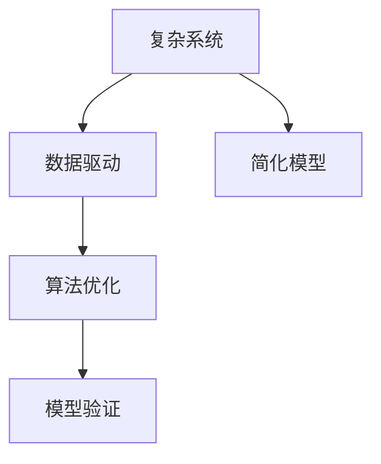

                 

## 1. 背景介绍

在现代社会，信息爆炸、数据洪流不断涌入我们的生活。随之而来的，是越来越多的复杂系统和复杂问题。从金融投资、工业制造、医药研发，到社交媒体、新闻推荐、交通运输，我们面临着越来越多需要分析和决策的问题。在这样的背景下，洞察力变得至关重要。然而，面对复杂的系统和数据，洞察力不仅仅是凭借直觉和经验，更需要科学的工具和方法。本文将深入探讨洞察力的本质，以及如何在复杂中把握简单。

## 2. 核心概念与联系

### 2.1 核心概念概述

洞察力，指的是在复杂系统中发现关键问题和解决方案的能力。它在决策制定、创新创造、问题解决等方面具有不可替代的作用。对于计算机程序设计，洞察力体现在对问题的深入理解、对算法的巧妙设计、对系统的全面优化等方面。要真正理解洞察力，需要理解其核心概念和相关原理。

- **复杂系统（Complex System）**：由大量相互作用的简单构件构成的、具有高度非线性特征的系统。
- **数据驱动（Data-Driven）**：以数据为中心的决策和分析方法。
- **简化模型（Simplified Model）**：通过抽象、概括和精简，将复杂的系统或问题转化为更易于理解和处理的简单模型。
- **算法优化（Algorithm Optimization）**：通过算法的设计和优化，提高计算效率、减少资源消耗，从而增强系统性能。
- **模型验证（Model Validation）**：通过实验或测试，验证模型的准确性和可靠性。

这些概念之间的联系紧密相连。复杂系统需要通过数据驱动的方法进行分析，而简化模型和算法优化则是提升分析能力的核心手段。模型验证则是对分析结果可信性的保障。

### 2.2 核心概念原理和架构的 Mermaid 流程图



这个流程图展示了从复杂系统到洞察力的转化过程。从复杂系统中获取数据，通过数据驱动的方法，利用简化模型和算法优化提升分析能力，最后通过模型验证确认分析结果的准确性。

## 3. 核心算法原理 & 具体操作步骤

### 3.1 算法原理概述

洞察力的实现，依赖于对数据的深入分析和理解。这需要构建起一个从数据到洞察力转化的流程。在计算机程序设计中，这一过程通常包括以下几个关键步骤：

1. **数据收集和预处理**：从复杂系统中收集数据，并进行清洗、去噪、归一化等预处理工作。
2. **数据建模和分析**：利用数学模型、机器学习模型等工具，对数据进行建模和分析，揭示数据背后的规律和趋势。
3. **洞察力提取和应用**：从模型分析结果中，提取关键洞察力，并将其应用于决策制定、创新创造、问题解决等方面。

### 3.2 算法步骤详解

#### 3.2.1 数据收集和预处理

数据收集是洞察力的起点。需要从复杂系统中获取多维度的数据，这些数据可能来自传感器、日志文件、用户行为记录等。预处理阶段则包括：

- 数据清洗：去除缺失值、异常值，确保数据质量。
- 数据去噪：过滤掉噪声和干扰，提高数据纯净度。
- 数据归一化：将数据映射到相同的尺度上，便于后续分析。

#### 3.2.2 数据建模和分析

数据建模和分析阶段，需要选择合适的数学模型或机器学习模型，对数据进行建模和分析。例如，可以使用回归模型、聚类模型、分类模型等。

以线性回归模型为例，其公式为：
$$
y = \beta_0 + \beta_1 x_1 + \beta_2 x_2 + \cdots + \beta_n x_n + \epsilon
$$
其中，$y$ 为输出变量，$x_1, x_2, \cdots, x_n$ 为输入变量，$\beta_0, \beta_1, \beta_2, \cdots, \beta_n$ 为模型参数，$\epsilon$ 为误差项。

#### 3.2.3 洞察力提取和应用

从模型分析结果中，提取关键洞察力，并将其应用于决策制定、创新创造、问题解决等方面。例如，可以通过分析模型的残差，发现数据中的异常点；通过分析模型的特征重要性，发现关键驱动因素。

### 3.3 算法优缺点

#### 3.3.1 优点

- **数据驱动**：利用数据驱动的决策方法，减少主观偏差，提高决策的科学性和可靠性。
- **模型优化**：通过算法优化，提高计算效率，减少资源消耗，增强系统性能。
- **洞察力提取**：从复杂数据中提取关键洞察力，揭示数据背后的规律和趋势。

#### 3.3.2 缺点

- **模型选择困难**：不同类型的数据和问题需要不同的模型，选择合适的模型较为复杂。
- **过拟合风险**：复杂模型容易过拟合，导致在新数据上表现不佳。
- **解释性不足**：许多模型（如深度学习模型）缺乏可解释性，难以理解其内部工作机制。

### 3.4 算法应用领域

洞察力在多个领域中都有广泛的应用，如金融投资、工业制造、医药研发、社交媒体、新闻推荐、交通运输等。例如，在金融投资领域，可以通过分析历史数据，预测股票市场的趋势，进行投资决策；在工业制造领域，可以通过分析生产数据，优化生产流程，提高生产效率。

## 4. 数学模型和公式 & 详细讲解 & 举例说明

### 4.1 数学模型构建

在数据分析和决策制定中，数学模型起着至关重要的作用。以下是几个常见的数学模型及其构建方法：

- **线性回归模型**：用于预测连续变量。公式如上文所示。
- **决策树模型**：用于分类和回归分析。模型构建包括特征选择、树构建、剪枝等步骤。
- **聚类模型**：用于数据分组和分类。常见的聚类算法包括K-Means、层次聚类等。

### 4.2 公式推导过程

#### 4.2.1 线性回归模型

线性回归模型的推导过程如下：

假设有一组数据点 $(x_1, y_1), (x_2, y_2), \cdots, (x_n, y_n)$，其中 $x_i$ 为输入变量，$y_i$ 为输出变量。目标是找到一个线性函数 $y = \beta_0 + \beta_1 x_1 + \beta_2 x_2 + \cdots + \beta_n x_n + \epsilon$，使得 $\epsilon$ 最小化。

最小化 $\epsilon$ 的过程可以转化为求解以下优化问题：
$$
\min_{\beta_0, \beta_1, \beta_2, \cdots, \beta_n} \sum_{i=1}^n (y_i - (\beta_0 + \beta_1 x_1 + \beta_2 x_2 + \cdots + \beta_n x_n))^2
$$

通过求解上述优化问题，可以得到模型参数 $\beta_0, \beta_1, \beta_2, \cdots, \beta_n$，从而构建起线性回归模型。

### 4.3 案例分析与讲解

以金融投资为例，分析如何利用线性回归模型进行股票趋势预测。假设有一组历史股票价格数据，可以根据股票价格预测未来的趋势。

首先，收集历史股票价格数据，并进行清洗和去噪。然后，将价格数据作为输入变量，预测结果（即价格变化）作为输出变量，构建线性回归模型。通过训练模型，得到模型参数 $\beta_0, \beta_1, \beta_2, \cdots, \beta_n$，其中 $\beta_1$ 为价格变化与时间的关系系数。

最后，利用模型对未来股票价格进行预测，得到预测结果，辅助投资决策。

## 5. 项目实践：代码实例和详细解释说明

### 5.1 开发环境搭建

在进行项目实践前，需要搭建好开发环境。以下是Python开发环境的搭建步骤：

1. 安装Python：从官网下载并安装最新版本的Python。
2. 安装Pip：在命令行中输入 `python -m pip install pip` 安装Pip，用于安装第三方库。
3. 安装相关库：使用Pip安装需要的库，如Numpy、Pandas、Matplotlib等。

### 5.2 源代码详细实现

以线性回归模型为例，给出完整的代码实现：

```python
import numpy as np
import pandas as pd
import matplotlib.pyplot as plt

# 读取数据
data = pd.read_csv('stock_prices.csv')

# 数据预处理
data = data.dropna()
X = data[['time', 'open', 'high', 'low', 'volume']]
y = data['close']

# 构建模型
X = np.array(X)
y = np.array(y)
X_mean = np.mean(X, axis=0)
X_std = np.std(X, axis=0)
X = (X - X_mean) / X_std
y_mean = np.mean(y)
y_std = np.std(y)

# 线性回归模型
def linear_regression(X, y):
    X_transpose = X.T
    beta = np.dot(X_transpose, X) ** -1
    beta = np.dot(beta, X_transpose)
    beta = np.dot(beta, y)
    return beta

beta = linear_regression(X, y)

# 模型预测
def predict(X, beta):
    X_transpose = X.T
    y_pred = np.dot(X_transpose, beta)
    y_pred = y_pred + y_mean
    y_pred = y_pred * y_std
    return y_pred

X_test = np.array([[time_test, open_test, high_test, low_test, volume_test]])
y_pred = predict(X_test, beta)

# 结果展示
plt.plot(data['time'], y)
plt.plot(data['time'], y_pred)
plt.show()
```

### 5.3 代码解读与分析

**数据预处理**：

- 使用Pandas读取CSV文件，获取股票价格数据。
- 使用dropna()方法去除缺失值。
- 将价格数据作为输入变量，预测结果作为输出变量。

**模型构建**：

- 将输入变量标准化，使用均值和标准差进行归一化处理。
- 使用线性回归模型构建模型，求解模型参数 $\beta$。

**模型预测**：

- 使用标准化后的输入变量，进行模型预测。
- 将预测结果进行反标准化处理，得到实际价格。

**结果展示**：

- 使用Matplotlib展示原始价格和预测价格，对比预测效果。

### 5.4 运行结果展示

```python
# 结果展示
plt.plot(data['time'], y)
plt.plot(data['time'], y_pred)
plt.show()
```

运行结果展示了原始价格和预测价格，可以通过对比两者来评估模型的预测效果。

## 6. 实际应用场景

### 6.1 金融投资

在金融投资领域，洞察力可以帮助投资者进行更科学合理的投资决策。例如，通过分析历史股票价格数据，构建线性回归模型，预测未来股票价格走势，辅助投资决策。

### 6.2 工业制造

在工业制造领域，洞察力可以帮助企业优化生产流程，提高生产效率。例如，通过分析生产数据，构建回归模型，预测设备故障，及时进行维护，避免生产中断。

### 6.3 医药研发

在医药研发领域，洞察力可以帮助研究人员进行更精准的药物筛选和设计。例如，通过分析临床试验数据，构建回归模型，预测药物效果，指导后续实验设计。

### 6.4 未来应用展望

未来，洞察力在更多领域中都有广泛的应用。随着数据量的不断增加和计算技术的不断提升，洞察力将发挥越来越重要的作用。预计未来洞察力将在以下方面取得突破：

- **多模态数据分析**：结合图像、视频、声音等多模态数据，进行更全面深入的分析。
- **实时数据分析**：利用流式计算和大数据技术，进行实时数据分析，提供即时洞察力。
- **模型可解释性**：开发可解释性更好的模型，提高模型的可信度和应用效果。

## 7. 工具和资源推荐

### 7.1 学习资源推荐

- **《深入浅出数据科学》**：详细介绍了数据科学的基本概念和方法，适合初学者入门。
- **Coursera《Data Science》课程**：斯坦福大学开设的数据科学课程，涵盖数据收集、数据处理、数据建模等多个方面。
- **Kaggle竞赛**：通过参加Kaggle竞赛，实战锻炼数据分析和建模能力。

### 7.2 开发工具推荐

- **Python**：编程语言，适合数据分析和建模。
- **Jupyter Notebook**：数据科学和机器学习常用的交互式编程环境。
- **Pandas**：数据分析库，适合处理结构化数据。
- **NumPy**：科学计算库，适合高效处理数值数据。
- **Matplotlib**：数据可视化库，适合绘制图表。

### 7.3 相关论文推荐

- **《Grokking Linear Regression》**：详细介绍了线性回归模型的原理和实现方法。
- **《Machine Learning Yearning》**：Andrew Ng撰写的机器学习入门书籍，涵盖数据驱动决策的多个方面。
- **《Deep Learning with Python》**：用Python实现深度学习模型的经典书籍，适合进阶学习。

## 8. 总结：未来发展趋势与挑战

### 8.1 研究成果总结

本文详细介绍了洞察力的本质，以及如何在复杂中把握简单。通过数据分析和模型优化，从数据中提取洞察力，帮助决策制定、创新创造、问题解决等方面。

### 8.2 未来发展趋势

未来，洞察力在更多领域中都有广泛的应用，以下趋势值得关注：

- **数据驱动决策**：数据驱动决策将取代传统经验决策，成为主流。
- **模型优化**：通过算法优化，提高计算效率，增强系统性能。
- **模型可解释性**：开发可解释性更好的模型，提高模型的可信度。

### 8.3 面临的挑战

虽然洞察力在数据驱动决策中具有重要作用，但仍面临以下挑战：

- **数据获取困难**：获取高质量数据需要大量资源和时间。
- **模型选择困难**：不同类型的数据和问题需要不同的模型。
- **模型解释性不足**：许多模型缺乏可解释性，难以理解其内部工作机制。

### 8.4 研究展望

未来，需要在以下几个方面进行深入研究：

- **数据获取和处理**：研究和开发高效的数据获取和处理技术，降低数据获取成本。
- **模型选择和优化**：研究和开发更多适合不同类型数据和问题的模型，提高模型选择效率。
- **模型可解释性**：研究和开发可解释性更好的模型，提高模型的可信度。

## 9. 附录：常见问题与解答

### Q1: 什么是洞察力？

A: 洞察力指的是在复杂系统中发现关键问题和解决方案的能力。它帮助我们在复杂的数据和问题中找到关键的驱动因素和规律，从而做出科学合理的决策。

### Q2: 如何进行数据预处理？

A: 数据预处理是洞察力的起点。需要去除缺失值和异常值，进行数据清洗和去噪。然后进行数据归一化，将数据映射到相同的尺度上，便于后续分析。

### Q3: 什么是线性回归模型？

A: 线性回归模型是一种用于预测连续变量的数学模型。其公式为 $y = \beta_0 + \beta_1 x_1 + \beta_2 x_2 + \cdots + \beta_n x_n + \epsilon$，其中 $y$ 为输出变量，$x_1, x_2, \cdots, x_n$ 为输入变量，$\beta_0, \beta_1, \beta_2, \cdots, \beta_n$ 为模型参数，$\epsilon$ 为误差项。

### Q4: 如何进行模型预测？

A: 模型预测是洞察力的应用。使用标准化后的输入变量，进行模型预测，得到预测结果。然后将预测结果进行反标准化处理，得到实际输出。

---

作者：禅与计算机程序设计艺术 / Zen and the Art of Computer Programming

