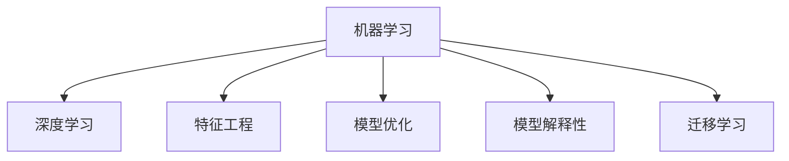

                 

# 理解洞察力的艺术：在纷繁中把握本质

> 关键词：洞察力, 数据分析, 机器学习, 数据驱动决策, 模型优化

## 1. 背景介绍

### 1.1 问题由来

在当今数据驱动的时代，我们面临着海量数据的挑战。无论是互联网公司、金融机构、还是政府部门，都面临着如何从大量数据中提取洞察力，做出科学决策的问题。在数据分析领域，“洞察力”一词通常指对数据背后真实规律的深度理解和应用。例如，社交媒体数据可以用来分析用户行为模式，金融数据可以用来评估市场趋势，医疗数据可以用来研究疾病传播等。然而，数据规模的激增同时也带来了处理和分析的复杂性。传统的统计分析和模型训练方法，难以应对数据规模和维度日益增长的趋势。

近年来，机器学习和深度学习技术的发展，为数据分析带来了新的解决方案。通过构建数据驱动的模型，我们能够自动地从数据中学习规律，并用于预测、分类、聚类、降维等任务。机器学习模型在许多应用中展示了强大的效果，但模型的复杂性和参数的过多，也带来了新的挑战：如何高效地提取和利用数据中的洞察力？如何在纷繁的数据中把握本质？

### 1.2 问题核心关键点

为了回答这些问题，我们需要从理论和实践中，深入理解机器学习模型的洞察力来源，学习如何通过优化模型，更好地从数据中提取洞察力。具体来说，包括以下几个关键点：

1. **数据驱动与知识驱动的结合**：机器学习模型往往需要依赖大量数据进行训练，但在数据有限或质量不佳的情况下，模型难以发挥作用。如何结合领域知识，通过少量数据也能构建有效的模型，是一个重要研究方向。
2. **模型选择与优化**：模型选择和参数调优是模型性能提升的关键。不同算法和架构适用于不同的任务类型和数据分布。如何根据具体任务选择合适的模型，并对其进行有效优化，将直接影响模型性能。
3. **高效数据表示与特征工程**：在构建模型之前，需要合理地进行数据表示和特征提取。高效的数据表示方法可以减少模型的过拟合风险，提高模型的泛化能力。
4. **模型解释性与可解释性**：很多情况下，模型的输出解释性是至关重要的。如何在保证模型性能的同时，提高其解释性和可解释性，将有助于提高模型可信度。
5. **跨领域应用与迁移学习**：在多个领域中，同一数据源下的应用模型往往需要适配不同的应用场景。如何通过迁移学习，在不同任务间进行模型迁移，实现高效复用，是提升模型应用效率的关键。

这些问题相互交织，构成了机器学习领域的一个重要研究方向。本文章将围绕这些问题，详细讨论如何通过优化模型，高效地从数据中提取洞察力，并在多个领域中发挥作用。

## 2. 核心概念与联系

### 2.1 核心概念概述

为更好地理解机器学习模型中的洞察力，本节将介绍几个密切相关的核心概念：

- **机器学习（Machine Learning）**：一种数据驱动的人工智能技术，通过构建模型，从数据中学习规律，用于预测、分类、聚类、降维等任务。
- **深度学习（Deep Learning）**：机器学习的一个分支，通过多层次神经网络结构，学习数据中的复杂特征，适用于图像、语音、自然语言处理等任务。
- **特征工程（Feature Engineering）**：在模型构建前，对原始数据进行预处理和特征提取，以提高模型性能和解释性。
- **模型优化（Model Optimization）**：通过调整模型参数、结构，提高模型在特定任务上的性能，并降低计算和存储成本。
- **模型解释性（Model Interpretability）**：理解模型内部运作机制，解释模型输出结果的能力，有助于提高模型可信度和应用效率。
- **迁移学习（Transfer Learning）**：通过将预训练模型应用于新任务，提高模型在新数据集上的性能，适用于数据量较小、领域知识有限的情况。

这些概念之间的逻辑关系可以通过以下Mermaid流程图来展示：



这个流程图展示了几大核心概念之间的联系：机器学习通过深度学习构建模型，特征工程在数据处理中提升模型性能，模型优化通过调整参数和结构提高模型效果，模型解释性通过理解模型内部运作机制，增强模型的可信度，迁移学习通过复用预训练模型提升新任务上的性能。

## 3. 核心算法原理 & 具体操作步骤
### 3.1 算法原理概述

在机器学习中，模型的性能通常由训练数据集和模型结构共同决定。通过优化模型结构、参数和训练方法，可以显著提升模型性能。以下是几种常见的模型优化方法：

- **正则化（Regularization）**：通过在损失函数中添加正则项，减少模型复杂度，防止过拟合。
- **参数共享（Parameter Sharing）**：在迁移学习中，通过共享预训练模型的参数，加速新任务的模型训练。
- **梯度下降（Gradient Descent）**：通过反向传播算法，更新模型参数，最小化损失函数，优化模型性能。
- **模型集成（Model Ensemble）**：通过组合多个模型，提高模型的泛化能力和稳定性。
- **自适应学习率（Adaptive Learning Rate）**：根据梯度大小动态调整学习率，提高训练效率。

### 3.2 算法步骤详解

以深度学习模型为例，其一般优化流程包括以下几个步骤：

**Step 1: 数据准备**
- 收集和预处理数据集，分为训练集、验证集和测试集。
- 对数据进行标准化和归一化处理，如均值归一化、归一化分母等。

**Step 2: 模型选择与初始化**
- 根据任务类型和数据分布，选择合适的模型架构和优化器。
- 使用随机初始化方法，给模型参数赋予初始值。

**Step 3: 前向传播与损失计算**
- 将输入数据输入模型，进行前向传播，计算模型输出。
- 根据任务类型，选择相应的损失函数，计算模型预测与真实标签之间的差异。

**Step 4: 反向传播与参数更新**
- 使用反向传播算法，计算损失函数对每个参数的梯度。
- 根据梯度方向和大小，使用优化器更新模型参数。

**Step 5: 验证集评估**
- 在验证集上评估模型性能，选择性能最好的模型参数。
- 使用早停法（Early Stopping）等技术，防止过拟合。

**Step 6: 测试集评估**
- 在测试集上评估模型性能，确保模型泛化能力。
- 记录模型在各个数据集上的性能，用于后续对比和优化。

### 3.3 算法优缺点

深度学习模型的优化方法具有以下优点：

1. 自动化程度高。自动化学习参数，减少了手动调整的复杂性。
2. 泛化能力强。通过学习复杂特征，模型适用于多种任务类型和数据分布。
3. 可解释性差。深度学习模型通常被视为“黑盒”，难以理解其内部运作机制。
4. 计算资源需求高。深度学习模型通常需要大量的计算资源进行训练和推理。

同时，这些方法也存在一定的局限性：

1. 对数据质量敏感。深度学习模型需要大量高质量数据进行训练，数据噪音和缺失可能导致模型性能下降。
2. 过拟合风险高。模型复杂度高，容易在训练集上表现良好，但在测试集上泛化性能不佳。
3. 模型结构复杂。深度学习模型的复杂结构增加了维护和调试难度。
4. 参数调整困难。模型参数数量巨大，手动调整需要大量时间和经验。

尽管存在这些局限性，但深度学习模型在多个领域展示了强大的性能和应用潜力，未来仍有广阔的发展空间。

### 3.4 算法应用领域

深度学习模型已经在多个领域展示了强大的洞察力提取能力，例如：

- 图像识别：通过深度卷积神经网络（CNN），对图像进行分类、分割、检测等任务。
- 自然语言处理（NLP）：通过循环神经网络（RNN）、Transformer等模型，对文本进行情感分析、语言翻译、摘要生成等任务。
- 医疗影像分析：通过深度学习模型，对医疗影像进行肿瘤检测、病变分析等任务。
- 语音识别：通过深度神经网络，对语音进行转录、情感分析等任务。
- 机器人控制：通过深度学习模型，对机器人进行行为规划、路径规划等任务。

这些应用领域展示了深度学习模型在数据驱动决策中的强大能力，未来在更多领域中，深度学习模型仍将继续发挥重要作用。

## 4. 数学模型和公式 & 详细讲解  
### 4.1 数学模型构建

在深度学习中，常用的数学模型包括神经网络、卷积神经网络（CNN）、循环神经网络（RNN）等。以下以全连接神经网络为例，介绍其数学模型的构建过程。

假设输入数据 $x \in \mathbb{R}^d$，输出标签 $y \in \{0,1\}$，模型的损失函数为二分类交叉熵损失：

$$
L = -\frac{1}{N} \sum_{i=1}^N (y_i \log \hat{y_i} + (1-y_i) \log (1-\hat{y_i}))
$$

其中 $\hat{y_i}$ 为模型预测概率，$y_i$ 为真实标签。

### 4.2 公式推导过程

以二分类为例，模型的数学推导过程如下：

1. 假设模型为全连接神经网络，输入层有 $d$ 个神经元，输出层有 $1$ 个神经元。中间层为 $n$ 个神经元。
2. 输入层到中间层的权重矩阵为 $W_1 \in \mathbb{R}^{n \times d}$，中间层到输出层的权重矩阵为 $W_2 \in \mathbb{R}^{1 \times n}$，中间层偏置向量为 $b_1 \in \mathbb{R}^n$，输出层偏置向量为 $b_2 \in \mathbb{R}^1$。
3. 前向传播过程：$z_1 = xW_1 + b_1$，$z_2 = \sigma(z_1)W_2 + b_2$，其中 $\sigma$ 为激活函数。
4. 损失函数计算：$L = -\frac{1}{N} \sum_{i=1}^N [y_i \log \hat{y_i} + (1-y_i) \log (1-\hat{y_i})]$。
5. 反向传播过程：$\nabla_{W_2} L = \frac{\partial L}{\partial z_2} \frac{\partial z_2}{\partial W_2}$，$\nabla_{b_2} L = \frac{\partial L}{\partial z_2} \frac{\partial z_2}{\partial b_2}$，$\nabla_{W_1} L = \frac{\partial L}{\partial z_1} \frac{\partial z_1}{\partial W_1}$，$\nabla_{b_1} L = \frac{\partial L}{\partial z_1} \frac{\partial z_1}{\partial b_1}$。
6. 参数更新：$W_1 = W_1 - \eta \nabla_{W_1} L$，$b_1 = b_1 - \eta \nabla_{b_1} L$，$W_2 = W_2 - \eta \nabla_{W_2} L$，$b_2 = b_2 - \eta \nabla_{b_2} L$，其中 $\eta$ 为学习率。

通过上述过程，可以逐步更新模型参数，最小化损失函数，提高模型性能。

## 5. 项目实践：代码实例和详细解释说明
### 5.1 开发环境搭建

在进行深度学习项目实践前，我们需要准备好开发环境。以下是使用Python进行TensorFlow开发的环境配置流程：

1. 安装Anaconda：从官网下载并安装Anaconda，用于创建独立的Python环境。

2. 创建并激活虚拟环境：
```bash
conda create -n tensorflow-env python=3.8 
conda activate tensorflow-env
```

3. 安装TensorFlow：根据CUDA版本，从官网获取对应的安装命令。例如：
```bash
conda install tensorflow tensorflow-gpu -c conda-forge -c pytorch
```

4. 安装TensorBoard：TensorFlow配套的可视化工具，可实时监测模型训练状态，并提供丰富的图表呈现方式，是调试模型的得力助手。

5. 安装TensorFlow Addons：提供了更多深度学习算法和工具，如Transformer、Estimator等。

完成上述步骤后，即可在`tensorflow-env`环境中开始深度学习实践。

### 5.2 源代码详细实现

这里我们以手写数字识别（MNIST）任务为例，给出使用TensorFlow对卷积神经网络（CNN）进行训练和微调的PyTorch代码实现。

```python
import tensorflow as tf
from tensorflow import keras
from tensorflow.keras import layers

# 加载MNIST数据集
(x_train, y_train), (x_test, y_test) = keras.datasets.mnist.load_data()

# 数据预处理
x_train = x_train.reshape(-1, 28, 28, 1).astype("float32") / 255.0
x_test = x_test.reshape(-1, 28, 28, 1).astype("float32") / 255.0
y_train = keras.utils.to_categorical(y_train, 10)
y_test = keras.utils.to_categorical(y_test, 10)

# 构建CNN模型
model = keras.Sequential(
    [
        layers.Conv2D(32, 3, activation="relu", input_shape=(28, 28, 1)),
        layers.MaxPooling2D(),
        layers.Flatten(),
        layers.Dense(10, activation="softmax"),
    ]
)

# 编译模型
model.compile(optimizer="adam", loss="categorical_crossentropy", metrics=["accuracy"])

# 训练模型
model.fit(x_train, y_train, epochs=5, batch_size=32, validation_data=(x_test, y_test))

# 评估模型
test_loss, test_acc = model.evaluate(x_test, y_test)
print(f"Test accuracy: {test_acc}")
```

### 5.3 代码解读与分析

让我们再详细解读一下关键代码的实现细节：

1. 数据加载和预处理：使用`keras.datasets.mnist.load_data()`加载MNIST数据集，并进行标准化处理，将像素值归一化为[0,1]区间。
2. 模型构建：通过`Sequential`容器，依次添加卷积层、池化层和全连接层，最终输出一个包含10个神经元的分类器。
3. 模型编译：使用`compile`方法，指定优化器、损失函数和评估指标，准备进行训练。
4. 模型训练：使用`fit`方法，在训练集上进行训练，指定训练轮数和批次大小，并在验证集上进行评估。
5. 模型评估：使用`evaluate`方法，在测试集上评估模型性能，输出准确率。

可以看到，TensorFlow提供了一套完整且易用的接口，可以方便地构建和训练深度学习模型。开发者可以专注于模型设计和训练细节，而无需过多关注底层实现。

## 6. 实际应用场景
### 6.1 智能医疗

深度学习模型在智能医疗领域展示了强大的洞察力提取能力。通过分析医疗影像、电子病历等数据，深度学习模型可以实现疾病诊断、治疗方案推荐、病人监护等任务。例如，卷积神经网络（CNN）可以通过分析医疗影像，自动检测肿瘤、病变等异常情况，辅助医生进行诊断和治疗。

在技术实现上，可以收集医院内的医疗影像数据，进行标注和预处理。在此基础上，对预训练模型进行微调，使其能够自动识别病灶区域，生成诊断报告。微调后的模型可以嵌入医院信息系统（HIS），实时对输入的影像数据进行检测和分析，提供初步诊断建议。

### 6.2 金融风险管理

深度学习模型在金融风险管理中也具有重要作用。通过分析金融市场数据、交易记录等，深度学习模型可以预测市场趋势、评估投资风险、识别异常交易等。例如，循环神经网络（RNN）可以通过分析交易记录，预测股票价格走势，辅助投资者进行投资决策。

在技术实现上，可以收集金融市场数据和交易记录，进行预处理和标注。在此基础上，对预训练模型进行微调，使其能够预测股票价格、评估投资风险等。微调后的模型可以嵌入投资管理系统，实时监控市场动态，提供投资建议和风险预警。

### 6.3 自动驾驶

深度学习模型在自动驾驶领域展示了强大的洞察力提取能力。通过分析传感器数据、道路信息等，深度学习模型可以实现自动驾驶、路径规划、障碍物检测等任务。例如，卷积神经网络（CNN）可以通过分析摄像头图像，识别道路标志、交通信号等，辅助车辆进行路径规划和驾驶决策。

在技术实现上，可以收集自动驾驶车辆传感器数据，进行标注和预处理。在此基础上，对预训练模型进行微调，使其能够实时处理传感器数据，进行环境感知和路径规划。微调后的模型可以嵌入车辆控制系统，实现自动驾驶功能。

## 7. 工具和资源推荐
### 7.1 学习资源推荐

为了帮助开发者系统掌握深度学习模型的洞察力来源，这里推荐一些优质的学习资源：

1. 《深度学习》课程：斯坦福大学开设的深度学习课程，涵盖了深度学习的基本概念和经典模型，是入门深度学习的必备资源。
2. 《深度学习实战》书籍：实战性较强的深度学习教程，通过多个实际案例，讲解深度学习模型的构建和训练。
3. 《TensorFlow官方文档》：TensorFlow官方文档，提供了详细的API和教程，是学习和实践TensorFlow的重要资源。
4. Kaggle平台：数据科学竞赛平台，提供了大量的数据集和竞赛任务，是学习和实践深度学习的好地方。
5. GitHub代码库：全球最大的开源代码库，提供了大量深度学习项目的代码和文档，是学习和实践深度学习的好资源。

通过对这些资源的学习实践，相信你一定能够快速掌握深度学习模型的洞察力来源，并用于解决实际的深度学习问题。

### 7.2 开发工具推荐

高效的深度学习开发离不开优秀的工具支持。以下是几款用于深度学习开发和应用的工具：

1. TensorFlow：由Google主导开发的深度学习框架，生产部署方便，适合大规模工程应用。
2. PyTorch：基于Python的开源深度学习框架，灵活动态的计算图，适合快速迭代研究。
3. Keras：高层次的深度学习框架，提供了简单易用的接口，适合快速构建模型。
4. Scikit-learn：机器学习库，提供了丰富的算法和工具，适合进行数据预处理和模型评估。
5. OpenCV：计算机视觉库，提供了丰富的图像处理和分析工具，适合进行图像识别和处理任务。

合理利用这些工具，可以显著提升深度学习模型的开发效率，加快创新迭代的步伐。

### 7.3 相关论文推荐

深度学习模型的研究源于学界的持续研究。以下是几篇奠基性的相关论文，推荐阅读：

1. AlexNet: ImageNet Classification with Deep Convolutional Neural Networks：提出卷积神经网络（CNN）结构，在图像识别任务上取得了突破性成果。
2. Deep Residual Learning for Image Recognition：提出残差网络（ResNet）结构，进一步提升了深度神经网络的性能。
3. Attention Is All You Need：提出Transformer结构，开启了自然语言处理（NLP）领域的预训练大模型时代。
4. Generative Adversarial Nets：提出生成对抗网络（GAN），用于生成图像、视频、音频等数据。
5. Learning to Generate Captions for Image Description：提出使用RNN和CNN联合模型进行图像描述生成任务，展示了深度学习在跨模态任务中的强大能力。

这些论文代表了大深度学习模型的发展脉络。通过学习这些前沿成果，可以帮助研究者把握学科前进方向，激发更多的创新灵感。

## 8. 总结：未来发展趋势与挑战

### 8.1 总结

本文对深度学习模型的优化方法进行了全面系统的介绍。首先阐述了深度学习模型在数据驱动决策中的重要性，明确了模型优化在提升模型性能中的关键作用。其次，从原理到实践，详细讲解了深度学习模型的优化过程，包括数据准备、模型构建、损失函数、参数更新等步骤，给出了深度学习模型的完整代码实例。同时，本文还广泛探讨了深度学习模型在多个领域的应用前景，展示了其强大的洞察力提取能力。

通过本文的系统梳理，可以看到，深度学习模型在多个领域展示了巨大的应用潜力，正逐步成为数据驱动决策的重要工具。未来，伴随深度学习模型和优化方法的持续演进，将进一步提升其在多个领域的应用效果。

### 8.2 未来发展趋势

展望未来，深度学习模型优化技术将呈现以下几个发展趋势：

1. 模型结构多样化：未来的深度学习模型将不再局限于神经网络结构，而是根据不同任务特点，发展出更多样的模型架构，如卷积神经网络（CNN）、循环神经网络（RNN）、Transformer等。
2. 模型训练高效化：未来的深度学习模型训练将更加高效，如分布式训练、混合精度训练、动态图等技术将得到广泛应用。
3. 模型解释性提升：未来的深度学习模型将更加注重解释性，如可视化技术、可解释性算法等，将进一步提高模型的可信度。
4. 跨模态融合加强：未来的深度学习模型将更加注重跨模态融合，如视觉、语音、文本等数据的联合建模，实现多模态数据的高效利用。
5. 模型迁移能力增强：未来的深度学习模型将更加注重迁移学习能力，通过预训练模型和新任务的微调，实现高效模型复用。

以上趋势凸显了深度学习模型优化技术的广阔前景。这些方向的探索发展，必将进一步提升深度学习模型的性能和应用范围，为数据驱动决策提供更加可靠的工具。

### 8.3 面临的挑战

尽管深度学习模型在多个领域展示了强大的洞察力提取能力，但在迈向更加智能化、普适化应用的过程中，它仍面临着诸多挑战：

1. 数据质量问题：深度学习模型需要大量高质量数据进行训练，数据质量问题可能导致模型性能下降。
2. 过拟合风险：深度学习模型通常具有较强的拟合能力，容易在训练集上表现良好，但在测试集上泛化性能不佳。
3. 模型结构复杂：深度学习模型的复杂结构增加了维护和调试难度。
4. 计算资源需求高：深度学习模型通常需要大量的计算资源进行训练和推理。
5. 可解释性差：深度学习模型通常被视为“黑盒”，难以理解其内部运作机制。

尽管存在这些挑战，但深度学习模型在多个领域展示了强大的性能和应用潜力，未来仍有广阔的发展空间。

### 8.4 研究展望

面对深度学习模型优化技术所面临的挑战，未来的研究需要在以下几个方面寻求新的突破：

1. 数据增强与数据扩充：通过数据增强和扩充技术，提高数据质量，增加训练样本数量，防止数据过拟合。
2. 模型压缩与剪枝：通过模型压缩和剪枝技术，减少模型参数量，提高计算效率，降低资源消耗。
3. 跨模态融合与联合建模：通过跨模态融合和联合建模技术，实现视觉、语音、文本等数据的联合建模，提升模型性能。
4. 模型迁移学习与知识复用：通过迁移学习技术，实现不同任务之间的知识复用，提高模型在新任务上的泛化能力。
5. 模型解释性与可解释性：通过模型解释性和可解释性技术，提高模型的可信度和应用价值。

这些研究方向将推动深度学习模型优化技术的不断进步，为数据驱动决策提供更加可靠的工具。

## 9. 附录：常见问题与解答

**Q1：深度学习模型与传统机器学习模型的区别是什么？**

A: 深度学习模型与传统机器学习模型的主要区别在于模型结构的复杂性和训练方法的不同。深度学习模型通常包含多个隐藏层，可以通过反向传播算法自动学习特征表示，适用于非线性关系和复杂任务。而传统机器学习模型通常仅包含单层或少量层，需要手动进行特征工程，适用于线性关系和简单任务。

**Q2：深度学习模型容易过拟合的原因是什么？**

A: 深度学习模型容易过拟合的原因主要有以下几点：
1. 模型复杂度高：深度学习模型包含大量参数，容易在训练集上学习到噪声信息，导致过拟合。
2. 数据量小：深度学习模型需要大量数据进行训练，数据量不足可能导致过拟合。
3. 训练时间长：深度学习模型通常需要长时间训练才能收敛，训练过程中容易过拟合。
4. 正则化不足：深度学习模型通常不使用正则化技术，容易导致过拟合。

为避免过拟合，可以使用数据增强、正则化技术、早停法等方法。

**Q3：深度学习模型在医疗领域的应用前景是什么？**

A: 深度学习模型在医疗领域具有广泛的应用前景。通过分析医疗影像、电子病历等数据，深度学习模型可以实现疾病诊断、治疗方案推荐、病人监护等任务。例如，卷积神经网络（CNN）可以通过分析医疗影像，自动检测肿瘤、病变等异常情况，辅助医生进行诊断和治疗。循环神经网络（RNN）可以通过分析电子病历，预测疾病发展趋势，辅助医生制定治疗方案。

深度学习模型可以显著提高医疗决策的效率和准确性，减少误诊和漏诊，提高医疗服务质量。

**Q4：深度学习模型的参数更新过程是怎样的？**

A: 深度学习模型的参数更新过程通常通过反向传播算法进行。具体步骤如下：
1. 前向传播：将输入数据输入模型，计算模型输出。
2. 损失函数计算：根据任务类型，计算模型预测与真实标签之间的差异。
3. 反向传播：计算损失函数对每个参数的梯度。
4. 参数更新：根据梯度方向和大小，使用优化器更新模型参数。

通过反向传播算法，模型能够自动学习参数，最小化损失函数，提高模型性能。

**Q5：深度学习模型在金融领域的应用前景是什么？**

A: 深度学习模型在金融领域具有广泛的应用前景。通过分析金融市场数据、交易记录等，深度学习模型可以预测市场趋势、评估投资风险、识别异常交易等。例如，循环神经网络（RNN）可以通过分析交易记录，预测股票价格走势，辅助投资者进行投资决策。卷积神经网络（CNN）可以通过分析金融市场数据，识别异常交易行为，提高金融交易安全性。

深度学习模型可以显著提高金融决策的效率和准确性，减少金融风险，提升金融服务质量。

