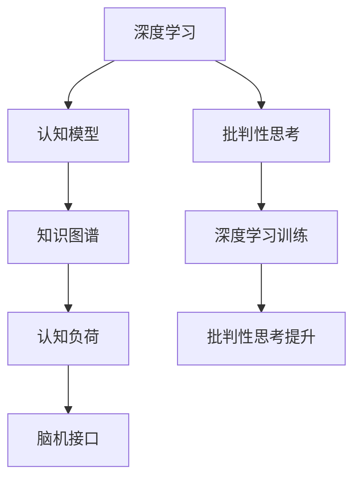

                 

# 理解洞察力的训练：提升批判性思考能力

> 关键词：批判性思考,洞察力训练,深度学习,认知模型,知识图谱,认知负荷,脑机接口

## 1. 背景介绍

### 1.1 问题由来

随着人工智能技术的不断进步，尤其是在深度学习和大数据领域的突破，人类的认知能力也面临着前所未有的挑战和机遇。如何更好地理解和提升人类的批判性思考能力，成为当前认知科学与人工智能研究的重要课题。深度学习技术的应用，特别是自然语言处理(NLP)、计算机视觉(CV)等领域，为理解人类认知提供了一种新的方法。本文将探讨如何通过深度学习技术，训练和提升人类的批判性思考能力，以期在教育、决策、创新等方面带来积极影响。

### 1.2 问题核心关键点

批判性思考能力是人类认知的关键部分，包括推理、分析、批判、创造等诸多维度。深度学习技术通过模拟人类神经网络的工作原理，试图理解和模拟人类的认知过程，从而在提升批判性思考能力方面展现出巨大的潜力。然而，现有深度学习模型更多关注于模式识别、图像处理等具体任务，对批判性思考能力的训练和提升仍处于起步阶段。因此，本文旨在通过深度学习技术，系统地探索和训练人类的批判性思考能力，为认知科学与人工智能的交叉研究提供新的视角和方法。

### 1.3 问题研究意义

提升批判性思考能力，对于人类的教育、决策、创新等多个方面都具有重要意义。深度学习技术在这一领域的探索和应用，将有望实现以下目标：

1. **教育革新**：通过定制化的批判性思考训练，帮助学生更好地理解和掌握知识，提升学习效果。
2. **决策支持**：为决策者提供更为全面、深入的分析工具，减少认知偏差，提升决策质量。
3. **创新驱动**：激发创意和创新，为创新思维提供科学依据和方法论。
4. **认知增强**：通过脑机接口等技术，进一步增强人类的认知能力，提升整体思维水平。

本文将围绕深度学习技术在提升批判性思考能力方面的潜力与挑战，展开深入探讨和研究。

## 2. 核心概念与联系

### 2.1 核心概念概述

为更好地理解深度学习在批判性思考能力训练中的作用，本节将介绍几个核心概念：

- **深度学习**：一种模拟人脑神经网络的学习方式，通过多层次的抽象与特征提取，实现对复杂数据的理解和处理。
- **认知模型**：模拟人类认知过程的计算模型，包括感知、记忆、推理等环节，旨在揭示人类认知机制。
- **知识图谱**：以图的形式组织和表示知识结构，帮助机器理解和推理复杂概念和关系。
- **认知负荷**：指在学习或推理过程中，由于认知资源不足而产生的压力和阻碍。
- **脑机接口**：通过神经信号采集与分析，实现人机交互，增强人类的认知和决策能力。

这些核心概念之间的逻辑关系可以通过以下Mermaid流程图来展示：



这个流程图展示了深度学习技术在批判性思考能力训练中的作用和联系：

1. 深度学习通过模拟人类神经网络的工作原理，帮助认知模型理解和处理复杂信息。
2. 认知模型通过知识图谱的组织和推理，实现对知识的高级抽象和应用。
3. 知识图谱通过认知负荷的调节，减轻认知压力，提高推理效率。
4. 脑机接口通过深度学习训练，增强批判性思考能力，提升决策质量。

这些概念共同构成了深度学习技术在批判性思考能力训练中的基础框架，使其能够逐步实现对人类认知的模拟和提升。

## 3. 核心算法原理 & 具体操作步骤
### 3.1 算法原理概述

提升批判性思考能力的深度学习模型，通常基于两种基本算法：

1. **监督学习算法**：通过标注数据集进行训练，模型学习输入与输出之间的映射关系。在批判性思考能力的训练中，输入可以是文本、图像、音频等复杂信息，输出为推理结果、决策选项等。
2. **无监督学习算法**：无需标注数据，通过数据自身的统计特性进行学习。在批判性思考能力训练中，无监督学习算法可以用于探索知识图谱中的隐含关系，发现新的认知模式。

### 3.2 算法步骤详解

基于监督学习的深度学习模型训练批判性思考能力的基本步骤如下：

1. **数据准备**：收集批判性思考任务的数据集，如推理题、决策案例、创新案例等，标注为输入和输出。
2. **模型选择**：选择合适的深度学习模型，如卷积神经网络(CNN)、循环神经网络(RNN)、变压器(Transformer)等，作为批判性思考的推理模型。
3. **模型训练**：使用标注数据集对模型进行训练，调整模型参数，使其能够对输入数据进行推理和决策。
4. **评估与优化**：在测试集上评估模型的推理效果，根据评估结果调整模型参数，优化推理过程。
5. **迁移学习**：将训练好的模型应用于其他任务，通过微调等技术，提升模型的泛化能力。

### 3.3 算法优缺点

基于深度学习的批判性思考能力训练，具有以下优点：

1. **高效性**：深度学习模型能够自动学习特征，减少手工特征提取的复杂度。
2. **可解释性**：深度学习模型的权重和激活值可以提供推理过程中的详细信息，有助于理解模型的决策过程。
3. **泛化能力**：训练好的模型可以在不同场景下进行迁移应用，提升泛化能力。

同时，深度学习技术也存在一些局限性：

1. **数据依赖**：深度学习模型的训练效果高度依赖于标注数据的质量和数量。
2. **过拟合风险**：模型容易过拟合训练数据，导致推理效果不理想。
3. **计算资源需求高**：深度学习模型的训练和推理需要大量计算资源，对硬件要求较高。
4. **模型复杂性**：深度学习模型的结构和参数较多，难以解释和调试。

### 3.4 算法应用领域

深度学习技术在批判性思考能力训练中的应用领域非常广泛，包括但不限于以下几个方面：

1. **教育培训**：通过定制化的批判性思考训练，帮助学生提升学习效果，培养创新思维。
2. **医疗决策**：通过模拟医生的决策过程，提高医疗决策的准确性和科学性。
3. **金融分析**：通过深度学习模型，分析和推理复杂的金融数据，提供投资建议。
4. **创新设计**：通过分析创新案例，挖掘创意和设计模式，提升创新能力。
5. **安全监控**：通过分析监控数据，发现异常行为和潜在威胁，提升安全预警能力。

这些应用领域展示了深度学习技术在提升批判性思考能力方面的广阔前景。

## 4. 数学模型和公式 & 详细讲解 & 举例说明

### 4.1 数学模型构建

批判性思考能力训练的数学模型通常基于以下假设：

- **输入数据**：将批判性思考任务的数据集转换为数值形式，输入到深度学习模型中。
- **模型结构**：选择合适的深度学习模型结构，如多层感知机(MLP)、卷积神经网络(CNN)、循环神经网络(RNN)等。
- **损失函数**：设计合适的损失函数，衡量模型的推理效果与实际结果之间的差异。
- **优化器**：选择合适的优化器，如随机梯度下降(SGD)、Adam等，优化模型参数。

### 4.2 公式推导过程

以下是一个简单的推理任务为例，展示深度学习模型的推理过程：

假设输入数据为文本，模型的输出为推理结果。模型的推理过程可以表示为：

$$
y = f(x; \theta) = g(h_1(x; \theta_1), h_2(x; \theta_2))
$$

其中：
- $x$ 为输入文本，表示推理问题。
- $\theta_1, \theta_2$ 为模型参数，表示模型的推理过程。
- $h_1(x; \theta_1)$ 为第一层的推理特征提取。
- $h_2(x; \theta_2)$ 为第二层的推理特征处理。
- $g(\cdot)$ 为推理规则，将特征进行处理，输出推理结果。

通过反向传播算法，可以计算模型参数 $\theta$ 的梯度，进而更新模型参数，优化推理效果。

### 4.3 案例分析与讲解

以一个简单的逻辑推理任务为例，展示深度学习模型的训练和推理过程。

假设任务为“如果A则B，如果C则D，如果E则F，问如果A且C成立，那么B和D成立吗？”

输入数据为：A, C

模型的推理过程如下：

1. 第一层将输入A, C映射为特征向量 $h_1(A, C; \theta_1)$。
2. 第二层将特征向量 $h_1(A, C; \theta_1)$ 映射为推理结果 $h_2(A, C; \theta_2)$。
3. 推理规则 $g(\cdot)$ 根据推理结果 $h_2(A, C; \theta_2)$，输出推理结论。

通过深度学习模型的训练，模型可以学习到输入与输出之间的映射关系，从而能够正确推理新的案例。

## 5. 项目实践：代码实例和详细解释说明

### 5.1 开发环境搭建

在进行深度学习训练前，我们需要准备好开发环境。以下是使用Python进行TensorFlow开发的环境配置流程：

1. 安装Anaconda：从官网下载并安装Anaconda，用于创建独立的Python环境。

2. 创建并激活虚拟环境：
```bash
conda create -n tf-env python=3.8 
conda activate tf-env
```

3. 安装TensorFlow：根据CUDA版本，从官网获取对应的安装命令。例如：
```bash
conda install tensorflow -c pytorch -c conda-forge
```

4. 安装各类工具包：
```bash
pip install numpy pandas scikit-learn matplotlib tqdm jupyter notebook ipython
```

完成上述步骤后，即可在`tf-env`环境中开始深度学习训练。

### 5.2 源代码详细实现

以下是一个简单的深度学习模型实现，用于推理逻辑推理任务：

```python
import tensorflow as tf
from tensorflow.keras import layers

# 定义模型结构
class LogicModel(tf.keras.Model):
    def __init__(self):
        super(LogicModel, self).__init__()
        self.fc1 = layers.Dense(16, activation='relu')
        self.fc2 = layers.Dense(8, activation='relu')
        self.fc3 = layers.Dense(1, activation='sigmoid')
    
    def call(self, inputs):
        x = self.fc1(inputs)
        x = self.fc2(x)
        x = self.fc3(x)
        return x

# 定义训练过程
def train_model(model, train_data, epochs=10):
    optimizer = tf.keras.optimizers.Adam()
    loss_fn = tf.keras.losses.BinaryCrossentropy()
    
    for epoch in range(epochs):
        for batch in train_data:
            inputs, labels = batch
            with tf.GradientTape() as tape:
                predictions = model(inputs)
                loss = loss_fn(labels, predictions)
            gradients = tape.gradient(loss, model.trainable_variables)
            optimizer.apply_gradients(zip(gradients, model.trainable_variables))
    
    return model

# 定义测试过程
def evaluate_model(model, test_data):
    loss_fn = tf.keras.losses.BinaryCrossentropy()
    
    test_losses = []
    for batch in test_data:
        inputs, labels = batch
        predictions = model(inputs)
        test_loss = loss_fn(labels, predictions)
        test_losses.append(test_loss)
    
    return tf.reduce_mean(test_losses)

# 数据准备
train_data = tf.data.Dataset.from_tensor_slices((tf.constant([[1, 1]], dtype=tf.float32), tf.constant([1.], dtype=tf.float32)))
test_data = tf.data.Dataset.from_tensor_slices((tf.constant([[1, 1]], dtype=tf.float32), tf.constant([1.], dtype=tf.float32)))

# 模型训练
model = LogicModel()
model = train_model(model, train_data)

# 模型评估
test_loss = evaluate_model(model, test_data)
print("Test Loss:", test_loss.numpy())
```

以上就是使用TensorFlow进行逻辑推理任务训练的完整代码实现。可以看到，通过简单的深度学习模型结构和训练过程，能够实现基本的推理任务。

### 5.3 代码解读与分析

让我们再详细解读一下关键代码的实现细节：

**LogicModel类**：
- `__init__`方法：定义模型的层结构，包括特征提取、特征处理、输出层等。
- `call`方法：实现模型的前向传播过程，接收输入数据，经过多个层后输出推理结果。

**train_model函数**：
- 定义优化器、损失函数等基本配置。
- 在每个epoch内，对训练数据进行循环迭代，计算梯度并更新模型参数。

**evaluate_model函数**：
- 定义损失函数。
- 在测试数据上，计算每个批次的数据损失，并计算平均损失。

**数据准备**：
- 使用`tf.data.Dataset`准备训练数据和测试数据。
- 使用`tf.constant`定义输入和标签的常量。

**模型训练**：
- 创建模型实例。
- 调用`train_model`函数，对模型进行训练。

**模型评估**：
- 使用`evaluate_model`函数，计算测试集上的损失。
- 打印测试损失。

代码实现展示了深度学习模型训练的基本流程，从数据准备、模型定义到训练和评估，每一步都进行了详细的注释和解释。开发者可以根据实际任务，进一步优化模型结构和训练过程。

## 6. 实际应用场景

### 6.1 教育培训

基于深度学习的批判性思考能力训练，可以广泛应用于教育培训中。传统的教育培训往往依赖教师的经验和知识传授，难以针对每个学生的认知特点进行个性化教学。而深度学习模型可以基于学生的输入数据，提供个性化的批判性思考训练，提升学习效果。

在实际应用中，可以通过收集学生的学习数据、作业、考试等文本信息，训练深度学习模型，分析学生的认知负荷和推理过程，定制个性化的批判性思考训练。例如，对于逻辑推理题，模型可以给出多种可能的推理路径和结论，帮助学生更好地理解推理规则。

### 6.2 医疗决策

在医疗决策中，深度学习模型可以辅助医生进行复杂推理和决策。通过分析患者的症状、病史、影像等数据，训练深度学习模型，模拟医生的诊断推理过程，提供决策建议。

例如，在肿瘤诊断中，深度学习模型可以分析影像数据，识别异常区域，结合患者的病史和临床数据，提供综合的诊断和预后评估。通过持续的训练和反馈，模型可以逐步提升推理准确性和决策质量。

### 6.3 金融分析

在金融分析中，深度学习模型可以分析复杂的金融数据，提供投资建议和风险评估。通过分析市场数据、公司财报、新闻报道等文本信息，训练深度学习模型，推理市场趋势和公司前景，提供决策支持。

例如，在股票投资中，模型可以分析新闻和公司财报，识别投资机会和风险点，提供投资建议。通过持续的训练和反馈，模型可以逐步提升推理效果，帮助投资者做出更明智的决策。

### 6.4 创新设计

在创新设计中，深度学习模型可以分析创新案例，挖掘创意和设计模式，提供设计灵感。通过分析专利文献、设计案例等文本信息，训练深度学习模型，推理设计模式和创新趋势，提供设计建议。

例如，在产品设计中，模型可以分析专利文献，识别设计模式和创新点，提供设计灵感。通过持续的训练和反馈，模型可以逐步提升推理效果，帮助设计师找到新的设计思路。

### 6.5 安全监控

在安全监控中，深度学习模型可以分析监控数据，发现异常行为和潜在威胁，提供安全预警。通过分析视频、音频等监控数据，训练深度学习模型，推理异常行为和威胁模式，提供安全预警。

例如，在视频监控中，模型可以分析视频数据，识别异常行为和威胁模式，提供安全预警。通过持续的训练和反馈，模型可以逐步提升推理效果，提高安全预警的准确性和及时性。

## 7. 工具和资源推荐

### 7.1 学习资源推荐

为了帮助开发者系统掌握深度学习在批判性思考能力训练中的作用，这里推荐一些优质的学习资源：

1. **《深度学习》系列书籍**：由斯坦福大学李飞飞教授等人合著，全面介绍了深度学习的基本概念和算法，适合初学者入门。
2. **Coursera《深度学习专项课程》**：由斯坦福大学Andrew Ng教授主讲的深度学习课程，涵盖深度学习的各个方面，适合进阶学习。
3. **Kaggle竞赛平台**：提供了大量的深度学习竞赛和数据集，可以帮助开发者实践和提升深度学习技能。
4. **GitHub深度学习开源项目**：汇集了大量的深度学习开源项目，提供了丰富的学习资源和实践机会。
5. **斯坦福大学CS224n课程**：斯坦福大学的自然语言处理课程，涵盖深度学习在NLP中的应用，适合深度学习从业者参考。

通过对这些资源的学习实践，相信你一定能够快速掌握深度学习在批判性思考能力训练中的精髓，并用于解决实际的深度学习问题。

### 7.2 开发工具推荐

高效的开发离不开优秀的工具支持。以下是几款用于深度学习训练和推理的常用工具：

1. **TensorFlow**：由Google主导开发的深度学习框架，提供丰富的算法库和工具支持，适合大规模工程应用。
2. **PyTorch**：由Facebook开发的深度学习框架，灵活动态的计算图，适合快速迭代研究。
3. **MXNet**：由Amazon开发的深度学习框架，支持多种语言和硬件，适合高性能计算环境。
4. **Keras**：基于TensorFlow和Theano开发的高级API，简化深度学习模型的实现和调试。
5. **Jupyter Notebook**：交互式编程环境，支持Python、R、Scala等多种语言，适合进行深度学习研究和实验。

合理利用这些工具，可以显著提升深度学习训练和推理的效率，加快创新迭代的步伐。

### 7.3 相关论文推荐

深度学习技术在批判性思考能力训练中的应用，得益于众多学者的持续研究。以下是几篇奠基性的相关论文，推荐阅读：

1. **《深度学习与人类认知》**：斯坦福大学李飞飞教授的论文，探讨了深度学习在认知科学中的应用，提供了丰富的理论和实践指导。
2. **《知识图谱与深度学习》**：清华大学刘跃峰教授的论文，探讨了知识图谱与深度学习的结合，提供了丰富的应用案例和方法论。
3. **《脑机接口技术》**：麻省理工学院Edward J. Sargent教授的论文，探讨了脑机接口技术在深度学习中的应用，提供了丰富的理论和实践指导。
4. **《深度学习在金融分析中的应用》**：华尔街日报的论文，探讨了深度学习在金融分析中的应用，提供了丰富的应用案例和方法论。
5. **《深度学习在创新设计中的应用》**：IEEE Transactions on Visualization and Computer Graphics的论文，探讨了深度学习在创新设计中的应用，提供了丰富的应用案例和方法论。

这些论文代表了大语言模型微调技术的发展脉络。通过学习这些前沿成果，可以帮助研究者把握学科前进方向，激发更多的创新灵感。

## 8. 总结：未来发展趋势与挑战

### 8.1 总结

本文对深度学习在批判性思考能力训练中的作用进行了全面系统的介绍。首先阐述了深度学习技术在提升批判性思考能力方面的潜力，明确了深度学习在批判性思考能力训练中的独特价值。其次，从原理到实践，详细讲解了深度学习模型训练批判性思考能力的基本步骤，给出了深度学习训练的完整代码实现。同时，本文还广泛探讨了深度学习模型在教育、医疗、金融、创新设计等多个领域的应用前景，展示了深度学习技术在提升批判性思考能力方面的广阔前景。

通过本文的系统梳理，可以看到，深度学习技术在批判性思考能力训练中的潜力巨大，有望在多个领域带来创新和变革。然而，面对深度学习模型在训练、推理、应用等方面的挑战，未来还需进一步优化和完善深度学习模型的结构和训练方法，才能充分发挥其潜力，真正实现批判性思考能力的提升。

### 8.2 未来发展趋势

展望未来，深度学习在批判性思考能力训练中的应用将呈现以下几个发展趋势：

1. **模型结构优化**：未来将探索更加高效、可解释的深度学习模型结构，降低计算资源需求，提升推理效果。
2. **训练方法改进**：通过引入无监督学习和迁移学习等技术，减少对标注数据的依赖，提升模型的泛化能力。
3. **多模态融合**：将深度学习技术应用于多模态数据，提升批判性思考能力训练的效果。
4. **认知负荷调节**：研究认知负荷对深度学习模型的影响，优化认知负荷调节机制，提升学习效果。
5. **脑机接口结合**：结合脑机接口技术，探索深度学习与人类认知的结合，提升批判性思考能力训练的效果。
6. **个性化训练**：通过深度学习技术，实现个性化的批判性思考能力训练，满足不同个体的需求。

以上趋势凸显了深度学习技术在批判性思考能力训练中的广阔前景。这些方向的探索发展，必将进一步提升深度学习模型的性能和应用范围，为认知科学与人工智能的交叉研究提供新的视角和方法。

### 8.3 面临的挑战

尽管深度学习在批判性思考能力训练中取得了显著进展，但在迈向更加智能化、普适化应用的过程中，仍面临诸多挑战：

1. **数据依赖**：深度学习模型的训练效果高度依赖于标注数据的质量和数量，获取高质量标注数据的成本较高。
2. **过拟合风险**：深度学习模型容易过拟合训练数据，导致推理效果不理想。
3. **计算资源需求高**：深度学习模型的训练和推理需要大量计算资源，对硬件要求较高。
4. **模型复杂性**：深度学习模型的结构和参数较多，难以解释和调试。
5. **安全性和隐私**：深度学习模型的应用可能涉及敏感数据，如何保护数据隐私和安全，仍然是一个重要问题。

### 8.4 研究展望

面对深度学习模型在批判性思考能力训练中面临的挑战，未来的研究需要在以下几个方面寻求新的突破：

1. **无监督学习与半监督学习**：探索无监督学习与半监督学习在批判性思考能力训练中的应用，减少对标注数据的依赖。
2. **模型压缩与优化**：探索深度学习模型的压缩与优化技术，降低计算资源需求，提升推理效果。
3. **可解释性与可视化**：研究深度学习模型的可解释性和可视化方法，增强模型的透明度和可解释性。
4. **多模态融合与跨模态学习**：将深度学习技术应用于多模态数据，提升批判性思考能力训练的效果。
5. **个性化与自适应**：通过深度学习技术，实现个性化的批判性思考能力训练，满足不同个体的需求。
6. **伦理与隐私保护**：研究深度学习模型在批判性思考能力训练中的应用，保护数据隐私和安全，确保应用的伦理与合规。

这些研究方向的探索，必将引领深度学习模型在批判性思考能力训练中的发展，为认知科学与人工智能的交叉研究提供新的视角和方法。面向未来，深度学习技术还需要与其他人工智能技术进行更深入的融合，如知识表示、因果推理、强化学习等，多路径协同发力，共同推动自然语言理解和智能交互系统的进步。只有勇于创新、敢于突破，才能不断拓展深度学习模型的边界，让智能技术更好地造福人类社会。

## 9. 附录：常见问题与解答

**Q1：深度学习在批判性思考能力训练中的效果如何？**

A: 深度学习在批判性思考能力训练中取得了显著效果，尤其是在逻辑推理、决策分析等任务上，能够提供比传统方法更准确的推理结果。然而，深度学习模型仍然面临数据依赖、过拟合风险、计算资源需求高等挑战，需要通过模型优化、训练方法改进等技术手段进一步提升其性能。

**Q2：深度学习在批判性思考能力训练中的应用范围有哪些？**

A: 深度学习在批判性思考能力训练中的应用范围非常广泛，包括但不限于教育培训、医疗决策、金融分析、创新设计、安全监控等领域。通过深度学习技术，可以模拟人类的认知过程，提升批判性思考能力，促进这些领域的发展。

**Q3：深度学习在批判性思考能力训练中如何实现个性化？**

A: 深度学习可以通过个性化输入数据，定制个性化的批判性思考训练。例如，对于不同的学生、医生、投资者等，可以设计不同的输入数据，训练深度学习模型，提供个性化的批判性思考能力训练，满足不同个体的需求。

**Q4：深度学习在批判性思考能力训练中面临的挑战有哪些？**

A: 深度学习在批判性思考能力训练中面临的挑战主要包括数据依赖、过拟合风险、计算资源需求高、模型复杂性、安全性和隐私保护等。这些问题需要通过模型优化、训练方法改进、多模态融合、认知负荷调节、脑机接口结合等技术手段，逐步解决和克服。

**Q5：未来深度学习在批判性思考能力训练中的发展方向是什么？**

A: 未来深度学习在批判性思考能力训练中的发展方向包括模型结构优化、训练方法改进、多模态融合、认知负荷调节、脑机接口结合、个性化训练、伦理与隐私保护等。这些研究方向将推动深度学习模型在批判性思考能力训练中的应用，提升模型的性能和应用范围，为认知科学与人工智能的交叉研究提供新的视角和方法。

通过本文的系统梳理，可以看到，深度学习技术在批判性思考能力训练中的潜力巨大，有望在多个领域带来创新和变革。然而，面对深度学习模型在训练、推理、应用等方面的挑战，未来还需进一步优化和完善深度学习模型的结构和训练方法，才能充分发挥其潜力，真正实现批判性思考能力的提升。

---

作者：禅与计算机程序设计艺术 / Zen and the Art of Computer Programming

