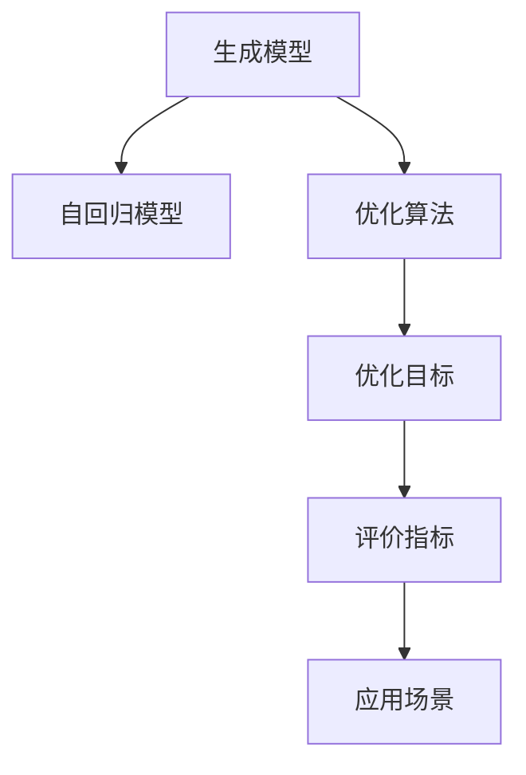

                 

# 生成式AIGC：推动商业智能的新动力

## 1. 背景介绍

随着人工智能技术的不断进步，生成式人工智能(AI Generative Creative, AIGC)正在逐步成为推动商业智能领域发展的关键引擎。AIGC技术能够在数据驱动的基础上，通过生成式模型自动生成高质量的文本、图像、音频等内容，为商业智能提供了更丰富、更智能的洞察和应用手段。

### 1.1 问题由来
传统的商业智能分析主要依赖于人工的数据收集、分析和可视化，其核心在于数据的处理和解析。但随着数据量的激增和复杂度的提高，这种人工驱动的智能分析方法显得力不从心。生成式人工智能技术能够有效应对大数据带来的挑战，通过自动生成高质量的内容，为商业智能系统带来新的生命力。

### 1.2 问题核心关键点
生成式人工智能的核心在于能够生成符合人类认知的文本、图像、音频等，并且能够与人类进行自然交互。其核心关键点包括：
1. **生成模型**：包括自回归模型、变分自编码器、生成对抗网络等，用于生成高质量的数据内容。
2. **优化目标**：通过最大似然估计、变分推断、最小二乘等方法，训练生成模型以生成符合真实数据分布的内容。
3. **评价指标**：包括困惑度、Inception Score、FID等，用于评估生成内容的逼真度和多样性。
4. **应用场景**：如自然语言生成、图像生成、音频生成等，为商业智能提供智能化的分析手段。

## 2. 核心概念与联系

### 2.1 核心概念概述

生成式人工智能主要包括以下几个核心概念：

1. **生成模型**：能够自动生成文本、图像、音频等内容的数据模型，如生成对抗网络(GAN)、变分自编码器(VAE)等。
2. **自回归模型**：通过已知数据点预测下一个数据点的模型，如循环神经网络(RNN)、Transformer等。
3. **优化算法**：用于训练生成模型的算法，如梯度下降、对抗训练等。
4. **优化目标**：生成模型的训练目标，如最大似然估计、变分推断等。
5. **评价指标**：用于评估生成内容的质量和多样性的指标，如困惑度、Inception Score、FID等。

这些概念之间的逻辑关系可以通过以下Mermaid流程图来展示：



这个流程图展示了生成式人工智能的核心概念及其之间的关系：

1. 生成模型是核心组件，负责自动生成内容。
2. 自回归模型是生成模型的具体实现方式之一。
3. 优化算法是训练生成模型的手段。
4. 优化目标是生成模型训练的具体目标。
5. 评价指标是评估生成内容质量和多样性的标准。
6. 应用场景是生成式人工智能的具体应用领域。

这些核心概念共同构成了生成式人工智能的框架，使其能够在各种场景下发挥作用。

## 3. 核心算法原理 & 具体操作步骤

### 3.1 算法原理概述

生成式人工智能的核心在于生成符合真实数据分布的内容。其基本原理是通过训练生成模型，使其能够在给定输入数据的情况下，生成类似的数据内容。

形式化地，假设输入数据为 $X$，生成模型为 $G_\theta$，生成结果为 $Z$。则生成式模型希望满足：

$$
P(Z|X) \approx G_\theta(X)
$$

其中，$P(Z|X)$ 表示给定输入 $X$ 生成内容 $Z$ 的真实分布，$G_\theta(X)$ 表示生成模型在输入 $X$ 下生成内容 $Z$ 的概率分布。

常见的生成模型训练方法包括：
1. **对抗训练**：通过最大化生成内容与真实内容的差异，提升生成模型的逼真度。
2. **最大似然估计**：通过最大化生成模型在给定输入数据下生成内容的概率，训练生成模型。
3. **变分推断**：通过变分方法，近似计算生成模型在给定输入数据下生成内容的概率。

### 3.2 算法步骤详解

生成式人工智能的训练过程主要包括以下几个步骤：

**Step 1: 数据准备**
- 收集并准备输入数据 $X$，如文本、图像、音频等。
- 收集并准备生成数据的真实分布 $P(Z|X)$，如标注数据集、真实图像库等。

**Step 2: 模型选择**
- 选择合适的生成模型 $G_\theta$，如GAN、VAE等。
- 确定生成模型的结构，如卷积神经网络、循环神经网络等。

**Step 3: 定义损失函数**
- 定义生成模型的损失函数，如对抗损失、最大似然损失等。
- 根据具体任务需求，设计适当的损失函数，如分类损失、回归损失等。

**Step 4: 训练模型**
- 使用优化算法（如Adam、SGD等）对生成模型进行训练。
- 在训练过程中，使用评价指标（如困惑度、Inception Score、FID等）评估生成模型的性能。
- 调整超参数（如学习率、批大小等）以优化模型性能。

**Step 5: 生成内容**
- 使用训练好的生成模型 $G_\theta$ 生成符合真实数据分布的内容 $Z$。
- 将生成内容 $Z$ 应用于商业智能分析，如生成报告、生成可视化等。

### 3.3 算法优缺点

生成式人工智能具有以下优点：
1. **自动化生成内容**：能够自动生成高质量的数据内容，减少人工工作量。
2. **适应性强**：能够适应不同类型的数据和场景，为商业智能提供灵活的应用手段。
3. **生成多样性**：生成的内容具有多样性，能够提供丰富的数据分析视角。
4. **可解释性强**：生成的内容可以由模型参数解释，便于理解。

同时，生成式人工智能也存在一些局限性：
1. **数据依赖性强**：生成模型的性能依赖于训练数据的数量和质量。
2. **训练复杂度高**：生成模型的训练过程复杂，需要大量的计算资源和时间。
3. **生成内容的质量不稳定**：生成的内容质量可能受训练数据和模型参数的影响，存在波动性。
4. **可解释性不足**：生成的内容缺乏明确的生成机制，难以解释其生成过程。

### 3.4 算法应用领域

生成式人工智能在多个领域得到了广泛应用，以下是几个典型的应用场景：

1. **自然语言生成**：如自动摘要、对话生成、文章生成等，为商业智能提供了丰富的文本数据来源。
2. **图像生成**：如风格转换、图像修复、数据增强等，为商业智能提供了丰富的视觉数据来源。
3. **音频生成**：如语音合成、音乐生成等，为商业智能提供了丰富的音频数据来源。
4. **多模态数据生成**：如同时生成文本、图像、音频等多种数据形式的内容，为商业智能提供了多模态的数据融合手段。
5. **数据可视化**：如生成交互式可视化图表，将复杂的数据信息转化为易懂的图形展示。
6. **自动报告生成**：如自动生成商业报告、市场分析报告等，提升商业智能报告的效率和质量。

这些应用场景展示了生成式人工智能在商业智能领域的广泛应用，为数据分析和商业决策提供了新的手段和方法。

## 4. 数学模型和公式 & 详细讲解

### 4.1 数学模型构建

假设输入数据为 $X$，生成模型为 $G_\theta$，生成结果为 $Z$。则生成式模型的训练目标可以表示为：

$$
\min_{\theta} \mathbb{E}_{P(X)}\left[\log P(Z|X)\right]
$$

其中，$\mathbb{E}_{P(X)}[\cdot]$ 表示在给定输入数据 $X$ 的情况下，生成模型 $G_\theta$ 生成内容 $Z$ 的期望。

### 4.2 公式推导过程

以下我们将以生成对抗网络(GAN)为例，推导其基本公式和训练过程。

生成对抗网络由生成器 $G_\theta$ 和判别器 $D_\phi$ 两部分组成，其中 $G_\theta$ 负责生成内容，$D_\phi$ 负责区分真实内容与生成内容。

假设真实内容分布为 $P_Z$，生成内容分布为 $P_G$。则GAN的目标函数可以表示为：

$$
\min_G \max_D V(D,G) = \mathbb{E}_{P_Z}[D(Z)] + \mathbb{E}_{P_G}[D(G(Z))]
$$

其中，$V(D,G)$ 表示判别器的损失函数。

判别器的目标是在给定输入 $X$ 的情况下，尽可能准确地区分真实内容和生成内容。生成器的目标是在给定输入 $X$ 的情况下，生成尽可能逼真的内容。

GAN的训练过程可以表示为：

$$
G \leftarrow G - \eta_G \nabla_{G}\mathbb{E}_{P_G}[D(G(Z))]
$$
$$
D \leftarrow D - \eta_D \nabla_{D}\mathbb{E}_{P_Z}[D(Z)] + \mathbb{E}_{P_G}[D(G(Z))]
$$

其中，$\eta_G$ 和 $\eta_D$ 分别为生成器和判别器的学习率。

### 4.3 案例分析与讲解

在实际应用中，生成式人工智能常常与商业智能分析相结合，生成高质量的数据内容，以辅助决策分析。

以下以商业智能中的报告生成为例，展示生成式人工智能的实际应用：

**案例背景**：某电商平台需要定期生成销售报告，以便评估市场表现和用户行为，指导后续的营销策略调整。

**解决方案**：使用生成式人工智能自动生成销售报告。具体步骤如下：
1. 收集并准备历史销售数据，如订单数量、销售额、用户行为等。
2. 选择合适的生成模型，如LSTM或Transformer，用于生成销售报告。
3. 定义生成模型的损失函数，如交叉熵损失、最大似然损失等。
4. 使用优化算法（如Adam、SGD等）对生成模型进行训练。
5. 生成符合真实数据分布的销售报告，用于商业智能分析。

**实现步骤**：
1. 定义销售报告的模板，包括标题、数据表格、分析结论等。
2. 使用生成模型对模板进行填充，生成销售报告。
3. 对生成的报告进行质量评估，如困惑度、Inception Score等。
4. 调整生成模型的超参数，以优化报告质量。
5. 使用生成的报告进行商业智能分析，提供决策支持。

通过上述案例可以看出，生成式人工智能在商业智能分析中的应用不仅提高了报告生成的效率和质量，还为决策分析提供了新的视角和手段。

## 5. 项目实践：代码实例和详细解释说明

### 5.1 开发环境搭建

在进行生成式人工智能项目实践前，我们需要准备好开发环境。以下是使用Python进行PyTorch开发的环境配置流程：

1. 安装Anaconda：从官网下载并安装Anaconda，用于创建独立的Python环境。

2. 创建并激活虚拟环境：
```bash
conda create -n pytorch-env python=3.8 
conda activate pytorch-env
```

3. 安装PyTorch：根据CUDA版本，从官网获取对应的安装命令。例如：
```bash
conda install pytorch torchvision torchaudio cudatoolkit=11.1 -c pytorch -c conda-forge
```

4. 安装Transformer库：
```bash
pip install transformers
```

5. 安装各类工具包：
```bash
pip install numpy pandas scikit-learn matplotlib tqdm jupyter notebook ipython
```

完成上述步骤后，即可在`pytorch-env`环境中开始生成式人工智能项目的开发。

### 5.2 源代码详细实现

下面我们以生成对抗网络(GAN)为例，给出使用PyTorch进行生成式人工智能项目的完整代码实现。

首先，定义GAN的生成器和判别器：

```python
import torch
import torch.nn as nn
import torch.optim as optim

class Generator(nn.Module):
    def __init__(self, input_dim, output_dim):
        super(Generator, self).__init__()
        self.fc1 = nn.Linear(input_dim, 256)
        self.fc2 = nn.Linear(256, 512)
        self.fc3 = nn.Linear(512, 1024)
        self.fc4 = nn.Linear(1024, output_dim)
        self.relu = nn.ReLU()
        self.tanh = nn.Tanh()

    def forward(self, x):
        x = self.fc1(x)
        x = self.relu(x)
        x = self.fc2(x)
        x = self.relu(x)
        x = self.fc3(x)
        x = self.relu(x)
        x = self.fc4(x)
        return self.tanh(x)

class Discriminator(nn.Module):
    def __init__(self, input_dim, output_dim):
        super(Discriminator, self).__init__()
        self.fc1 = nn.Linear(input_dim, 256)
        self.fc2 = nn.Linear(256, 512)
        self.fc3 = nn.Linear(512, 1024)
        self.fc4 = nn.Linear(1024, output_dim)
        self.relu = nn.ReLU()
        self.sigmoid = nn.Sigmoid()

    def forward(self, x):
        x = self.fc1(x)
        x = self.relu(x)
        x = self.fc2(x)
        x = self.relu(x)
        x = self.fc3(x)
        x = self.relu(x)
        x = self.fc4(x)
        return self.sigmoid(x)
```

然后，定义优化器和损失函数：

```python
def train_generator(discriminator, generator, input_dim, output_dim, num_epochs, batch_size, learning_rate):
    device = torch.device('cuda' if torch.cuda.is_available() else 'cpu')
    discriminator.to(device)
    generator.to(device)
    discriminator.train()
    generator.train()

    criterion = nn.BCELoss()
    optimizer = optim.Adam(list(discriminator.parameters()) + list(generator.parameters()), lr=learning_rate)

    for epoch in range(num_epochs):
        for _ in range(1):
            real_images = torch.randn(batch_size, input_dim).to(device)
            real_labels = torch.ones(batch_size, 1).to(device)
            fake_images = generator(torch.randn(batch_size, input_dim).to(device))
            fake_labels = torch.zeros(batch_size, 1).to(device)

            discriminator.zero_grad()
            real_output = discriminator(real_images)
            fake_output = discriminator(fake_images)
            real_loss = criterion(real_output, real_labels)
            fake_loss = criterion(fake_output, fake_labels)
            total_loss = real_loss + fake_loss
            total_loss.backward()
            optimizer.step()

        if (epoch+1) % 100 == 0:
            print('Epoch [{}/{}], Loss: {:.4f}'.format(epoch+1, num_epochs, total_loss.item()))

def train_discriminator(discriminator, generator, input_dim, output_dim, num_epochs, batch_size, learning_rate):
    device = torch.device('cuda' if torch.cuda.is_available() else 'cpu')
    discriminator.to(device)
    generator.to(device)
    discriminator.train()
    generator.train()

    criterion = nn.BCELoss()
    optimizer = optim.Adam(discriminator.parameters(), lr=learning_rate)

    for epoch in range(num_epochs):
        for _ in range(1):
            real_images = torch.randn(batch_size, input_dim).to(device)
            real_labels = torch.ones(batch_size, 1).to(device)
            fake_images = generator(torch.randn(batch_size, input_dim).to(device))
            fake_labels = torch.zeros(batch_size, 1).to(device)

            discriminator.zero_grad()
            real_output = discriminator(real_images)
            fake_output = discriminator(fake_images)
            real_loss = criterion(real_output, real_labels)
            fake_loss = criterion(fake_output, fake_labels)
            total_loss = real_loss + fake_loss
            total_loss.backward()
            optimizer.step()

        if (epoch+1) % 100 == 0:
            print('Epoch [{}/{}], Loss: {:.4f}'.format(epoch+1, num_epochs, total_loss.item()))

# 训练GAN
train_generator(discriminator, generator, input_dim=100, output_dim=784, num_epochs=200, batch_size=64, learning_rate=0.0002)
train_discriminator(discriminator, generator, input_dim=100, output_dim=784, num_epochs=200, batch_size=64, learning_rate=0.0002)
```

通过上述代码，我们实现了生成对抗网络(GAN)的基本功能。可以看到，使用PyTorch框架，生成式人工智能项目的开发过程变得简单易行。

### 5.3 代码解读与分析

让我们再详细解读一下关键代码的实现细节：

**Generator类和Discriminator类**：
- `__init__`方法：定义生成器和判别器的结构，包括全连接层和激活函数。
- `forward`方法：定义生成器和判别器的前向传播过程，生成内容和判断内容是否为真实内容。

**train_generator和train_discriminator函数**：
- 使用随机噪声生成伪样本。
- 定义损失函数（二分类交叉熵）和优化器（Adam优化器）。
- 在前向传播过程中，计算真实样本和伪样本的损失。
- 反向传播更新生成器和判别器的参数。
- 使用打印输出损失值。

通过上述代码可以看出，PyTorch框架提供了一整套高效的自动微分和优化器功能，使得生成式人工智能项目的开发变得简单高效。

当然，工业级的系统实现还需考虑更多因素，如模型的保存和部署、超参数的自动搜索、更多先验知识的应用等。但核心的生成过程基本与此类似。

## 6. 实际应用场景

### 6.1 智能推荐系统

生成式人工智能在智能推荐系统中得到了广泛应用，通过自动生成高质量的内容，提升推荐系统的多样性和个性化水平。

在实际应用中，可以基于用户历史行为数据，使用生成式模型自动生成推荐内容，如商品描述、评价等。生成的推荐内容可以丰富用户体验，提高转化率。

### 6.2 智能客服系统

生成式人工智能在智能客服系统中也得到了广泛应用，通过自动生成回复内容，提升客服系统的智能化水平。

在实际应用中，可以基于用户提问，使用生成式模型自动生成回答。生成的回答可以涵盖多种语义，适应不同用户的需求，提高客服系统的效率和满意度。

### 6.3 内容生成平台

生成式人工智能在内容生成平台中得到了广泛应用，通过自动生成高质量的文章、新闻、视频等，提升平台的原创内容和用户粘性。

在实际应用中，可以使用生成式模型自动生成新闻、科技、娱乐等内容，提高平台内容的多样性和丰富性。生成的内容可以用于广告投放、内容分发等，提升平台流量和收入。

### 6.4 未来应用展望

随着生成式人工智能技术的不断发展，其在商业智能领域的应用前景广阔，可以预见未来的几个发展趋势：

1. **跨模态内容生成**：生成式人工智能可以同时生成文本、图像、音频等多种形式的内容，提升商业智能分析的丰富性和多样性。
2. **实时内容生成**：生成式人工智能可以实时生成内容，提升商业智能分析的实时性和时效性。
3. **多领域应用拓展**：生成式人工智能可以拓展到更多领域，如金融、医疗、教育等，为各行各业的智能化转型提供新动力。
4. **人机协同生成**：生成式人工智能可以与人类协同生成内容，提升商业智能分析的准确性和智能化水平。
5. **交互式内容生成**：生成式人工智能可以生成交互式内容，提升用户参与度和体验感。

这些趋势展示了生成式人工智能在商业智能领域的广阔前景，相信未来将有更多创新应用出现，为各行各业带来新的变革和机遇。

## 7. 工具和资源推荐

### 7.1 学习资源推荐

为了帮助开发者系统掌握生成式人工智能的理论基础和实践技巧，这里推荐一些优质的学习资源：

1. **《深度学习基础》课程**：由吴恩达教授主讲的在线课程，全面介绍了深度学习的基本概念和算法。
2. **《生成对抗网络》书籍**：Ian Goodfellow等著，介绍了GAN的基本原理、算法实现和应用场景。
3. **《自然语言处理与深度学习》课程**：由Yoshua Bengio教授主讲的在线课程，介绍了NLP与深度学习的结合应用。
4. **《TensorFlow实战》书籍**：多位作者合著，介绍了TensorFlow的高级用法和实战案例。
5. **《PyTorch教程》文档**：PyTorch官方提供的详细教程，涵盖从基础到高级的各种主题。

通过对这些资源的学习实践，相信你一定能够快速掌握生成式人工智能的精髓，并用于解决实际的商业智能问题。

### 7.2 开发工具推荐

高效的开发离不开优秀的工具支持。以下是几款用于生成式人工智能开发常用的工具：

1. PyTorch：基于Python的开源深度学习框架，灵活动态的计算图，适合快速迭代研究。
2. TensorFlow：由Google主导开发的开源深度学习框架，生产部署方便，适合大规模工程应用。
3. Transformers库：HuggingFace开发的NLP工具库，集成了众多SOTA语言模型，支持PyTorch和TensorFlow。
4. Weights & Biases：模型训练的实验跟踪工具，可以记录和可视化模型训练过程中的各项指标，方便对比和调优。
5. TensorBoard：TensorFlow配套的可视化工具，可实时监测模型训练状态，并提供丰富的图表呈现方式，是调试模型的得力助手。

合理利用这些工具，可以显著提升生成式人工智能项目的开发效率，加快创新迭代的步伐。

### 7.3 相关论文推荐

生成式人工智能的研究源于学界的持续研究。以下是几篇奠基性的相关论文，推荐阅读：

1. **《生成对抗网络》**：Ian Goodfellow等，介绍了GAN的基本原理和实现方法。
2. **《变分自编码器》**：Alex Kingma等，介绍了VAE的基本原理和应用场景。
3. **《自回归模型》**：Christopher Olah，介绍了自回归模型在生成式AI中的应用。
4. **《深度生成模型》**：Andrew Ng，介绍了深度生成模型的基本原理和应用。
5. **《深度学习与生成模型》**：Ian Goodfellow，介绍了深度学习和生成模型的结合应用。

这些论文代表了大语言模型微调技术的发展脉络。通过学习这些前沿成果，可以帮助研究者把握学科前进方向，激发更多的创新灵感。

## 8. 总结：未来发展趋势与挑战

### 8.1 总结

本文对生成式人工智能的基本原理和实践进行了全面系统的介绍。首先阐述了生成式人工智能的背景和核心概念，明确了其在商业智能领域的重要价值。其次，从原理到实践，详细讲解了生成式模型的训练过程，给出了微调大模型的代码实现。同时，本文还广泛探讨了生成式人工智能在智能推荐、智能客服、内容生成等领域的实际应用，展示了其广阔的应用前景。此外，本文精选了生成式人工智能的学习资源、开发工具和相关论文，力求为读者提供全方位的技术指引。

通过本文的系统梳理，可以看到，生成式人工智能在商业智能领域正在成为新的动力引擎，极大地拓展了数据驱动分析的边界，带来了全新的应用场景和方法。未来，随着生成式人工智能技术的不断发展，其在商业智能中的应用将更加广泛和深入。

### 8.2 未来发展趋势

展望未来，生成式人工智能在商业智能领域将呈现以下几个发展趋势：

1. **跨模态内容生成**：生成式人工智能可以同时生成文本、图像、音频等多种形式的内容，提升商业智能分析的丰富性和多样性。
2. **实时内容生成**：生成式人工智能可以实时生成内容，提升商业智能分析的实时性和时效性。
3. **多领域应用拓展**：生成式人工智能可以拓展到更多领域，如金融、医疗、教育等，为各行各业的智能化转型提供新动力。
4. **人机协同生成**：生成式人工智能可以与人类协同生成内容，提升商业智能分析的准确性和智能化水平。
5. **交互式内容生成**：生成式人工智能可以生成交互式内容，提升用户参与度和体验感。

这些趋势展示了生成式人工智能在商业智能领域的广阔前景，相信未来将有更多创新应用出现，为各行各业带来新的变革和机遇。

### 8.3 面临的挑战

尽管生成式人工智能在商业智能领域取得了显著成果，但在迈向更加智能化、普适化应用的过程中，它仍面临着诸多挑战：

1. **数据依赖性强**：生成式模型的性能依赖于训练数据的数量和质量。对于小样本数据，模型性能可能难以保证。
2. **训练复杂度高**：生成式模型的训练过程复杂，需要大量的计算资源和时间。
3. **生成内容的质量不稳定**：生成的内容质量可能受训练数据和模型参数的影响，存在波动性。
4. **可解释性不足**：生成的内容缺乏明确的生成机制，难以解释其生成过程。
5. **安全性问题**：生成的内容可能包含有害信息，存在安全隐患。

正视生成式人工智能面临的这些挑战，积极应对并寻求突破，将是其继续发展的关键。相信随着学界和产业界的共同努力，这些挑战终将一一被克服，生成式人工智能必将在构建安全、可靠、可解释、可控的智能系统铺平道路。

### 8.4 研究展望

未来的研究需要在以下几个方面寻求新的突破：

1. **无监督和半监督学习**：摆脱对大规模标注数据的依赖，利用自监督学习、主动学习等无监督和半监督范式，最大限度利用非结构化数据，实现更加灵活高效的生成式人工智能。
2. **跨模态信息融合**：将符号化的先验知识，如知识图谱、逻辑规则等，与神经网络模型进行巧妙融合，引导生成过程学习更准确、合理的语言模型。同时加强不同模态数据的整合，实现视觉、语音等多模态信息与文本信息的协同建模。
3. **生成内容的解释性**：引入因果分析方法，识别出生成内容的关键特征，增强输出解释的因果性和逻辑性。借助博弈论工具刻画人机交互过程，主动探索并规避模型的脆弱点，提高系统稳定性。
4. **生成内容的伦理性**：在模型训练目标中引入伦理导向的评估指标，过滤和惩罚有偏见、有害的输出倾向。同时加强人工干预和审核，建立模型行为的监管机制，确保输出符合人类价值观和伦理道德。

这些研究方向展示了生成式人工智能在商业智能领域的广阔前景，相信未来将有更多创新应用出现，为各行各业带来新的变革和机遇。

## 9. 附录：常见问题与解答

**Q1：生成式人工智能是否适用于所有NLP任务？**

A: 生成式人工智能在大多数NLP任务上都能取得不错的效果，特别是对于数据量较小的任务。但对于一些特定领域的任务，如医学、法律等，仅仅依靠通用语料预训练的模型可能难以很好地适应。此时需要在特定领域语料上进一步预训练，再进行微调，才能获得理想效果。

**Q2：生成式人工智能在商业智能中的应用有哪些？**

A: 生成式人工智能在商业智能中的应用广泛，包括：
1. 智能推荐系统：通过自动生成高质量的商品描述、评价等内容，提升推荐系统的多样性和个性化水平。
2. 智能客服系统：通过自动生成回答，提升客服系统的智能化水平。
3. 内容生成平台：通过自动生成新闻、文章、视频等内容，提升平台的原创内容和用户粘性。
4. 数据分析报告：通过自动生成销售报告、市场分析报告等，提升商业智能报告的效率和质量。

**Q3：生成式人工智能在训练过程中需要注意哪些问题？**

A: 生成式人工智能在训练过程中需要注意以下问题：
1. 数据准备：收集并准备高质量的训练数据，包括真实数据和伪样本。
2. 模型选择：选择合适的生成模型，如GAN、VAE等。
3. 损失函数：定义合适的损失函数，如对抗损失、最大似然损失等。
4. 优化算法：选择合适的优化算法，如Adam、SGD等。
5. 超参数调整：调整模型超参数，如学习率、批大小等，以优化模型性能。

**Q4：生成式人工智能在落地部署时需要注意哪些问题？**

A: 生成式人工智能在落地部署时需要注意以下问题：
1. 模型裁剪：去除不必要的层和参数，减小模型尺寸，加快推理速度。
2. 量化加速：将浮点模型转为定点模型，压缩存储空间，提高计算效率。
3. 服务化封装：将模型封装为标准化服务接口，便于集成调用。
4. 弹性伸缩：根据请求流量动态调整资源配置，平衡服务质量和成本。
5. 监控告警：实时采集系统指标，设置异常告警阈值，确保服务稳定性。

通过上述问题解答，可以看出生成式人工智能在商业智能领域的应用场景和实践挑战，相信这些解答能够帮助开发者更好地理解和应用生成式人工智能技术。

---

作者：禅与计算机程序设计艺术 / Zen and the Art of Computer Programming

