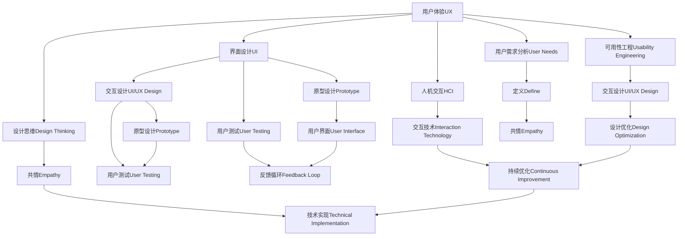

                 

# 用户界面设计：打造友好易用的人机交互体验

> 关键词：用户体验(UX)、界面设计(UI)、交互设计(UI/UX Design)、可用性工程(Usability Engineering)、人机交互(Human-Computer Interaction, HCI)、用户需求(User Needs)、设计思维(Design Thinking)

## 1. 背景介绍

### 1.1 问题由来
随着信息技术和互联网的飞速发展，人类生活与工作方式发生了巨大的变化。现代软件系统变得前所未有的复杂和强大，但与此同时，用户界面设计的质量常常被忽视。为了提升软件系统的操作体验，用户界面设计变得至关重要。良好的用户界面设计不仅可以提升用户满意度，还能提升系统性能和用户粘性，对软件产品的成功有着不可替代的作用。

### 1.2 问题核心关键点
用户界面设计（UI/UX Design）旨在创造令人愉悦、易用的软件系统，以优化用户体验（User Experience, UX）。其核心关键点包括：

- 用户需求分析：准确捕捉用户需求，识别用户痛点。
- 设计原则：遵循可用性原则，优化信息架构（Information Architecture, IA）和界面设计。
- 迭代设计：采用快速原型和用户反馈，不断改进设计方案。
- 测试评估：通过用户测试、A/B测试等方式评估设计效果。
- 技术实现：将设计理念转化为可操作的交互设计。

## 2. 核心概念与联系

### 2.1 核心概念概述

以下是UI/UX设计中几个重要概念的概述：

- **用户体验(UX)**：用户在使用产品时，与产品交互的全过程体验。良好的用户体验可以提高用户满意度和忠诚度，进而提升业务价值。

- **界面设计(UI)**：界面是用户与系统交互的主要媒介。良好的UI设计不仅要求美观，更要求功能完善、易用性好。

- **可用性工程(Usability Engineering)**：通过科学方法提升软件系统的可用性，确保系统能满足用户需求，提供无缝的用户体验。

- **人机交互(Human-Computer Interaction, HCI)**：研究人与计算机之间的交互过程，包括用户界面、交互技术、人机协作等方面。

- **设计思维(Design Thinking)**：以用户为中心，通过共情（Empathy）、定义（Define）、原型（Prototype）、测试（Test）、迭代（Iterate）等步骤进行设计，创造符合用户需求的产品。

这些概念之间的逻辑关系可以通过以下Mermaid流程图来展示：



## 3. 核心算法原理 & 具体操作步骤
### 3.1 算法原理概述

良好的UI设计基于对用户需求的深刻理解和科学的设计原则。其核心原理如下：

- **共情（Empathy）**：理解用户需求和痛点，从用户视角审视产品。
- **用户需求分析（User Needs Analysis）**：通过问卷调查、用户访谈等方式，收集用户需求数据。
- **定义（Define）**：明确产品目标和功能需求，绘制用户故事（User Stories）和用例图（Use Case Diagrams）。
- **原型设计（Prototype Design）**：创建高保真原型，进行初步用户测试，收集反馈。
- **迭代（Iterate）**：根据用户反馈进行迭代设计，逐步优化产品原型。
- **可用性评估（Usability Evaluation）**：通过用户测试、A/B测试等方式，评估产品可用性。
- **设计优化（Design Optimization）**：根据测试结果，对设计方案进行优化。

### 3.2 算法步骤详解

以下是一套完整的用户界面设计流程：

1. **需求收集与分析**：通过问卷调查、用户访谈等方式收集用户需求，绘制用户故事和用例图。

2. **设计思考（Design Thinking）**：采用共情、定义、原型、测试、迭代等步骤，进行设计思考。

3. **界面设计（UI Design）**：基于用户需求，设计界面布局、色彩搭配、元素大小等界面细节。

4. **交互设计（UX/UI Design）**：设计交互流程、动画效果、手势操作等提升用户体验的元素。

5. **原型制作（Prototyping）**：创建高保真原型，进行初步用户测试，收集反馈。

6. **用户测试（User Testing）**：通过用户测试评估原型效果，收集改进意见。

7. **设计优化（Design Optimization）**：根据用户反馈进行迭代设计，优化界面和交互。

8. **技术实现（Technical Implementation）**：将设计理念转化为可操作的交互设计。

### 3.3 算法优缺点

基于以上流程的用户界面设计具有以下优点：

- 用户中心：始终以用户需求为核心，确保产品设计符合用户期望。
- 科学依据：基于可用性工程和设计思维的理论支持，提升设计科学性。
- 迭代改进：通过不断迭代设计，持续提升用户体验。

同时，该方法也存在一些缺点：

- 开发周期长：从需求分析到原型测试，过程较为复杂耗时。
- 资源消耗大：需要组织大量用户访谈、问卷调查、用户测试等，资源投入较大。
- 高成本投入：原型制作、用户测试等环节的成本较高。

## 4. 数学模型和公式 & 详细讲解 & 举例说明

### 4.1 数学模型构建

用户界面设计的科学性可以通过数学模型进行量化。以下是一个简化版的用户满意度（User Satisfaction, US）模型：

$$ US = f(Satisfaction, Usability, Efficiency, Ease of Use, Aesthetics) $$

其中，Satisfaction为用户满意度，Usability为可用性，Efficiency为效率，Ease of Use为易用性，Aesthetics为美观度。

### 4.2 公式推导过程

以用户满意度模型为例，进行推导：

- **用户满意度（Satisfaction）**：可以通过问卷调查获得，一般采用李克特量表（Likert Scale）进行评估。

- **可用性（Usability）**：可用性指标一般包括任务完成时间、错误率、用户完成任务的成功率等。

- **效率（Efficiency）**：效率指标包括用户操作次数、点击距离、页面加载时间等。

- **易用性（Ease of Use）**：易用性可以通过用户操作路径、学习成本等进行评估。

- **美观度（Aesthetics）**：美观度可以通过颜色搭配、布局设计、图标设计等进行量化。

通过以上公式，可以进行综合评估，找出影响用户满意度的关键因素。

### 4.3 案例分析与讲解

假设某电商平台的注册界面存在以下问题：

- 注册流程过于复杂，需要填写过多个人信息。
- 注册步骤不够明确，用户容易出错。
- 页面设计不够美观，用户操作体验较差。

通过用户满意度模型，我们可以分析以下因素：

- **用户满意度（Satisfaction）**：主要受到注册流程复杂度和页面美观度的影响。
- **可用性（Usability）**：主要受到注册步骤清晰度和用户操作路径的影响。
- **效率（Efficiency）**：主要受到填写信息所需时间的影响。
- **易用性（Ease of Use）**：主要受到学习成本和页面布局的影响。
- **美观度（Aesthetics）**：主要受到颜色搭配和图标设计的影响。

通过量化分析，找到问题所在，并提出改进方案。例如：简化注册流程，明确步骤；优化页面设计，提升美观度；减少填写信息，提高效率。

## 5. 项目实践：代码实例和详细解释说明
### 5.1 开发环境搭建

在进行UI设计项目实践前，我们需要准备好开发环境。以下是使用Adobe XD进行界面设计的环境配置流程：

1. 安装Adobe XD：从官网下载并安装Adobe XD，适用于界面设计和原型制作。

2. 创建设计文档：在Adobe XD中创建新的设计文档，设置尺寸、分辨率、设计比例等。

3. 导入用户需求：将用户故事、用例图等需求文档导入Adobe XD，作为设计的参考。

4. 设计界面原型：在Adobe XD中设计界面原型，包括页面布局、元素位置、交互效果等。

5. 导出设计文件：导出高保真原型文件，便于后续技术实现和用户测试。

### 5.2 源代码详细实现

这里我们以电商平台注册界面为例，展示如何使用React进行界面设计：

1. 导入React和相关组件：
```javascript
import React, { Component } from 'react';
import { TextInput, Button, Label, Form } from 'react-native-elements';
```

2. 设计注册表单组件：
```javascript
class RegistrationForm extends Component {
  constructor(props) {
    super(props);
    this.state = {
      email: '',
      password: '',
      confirmPassword: ''
    };
  }

  handleSubmit = () => {
    // 提交表单逻辑
  }

  handleChange = (field) => {
    return (value) => this.setState({ [field]: value });
  }

  render() {
    return (
      <Form>
        <Label>Email:</Label>
        <TextInput
          onChangeText={this.handleChange('email')}
          value={this.state.email}
        />
        <Label>Password:</Label>
        <TextInput
          onChangeText={this.handleChange('password')}
          value={this.state.password}
          secureTextEntry
        />
        <Label>Confirm Password:</Label>
        <TextInput
          onChangeText={this.handleChange('confirmPassword')}
          value={this.state.confirmPassword}
          secureTextEntry
        />
        <Button title="Submit" onPress={this.handleSubmit} />
      </Form>
    );
  }
}
```

3. 导出设计文件：
```javascript
export default RegistrationForm;
```

### 5.3 代码解读与分析

让我们再详细解读一下关键代码的实现细节：

**RegistrationForm类**：
- `constructor`方法：初始化表单状态，包括email、password、confirmPassword等字段。
- `handleSubmit`方法：处理表单提交逻辑，可以调用后端API提交数据。
- `handleChange`方法：监听表单元素的变化，更新表单状态。
- `render`方法：渲染表单界面，包含email、password、confirmPassword三个输入项和一个提交按钮。

**TextInput组件**：
- `onChangeText`属性：监听输入框的变化，触发`handleChange`方法。
- `secureTextEntry`属性：将输入框的内容加密显示。

**Button组件**：
- `title`属性：设置按钮的文本内容。
- `onPress`属性：处理按钮的点击事件，触发`handleSubmit`方法。

通过以上代码，可以创建简单的注册表单，并实现表单数据的收集和提交。

### 5.4 运行结果展示

运行以上代码后，可以看到注册界面的效果。用户可以在输入框中输入email、password和confirmPassword，点击提交按钮后，表单数据将被提交到服务器。

## 6. 实际应用场景
### 6.1 电商平台的注册与登录界面

电商平台的注册和登录界面是用户使用电商系统的第一步，界面设计的好坏直接影响用户的注册成功率和用户体验。良好的注册界面设计可以简化用户操作，减少注册错误，提高注册成功率。

在实际设计中，可以采用以下设计原则：

- **简洁明了**：界面设计应尽量简洁，减少用户输入负担。
- **指引明确**：提供清晰的指引，告知用户需要填写的信息和下一步操作。
- **错误提示**：对于用户输入的错误，及时提供错误提示，帮助用户快速纠正错误。

### 6.2 金融产品的投资界面

金融产品的投资界面需要用户填写详细的个人信息和投资需求，界面设计应注重数据收集的安全性和准确性，同时提供简单易懂的投资说明和风险提示。

在实际设计中，可以采用以下设计原则：

- **数据安全**：确保用户个人信息的安全，避免数据泄露。
- **投资说明**：提供详细的投资说明，帮助用户理解产品特点。
- **风险提示**：明确告知用户投资风险，引导用户谨慎投资。

### 6.3 医疗健康的管理界面

医疗健康的管理界面需要用户填写详细的健康信息和历史病史，界面设计应注重数据的准确性和隐私保护，同时提供简单易用的健康管理功能。

在实际设计中，可以采用以下设计原则：

- **数据准确**：确保用户填写的健康信息准确无误，避免误诊。
- **隐私保护**：保护用户隐私，确保数据不被泄露。
- **功能易用**：提供简单易用的健康管理功能，帮助用户记录和分析健康数据。

### 6.4 未来应用展望

随着技术的不断进步，用户界面设计也将迎来新的变革：

- **智能交互**：未来的界面设计将更多地采用自然语言处理（NLP）和语音识别技术，提升交互体验。
- **个性化定制**：根据用户行为数据，进行个性化界面设计，提升用户体验。
- **多模态交互**：结合图像、视频、语音等多模态数据，提升用户交互体验。
- **智能推荐**：通过机器学习算法，实现智能推荐，优化用户界面设计。

## 7. 工具和资源推荐
### 7.1 学习资源推荐

为了帮助开发者系统掌握用户界面设计（UI/UX）的理论基础和实践技巧，这里推荐一些优质的学习资源：

1. **《人机交互工程》（Human-Computer Interaction Engineering）**：由Buller教授主编，全面介绍了人机交互工程的原理、方法和实践。

2. **《设计思维》（Design Thinking）**：由Kathleen DeNBO著，系统讲解了设计思维的全流程和方法论。

3. **《可用性工程》（Usability Engineering）**：由Jakob Nielsen著，详细介绍了可用性工程的理论和实践。

4. **《用户界面设计》（User Interface Design）**：由Jamrozik著，涵盖界面设计的各个方面，包括布局设计、交互设计、原型设计等。

5. **《用户体验设计》（User Experience Design）**：由Dolgova著，系统介绍了用户体验设计的理论和方法。

6. **《Adobe XD教程》（Adobe XD Tutorials）**：Adobe官方提供的Adobe XD教程，适合初学者学习。

通过对这些资源的学习实践，相信你一定能够快速掌握用户界面设计的精髓，并用于解决实际的UI/UX问题。

### 7.2 开发工具推荐

高效的开发离不开优秀的工具支持。以下是几款用于UI设计开发的常用工具：

1. **Adobe XD**：专业的设计工具，支持原型设计和用户测试，适合UI设计师使用。

2. **Sketch**：广受欢迎的UI设计工具，支持多平台设计，适合UI设计师使用。

3. **Figma**：基于云的设计工具，支持实时协作，适合团队设计使用。

4. **InVision**：原型设计和用户测试工具，支持用户测试和反馈收集，适合UI设计师和产品经理使用。

5. **Axure**：原型设计和用户测试工具，支持交互和动态效果，适合UI设计师和产品经理使用。

6. **Protovis**：可视化设计工具，支持复杂的数据可视化设计，适合数据可视化设计师使用。

合理利用这些工具，可以显著提升UI设计的开发效率，加快创新迭代的步伐。

### 7.3 相关论文推荐

用户界面设计（UI/UX）的研究不断发展，以下是几篇奠基性的相关论文，推荐阅读：

1. **《人机交互中的任务与环境》（Tasks in the Computer Environment）**：由Mushkin和Muller著，详细介绍了人机交互中的任务和环境因素。

2. **《设计思维的创新设计方法》（Design Thinking: Innovation Through Design）**：由Altmaier和Rogers著，介绍了设计思维的全流程和设计方法。

3. **《可用性工程的应用》（Applying Usability Engineering）**：由Nielsen著，详细介绍了可用性工程的应用方法和实践。

4. **《用户体验设计的基础》（Foundations of Experience Design）**：由Mikhail Kalos著，全面介绍了用户体验设计的理论基础和实践。

5. **《用户界面设计原理》（The Principles of User Interface Design）**：由Anderson著，详细介绍了用户界面设计的原理和方法。

这些论文代表了大用户界面设计（UI/UX）的研究方向和发展脉络。通过学习这些前沿成果，可以帮助研究者把握学科前进方向，激发更多的创新灵感。

## 8. 总结：未来发展趋势与挑战
### 8.1 总结

本文对用户界面设计（UI/UX）进行了全面系统的介绍。首先阐述了UI/UX设计的背景和意义，明确了UI/UX设计在提升用户体验中的关键作用。其次，从原理到实践，详细讲解了UI/UX设计的科学方法和具体步骤，给出了完整的UI/UX设计流程。同时，本文还探讨了UI/UX设计在电商、金融、医疗等多个行业领域的应用前景，展示了UI/UX设计的巨大潜力。最后，本文精选了UI/UX设计的各类学习资源，力求为读者提供全方位的技术指引。

通过本文的系统梳理，可以看到，用户界面设计（UI/UX）是打造友好易用的人机交互体验的重要手段。通过科学的UI/UX设计，可以提升用户体验，提高业务价值，甚至带来商业模式的创新。未来，随着技术的不断进步，UI/UX设计将呈现出更多智能化、个性化、多模态的发展趋势，为人类提供更加便捷、高效、愉悦的使用体验。

### 8.2 未来发展趋势

展望未来，用户界面设计（UI/UX）将呈现以下几个发展趋势：

1. **智能化**：通过引入人工智能技术，实现智能推荐、个性化定制等功能，提升用户体验。

2. **多模态**：结合图像、视频、语音等多模态数据，提升人机交互的丰富性和直观性。

3. **自动化**：通过自动化设计工具，提升设计效率和质量，缩短开发周期。

4. **情感化**：结合情感计算技术，实现情感化的UI/UX设计，提升用户的情感体验。

5. **可扩展性**：通过模块化和组件化的设计，实现UI/UX设计的可扩展性和复用性。

6. **标准化**：通过行业标准的制定，提升UI/UX设计的规范性和一致性。

以上趋势凸显了用户界面设计（UI/UX）的广阔前景。这些方向的探索发展，必将进一步提升人机交互的智能化水平，推动用户体验向更高层次进化。

### 8.3 面临的挑战

尽管用户界面设计（UI/UX）在提升用户体验方面有着不可替代的作用，但在迈向更加智能化、个性化应用的过程中，它仍面临着诸多挑战：

1. **用户需求多变**：用户需求千差万别，如何灵活应对，提升设计适应性，是一大挑战。

2. **技术复杂**：UI/UX设计涉及多个学科，包括心理学、人机交互、用户体验等，需要跨学科的深度融合。

3. **资源消耗大**：用户测试、原型制作、数据收集等环节，需要大量的人力和时间投入。

4. **设计周期长**：从需求分析到原型测试，过程较为复杂耗时。

5. **设计规范不统一**：各行业的设计规范和标准不统一，需要更多标准化的指导和参考。

6. **设计质量参差不齐**：设计水平参差不齐，需要更多优秀的设计师和设计工具支持。

正视UI/UX设计面临的这些挑战，积极应对并寻求突破，将是大用户界面设计（UI/UX）走向成熟的必由之路。相信随着学界和产业界的共同努力，这些挑战终将一一被克服，用户界面设计（UI/UX）必将在构建人机协同的智能时代中扮演越来越重要的角色。

### 8.4 研究展望

面向未来，用户界面设计（UI/UX）的研究需要在以下几个方面寻求新的突破：

1. **探索更高效的设计方法**：引入更高效的设计工具和方法，如设计思维、共情设计、用户故事（User Stories）等，提升设计效率和质量。

2. **研究更科学的设计理论**：建立更科学的用户界面设计理论体系，如用户需求分析、信息架构（IA）设计、可用性评估等，提升设计科学性。

3. **开发更智能的设计工具**：结合人工智能技术，开发更智能的设计工具，如智能推荐、个性化定制、自动化设计等，提升设计灵活性和创新性。

4. **加强跨学科的合作**：加强心理学、人机交互、用户体验等多学科的合作，提升设计的系统性和科学性。

5. **推动标准化进程**：制定更统一的设计标准和规范，提升设计规范性和一致性。

6. **注重人机协同设计**：强调人机协同设计，提升设计的用户中心性和体验性。

这些研究方向的探索，必将引领用户界面设计（UI/UX）技术迈向更高的台阶，为构建人机协同的智能系统铺平道路。面向未来，用户界面设计（UI/UX）还需要与其他人工智能技术进行更深入的融合，如知识表示、因果推理、强化学习等，多路径协同发力，共同推动人机交互系统的进步。只有勇于创新、敢于突破，才能不断拓展人机交互的边界，让智能技术更好地造福人类社会。

## 9. 附录：常见问题与解答

**Q1：什么是用户界面设计（UI/UX）？**

A: 用户界面设计（UI/UX）是设计软件产品与用户交互的界面，提升用户体验的过程。它包括用户需求分析、界面设计、交互设计、原型设计、用户测试等多个环节。

**Q2：UI/UX设计和用户体验（UX）有什么区别？**

A: UI/UX设计是用户体验（UX）设计的一部分，主要关注界面设计和交互设计，为用户提供直观、易用的交互体验。用户体验（UX）设计则更加广泛，包括用户需求分析、产品设计、可用性评估等多个环节。

**Q3：如何进行用户需求分析？**

A: 用户需求分析主要通过问卷调查、用户访谈、用户体验测试等方式进行。需要深入了解用户的行为、心理、痛点等，绘制用户故事（User Stories）和用例图（Use Case Diagrams）。

**Q4：如何设计用户界面（UI）？**

A: 设计用户界面（UI）主要遵循简洁明了、指引明确、错误提示等原则，注重界面布局、颜色搭配、元素大小等细节。使用工具如Adobe XD、Sketch、Figma等进行原型设计。

**Q5：如何进行用户测试（User Testing）？**

A: 用户测试主要通过实际用户的操作和使用反馈，评估产品的可用性和易用性。可以采用A/B测试、用户访谈、问卷调查等方式进行。

这些问题的回答，希望能够帮助您更好地理解用户界面设计（UI/UX）的基本概念和实践方法，进一步提升您的设计水平。

---

作者：禅与计算机程序设计艺术 / Zen and the Art of Computer Programming

