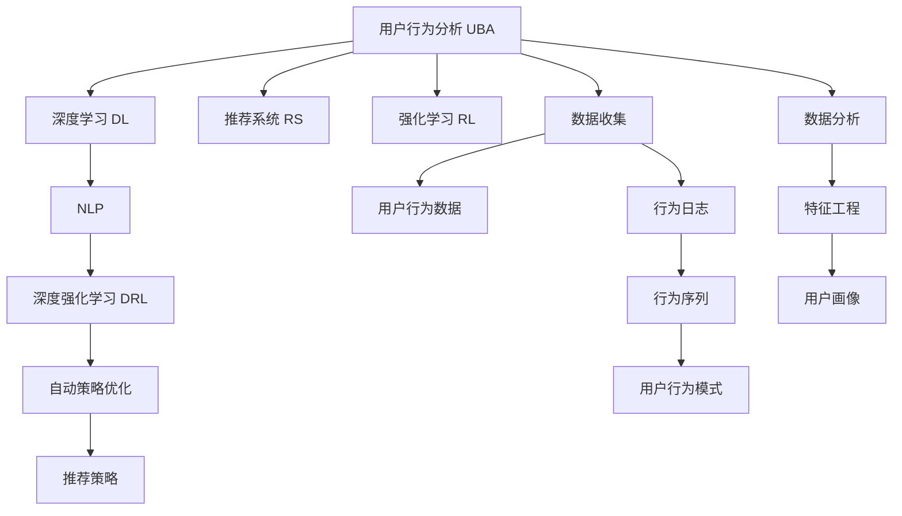

                 

# 用户行为分析：AI的个性化基础

## 1. 背景介绍

### 1.1 问题由来
随着数字化转型的深入，各个行业开始大规模收集和分析用户行为数据，以驱动产品改进和营销优化。然而，数据量的激增和复杂性的提高，使得传统的统计分析方法无法有效应对。与此同时，人工智能(AI)技术的发展，特别是深度学习在图像、语音、自然语言处理等领域取得的突破，为处理大规模复杂数据提供了新的工具。

### 1.2 问题核心关键点
用户行为分析，旨在通过AI技术，从海量的用户数据中挖掘出有价值的模式和趋势，以指导企业决策和业务优化。传统的统计分析方法依赖于手工设定的特征和预定义的模型，而AI技术特别是深度学习，通过自动学习特征和模型，能够更灵活、更高效地分析用户行为。

## 2. 核心概念与联系

### 2.1 核心概念概述

为更好地理解AI在用户行为分析中的应用，本节将介绍几个关键概念：

- 用户行为分析（User Behavior Analysis, UBA）：通过对用户在线行为数据的收集和分析，了解用户行为模式和偏好，从而指导企业制定精准的市场营销策略。

- 深度学习（Deep Learning）：一类基于神经网络的机器学习方法，通过多层次的非线性变换，自动学习输入数据的特征表示，从而解决复杂的模式识别和预测问题。

- 推荐系统（Recommendation System）：利用用户行为数据和物品特征，通过机器学习算法预测用户偏好，自动推荐用户可能感兴趣的内容或商品。

- 强化学习（Reinforcement Learning）：一种通过与环境交互来学习最优策略的机器学习方法，可用于自动控制和决策优化。

- 自然语言处理（Natural Language Processing, NLP）：使计算机能够理解、处理和生成自然语言，为大规模用户数据分析提供语言层面的支持。

- 深度强化学习（Deep Reinforcement Learning, DRL）：结合深度学习和强化学习，通过神经网络优化策略函数，解决高维连续空间上的强化学习问题。

这些核心概念之间的逻辑关系可以通过以下Mermaid流程图来展示：



这个流程图展示了大语言模型的核心概念及其之间的关系：

1. 用户行为数据收集。通过多种渠道收集用户的行为数据，包括点击、浏览、购买、评分等。
2. 数据预处理和特征工程。对数据进行清洗、标准化和特征提取，以便深度学习模型处理。
3. 深度学习模型训练。使用深度学习模型自动学习用户行为特征，预测用户行为模式。
4. 推荐系统构建。基于用户行为预测结果，构建推荐模型，向用户推荐相关内容或商品。
5. 强化学习策略优化。通过与环境的交互，自动优化推荐策略，提升用户体验和转化率。
6. 自然语言处理支持。处理用户生成的自然语言数据，如评论、问卷等，提取有价值的信息。

## 3. 核心算法原理 & 具体操作步骤

### 3.1 算法原理概述

AI在用户行为分析中的核心算法原理，主要基于以下几个方面：

- 数据驱动的特征工程：通过自动化的特征提取方法，如主成分分析(PCA)、因子分析、神经网络自动编码等，从原始数据中提取出有意义的特征。
- 深度神经网络：利用多层次的非线性变换，自动学习数据的复杂特征表示，能够处理高维度的数据。
- 推荐算法优化：包括协同过滤、基于内容的推荐、基于矩阵分解的推荐等，通过优化算法提升推荐效果。
- 强化学习策略优化：通过与环境的交互，自动调整策略参数，以最大化用户的满意度。
- 自然语言处理：通过处理用户生成的自然语言数据，提取用户的情感、态度等隐性信息。

### 3.2 算法步骤详解

AI在用户行为分析中的应用，主要分为以下几个步骤：

**Step 1: 数据收集与预处理**
- 收集用户行为数据，包括点击、浏览、购买、评分等行为数据。
- 对数据进行清洗、标准化和特征提取，去除噪声和异常值，提取有意义的特征。
- 对特征进行编码，使其适合深度学习模型处理。

**Step 2: 深度学习模型训练**
- 选择合适的深度学习模型，如神经网络、卷积神经网络(CNN)、循环神经网络(RNN)等。
- 对模型进行训练，使用标注数据和损失函数进行优化。
- 使用交叉验证等方法评估模型性能，选择合适的超参数。

**Step 3: 推荐系统构建**
- 基于用户行为预测结果，构建推荐模型。
- 选择合适的推荐算法，如协同过滤、基于内容的推荐、矩阵分解等。
- 对推荐系统进行训练，使用用户行为数据进行优化。
- 对推荐结果进行排序和筛选，提供给用户推荐内容。

**Step 4: 强化学习策略优化**
- 设计强化学习环境，定义状态、动作和奖励函数。
- 使用强化学习算法，如Q-learning、深度Q网络(DQN)、策略梯度等，优化推荐策略。
- 通过与环境的交互，自动调整策略参数，提升推荐效果。

**Step 5: 自然语言处理支持**
- 处理用户生成的自然语言数据，如评论、问卷等。
- 提取用户情感、态度等信息，用于指导推荐策略和用户画像构建。

### 3.3 算法优缺点

AI在用户行为分析中的应用，具有以下优点：
- 自动化特征提取：通过深度学习模型自动提取特征，减少人工特征工程的复杂度。
- 高维数据处理：深度学习模型能够处理高维度的数据，解决复杂模式识别问题。
- 自适应优化：强化学习算法能够自动优化策略参数，提升推荐效果。
- 多模态数据融合：结合用户行为数据和自然语言数据，提取更全面的用户画像。

同时，AI在用户行为分析中也有以下局限性：
- 对数据质量要求高：深度学习模型对数据噪声敏感，需要高质量的数据进行训练。
- 模型复杂度高：深度学习模型需要大量的计算资源，训练和推理时间较长。
- 数据隐私问题：用户行为数据可能涉及隐私，需要在数据收集和使用过程中严格保护用户隐私。
- 缺乏可解释性：深度学习模型通常是"黑盒"模型，难以解释其内部工作机制。

尽管存在这些局限性，但AI在用户行为分析中的应用仍取得了显著的成果，成为数据驱动决策的重要手段。未来相关研究的重点在于如何进一步降低AI对数据质量和计算资源的依赖，提升模型的可解释性和隐私保护能力。

### 3.4 算法应用领域

AI在用户行为分析中的应用，已经广泛应用于以下几个领域：

- 电商推荐系统：通过分析用户的浏览、购买行为，推荐个性化的商品和促销活动。
- 在线广告投放：基于用户行为数据，预测用户的兴趣，优化广告投放策略，提升广告效果。
- 社交网络分析：通过分析用户在社交网络上的行为，推荐相关用户和内容，提升用户粘性。
- 移动应用优化：通过分析用户的移动应用使用行为，优化应用界面和功能，提升用户体验。
- 金融风险管理：通过分析用户的金融交易行为，识别潜在的风险和欺诈行为，保障金融安全。
- 内容推荐系统：分析用户的阅读、观看行为，推荐个性化的文章、视频等内容，提升用户满意度。

## 4. 数学模型和公式 & 详细讲解  
### 4.1 数学模型构建

本节将使用数学语言对AI在用户行为分析中的应用进行更加严格的刻画。

记用户行为数据为 $D=\{(x_i,y_i)\}_{i=1}^N$，其中 $x_i$ 为行为数据， $y_i$ 为行为标签。假设用户行为分析的目标是预测用户未来的行为 $y$，即：

$$
y=f(x;\theta)
$$

其中 $f$ 为预测函数， $\theta$ 为模型参数。深度学习模型的训练目标是最小化预测误差，即：

$$
\min_{\theta} \sum_{i=1}^N L(y_i,f(x_i;\theta))
$$

其中 $L$ 为损失函数，常用的损失函数包括均方误差(MSE)、交叉熵(CE)等。

### 4.2 公式推导过程

以下我们以协同过滤推荐算法为例，推导其数学公式及其梯度计算。

协同过滤推荐算法的基本思路是通过计算用户之间的相似度，为用户推荐与其兴趣相似的用户喜欢的商品。具体公式如下：

1. 用户-物品评分矩阵 $R$：
$$
R_{ij} = \left\{
  \begin{array}{lr}
    r_{ij} & \text{如果用户 i 对物品 j 有评分}\\
    0 & \text{否则}
  \end{array}
\right.
$$

2. 用户相似度矩阵 $S$：
$$
S_{ij} = \text{cosine similarity}(R_i, R_j)
$$

3. 用户推荐列表 $I_j$：
$$
I_j = \text{argmax}_{i \in N_j} S_{ij}
$$

其中 $N_j$ 为物品 j 的评分用户集。通过计算用户之间的相似度，找到与用户 i 兴趣相似的用户集合，并推荐这些用户喜欢的物品。

### 4.3 案例分析与讲解

假设有一个电商网站，需要为用户推荐商品。网站收集了用户的浏览和购买行为数据，并使用协同过滤推荐算法进行推荐。具体步骤如下：

1. 收集用户行为数据，构建用户-物品评分矩阵 $R$。
2. 使用余弦相似度计算用户相似度矩阵 $S$。
3. 对于每个用户 i，计算其相似用户集合 $N_i$。
4. 对于每个物品 j，计算其相似用户集合 $N_j$。
5. 对于每个用户 i，计算其推荐列表 $I_i$。
6. 将推荐列表 $I_i$ 展示给用户 i。

通过协同过滤推荐算法，电商网站可以基于用户行为数据，向用户推荐个性化的商品，提升用户购物体验和转化率。

## 5. 项目实践：代码实例和详细解释说明
### 5.1 开发环境搭建

在进行用户行为分析项目开发前，我们需要准备好开发环境。以下是使用Python进行PyTorch开发的环境配置流程：

1. 安装Anaconda：从官网下载并安装Anaconda，用于创建独立的Python环境。

2. 创建并激活虚拟环境：
```bash
conda create -n pytorch-env python=3.8 
conda activate pytorch-env
```

3. 安装PyTorch：根据CUDA版本，从官网获取对应的安装命令。例如：
```bash
conda install pytorch torchvision torchaudio cudatoolkit=11.1 -c pytorch -c conda-forge
```

4. 安装相关库：
```bash
pip install torch torchvision torchaudio
```

5. 安装TensorBoard：
```bash
pip install tensorboard
```

6. 安装PyTorch Lightning：
```bash
pip install pytorch-lightning
```

完成上述步骤后，即可在`pytorch-env`环境中开始项目开发。

### 5.2 源代码详细实现

这里我们以电商推荐系统为例，给出使用PyTorch和PyTorch Lightning进行协同过滤推荐算法的代码实现。

```python
import torch
import torch.nn as nn
from torch.utils.data import DataLoader
from torch.utils.tensorboard import SummaryWriter

class协同过滤模型(nn.Module):
    def __init__(self, num_users, num_items, embed_size):
        super(协同过滤模型, self).__init__()
        self.user_embed = nn.Embedding(num_users, embed_size)
        self.item_embed = nn.Embedding(num_items, embed_size)
        self.user_item_interaction = nn.Linear(embed_size * 2, 1)

    def forward(self, user, item):
        user_embed = self.user_embed(user)
        item_embed = self.item_embed(item)
        concat = torch.cat((user_embed, item_embed), dim=1)
        scores = self.user_item_interaction(concat)
        return scores

def协同过滤训练(模型, train_loader, valid_loader, num_epochs, learning_rate, save_path):
    writer = SummaryWriter()
    model.train()
    for epoch in range(num_epochs):
        for batch in train_loader:
            user, item, rating = batch
            scores = model(user, item)
            loss = nn.BCELoss()(scores, torch.tensor(rating).float())
            optimizer.zero_grad()
            loss.backward()
            optimizer.step()
            writer.add_scalar('train_loss', loss.item(), epoch)
        with torch.no_grad():
            model.eval()
            valid_loss = 0
            for batch in valid_loader:
                user, item, rating = batch
                scores = model(user, item)
                valid_loss += nn.BCELoss()(scores, torch.tensor(rating).float()).item()
            valid_loss /= len(valid_loader.dataset)
        print('Epoch [{}/{}], Loss: {:.4f}, Valid Loss: {:.4f}'.format(epoch+1, num_epochs, loss.item(), valid_loss))
        if (epoch+1) % 5 == 0:
            writer.add_scalar('valid_loss', valid_loss, epoch)
    model.save_pretrained(save_path)
```

代码中，我们定义了一个简单的协同过滤模型，包含用户和物品的嵌入层以及一个线性层。通过计算用户和物品的向量表示的余弦相似度，得到用户对物品的评分。在训练过程中，使用交叉熵损失函数进行优化，同时记录训练和验证的损失，并使用TensorBoard进行可视化。

### 5.3 代码解读与分析

让我们再详细解读一下关键代码的实现细节：

**协同过滤模型类**：
- `__init__`方法：初始化用户和物品的嵌入层，以及线性层。
- `forward`方法：前向传播计算用户对物品的评分。

**训练函数**：
- 使用PyTorch的DataLoader对数据集进行批次化加载，供模型训练使用。
- 在训练过程中，每轮迭代计算用户对物品的评分，计算交叉熵损失并反向传播更新模型参数。
- 周期性在验证集上评估模型性能，记录训练和验证的损失。
- 每5个epoch保存一次模型，用于后续评估和部署。

**代码实现细节**：
- 使用PyTorch的Embedding层实现用户和物品的嵌入。
- 使用PyTorch的BCELoss计算交叉熵损失。
- 使用PyTorch的优化器AdamW进行模型参数的优化。
- 使用TensorBoard记录训练过程中的各项指标。
- 使用PyTorch Lightning进行模型训练和评估，简化代码实现。

可以看到，PyTorch和PyTorch Lightning提供了丰富的工具和组件，可以大大简化模型的开发和调试过程。开发者可以将更多精力放在算法设计、模型优化等核心问题上，而不必过多关注底层的实现细节。

当然，工业级的系统实现还需考虑更多因素，如模型的保存和部署、超参数的自动搜索、更灵活的任务适配层等。但核心的算法逻辑基本与此类似。

## 6. 实际应用场景
### 6.1 电商推荐系统

电商推荐系统是基于用户行为分析的经典应用之一。通过分析用户的浏览、购买行为，电商网站可以向用户推荐个性化的商品和促销活动，提升用户体验和转化率。

在技术实现上，可以收集用户的历史浏览、点击、购买等行为数据，使用协同过滤推荐算法等深度学习模型进行推荐。推荐系统可以实时更新推荐结果，根据用户的实时行为进行动态调整，从而提高推荐效果。

### 6.2 在线广告投放

在线广告投放是用户行为分析的另一个重要应用场景。通过分析用户的浏览、点击、停留等行为数据，广告主可以精准定位目标用户，优化广告投放策略，提升广告效果。

在实践中，可以收集用户在不同平台上的行为数据，如网页浏览记录、社交媒体互动等。使用深度学习模型预测用户的兴趣和行为倾向，根据预测结果进行精准投放。

### 6.3 社交网络分析

社交网络分析是用户行为分析在社交媒体领域的应用。通过分析用户在社交网络上的行为，可以推荐相关用户和内容，提升用户粘性和平台活跃度。

在技术实现上，可以收集用户在不同社交平台上的互动数据，如评论、点赞、分享等。使用深度学习模型预测用户的兴趣和行为倾向，推荐相关用户和内容。社交网络平台可以实时更新推荐结果，根据用户的实时行为进行动态调整。

### 6.4 金融风险管理

金融风险管理是用户行为分析在金融领域的应用。通过分析用户的金融交易行为，可以识别潜在的风险和欺诈行为，保障金融安全。

在实践中，可以收集用户的交易记录、账户余额、交易频率等行为数据。使用深度学习模型预测用户的风险倾向，根据预测结果进行风险控制和预警。金融机构可以实时监控用户行为，及时发现和防范金融风险。

## 7. 工具和资源推荐
### 7.1 学习资源推荐

为了帮助开发者系统掌握AI在用户行为分析中的应用，这里推荐一些优质的学习资源：

1. 《深度学习》系列书籍：由多位AI专家合著，系统介绍了深度学习的基本原理和应用方法，涵盖NLP、计算机视觉、强化学习等领域。

2. Coursera《深度学习专项课程》：由吴恩达等人主讲，深入浅出地讲解了深度学习的基础知识和应用场景，适合初学者和进阶学习者。

3. PyTorch官方文档：PyTorch的官方文档提供了丰富的教程和示例，适合学习和开发深度学习模型。

4. TensorFlow官方文档：TensorFlow的官方文档提供了全面的教程和工具，适合学习和开发深度学习模型。

5. PyTorch Lightning官方文档：PyTorch Lightning的官方文档提供了丰富的教程和示例，适合学习和开发深度学习模型。

通过这些资源的学习实践，相信你一定能够快速掌握AI在用户行为分析中的应用，并用于解决实际的业务问题。

### 7.2 开发工具推荐

高效的开发离不开优秀的工具支持。以下是几款用于用户行为分析开发的常用工具：

1. PyTorch：基于Python的开源深度学习框架，灵活动态的计算图，适合快速迭代研究。大部分深度学习模型都有PyTorch版本的实现。

2. TensorFlow：由Google主导开发的开源深度学习框架，生产部署方便，适合大规模工程应用。同样有丰富的深度学习模型资源。

3. PyTorch Lightning：由HuggingFace开发的深度学习模型封装工具，提供易于使用的API，简化模型开发和部署。

4. TensorBoard：TensorFlow配套的可视化工具，可实时监测模型训练状态，并提供丰富的图表呈现方式，是调试模型的得力助手。

5. Jupyter Notebook：免费的交互式编程环境，支持Python和其他语言，适合学习和开发深度学习模型。

合理利用这些工具，可以显著提升用户行为分析的开发效率，加快创新迭代的步伐。

### 7.3 相关论文推荐

用户行为分析领域的研究成果众多，以下是几篇奠基性的相关论文，推荐阅读：

1. "Collaborative Filtering for Recommender Systems"：提出协同过滤推荐算法，奠定了推荐系统理论基础。

2. "Deep Learning for Recommender Systems: A Survey and Prospects"：综述了深度学习在推荐系统中的应用，分析了其优缺点和未来方向。

3. "Scalable Collaborative Filtering"：提出分布式协同过滤算法，解决了推荐系统的可扩展性问题。

4. "Social Attention Networks for Recommendation Systems"：提出社交注意力网络，结合用户社交关系提升推荐效果。

5. "Adaptive Multi-Armed Bandit for Recommender Systems"：提出适应性多臂 bandit算法，优化推荐系统的个性化推荐。

这些论文代表了大语言模型微调技术的发展脉络。通过学习这些前沿成果，可以帮助研究者把握学科前进方向，激发更多的创新灵感。

## 8. 总结：未来发展趋势与挑战

### 8.1 总结

本文对AI在用户行为分析中的应用进行了全面系统的介绍。首先阐述了用户行为分析的研究背景和意义，明确了AI在处理大规模用户数据中的重要作用。其次，从原理到实践，详细讲解了用户行为分析的数学模型和关键步骤，给出了实际应用中的代码实例。同时，本文还广泛探讨了用户行为分析在电商推荐、在线广告、社交网络、金融风险管理等多个行业领域的应用前景，展示了AI的巨大潜力。

通过本文的系统梳理，可以看到，AI在用户行为分析中的应用已经成为数据驱动决策的重要手段，极大地提升了企业的业务优化和决策支持能力。未来，伴随AI技术的不断进步，用户行为分析将迎来更广泛的应用场景和更丰富的应用模式。

### 8.2 未来发展趋势

展望未来，AI在用户行为分析中的应用将呈现以下几个发展趋势：

1. 多模态数据融合：结合用户行为数据和自然语言数据、视觉数据等，提取更全面的用户画像，提升推荐效果。
2. 深度强化学习：通过与环境的交互，自动优化推荐策略，提升用户体验和转化率。
3. 联邦学习：在分布式环境中，保护用户隐私的同时，提升推荐效果。
4. 可解释性：通过模型解释方法，提高推荐系统的透明性和可信度。
5. 个性化推荐算法：结合用户行为数据和模型输出，进行精准推荐。
6. 实时推荐系统：通过流式数据处理和模型更新，实现实时推荐，提升用户体验。

以上趋势凸显了AI在用户行为分析中的广阔前景。这些方向的探索发展，必将进一步提升AI在数据驱动决策中的作用，推动企业决策智能化和精准化。

### 8.3 面临的挑战

尽管AI在用户行为分析中的应用已经取得了显著的成果，但在迈向更加智能化、普适化应用的过程中，它仍面临诸多挑战：

1. 数据质量问题：用户行为数据质量参差不齐，数据缺失、噪声等问题普遍存在，影响模型的训练效果。
2. 模型复杂度高：深度学习模型需要大量的计算资源，训练和推理时间较长。
3. 用户隐私保护：用户行为数据涉及隐私问题，如何在数据收集和使用过程中保护用户隐私，成为重要挑战。
4. 可解释性不足：深度学习模型通常是"黑盒"模型，难以解释其内部工作机制和决策逻辑。
5. 算法复杂度高：用户行为分析涉及多模态数据融合、深度强化学习等复杂算法，实现难度较大。

尽管存在这些挑战，但AI在用户行为分析中的应用仍具有广阔的前景，未来相关研究的重点在于如何进一步降低AI对数据质量和计算资源的依赖，提升模型的可解释性和隐私保护能力。

### 8.4 研究展望

面对用户行为分析面临的诸多挑战，未来的研究需要在以下几个方面寻求新的突破：

1. 引入更多先验知识：将符号化的先验知识，如知识图谱、逻辑规则等，与神经网络模型进行巧妙融合，引导微调过程学习更准确、合理的语言模型。

2. 结合因果分析和博弈论工具：将因果分析方法引入微调模型，识别出模型决策的关键特征，增强输出解释的因果性和逻辑性。借助博弈论工具刻画人机交互过程，主动探索并规避模型的脆弱点，提高系统稳定性。

3. 纳入伦理道德约束：在模型训练目标中引入伦理导向的评估指标，过滤和惩罚有偏见、有害的输出倾向。加强人工干预和审核，建立模型行为的监管机制，确保输出符合人类价值观和伦理道德。

4. 研究参数高效微调方法：开发更加参数高效的微调方法，在固定大部分预训练参数的同时，只更新极少量的任务相关参数。同时优化微调模型的计算图，减少前向传播和反向传播的资源消耗，实现更加轻量级、实时性的部署。

5. 引入无监督和半监督学习：摆脱对大规模标注数据的依赖，利用自监督学习、主动学习等无监督和半监督范式，最大限度利用非结构化数据，实现更加灵活高效的微调。

这些研究方向的探索，必将引领用户行为分析技术迈向更高的台阶，为构建安全、可靠、可解释、可控的智能系统铺平道路。面向未来，用户行为分析技术还需要与其他AI技术进行更深入的融合，如知识表示、因果推理、强化学习等，多路径协同发力，共同推动自然语言理解和智能交互系统的进步。只有勇于创新、敢于突破，才能不断拓展AI技术在用户行为分析中的边界，让智能技术更好地造福人类社会。

## 9. 附录：常见问题与解答

**Q1：AI在用户行为分析中的优势是什么？**

A: AI在用户行为分析中的优势主要体现在以下几个方面：
1. 自动化特征提取：通过深度学习模型自动提取特征，减少人工特征工程的复杂度。
2. 高维数据处理：深度学习模型能够处理高维度的数据，解决复杂模式识别问题。
3. 自适应优化：强化学习算法能够自动优化推荐策略，提升推荐效果。
4. 多模态数据融合：结合用户行为数据和自然语言数据、视觉数据等，提取更全面的用户画像。

**Q2：在用户行为分析中，如何选择适合的深度学习模型？**

A: 在用户行为分析中，选择合适的深度学习模型主要取决于具体任务和数据特点。常用的深度学习模型包括：
1. 神经网络（Neural Network, NN）：适用于分类、回归等传统任务。
2. 卷积神经网络（Convolutional Neural Network, CNN）：适用于图像和视频数据处理。
3. 循环神经网络（Recurrent Neural Network, RNN）：适用于序列数据处理，如文本、语音等。
4. 深度强化学习模型（Deep Reinforcement Learning, DRL）：适用于多任务、多目标任务，需要与环境交互。

**Q3：在用户行为分析中，如何处理数据隐私问题？**

A: 在用户行为分析中，处理数据隐私问题主要从以下几个方面入手：
1. 数据匿名化：对用户数据进行匿名化处理，去除敏感信息，保护用户隐私。
2. 数据加密：对用户数据进行加密处理，防止数据泄露。
3. 联邦学习：在分布式环境中，保护用户隐私的同时，提升推荐效果。
4. 差分隐私：在数据处理过程中，加入噪声，保护用户隐私。

**Q4：在用户行为分析中，如何提高推荐系统的可解释性？**

A: 在用户行为分析中，提高推荐系统的可解释性主要从以下几个方面入手：
1. 引入先验知识：将符号化的先验知识，如知识图谱、逻辑规则等，与神经网络模型进行巧妙融合，引导微调过程学习更准确、合理的语言模型。
2. 结合因果分析和博弈论工具：将因果分析方法引入微调模型，识别出模型决策的关键特征，增强输出解释的因果性和逻辑性。借助博弈论工具刻画人机交互过程，主动探索并规避模型的脆弱点，提高系统稳定性。
3. 使用可解释性方法：如LIME、SHAP等，对模型进行解释，提供具体的决策依据和分析结果。

**Q5：在用户行为分析中，如何优化推荐系统的性能？**

A: 在用户行为分析中，优化推荐系统的性能主要从以下几个方面入手：
1. 数据预处理：对数据进行清洗、标准化和特征提取，去除噪声和异常值，提取有意义的特征。
2. 模型选择：根据具体任务和数据特点，选择合适的深度学习模型和推荐算法。
3. 模型训练：使用标注数据和损失函数进行优化，提高模型性能。
4. 模型评估：使用交叉验证等方法评估模型性能，选择最优模型。
5. 模型调优：通过超参数调优、模型裁剪等方法，优化模型结构和性能。

通过以上几点，可以显著提升推荐系统的性能，提高用户体验和转化率。

---

作者：禅与计算机程序设计艺术 / Zen and the Art of Computer Programming

