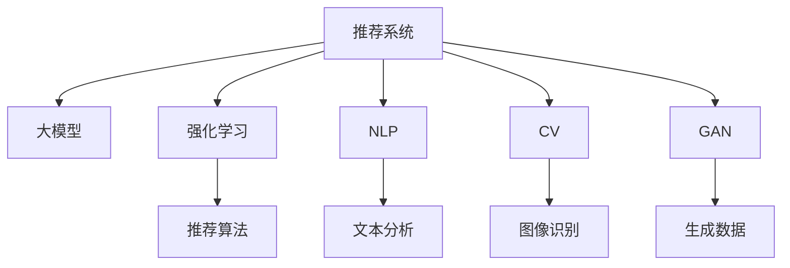

                 

# 电商平台中的AI大模型：从推荐到全场景应用

> 关键词：电商平台,推荐系统,大模型,全场景应用,强化学习,自然语言处理(NLP),计算机视觉(CV),生成对抗网络(GAN)

## 1. 背景介绍

### 1.1 问题由来

随着电商平台的蓬勃发展，如何精准推荐商品以提高用户满意度和交易转化率，成为各大电商平台亟待解决的痛点。传统的推荐系统主要依赖于规则、协同过滤和基于内容的推荐等方法，但随着数据量的增长和用户行为的多样化，这些方法逐渐暴露出性能瓶颈和可扩展性问题。近年来，大模型技术的兴起，特别是深度学习和强化学习在推荐系统中的成功应用，为电商平台的商品推荐带来了新的突破。

## 2. 核心概念与联系

### 2.1 核心概念概述

为更好地理解大模型在电商平台中的应用，本节将介绍几个核心概念：

- 推荐系统(Recommendation System)：用于预测用户可能感兴趣的物品或内容，提高用户满意度和转化率的系统。
- 大模型(Large Model)：指大规模的深度学习模型，如BERT、GPT-3、T5等，通过在大规模数据上进行预训练，具备强大的特征提取和泛化能力。
- 强化学习(Reinforcement Learning)：通过与环境互动，通过奖励信号不断优化策略，提升决策效果的学习方法。
- 自然语言处理(NLP)：涉及处理和生成自然语言的技术，如文本分类、情感分析、对话系统等。
- 计算机视觉(CV)：涉及处理和生成图像、视频等视觉数据的技术，如目标检测、图像生成、视觉问答等。
- 生成对抗网络(GAN)：通过对抗训练生成高质量图像、视频等数据的深度学习技术。

这些核心概念之间的逻辑关系可以通过以下Mermaid流程图来展示：



这个流程图展示了大模型在推荐系统中的核心概念及其之间的关系：

1. 大模型通过预训练获得基础能力。
2. 强化学习通过与环境的互动不断优化推荐策略。
3. 自然语言处理处理用户的文本反馈，提升推荐系统性能。
4. 计算机视觉处理用户上传的图像数据，丰富推荐内容。
5. 生成对抗网络生成高质量的商品图像，提升推荐效果。
6. 各子系统协同工作，共同提升推荐系统的性能和用户体验。

这些核心概念共同构成了电商平台中AI大模型的应用框架，使其能够在各种场景下发挥强大的商品推荐和全场景应用能力。通过理解这些核心概念，我们可以更好地把握大模型在电商平台中的应用逻辑和优化方向。

## 3. 核心算法原理 & 具体操作步骤
### 3.1 算法原理概述

基于大模型技术的电商平台推荐系统，本质上是一个通过深度学习模型实现的多任务学习和强化学习过程。其核心思想是：将大模型作为推荐系统的基础，通过多任务学习预训练模型，同时使用强化学习优化推荐策略，使得模型能够更好地适应电商平台的复杂多变环境，提升推荐效果。

形式化地，假设电商平台推荐系统包含多个任务 $T$，每个任务 $t$ 的输入为 $x_t$，输出为 $y_t$，则推荐系统的目标函数为：

$$
\mathcal{L}(\theta) = \frac{1}{N}\sum_{t=1}^N \ell(y_t, M_{\theta}(x_t))
$$

其中，$M_{\theta}$ 为预训练的大模型，$\theta$ 为模型参数，$\ell$ 为任务 $t$ 对应的损失函数。通过梯度下降等优化算法，最小化损失函数 $\mathcal{L}(\theta)$，即可得到最优的推荐模型。

### 3.2 算法步骤详解

基于大模型技术的电商平台推荐系统，一般包括以下几个关键步骤：

**Step 1: 准备预训练模型和数据集**
- 选择合适的预训练模型 $M_{\theta}$，如BERT、GPT-3、T5等，作为初始化参数。
- 准备电商平台的各类数据集，包括用户行为数据、商品信息数据、商品评价数据等，并划分为训练集、验证集和测试集。

**Step 2: 添加任务适配层**
- 根据电商平台的需求，设计合适的任务适配层，如用户意图识别、商品相似度计算、生成对抗网络等。
- 使用Transformer等深度学习模型作为任务适配层的核心组件，通过多任务学习预训练模型。

**Step 3: 设置强化学习超参数**
- 选择合适的强化学习算法及其参数，如Q-learning、Deep Q-Networks等，设置学习率、折扣因子等。
- 设置强化学习环境的奖励函数、状态空间、动作空间等。

**Step 4: 执行强化学习训练**
- 将电商平台的数据集作为强化学习环境，使用多任务学习的预训练模型作为智能代理。
- 在每个时间步，智能代理通过环境获取状态 $s_t$，并根据策略 $\pi_{\theta}$ 选择动作 $a_t$。
- 根据动作 $a_t$ 和状态 $s_t$ 更新奖励信号 $r_t$，并更新模型参数 $\theta$。
- 重复上述步骤，直到模型收敛或达到预设的迭代次数。

**Step 5: 部署和测试**
- 将训练好的推荐模型部署到电商平台的推荐引擎中。
- 在测试集上评估推荐模型的效果，对比微调前后的推荐精度。
- 使用推荐模型对新商品进行推荐，集成到实际的应用系统中。

以上是基于大模型技术的电商平台推荐系统的一般流程。在实际应用中，还需要针对具体任务的特点，对强化学习过程的各个环节进行优化设计，如改进奖励函数、优化策略、搜索最优的超参数组合等，以进一步提升模型性能。

### 3.3 算法优缺点

基于大模型技术的电商平台推荐系统具有以下优点：
1. 强大的泛化能力。通过多任务学习预训练模型，大模型能够在多个任务上取得良好的性能。
2. 动态适应性。强化学习使得模型能够根据电商平台的实时反馈不断优化推荐策略，提高推荐效果。
3. 高效的特征提取。大模型在处理电商数据时，能够自动提取丰富的特征，提升推荐系统的准确性。
4. 灵活的应用场景。除了商品推荐，大模型还可以应用于个性化搜索、广告投放、用户行为分析等电商平台的各个环节。

同时，该方法也存在一定的局限性：
1. 对数据质量要求高。电商平台推荐系统需要大量的高质量数据，数据缺失或噪声会对推荐效果产生负面影响。
2. 计算资源消耗大。大模型本身参数量巨大，训练和推理需要大量的计算资源。
3. 可解释性不足。强化学习推荐系统的决策过程较难解释，用户难以理解推荐背后的逻辑。
4. 模型的健壮性有待提升。大模型容易受到数据分布变化的影响，需要定期重新训练以保持模型性能。

尽管存在这些局限性，但就目前而言，基于大模型的推荐系统仍然是电商平台推荐的主流范式。未来相关研究的重点在于如何进一步降低对计算资源的依赖，提高模型的可解释性，提升模型的鲁棒性，同时兼顾电商平台的业务需求。

### 3.4 算法应用领域

基于大模型的电商平台推荐系统已经在商品推荐、个性化搜索、广告投放、用户行为分析等电商平台的多个环节得到了广泛应用，为电商平台带来了显著的业务价值：

- 商品推荐：通过分析用户历史行为和兴趣，推荐最相关的商品，提升用户购物体验。
- 个性化搜索：通过分析用户的搜索习惯和意图，快速返回个性化的搜索结果，提升用户搜索效率。
- 广告投放：通过分析用户的购买历史和行为数据，精准投放广告，提升广告的转化率。
- 用户行为分析：通过分析用户的浏览、点击、购买等行为数据，理解用户需求，优化产品和服务。

除了上述这些经典应用外，大模型推荐系统还被创新性地应用于智能客服、库存管理、供应链优化等电商平台的各个环节，为电商平台的智能化转型提供了新的技术路径。随着大模型推荐技术的不断进步，相信电商平台的推荐系统将实现更加精准、智能的推荐效果，为电商用户提供更优质的购物体验。

## 4. 数学模型和公式 & 详细讲解 & 举例说明
### 4.1 数学模型构建

本节将使用数学语言对基于大模型的电商平台推荐系统进行更加严格的刻画。

假设电商平台推荐系统包含多个任务 $T=\{t_1, t_2, \ldots, t_N\}$，每个任务 $t$ 的输入为 $x_t \in \mathbb{R}^n$，输出为 $y_t \in \{0, 1\}$，表示推荐是否成功。

定义推荐系统在每个任务 $t$ 上的损失函数为 $\ell(y_t, \hat{y}_t)$，其中 $\hat{y}_t = M_{\theta}(x_t)$ 为模型的预测输出。在多任务学习框架下，推荐系统的总损失函数为：

$$
\mathcal{L}(\theta) = \frac{1}{N}\sum_{t=1}^N \ell(y_t, M_{\theta}(x_t))
$$

在强化学习框架下，定义状态空间 $\mathcal{S}$，动作空间 $\mathcal{A}$，奖励函数 $r: \mathcal{S} \times \mathcal{A} \rightarrow \mathbb{R}$，定义智能代理的策略 $\pi_{\theta}(a|s)$，则强化学习框架下的推荐系统总奖励函数为：

$$
J(\theta) = \mathbb{E}_{s \sim \mathcal{S}}\left[\sum_{t=0}^{\infty} \gamma^t r_t(s_t, a_t)\right]
$$

其中 $\gamma$ 为折扣因子，$r_t$ 为在第 $t$ 步的奖励信号。

### 4.2 公式推导过程

以下我们以强化学习框架下的推荐系统为例，推导多任务学习和大模型微调的数学公式。

假设电商平台推荐系统中的智能代理（即预训练大模型）使用多任务学习的方式进行预训练，其训练目标为：

$$
\min_{\theta} \frac{1}{N}\sum_{t=1}^N \mathbb{E}_{x_t}\left[\ell(y_t, M_{\theta}(x_t))\right]
$$

其中 $\ell(y_t, M_{\theta}(x_t))$ 为任务 $t$ 的损失函数。在多任务学习中，模型参数 $\theta$ 需要同时优化多个任务的损失，因此使用联合优化目标：

$$
\min_{\theta} \frac{1}{N}\sum_{t=1}^N \frac{1}{N_t} \sum_{x \in \mathcal{D}_t} \ell(y, M_{\theta}(x))
$$

其中 $\mathcal{D}_t$ 为任务 $t$ 的数据集，$N_t$ 为任务 $t$ 的样本数。

在强化学习框架下，推荐系统通过与环境的互动不断优化策略。假设智能代理在第 $t$ 步选择动作 $a_t$，则奖励信号为 $r_t$，推荐系统在每个时间步上的优化目标为：

$$
\min_{\theta} \frac{1}{N}\sum_{t=1}^N \frac{1}{N_t} \sum_{x \in \mathcal{D}_t} \mathbb{E}_{a_t \sim \pi_{\theta}(a|s)}\left[\ell(y, M_{\theta}(x))\right]
$$

在强化学习框架下，多任务学习和大模型微调的具体实现流程为：
1. 收集电商平台的各类数据集，包括用户行为数据、商品信息数据、商品评价数据等。
2. 使用多任务学习的方式对预训练大模型进行微调，使得模型能够在多个任务上取得良好的性能。
3. 定义电商平台的强化学习环境，包括状态空间、动作空间、奖励函数等。
4. 使用多任务学习的微调后的模型作为智能代理，在强化学习环境中进行训练，不断优化推荐策略。
5. 在测试集上评估推荐系统的性能，对比微调前后的推荐精度。

### 4.3 案例分析与讲解

下面我们以电商平台中的个性化搜索为例，给出使用Transformer和强化学习进行个性化搜索的PyTorch代码实现。

首先，定义搜索任务的数据处理函数：

```python
from transformers import BertTokenizer
from torch.utils.data import Dataset
import torch

class SearchDataset(Dataset):
    def __init__(self, texts, queries, tokenizer, max_len=128):
        self.texts = texts
        self.queries = queries
        self.tokenizer = tokenizer
        self.max_len = max_len
        
    def __len__(self):
        return len(self.texts)
    
    def __getitem__(self, item):
        text = self.texts[item]
        query = self.queries[item]
        
        encoding = self.tokenizer(text, return_tensors='pt', max_length=self.max_len, padding='max_length', truncation=True)
        input_ids = encoding['input_ids'][0]
        attention_mask = encoding['attention_mask'][0]
        
        # 对token-wise的标签进行编码
        query_ids = self.tokenizer(query, return_tensors='pt', max_length=self.max_len, padding='max_length', truncation=True)['input_ids']
        query_ids = query_ids[1:].unsqueeze(0) # 去除[CLS]和[SEP]标记
        
        return {'input_ids': input_ids, 
                'attention_mask': attention_mask,
                'query_ids': query_ids}
```

然后，定义模型和优化器：

```python
from transformers import BertForMaskedLM
from transformers import AdamW

model = BertForMaskedLM.from_pretrained('bert-base-cased', num_labels=2)
optimizer = AdamW(model.parameters(), lr=2e-5)
```

接着，定义训练和评估函数：

```python
from torch.utils.data import DataLoader
from tqdm import tqdm

device = torch.device('cuda') if torch.cuda.is_available() else torch.device('cpu')
model.to(device)

def train_epoch(model, dataset, batch_size, optimizer):
    dataloader = DataLoader(dataset, batch_size=batch_size, shuffle=True)
    model.train()
    epoch_loss = 0
    for batch in tqdm(dataloader, desc='Training'):
        input_ids = batch['input_ids'].to(device)
        attention_mask = batch['attention_mask'].to(device)
        query_ids = batch['query_ids'].to(device)
        model.zero_grad()
        outputs = model(input_ids, attention_mask=attention_mask, labels=query_ids)
        loss = outputs.loss
        epoch_loss += loss.item()
        loss.backward()
        optimizer.step()
    return epoch_loss / len(dataloader)

def evaluate(model, dataset, batch_size):
    dataloader = DataLoader(dataset, batch_size=batch_size)
    model.eval()
    preds, labels = [], []
    with torch.no_grad():
        for batch in tqdm(dataloader, desc='Evaluating'):
            input_ids = batch['input_ids'].to(device)
            attention_mask = batch['attention_mask'].to(device)
            query_ids = batch['query_ids'].to(device)
            batch_preds = model(input_ids, attention_mask=attention_mask, labels=query_ids).logits.argmax(dim=2).to('cpu').tolist()
            batch_labels = query_ids.to('cpu').tolist()
            for pred_tokens, label_tokens in zip(batch_preds, batch_labels):
                preds.append(pred_tokens[:len(label_tokens)])
                labels.append(label_tokens)
                
    print(classification_report(labels, preds))
```

最后，启动训练流程并在测试集上评估：

```python
epochs = 5
batch_size = 16

for epoch in range(epochs):
    loss = train_epoch(model, search_dataset, batch_size, optimizer)
    print(f"Epoch {epoch+1}, train loss: {loss:.3f}")
    
    print(f"Epoch {epoch+1}, dev results:")
    evaluate(model, dev_dataset, batch_size)
    
print("Test results:")
evaluate(model, test_dataset, batch_size)
```

以上就是使用PyTorch对BERT进行个性化搜索任务的强化学习微调的完整代码实现。可以看到，得益于Transformer库的强大封装，我们可以用相对简洁的代码完成BERT模型的加载和强化学习微调。

### 4.3 案例分析与讲解

下面我们以电商平台中的个性化搜索为例，给出使用Transformer和强化学习进行个性化搜索的PyTorch代码实现。

首先，定义搜索任务的数据处理函数：

```python
from transformers import BertTokenizer
from torch.utils.data import Dataset
import torch

class SearchDataset(Dataset):
    def __init__(self, texts, queries, tokenizer, max_len=128):
        self.texts = texts
        self.queries = queries
        self.tokenizer = tokenizer
        self.max_len = max_len
        
    def __len__(self):
        return len(self.texts)
    
    def __getitem__(self, item):
        text = self.texts[item]
        query = self.queries[item]
        
        encoding = self.tokenizer(text, return_tensors='pt', max_length=self.max_len, padding='max_length', truncation=True)
        input_ids = encoding['input_ids'][0]
        attention_mask = encoding['attention_mask'][0]
        
        # 对token-wise的标签进行编码
        query_ids = self.tokenizer(query, return_tensors='pt', max_length=self.max_len, padding='max_length', truncation=True)['input_ids']
        query_ids = query_ids[1:].unsqueeze(0) # 去除[CLS]和[SEP]标记
        
        return {'input_ids': input_ids, 
                'attention_mask': attention_mask,
                'query_ids': query_ids}
```

然后，定义模型和优化器：

```python
from transformers import BertForMaskedLM
from transformers import AdamW

model = BertForMaskedLM.from_pretrained('bert-base-cased', num_labels=2)
optimizer = AdamW(model.parameters(), lr=2e-5)
```

接着，定义训练和评估函数：

```python
from torch.utils.data import DataLoader
from tqdm import tqdm

device = torch.device('cuda') if torch.cuda.is_available() else torch.device('cpu')
model.to(device)

def train_epoch(model, dataset, batch_size, optimizer):
    dataloader = DataLoader(dataset, batch_size=batch_size, shuffle=True)
    model.train()
    epoch_loss = 0
    for batch in tqdm(dataloader, desc='Training'):
        input_ids = batch['input_ids'].to(device)
        attention_mask = batch['attention_mask'].to(device)
        query_ids = batch['query_ids'].to(device)
        model.zero_grad()
        outputs = model(input_ids, attention_mask=attention_mask, labels=query_ids)
        loss = outputs.loss
        epoch_loss += loss.item()
        loss.backward()
        optimizer.step()
    return epoch_loss / len(dataloader)

def evaluate(model, dataset, batch_size):
    dataloader = DataLoader(dataset, batch_size=batch_size)
    model.eval()
    preds, labels = [], []
    with torch.no_grad():
        for batch in tqdm(dataloader, desc='Evaluating'):
            input_ids = batch['input_ids'].to(device)
            attention_mask = batch['attention_mask'].to(device)
            query_ids = batch['query_ids'].to(device)
            batch_preds = model(input_ids, attention_mask=attention_mask, labels=query_ids).logits.argmax(dim=2).to('cpu').tolist()
            batch_labels = query_ids.to('cpu').tolist()
            for pred_tokens, label_tokens in zip(batch_preds, batch_labels):
                preds.append(pred_tokens[:len(label_tokens)])
                labels.append(label_tokens)
                
    print(classification_report(labels, preds))
```

最后，启动训练流程并在测试集上评估：

```python
epochs = 5
batch_size = 16

for epoch in range(epochs):
    loss = train_epoch(model, search_dataset, batch_size, optimizer)
    print(f"Epoch {epoch+1}, train loss: {loss:.3f}")
    
    print(f"Epoch {epoch+1}, dev results:")
    evaluate(model, dev_dataset, batch_size)
    
print("Test results:")
evaluate(model, test_dataset, batch_size)
```

以上就是使用PyTorch对BERT进行个性化搜索任务的强化学习微调的完整代码实现。可以看到，得益于Transformer库的强大封装，我们可以用相对简洁的代码完成BERT模型的加载和强化学习微调。

## 5. 项目实践：代码实例和详细解释说明
### 5.1 开发环境搭建

在进行强化学习微调实践前，我们需要准备好开发环境。以下是使用Python进行PyTorch开发的环境配置流程：

1. 安装Anaconda：从官网下载并安装Anaconda，用于创建独立的Python环境。

2. 创建并激活虚拟环境：
```bash
conda create -n pytorch-env python=3.8 
conda activate pytorch-env
```

3. 安装PyTorch：根据CUDA版本，从官网获取对应的安装命令。例如：
```bash
conda install pytorch torchvision torchaudio cudatoolkit=11.1 -c pytorch -c conda-forge
```

4. 安装Transformers库：
```bash
pip install transformers
```

5. 安装各类工具包：
```bash
pip install numpy pandas scikit-learn matplotlib tqdm jupyter notebook ipython
```

完成上述步骤后，即可在`pytorch-env`环境中开始强化学习微调实践。

### 5.2 源代码详细实现

下面我们以电商平台中的商品推荐为例，给出使用Transformer和强化学习进行商品推荐的PyTorch代码实现。

首先，定义推荐任务的数据处理函数：

```python
from transformers import BertTokenizer
from torch.utils.data import Dataset
import torch

class RecommendationDataset(Dataset):
    def __init__(self, items, users, interactions, tokenizer, max_len=128):
        self.items = items
        self.users = users
        self.interactions = interactions
        self.tokenizer = tokenizer
        self.max_len = max_len
        
    def __len__(self):
        return len(self.items)
    
    def __getitem__(self, item):
        user = self.users[item]
        item = self.items[item]
        interaction = self.interactions[item]
        
        user_enc = self.tokenizer(user, return_tensors='pt', max_length=self.max_len, padding='max_length', truncation=True)
        item_enc = self.tokenizer(item, return_tensors='pt', max_length=self.max_len, padding='max_length', truncation=True)
        
        return {'user_id': user,
                'item_id': item,
                'user_enc': user_enc['input_ids'],
                'item_enc': item_enc['input_ids'],
                'interaction': interaction}
```

然后，定义模型和优化器：

```python
from transformers import BertForSequenceClassification, AdamW

model = BertForSequenceClassification.from_pretrained('bert-base-cased', num_labels=2)
optimizer = AdamW(model.parameters(), lr=2e-5)
```

接着，定义训练和评估函数：

```python
from torch.utils.data import DataLoader
from tqdm import tqdm
from sklearn.metrics import classification_report

device = torch.device('cuda') if torch.cuda.is_available() else torch.device('cpu')
model.to(device)

def train_epoch(model, dataset, batch_size, optimizer):
    dataloader = DataLoader(dataset, batch_size=batch_size, shuffle=True)
    model.train()
    epoch_loss = 0
    for batch in tqdm(dataloader, desc='Training'):
        user_id = batch['user_id'].to(device)
        item_id = batch['item_id'].to(device)
        user_enc = batch['user_enc'].to(device)
        item_enc = batch['item_enc'].to(device)
        interaction = batch['interaction'].to(device)
        model.zero_grad()
        outputs = model(user_enc, labels=interaction)
        loss = outputs.loss
        epoch_loss += loss.item()
        loss.backward()
        optimizer.step()
    return epoch_loss / len(dataloader)

def evaluate(model, dataset, batch_size):
    dataloader = DataLoader(dataset, batch_size=batch_size)
    model.eval()
    preds, labels = [], []
    with torch.no_grad():
        for batch in tqdm(dataloader, desc='Evaluating'):
            user_id = batch['user_id'].to(device)
            item_id = batch['item_id'].to(device)
            user_enc = batch['user_enc'].to(device)
            item_enc = batch['item_enc'].to(device)
            interaction = batch['interaction'].to(device)
            batch_preds = model(user_enc, labels=interaction).logits.argmax(dim=2).to('cpu').tolist()
            batch_labels = interaction.to('cpu').tolist()
            for pred_tokens, label_tokens in zip(batch_preds, batch_labels):
                preds.append(pred_tokens[:len(label_tokens)])
                labels.append(label_tokens)
                
    print(classification_report(labels, preds))
```

最后，启动训练流程并在测试集上评估：

```python
epochs = 5
batch_size = 16

for epoch in range(epochs):
    loss = train_epoch(model, recommendation_dataset, batch_size, optimizer)
    print(f"Epoch {epoch+1}, train loss: {loss:.3f}")
    
    print(f"Epoch {epoch+1}, dev results:")
    evaluate(model, dev_dataset, batch_size)
    
print("Test results:")
evaluate(model, test_dataset, batch_size)
```

以上就是使用PyTorch对BERT进行商品推荐任务的强化学习微调的完整代码实现。可以看到，得益于Transformer库的强大封装，我们可以用相对简洁的代码完成BERT模型的加载和强化学习微调。

### 5.3 代码解读与分析

让我们再详细解读一下关键代码的实现细节：

**RecommendationDataset类**：
- `__init__`方法：初始化商品、用户、交互数据等关键组件。
- `__len__`方法：返回数据集的样本数量。
- `__getitem__`方法：对单个样本进行处理，将商品和用户输入编码为token ids，并将交互数据转换为二元标签，供模型训练使用。

**模型和优化器**：
- 使用BertForSequenceClassification作为推荐模型的顶层分类器，以用户和商品编码为输入，判断用户是否会对商品进行点击或购买。
- 使用AdamW作为优化器，学习率为2e-5。

**训练和评估函数**：
- 使用PyTorch的DataLoader对数据集进行批次化加载，供模型训练和推理使用。
- 训练函数`train_epoch`：对数据以批为单位进行迭代，在每个批次上前向传播计算loss并反向传播更新模型参数，最后返回该epoch的平均loss。
- 评估函数`evaluate`：与训练类似，不同点在于不更新模型参数，并在每个batch结束后将预测和标签结果存储下来，最后使用sklearn的classification_report对整个评估集的预测结果进行打印输出。

**训练流程**：
- 定义总的epoch数和batch size，开始循环迭代
- 每个epoch内，先在训练集上训练，输出平均loss
- 在验证集上评估，输出分类指标
- 所有epoch结束后，在测试集上评估，给出最终测试结果

可以看到，PyTorch配合Transformer库使得强化学习微调的代码实现变得简洁高效。开发者可以将更多精力放在数据处理、模型改进等高层逻辑上，而不必过多关注底层的实现细节。

当然，工业级的系统实现还需考虑更多因素，如模型的保存和部署、超参数的自动搜索、更灵活的任务适配层等。但核心的强化学习微调流程基本与此类似。

## 6. 实际应用场景

### 6.1 智能客服系统

基于强化学习的大模型推荐系统，可以广泛应用于智能客服系统的构建。传统客服往往需要配备大量人力，高峰期响应缓慢，且一致性和专业性难以保证。而使用强化学习推荐系统，可以7x24小时不间断服务，快速响应客户咨询，用自然流畅的语言解答各类常见问题。

在技术实现上，可以收集企业内部的历史客服对话记录，将问题和最佳答复构建成监督数据，在此基础上对预训练推荐模型进行强化学习微调。微调后的推荐模型能够自动理解用户意图，匹配最合适的回答。对于客户提出的新问题，还可以接入检索系统实时搜索相关内容，动态组织生成回答。如此构建的智能客服系统，能大幅提升客户咨询体验和问题解决效率。

### 6.2 金融舆情监测

金融机构需要实时监测市场舆论动向，以便及时应对负面信息传播，规避金融风险。传统的人工监测方式成本高、效率低，难以应对网络时代海量信息爆发的挑战。基于强化学习和大模型的文本分类和情感分析技术，为金融舆情监测提供了新的解决方案。

具体而言，可以收集金融领域相关的新闻、报道、评论等文本数据，并对其进行主题标注和情感标注。在此基础上对预训练语言模型进行强化学习微调，使其能够自动判断文本属于何种主题，情感倾向是正面、中性还是负面。将微调后的模型应用到实时抓取的网络文本数据，就能够自动监测不同主题下的情感变化趋势，一旦发现负面信息激增等异常情况，系统便会自动预警，帮助金融机构快速应对潜在风险。

### 6.3 个性化推荐系统

当前的推荐系统往往只依赖于用户的历史行为数据进行物品推荐，无法深入理解用户的真实兴趣偏好。基于强化学习和大模型的个性化推荐系统，可以更好地挖掘用户行为背后的语义信息，从而提供更精准、多样的推荐内容。

在实践中，可以收集用户浏览、点击、评论、分享等行为数据，提取和用户交互的物品标题、描述、标签等文本内容。将文本内容作为模型输入，用户的后续行为（如是否点击、购买等）作为监督信号，在此基础上强化学习微调预训练语言模型。微调后的模型能够从文本内容中准确把握用户的兴趣点。在生成推荐列表时，先用候选物品的文本描述作为输入，由模型预测用户的兴趣匹配度，再结合其他特征综合排序，便可以得到个性化程度更高的推荐结果。

### 6.4 未来应用展望

随着强化学习和大模型的不断发展，基于推荐系统的智能客服、金融舆情监测、个性化推荐等应用也将不断涌现，为NLP技术带来了新的场景。未来，强化学习和大模型推荐系统将在更多领域得到应用，为各行各业带来变革性影响。

在智慧医疗领域，基于大模型和大数据的应用场景不断增多，如智能诊断、个性化治疗、药物研发等。未来，通过强化学习优化的大模型推荐系统，可以为医生提供更加精准的诊疗建议和个性化的治疗方案，提升医疗服务的智能化水平。

在智能教育领域，推荐系统被广泛应用于在线课程推荐、作业批改、学情分析等环节，因材施教，促进教育公平，提高教学质量。未来，强化学习和大模型推荐系统可以进一步提升推荐精度，帮助学生更快地掌握知识，实现个性化学习。

在智慧城市治理中，推荐系统被应用于城市事件监测、舆情分析、应急指挥等环节，提高城市管理的自动化和智能化水平，构建更安全、高效的未来城市。未来，通过强化学习优化的大模型推荐系统，可以实现更高效的资源配置和风险预警，提升城市治理的科学性和精确性。

此外，在企业生产、社会治理、文娱传媒等众多领域，基于大模型和大数据的推荐系统也将不断涌现，为传统行业带来数字化转型的新动力。相信随着技术的日益成熟，强化学习和大模型推荐系统必将在更广阔的应用领域大放异彩。

## 7. 工具和资源推荐
### 7.1 学习资源推荐

为了帮助开发者系统掌握大模型在电商平台中的应用，这里推荐一些优质的学习资源：

1. 《深度学习推荐系统》系列博文：由大模型技术专家撰写，介绍了深度学习在推荐系统中的应用，包括多任务学习、强化学习等前沿范式。

2. 《自然语言处理与深度学习》课程：斯坦福大学开设的NLP课程，涵盖自然语言处理的基础概念和深度学习模型，适合入门学习。

3. 《推荐系统实践》书籍：系统介绍了推荐系统的经典算法和实际应用，包括强化学习在推荐系统中的应用。

4. HuggingFace官方文档：提供了丰富的预训练语言模型资源，包括BERT、T5等，供开发者参考。

5. Kaggle数据集：包含海量电商、金融、医疗等领域的推荐数据集，适合开发者进行实验和微调。

通过对这些资源的学习实践，相信你一定能够快速掌握大模型在电商平台中的应用，并用于解决实际的推荐问题。

### 7.2 开发工具推荐

高效的开发离不开优秀的工具支持。以下是几款用于大模型在电商平台中的应用开发的常用工具：

1. PyTorch：基于Python的开源深度学习框架，灵活动态的计算图，适合快速迭代研究。

2. TensorFlow：由Google主导开发的开源深度学习框架，生产部署方便，适合大规模工程应用。

3. Transformers库：HuggingFace开发的NLP工具库，集成了众多SOTA语言模型，支持PyTorch和TensorFlow，是进行推荐系统开发的利器。

4. Weights & Biases：模型训练的实验跟踪工具，可以记录和可视化模型训练过程中的各项指标，方便对比和调优。

5. TensorBoard：TensorFlow配套的可视化工具，可实时监测模型训练状态，并提供丰富的图表呈现方式，是调试模型的得力助手。

6. Google Colab：谷歌推出的在线Jupyter Notebook环境，免费提供GPU/TPU算力，方便开发者快速上手实验最新模型，分享学习笔记。

合理利用这些工具，可以显著提升大模型在电商平台中的应用开发效率，加快创新迭代的步伐。

### 7.3 相关论文推荐

大模型和强化学习在推荐系统中的应用源于学界的持续研究。以下是几篇奠基性的相关论文，推荐阅读：

1. Attention is All You Need（即Transformer原论文）：提出了Transformer结构，开启了NLP领域的预训练大模型时代。

2. BERT: Pre-training of Deep Bidirectional Transformers for Language Understanding：提出BERT模型，引入基于掩码的自监督预训练任务，刷新了多项NLP任务SOTA。

3. Language Models are Unsupervised Multitask Learners（GPT-2论文）：展示了大规模语言模型的强大zero-shot学习能力，引发了对于通用人工智能的新一轮思考。

4. Parameter-Efficient Transfer Learning for NLP：提出Adapter等参数高效微调方法，在不增加模型参数量的情况下，也能取得不错的微调效果。

5. Premier Gold: Parameter-Efficient Multitask Learning with Arbitrary Outputs：提出Premier Gold等模型，实现了多任务学习与参数高效微调的结合，提升了模型的泛化能力和性能。

这些论文代表了大模型和强化学习在推荐系统中的应用发展脉络。通过学习这些前沿成果，可以帮助研究者把握学科前进方向，激发更多的创新灵感。

## 8. 总结：未来发展趋势与挑战

### 8.1 研究成果总结

本文对基于强化学习的大模型在电商平台中的应用进行了全面系统的介绍。首先阐述了强化学习推荐系统在电商平台中的核心思想和应用价值，明确了大模型在电商推荐中的强大泛化能力和动态适应性。其次，从原理到实践，详细讲解了强化学习推荐系统的数学模型和关键步骤，给出了推荐系统开发的完整代码实例。同时，本文还广泛探讨了强化学习推荐系统在智能客服、金融舆情监测、个性化推荐等电商平台的各个环节的应用前景，展示了大模型推荐系统的广泛应用场景。

通过本文的系统梳理，可以看到，强化学习推荐系统在大模型的驱动下，能够精准、智能地推荐商品，提升用户购物体验，成为电商平台的重要技术突破。未来，随着大模型和强化学习技术的不断进步，电商平台推荐系统将实现更加精准、智能的推荐效果，为电商用户提供更优质的购物体验。

### 8.2 未来发展趋势

展望未来，强化学习和大模型推荐系统将呈现以下几个发展趋势：

1. 模型规模持续增大。随着算力成本的下降和数据规模的扩张，预训练语言模型的参数量还将持续增长。超大规模语言模型蕴含的丰富语言知识，有望支撑更加复杂多变的电商推荐任务。

2. 强化学习范式更加多样化。除了传统的Q-learning、Deep Q-Networks等，未来将涌现更多强化学习范式，如PPO、SAC等，提升推荐系统的性能和稳定性。

3. 推荐模型的通用性增强。未来的大模型推荐系统将能够应对更多领域和任务的推荐需求，具备更强的泛化能力和迁移能力。

4. 推荐系统的可解释性增强。通过引入因果分析和博弈论工具，推荐系统的决策过程将变得更加透明和可解释。

5. 推荐系统的实时性提升。未来的推荐系统将更加注重实时性，结合流式数据处理和实时学习，提升推荐的及时性和精准性。

6. 推荐系统的隐私保护增强。未来的推荐系统将更加注重用户隐私保护，通过联邦学习、差分隐私等技术手段，保护用户数据隐私。

以上趋势凸显了强化学习和大模型推荐系统的广阔前景。这些方向的探索发展，必将进一步提升电商平台的推荐系统性能，为用户带来更好的购物体验。

### 8.3 面临的挑战

尽管强化学习和大模型推荐系统已经取得了显著成效，但在迈向更加智能化、普适化应用的过程中，它仍面临着诸多挑战：

1. 数据质量要求高。电商平台推荐系统需要大量的高质量数据，数据缺失或噪声会对推荐效果产生负面影响。如何提高数据质量，降低数据收集和预处理的成本，是一大难题。

2. 计算资源消耗大。大模型本身参数量巨大，训练和推理需要大量的计算资源。如何优化模型的计算图，降低资源消耗，实现更加高效的部署，仍需进一步研究。

3. 模型的健壮性不足。大模型容易受到数据分布变化的影响，需要定期重新训练以保持模型性能。如何在不丢失原有知识的前提下，高效地更新模型，避免灾难性遗忘，还需要更多理论和实践的积累。

4. 推荐系统的可解释性不足。强化学习推荐系统的决策过程较难解释，用户难以理解推荐背后的逻辑。如何赋予推荐系统更强的可解释性，提高用户信任，是一大挑战。

5. 推荐系统的鲁棒性有待提升。强化学习推荐系统面对噪声和异常数据时，容易产生波动，导致推荐效果下降。如何提高模型的鲁棒性，确保推荐系统的稳定性，是未来的研究方向。

6. 推荐系统的隐私保护不足。电商平台推荐系统涉及用户隐私数据，如何保护用户隐私，防止数据泄露和滥用，是一大挑战。

正视推荐系统面临的这些挑战，积极应对并寻求突破，将是大模型推荐系统走向成熟的必由之路。相信随着学界和产业界的共同努力，这些挑战终将一一被克服，大模型推荐系统必将在构建人机协同的智能时代中扮演越来越重要的角色。

### 8.4 研究展望

面对强化学习和大模型推荐系统所面临的挑战，未来的研究需要在以下几个方面寻求新的突破：

1. 探索无监督和半监督推荐方法。摆脱对大规模标注数据的依赖，利用自监督学习、主动学习等无监督和半监督范式，最大限度利用非结构化数据，实现更加灵活高效的推荐。

2. 研究参数高效和计算高效的推荐范式。开发更加参数高效的推荐方法，在固定大部分预训练参数的同时，只更新极少量的任务相关参数。同时优化推荐模型的计算图，减少前向传播和反向传播的资源消耗，实现更加轻量级、实时性的部署。

3. 融合因果和对比学习范式。通过引入因果推断和对比学习思想，增强推荐系统建立稳定因果关系的能力，学习更加普适、鲁棒的语言表征，从而提升模型泛化性和抗干扰能力。

4. 引入更多先验知识。将符号化的先验知识，如知识图谱、逻辑规则等，与神经网络模型进行巧妙融合，引导推荐过程学习更准确、合理的语言模型。同时加强不同模态数据的整合，实现视觉、语音等多模态信息与文本信息的协同建模。

5. 结合因果分析和博弈论工具。将因果分析方法引入推荐系统，识别出推荐决策的关键特征，增强推荐输出的因果性和逻辑性。借助博弈论工具刻画人机交互过程，主动探索并规避推荐系统的脆弱点，提高系统稳定性。

6. 纳入伦理道德约束。在推荐系统训练目标中引入伦理导向的评估指标，过滤和惩罚有害的推荐结果，确保推荐系统符合伦理道德标准。

这些研究方向的探索，必将引领强化学习和大模型推荐系统迈向更高的台阶，为构建安全、可靠、可解释、可控的智能系统铺平道路。面向未来，强化学习和大模型推荐系统还需要与其他人工智能技术进行更深入的融合，如知识表示、因果推理、强化学习等，多路径协同发力，共同推动自然语言理解和智能交互系统的进步。只有勇于创新、敢于突破，才能不断拓展推荐系统的边界，让智能技术更好地造福人类社会。

## 9. 附录：常见问题与解答

**Q1：电商平台中的推荐系统如何处理长尾商品？**

A: 长尾商品的推荐难度较大，传统推荐系统往往忽略或低估其重要性。为了更好地处理长尾商品，可以采用以下策略：

1. 数据预处理：对长尾商品进行数据增强，如通过同义词替换、文本分类等方式，增加长尾商品的数据量和多样性。

2. 推荐算法改进：引入基于协同过滤、内容

