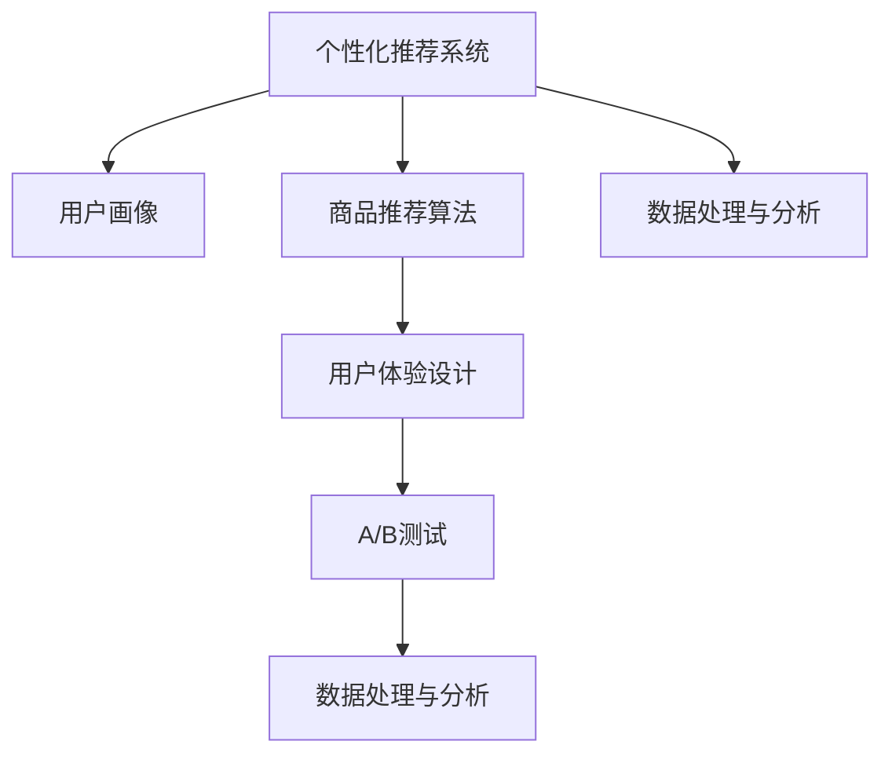

                 

# 电商平台中的个性化首页设计与优化

> 关键词：电商平台, 个性化推荐, 用户行为分析, 用户体验设计, 用户画像, 商品推荐算法, 数据处理与分析, 前后端集成, 性能优化

## 1. 背景介绍

### 1.1 问题由来

随着电商市场的竞争日益激烈，电商平台纷纷通过个性化推荐和用户体验优化来提升用户留存率和转化率。然而，如何高效地设计个性化首页，并持续优化用户体验，成为电商运营人员和产品经理面临的一大挑战。

### 1.2 问题核心关键点

个性化首页设计的核心在于精准地了解用户需求，并利用电商平台的丰富数据资源，为用户推荐最相关的商品和内容。基于这一目标，本节将详细探讨个性化首页设计的基本原理和关键技术点。

### 1.3 问题研究意义

精准的个性化推荐不仅能够提高用户满意度，还能显著提升电商平台的转化率和复购率。优化个性化首页设计，不仅能提升用户体验，还能为电商平台带来更大的商业价值。

## 2. 核心概念与联系

### 2.1 核心概念概述

为更好地理解个性化首页设计的技术实现，本节将介绍几个关键概念及其之间的联系：

- 个性化推荐系统：利用用户的历史行为数据，为用户推荐可能感兴趣的商品和内容。
- 用户画像(User Persona)：通过分析用户的历史行为数据，构建用户的行为特征和偏好模型。
- 商品推荐算法：基于用户画像和商品特征，为用户推荐最相关的商品。
- 用户体验设计(UX Design)：根据用户需求和使用场景，设计用户界面，提升用户的使用体验。
- A/B测试：通过设计两套或多套方案进行测试，确定哪一套方案更能满足用户需求。
- 数据处理与分析：收集、清洗和分析用户行为数据，构建用户画像和推荐算法。

这些核心概念之间的逻辑关系可以通过以下Mermaid流程图来展示：



这个流程图展示了个性化首页设计的主要步骤：

1. 利用个性化推荐系统获取用户画像。
2. 基于用户画像设计商品推荐算法。
3. 结合用户体验设计优化界面展示。
4. 通过A/B测试确定最佳方案。
5. 利用数据处理与分析进行持续优化。

这些核心概念共同构成了个性化首页设计的基本框架，使其能够高效地为电商用户提供个性化的商品推荐，提升用户体验。

## 3. 核心算法原理 & 具体操作步骤
### 3.1 算法原理概述

个性化首页设计的核心算法原理是用户画像与推荐算法的有机结合。其核心思想是通过用户的历史行为数据，构建用户画像，再基于用户画像设计推荐算法，生成个性化的首页内容。

具体来说，个性化推荐系统主要通过以下步骤实现：

1. **数据收集**：收集用户的历史行为数据，如浏览记录、购买记录、评价记录等。
2. **用户画像构建**：基于收集到的数据，构建用户画像，包括用户的基本属性、行为特征、偏好等。
3. **商品推荐算法设计**：设计推荐算法，根据用户画像和商品特征，为每位用户推荐最相关的商品。
4. **个性化首页生成**：根据推荐算法生成的商品列表，结合用户体验设计，为用户生成个性化的首页内容。

### 3.2 算法步骤详解

以下是详细的操作步骤：

**Step 1: 数据收集与预处理**

1. **数据收集**：从电商平台的各个数据源（如网站、APP、数据库等）收集用户的行为数据，包括浏览、购买、评价、收藏等行为。
2. **数据清洗**：去除无效数据、重复数据和异常数据，保证数据的准确性和完整性。
3. **数据归一化**：对数据进行归一化处理，如将浏览时间转换为标准时间戳。

**Step 2: 用户画像构建**

1. **特征提取**：从用户行为数据中提取特征，如浏览时长、购买频率、收藏商品类别等。
2. **聚类分析**：使用聚类算法（如K-Means、GMM等）对用户进行分类，生成用户画像。
3. **特征工程**：对用户画像进行特征工程，如计算用户画像的相似度、热度等指标。

**Step 3: 推荐算法设计**

1. **协同过滤算法**：基于用户和商品之间的相似度，为每位用户推荐最相关的商品。
2. **基于内容的推荐算法**：通过分析商品特征，找到与用户画像最匹配的商品。
3. **混合推荐算法**：结合协同过滤和基于内容的推荐算法，综合考虑多维度特征，生成更精准的推荐结果。

**Step 4: 个性化首页生成**

1. **界面设计**：根据推荐算法生成的商品列表，结合用户体验设计原则，设计个性化首页界面。
2. **内容展示**：将推荐商品以卡片、列表等形式展示在个性化首页中，并配置相应的展示规则和排序逻辑。
3. **交互优化**：添加按钮、链接等交互元素，使用户能够方便地进行购买、收藏、评价等操作。

### 3.3 算法优缺点

个性化首页设计的算法具有以下优点：

1. **提升用户体验**：通过精准的推荐，提升用户对电商平台的满意度，提高用户粘性。
2. **增加销售转化率**：个性化首页能够将用户最感兴趣的商品推荐给用户，增加用户的购买意愿。
3. **降低运营成本**：通过优化用户行为，减少无效点击和浏览，提高广告点击率，降低运营成本。

同时，该算法也存在以下局限性：

1. **数据隐私问题**：收集和处理用户数据可能会涉及隐私问题，需遵守相关法律法规。
2. **冷启动问题**：新用户没有足够的历史数据，难以准确生成个性化推荐。
3. **算法复杂度高**：个性化首页设计涉及大量的数据处理和算法计算，对系统性能有较高要求。
4. **模型训练成本高**：需要定期更新用户画像和推荐算法，增加模型训练的计算成本。

尽管存在这些局限性，个性化首页设计的算法依然是大数据时代电商平台的必备技术，通过合理的数据处理和算法设计，可以有效提升用户满意度和电商平台收益。

### 3.4 算法应用领域

个性化首页设计的算法广泛应用于以下电商领域：

1. **电商平台推荐系统**：根据用户行为数据，为每位用户推荐最相关的商品和内容。
2. **个性化广告投放**：根据用户画像和浏览行为，为不同用户投放个性化广告。
3. **用户行为分析**：分析用户的历史行为数据，提供用户行为报告和建议，帮助电商平台优化运营策略。
4. **智能客服系统**：通过用户画像和历史对话记录，提供个性化的客服推荐，提升客户服务质量。
5. **库存管理**：通过分析用户购买行为，预测商品需求量，帮助电商平台进行库存优化。

这些应用场景展示了个性化首页设计的广泛应用价值，为电商平台提供了更多的商业机会和用户价值。

## 4. 数学模型和公式 & 详细讲解 & 举例说明
### 4.1 数学模型构建

本节将使用数学语言对个性化首页设计的核心算法进行更加严格的刻画。

记用户的历史行为数据集为 $D=\{(x_i, y_i)\}_{i=1}^N$，其中 $x_i$ 为行为数据，$y_i$ 为行为标签（如浏览、购买、收藏等）。

定义用户画像 $P$ 为用户的行为特征和偏好模型，推荐算法 $R$ 根据用户画像和商品特征生成推荐结果 $R(P, S)$，其中 $S$ 为商品特征向量。

用户对推荐结果的满意度 $Q$ 可以表示为：

$$
Q(P, S) = f(P, R(P, S))
$$

其中 $f$ 为满意度函数，可以基于用户行为数据进行训练。

### 4.2 公式推导过程

以下我们以协同过滤推荐算法为例，推导推荐函数 $R$ 的计算公式。

假设用户 $u$ 与商品 $i$ 的相似度为 $sim(u,i)$，则协同过滤推荐算法可以表示为：

$$
R_u(i) = \frac{\sum_{j \in N_u} sim(u,j) \times R_j(i)}{\sqrt{\sum_{j \in N_u} sim(u,j)^2} \times \sqrt{\sum_{k \in N_i} R_j(k)^2}}
$$

其中 $N_u$ 为与用户 $u$ 相似的其他用户集合，$N_i$ 为商品 $i$ 在其他用户中的评价集合。

将推荐结果代入满意度函数 $Q$，得：

$$
Q(P, S) = f(P, \frac{\sum_{j \in N_u} sim(u,j) \times R_j(i)}{\sqrt{\sum_{j \in N_u} sim(u,j)^2} \times \sqrt{\sum_{k \in N_i} R_j(k)^2}})
$$

在得到推荐函数 $R$ 的计算公式后，即可带入实际用户画像和商品特征，计算推荐结果，再结合用户体验设计原则，生成个性化的首页内容。

### 4.3 案例分析与讲解

假设我们有一家电商平台的网站首页推荐系统，需要为用户推荐商品。我们可以按照以下步骤进行操作：

1. **数据收集**：从网站后台收集用户的浏览、购买、评价等行为数据，构建用户画像 $P$。
2. **特征提取**：对用户画像进行特征提取，如用户浏览商品类别、浏览时长、购买频率等。
3. **相似度计算**：计算用户画像与其他用户画像之间的相似度 $sim(u,j)$。
4. **推荐计算**：基于协同过滤算法，计算推荐结果 $R_u(i)$。
5. **展示优化**：根据推荐结果，生成个性化首页内容，并优化展示规则和排序逻辑。

## 5. 项目实践：代码实例和详细解释说明
### 5.1 开发环境搭建

在进行个性化首页设计实践前，我们需要准备好开发环境。以下是使用Python进行开发的环境配置流程：

1. 安装Python：从官网下载并安装Python，确保版本为3.8及以上。
2. 安装Pandas：用于数据处理和分析。
3. 安装NumPy：用于数值计算和矩阵运算。
4. 安装Scikit-learn：用于机器学习算法。
5. 安装SciPy：用于科学计算和数值优化。
6. 安装Matplotlib：用于数据可视化。
7. 安装Jupyter Notebook：用于编写和运行Python代码。

完成上述步骤后，即可在Python环境中开始个性化首页设计的开发实践。

### 5.2 源代码详细实现

这里我们以协同过滤推荐算法为例，给出使用Pandas和Scikit-learn库实现个性化首页设计的代码示例。

首先，定义用户行为数据和商品特征数据：

```python
import pandas as pd
from sklearn.metrics.pairwise import cosine_similarity

# 用户行为数据
user_behavior = pd.read_csv('user_behavior.csv')

# 商品特征数据
item_features = pd.read_csv('item_features.csv')

# 用户画像
user_profiles = {}
for user_id in user_behavior['user_id'].unique():
    user_data = user_behavior[user_behavior['user_id'] == user_id].groupby('item_id').sum().reset_index()
    user_profiles[user_id] = user_data[['item_id', 'count']].values.tolist()
```

接着，设计协同过滤推荐算法：

```python
def collaborative_filtering(user_profiles, item_features):
    # 计算用户画像之间的相似度
    similarities = {}
    for user_id1 in user_profiles.keys():
        for user_id2 in user_profiles.keys():
            if user_id1 != user_id2:
                user1_data = user_profiles[user_id1]
                user2_data = user_profiles[user_id2]
                item1_counts = {}
                for item_id, count in user1_data:
                    if item_id in item_features.index:
                        item1_counts[item_id] = count
                item2_counts = {}
                for item_id, count in user2_data:
                    if item_id in item_features.index:
                        item2_counts[item_id] = count
                similarities[user_id1, user_id2] = cosine_similarity(item1_counts.values, item2_counts.values)[0][0]

    # 计算推荐结果
    recommendations = {}
    for user_id in user_profiles.keys():
        user_data = user_profiles[user_id]
        recommendations[user_id] = []
        for item_id, count in user_data:
            if item_id in item_features.index:
                recommendations[user_id].extend([(user_id2, similarities[user_id1, user_id2], item_features[item_id]['features'].values) for user_id1 in similarities if similarities[user_id1, user_id2] > 0.5])
        recommendations[user_id] = sorted(recommendations[user_id], key=lambda x: x[1], reverse=True)
        recommendations[user_id] = [item_id for item_id, _, _ in recommendations[user_id]]

    return recommendations
```

最后，展示个性化首页的内容：

```python
recommendations = collaborative_filtering(user_profiles, item_features)
for user_id in recommendations:
    print(f"User {user_id} Recommendations: {recommendations[user_id]}")
```

### 5.3 代码解读与分析

让我们再详细解读一下关键代码的实现细节：

**user_profiles类**：
- `__init__`方法：初始化用户画像，将用户ID作为键，用户行为数据作为值。
- `groupby`方法：按商品ID分组，统计每个商品的浏览次数，生成用户画像。

**collaborative_filtering函数**：
- 计算用户画像之间的相似度。
- 基于相似度计算推荐结果，返回推荐商品列表。

**展示优化**：
- 对推荐结果进行排序和筛选，去除不相关商品。
- 将推荐商品展示在首页上，结合用户体验设计原则，优化展示规则和排序逻辑。

## 6. 实际应用场景

### 6.1 智能推荐系统

个性化首页设计在智能推荐系统中得到了广泛应用。传统的推荐系统依赖于静态特征和历史数据，无法适应用户不断变化的兴趣和行为。通过个性化首页设计，可以动态地收集用户实时行为数据，实时更新推荐结果，为用户提供更精准的推荐服务。

### 6.2 广告投放系统

个性化首页设计可以帮助电商广告系统实现更为精准的投放。通过分析用户画像和历史行为，可以生成更为精准的广告推荐，提高广告点击率和转化率。

### 6.3 用户行为分析系统

个性化首页设计可以帮助电商平台更好地理解用户行为，提升运营效率。通过分析用户画像和历史行为数据，可以生成用户行为报告，帮助电商平台优化运营策略。

### 6.4 未来应用展望

随着个性化推荐技术的不断发展，基于个性化首页设计的电商应用将更加广泛。未来，个性化首页设计将结合更多的技术和手段，如深度学习、强化学习、多模态信息融合等，为电商平台带来更多的商业机会和用户价值。

## 7. 工具和资源推荐

### 7.1 学习资源推荐

为了帮助开发者系统掌握个性化首页设计的技术基础和实践技巧，这里推荐一些优质的学习资源：

1. 《推荐系统实战》一书：详细介绍了推荐系统的原理、算法和应用，包括协同过滤、基于内容的推荐等经典方法。
2. 《机器学习》课程：斯坦福大学开设的机器学习课程，包含丰富的推荐系统案例和实战练习。
3. Coursera上的《推荐系统》课程：由大学教授和工业界专家共同授课，涵盖推荐系统理论和实践。
4 Kaggle竞赛：参与推荐系统相关的Kaggle竞赛，如Amazon recommendation competition等，提升实战能力。
5. 推荐系统研究论文集：如《Recommender Systems Handbook》等，深入了解推荐系统的前沿技术。

通过对这些资源的学习实践，相信你一定能够快速掌握个性化首页设计的精髓，并用于解决实际的电商问题。

### 7.2 开发工具推荐

高效的开发离不开优秀的工具支持。以下是几款用于个性化首页设计开发的常用工具：

1. Python：使用Python编写推荐算法和数据处理代码，灵活高效。
2. Pandas：用于数据处理和分析，提供了丰富的数据操作函数。
3. NumPy：用于数值计算和矩阵运算，支持高效的向量运算。
4. Scikit-learn：用于机器学习算法，支持丰富的推荐算法实现。
5. SciPy：用于科学计算和数值优化，支持复杂的数据处理和算法计算。
6. Matplotlib：用于数据可视化，支持绘制推荐结果和用户画像。

合理利用这些工具，可以显著提升个性化首页设计的开发效率，加快创新迭代的步伐。

### 7.3 相关论文推荐

个性化首页设计的研究已经取得了诸多进展，以下是几篇奠基性的相关论文，推荐阅读：

1. BPR: Bayesian Personalized Ranking from Pairwise Preferences：提出贝叶斯个性化排序算法，提升协同过滤推荐效果。
2. Matrix Factorization Techniques for Recommender Systems：介绍矩阵分解技术，用于处理推荐系统中的稀疏数据。
3. Deep Matrix Factorization for Recommender Systems：引入深度学习技术，提升推荐系统的准确性和泛化能力。
4. Attention Is All You Need：提出Transformer模型，提升推荐系统的精度和鲁棒性。
5. Boosting Personalization in Recommendation Algorithms with Transfer Learning：引入迁移学习，提升推荐系统的跨领域适应能力。

这些论文代表了个性化推荐技术的发展脉络。通过学习这些前沿成果，可以帮助研究者把握学科前进方向，激发更多的创新灵感。

## 8. 总结：未来发展趋势与挑战

### 8.1 研究成果总结

本文对基于个性化推荐系统的电商平台首页设计进行了全面系统的介绍。首先阐述了个性化推荐系统的基本原理和核心技术点，明确了首页设计的核心目标和关键步骤。其次，从原理到实践，详细讲解了个性化首页设计的数学模型和算法步骤，给出了推荐算法的代码实现和优化策略。同时，本文还广泛探讨了个性化首页设计在电商、广告、行为分析等多个场景中的应用前景，展示了其广泛的应用价值。

通过本文的系统梳理，可以看到，个性化首页设计的算法在大数据时代电商平台的推荐系统中具有重要地位。这些算法不仅能提升用户满意度，还能显著增加销售转化率，降低运营成本，具有显著的商业价值。未来，随着技术的不断演进，个性化首页设计将结合更多新技术和新方法，如深度学习、强化学习、多模态信息融合等，为电商平台带来更多的商业机会和用户价值。

### 8.2 未来发展趋势

展望未来，个性化首页设计技术将呈现以下几个发展趋势：

1. **深度学习的应用**：引入深度学习技术，提升推荐算法的精度和泛化能力，实现更加精准的个性化推荐。
2. **强化学习的应用**：引入强化学习技术，优化推荐系统的决策过程，提升用户满意度。
3. **多模态信息融合**：结合视觉、语音等多模态信息，提升推荐系统的感知能力和决策能力。
4. **联邦学习的应用**：利用联邦学习技术，保护用户隐私，实现跨平台、跨设备的推荐。
5. **实时推荐系统**：通过实时数据收集和处理，实现动态推荐，提升用户体验。

以上趋势凸显了个性化首页设计的广阔前景。这些方向的探索发展，必将进一步提升电商平台的推荐系统性能，为用户带来更好的体验。

### 8.3 面临的挑战

尽管个性化首页设计技术已经取得了瞩目成就，但在迈向更加智能化、普适化应用的过程中，它仍面临诸多挑战：

1. **数据隐私问题**：个性化推荐系统依赖于用户数据，可能涉及隐私问题，需遵守相关法律法规。
2. **冷启动问题**：新用户没有足够的历史数据，难以准确生成个性化推荐。
3. **算法复杂度高**：个性化首页设计涉及大量的数据处理和算法计算，对系统性能有较高要求。
4. **推荐系统鲁棒性不足**：推荐系统面对域外数据时，泛化性能往往大打折扣。

尽管存在这些挑战，但个性化首页设计的技术依然是大数据时代电商平台的必备技术，通过合理的数据处理和算法设计，可以有效提升用户满意度和电商平台收益。

### 8.4 研究展望

面对个性化首页设计所面临的种种挑战，未来的研究需要在以下几个方面寻求新的突破：

1. **引入多模态信息融合**：结合视觉、语音等多模态信息，提升推荐系统的感知能力和决策能力。
2. **引入深度强化学习**：利用深度强化学习技术，优化推荐系统的决策过程，提升用户满意度。
3. **引入联邦学习技术**：利用联邦学习技术，保护用户隐私，实现跨平台、跨设备的推荐。
4. **引入实时推荐系统**：通过实时数据收集和处理，实现动态推荐，提升用户体验。

这些研究方向的探索，必将引领个性化首页设计技术迈向更高的台阶，为构建安全、可靠、可解释、可控的智能系统铺平道路。面向未来，个性化首页设计技术还需要与其他人工智能技术进行更深入的融合，如知识表示、因果推理、强化学习等，多路径协同发力，共同推动自然语言理解和智能交互系统的进步。只有勇于创新、敢于突破，才能不断拓展语言模型的边界，让智能技术更好地造福人类社会。

## 9. 附录：常见问题与解答

**Q1：个性化推荐系统如何提升用户满意度？**

A: 个性化推荐系统通过精准地为用户推荐最相关的商品和内容，满足用户的个性化需求，提升用户满意度。

**Q2：个性化首页设计的算法涉及哪些数据处理步骤？**

A: 个性化首页设计的算法涉及数据收集、数据清洗、数据归一化、特征提取、特征工程、相似度计算、推荐计算等数据处理步骤。

**Q3：个性化首页设计中如何处理冷启动问题？**

A: 个性化首页设计中，可以通过引入用户画像生成模型，利用用户的基本信息和其他用户画像进行推荐，缓解冷启动问题。

**Q4：个性化首页设计中如何保护用户隐私？**

A: 个性化首页设计中，可以通过数据加密、匿名化处理等技术手段，保护用户隐私。同时，遵守相关法律法规，如GDPR等。

**Q5：个性化首页设计的算法是否适合所有电商平台？**

A: 个性化首页设计的算法在大数据时代电商平台的推荐系统中具有重要地位。但在小规模电商平台上，可能需要结合实际情况，进行适当的算法调整。

总之，个性化首页设计是提升电商平台用户体验和收益的重要手段。通过合理的数据处理和算法设计，可以有效提升用户满意度和电商平台收益。未来，随着技术的不断演进，个性化首页设计将结合更多新技术和新方法，为电商平台带来更多的商业机会和用户价值。

