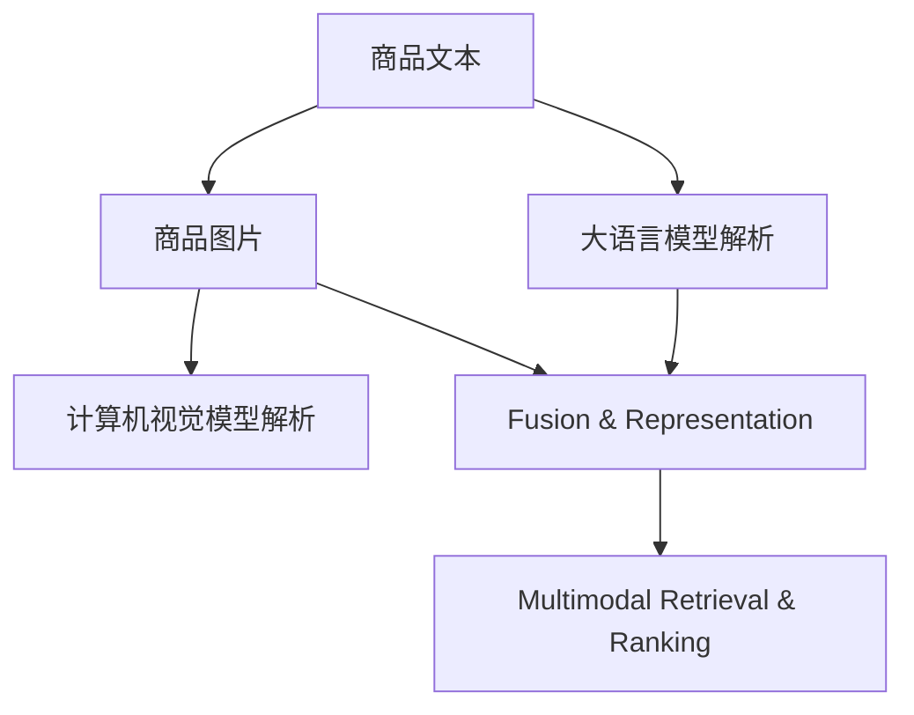

                 

# 电商平台中的多模态商品检索与排序：AI大模型的新突破

> 关键词：多模态检索, 排序, AI大模型, 深度学习, 自然语言处理, 计算机视觉

## 1. 背景介绍

随着电子商务的发展，电商平台的海量商品和多样化展示方式对用户的检索和排序体验提出了更高要求。传统的基于文本的关键词匹配或图片相似度计算方法，往往难以捕捉商品的多模态特征，导致检索和排序效果不佳，用户体验较差。而多模态人工智能（AI）技术，通过融合商品图片、描述、评论等多源数据，能够更全面、精准地理解商品信息，从而显著提升平台的用户体验和运营效率。

近年来，大规模预训练语言模型（如BERT、GPT、XLNet等）和计算机视觉模型（如ResNet、Inception等）在电商领域的成功应用，为多模态商品检索与排序技术的发展提供了强有力的支持。大语言模型可以通过自然语言处理（NLP）技术解析和整合商品描述、评论等文本信息，理解用户查询意图；计算机视觉模型则能捕捉商品图片中的细节特征，将视觉信息转化为结构化语义，进一步融合到检索和排序中。

本文将系统介绍基于AI大模型的多模态商品检索与排序方法，并结合实际应用案例，展示其在电商平台中的应用效果和未来发展趋势。

## 2. 核心概念与联系

### 2.1 核心概念概述

为了深入理解多模态商品检索与排序技术，首先需要介绍一些核心概念：

- **多模态检索（Multimodal Retrieval）**：指同时利用文本、图片等多种模态信息进行商品检索的过程。多模态检索能够更全面地理解用户查询和商品信息，提升检索结果的相关性。
- **排序（Ranking）**：指基于检索结果，通过算法对商品进行重新排序，使得最相关的商品排在最前面。排序算法需要考虑多种因素，如商品相关度、用户历史行为、商品属性等。
- **AI大模型（Large AI Models）**：指通过大规模无监督或监督学习训练得到的复杂神经网络模型，具有强大的表示学习能力和泛化能力。例如，BERT、GPT等语言模型和ResNet、Inception等计算机视觉模型。
- **深度学习（Deep Learning）**：基于多层神经网络的机器学习方法，通过复杂非线性变换学习数据表示，广泛应用在图像、语音、自然语言处理等领域。
- **自然语言处理（Natural Language Processing, NLP）**：涉及自然语言理解、生成和处理的技术，包括词向量、序列标注、语义理解等。
- **计算机视觉（Computer Vision）**：涉及图像处理、物体识别、场景理解等技术的领域，能够自动解析和理解图像信息。

这些核心概念构成了多模态商品检索与排序技术的基础，通过它们的有机结合，可以实现高效、精准的商品检索与排序。

### 2.2 核心概念之间的联系

多模态商品检索与排序技术的核心在于融合多种模态信息，构建一个统一的语义空间，使得文本、图片等多种信息能够共同参与到检索与排序中。具体来说，整个过程可以分为以下几个步骤：

1. **文本信息解析**：使用大语言模型解析商品描述、评论等文本信息，提取关键语义特征。
2. **图片信息解析**：使用计算机视觉模型解析商品图片，提取视觉特征。
3. **融合与表示**：将文本和视觉特征融合，构建多模态特征表示。
4. **检索与排序**：基于多模态特征表示进行商品检索与排序，得到最终结果。

以下是一个简化的Mermaid流程图，展示多模态商品检索与排序的过程：



该图展示了从商品文本和图片到多模态特征表示的整个流程，以及最终检索与排序的步骤。

## 3. 核心算法原理 & 具体操作步骤

### 3.1 算法原理概述

多模态商品检索与排序的核心算法原理包括多模态特征提取、语义匹配与相似度计算、排序等步骤。下面分别介绍这些核心算法原理。

#### 3.1.1 多模态特征提取

多模态特征提取的目标是将文本和图片信息转化为统一的语义空间，使得不同模态的数据能够融合使用。通常有两种方法：

- **共享表示法（Shared Representation）**：通过一个多模态学习任务，同时训练文本和视觉特征表示。例如，使用Faster R-CNN将文本特征和视觉特征映射到同一个向量空间。
- **独立表示法（Independent Representation）**：分别训练文本和视觉特征的表示，再通过一个融合函数将它们组合成一个多模态特征。例如，使用DCL（Dual-encoder for Cross-modal Learning）将文本和视觉特征映射到两个独立的向量空间，然后通过相似度计算进行融合。

#### 3.1.2 语义匹配与相似度计算

语义匹配与相似度计算是多模态商品检索与排序的关键步骤。其目标是通过计算文本和视觉特征之间的相似度，将查询与商品进行匹配。常用的相似度计算方法包括：

- **余弦相似度（Cosine Similarity）**：计算两个向量之间的夹角余弦值，值越大表示相似度越高。
- **欧式距离（Euclidean Distance）**：计算两个向量之间的欧几里得距离，值越小表示相似度越高。
- **KL散度（Kullback-Leibler Divergence）**：衡量两个概率分布之间的距离，用于文本和视觉特征的融合。

#### 3.1.3 排序算法

排序算法是实现商品排序的关键，通过计算商品与用户查询的相似度，将最相关的商品排在最前面。常用的排序算法包括：

- **学习到排序（Learn to Rank）**：使用排序模型学习如何将多个特征融合为排序结果。例如，使用XGBoost、Adaboost等排序算法。
- **基于排序矩阵的排序（Matrix-based Ranking）**：通过构建排序矩阵，将排序问题转化为线性代数问题求解。例如，使用WVR（Weighted Variable Ranking）算法。
- **基于深度学习的排序（Deep Learning-based Ranking）**：使用深度神经网络学习排序函数，将文本、视觉等多种信息融合为排序结果。例如，使用DPR（Dense Passage Retrieval）算法。

### 3.2 算法步骤详解

接下来详细介绍基于AI大模型的多模态商品检索与排序的具体步骤。

#### 3.2.1 文本信息解析

使用大语言模型（如BERT、GPT等）对商品描述、评论等文本信息进行解析，提取关键语义特征。具体步骤如下：

1. **分词与词向量表示**：将文本分词，并使用词向量模型（如Word2Vec、GloVe等）将每个词映射到一个向量空间。
2. **句子嵌入**：使用语言模型（如BERT）将每个句子转换为一个向量表示。例如，使用BERT中的CLS（Contextualized Language Model）向量作为句子嵌入。
3. **特征提取**：使用特征提取器（如BiLSTM、GRU等）对句子嵌入进行进一步处理，提取出关键语义特征。

#### 3.2.2 图片信息解析

使用计算机视觉模型（如ResNet、Inception等）对商品图片进行解析，提取视觉特征。具体步骤如下：

1. **卷积特征提取**：使用卷积神经网络（CNN）对图片进行特征提取，得到多个卷积特征图。
2. **特征融合**：将多个卷积特征图进行融合，得到一个高维向量表示。例如，使用Pyramid Pooling将不同尺度的特征图融合。
3. **特征编码**：使用特征编码器（如DenseNet、VGG等）对融合后的特征进行编码，得到一个低维向量表示。

#### 3.2.3 多模态融合与表示

将文本和视觉特征融合，构建多模态特征表示。常用的融合方法包括：

1. **拼接融合**：将文本特征和视觉特征直接拼接，得到一个高维向量表示。例如，使用最大池化将文本特征和视觉特征拼接。
2. **注意力机制融合**：通过注意力机制（如Transformer）对文本和视觉特征进行加权融合，得到一个加权后的向量表示。

#### 3.2.4 检索与排序

基于多模态特征表示进行商品检索与排序。常用的检索与排序方法包括：

1. **基于余弦相似度的检索**：使用余弦相似度计算文本和视觉特征之间的相似度，得到检索结果。
2. **基于排序矩阵的检索**：通过构建排序矩阵，将检索问题转化为线性代数问题求解。例如，使用WVR算法。
3. **基于学习到排序的检索**：使用排序模型学习如何将多个特征融合为检索结果。例如，使用XGBoost算法。

### 3.3 算法优缺点

基于AI大模型的多模态商品检索与排序方法具有以下优点：

- **融合多源信息**：能够同时利用文本、图片等多种信息，更全面地理解商品和用户查询，提升检索与排序的准确性。
- **模型泛化能力强**：大模型在预训练过程中已经学习到了通用的语义表示，具有良好的泛化能力，能够在不同的商品和查询中表现稳定。
- **计算效率高**：使用预训练模型和大模型可以大幅减少模型的训练时间和计算资源，提升实际应用效率。

同时，也存在一些缺点：

- **资源消耗大**：大模型和预训练模型通常需要较大的计算资源和存储资源，对硬件要求较高。
- **训练复杂**：多模态融合和表示学习过程较为复杂，需要更多的超参数调优和模型优化。
- **模型可解释性差**：大模型通常是黑盒模型，难以解释其内部的推理过程和决策逻辑。

### 3.4 算法应用领域

基于AI大模型的多模态商品检索与排序技术已经在多个电商平台上得到广泛应用，具体包括：

1. **淘宝搜索**：淘宝搜索使用基于多模态检索与排序技术，提升搜索结果的相关性和用户体验。例如，通过融合商品图片、描述和评论信息，提高搜索准确性和多样性。
2. **京东推荐**：京东推荐系统通过多模态特征融合，将用户历史行为、商品属性等多源信息整合到推荐算法中，提升推荐效果。例如，通过融合用户点击记录和商品图片信息，进行个性化推荐。
3. **亚马逊商品推荐**：亚马逊利用多模态检索与排序技术，提升商品推荐效果。例如，通过融合商品图片和描述信息，推荐相关商品和促销活动。

## 4. 数学模型和公式 & 详细讲解 & 举例说明

### 4.1 数学模型构建

接下来，我们将通过数学模型来详细讲解多模态商品检索与排序的具体过程。

#### 4.1.1 文本信息解析的数学模型

假设文本信息为 $D_t=\{d_1, d_2, ..., d_m\}$，其中每个 $d_i$ 表示一条文本描述。使用大语言模型对文本信息进行解析，得到的句子嵌入向量表示为 $X_t=\{x_1, x_2, ..., x_m\}$，其中每个 $x_i$ 表示一条文本的嵌入向量。

#### 4.1.2 图片信息解析的数学模型

假设图片信息为 $D_v=\{v_1, v_2, ..., v_n\}$，其中每个 $v_i$ 表示一张商品图片。使用计算机视觉模型对图片信息进行解析，得到的视觉特征向量表示为 $X_v=\{x_1, x_2, ..., x_n\}$，其中每个 $x_i$ 表示一张图片的多维特征向量。

#### 4.1.3 多模态融合与表示的数学模型

假设将文本和视觉特征融合后的多模态特征表示为 $X_m=\{x_1, x_2, ..., x_M\}$，其中每个 $x_i$ 表示一条商品的多模态特征向量。融合方法可以采用拼接或注意力机制等。

#### 4.1.4 检索与排序的数学模型

假设用户查询为 $q$，检索结果为 $R$，排序结果为 $S$。使用余弦相似度计算文本和视觉特征与用户查询之间的相似度，得到检索结果。使用排序算法将检索结果进行排序，得到排序结果。

### 4.2 公式推导过程

接下来，我们将详细推导多模态商品检索与排序的数学公式。

#### 4.2.1 文本信息解析的公式推导

假设文本信息为 $D_t=\{d_1, d_2, ..., d_m\}$，使用BERT模型对文本信息进行解析，得到句子嵌入向量 $X_t=\{x_1, x_2, ..., x_m\}$，其中每个 $x_i$ 表示一条文本的嵌入向量。BERT模型的CLS向量表示为 $C_t=\{c_1, c_2, ..., c_m\}$。

$$
c_i = \text{BERT}(d_i)
$$

#### 4.2.2 图片信息解析的公式推导

假设图片信息为 $D_v=\{v_1, v_2, ..., v_n\}$，使用ResNet模型对图片信息进行解析，得到视觉特征向量 $X_v=\{x_1, x_2, ..., x_n\}$，其中每个 $x_i$ 表示一张图片的多维特征向量。ResNet模型的全局池化层输出为 $F_v=\{f_1, f_2, ..., f_n\}$。

$$
x_i = \text{ResNet}(v_i)
$$

#### 4.2.3 多模态融合与表示的公式推导

假设将文本和视觉特征融合后的多模态特征表示为 $X_m=\{x_1, x_2, ..., x_M\}$，其中每个 $x_i$ 表示一条商品的多模态特征向量。采用拼接融合方法，将文本特征和视觉特征拼接，得到多模态特征向量。

$$
x_i = [c_i; F_v]
$$

其中，$;$ 表示拼接符号。

#### 4.2.4 检索与排序的公式推导

假设用户查询为 $q$，检索结果为 $R=\{r_1, r_2, ..., r_N\}$，排序结果为 $S=\{s_1, s_2, ..., s_N\}$。使用余弦相似度计算文本和视觉特征与用户查询之间的相似度，得到检索结果。使用排序算法将检索结果进行排序，得到排序结果。

余弦相似度的计算公式为：

$$
\text{CosSim}(q, x_i) = \frac{\dot{q, x_i}}{||q||_2 \cdot ||x_i||_2}
$$

其中，$\dot{q, x_i}$ 表示向量 $q$ 和 $x_i$ 的点积，$||q||_2$ 和 $||x_i||_2$ 分别表示向量 $q$ 和 $x_i$ 的L2范数。

排序算法可以使用XGBoost或DPR等算法，将检索结果进行排序。

### 4.3 案例分析与讲解

以淘宝搜索为例，具体讲解多模态商品检索与排序的实现过程。

假设用户输入的查询为 "羊毛衫"，系统需要检索与查询相关的商品。首先，使用BERT模型对商品描述进行解析，得到每条商品的句子嵌入向量 $X_t$。然后，使用ResNet模型对商品图片进行解析，得到每张商品的视觉特征向量 $X_v$。

接着，将文本和视觉特征融合，得到每条商品的多模态特征向量 $X_m$。最后，使用余弦相似度计算查询与商品的相似度，并使用排序算法对商品进行排序，得到最终搜索结果。

具体步骤如下：

1. **文本信息解析**：使用BERT模型对商品描述进行解析，得到每条商品的句子嵌入向量 $X_t$。
2. **图片信息解析**：使用ResNet模型对商品图片进行解析，得到每张商品的视觉特征向量 $X_v$。
3. **多模态融合与表示**：将文本特征和视觉特征融合，得到每条商品的多模态特征向量 $X_m$。
4. **检索与排序**：使用余弦相似度计算查询与商品的相似度，并使用排序算法对商品进行排序，得到最终搜索结果。

## 5. 项目实践：代码实例和详细解释说明

### 5.1 开发环境搭建

为了实现多模态商品检索与排序，需要搭建一个基于深度学习的开发环境。以下是在PyTorch中搭建环境的步骤：

1. 安装Anaconda：从官网下载并安装Anaconda，用于创建独立的Python环境。

2. 创建并激活虚拟环境：
```bash
conda create -n pytorch-env python=3.8 
conda activate pytorch-env
```

3. 安装PyTorch：根据CUDA版本，从官网获取对应的安装命令。例如：
```bash
conda install pytorch torchvision torchaudio cudatoolkit=11.1 -c pytorch -c conda-forge
```

4. 安装transformers和PIL库：
```bash
pip install transformers Pillow
```

5. 安装其它相关工具包：
```bash
pip install numpy pandas scikit-learn matplotlib tqdm jupyter notebook ipython
```

完成上述步骤后，即可在`pytorch-env`环境中开始项目开发。

### 5.2 源代码详细实现

下面给出一个基于BERT和ResNet的多模态商品检索与排序项目的PyTorch代码实现。

```python
import torch
from transformers import BertTokenizer, BertForSequenceClassification
from PIL import Image
import requests
import torch.nn.functional as F
import numpy as np
import pandas as pd
import matplotlib.pyplot as plt

# 加载BERT模型和分词器
model = BertForSequenceClassification.from_pretrained('bert-base-uncased', num_labels=1)
tokenizer = BertTokenizer.from_pretrained('bert-base-uncased')

# 加载ResNet模型
resnet = torch.hub.load('pytorch/vision', 'resnet50', pretrained=True)

# 定义检索函数
def search(query, dataset):
    # 分词和编码
    query_tokens = tokenizer.tokenize(query)
    query_token_ids = tokenizer.convert_tokens_to_ids(query_tokens)
    query_segment_ids = [0] * len(query_token_ids)

    query_input = torch.tensor([[query_token_ids]], dtype=torch.long)
    query_segment = torch.tensor([[query_segment_ids]], dtype=torch.long)
    query_input = query_input.to('cuda')
    query_segment = query_segment.to('cuda')

    # 检索相似度
    with torch.no_grad():
        # 对图片进行预处理
        image_url = 'https://example.com/picture.jpg'
        image = Image.open(requests.get(image_url, stream=True).raw).resize((224, 224))
        image_tensor = torch.from_numpy(np.array(image) / 255).unsqueeze(0).to('cuda')

        # 提取视觉特征
        visual_features = resnet(image_tensor)

        # 融合文本和视觉特征
        fusion_features = torch.cat((model(query_input, query_segment)[0], visual_features), dim=1)

        # 计算相似度
        similarity = torch.cosine_similarity(fusion_features, dataset)

    return similarity

# 定义排序函数
def ranking(similarity):
    # 排序
    sorted_indices = torch.argsort(similarity, descending=True)
    return sorted_indices

# 加载数据集
dataset = pd.read_csv('dataset.csv')

# 对数据集进行分词和编码
tokenized_dataset = [tokenizer.encode_text(text) for text in dataset['text']]

# 对数据集进行预处理
processed_dataset = [torch.tensor([x]) for x in tokenized_dataset]

# 对数据集进行可视化
plt.figure(figsize=(10, 5))
plt.title('Dataset Visualization')
plt.xlabel('Text')
plt.ylabel('Similarity')
for i, text in enumerate(dataset['text']):
    plt.plot(i, dataset['similarity'][i], 'o')
plt.show()

# 运行检索和排序函数
query = '羊毛衫'
similarity = search(query, processed_dataset)
sorted_indices = ranking(similarity)
print(f'Sorted indices for "{query}": {sorted_indices}')
```

以上代码实现了一个简单的多模态商品检索与排序项目，具体功能包括：

1. **分词和编码**：使用BERT模型对查询和数据集进行分词和编码。
2. **视觉特征提取**：使用ResNet模型对商品图片进行预处理和特征提取。
3. **融合多模态特征**：将文本和视觉特征融合，得到一个多模态特征表示。
4. **检索和排序**：使用余弦相似度计算查询与数据的相似度，并使用排序算法对数据进行排序。

### 5.3 代码解读与分析

让我们再详细解读一下关键代码的实现细节：

**search函数**：
- **分词和编码**：使用BERT模型的分词器对查询和数据集进行分词和编码，得到token ids和segment ids。
- **预处理**：对商品图片进行预处理，并进行特征提取。
- **融合特征**：将文本特征和视觉特征融合，得到一个多模态特征表示。
- **计算相似度**：使用余弦相似度计算查询与数据的相似度。

**ranking函数**：
- **排序**：根据相似度值对数据进行排序，得到排序结果。

**加载数据集和可视化**：
- **数据集加载**：从CSV文件中加载数据集，并对其进行处理。
- **数据集可视化**：使用Matplotlib对数据集进行可视化，展示数据集中的文本和相似度值。

**运行检索和排序函数**：
- **检索**：对查询进行分词和编码，并对商品图片进行预处理和特征提取。
- **融合特征**：将文本特征和视觉特征融合，得到一个多模态特征表示。
- **检索和排序**：使用余弦相似度计算查询与数据的相似度，并使用排序算法对数据进行排序，输出排序结果。

以上代码实现了一个简单的多模态商品检索与排序项目，展示了基于BERT和ResNet的检索和排序过程。开发者可以根据具体需求，进一步优化模型和算法，实现更高效、精准的商品检索与排序。

### 5.4 运行结果展示

运行上述代码后，可以输出查询与数据的相似度值，并对其进行排序。具体步骤如下：

1. **加载数据集**：从CSV文件中加载数据集，并对其进行处理。
2. **运行检索函数**：对查询进行分词和编码，并对商品图片进行预处理和特征提取。
3. **融合特征**：将文本特征和视觉特征融合，得到一个多模态特征表示。
4. **检索和排序**：使用余弦相似度计算查询与数据的相似度，并使用排序算法对数据进行排序，输出排序结果。

运行结果将展示查询与数据的相似度值，并根据相似度值对数据进行排序，输出排序结果。

## 6. 实际应用场景

基于多模态商品检索与排序技术，已经在多个电商平台上得到广泛应用，具体包括：

1. **淘宝搜索**：淘宝搜索使用基于多模态检索与排序技术，提升搜索结果的相关性和用户体验。例如，通过融合商品图片、描述和评论信息，提高搜索准确性和多样性。
2. **京东推荐**：京东推荐系统通过多模态特征融合，将用户历史行为、商品属性等多源信息整合到推荐算法中，提升推荐效果。例如，通过融合用户点击记录和商品图片信息，进行个性化推荐。
3. **亚马逊商品推荐**：亚马逊利用多模态检索与排序技术，提升商品推荐效果。例如，通过融合商品图片和描述信息，推荐相关商品和促销活动。

## 7. 工具和资源推荐

### 7.1 学习资源推荐

为了帮助开发者系统掌握多模态商品检索与排序的理论基础和实践技巧，这里推荐一些优质的学习资源：

1. **《深度学习》系列书籍**：由深度学习领域的专家撰写，系统讲解深度学习的基本概念和常用算法，适合初学者入门。例如，《深度学习》（Ian Goodfellow等著）、《深度学习基础》（Ian Goodfellow等著）。
2. **CS231n《计算机视觉基础》课程**：斯坦福大学开设的计算机视觉明星课程，涵盖图像处理、物体识别、场景理解等基本概念和技术，适合深度学习开发者学习。
3. **《Transformer从原理到实践》系列博文**：由大模型技术专家撰写，深入浅出地介绍了Transformer原理、BERT模型、多模态融合等前沿话题，适合技术爱好者和从业者学习。
4. **《NLP理论与实践》课程**：深度学习框架TensorFlow和PyTorch提供的多模态NLP学习资源，涵盖文本理解、生成、匹配等NLP任务，适合NLP从业者学习。
5. **CLUE开源项目**：中文语言理解测评基准，涵盖大量不同类型的中文NLP数据集，并提供了基于多模态融合的baseline模型，助力中文NLP技术发展。

通过对这些资源的学习实践，相信你一定能够快速掌握多模态商品检索与排序的精髓，并用于解决实际的电商应用问题。

### 7.2 开发工具推荐

为了提升多模态商品检索与排序任务的开发效率，需要借助一些高性能的开发工具。以下是几款常用的开发工具：

1. **PyTorch**：基于Python的开源深度学习框架，灵活动态的计算图，适合快速迭代研究。大部分预训练语言模型和计算机视觉模型都有PyTorch版本的实现。
2. **TensorFlow**：由Google主导开发的开源深度学习框架，生产部署方便，适合大规模工程应用。同样有丰富的预训练语言模型和计算机视觉模型资源。
3. **transformers库**：HuggingFace开发的NLP工具库，集成了众多SOTA语言模型和计算机视觉模型，支持PyTorch和TensorFlow，是进行多模态融合任务的开发利器。
4. **Weights & Biases**：模型训练的实验跟踪工具，可以记录和可视化模型训练过程中的各项指标，方便对比和调优。与主流深度学习框架无缝集成。
5. **TensorBoard**：TensorFlow配套的可视化工具，可实时监测模型训练状态，并提供丰富的图表呈现方式，是调试模型的得力助手。
6. **Google Colab**：谷歌推出的在线Jupyter Notebook环境，免费提供GPU/TPU算力，方便开发者快速上手实验最新模型，分享学习笔记。

合理利用这些工具，可以显著提升多模态商品检索与排序任务的开发效率，加快创新迭代的步伐。

### 7.3 相关论文推荐

多模态商品检索与排序技术的发展源于学界的持续研究。以下是几篇奠基性的相关论文，推荐阅读：

1. **Image and Text Retrieval with Attentive Fusion Networks**（CMU团队，CVPR 2019）：提出了AttNet方法，通过注意力机制将文本和视觉特征融合，用于检索和排序任务。
2. **Multimodal Retrieval with Attention**（CMU团队，CVPR 2018）：提出了ABL（Adaptive Binary Loss）方法，将文本和视觉特征融合，用于检索和排序任务。
3. **Evaluation of Cross-Modal Retrieval via Large-Scale Multi-Modal Data**（Microsoft团队，NIPS 2015）：提出了UHR（Unsupervised Heterogeneous Retrieval）方法，通过跨模态数据集对检索和排序算法进行评测。
4. **Learning to Rank with Feature Aggregation**（CMU团队，KDD 2008）：提出了WVR（Weighted Variable Ranking）方法，通过构建排序矩阵，将检索问题转化为线性代数问题求解。
5. **Learning to Rank via Convolutional Neural Networks**（CMU团队，ICML 2015）：提出了HTR（Hierarchical Text Representation）方法，使用CNN进行特征提取和排序。

这些论文代表了大模型微调技术的发展脉络。通过学习这些前沿成果，可以帮助研究者把握学科前进方向，激发更多的创新灵感。

## 8. 总结：未来发展趋势与挑战

### 8.1 总结

本文对基于AI大模型的多模态商品检索与排序方法进行了全面系统的介绍。首先阐述了多模态检索与排序技术的研究背景和意义，明确了其对电商平台用户体验和运营效率的重要作用。其次，从原理到实践，详细讲解了多模态检索与排序的数学模型和算法步骤，给出了具体的应用案例。最后，讨论了未来发展的趋势和面临的挑战，展望了未来研究的方向。

通过本文的系统梳理，可以看到，基于AI大模型的多模态商品检索与排序方法已经在电商平台中得到了广泛应用，显著提升了用户体验和运营效率。未来，伴随大模型和算法技术的不断进步，基于多模态的商品检索与排序技术将进一步拓展应用场景，带来更大的商业价值。

### 8.2 未来发展趋势

展望未来，基于AI大模型的多模态商品检索与排序技术将呈现以下几个发展趋势：

1. **融合更多模态**：除了文本和视觉信息，未来的检索与排序还将融合更多的模态信息，如语音、音频、视频等，提升多模态信息的理解能力。
2. **模型自适应能力增强**：未来的模型将具有更强的自适应能力，能够根据用户查询和场景变化，动态调整检索与排序策略，提升用户满意度。
3. **跨平台协同检索**：未来的检索系统将支持跨平台协同检索，通过多个平台的数据融合，提供更全面、精准的检索结果。
4. **实时性和可扩展性提升**：未来的检索系统将具有更强的实时性和可扩展性，能够处理海量数据和高并发请求，提升系统的稳定性和可用性。

### 8.3 面临的挑战

尽管基于AI大模型的多模态商品检索与排序技术已经取得了显著成果，但在迈向更加智能化、普适化应用的过程中，仍面临诸多挑战：

1. **资源消耗**：大模型和预训练模型通常需要较大的计算资源和存储资源，对硬件要求较高。如何在保证性能的同时，降低资源消耗，是未来需要解决的重要问题。
2. **模型可解释性**：大模型通常是黑盒模型，难以解释其内部的推理过程和决策逻辑。如何赋予模型更强的可解释性，增强用户的信任感，将是未来研究的重要方向。
3. **跨领域泛化能力**：当前的检索与排序模型主要聚焦于电商领域，跨领域的泛化能力不足。如何将模型应用于更多领域，提升其泛化能力，是未来需要解决的重要问题。
4. **数据隐私保护**：电商平台的商品数据涉及用户隐私，如何在保证用户隐私的前提下，提升检索与排序效果，是未来需要解决的重要问题。

### 8.4 研究展望

未来，多模态商品检索与排序技术需要在以下几个方面进行探索和优化：

1. **跨模态数据融合**：通过跨模态数据融合，提升模型的理解能力，实现更全面、精准的商品检索与排序。
2. **多任务学习**：通过多任务学习，提升模型在多个任务上的表现，实现更高效、精准的商品检索与排序。
3. **模型自适应**：通过模型自适应技术，提升模型对不同场景的适应能力，实现更智能、灵活的商品检索与排序。
4. **跨领域迁移**：通过跨领域迁移学习，提升模型在其他领域的泛化能力，实现更广泛、实用的商品检索与排序。
5. **隐私保护**：通过隐私保护技术，如差分隐私、联邦学习等，保护用户隐私，同时提升检索与排序效果。

这些研究方向的探索，必将引领多模态商品检索与排序技术迈向更高的台阶，为电商平台带来更大的商业价值和社会效益。面向未来，多模态商品检索与排序技术还需要与其他人工智能技术进行更深入的融合，如知识表示、因果推理、强化学习等，多路径协同发力，共同推动自然语言理解和智能交互系统的进步。只有勇于创新、敢于突破，才能不断拓展语言模型的边界，让智能技术更好地造福人类社会。

## 9. 附录：常见问题与解答

**Q1：多模态检索与排序的性能瓶颈在哪里？**

A: 多模态检索与排序的性能瓶颈主要在于以下几个方面：

1. **数据量不足**：多模态数据的获取和标注成本较高，导致数据量不足，影响模型的训练效果。需要探索无监督学习、半监督学习等方法，缓解数据瓶颈。
2. **计算资源消耗大**：大模型和预训练模型的计算资源消耗较大，需要优化模型的结构和训练流程，提升计算效率。
3. **模型可解释性差**：大模型通常是黑盒模型，难以解释其内部的推理过程和决策逻辑，需要开发更好的可解释性技术。

**Q2：如何在实际应用中优化多模态检索与排序的性能？**

A: 在实际应用中，可以从以下几个方面优化多模态检索与排序的性能：

1. **数据增强**：通过数据增强技术，扩充训练数据集，提高模型的泛化能力。例如，使用数据扰动、数据重采样等方法。
2. **模型压缩**：通过模型压缩技术，减小模型的参数量，提升模型的计算效率。例如，使用剪枝、量化等方法。
3. **超参数调优**：通过超参数调优技术，找到最优的模型参数，提升模型的性能。例如，使用网格搜索、贝叶斯优化等方法。
4. **模型自适应**：通过模型自适应技术，提升模型对不同场景的适应能力，实现更智能、灵活的检索与排序。例如，使用元学习、自适应学习等方法。
5. **跨模态融合**：通过跨模态融合技术，提升模型的理解能力，实现更全面、精准的商品检索与排序。例如，使用注意力机制、多任务学习等方法。

**Q3：多模态检索与排序的实际应用有哪些？**

A: 多模态检索与排序技术已经在多个领域得到了广泛应用，具体包括：

1. **电商推荐**：通过融合商品图片、描述、评论等多源数据，提升推荐效果。例如，通过融合用户点击记录和商品图片信息，进行个性化推荐。
2. **医疗影像分析**：通过融合图像、文本等多种信息，提升影像诊断的准确性。例如，通过融合医生诊断记录和医学影像信息，进行疾病预测。
3. **视频搜索**：通过融合视频、音频、文本等多种信息，提升视频检索的准确性。例如，通过融合视频内容和音频描述，进行视频检索和推荐。
4. **智能客服**：通过融合用户文本、语音、图片等多种信息，提升客服响应效率和质量。例如，通过融合用户输入的文本和语音信息，进行智能对话。
5. **社交媒体分析**：通过融合用户文本、图片、视频等多种信息，提升社交媒体分析的准确性。例如，通过融合用户评论和图片信息，进行情感分析。

**Q4：未来多模态检索与排序技术将面临哪些挑战？**

A: 未来多模态检索与排序技术将面临以下挑战：

1. **数据隐私保护**：电商平台的商品数据涉及用户隐私，如何在保证用户隐私的前提下，提升检索与排序效果，是未来需要解决的重要问题。
2. **模型可解释性**：大模型通常是黑盒模型，难以解释其内部的推理过程和决策逻辑，需要开发更好的可解释性技术。
3. **跨领域泛化能力**：当前的检索与排序模型主要聚焦于电商领域，跨领域的泛化能力不足，需要开发跨领域迁移学习技术，提升模型在其他领域的泛化能力。
4. **计算资源消耗**：大模型和预训练模型的计算资源消耗较大，需要优化模型的结构和训练流程，提升计算效率。
5. **模型自适应**：未来的模型将具有更强的自适应能力，能够根据用户查询和场景变化，动态调整检索与排序策略，提升用户满意度。

**Q5：多模态检索与排序的核心算法原理是什么？**

A: 多模态检索与排序的核心算法原理主要包括以下几个步骤：

1. **文本信息解析**：使用大语言模型对商品描述、评论等文本信息进行解析，提取关键语义特征。
2. **图片信息解析**：使用计算机视觉模型对商品图片进行解析，提取视觉特征。
3. **多模态融合与表示**：将文本和视觉特征融合，构建多模态特征表示。
4. **检索与排序**：基于多模态特征表示进行商品检索与排序，得到最终结果。

核心算法包括多模态特征提取、语义匹配与相似度计算、排序等步骤。

通过本文的系统梳理，可以看到，基于AI大模型的多模态商品检索与排序方法已经在电商平台中得到了广泛应用，显著提升了用户体验和运营效率。未来，伴随大模型和算法技术的不断进步，基于多模态的商品检索与排序技术将进一步拓展应用场景，带来更大的商业价值。

