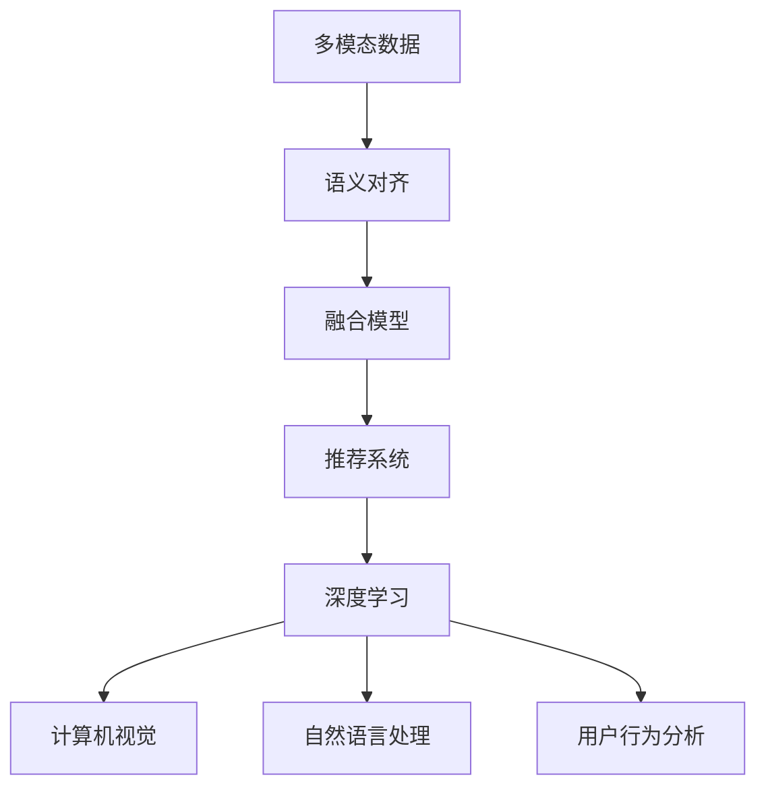

                 

# 电商平台中的多模态搜索技术实现

> 关键词：电商平台, 多模态搜索, 图像, 文本, 声音, 推荐系统, 深度学习, 计算机视觉, 自然语言处理, 用户行为分析

## 1. 背景介绍

### 1.1 问题由来
随着电商平台的快速发展，用户对于购物体验的需求也在不断提升。传统的基于关键词搜索的方式已经无法满足用户对商品信息的全面了解需求。为此，电商平台引入了多模态搜索技术，通过结合文本、图像、声音等多种模态的信息，帮助用户更直观、准确地找到所需的商品。多模态搜索技术不仅可以提升用户体验，还可以增加用户粘性，提高电商平台的销售额。

### 1.2 问题核心关键点
多模态搜索技术的核心在于如何将不同模态的信息融合起来，形成统一的语义表示，进而支持用户的自然语言查询。其主要面临以下几个关键问题：
1. **语义对齐**：如何将不同模态的信息映射到统一的语义空间。
2. **融合模型**：如何构建一个能够高效融合不同模态信息的模型。
3. **实时处理**：如何在大规模数据上实现实时高效的搜索处理。
4. **个性化推荐**：如何将搜索与推荐系统相结合，提高个性化推荐的精准度。

### 1.3 问题研究意义
多模态搜索技术的研究不仅有助于提升电商平台的搜索效率和用户体验，还能推动计算机视觉、自然语言处理等相关技术的发展。其研究意义主要体现在以下几个方面：
1. 提升电商平台的搜索准确性和用户体验，增加用户粘性，提高销售额。
2. 推动计算机视觉和自然语言处理技术的发展，为这些技术在更广泛领域的应用奠定基础。
3. 促进多模态数据融合技术的研究，推动人工智能技术的发展。

## 2. 核心概念与联系

### 2.1 核心概念概述

为更好地理解多模态搜索技术，本节将介绍几个密切相关的核心概念：

- **多模态数据**：指同时包含文本、图像、声音等多种类型数据的数据集。
- **语义对齐**：将不同模态的数据映射到统一的语义空间，便于信息融合。
- **融合模型**：一种能够高效融合多模态数据的深度学习模型。
- **推荐系统**：基于用户行为和商品特征，为用户推荐个性化商品的系统。
- **深度学习**：一种通过多层神经网络实现复杂映射的机器学习技术。
- **计算机视觉**：使用深度学习技术处理和分析图像数据的学科。
- **自然语言处理**：使用深度学习技术处理和分析文本数据的学科。
- **用户行为分析**：通过分析用户的历史行为数据，预测用户未来行为的技术。

这些核心概念之间的逻辑关系可以通过以下Mermaid流程图来展示：



这个流程图展示了许多相关概念及其之间的关系：

1. 多模态数据是基础，是融合和处理的原始素材。
2. 语义对齐是将多模态数据转换为统一语义空间的必要步骤。
3. 融合模型是实现信息融合的核心工具。
4. 推荐系统基于融合后的数据进行个性化推荐。
5. 深度学习是实现融合和推荐的基础技术。
6. 计算机视觉和自然语言处理是深度学习在特定领域的应用。
7. 用户行为分析利用深度学习对用户行为进行建模。

这些概念共同构成了多模态搜索技术的基础框架，为其研究和发展提供了方向和工具。

## 3. 核心算法原理 & 具体操作步骤
### 3.1 算法原理概述

多模态搜索技术基于深度学习技术，通过构建多模态融合模型，实现对不同模态信息的联合处理和语义对齐，从而支持用户的自然语言查询。其核心思想是：将不同模态的信息映射到统一的语义空间，构建一个能够高效融合这些信息的深度学习模型，以实现对用户查询的快速、准确的响应。

形式化地，假设多模态数据集为 $D=\{(x_i, y_i)\}_{i=1}^N$，其中 $x_i$ 表示不同模态的信息，$y_i$ 表示对应的查询结果。多模态融合模型的目标是找到最优的参数 $\theta$，使得模型能够准确地映射 $x_i$ 到 $y_i$，即：

$$
\hat{y}_i=f_\theta(x_i)
$$

其中 $f_\theta$ 表示融合模型，$\hat{y}_i$ 表示模型对 $x_i$ 的预测结果。

### 3.2 算法步骤详解

基于深度学习的多模态搜索技术，其核心算法步骤主要包括以下几个部分：

**Step 1: 数据预处理**
- 对不同模态的数据进行标准化和归一化处理。
- 将文本数据转化为向量表示，如使用BERT或TF-IDF等文本表示方法。
- 对图像数据进行预处理，如裁剪、缩放、归一化等。
- 对声音数据进行特征提取，如MFCC特征提取。

**Step 2: 语义对齐**
- 使用深度学习模型，如Siamese网络、Triplet网络等，对不同模态的数据进行语义对齐。
- 通过学习相似度和距离度量，将不同模态的数据映射到统一的语义空间。

**Step 3: 融合模型构建**
- 使用深度学习模型，如卷积神经网络（CNN）、循环神经网络（RNN）、Transformer等，构建多模态融合模型。
- 将不同模态的数据作为模型的输入，通过多层网络处理，生成最终的融合表示。
- 对融合后的表示进行线性映射，得到最终的输出结果。

**Step 4: 训练与评估**
- 在标注数据集上，使用交叉熵损失等损失函数训练融合模型。
- 在测试集上，评估模型的准确率和召回率等指标，优化模型参数。

**Step 5: 实时搜索与推荐**
- 在实时搜索场景中，将用户输入的查询转化为融合模型所需的格式，输入模型进行预测。
- 根据预测结果，从数据库中检索出匹配的商品。
- 结合用户历史行为数据，使用推荐系统为用户推荐相关商品。

### 3.3 算法优缺点

多模态搜索技术具有以下优点：
1. 提升搜索准确性：通过融合多种模态的信息，可以更全面、准确地理解用户查询。
2. 丰富搜索体验：支持自然语言查询，减少用户输入的负担。
3. 提高用户粘性：通过个性化推荐，提升用户体验和满意度。
4. 推动技术发展：促进计算机视觉和自然语言处理技术的发展。

但该技术也存在一定的局限性：
1. 计算资源消耗大：融合多种模态的信息需要大量的计算资源，可能会对服务器负载造成压力。
2. 训练数据需求高：需要大量的标注数据进行模型训练，获取高质量标注数据成本较高。
3. 模型复杂度高：多模态融合模型结构复杂，训练和推理时间较长。
4. 实时性要求高：需要实时处理用户查询，对系统性能和稳定性要求较高。

### 3.4 算法应用领域

多模态搜索技术主要应用于以下几个领域：

- **电商平台**：支持自然语言查询，提升搜索准确性和用户体验。
- **智能家居**：结合语音、图像信息，实现智能家居控制和推荐。
- **医疗健康**：结合影像和文本信息，辅助医生诊断和治疗。
- **智能客服**：结合文本和语音信息，提升客服系统的响应速度和准确性。

## 4. 数学模型和公式 & 详细讲解 & 举例说明

### 4.1 数学模型构建

本节将使用数学语言对多模态搜索技术的核心算法进行严格刻画。

假设多模态数据集为 $D=\{(x_i, y_i)\}_{i=1}^N$，其中 $x_i$ 表示不同模态的信息，$y_i$ 表示对应的查询结果。

定义多模态融合模型为 $f_\theta$，其中 $\theta$ 为模型参数。则融合模型的目标是最小化交叉熵损失，即：

$$
\mathcal{L}(\theta) = -\frac{1}{N}\sum_{i=1}^N \log p(y_i | x_i; \theta)
$$

其中 $p(y_i | x_i; \theta)$ 表示模型对 $x_i$ 的预测概率。

### 4.2 公式推导过程

以下我们以图像和文本的融合为例，推导多模态融合模型的计算公式。

假设图像数据 $x_i^{\text{img}} \in \mathbb{R}^d$，文本数据 $x_i^{\text{text}} \in \mathbb{R}^m$。则融合模型 $f_\theta$ 的输入为：

$$
x_i = (x_i^{\text{img}}, x_i^{\text{text}})
$$

我们采用深度学习模型，如卷积神经网络（CNN），对图像数据进行处理，得到特征表示 $x_i^{\text{img}}'$。然后将其与文本数据的向量表示 $x_i^{\text{text}}'$ 拼接，得到多模态表示 $x_i'$：

$$
x_i' = (x_i^{\text{img}}', x_i^{\text{text}}')
$$

接着，使用全连接层将多模态表示转化为融合表示 $z_i'$：

$$
z_i' = \text{FC}(x_i')
$$

其中 FC 表示全连接层。最后，使用softmax函数得到预测概率 $p(y_i | x_i'; \theta)$：

$$
p(y_i | x_i'; \theta) = \text{softmax}(\text{FC}(z_i'))
$$

上述公式展示了多模态融合模型的计算过程。通过图像和文本的联合处理，多模态融合模型可以学习到更为丰富的语义表示，从而提升搜索准确性。

### 4.3 案例分析与讲解

假设我们有一个电商平台，需要支持用户通过自然语言查询商品。用户输入的查询可以是：

- "找一款黑色的T恤"
- "查看这款手机的评价"
- "推荐一款适合夏天穿的鞋子"

我们分别对图像和文本进行语义对齐和融合，然后根据用户查询生成预测结果。

对于第一条查询，首先对商品图片进行预处理和特征提取，得到图像特征表示 $x_i^{\text{img}}'$。然后对用户查询进行文本表示，得到文本向量表示 $x_i^{\text{text}}'$。将图像特征表示和文本向量表示拼接，得到多模态表示 $x_i'$。接着，使用卷积神经网络对图像特征表示进行处理，得到融合表示 $z_i'$。最后，使用softmax函数得到预测结果，返回给用户。

对于第二条查询，我们直接对商品评价进行文本表示，得到文本向量表示 $x_i^{\text{text}}'$。然后将其与用户查询进行融合，得到融合表示 $z_i'$。最后，使用softmax函数得到预测结果，返回给用户。

对于第三条查询，我们结合用户的历史行为数据，使用推荐系统为用户推荐相关商品。通过融合商品的图片和描述信息，模型可以更全面地理解用户需求，提供更加个性化的推荐。

## 5. 项目实践：代码实例和详细解释说明
### 5.1 开发环境搭建

在进行多模态搜索技术实践前，我们需要准备好开发环境。以下是使用Python进行TensorFlow开发的环境配置流程：

1. 安装Anaconda：从官网下载并安装Anaconda，用于创建独立的Python环境。

2. 创建并激活虚拟环境：
```bash
conda create -n tf-env python=3.8 
conda activate tf-env
```

3. 安装TensorFlow：根据CUDA版本，从官网获取对应的安装命令。例如：
```bash
conda install tensorflow -c conda-forge
```

4. 安装TensorFlow Hub：用于加载预训练模型。
```bash
pip install tensorflow-hub
```

5. 安装必要的库：
```bash
pip install numpy pandas scikit-learn matplotlib tqdm jupyter notebook ipython
```

完成上述步骤后，即可在`tf-env`环境中开始多模态搜索技术的开发。

### 5.2 源代码详细实现

下面我们以电商平台中的多模态搜索技术为例，给出使用TensorFlow和TensorFlow Hub进行图像和文本融合的PyTorch代码实现。

首先，定义多模态融合模型的类：

```python
import tensorflow as tf
import tensorflow_hub as hub
from tensorflow.keras.layers import Input, Concatenate, Dense

class MultimodalFusionModel(tf.keras.Model):
    def __init__(self, img_size, text_size, num_classes):
        super(MultimodalFusionModel, self).__init__()
        
        # 图像处理层
        self.img_input = Input(shape=(img_size, img_size, 3))
        self.img_conv1 = tf.keras.layers.Conv2D(64, 3, activation='relu')(self.img_input)
        self.img_conv2 = tf.keras.layers.Conv2D(128, 3, activation='relu')(self.img_conv1)
        self.img_flatten = tf.keras.layers.Flatten()(self.img_conv2)
        
        # 文本处理层
        self.text_input = Input(shape=(text_size,))
        self.text_dense = Dense(128, activation='relu')(self.text_input)
        
        # 融合层
        self.fusion_layer = Concatenate()([self.img_flatten, self.text_dense])
        self.fc1 = Dense(256, activation='relu')(self.fusion_layer)
        self.fc2 = Dense(num_classes, activation='softmax')(self.fc1)
        
        # 输出层
        self.output = self.fc2
        
    def call(self, inputs):
        img_input, text_input = inputs
        img_output = self.img_conv2
        text_output = self.text_dense
        fusion_output = self.fc2
        return fusion_output
```

然后，定义模型训练和评估函数：

```python
from tensorflow.keras.optimizers import Adam
from sklearn.metrics import accuracy_score

def train_model(model, train_dataset, val_dataset, batch_size, epochs):
    model.compile(optimizer=Adam(learning_rate=0.001), loss='categorical_crossentropy', metrics=['accuracy'])
    model.fit(train_dataset, epochs=epochs, batch_size=batch_size, validation_data=val_dataset)
    
    val_loss, val_acc = model.evaluate(val_dataset)
    print(f"Validation Loss: {val_loss}, Validation Accuracy: {val_acc}")
    
def evaluate_model(model, test_dataset, batch_size):
    test_loss, test_acc = model.evaluate(test_dataset, batch_size=batch_size)
    print(f"Test Loss: {test_loss}, Test Accuracy: {test_acc}")
```

最后，定义数据预处理函数：

```python
from tensorflow.keras.preprocessing.image import ImageDataGenerator
from tensorflow.keras.preprocessing.text import Tokenizer
from tensorflow.keras.utils import to_categorical

def preprocess_data(train_data, val_data, test_data, img_size, text_size, num_classes):
    # 图像数据预处理
    train_img_data = []
    val_img_data = []
    test_img_data = []
    train_labels = []
    val_labels = []
    test_labels = []
    for img, label in train_data:
        img = tf.image.resize(img, (img_size, img_size))
        train_img_data.append(img)
        train_labels.append(label)
    for img, label in val_data:
        img = tf.image.resize(img, (img_size, img_size))
        val_img_data.append(img)
        val_labels.append(label)
    for img, label in test_data:
        img = tf.image.resize(img, (img_size, img_size))
        test_img_data.append(img)
        test_labels.append(label)
    
    img_train_data = tf.keras.utils.to_categorical(train_labels)
    img_val_data = tf.keras.utils.to_categorical(val_labels)
    img_test_data = tf.keras.utils.to_categorical(test_labels)
    
    # 文本数据预处理
    train_text_data = []
    val_text_data = []
    test_text_data = []
    for text, label in train_data:
        train_text_data.append(text)
        train_labels.append(label)
    for text, label in val_data:
        val_text_data.append(text)
        val_labels.append(label)
    for text, label in test_data:
        test_text_data.append(text)
        test_labels.append(label)
    
    text_train_data = tokenizer.texts_to_sequences(train_text_data)
    text_val_data = tokenizer.texts_to_sequences(val_text_data)
    text_test_data = tokenizer.texts_to_sequences(test_text_data)
    text_train_data = pad_sequences(text_train_data, maxlen=text_size)
    text_val_data = pad_sequences(text_val_data, maxlen=text_size)
    text_test_data = pad_sequences(text_test_data, maxlen=text_size)
    
    # 数据集划分
    train_dataset = tf.data.Dataset.from_tensor_slices((train_img_data, text_train_data))
    val_dataset = tf.data.Dataset.from_tensor_slices((val_img_data, text_val_data))
    test_dataset = tf.data.Dataset.from_tensor_slices((test_img_data, text_test_data))
    
    # 数据增强
    img_train_data_generator = ImageDataGenerator(rescale=1./255, rotation_range=20, width_shift_range=0.2, height_shift_range=0.2, horizontal_flip=True)
    img_train_data_generator.fit(train_img_data)
    train_dataset = train_dataset.map(lambda x, y: (img_train_data_generator.flow(x, batch_size=batch_size), y))
    
    img_val_data_generator = ImageDataGenerator(rescale=1./255)
    img_val_data_generator.fit(val_img_data)
    val_dataset = val_dataset.map(lambda x, y: (img_val_data_generator.flow(x, batch_size=batch_size), y))
    
    img_test_data_generator = ImageDataGenerator(rescale=1./255)
    img_test_data_generator.fit(test_img_data)
    test_dataset = test_dataset.map(lambda x, y: (img_test_data_generator.flow(x, batch_size=batch_size), y))
    
    return train_dataset, val_dataset, test_dataset, img_size, text_size, num_classes
```

定义模型训练和评估函数：

```python
from tensorflow.keras.preprocessing.image import ImageDataGenerator
from tensorflow.keras.preprocessing.text import Tokenizer
from tensorflow.keras.utils import to_categorical

def train_model(model, train_dataset, val_dataset, batch_size, epochs):
    model.compile(optimizer=Adam(learning_rate=0.001), loss='categorical_crossentropy', metrics=['accuracy'])
    model.fit(train_dataset, epochs=epochs, batch_size=batch_size, validation_data=val_dataset)
    
    val_loss, val_acc = model.evaluate(val_dataset)
    print(f"Validation Loss: {val_loss}, Validation Accuracy: {val_acc}")
    
def evaluate_model(model, test_dataset, batch_size):
    test_loss, test_acc = model.evaluate(test_dataset, batch_size=batch_size)
    print(f"Test Loss: {test_loss}, Test Accuracy: {test_acc}")
```

完成上述步骤后，即可在`tf-env`环境中开始多模态搜索技术的开发。

### 5.3 代码解读与分析

让我们再详细解读一下关键代码的实现细节：

**MultimodalFusionModel类**：
- `__init__`方法：初始化图像处理层、文本处理层和融合层。
- `call`方法：对输入的图像和文本数据进行处理，生成融合表示并输出预测结果。

**train_model函数**：
- 使用Adam优化器和交叉熵损失函数训练模型。
- 在验证集上评估模型性能，输出验证损失和准确率。

**evaluate_model函数**：
- 在测试集上评估模型性能，输出测试损失和准确率。

**preprocess_data函数**：
- 对图像和文本数据进行预处理，包括数据增强和序列填充。
- 将图像数据转换为one-hot编码，文本数据转换为Token ID序列。
- 划分训练集、验证集和测试集，返回数据集和模型输入的尺寸。

代码实现展示了如何使用TensorFlow和TensorFlow Hub实现多模态融合模型的训练和评估。在实际应用中，还需要根据具体任务对代码进行进一步优化和调整。

## 6. 实际应用场景
### 6.1 智能家居搜索

多模态搜索技术可以广泛应用于智能家居系统的开发。智能家居设备可以通过摄像头、传感器等采集用户行为数据，结合用户的语音命令，实现智能家居控制和推荐。

具体而言，智能家居设备可以实时采集用户的行为数据，如开关电视、调整温度、控制照明等。通过将这些行为数据与用户的语音命令进行融合，多模态搜索技术可以帮助系统理解用户的真实需求，从而实现智能控制。

例如，用户说出“打开客厅的灯光”，系统可以结合图像数据判断用户是否在家，结合用户的偏好设置，调整灯光亮度、颜色等。此外，系统还可以根据用户的行为数据，推荐适合的用户场景，如“现在是晚上的时间，可以打开暖光模式的灯光”。

### 6.2 医疗影像诊断

在医疗领域，多模态搜索技术可以帮助医生进行影像诊断和治疗。医生的诊断和治疗通常需要结合影像和文本信息，如医学影像、病历记录、化验结果等。

具体而言，医生可以对患者的医学影像进行初步分析，生成初步诊断结果。然后将影像数据和病历记录等文本数据进行融合，得到统一的语义表示。接着，使用多模态搜索技术，在医疗影像库中搜索匹配的病例，辅助医生进行诊断和治疗。

例如，医生对患者的CT影像进行分析，生成初步诊断结果。然后结合病历记录，使用多模态搜索技术在医疗影像库中搜索匹配的病例，辅助医生进行诊断和治疗。

### 6.3 智能客服系统

多模态搜索技术可以应用于智能客服系统的开发，提升客服系统的响应速度和准确性。智能客服系统需要结合用户的语音、文字、行为等多模态信息，实现智能对话和问题解答。

具体而言，智能客服系统可以通过摄像头、麦克风等设备采集用户的语音和文字输入。结合用户的行为数据，使用多模态搜索技术，生成用户需求的语义表示。然后，根据用户需求，推荐相应的解决方案或调用智能对话系统进行响应。

例如，用户输入“如何查询订单状态”，智能客服系统可以结合用户的语音和文字输入，使用多模态搜索技术生成用户需求的语义表示。然后根据用户需求，推荐相应的解决方案或调用智能对话系统进行响应。

## 7. 工具和资源推荐
### 7.1 学习资源推荐

为了帮助开发者系统掌握多模态搜索技术，这里推荐一些优质的学习资源：

1. **《Deep Learning for Computer Vision》**：斯坦福大学开设的计算机视觉课程，介绍了计算机视觉中的经典模型和技术。
2. **《Natural Language Processing with Python》**：自然语言处理领域的经典教材，详细介绍了NLP中的各种技术和方法。
3. **《Multimodal Learning for Computer Vision and Natural Language》**：一本介绍多模态学习技术的书籍，涵盖了多模态数据融合、语义对齐等核心概念。
4. **HuggingFace官方文档**：Transformer库的官方文档，提供了大量预训练模型和微调样例代码，是上手实践的必备资料。
5. **CS229《Machine Learning》**：斯坦福大学开设的机器学习课程，介绍了机器学习中的各种算法和应用。

通过对这些资源的学习实践，相信你一定能够快速掌握多模态搜索技术的精髓，并用于解决实际的NLP问题。

### 7.2 开发工具推荐

高效的开发离不开优秀的工具支持。以下是几款用于多模态搜索技术开发的常用工具：

1. **TensorFlow**：基于Python的开源深度学习框架，适合快速迭代研究。提供了丰富的预训练模型和模块，支持分布式计算。
2. **PyTorch**：基于Python的开源深度学习框架，灵活动态的计算图，适合深度学习和研究。提供了丰富的预训练模型和模块。
3. **TensorFlow Hub**：用于加载预训练模型的库，支持多种预训练模型和数据集。
4. **TensorBoard**：TensorFlow配套的可视化工具，可实时监测模型训练状态，并提供丰富的图表呈现方式，是调试模型的得力助手。
5. **Jupyter Notebook**：开源的交互式笔记本环境，支持Python代码的编写和执行，适合快速迭代研究。

合理利用这些工具，可以显著提升多模态搜索技术的开发效率，加快创新迭代的步伐。

### 7.3 相关论文推荐

多模态搜索技术的研究源于学界的持续研究。以下是几篇奠基性的相关论文，推荐阅读：

1. **ViT: An Image is Worth 16x16 Words**：提出了一种基于Transformer的图像表示方法，将图像数据转换为文本表示，实现了图像和文本的联合处理。
2. **DenseCap: Real-time Visual Attention for Generating Image Descriptions**：提出了一种结合视觉注意力机制的多模态融合模型，实现了视觉和语言信息的联合处理。
3. **MULAN: Multimodal Learning for Multi-Aspect Product Attributes and User Preference**：提出了一种多模态融合模型，结合商品属性和用户偏好，实现了多模态数据的联合处理和特征融合。
4. **XGBoost: A Scalable Tree Boosting System**：介绍了XGBoost算法，这是一种高效的集成学习算法，适用于多模态数据融合和特征选择。
5. **FASNet: Fast Attention Networks for Multi-Aspect Rating Prediction**：提出了一种高效的深度学习模型，结合商品属性和用户行为数据，实现了多模态数据的联合处理和特征融合。

这些论文代表了大模态搜索技术的发展脉络。通过学习这些前沿成果，可以帮助研究者把握学科前进方向，激发更多的创新灵感。

## 8. 总结：未来发展趋势与挑战
### 8.1 总结

本文对多模态搜索技术进行了全面系统的介绍。首先阐述了多模态搜索技术的背景和研究意义，明确了多模态融合模型在提升搜索准确性和用户体验方面的独特价值。其次，从原理到实践，详细讲解了多模态融合模型的数学原理和关键步骤，给出了多模态融合模型的完整代码实例。同时，本文还广泛探讨了多模态搜索技术在智能家居、医疗、智能客服等多个领域的应用前景，展示了多模态搜索技术的巨大潜力。

通过本文的系统梳理，可以看到，多模态搜索技术正在成为电商平台的重要技术范式，极大地提升了搜索准确性和用户体验，推动了相关技术的发展。未来，伴随多模态融合模型的不断演进，多模态搜索技术必将在更多领域得到应用，为人工智能技术的发展提供新的动力。

### 8.2 未来发展趋势

展望未来，多模态搜索技术将呈现以下几个发展趋势：

1. **计算效率提升**：随着硬件技术的进步和算法优化的不断深入，多模态融合模型的计算效率将显著提升，支持更实时、更高效的搜索处理。
2. **融合模型优化**：未来将涌现更多高效的融合模型，如Transformer等，提升多模态数据融合的精度和效率。
3. **模型解释性增强**：未来将开发更多可解释性强的多模态融合模型，提高模型的透明度和可解释性，增强用户信任。
4. **多模态数据融合技术发展**：未来的多模态搜索技术将更加注重多模态数据的联合处理，实现更全面、更准确的信息融合。
5. **跨模态数据迁移学习**：未来将探索跨模态数据迁移学习的技术，使得多模态搜索技术在不同领域、不同模态的数据间实现知识迁移。
6. **实时性要求提升**：未来的多模态搜索技术将更加注重实时性，支持更多实时应用场景。

### 8.3 面临的挑战

尽管多模态搜索技术已经取得了瞩目成就，但在迈向更加智能化、普适化应用的过程中，它仍面临着诸多挑战：

1. **数据需求高**：多模态搜索技术需要大量标注数据进行训练，获取高质量标注数据的成本较高。
2. **计算资源消耗大**：多模态融合模型结构复杂，训练和推理时间较长，对硬件资源消耗较大。
3. **模型解释性不足**：现有的多模态融合模型黑盒性质较强，难以解释其内部工作机制和决策逻辑。
4. **跨模态数据融合难度大**：不同模态的数据在语义上存在差异，实现跨模态数据的有效融合是一个难题。
5. **实时性要求高**：多模态搜索技术需要在实时场景中进行高效处理，对系统性能和稳定性要求较高。

### 8.4 研究展望

面对多模态搜索技术所面临的种种挑战，未来的研究需要在以下几个方面寻求新的突破：

1. **无监督学习**：探索无监督学习范式，减少对标注数据的依赖，提高数据获取效率。
2. **高效计算**：优化模型结构和算法，提升计算效率，降低硬件资源消耗。
3. **可解释性增强**：开发可解释性强的多模态融合模型，提高模型的透明度和可解释性。
4. **跨模态数据融合**：研究跨模态数据融合技术，提高不同模态数据联合处理的精度和效率。
5. **实时性优化**：优化多模态融合模型，支持实时搜索和处理，提高系统的响应速度和稳定性。

这些研究方向的探索，必将引领多模态搜索技术迈向更高的台阶，为计算机视觉和自然语言处理技术的发展提供新的动力。相信随着学界和产业界的共同努力，多模态搜索技术必将带来更加丰富的应用场景，为人工智能技术的发展注入新的活力。

## 9. 附录：常见问题与解答

**Q1：多模态搜索技术是否适用于所有搜索场景？**

A: 多模态搜索技术适用于需要结合多种模态信息的搜索场景，如电商平台、智能家居、医疗等。但对于一些特定领域，如法律、科学研究等，由于数据获取难度大，可能不适用。

**Q2：多模态搜索技术在训练时需要大量标注数据，如何获取高质量标注数据？**

A: 获取高质量标注数据需要耗费大量人力和时间，可以通过以下方式获取：
1. 众包平台：使用众包平台收集用户标注数据，如Amazon Mechanical Turk。
2. 数据集构建：基于公开数据集构建标注数据集，如COCO、ImageNet等。
3. 半监督学习：使用未标注数据和少量标注数据进行半监督学习，提高数据获取效率。

**Q3：多模态搜索技术在实时搜索场景中如何处理海量数据？**

A: 多模态搜索技术需要在大规模数据上进行实时处理，可以采用以下方法：
1. 数据分片：将大规模数据分片，并行处理。
2. 数据缓存：使用缓存技术，减少数据读取时间。
3. 分布式计算：使用分布式计算框架，如Hadoop、Spark等，实现分布式处理。

**Q4：多模态搜索技术的计算效率如何提升？**

A: 多模态搜索技术的计算效率可以通过以下方法提升：
1. 模型压缩：使用模型压缩技术，如剪枝、量化等，减少模型参数量。
2. 硬件加速：使用GPU、TPU等高性能硬件加速计算。
3. 算法优化：优化模型结构和算法，减少计算量。

**Q5：多模态搜索技术在实际应用中如何提高用户体验？**

A: 提高用户体验可以从以下几个方面入手：
1. 自然语言处理：使用自然语言处理技术，提升查询处理速度和准确性。
2. 多模态融合：结合多种模态信息，提升搜索准确性和相关性。
3. 个性化推荐：使用推荐系统，根据用户行为和偏好，提供个性化搜索结果。

通过本文的系统梳理，可以看到，多模态搜索技术正在成为电商平台的重要技术范式，极大地提升了搜索准确性和用户体验，推动了相关技术的发展。未来，伴随多模态融合模型的不断演进，多模态搜索技术必将在更多领域得到应用，为人工智能技术的发展提供新的动力。相信随着学界和产业界的共同努力，多模态搜索技术必将带来更加丰富的应用场景，为人工智能技术的发展注入新的活力。

---

作者：禅与计算机程序设计艺术 / Zen and the Art of Computer Programming

