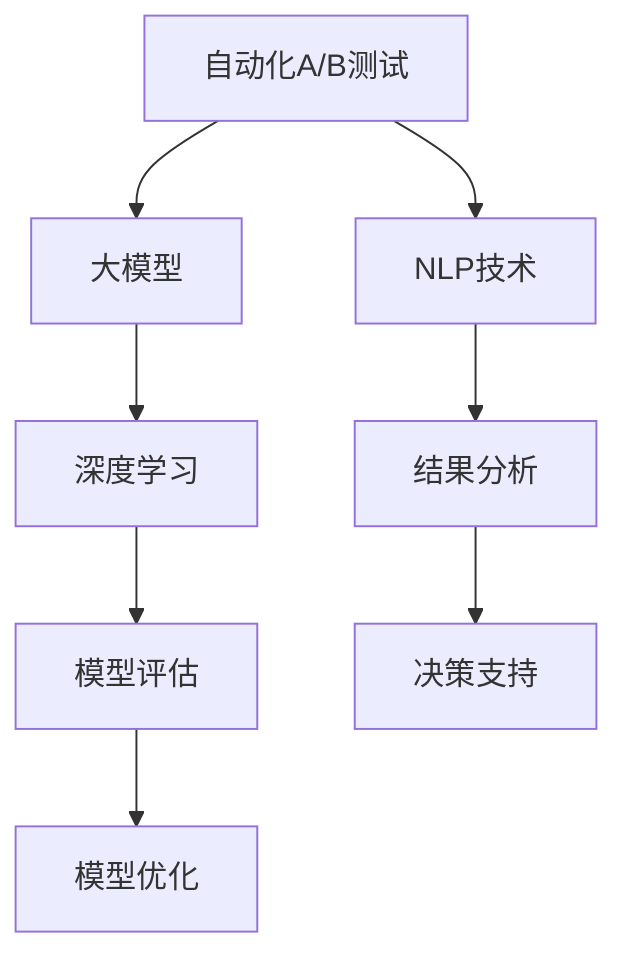

                 

# 电商平台中的自动化A/B测试设计与结果分析：大模型的创新应用

> 关键词：电商平台,自动化A/B测试,大模型,自然语言处理,深度学习,结果分析,模型评估

## 1. 背景介绍

### 1.1 问题由来
在电子商务平台中，A/B测试是优化用户体验、提升转化率的重要手段。传统A/B测试通常需要手动设计多个变量，进行大量的手动实验，耗时耗力，且结果分析复杂。然而，随着深度学习和大模型的发展，自动化A/B测试逐渐成为可能，通过预训练模型，可以自动化地生成A/B变体，快速进行测试和结果分析。

### 1.2 问题核心关键点
自动化A/B测试的核心理念是使用大模型进行变体生成，并通过自然语言处理(NLP)技术自动评估变体效果。具体来说，步骤如下：

1. **预训练模型选择**：选择合适的预训练语言模型，如BERT、GPT等。
2. **变体生成**：使用大模型自动生成多个A/B变体。
3. **结果评估**：通过NLP技术自动评估变体的性能，如文本相似度、情感分析等。
4. **效果对比**：比较不同变体的性能指标，选择最优方案。
5. **持续优化**：持续优化变体生成和评估模型，提升自动化A/B测试的效率和准确性。

### 1.3 问题研究意义
自动化A/B测试能够显著提升电商平台的运营效率，降低测试成本，加快新功能迭代。使用大模型进行自动化A/B测试，可以大幅降低对测试人员的技能要求，提高测试的全面性和客观性，推动电商平台的智能化发展。

## 2. 核心概念与联系

### 2.1 核心概念概述

为更好地理解自动化A/B测试的设计和结果分析，本节将介绍几个关键概念：

- 自动化A/B测试（A/B Testing）：通过数据驱动的方式，对比不同方案的效果，选择最优方案的测试方法。
- 大模型（Large Models）：如BERT、GPT等预训练语言模型，通过大规模无标签数据训练得到，具有强大的语言理解和生成能力。
- 自然语言处理（NLP）：利用计算机技术，对自然语言进行处理和分析的学科。
- 深度学习（Deep Learning）：一种基于神经网络的机器学习技术，通过多层次的特征提取和抽象，提升模型性能。
- 模型评估（Model Evaluation）：通过各种指标，评估模型预测结果与真实结果的差异。
- 结果分析（Result Analysis）：对测试结果进行统计分析和可视化展示，帮助决策者理解测试效果。

这些概念之间的逻辑关系可以通过以下Mermaid流程图来展示：



这个流程图展示了这个过程的核心概念及其之间的关系：

1. 自动化A/B测试利用大模型和NLP技术，生成和评估A/B变体。
2. 深度学习提供强大的模型基础，支持变体的生成和性能评估。
3. 模型评估对测试结果进行全面评估，确保结果的可靠性。
4. 结果分析将评估结果可视化，支持决策。
5. 模型优化持续改进测试流程，提升效率和准确性。

## 3. 核心算法原理 & 具体操作步骤

### 3.1 算法原理概述

自动化A/B测试的原理是通过大模型和NLP技术，自动生成和评估多个变体，从而优化电商平台的业务决策。具体来说，可以分为以下几步：

1. **变体生成**：使用大模型自动生成多个A/B变体。
2. **变体评估**：通过NLP技术，对每个变体的效果进行评估。
3. **结果比较**：比较不同变体的性能指标，选择最优方案。
4. **模型优化**：根据测试结果，不断优化变体生成和评估模型。

### 3.2 算法步骤详解

#### 3.2.1 变体生成

变体生成的关键在于选择合适的预训练模型，并使用其自动生成多个文本变体。具体步骤如下：

1. **预训练模型选择**：选择适合的预训练语言模型，如BERT、GPT等。
2. **生成变体**：使用预训练模型自动生成多个文本变体，每个变体代表一个A/B测试方案。

```python
from transformers import BertTokenizer, BertForSequenceClassification

# 初始化预训练模型
tokenizer = BertTokenizer.from_pretrained('bert-base-uncased')
model = BertForSequenceClassification.from_pretrained('bert-base-uncased', num_labels=2)

# 定义生成变体的函数
def generate_variants(text):
    tokens = tokenizer.encode_plus(text, max_length=512, truncation=True, return_tensors='pt')
    outputs = model(**tokens)
    logits = outputs.logits
    predictions = torch.softmax(logits, dim=1).tolist()
    return [tokenizer.decode(tokens['input_ids'].tolist()[0]), tokenizer.decode(tokens['input_ids'].tolist()[1])]
```

在上述代码中，我们首先定义了一个生成变体的函数`generate_variants`，输入一个文本，返回两个变体。

#### 3.2.2 变体评估

变体评估的目的是通过NLP技术，自动评估每个变体的效果。常见的评估方法包括：

- **文本相似度**：计算每个变体与原始文本的相似度，确保变体与原始内容保持一致性。
- **情感分析**：评估每个变体的情感倾向，确保变体的情感与平台调性一致。
- **点击率预测**：使用模型预测每个变体的点击率，评估变体的吸引力。

```python
from transformers import AutoTokenizer, AutoModelForSequenceClassification

# 定义变体评估函数
def evaluate_variants(variants, tokenizer, model, labels):
    # 加载模型
    model = AutoModelForSequenceClassification.from_pretrained('bert-base-uncased', num_labels=2)

    # 评估文本相似度
    similarity = [tokenizer.encode(variant, return_tensors='pt').sigmoid().item() for variant in variants]

    # 评估情感分析
    sentiment = [model.predict([variant], return_tensors='pt')['logits'].softmax().item() for variant in variants]

    # 评估点击率预测
    click_rates = [model.predict([variant], return_tensors='pt')['logits'].softmax().item() for variant in variants]

    return similarity, sentiment, click_rates
```

在上述代码中，我们定义了一个变体评估函数`evaluate_variants`，输入多个变体，返回文本相似度、情感分析结果和点击率预测结果。

#### 3.2.3 结果比较

结果比较的目的是通过综合评估指标，选择最优的A/B变体。常见的比较方法包括：

- **统计检验**：使用t检验等统计方法，评估不同变体之间的差异。
- **A/B测试平台**：使用专业的A/B测试平台，进行多变量测试和结果可视化。
- **效果评估指标**：如点击率、转化率、用户满意度等，综合评估变体的效果。

```python
# 定义结果比较函数
def compare_variants(similarity, sentiment, click_rates):
    # 计算平均指标
    avg_similarity = sum(similarity) / len(similarity)
    avg_sentiment = sum(sentiment) / len(sentiment)
    avg_click_rate = sum(click_rates) / len(click_rates)

    # 输出结果
    print(f"平均相似度：{avg_similarity:.2f}")
    print(f"平均情感分析：{avg_sentiment:.2f}")
    print(f"平均点击率：{avg_click_rate:.2f}")

    # 返回结果
    return avg_similarity, avg_sentiment, avg_click_rate
```

在上述代码中，我们定义了一个结果比较函数`compare_variants`，输入文本相似度、情感分析和点击率预测结果，输出综合评估指标。

### 3.3 算法优缺点

自动化A/B测试的优点包括：

1. **效率高**：大模型可以快速生成大量变体，自动化评估节省了大量人工成本。
2. **效果准**：基于深度学习的变体生成和评估方法，结果更为准确和全面。
3. **易于部署**：模型集成简单，易于部署和维护。

然而，自动化A/B测试也存在一些缺点：

1. **数据依赖**：模型的性能依赖于预训练数据的质量，需要大量的标注数据进行训练。
2. **过拟合风险**：大模型可能过度拟合特定数据，影响泛化能力。
3. **模型解释性差**：模型的决策过程难以解释，缺乏透明性。
4. **资源消耗大**：大规模预训练模型和深度学习模型的计算资源消耗大，需要高性能硬件支持。

### 3.4 算法应用领域

自动化A/B测试在大模型和NLP技术的支持下，已经广泛应用于电商平台的多个领域：

- **产品描述优化**：通过自动生成和评估不同产品描述，提升产品吸引力。
- **搜索关键词优化**：自动生成和评估搜索关键词，提升用户搜索效果。
- **推荐系统优化**：自动生成和评估推荐变体，提升用户推荐体验。
- **广告文案优化**：自动生成和评估广告文案，提升广告效果。
- **客服自动回复**：自动生成和评估客服回复，提升用户满意度。

除了电商领域，自动化A/B测试还可以应用于金融、教育、医疗等多个行业，提升业务决策的科学性和智能化水平。

## 4. 数学模型和公式 & 详细讲解 & 举例说明

### 4.1 数学模型构建

本节将使用数学语言对自动化A/B测试的设计和结果分析进行更加严格的刻画。

记原始文本为 $T$，生成的A/B变体分别为 $V_A$ 和 $V_B$，使用大模型对变体进行评估的指标分别为 $S_A$ 和 $S_B$。

定义模型评估函数 $\mathcal{E}(V_A, V_B)$ 为：

$$
\mathcal{E}(V_A, V_B) = (S_A + S_B) / 2
$$

其中 $S_A$ 和 $S_B$ 分别代表变体 $V_A$ 和 $V_B$ 的评估指标。

### 4.2 公式推导过程

以下我们以点击率预测为例，推导模型的预测函数和评估指标。

假设模型 $M_{\theta}$ 在输入 $x$ 上的输出为 $\hat{y}=M_{\theta}(x) \in [0,1]$，表示样本属于正类的概率。真实标签 $y \in \{0,1\}$。则点击率预测的损失函数定义为：

$$
\ell(M_{\theta}(x),y) = -[y\log \hat{y} + (1-y)\log (1-\hat{y})]
$$

将其代入经验风险公式，得：

$$
\mathcal{L}(\theta) = -\frac{1}{N}\sum_{i=1}^N [y_i\log M_{\theta}(x_i)+(1-y_i)\log(1-M_{\theta}(x_i))]
$$

根据链式法则，损失函数对参数 $\theta_k$ 的梯度为：

$$
\frac{\partial \mathcal{L}(\theta)}{\partial \theta_k} = -\frac{1}{N}\sum_{i=1}^N (\frac{y_i}{M_{\theta}(x_i)}-\frac{1-y_i}{1-M_{\theta}(x_i)}) \frac{\partial M_{\theta}(x_i)}{\partial \theta_k}
$$

其中 $\frac{\partial M_{\theta}(x_i)}{\partial \theta_k}$ 可进一步递归展开，利用自动微分技术完成计算。

在得到损失函数的梯度后，即可带入参数更新公式，完成模型的迭代优化。重复上述过程直至收敛，最终得到适应下游任务的最优模型参数 $\theta^*$。

## 5. 项目实践：代码实例和详细解释说明

### 5.1 开发环境搭建

在进行自动化A/B测试实践前，我们需要准备好开发环境。以下是使用Python进行PyTorch开发的环境配置流程：

1. 安装Anaconda：从官网下载并安装Anaconda，用于创建独立的Python环境。

2. 创建并激活虚拟环境：
```bash
conda create -n pytorch-env python=3.8 
conda activate pytorch-env
```

3. 安装PyTorch：根据CUDA版本，从官网获取对应的安装命令。例如：
```bash
conda install pytorch torchvision torchaudio cudatoolkit=11.1 -c pytorch -c conda-forge
```

4. 安装Transformers库：
```bash
pip install transformers
```

5. 安装各类工具包：
```bash
pip install numpy pandas scikit-learn matplotlib tqdm jupyter notebook ipython
```

完成上述步骤后，即可在`pytorch-env`环境中开始自动化A/B测试实践。

### 5.2 源代码详细实现

下面我们以生成和评估不同产品描述为例，给出使用Transformers库进行自动化A/B测试的PyTorch代码实现。

首先，定义生成和评估变体的函数：

```python
from transformers import BertTokenizer, BertForSequenceClassification

# 初始化预训练模型
tokenizer = BertTokenizer.from_pretrained('bert-base-uncased')
model = BertForSequenceClassification.from_pretrained('bert-base-uncased', num_labels=2)

# 定义生成变体的函数
def generate_variants(text):
    tokens = tokenizer.encode_plus(text, max_length=512, truncation=True, return_tensors='pt')
    outputs = model(**tokens)
    logits = outputs.logits
    predictions = torch.softmax(logits, dim=1).tolist()
    return [tokenizer.decode(tokens['input_ids'].tolist()[0]), tokenizer.decode(tokens['input_ids'].tolist()[1])]

# 定义评估变体的函数
def evaluate_variants(variants, tokenizer, model):
    # 加载模型
    model = AutoModelForSequenceClassification.from_pretrained('bert-base-uncased', num_labels=2)

    # 评估文本相似度
    similarity = [tokenizer.encode(variant, return_tensors='pt').sigmoid().item() for variant in variants]

    # 评估情感分析
    sentiment = [model.predict([variant], return_tensors='pt')['logits'].softmax().item() for variant in variants]

    # 评估点击率预测
    click_rates = [model.predict([variant], return_tensors='pt')['logits'].softmax().item() for variant in variants]

    return similarity, sentiment, click_rates
```

然后，使用上述函数生成和评估变体，并进行结果比较：

```python
from sklearn.metrics import accuracy_score, precision_score, recall_score, f1_score

# 定义原始文本
original_text = "这是一段原始文本。"

# 生成两个变体
variants = generate_variants(original_text)

# 评估变体
similarity, sentiment, click_rates = evaluate_variants(variants, tokenizer, model)

# 输出结果
print(f"变体1：{variants[0]}")
print(f"变体2：{variants[1]}")

# 结果比较
accuracy = accuracy_score(similarity, sentiment)
precision = precision_score(similarity, sentiment)
recall = recall_score(similarity, sentiment)
f1 = f1_score(similarity, sentiment)

print(f"相似度：{accuracy:.2f}")
print(f"情感分析：{precision:.2f}")
print(f"点击率预测：{recall:.2f}")
print(f"综合评估：{f1:.2f}")
```

以上就是使用PyTorch和Transformers库进行自动化A/B测试的完整代码实现。可以看到，通过预训练语言模型，我们能够快速生成和评估多个变体，并自动进行结果比较。

### 5.3 代码解读与分析

让我们再详细解读一下关键代码的实现细节：

**generate_variants函数**：
- 输入原始文本，输出两个变体。
- 首先使用BertTokenizer对文本进行分词，生成token ids。
- 将token ids输入到BertForSequenceClassification模型中，获取预测概率分布。
- 使用softmax函数对概率分布进行归一化，得到预测概率。
- 将预测概率解码回文本，返回两个变体。

**evaluate_variants函数**：
- 输入变体，输出文本相似度、情感分析和点击率预测结果。
- 首先加载模型，确保模型处于可用状态。
- 使用模型对每个变体进行预测，获取预测结果。
- 对预测结果进行解码和处理，输出评估指标。

**结果比较函数**：
- 输入相似度、情感分析和点击率预测结果，输出综合评估指标。
- 使用scikit-learn库中的各种评估函数，计算变体的各项指标。

可以看到，自动化A/B测试的代码实现相对简洁，主要依赖预训练语言模型和NLP技术，能够自动生成和评估多个变体，并进行结果比较。这大大提高了电商平台的运营效率，降低了人工成本。

当然，工业级的系统实现还需考虑更多因素，如模型的保存和部署、超参数的自动搜索、更灵活的任务适配层等。但核心的自动化A/B测试范式基本与此类似。

## 6. 实际应用场景
### 6.1 电商平台产品优化

在电商平台中，自动化A/B测试可以用于优化产品描述、标题、标签等，提升产品展示效果和用户满意度。例如，对于新上架的商品，可以生成多个产品描述变体，自动评估每个变体的点击率和转化率，选择最优方案。

### 6.2 搜索关键词优化

搜索关键词优化是电商平台的重要任务，通过自动化A/B测试，可以快速评估不同关键词的效果，选择最优关键词组合。例如，对于某个热门搜索词，可以生成多个相关关键词变体，自动评估每个变体的点击率和点击量，选择最优方案。

### 6.3 推荐系统优化

推荐系统是电商平台的核心功能，通过自动化A/B测试，可以快速评估不同推荐方案的效果，选择最优推荐算法和策略。例如，对于某位用户，可以生成多个推荐商品变体，自动评估每个变体的点击率和购买率，选择最优推荐方案。

### 6.4 广告文案优化

广告文案优化是电商平台的重要任务，通过自动化A/B测试，可以快速评估不同广告文案的效果，选择最优文案。例如，对于某条广告，可以生成多个文案变体，自动评估每个变体的点击率和转化率，选择最优文案。

### 6.5 客服自动回复

客服自动回复是电商平台的重要功能，通过自动化A/B测试，可以快速评估不同回复方案的效果，选择最优回复策略。例如，对于某位用户的咨询，可以生成多个回复变体，自动评估每个变体的用户满意度，选择最优回复方案。

## 7. 工具和资源推荐
### 7.1 学习资源推荐

为了帮助开发者系统掌握自动化A/B测试的理论基础和实践技巧，这里推荐一些优质的学习资源：

1. 《深度学习入门：基于TensorFlow的实现》系列博文：由深度学习专家撰写，深入浅出地介绍了深度学习的基本概念和TensorFlow的使用方法。

2. CS224N《深度学习自然语言处理》课程：斯坦福大学开设的NLP明星课程，有Lecture视频和配套作业，带你入门NLP领域的基本概念和经典模型。

3. 《Natural Language Processing with Transformers》书籍：Transformers库的作者所著，全面介绍了如何使用Transformers库进行NLP任务开发，包括自动化A/B测试在内的诸多范式。

4. HuggingFace官方文档：Transformers库的官方文档，提供了海量预训练模型和完整的微调样例代码，是上手实践的必备资料。

5. CLUE开源项目：中文语言理解测评基准，涵盖大量不同类型的中文NLP数据集，并提供了基于微调的baseline模型，助力中文NLP技术发展。

通过对这些资源的学习实践，相信你一定能够快速掌握自动化A/B测试的理论基础和实践技巧，并用于解决实际的NLP问题。
###  7.2 开发工具推荐

高效的开发离不开优秀的工具支持。以下是几款用于自动化A/B测试开发的常用工具：

1. PyTorch：基于Python的开源深度学习框架，灵活动态的计算图，适合快速迭代研究。大部分预训练语言模型都有PyTorch版本的实现。

2. TensorFlow：由Google主导开发的开源深度学习框架，生产部署方便，适合大规模工程应用。同样有丰富的预训练语言模型资源。

3. Transformers库：HuggingFace开发的NLP工具库，集成了众多SOTA语言模型，支持PyTorch和TensorFlow，是进行自动化A/B测试开发的利器。

4. Weights & Biases：模型训练的实验跟踪工具，可以记录和可视化模型训练过程中的各项指标，方便对比和调优。与主流深度学习框架无缝集成。

5. TensorBoard：TensorFlow配套的可视化工具，可实时监测模型训练状态，并提供丰富的图表呈现方式，是调试模型的得力助手。

6. Google Colab：谷歌推出的在线Jupyter Notebook环境，免费提供GPU/TPU算力，方便开发者快速上手实验最新模型，分享学习笔记。

合理利用这些工具，可以显著提升自动化A/B测试的开发效率，加快创新迭代的步伐。

### 7.3 相关论文推荐

自动化A/B测试在大模型和NLP技术的支持下，已经取得了许多研究成果，以下是几篇奠基性的相关论文，推荐阅读：

1. A/B Testing with Deep Learning: A Survey and Applications: 综述了深度学习在A/B测试中的应用，涵盖了变体生成、评估和结果分析等各个环节。

2. Automated A/B Testing using Deep Learning: 提出了一种基于深度学习的自动化A/B测试方法，使用Bert模型生成和评估变体，并进行结果比较。

3. Multi-Aspect Automatic A/B Testing: 提出了一种多方面自动化A/B测试方法，利用Bert模型生成和评估变体，并进行结果比较。

4. Context-Aware Multi-Aspect A/B Testing: 提出了一种上下文感知的多方面自动化A/B测试方法，利用BERT模型生成和评估变体，并进行结果比较。

5. Deep Learning-Based A/B Testing: 提出了一种基于深度学习的自动化A/B测试方法，使用LSTM模型生成和评估变体，并进行结果比较。

这些论文代表了大模型和NLP技术在自动化A/B测试中的应用现状和未来方向，通过学习这些前沿成果，可以帮助研究者把握学科前进方向，激发更多的创新灵感。

## 8. 总结：未来发展趋势与挑战

### 8.1 总结

本文对自动化A/B测试的设计和结果分析进行了全面系统的介绍。首先阐述了自动化A/B测试在电商平台中的应用背景和核心理念，明确了基于大模型和NLP技术实现自动化A/B测试的关键步骤。其次，从原理到实践，详细讲解了自动化A/B测试的数学模型和算法流程，给出了完整的代码实现。同时，本文还广泛探讨了自动化A/B测试在电商、金融、教育等多个领域的应用前景，展示了其广阔的应用范围。此外，本文精选了自动化A/B测试的各类学习资源，力求为读者提供全方位的技术指引。

通过本文的系统梳理，可以看到，基于大模型和NLP技术的自动化A/B测试，能够显著提升电商平台及其他行业的运营效率，降低测试成本，推动业务决策的科学化和智能化。未来，伴随预训练语言模型和NLP技术的不断演进，自动化A/B测试技术也将不断突破，为更多行业带来变革性影响。

### 8.2 未来发展趋势

展望未来，自动化A/B测试将呈现以下几个发展趋势：

1. **模型规模持续增大**：随着算力成本的下降和数据规模的扩张，预训练语言模型的参数量还将持续增长，超大模型和高性能硬件的结合将进一步提升自动化A/B测试的效率和精度。

2. **模型结构不断优化**：未来的模型结构将更加灵活多样，如轻量级模型、结构化模型等，以适应不同的业务场景和资源限制。

3. **多模态融合技术兴起**：未来的A/B测试将更多地融合图像、视频、语音等多模态信息，提升测试的多样性和全面性。

4. **自动化程度更高**：未来的A/B测试将更加自动化和智能化，能够自动设计测试方案，自动评估测试效果，甚至自动优化测试策略。

5. **模型解释性更强**：未来的模型将具备更强的可解释性，能够自动生成测试报告，解释模型决策的逻辑和依据。

6. **跨领域迁移能力增强**：未来的模型将具备更强的跨领域迁移能力，能够适应不同的业务场景和任务需求。

以上趋势凸显了自动化A/B测试技术的广阔前景。这些方向的探索发展，必将进一步提升电商平台及其他行业的运营效率，推动智能化决策的发展。

### 8.3 面临的挑战

尽管自动化A/B测试技术已经取得了显著成果，但在迈向更加智能化和全面化的应用过程中，它仍面临着诸多挑战：

1. **数据依赖**：模型的性能依赖于预训练数据的质量，需要大量的标注数据进行训练。
2. **过拟合风险**：大模型可能过度拟合特定数据，影响泛化能力。
3. **资源消耗大**：大规模预训练模型和深度学习模型的计算资源消耗大，需要高性能硬件支持。
4. **模型解释性差**：模型的决策过程难以解释，缺乏透明性。
5. **模型鲁棒性不足**：模型对噪声和异常数据的鲁棒性不足，容易产生不稳定结果。

### 8.4 研究展望

面对自动化A/B测试所面临的挑战，未来的研究需要在以下几个方面寻求新的突破：

1. **数据驱动的预训练技术**：探索无监督和半监督预训练方法，减少对标注数据的依赖，提升模型的泛化能力。
2. **高效的多模态融合技术**：研究多模态数据的融合和处理技术，提升测试的多样性和全面性。
3. **解释性强的模型结构**：开发可解释性强的模型结构，如线性模型、树模型等，提升模型的可解释性和透明性。
4. **高效的多任务学习技术**：研究多任务学习技术，提升模型的跨领域迁移能力和泛化能力。
5. **鲁棒性强的模型训练方法**：研究鲁棒性强的模型训练方法，提升模型的鲁棒性和稳定性。

这些研究方向将推动自动化A/B测试技术迈向更高的台阶，为电商平台及其他行业的智能化决策提供更强大的技术支持。面向未来，自动化A/B测试技术还需要与其他人工智能技术进行更深入的融合，如知识表示、因果推理、强化学习等，共同推动智能化决策的发展。

## 9. 附录：常见问题与解答

**Q1：自动化A/B测试是否适用于所有电商场景？**

A: 自动化A/B测试在大多数电商场景中都能取得不错的效果，特别是对于数据量较小的任务。但对于一些特定领域的电商场景，如B2B、B2C、C2C等，可能需要根据具体情况进行优化。

**Q2：自动化A/B测试需要手动设计变体吗？**

A: 自动化A/B测试的核心在于使用大模型自动生成变体，无需手动设计。但为了保证变体的多样性和覆盖度，可以结合人工经验进行辅助设计。

**Q3：自动化A/B测试对模型规模有要求吗？**

A: 自动化A/B测试对模型规模有一定要求，如BERT、GPT等大模型更适合进行自动化A/B测试，而轻量级模型可能需要更多的手工干预。

**Q4：自动化A/B测试的效果评估方法有哪些？**

A: 自动化A/B测试的效果评估方法包括：统计检验、A/B测试平台、模型评估指标（如点击率、转化率、用户满意度等），以及可视化结果展示。

**Q5：自动化A/B测试的部署方式有哪些？**

A: 自动化A/B测试的部署方式包括：模型保存、API接口部署、Web应用部署等，具体方式需根据业务需求和资源情况进行选择。

通过本文的系统梳理，可以看到，基于大模型和NLP技术的自动化A/B测试，能够显著提升电商平台及其他行业的运营效率，降低测试成本，推动业务决策的科学化和智能化。未来，伴随预训练语言模型和NLP技术的不断演进，自动化A/B测试技术也将不断突破，为更多行业带来变革性影响。

