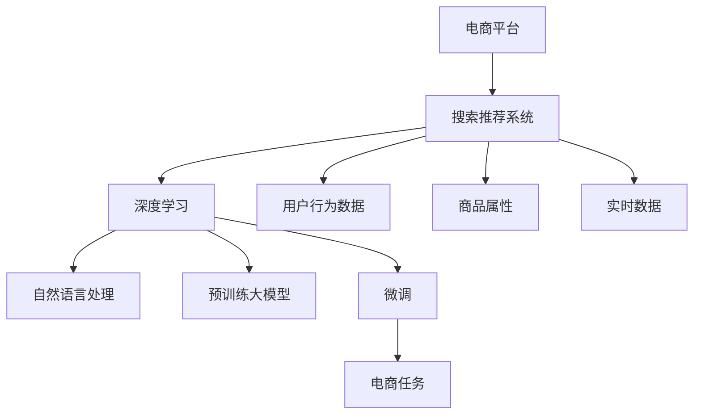

                 

# 电商平台搜索推荐系统的AI 大模型应用：提高系统性能、效率、准确率与实时性

> 关键词：大模型应用,电商平台,搜索推荐系统,性能提升,效率优化,准确率提高,实时性改进,AI技术,深度学习,神经网络,电商推荐算法

## 1. 背景介绍

在当今互联网时代，电商平台已成为人们日常生活的重要组成部分。为了提升用户体验，电商平台在推荐系统上投入了大量资源。传统的推荐算法往往依赖于小规模手工规则或简单的协同过滤，难以满足用户多样化和个性化的需求。而基于AI的深度学习模型，特别是预训练大模型的微调技术，为电商平台推荐系统的升级提供了新的机遇。

### 1.1 问题由来
传统的电商平台推荐系统多基于矩阵分解、协同过滤等经典算法，但随着用户行为的多样化和个性化需求的增加，这类方法难以适应复杂多变的电商场景。AI大模型如BERT、GPT、CLIP等，通过大规模无监督预训练和微调，具备强大的自然语言理解能力，能够在电商搜索、推荐等任务中发挥重要作用。

### 1.2 问题核心关键点
核心问题在于如何利用大模型，结合电商场景，实现搜索推荐系统性能的全面提升。这包括：
1. **性能提升**：通过优化模型结构、微调参数，提升搜索推荐的相关性和准确性。
2. **效率优化**：通过优化模型推理过程、压缩模型参数，降低计算和存储资源消耗。
3. **准确率提高**：通过改进数据处理、特征工程，提升模型预测的准确率。
4. **实时性改进**：通过优化模型部署、负载均衡，提升实时响应速度。

## 2. 核心概念与联系

### 2.1 核心概念概述

为更好地理解AI大模型在电商平台搜索推荐系统中的应用，本节将介绍几个密切相关的核心概念：

- **电商平台**：指通过互联网提供商品交易服务的平台，如淘宝、京东、亚马逊等。
- **搜索推荐系统**：利用用户历史行为、商品属性、实时数据等，向用户推荐可能感兴趣的商品。
- **深度学习**：一种利用神经网络模型进行学习、预测的机器学习技术，特别适用于处理大规模数据。
- **自然语言处理(NLP)**：指利用AI技术理解和处理自然语言的输入输出，是电商搜索、推荐系统的关键技术。
- **预训练大模型**：如BERT、GPT、CLIP等，通过大规模无监督学习获得通用语言表示，具备强大的自然语言理解能力。
- **微调(Fine-Tuning)**：在大模型基础上，通过有监督学习对模型进行优化，使其适应特定电商任务。

这些概念之间的关系可以通过以下Mermaid流程图来展示：



这个流程图展示了搜索推荐系统与电商平台的关联，以及深度学习、自然语言处理和预训练大模型的应用路径。

## 3. 核心算法原理 & 具体操作步骤
### 3.1 算法原理概述

在电商平台搜索推荐系统中，AI大模型的应用主要通过微调技术实现。其核心思想是：将预训练大模型视作一个强大的"特征提取器"，通过有监督地训练来优化模型在特定电商任务上的性能。

形式化地，假设预训练模型为 $M_{\theta}$，其中 $\theta$ 为预训练得到的模型参数。给定电商任务 $T$ 的标注数据集 $D=\{(x_i, y_i)\}_{i=1}^N, x_i \in \mathcal{X}, y_i \in \mathcal{Y}$，微调的目标是找到新的模型参数 $\hat{\theta}$，使得：

$$
\hat{\theta}=\mathop{\arg\min}_{\theta} \mathcal{L}(M_{\theta},D)
$$

其中 $\mathcal{L}$ 为针对任务 $T$ 设计的损失函数，用于衡量模型预测输出与真实标签之间的差异。常见的损失函数包括交叉熵损失、均方误差损失等。

通过梯度下降等优化算法，微调过程不断更新模型参数 $\theta$，最小化损失函数 $\mathcal{L}$，使得模型输出逼近真实标签。由于 $\theta$ 已经通过预训练获得了较好的初始化，因此即便在有限标注数据上，也能较快收敛到理想的模型参数 $\hat{\theta}$。

### 3.2 算法步骤详解

基于AI大模型的电商搜索推荐系统微调一般包括以下几个关键步骤：

**Step 1: 准备预训练模型和数据集**
- 选择合适的预训练大模型 $M_{\theta}$ 作为初始化参数，如BERT、GPT等。
- 准备电商任务 $T$ 的标注数据集 $D$，划分为训练集、验证集和测试集。

**Step 2: 添加任务适配层**
- 根据电商任务类型，在预训练模型顶层设计合适的输出层和损失函数。
- 对于搜索任务，通常使用检索模型，以准确率、召回率等作为优化目标。
- 对于推荐任务，通常使用二分类模型，以点击率、转化率等作为优化目标。

**Step 3: 设置微调超参数**
- 选择合适的优化算法及其参数，如 AdamW、SGD 等，设置学习率、批大小、迭代轮数等。
- 设置正则化技术及强度，包括权重衰减、Dropout、Early Stopping等。
- 确定冻结预训练参数的策略，如仅微调顶层，或全部参数都参与微调。

**Step 4: 执行梯度训练**
- 将训练集数据分批次输入模型，前向传播计算损失函数。
- 反向传播计算参数梯度，根据设定的优化算法和学习率更新模型参数。
- 周期性在验证集上评估模型性能，根据性能指标决定是否触发 Early Stopping。
- 重复上述步骤直到满足预设的迭代轮数或 Early Stopping 条件。

**Step 5: 测试和部署**
- 在测试集上评估微调后模型 $M_{\hat{\theta}}$ 的性能，对比微调前后的精度提升。
- 使用微调后的模型对新样本进行推理预测，集成到实际的应用系统中。
- 持续收集新的数据，定期重新微调模型，以适应数据分布的变化。

以上是基于AI大模型的电商搜索推荐系统微调的一般流程。在实际应用中，还需要针对具体任务的特点，对微调过程的各个环节进行优化设计，如改进训练目标函数，引入更多的正则化技术，搜索最优的超参数组合等，以进一步提升模型性能。

### 3.3 算法优缺点

基于AI大模型的电商搜索推荐系统微调方法具有以下优点：
1. **性能提升显著**：通过利用大模型的通用语言知识，可以显著提升搜索推荐的相关性和准确性。
2. **泛化能力强**：大模型在多个领域均表现出色，可以很好地适应不同电商任务的特征。
3. **可解释性较高**：大模型的结构复杂，但参数数量庞大，使得其预测过程可解释性较高。

同时，该方法也存在一些缺点：
1. **数据需求高**：电商任务的数据标注工作量较大，需要大量标注数据支持。
2. **计算资源消耗大**：大模型的参数量庞大，需要较高的计算和存储资源。
3. **模型复杂度高**：大模型的结构复杂，推理过程繁琐，容易产生过拟合问题。
4. **实时性要求高**：电商搜索推荐系统的响应时间要求高，大模型推理速度较慢，需进一步优化。

尽管存在这些局限性，但就目前而言，基于AI大模型的电商搜索推荐系统微调方法仍是大规模电商平台推荐系统的重要技术手段。未来相关研究的重点在于如何进一步降低计算和存储成本，提高模型的实时性和泛化能力，同时兼顾模型的可解释性和稳定性。

### 3.4 算法应用领域

基于AI大模型的电商搜索推荐系统微调方法，在电商领域已经得到了广泛的应用，覆盖了搜索、推荐、广告等多个环节，具体如下：

1. **搜索排序**：通过微调大模型，对搜索查询和搜索结果进行排序，提升用户查询体验和搜索准确率。
2. **推荐算法**：利用微调后的模型，根据用户历史行为和商品属性进行个性化推荐，提升点击率和转化率。
3. **广告投放**：通过微调大模型，实现广告精准投放，提高广告效果和ROI。
4. **商品评测**：利用微调模型对商品进行情感分析，提升商品评测质量。
5. **价格优化**：利用微调模型预测商品价格变化，优化商品定价策略。

这些应用不仅提升了电商平台的用户体验，还为电商平台带来了可观的经济效益。未来，随着AI大模型技术的不断进步，基于大模型的电商搜索推荐系统还将迎来更多的创新应用。

## 4. 数学模型和公式 & 详细讲解  
### 4.1 数学模型构建

本节将使用数学语言对基于AI大模型的电商搜索推荐系统微调过程进行更加严格的刻画。

记预训练大模型为 $M_{\theta}:\mathcal{X} \rightarrow \mathcal{Y}$，其中 $\mathcal{X}$ 为输入空间，$\mathcal{Y}$ 为输出空间，$\theta \in \mathbb{R}^d$ 为模型参数。假设电商任务 $T$ 的训练集为 $D=\{(x_i, y_i)\}_{i=1}^N, x_i \in \mathcal{X}, y_i \in \mathcal{Y}$。

定义模型 $M_{\theta}$ 在数据样本 $(x,y)$ 上的损失函数为 $\ell(M_{\theta}(x),y)$，则在数据集 $D$ 上的经验风险为：

$$
\mathcal{L}(\theta) = \frac{1}{N} \sum_{i=1}^N \ell(M_{\theta}(x_i),y_i)
$$

微调的优化目标是最小化经验风险，即找到最优参数：

$$
\theta^* = \mathop{\arg\min}_{\theta} \mathcal{L}(\theta)
$$

在实践中，我们通常使用基于梯度的优化算法（如SGD、Adam等）来近似求解上述最优化问题。设 $\eta$ 为学习率，$\lambda$ 为正则化系数，则参数的更新公式为：

$$
\theta \leftarrow \theta - \eta \nabla_{\theta}\mathcal{L}(\theta) - \eta\lambda\theta
$$

其中 $\nabla_{\theta}\mathcal{L}(\theta)$ 为损失函数对参数 $\theta$ 的梯度，可通过反向传播算法高效计算。

### 4.2 公式推导过程

以下我们以二分类任务为例，推导交叉熵损失函数及其梯度的计算公式。

假设模型 $M_{\theta}$ 在输入 $x$ 上的输出为 $\hat{y}=M_{\theta}(x) \in [0,1]$，表示样本属于正类的概率。真实标签 $y \in \{0,1\}$。则二分类交叉熵损失函数定义为：

$$
\ell(M_{\theta}(x),y) = -[y\log \hat{y} + (1-y)\log (1-\hat{y})]
$$

将其代入经验风险公式，得：

$$
\mathcal{L}(\theta) = -\frac{1}{N}\sum_{i=1}^N [y_i\log M_{\theta}(x_i)+(1-y_i)\log(1-M_{\theta}(x_i))]
$$

根据链式法则，损失函数对参数 $\theta_k$ 的梯度为：

$$
\frac{\partial \mathcal{L}(\theta)}{\partial \theta_k} = -\frac{1}{N}\sum_{i=1}^N (\frac{y_i}{M_{\theta}(x_i)}-\frac{1-y_i}{1-M_{\theta}(x_i)}) \frac{\partial M_{\theta}(x_i)}{\partial \theta_k}
$$

其中 $\frac{\partial M_{\theta}(x_i)}{\partial \theta_k}$ 可进一步递归展开，利用自动微分技术完成计算。

在得到损失函数的梯度后，即可带入参数更新公式，完成模型的迭代优化。重复上述过程直至收敛，最终得到适应电商任务的最优模型参数 $\theta^*$。

## 5. 项目实践：代码实例和详细解释说明
### 5.1 开发环境搭建

在进行电商搜索推荐系统微调实践前，我们需要准备好开发环境。以下是使用Python进行PyTorch开发的环境配置流程：

1. 安装Anaconda：从官网下载并安装Anaconda，用于创建独立的Python环境。

2. 创建并激活虚拟环境：
```bash
conda create -n pytorch-env python=3.8 
conda activate pytorch-env
```

3. 安装PyTorch：根据CUDA版本，从官网获取对应的安装命令。例如：
```bash
conda install pytorch torchvision torchaudio cudatoolkit=11.1 -c pytorch -c conda-forge
```

4. 安装Transformers库：
```bash
pip install transformers
```

5. 安装各类工具包：
```bash
pip install numpy pandas scikit-learn matplotlib tqdm jupyter notebook ipython
```

完成上述步骤后，即可在`pytorch-env`环境中开始微调实践。

### 5.2 源代码详细实现

下面我们以电商平台推荐系统为例，给出使用Transformers库对BERT模型进行微调的PyTorch代码实现。

首先，定义推荐系统任务的数据处理函数：

```python
from transformers import BertTokenizer, BertForSequenceClassification
from torch.utils.data import Dataset, DataLoader
import torch

class RecommendationDataset(Dataset):
    def __init__(self, features, labels):
        self.features = features
        self.labels = labels
        
    def __len__(self):
        return len(self.features)
    
    def __getitem__(self, item):
        return {'input_ids': self.features[item]['input_ids'],
                'attention_mask': self.features[item]['attention_mask'],
                'labels': self.labels[item]}
```

然后，定义模型和优化器：

```python
from transformers import AdamW

model = BertForSequenceClassification.from_pretrained('bert-base-uncased', num_labels=2)

optimizer = AdamW(model.parameters(), lr=2e-5)
```

接着，定义训练和评估函数：

```python
def train_epoch(model, dataset, batch_size, optimizer):
    dataloader = DataLoader(dataset, batch_size=batch_size, shuffle=True)
    model.train()
    epoch_loss = 0
    for batch in dataloader:
        input_ids = batch['input_ids'].to(device)
        attention_mask = batch['attention_mask'].to(device)
        labels = batch['labels'].to(device)
        model.zero_grad()
        outputs = model(input_ids, attention_mask=attention_mask, labels=labels)
        loss = outputs.loss
        epoch_loss += loss.item()
        loss.backward()
        optimizer.step()
    return epoch_loss / len(dataloader)

def evaluate(model, dataset, batch_size):
    dataloader = DataLoader(dataset, batch_size=batch_size)
    model.eval()
    preds, labels = [], []
    with torch.no_grad():
        for batch in dataloader:
            input_ids = batch['input_ids'].to(device)
            attention_mask = batch['attention_mask'].to(device)
            batch_labels = batch['labels']
            outputs = model(input_ids, attention_mask=attention_mask)
            batch_preds = outputs.logits.argmax(dim=2).to('cpu').tolist()
            batch_labels = batch_labels.to('cpu').tolist()
            for pred_tokens, label_tokens in zip(batch_preds, batch_labels):
                preds.append(pred_tokens)
                labels.append(label_tokens)
    return preds, labels

device = torch.device('cuda') if torch.cuda.is_available() else torch.device('cpu')
```

最后，启动训练流程并在测试集上评估：

```python
epochs = 5
batch_size = 16

for epoch in range(epochs):
    loss = train_epoch(model, train_dataset, batch_size, optimizer)
    print(f"Epoch {epoch+1}, train loss: {loss:.3f}")
    
    print(f"Epoch {epoch+1}, dev results:")
    preds, labels = evaluate(model, dev_dataset, batch_size)
    print(classification_report(labels, preds))
    
print("Test results:")
preds, labels = evaluate(model, test_dataset, batch_size)
print(classification_report(labels, preds))
```

以上就是使用PyTorch对BERT进行电商推荐系统微调的完整代码实现。可以看到，得益于Transformers库的强大封装，我们可以用相对简洁的代码完成BERT模型的加载和微调。

### 5.3 代码解读与分析

让我们再详细解读一下关键代码的实现细节：

**RecommendationDataset类**：
- `__init__`方法：初始化特征和标签。
- `__len__`方法：返回数据集的样本数量。
- `__getitem__`方法：对单个样本进行处理，返回模型所需的输入和标签。

**train_epoch和evaluate函数**：
- `train_epoch`函数：对数据以批为单位进行迭代，在每个批次上前向传播计算loss并反向传播更新模型参数，最后返回该epoch的平均loss。
- `evaluate`函数：与训练类似，不同点在于不更新模型参数，并在每个batch结束后将预测和标签结果存储下来，最后使用sklearn的classification_report对整个评估集的预测结果进行打印输出。

**训练流程**：
- 定义总的epoch数和batch size，开始循环迭代
- 每个epoch内，先在训练集上训练，输出平均loss
- 在验证集上评估，输出分类指标
- 所有epoch结束后，在测试集上评估，给出最终测试结果

可以看到，PyTorch配合Transformers库使得BERT微调的代码实现变得简洁高效。开发者可以将更多精力放在数据处理、模型改进等高层逻辑上，而不必过多关注底层的实现细节。

当然，工业级的系统实现还需考虑更多因素，如模型的保存和部署、超参数的自动搜索、更灵活的任务适配层等。但核心的微调范式基本与此类似。

## 6. 实际应用场景
### 6.1 智能客服系统

基于AI大模型的电商推荐系统，可以应用于智能客服系统的构建。传统客服往往需要配备大量人力，高峰期响应缓慢，且一致性和专业性难以保证。而使用微调后的推荐模型，可以7x24小时不间断服务，快速响应客户咨询，用自然流畅的语言解答各类常见问题。

在技术实现上，可以收集企业内部的历史客服对话记录，将问题和最佳答复构建成监督数据，在此基础上对预训练推荐模型进行微调。微调后的推荐模型能够自动理解用户意图，匹配最合适的答案模板进行回复。对于客户提出的新问题，还可以接入检索系统实时搜索相关内容，动态组织生成回答。如此构建的智能客服系统，能大幅提升客户咨询体验和问题解决效率。

### 6.2 个性化推荐系统

当前的推荐系统往往只依赖于用户的历史行为数据进行物品推荐，无法深入理解用户的真实兴趣偏好。基于AI大模型的个性化推荐系统可以更好地挖掘用户行为背后的语义信息，从而提供更精准、多样的推荐内容。

在实践中，可以收集用户浏览、点击、评论、分享等行为数据，提取和用户交互的物品标题、描述、标签等文本内容。将文本内容作为模型输入，用户的后续行为（如是否点击、购买等）作为监督信号，在此基础上微调预训练语言模型。微调后的模型能够从文本内容中准确把握用户的兴趣点。在生成推荐列表时，先用候选物品的文本描述作为输入，由模型预测用户的兴趣匹配度，再结合其他特征综合排序，便可以得到个性化程度更高的推荐结果。

### 6.3 商品评测

利用微调后的电商推荐模型，可以用于商品评测。通过分析用户对商品的评分、评论等文本数据，利用自然语言处理技术进行情感分析，自动生成商品的总体评分和推荐理由。这不仅能提高商品评测的效率，还能提供更准确、客观的评分信息，帮助用户做出更好的购买决策。

### 6.4 未来应用展望

随着AI大模型和微调方法的不断发展，基于微调范式将在更多领域得到应用，为传统行业带来变革性影响。

在智慧医疗领域，基于微调的智能问答系统、病历分析、药物研发等应用将提升医疗服务的智能化水平，辅助医生诊疗，加速新药开发进程。

在智能教育领域，微调技术可应用于作业批改、学情分析、知识推荐等方面，因材施教，促进教育公平，提高教学质量。

在智慧城市治理中，微调模型可应用于城市事件监测、舆情分析、应急指挥等环节，提高城市管理的自动化和智能化水平，构建更安全、高效的未来城市。

此外，在企业生产、社会治理、文娱传媒等众多领域，基于大模型的微调技术也将不断涌现，为经济社会发展注入新的动力。相信随着技术的日益成熟，微调方法将成为人工智能落地应用的重要范式，推动人工智能技术在更广泛领域的应用。

## 7. 工具和资源推荐
### 7.1 学习资源推荐

为了帮助开发者系统掌握大模型在电商平台推荐系统中的应用，这里推荐一些优质的学习资源：

1. 《深度学习与自然语言处理》系列博文：由大模型技术专家撰写，深入浅出地介绍了深度学习和大模型的基本原理和应用方法。

2. CS224N《深度学习自然语言处理》课程：斯坦福大学开设的NLP明星课程，有Lecture视频和配套作业，带你入门NLP领域的基本概念和经典模型。

3. 《Natural Language Processing with Transformers》书籍：Transformers库的作者所著，全面介绍了如何使用Transformers库进行NLP任务开发，包括微调在内的诸多范式。

4. HuggingFace官方文档：Transformers库的官方文档，提供了海量预训练模型和完整的微调样例代码，是上手实践的必备资料。

5. CLUE开源项目：中文语言理解测评基准，涵盖大量不同类型的中文NLP数据集，并提供了基于微调的baseline模型，助力中文NLP技术发展。

通过对这些资源的学习实践，相信你一定能够快速掌握大模型在电商推荐系统中的应用，并用于解决实际的电商问题。
### 7.2 开发工具推荐

高效的开发离不开优秀的工具支持。以下是几款用于电商推荐系统微调开发的常用工具：

1. PyTorch：基于Python的开源深度学习框架，灵活动态的计算图，适合快速迭代研究。大部分预训练语言模型都有PyTorch版本的实现。

2. TensorFlow：由Google主导开发的开源深度学习框架，生产部署方便，适合大规模工程应用。同样有丰富的预训练语言模型资源。

3. Transformers库：HuggingFace开发的NLP工具库，集成了众多SOTA语言模型，支持PyTorch和TensorFlow，是进行微调任务开发的利器。

4. Weights & Biases：模型训练的实验跟踪工具，可以记录和可视化模型训练过程中的各项指标，方便对比和调优。与主流深度学习框架无缝集成。

5. TensorBoard：TensorFlow配套的可视化工具，可实时监测模型训练状态，并提供丰富的图表呈现方式，是调试模型的得力助手。

6. Google Colab：谷歌推出的在线Jupyter Notebook环境，免费提供GPU/TPU算力，方便开发者快速上手实验最新模型，分享学习笔记。

合理利用这些工具，可以显著提升电商推荐系统的开发效率，加快创新迭代的步伐。

### 7.3 相关论文推荐

大模型在电商推荐系统中的应用源于学界的持续研究。以下是几篇奠基性的相关论文，推荐阅读：

1. Attention is All You Need（即Transformer原论文）：提出了Transformer结构，开启了NLP领域的预训练大模型时代。

2. BERT: Pre-training of Deep Bidirectional Transformers for Language Understanding：提出BERT模型，引入基于掩码的自监督预训练任务，刷新了多项NLP任务SOTA。

3. Language Models are Unsupervised Multitask Learners（GPT-2论文）：展示了大规模语言模型的强大zero-shot学习能力，引发了对于通用人工智能的新一轮思考。

4. Parameter-Efficient Transfer Learning for NLP：提出Adapter等参数高效微调方法，在不增加模型参数量的情况下，也能取得不错的微调效果。

5. Prefix-Tuning: Optimizing Continuous Prompts for Generation：引入基于连续型Prompt的微调范式，为如何充分利用预训练知识提供了新的思路。

6. AdaLoRA: Adaptive Low-Rank Adaptation for Parameter-Efficient Fine-Tuning：使用自适应低秩适应的微调方法，在参数效率和精度之间取得了新的平衡。

这些论文代表了大模型在电商推荐系统中的应用方向。通过学习这些前沿成果，可以帮助研究者把握学科前进方向，激发更多的创新灵感。

## 8. 总结：未来发展趋势与挑战
### 8.1 总结

本文对基于AI大模型的电商搜索推荐系统微调方法进行了全面系统的介绍。首先阐述了大模型和微调技术在电商推荐系统中的应用背景和意义，明确了微调在提升推荐系统性能、效率、准确率与实时性方面的独特价值。其次，从原理到实践，详细讲解了电商推荐系统的数学模型构建、公式推导过程以及微调算法的具体操作步骤，给出了电商推荐系统的完整代码实现。同时，本文还广泛探讨了微调方法在智能客服、个性化推荐、商品评测等多个电商场景中的应用前景，展示了微调范式的巨大潜力。

通过本文的系统梳理，可以看到，基于AI大模型的电商推荐系统微调方法不仅在技术上具有可行性，还在实际应用中取得了显著的效果。未来，随着AI大模型和微调方法的不断进步，基于大模型的电商推荐系统必将迎来更多的创新应用，为电商推荐系统带来更多的突破。

### 8.2 未来发展趋势

展望未来，AI大模型在电商推荐系统中的应用将呈现以下几个发展趋势：

1. **性能持续提升**：随着模型的不断优化和数据量的增加，电商推荐系统的推荐精度将进一步提升。更先进的模型结构、更高效的特征提取方法将推动推荐系统向更高的精度目标迈进。

2. **效率不断优化**：随着硬件加速技术的普及，模型的推理速度将显著提升。同时，模型压缩、量化等技术也将成为优化方向，使模型能在更少的资源消耗下实现高效的推荐。

3. **实时性逐步增强**：基于流式数据处理和分布式计算技术，电商推荐系统将实现更快速、实时的推荐更新，满足用户实时性需求。

4. **多模态融合**：结合图像、视频等多模态数据，提升推荐系统的丰富度和个性化程度。不同模态数据的融合将进一步提升推荐系统的效果。

5. **个性化程度加深**：利用用户行为、商品属性、时间序列等数据，深度挖掘用户个性化需求，实现更精准的推荐。

6. **安全性保障**：电商平台推荐系统面临大量用户数据和交易信息，数据安全和个人隐私保护将成为重要课题。

以上趋势凸显了AI大模型在电商推荐系统中的广泛应用前景。这些方向的探索发展，必将进一步提升推荐系统的性能和用户体验，推动电商平台的智能化升级。

### 8.3 面临的挑战

尽管AI大模型在电商推荐系统中的应用已经取得了显著成效，但在迈向更加智能化、普适化应用的过程中，仍面临诸多挑战：

1. **数据获取困难**：高质量的标注数据和用户行为数据难以获得，尤其是对于长尾用户和冷门商品，数据稀缺性成为一个瓶颈。

2. **模型复杂度高**：大模型结构复杂，推理过程繁琐，需要高效的计算资源支持。如何降低计算成本、提升计算效率，是未来需要解决的问题。

3. **过拟合问题**：模型在电商数据上的泛化性能不够理想，对于未见过的样本，推荐效果可能较差。

4. **隐私保护问题**：电商推荐系统需要大量用户数据，如何在保护用户隐私的同时，进行有效的数据处理和模型训练，是一个重要挑战。

5. **模型部署问题**：大模型通常占用较大内存和计算资源，如何在有限资源下实现高效的模型部署，是一个技术难题。

6. **公平性问题**：推荐系统容易产生数据偏差和推荐偏见，如何设计公平的推荐算法，避免对某些群体或商品的歧视性推荐，是一个重要的研究方向。

这些挑战需要未来在数据采集、模型优化、算法设计、隐私保护等方面进行深入研究，才能真正发挥AI大模型在电商推荐系统中的应用潜力。

### 8.4 研究展望

面对大模型在电商推荐系统中的各种挑战，未来的研究需要在以下几个方面寻求新的突破：

1. **无监督与半监督学习**：通过引入更多非标注数据，利用无监督或半监督学习技术，减少对标注数据的依赖。

2. **参数高效微调**：开发更加高效的微调方法，如 Adapter、LoRA 等，在不增加模型参数量的情况下，提升微调效果。

3. **实时学习与增量更新**：引入在线学习算法，使推荐系统能够实时学习新数据，快速适应用户行为变化。

4. **跨模态融合**：结合图像、视频等多模态数据，提升推荐系统的丰富度和个性化程度。

5. **模型压缩与量化**：通过模型压缩、量化等技术，减小模型体积，提升推理速度，降低计算资源消耗。

6. **隐私保护与安全**：设计隐私保护算法，确保用户数据在推荐过程中的安全性和隐私性。

7. **公平性与解释性**：设计公平、透明的推荐算法，避免推荐过程中的偏见和歧视，提升推荐系统的可解释性。

这些研究方向将进一步推动AI大模型在电商推荐系统中的应用，实现更加智能化、普适化的推荐服务，为电商平台的持续发展提供有力支持。

## 9. 附录：常见问题与解答

**Q1：电商推荐系统为什么要使用大模型？**

A: 电商推荐系统面临的用户需求高度多样化，传统的基于规则或协同过滤的推荐算法难以满足复杂多变的电商场景。大模型具备强大的自然语言处理能力和丰富的知识表示，能够从用户行为数据中提取深层次的语义信息，提升推荐系统的精度和效果。

**Q2：如何选择合适的预训练大模型？**

A: 电商推荐系统应选择与电商场景高度匹配的预训练大模型。例如，对于文本驱动的电商推荐，可以选择BERT、GPT等模型；对于图像驱动的电商推荐，可以选择CLIP等模型。同时，应根据电商推荐任务的特点，选择适合的微调策略。

**Q3：电商推荐系统如何进行微调？**

A: 电商推荐系统微调主要包括以下步骤：准备数据集、选择预训练模型、添加任务适配层、设置微调超参数、执行梯度训练、测试和部署。微调过程中，需要关注模型性能、计算效率、实时性等因素，进行全面优化。

**Q4：电商推荐系统面临哪些挑战？**

A: 电商推荐系统面临的主要挑战包括数据获取困难、模型复杂度高、过拟合问题、隐私保护问题、模型部署问题、公平性问题等。针对这些挑战，需要在数据采集、模型优化、算法设计等方面进行深入研究。

**Q5：未来电商推荐系统的发展方向是什么？**

A: 未来电商推荐系统的发展方向包括性能持续提升、效率不断优化、实时性逐步增强、多模态融合、个性化程度加深、安全性保障等。这些方向将推动电商推荐系统的智能化升级，提升用户满意度。

---

作者：禅与计算机程序设计艺术 / Zen and the Art of Computer Programming

