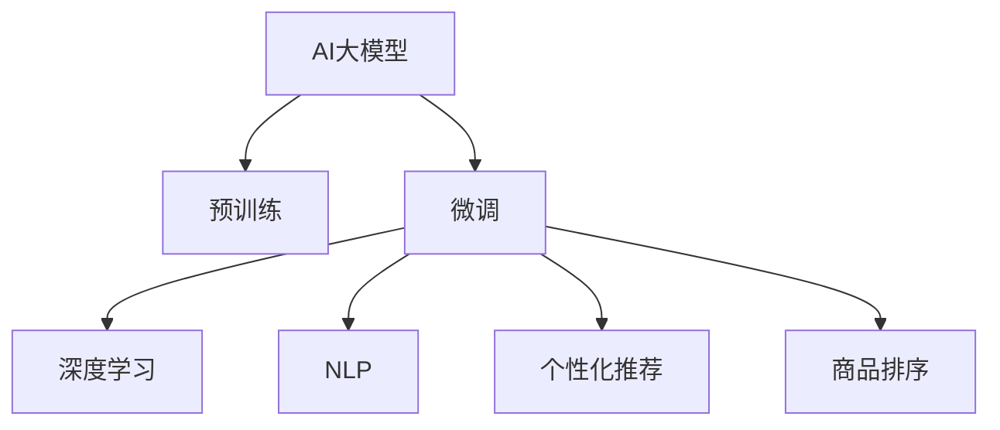

                 

# 电商平台搜索推荐系统的AI 大模型应用：提高系统效率、准确率与多样性

> 关键词：AI大模型, 搜索推荐系统, 电商平台, 深度学习, 自然语言处理, 个性化推荐

## 1. 背景介绍

在快速发展的数字经济时代，电商平台已成为用户获取商品信息、完成交易的重要渠道。然而，面对海量商品和用户数据的挑战，传统基于规则的推荐系统已无法满足用户个性化和多样化的需求。近年来，基于深度学习的AI推荐系统在电商平台中得到了广泛应用，特别是在推荐商品排序、个性化搜索推荐等方面，大幅提升了用户体验和平台转化率。随着大模型技术的发展，AI推荐系统已进入新阶段，利用预训练语言模型进行微调，可以有效提高推荐系统的效率、准确率和多样性。

## 2. 核心概念与联系

### 2.1 核心概念概述

为更好地理解AI 大模型在电商平台搜索推荐系统中的应用，本节将介绍几个密切相关的核心概念：

- **AI大模型**：以自回归（如GPT）或自编码（如BERT）模型为代表的大规模预训练语言模型。通过在大规模无标签文本语料上进行预训练，学习通用的语言表示，具备强大的语言理解和生成能力。
- **预训练**：指在大规模无标签文本语料上，通过自监督学习任务训练通用语言模型的过程。常见的预训练任务包括言语建模、遮挡语言模型等。
- **微调**：指在预训练模型的基础上，使用下游任务的少量标注数据，通过有监督学习优化模型在特定任务上的性能。通常只需要调整顶层分类器或解码器，并以较小的学习率更新全部或部分的模型参数。
- **深度学习**：通过构建神经网络模型，利用数据驱动的方式进行模式识别、决策制定等任务的技术，已在推荐系统中得到广泛应用。
- **自然语言处理（NLP）**：涉及对自然语言的理解和生成，是构建智能推荐系统的关键技术之一。
- **个性化推荐**：根据用户的历史行为和属性，推荐用户可能感兴趣的商品或内容，提升用户体验和平台转化率。
- **商品排序**：对搜索结果按照相关性、热度、价格等维度进行排序，使用户能快速找到满意的商品。

这些核心概念之间的逻辑关系可以通过以下Mermaid流程图来展示：



这个流程图展示了大模型的核心概念及其之间的关系：

1. 大模型通过预训练获得基础能力。
2. 微调是对预训练模型进行任务特定的优化，可以实现更精准的推荐和排序。
3. 深度学习和NLP技术使大模型能够理解自然语言，提取特征进行推荐。
4. 个性化推荐和商品排序是具体的应用场景，通过微调得到优化模型。

## 3. 核心算法原理 & 具体操作步骤

### 3.1 算法原理概述

基于深度学习的电商平台搜索推荐系统，通常包括如下步骤：

1. **数据收集与处理**：收集用户的历史行为数据、商品特征、搜索记录等，并进行清洗、去重、归一化等预处理。
2. **特征工程**：将原始数据转化为模型的输入特征，通常包括商品类别、价格、用户画像等。
3. **模型训练**：使用深度学习模型进行训练，常用的模型包括DNN、RNN、LSTM等。
4. **模型评估**：在验证集上评估模型性能，常用的指标包括准确率、召回率、F1值等。
5. **模型优化**：根据评估结果进行超参数调优、模型结构调整等，进一步提升模型效果。

在推荐系统中，大模型的应用通常分为预训练和微调两个阶段：

1. **预训练**：在大规模语料库上对模型进行预训练，学习通用的语言表示。例如，BERT模型通过掩码语言模型任务进行预训练。
2. **微调**：在具体推荐场景中，对预训练模型进行微调，适配特定的推荐任务。例如，在大规模商品推荐数据上，微调BERT模型，学习商品与用户间的相似性。

### 3.2 算法步骤详解

**Step 1: 准备预训练模型和数据集**
- 选择合适的预训练语言模型，如BERT、GPT等。
- 准备推荐系统的训练数据集，包括用户行为、商品信息等，划分为训练集、验证集和测试集。

**Step 2: 设计任务适配层**
- 根据推荐任务类型，设计适合的输出层和损失函数。
- 对于推荐排序任务，通常使用CTC损失函数；对于个性化推荐，通常使用交叉熵损失函数。

**Step 3: 设置微调超参数**
- 选择合适的优化算法及其参数，如Adam、SGD等，设置学习率、批大小、迭代轮数等。
- 设置正则化技术及强度，包括权重衰减、Dropout、Early Stopping等。
- 确定冻结预训练参数的策略，如仅微调顶层，或全部参数都参与微调。

**Step 4: 执行梯度训练**
- 将训练集数据分批次输入模型，前向传播计算损失函数。
- 反向传播计算参数梯度，根据设定的优化算法和学习率更新模型参数。
- 周期性在验证集上评估模型性能，根据性能指标决定是否触发Early Stopping。
- 重复上述步骤直至满足预设的迭代轮数或Early Stopping条件。

**Step 5: 测试和部署**
- 在测试集上评估微调后模型的性能，对比微调前后的指标提升。
- 使用微调后的模型对新商品进行推荐排序，集成到实际的应用系统中。

### 3.3 算法优缺点

基于深度学习的电商平台搜索推荐系统具有以下优点：
1. 能处理大规模数据：深度学习模型能自动学习数据中的复杂关系，适用于电商平台上数以亿计的商品和用户数据。
2. 效果显著：在大规模数据上进行微调，推荐系统可以显著提升推荐准确率和多样性。
3. 模型可扩展性强：深度学习模型容易进行扩展，适用于不同规模的电商平台。

但同时，该方法也存在以下局限性：
1. 计算资源需求大：深度学习模型通常需要大规模的计算资源，如GPU、TPU等。
2. 模型训练时间长：在大规模数据上进行微调，需要较长的训练时间。
3. 模型复杂度高：深度学习模型结构复杂，难以解释，难以调试。
4. 对抗攻击脆弱：深度学习模型容易受到对抗样本攻击，生成不准确推荐。

尽管存在这些局限性，但深度学习模型在推荐系统中的应用已成为业界标准，并在多个电商平台中取得优异效果。未来相关研究的重点在于如何进一步降低计算资源需求，提高模型训练效率，同时兼顾可解释性和安全性等因素。

### 3.4 算法应用领域

基于深度学习的推荐系统，已经在电商平台的搜索推荐、个性化推荐、商品排序等任务上取得了优异的效果，成为电商技术落地的重要手段。

1. **搜索推荐**：通过用户输入的关键词，推荐相关的商品。使用预训练语言模型进行微调，学习关键词和商品间的语义关系，提高推荐的准确性和多样性。
2. **个性化推荐**：根据用户的历史行为和属性，推荐用户可能感兴趣的商品。使用预训练语言模型进行微调，学习用户画像和商品特征，提升个性化推荐的精度。
3. **商品排序**：对搜索结果按照相关性、热度、价格等维度进行排序，使用预训练语言模型进行微调，学习排序特征，提高排序效果。

除了这些经典任务外，基于深度学习的推荐系统还被创新性地应用到更多场景中，如广告推荐、用户画像生成等，为电商平台带来了新的技术突破。

## 4. 数学模型和公式 & 详细讲解  
### 4.1 数学模型构建

本节将使用数学语言对基于深度学习的电商平台搜索推荐系统进行更加严格的刻画。

记推荐系统为 $R_{\theta}$，其中 $\theta$ 为模型参数。假设训练集为 $D=\{(x_i,y_i)\}_{i=1}^N, x_i \in \mathcal{X}, y_i \in \mathcal{Y}$。

定义推荐系统 $R_{\theta}$ 在数据样本 $(x,y)$ 上的损失函数为 $\ell(R_{\theta}(x),y)$，则在数据集 $D$ 上的经验风险为：

$$
\mathcal{L}(\theta) = \frac{1}{N} \sum_{i=1}^N \ell(R_{\theta}(x_i),y_i)
$$

其中，常用的损失函数包括交叉熵损失、均方误差损失等。

### 4.2 公式推导过程

以下我们以推荐排序任务为例，推导交叉熵损失函数及其梯度的计算公式。

假设推荐系统 $R_{\theta}$ 在输入 $x$ 上的输出为 $\hat{y} = R_{\theta}(x) \in [0,1]$，表示商品的相关性概率。真实标签 $y \in \{1,0\}$。则推荐排序任务的交叉熵损失函数定义为：

$$
\ell(R_{\theta}(x),y) = -[y\log \hat{y} + (1-y)\log (1-\hat{y})]
$$

将其代入经验风险公式，得：

$$
\mathcal{L}(\theta) = -\frac{1}{N}\sum_{i=1}^N [y_i\log R_{\theta}(x_i)+(1-y_i)\log(1-R_{\theta}(x_i))]
$$

根据链式法则，损失函数对参数 $\theta_k$ 的梯度为：

$$
\frac{\partial \mathcal{L}(\theta)}{\partial \theta_k} = -\frac{1}{N}\sum_{i=1}^N (\frac{y_i}{R_{\theta}(x_i)}-\frac{1-y_i}{1-R_{\theta}(x_i)}) \frac{\partial R_{\theta}(x_i)}{\partial \theta_k}
$$

其中 $\frac{\partial R_{\theta}(x_i)}{\partial \theta_k}$ 可进一步递归展开，利用自动微分技术完成计算。

### 4.3 案例分析与讲解

假设推荐系统为 $R_{\theta} = \text{BERT}_{\text{recommend}}$，其中 $\theta$ 为微调后的BERT模型参数。训练数据集为电商平台用户行为数据，包括用户的点击、浏览、购买等行为记录。假设每个用户有 $n$ 个历史行为，每个行为有 $m$ 个特征，模型为深度神经网络。

模型的输入为 $x = (x_1, x_2, ..., x_n)$，其中 $x_i = (f_1^i, f_2^i, ..., f_m^i)$ 为第 $i$ 个行为的 $m$ 个特征向量。

模型的输出为 $\hat{y} = R_{\theta}(x)$，其中 $\hat{y} \in [0,1]$ 为商品的相关性概率。

根据上述公式，计算损失函数 $\mathcal{L}(\theta)$ 及梯度 $\frac{\partial \mathcal{L}(\theta)}{\partial \theta_k}$。

## 5. 项目实践：代码实例和详细解释说明
### 5.1 开发环境搭建

在进行深度学习推荐系统开发前，我们需要准备好开发环境。以下是使用Python进行TensorFlow开发的环境配置流程：

1. 安装Anaconda：从官网下载并安装Anaconda，用于创建独立的Python环境。

2. 创建并激活虚拟环境：
```bash
conda create -n tf-env python=3.8 
conda activate tf-env
```

3. 安装TensorFlow：根据CUDA版本，从官网获取对应的安装命令。例如：
```bash
conda install tensorflow
```

4. 安装各类工具包：
```bash
pip install numpy pandas scikit-learn matplotlib tqdm jupyter notebook ipython
```

完成上述步骤后，即可在`tf-env`环境中开始深度学习推荐系统的开发。

### 5.2 源代码详细实现

这里我们以电商平台推荐排序任务为例，给出使用TensorFlow进行BERT微调的完整代码实现。

首先，定义推荐排序任务的数据处理函数：

```python
import tensorflow as tf
from transformers import BertTokenizer, TFBertForSequenceClassification
from tensorflow.keras.layers import Input, Dense, Flatten
from tensorflow.keras.models import Model
from tensorflow.keras.optimizers import Adam

class RecommendationDataset(tf.keras.utils.Sequence):
    def __init__(self, data, tokenizer, batch_size=32):
        self.data = data
        self.tokenizer = tokenizer
        self.batch_size = batch_size
        
    def __len__(self):
        return len(self.data) // self.batch_size
    
    def __getitem__(self, idx):
        input_ids, labels = self.data[idx]
        encoding = self.tokenizer(input_ids, truncation=True, padding='max_length', max_length=512, return_tensors='tf')
        input_ids = encoding['input_ids']
        attention_mask = encoding['attention_mask']
        
        inputs = {
            'input_ids': input_ids,
            'attention_mask': attention_mask,
        }
        targets = labels
        
        return inputs, targets

# 数据集
train_dataset = RecommendationDataset(train_data, tokenizer, batch_size=64)
val_dataset = RecommendationDataset(val_data, tokenizer, batch_size=64)
test_dataset = RecommendationDataset(test_data, tokenizer, batch_size=64)

# 超参数设置
num_labels = 1
learning_rate = 2e-5
epochs = 5

# 构建模型
model = TFBertForSequenceClassification.from_pretrained('bert-base-uncased', num_labels=num_labels)
inputs = tf.keras.layers.Input(shape=(512,))
outputs = model(inputs)

# 输出层
x = Dense(512, activation='relu')(inputs)
x = Dense(512, activation='relu')(x)
x = Dense(num_labels, activation='sigmoid')(x)

# 定义模型
recommendation_model = Model(inputs=inputs, outputs=x)

# 编译模型
recommendation_model.compile(optimizer=Adam(learning_rate=learning_rate), loss='binary_crossentropy', metrics=['accuracy'])

# 训练模型
history = recommendation_model.fit(train_dataset, epochs=epochs, validation_data=val_dataset, verbose=2)
```

然后，评估模型的性能：

```python
test_loss, test_acc = recommendation_model.evaluate(test_dataset, verbose=2)
print('Test accuracy:', test_acc)
```

以上就是使用TensorFlow进行BERT微调的完整代码实现。可以看到，得益于TensorFlow和Transformers库的强大封装，我们可以用相对简洁的代码完成推荐系统的构建。

### 5.3 代码解读与分析

让我们再详细解读一下关键代码的实现细节：

**RecommendationDataset类**：
- `__init__`方法：初始化数据集、分词器等组件，并将训练数据转化为模型所需的输入输出格式。
- `__len__`方法：返回数据集的长度，方便模型迭代训练。
- `__getitem__`方法：对单个样本进行处理，将文本输入转换为模型可用的输入特征。

**BertTokenizer**：
- 用于将输入的文本数据转换为模型所需的token ids、attention mask等格式。

**输入层和输出层**：
- 输入层：使用TensorFlow的Input层构建，接收模型的输入特征。
- 输出层：使用Dense层构建，对模型输出的相关性概率进行计算，并通过Sigmoid函数进行归一化。

**模型构建与编译**：
- 模型构建：使用BertTokenizer分词，并通过TFTF BertForSequenceClassification构建基础BERT模型。
- 模型编译：使用Adam优化器进行优化，设置交叉熵损失函数。

**训练模型**：
- 使用fit方法进行模型训练，设置训练轮数、验证集等超参数。

**评估模型**：
- 使用evaluate方法在测试集上评估模型性能，输出准确率等指标。

可以看出，TensorFlow和Transformers库使得深度学习推荐系统的构建变得简洁高效。开发者可以将更多精力放在数据处理、模型改进等高层逻辑上，而不必过多关注底层的实现细节。

当然，工业级的系统实现还需考虑更多因素，如模型的保存和部署、超参数的自动搜索、更灵活的任务适配层等。但核心的深度学习推荐系统构建流程基本与此类似。

## 6. 实际应用场景
### 6.1 智能客服系统

基于深度学习的搜索推荐系统，可以应用于智能客服系统的构建。传统客服往往需要配备大量人力，高峰期响应缓慢，且一致性和专业性难以保证。而使用推荐排序技术，可以7x24小时不间断服务，快速响应客户咨询，用自然流畅的语言解答各类常见问题。

在技术实现上，可以收集企业内部的历史客服对话记录，将问题和最佳答复构建成监督数据，在此基础上对BERT模型进行微调。微调后的模型能够自动理解用户意图，匹配最合适的答案模板进行回复。对于客户提出的新问题，还可以接入检索系统实时搜索相关内容，动态组织生成回答。如此构建的智能客服系统，能大幅提升客户咨询体验和问题解决效率。

### 6.2 金融舆情监测

金融机构需要实时监测市场舆论动向，以便及时应对负面信息传播，规避金融风险。传统的人工监测方式成本高、效率低，难以应对网络时代海量信息爆发的挑战。基于深度学习的文本分类和情感分析技术，为金融舆情监测提供了新的解决方案。

具体而言，可以收集金融领域相关的新闻、报道、评论等文本数据，并对其进行主题标注和情感标注。在此基础上对BERT模型进行微调，使其能够自动判断文本属于何种主题，情感倾向是正面、中性还是负面。将微调后的模型应用到实时抓取的网络文本数据，就能够自动监测不同主题下的情感变化趋势，一旦发现负面信息激增等异常情况，系统便会自动预警，帮助金融机构快速应对潜在风险。

### 6.3 个性化推荐系统

当前的推荐系统往往只依赖用户的历史行为数据进行物品推荐，无法深入理解用户的真实兴趣偏好。基于深度学习的推荐系统可以更好地挖掘用户行为背后的语义信息，从而提供更精准、多样的推荐内容。

在实践中，可以收集用户浏览、点击、评论、分享等行为数据，提取和用户交互的物品标题、描述、标签等文本内容。将文本内容作为模型输入，用户的后续行为（如是否点击、购买等）作为监督信号，在此基础上微调BERT模型。微调后的模型能够从文本内容中准确把握用户的兴趣点。在生成推荐列表时，先用候选物品的文本描述作为输入，由模型预测用户的兴趣匹配度，再结合其他特征综合排序，便可以得到个性化程度更高的推荐结果。

### 6.4 未来应用展望

随着深度学习模型的不断发展，基于深度学习的推荐系统将在更多领域得到应用，为传统行业带来变革性影响。

在智慧医疗领域，基于深度学习推荐系统的医疗问答、病历分析、药物研发等应用将提升医疗服务的智能化水平，辅助医生诊疗，加速新药开发进程。

在智能教育领域，微调技术可应用于作业批改、学情分析、知识推荐等方面，因材施教，促进教育公平，提高教学质量。

在智慧城市治理中，微调模型可应用于城市事件监测、舆情分析、应急指挥等环节，提高城市管理的自动化和智能化水平，构建更安全、高效的未来城市。

此外，在企业生产、社会治理、文娱传媒等众多领域，基于深度学习的推荐系统也将不断涌现，为NLP技术带来新的突破。相信随着模型的日益成熟，推荐系统必将在更广阔的应用领域大放异彩。

## 7. 工具和资源推荐
### 7.1 学习资源推荐

为了帮助开发者系统掌握深度学习推荐系统的理论基础和实践技巧，这里推荐一些优质的学习资源：

1. 《深度学习》（Ian Goodfellow）：全面介绍深度学习的基本概念和核心算法，涵盖监督学习、非监督学习、生成模型等。
2. 《推荐系统实践》（项亮）：深入讲解推荐系统的构建与优化，提供实用的推荐系统开发经验和案例。
3. CS231n《深度学习计算机视觉》课程：斯坦福大学开设的经典课程，涵盖深度学习在图像识别、目标检测等任务中的应用。
4. Kaggle：全球最大的数据科学竞赛平台，提供丰富的数据集和模型，助力机器学习实践。
5. GitHub：开源社区，包含大量深度学习推荐系统的代码实现和项目，便于学习和复现。

通过对这些资源的学习实践，相信你一定能够快速掌握深度学习推荐系统的精髓，并用于解决实际的推荐问题。
###  7.2 开发工具推荐

高效的开发离不开优秀的工具支持。以下是几款用于深度学习推荐系统开发的常用工具：

1. TensorFlow：由Google主导开发的开源深度学习框架，生产部署方便，适合大规模工程应用。
2. PyTorch：基于Python的开源深度学习框架，灵活动态的计算图，适合快速迭代研究。
3. Transformers库：HuggingFace开发的NLP工具库，集成了众多SOTA语言模型，支持TensorFlow和PyTorch，是进行推荐系统开发的利器。
4. Weights & Biases：模型训练的实验跟踪工具，可以记录和可视化模型训练过程中的各项指标，方便对比和调优。
5. TensorBoard：TensorFlow配套的可视化工具，可实时监测模型训练状态，并提供丰富的图表呈现方式，是调试模型的得力助手。

合理利用这些工具，可以显著提升深度学习推荐系统的开发效率，加快创新迭代的步伐。

### 7.3 相关论文推荐

深度学习推荐系统的发展源于学界的持续研究。以下是几篇奠基性的相关论文，推荐阅读：

1. Factorization Machines: Scalable Machine Learning for Predictive Modeling（Guan et al., 2009）：提出因子分解机，一种高效的矩阵分解模型，广泛应用于推荐排序任务。
2. Deep Neural Networks for Multi-Task Learning（Dozat & Willsky, 2013）：提出多任务学习，通过共享权重的方式，提升推荐系统的泛化能力。
3. Implicit Feature Modulation for Recommender Systems（He et al., 2016）：提出隐式特征调制模型，通过集成多种特征，提升推荐系统的准确性。
4. Neural Collaborative Filtering（Kim et al., 2014）：提出神经协同过滤模型，通过神经网络进行推荐排序。
5. Multi-Task Deep Learning for Personalized Recommendations（Gao et al., 2019）：提出多任务深度学习，通过联合训练的方式，提升推荐系统的多样性。

这些论文代表了大模型推荐系统的发展脉络。通过学习这些前沿成果，可以帮助研究者把握学科前进方向，激发更多的创新灵感。

## 8. 总结：未来发展趋势与挑战

### 8.1 总结

本文对基于深度学习的电商平台搜索推荐系统进行了全面系统的介绍。首先阐述了深度学习推荐系统在电商平台中的作用，明确了微调在大模型推荐系统中的重要性。其次，从原理到实践，详细讲解了深度学习推荐系统的数学原理和关键步骤，给出了推荐排序任务的完整代码实例。同时，本文还广泛探讨了推荐系统在智能客服、金融舆情、个性化推荐等多个行业领域的应用前景，展示了深度学习推荐系统的巨大潜力。此外，本文精选了推荐系统的各类学习资源，力求为读者提供全方位的技术指引。

通过本文的系统梳理，可以看到，基于深度学习的推荐系统在电商平台中发挥着越来越重要的作用，显著提升了用户体验和平台转化率。未来，伴随深度学习模型和微调方法的持续演进，推荐系统必将在更广阔的应用领域大放异彩。

### 8.2 未来发展趋势

展望未来，深度学习推荐系统将呈现以下几个发展趋势：

1. 推荐模型的多样性增强。推荐系统将不再局限于基于用户行为的历史数据，将引入更多外部的先验知识，如知识图谱、逻辑规则等，提升推荐模型的表现。
2. 推荐模型的智能性提升。推荐系统将引入更多的智能技术，如因果推断、自适应学习等，提升推荐模型的公平性、鲁棒性和泛化能力。
3. 推荐模型的交互性增强。推荐系统将引入更多的用户交互数据，如点击反馈、评分等，提升推荐模型的个性化水平。
4. 推荐系统的实时性提升。推荐系统将引入更多的实时数据，如实时点击、实时评价等，提升推荐模型的实时响应能力。
5. 推荐系统的跨域性增强。推荐系统将引入更多的跨领域数据，提升推荐模型的通用性和适用性。

这些趋势凸显了深度学习推荐系统的广阔前景。这些方向的探索发展，必将进一步提升推荐系统的性能和应用范围，为电商平台的智能化、个性化转型提供新的动力。

### 8.3 面临的挑战

尽管深度学习推荐系统已经取得了瞩目成就，但在迈向更加智能化、普适化应用的过程中，它仍面临着诸多挑战：

1. 数据质量问题。推荐系统需要大量高质量的用户行为数据，但实际应用中往往难以获取完整、准确的数据，数据质量问题成为制约推荐系统效果的瓶颈。如何提高数据质量，提升数据收集效率，将是重要的研究方向。
2. 模型复杂性问题。深度学习模型结构复杂，难以解释，难以调试。如何降低模型的复杂度，提升模型的可解释性，将是重要的优化方向。
3. 对抗攻击问题。推荐系统容易受到对抗样本攻击，生成不准确推荐。如何提高推荐系统的鲁棒性，提升其对抗攻击能力，将是重要的研究方向。
4. 隐私保护问题。推荐系统需要收集大量的用户隐私数据，如何在保护用户隐私的同时，提升推荐系统的性能，将是重要的研究方向。
5. 跨领域推荐问题。不同领域的数据存在较大的差异，如何将不同领域的数据进行融合，提升跨领域推荐系统的表现，将是重要的研究方向。

这些挑战凸显了深度学习推荐系统的复杂性。解决这些挑战，将是大模型推荐系统走向成熟的必由之路。

### 8.4 研究展望

面对深度学习推荐系统所面临的种种挑战，未来的研究需要在以下几个方面寻求新的突破：

1. 探索基于知识图谱的推荐方法。将知识图谱与深度学习模型结合，提升推荐系统的跨领域推荐能力。
2. 研究基于因果推断的推荐方法。通过引入因果推断模型，提升推荐系统的公平性、鲁棒性和泛化能力。
3. 引入自适应学习机制。通过引入自适应学习机制，提升推荐系统的实时响应能力和个性化水平。
4. 研究基于对抗学习的推荐方法。通过引入对抗学习机制，提升推荐系统的鲁棒性和抗攻击能力。
5. 引入多模态数据融合技术。将视觉、语音、文本等多模态数据进行融合，提升推荐系统的表现。
6. 研究推荐系统的可解释性。通过引入可解释性技术，提升推荐系统的透明度和可解释性。

这些研究方向的探索，必将引领深度学习推荐系统迈向更高的台阶，为构建智能、安全、可靠、公平的推荐系统提供新的思路。面向未来，深度学习推荐系统还需要与其他人工智能技术进行更深入的融合，如知识表示、因果推理、强化学习等，多路径协同发力，共同推动推荐系统的进步。只有勇于创新、敢于突破，才能不断拓展推荐系统的边界，让智能技术更好地造福人类社会。

## 9. 附录：常见问题与解答

**Q1：深度学习推荐系统是否适用于所有电商平台？**

A: 深度学习推荐系统在大多数电商平台上都能取得不错的效果，特别是对于数据量较大的平台。但对于一些数据量较小、用户行为数据不完整的平台，需要采用更复杂的推荐模型，或结合外部数据进行改进。

**Q2：如何选择深度学习模型进行推荐？**

A: 深度学习模型有多种，如DNN、RNN、LSTM等。对于推荐排序任务，通常选择DNN或RNN模型。对于个性化推荐任务，通常选择DNN或LSTM模型。在选择模型时，需要考虑数据规模、任务类型、性能要求等因素。

**Q3：如何优化深度学习推荐系统？**

A: 优化深度学习推荐系统的方法包括：
1. 数据增强：通过数据扩充、数据合成等方式，增加训练数据的多样性。
2. 正则化：使用L2正则、Dropout等正则化技术，避免模型过拟合。
3. 超参数调优：通过网格搜索、随机搜索等方法，优化模型参数。
4. 模型融合：通过集成多个模型的预测结果，提升推荐系统的准确性和多样性。

这些方法需要根据具体任务和数据特点进行灵活组合。只有在数据、模型、训练、推理等各环节进行全面优化，才能最大限度地发挥深度学习推荐系统的威力。

**Q4：如何评估深度学习推荐系统的性能？**

A: 评估深度学习推荐系统的性能，常用的指标包括准确率、召回率、F1值、NDCG、HR等。对于推荐排序任务，常用指标为NDCG和HR。对于个性化推荐任务，常用指标为准确率和召回率。

**Q5：如何处理深度学习推荐系统中的冷启动问题？**

A: 冷启动问题是指新用户或新商品没有足够的行为数据，无法使用传统推荐方法进行推荐。对于冷启动问题，可以采用以下方法：
1. 引入先验知识：通过知识图谱、逻辑规则等，提升推荐系统的泛化能力。
2. 引入相似性模型：通过计算新用户/商品与其他用户/商品之间的相似性，推荐与其相似的用户/商品。
3. 引入推荐引擎级联模型：将推荐引擎分为多个层次，逐步缩小推荐范围。

这些方法可以结合使用，提升推荐系统的表现。

---

作者：禅与计算机程序设计艺术 / Zen and the Art of Computer Programming

