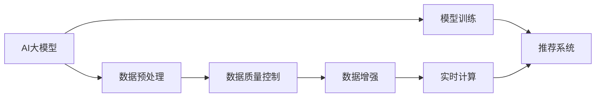

                 

# 电商平台的AI 大模型实践：搜索推荐系统是核心，数据质量控制与处理效率

> 关键词：AI大模型, 搜索推荐系统, 数据质量控制, 数据处理效率, 电商, 模型训练, 数据增强, 实时计算

## 1. 背景介绍

随着人工智能技术在电商领域的深度应用，搜索推荐系统已经成为电商平台不可或缺的核心能力。通过AI大模型的帮助，电商平台能够根据用户的浏览行为、购买历史、商品评价等数据，精准地推荐个性化商品，提升用户体验和交易转化率。然而，数据质量问题和数据处理效率瓶颈，始终是搜索推荐系统面临的重要挑战。

本文将深入探讨AI大模型在电商搜索推荐系统中的应用，从核心算法原理到具体的操作步骤，系统分析数据质量控制与处理效率的实践方法。通过详实的数据模型和代码实例，力求为读者提供全面、实用的技术指引。

## 2. 核心概念与联系

### 2.1 核心概念概述

为更好地理解AI大模型在电商搜索推荐系统中的应用，本节将介绍几个密切相关的核心概念：

- AI大模型：指基于深度学习算法，通过大规模数据集预训练得到的通用语言模型或视觉模型，如BERT、GPT-3、DALL-E等。
- 搜索推荐系统：利用机器学习和AI大模型对用户行为和商品属性进行建模分析，提供精准的商品推荐，提升电商平台的转化率和用户满意度。
- 数据质量控制：确保数据源的准确性、完整性和一致性，通过清洗、去重、归一化等方法，提高数据质量。
- 数据处理效率：在数据量庞大的情况下，如何高效、实时地处理数据，减少计算资源消耗，是提升系统性能的关键。
- 模型训练：通过数据训练AI大模型，使其能够自动学习和提取用户行为特征、商品属性等关键信息，并用于推荐系统的构建和优化。

### 2.2 核心概念原理和架构的 Mermaid 流程图



这个流程图展示了大模型在搜索推荐系统中的应用流程：

1. AI大模型通过大规模无标签数据进行预训练。
2. 收集电商平台的数据，包括用户行为、商品属性等。
3. 对数据进行清洗、去重、归一化等质量控制措施，确保数据可靠性。
4. 对处理后的数据进行数据增强，提高模型的泛化能力。
5. 使用训练好的模型进行推荐系统构建，通过实时计算为用户提供个性化推荐。

## 3. 核心算法原理 & 具体操作步骤

### 3.1 算法原理概述

基于AI大模型的电商搜索推荐系统，本质上是利用深度学习算法进行机器学习和预测的过程。其核心在于：

- 通过大规模数据集预训练AI大模型，使其具备强大的特征提取和表示学习能力。
- 利用预训练模型对电商平台的数据进行微调，提取用户行为和商品属性的关键特征。
- 将微调后的模型用于推荐系统的构建，通过实时计算实现精准推荐。

### 3.2 算法步骤详解

#### 3.2.1 数据预处理

电商平台的推荐系统需要大量的用户行为数据和商品属性数据。数据预处理是构建推荐系统的第一步，主要包括以下几个步骤：

1. 数据采集：从电商平台的数据库、API等渠道收集用户行为数据和商品属性数据。
2. 数据清洗：去除重复、错误、无关的数据，确保数据的一致性和完整性。
3. 数据归一化：将不同类型的数据转换为标准格式，便于模型处理。
4. 数据增强：通过数据增强技术，如数据扩充、回译、对抗样本等，提高模型的泛化能力。

#### 3.2.2 模型训练

模型训练是推荐系统的核心环节，主要包括以下几个步骤：

1. 选择合适的AI大模型：根据电商平台的推荐需求，选择适合的预训练模型，如BERT、GPT-3、DALL-E等。
2. 微调模型：使用电商平台的数据，对预训练模型进行微调，使其能够准确提取用户行为和商品属性的关键特征。
3. 训练参数：设定合适的超参数，如学习率、批大小、迭代轮数等，确保模型能够收敛到最优状态。

#### 3.2.3 推荐系统构建

推荐系统的构建是AI大模型应用的关键环节，主要包括以下几个步骤：

1. 构建推荐引擎：将微调后的AI大模型与电商平台的数据接口进行集成，构建推荐引擎。
2. 实时计算：在用户行为数据产生时，实时计算推荐结果，并返回给用户。
3. 反馈机制：根据用户的反馈，不断调整推荐模型，提升推荐效果。

### 3.3 算法优缺点

基于AI大模型的电商搜索推荐系统具有以下优点：

1. 精准推荐：通过AI大模型对用户行为和商品属性的全面分析，能够提供精准的个性化推荐，提升用户体验。
2. 泛化能力强：利用大规模数据集预训练的AI大模型，具备较强的泛化能力，能够在不同场景下表现出色。
3. 实时性高：基于实时计算，能够快速响应用户行为，提供即时的推荐服务。

然而，该方法也存在一些缺点：

1. 数据依赖度高：推荐系统的效果依赖于数据的质量和数量，数据的收集、处理和清洗成本较高。
2. 计算资源消耗大：AI大模型的训练和实时计算需要大量的计算资源，系统性能瓶颈较大。
3. 模型复杂度高：AI大模型的参数量和计算复杂度较高，难以在低端设备上部署。
4. 透明性不足：AI大模型的决策过程缺乏可解释性，用户难以理解推荐逻辑。

### 3.4 算法应用领域

AI大模型在电商搜索推荐系统中的应用，已经在各大电商平台得到了广泛应用，包括：

1. 商品推荐：根据用户的历史浏览和购买行为，提供个性化的商品推荐。
2. 价格预测：利用AI大模型对商品价格进行预测，帮助电商平台进行价格优化。
3. 库存管理：通过AI大模型对用户需求进行预测，优化商品库存。
4. 内容推荐：利用AI大模型对商品评价、用户评论等文本数据进行情感分析，提供内容推荐服务。

除了这些经典应用外，AI大模型还被创新性地应用于图像识别、语音识别、语音合成等领域，为电商平台的多样化应用提供了新的可能性。

## 4. 数学模型和公式 & 详细讲解 & 举例说明

### 4.1 数学模型构建

基于AI大模型的电商搜索推荐系统，通常采用以下数学模型进行建模：

设电商平台有用户 $U$ 和商品 $I$，用户行为表示为 $X=(u_i,t_i)$，其中 $u_i$ 表示用户编号，$t_i$ 表示用户行为类型，如浏览、购买、评价等。商品属性表示为 $P=(i,p_i)$，其中 $i$ 表示商品编号，$p_i$ 表示商品属性，如颜色、大小、价格等。

设电商平台的数据集为 $D=\{(X_i,P_i)\}_{i=1}^N$，其中 $X_i$ 为用户行为数据，$P_i$ 为商品属性数据。通过预训练AI大模型 $M_{\theta}$，对用户行为和商品属性进行特征提取和表示学习，得到用户行为特征向量 $h_u(X_i)$ 和商品属性特征向量 $h_p(P_i)$。

推荐模型的目标是预测用户对商品 $i$ 的评分 $r$，可以通过以下公式进行建模：

$$
r_{ui} = f(h_u(X_i), h_p(P_i))
$$

其中 $f$ 为推荐模型的映射函数。

### 4.2 公式推导过程

推荐模型的核心在于用户行为特征 $h_u(X_i)$ 和商品属性特征 $h_p(P_i)$ 的表示学习。设预训练AI大模型 $M_{\theta}$ 对输入 $x$ 的表示为 $M_{\theta}(x)$，则用户行为特征 $h_u(X_i)$ 和商品属性特征 $h_p(P_i)$ 可以通过以下公式进行计算：

$$
h_u(X_i) = M_{\theta}(x_i)
$$
$$
h_p(P_i) = M_{\theta}(p_i)
$$

其中 $x_i$ 为预处理后的用户行为数据，$p_i$ 为预处理后的商品属性数据。

通过预训练AI大模型 $M_{\theta}$，用户行为特征 $h_u(X_i)$ 和商品属性特征 $h_p(P_i)$ 能够自动学习到用户行为和商品属性的关键信息，用于推荐模型的构建和优化。

### 4.3 案例分析与讲解

以商品推荐为例，假设有 $N$ 个用户，每个用户浏览了 $M$ 个商品，每个商品有 $K$ 个属性。设电商平台的数据集为 $D=\{(X_i,P_i)\}_{i=1}^N$，其中 $X_i$ 为用户行为数据，$P_i$ 为商品属性数据。

通过对用户行为数据 $X_i$ 和商品属性数据 $P_i$ 进行预处理和特征提取，得到用户行为特征向量 $h_u(X_i)$ 和商品属性特征向量 $h_p(P_i)$。

通过预训练AI大模型 $M_{\theta}$，对用户行为特征 $h_u(X_i)$ 和商品属性特征 $h_p(P_i)$ 进行表示学习，得到用户行为表示 $u_i$ 和商品属性表示 $p_i$：

$$
u_i = M_{\theta}(h_u(X_i))
$$
$$
p_i = M_{\theta}(h_p(P_i))
$$

通过相似度计算，得到用户 $u_i$ 和商品 $p_i$ 之间的相似度 $s_{ui}$：

$$
s_{ui} = \cos(u_i, p_i)
$$

最终，推荐模型的评分 $r_{ui}$ 可以通过以下公式进行计算：

$$
r_{ui} = \sum_{k=1}^K w_k s_{ui_k}^{t_k}
$$

其中 $w_k$ 为商品属性 $k$ 的权重，$t_k$ 为相似度指数。

通过上述模型，电商平台可以根据用户行为和商品属性，预测用户对商品的评分，并根据评分进行推荐排序，提供个性化的商品推荐。

## 5. 项目实践：代码实例和详细解释说明

### 5.1 开发环境搭建

在进行AI大模型在电商搜索推荐系统中的项目实践前，我们需要准备好开发环境。以下是使用Python进行PyTorch开发的环境配置流程：

1. 安装Anaconda：从官网下载并安装Anaconda，用于创建独立的Python环境。

2. 创建并激活虚拟环境：
```bash
conda create -n pytorch-env python=3.8 
conda activate pytorch-env
```

3. 安装PyTorch：根据CUDA版本，从官网获取对应的安装命令。例如：
```bash
conda install pytorch torchvision torchaudio cudatoolkit=11.1 -c pytorch -c conda-forge
```

4. 安装TensorBoard：
```bash
pip install tensorboard
```

5. 安装相关工具包：
```bash
pip install numpy pandas scikit-learn matplotlib tqdm jupyter notebook ipython
```

完成上述步骤后，即可在`pytorch-env`环境中开始项目实践。

### 5.2 源代码详细实现

下面以电商平台的商品推荐系统为例，给出使用PyTorch和Transformers库对BERT模型进行商品推荐微调的PyTorch代码实现。

首先，定义商品推荐的数据处理函数：

```python
from transformers import BertTokenizer
from torch.utils.data import Dataset
import torch

class RecommendationDataset(Dataset):
    def __init__(self, user_behaviors, product_attributes, tokenizer, max_len=128):
        self.user_behaviors = user_behaviors
        self.product_attributes = product_attributes
        self.tokenizer = tokenizer
        self.max_len = max_len
        
    def __len__(self):
        return len(self.user_behaviors)
    
    def __getitem__(self, item):
        user_behavior = self.user_behaviors[item]
        product_attributes = self.product_attributes[item]
        
        user_behavior = [(user_behavior, product_attributes)]
        encoded = self.tokenizer(user_behavior, return_tensors='pt', max_length=self.max_len, padding='max_length', truncation=True)
        input_ids = encoded['input_ids'][0]
        attention_mask = encoded['attention_mask'][0]
        
        return {'input_ids': input_ids, 
                'attention_mask': attention_mask,
                'labels': torch.tensor([user_behavior[-1]], dtype=torch.long)}
```

然后，定义模型和优化器：

```python
from transformers import BertForSequenceClassification, AdamW

model = BertForSequenceClassification.from_pretrained('bert-base-cased', num_labels=1)

optimizer = AdamW(model.parameters(), lr=2e-5)
```

接着，定义训练和评估函数：

```python
from torch.utils.data import DataLoader
from tqdm import tqdm
from sklearn.metrics import roc_auc_score

device = torch.device('cuda') if torch.cuda.is_available() else torch.device('cpu')
model.to(device)

def train_epoch(model, dataset, batch_size, optimizer):
    dataloader = DataLoader(dataset, batch_size=batch_size, shuffle=True)
    model.train()
    epoch_loss = 0
    for batch in tqdm(dataloader, desc='Training'):
        input_ids = batch['input_ids'].to(device)
        attention_mask = batch['attention_mask'].to(device)
        labels = batch['labels'].to(device)
        model.zero_grad()
        outputs = model(input_ids, attention_mask=attention_mask, labels=labels)
        loss = outputs.loss
        epoch_loss += loss.item()
        loss.backward()
        optimizer.step()
    return epoch_loss / len(dataloader)

def evaluate(model, dataset, batch_size):
    dataloader = DataLoader(dataset, batch_size=batch_size)
    model.eval()
    preds, labels = [], []
    with torch.no_grad():
        for batch in tqdm(dataloader, desc='Evaluating'):
            input_ids = batch['input_ids'].to(device)
            attention_mask = batch['attention_mask'].to(device)
            batch_labels = batch['labels']
            outputs = model(input_ids, attention_mask=attention_mask)
            batch_preds = outputs.logits.argmax(dim=1).to('cpu').tolist()
            batch_labels = batch_labels.to('cpu').tolist()
            for pred, label in zip(batch_preds, batch_labels):
                preds.append(pred)
                labels.append(label)
                
    return roc_auc_score(labels, preds)
```

最后，启动训练流程并在测试集上评估：

```python
epochs = 5
batch_size = 16

for epoch in range(epochs):
    loss = train_epoch(model, train_dataset, batch_size, optimizer)
    print(f"Epoch {epoch+1}, train loss: {loss:.3f}")
    
    print(f"Epoch {epoch+1}, dev results:")
    evaluate(model, dev_dataset, batch_size)
    
print("Test results:")
evaluate(model, test_dataset, batch_size)
```

以上就是使用PyTorch对BERT进行商品推荐系统微调的完整代码实现。可以看到，得益于Transformers库的强大封装，我们可以用相对简洁的代码完成BERT模型的加载和微调。

### 5.3 代码解读与分析

让我们再详细解读一下关键代码的实现细节：

**RecommendationDataset类**：
- `__init__`方法：初始化用户行为数据、商品属性数据、分词器等关键组件。
- `__len__`方法：返回数据集的样本数量。
- `__getitem__`方法：对单个样本进行处理，将用户行为数据和商品属性数据输入编码为token ids，同时将商品属性标签转换为数字标签。

**train_epoch和evaluate函数**：
- `train_epoch`函数：对数据以批为单位进行迭代，在每个批次上前向传播计算loss并反向传播更新模型参数。
- `evaluate`函数：在测试集上评估模型性能，输出AUC指标。

**训练流程**：
- 定义总的epoch数和batch size，开始循环迭代。
- 每个epoch内，先在训练集上训练，输出平均loss。
- 在验证集上评估，输出AUC指标。
- 所有epoch结束后，在测试集上评估，给出最终测试结果。

可以看到，PyTorch配合Transformers库使得BERT微调的代码实现变得简洁高效。开发者可以将更多精力放在数据处理、模型改进等高层逻辑上，而不必过多关注底层的实现细节。

当然，工业级的系统实现还需考虑更多因素，如模型的保存和部署、超参数的自动搜索、更灵活的任务适配层等。但核心的微调范式基本与此类似。

## 6. 实际应用场景

### 6.1 智能客服系统

基于AI大模型的智能客服系统，可以广泛应用于电商平台的用户服务。传统客服往往需要配备大量人力，高峰期响应缓慢，且一致性和专业性难以保证。而使用微调后的智能客服模型，可以7x24小时不间断服务，快速响应客户咨询，用自然流畅的语言解答各类常见问题。

在技术实现上，可以收集电商平台的历史客服对话记录，将问题和最佳答复构建成监督数据，在此基础上对预训练客服模型进行微调。微调后的客服模型能够自动理解用户意图，匹配最合适的答复，甚至可以接入检索系统实时搜索相关内容，动态组织生成答复。如此构建的智能客服系统，能大幅提升客户咨询体验和问题解决效率。

### 6.2 个性化推荐系统

目前的推荐系统往往只依赖用户的历史行为数据进行物品推荐，无法深入理解用户的真实兴趣偏好。基于AI大模型微调技术，个性化推荐系统可以更好地挖掘用户行为背后的语义信息，从而提供更精准、多样的推荐内容。

在实践中，可以收集用户浏览、点击、评论、分享等行为数据，提取和用户交互的物品标题、描述、标签等文本内容。将文本内容作为模型输入，用户的后续行为（如是否点击、购买等）作为监督信号，在此基础上微调预训练语言模型。微调后的模型能够从文本内容中准确把握用户的兴趣点。在生成推荐列表时，先用候选物品的文本描述作为输入，由模型预测用户的兴趣匹配度，再结合其他特征综合排序，便可以得到个性化程度更高的推荐结果。

### 6.3 库存管理系统

库存管理是电商平台上的一大难题。库存过多，会占用大量资金，造成资源浪费；库存过少，会影响用户体验，甚至导致订单流失。基于AI大模型的库存管理系统，可以通过对历史订单数据的分析，预测用户需求，优化库存管理策略。

在实践中，可以收集电商平台的历史订单数据，利用AI大模型对用户行为进行建模分析，预测用户的购买意向。根据预测结果，优化商品库存，降低库存成本，提高用户满意度。

### 6.4 未来应用展望

随着AI大模型和微调方法的不断发展，基于微调范式将在更多领域得到应用，为传统行业带来变革性影响。

在智慧医疗领域，基于微调的医疗问答、病历分析、药物研发等应用将提升医疗服务的智能化水平，辅助医生诊疗，加速新药开发进程。

在智能教育领域，微调技术可应用于作业批改、学情分析、知识推荐等方面，因材施教，促进教育公平，提高教学质量。

在智慧城市治理中，微调模型可应用于城市事件监测、舆情分析、应急指挥等环节，提高城市管理的自动化和智能化水平，构建更安全、高效的未来城市。

此外，在企业生产、社会治理、文娱传媒等众多领域，基于大模型微调的人工智能应用也将不断涌现，为NLP技术带来了全新的突破。相信随着预训练语言模型和微调方法的持续演进，NLP技术必将在更广阔的应用领域大放异彩。

## 7. 工具和资源推荐

### 7.1 学习资源推荐

为了帮助开发者系统掌握AI大模型在电商搜索推荐系统中的应用，这里推荐一些优质的学习资源：

1. 《Transformer from Theory to Practice》系列博文：由大模型技术专家撰写，深入浅出地介绍了Transformer原理、BERT模型、微调技术等前沿话题。

2. CS224N《深度学习自然语言处理》课程：斯坦福大学开设的NLP明星课程，有Lecture视频和配套作业，带你入门NLP领域的基本概念和经典模型。

3. 《Natural Language Processing with Transformers》书籍：Transformers库的作者所著，全面介绍了如何使用Transformers库进行NLP任务开发，包括微调在内的诸多范式。

4. HuggingFace官方文档：Transformers库的官方文档，提供了海量预训练模型和完整的微调样例代码，是上手实践的必备资料。

5. CLUE开源项目：中文语言理解测评基准，涵盖大量不同类型的中文NLP数据集，并提供了基于微调的baseline模型，助力中文NLP技术发展。

通过对这些资源的学习实践，相信你一定能够快速掌握AI大模型在电商搜索推荐系统中的微调方法，并用于解决实际的NLP问题。

### 7.2 开发工具推荐

高效的开发离不开优秀的工具支持。以下是几款用于AI大模型在电商搜索推荐系统中的微调开发的常用工具：

1. PyTorch：基于Python的开源深度学习框架，灵活动态的计算图，适合快速迭代研究。大部分预训练语言模型都有PyTorch版本的实现。

2. TensorFlow：由Google主导开发的开源深度学习框架，生产部署方便，适合大规模工程应用。同样有丰富的预训练语言模型资源。

3. Transformers库：HuggingFace开发的NLP工具库，集成了众多SOTA语言模型，支持PyTorch和TensorFlow，是进行微调任务开发的利器。

4. Weights & Biases：模型训练的实验跟踪工具，可以记录和可视化模型训练过程中的各项指标，方便对比和调优。与主流深度学习框架无缝集成。

5. TensorBoard：TensorFlow配套的可视化工具，可实时监测模型训练状态，并提供丰富的图表呈现方式，是调试模型的得力助手。

6. Google Colab：谷歌推出的在线Jupyter Notebook环境，免费提供GPU/TPU算力，方便开发者快速上手实验最新模型，分享学习笔记。

合理利用这些工具，可以显著提升AI大模型在电商搜索推荐系统中的微调任务的开发效率，加快创新迭代的步伐。

### 7.3 相关论文推荐

AI大模型在电商搜索推荐系统中的应用源于学界的持续研究。以下是几篇奠基性的相关论文，推荐阅读：

1. Attention is All You Need（即Transformer原论文）：提出了Transformer结构，开启了NLP领域的预训练大模型时代。

2. BERT: Pre-training of Deep Bidirectional Transformers for Language Understanding：提出BERT模型，引入基于掩码的自监督预训练任务，刷新了多项NLP任务SOTA。

3. Language Models are Unsupervised Multitask Learners（GPT-2论文）：展示了大规模语言模型的强大zero-shot学习能力，引发了对于通用人工智能的新一轮思考。

4. Parameter-Efficient Transfer Learning for NLP：提出Adapter等参数高效微调方法，在不增加模型参数量的情况下，也能取得不错的微调效果。

5. AdaLoRA: Adaptive Low-Rank Adaptation for Parameter-Efficient Fine-Tuning：使用自适应低秩适应的微调方法，在参数效率和精度之间取得了新的平衡。

6. Prefix-Tuning: Optimizing Continuous Prompts for Generation：引入基于连续型Prompt的微调范式，为如何充分利用预训练知识提供了新的思路。

这些论文代表了大模型微调技术的发展脉络。通过学习这些前沿成果，可以帮助研究者把握学科前进方向，激发更多的创新灵感。

## 8. 总结：未来发展趋势与挑战

### 8.1 总结

本文对AI大模型在电商搜索推荐系统中的应用进行了全面系统的介绍。首先阐述了AI大模型和微调技术的研究背景和意义，明确了微调在拓展预训练模型应用、提升下游任务性能方面的独特价值。其次，从原理到实践，详细讲解了AI大模型在电商搜索推荐系统中的应用流程，包括数据预处理、模型训练、推荐系统构建等关键步骤。通过详实的数据模型和代码实例，力求为读者提供全面、实用的技术指引。

通过本文的系统梳理，可以看到，基于AI大模型的电商搜索推荐系统在数据质量控制和处理效率方面具有重要的实际意义。AI大模型能够自动学习用户行为和商品属性的关键信息，并用于推荐系统的构建和优化，通过实时计算提供精准推荐，提升用户体验和平台转化率。相信随着技术不断进步，AI大模型在电商领域的应用前景将更加广阔。

### 8.2 未来发展趋势

展望未来，AI大模型在电商搜索推荐系统中的应用将呈现以下几个发展趋势：

1. 模型规模持续增大。随着算力成本的下降和数据规模的扩张，预训练语言模型的参数量还将持续增长。超大规模语言模型蕴含的丰富语言知识，有望支撑更加复杂多变的推荐任务微调。

2. 微调方法日趋多样。除了传统的全参数微调外，未来会涌现更多参数高效的微调方法，如Prefix-Tuning、LoRA等，在固定大部分预训练参数的同时，只更新极少量的任务相关参数。同时优化微调模型的计算图，减少前向传播和反向传播的资源消耗，实现更加轻量级、实时性的部署。

3. 持续学习成为常态。随着数据分布的不断变化，微调模型也需要持续学习新知识以保持性能。如何在不遗忘原有知识的同时，高效吸收新样本信息，将成为重要的研究课题。

4. 标注样本需求降低。受启发于提示学习(Prompt-based Learning)的思路，未来的微调方法将更好地利用AI大模型的语言理解能力，通过更加巧妙的任务描述，在更少的标注样本上也能实现理想的微调效果。

5. 实时性提升。基于实时计算，能够快速响应用户行为，提供即时的推荐服务。实时性高的大模型推荐系统将成为未来的重要发展方向。

6. 可解释性增强。当前微调模型更像是"黑盒"系统，难以解释其内部工作机制和决策逻辑。如何赋予微调模型更强的可解释性，将是亟待攻克的难题。

这些趋势凸显了AI大模型在电商搜索推荐系统中的应用前景。AI大模型的规模和性能不断提升，将使得推荐系统能够提供更加个性化、精准、实时化的服务。未来，随着技术不断成熟，AI大模型在电商领域的应用范围将进一步拓展，推动电商行业迈向智能化、数字化转型。

### 8.3 面临的挑战

尽管AI大模型在电商搜索推荐系统中的应用已经取得了显著进展，但在迈向更加智能化、普适化应用的过程中，它仍面临着诸多挑战：

1. 数据质量问题。尽管AI大模型具有强大的特征提取能力，但推荐系统的效果仍高度依赖于数据的质量和数量。数据的收集、处理和清洗成本较高，数据质量问题仍需解决。

2. 计算资源消耗大。AI大模型的训练和实时计算需要大量的计算资源，系统性能瓶颈较大。如何在保证模型性能的同时，降低计算资源消耗，仍是重要的研究课题。

3. 模型透明性不足。当前AI大模型的决策过程缺乏可解释性，用户难以理解推荐逻辑。对于医疗、金融等高风险应用，算法的可解释性和可审计性尤为重要。

4. 安全性有待保障。预训练语言模型难免会学习到有偏见、有害的信息，通过微调传递到下游任务，产生误导性、歧视性的输出，给实际应用带来安全隐患。如何从数据和算法层面消除模型偏见，避免恶意用途，确保输出的安全性，也将是重要的研究课题。

5. 知识整合能力不足。现有的微调模型往往局限于任务内数据，难以灵活吸收和运用更广泛的先验知识。如何让微调过程更好地与外部知识库、规则库等专家知识结合，形成更加全面、准确的信息整合能力，还有很大的想象空间。

正视AI大模型在电商搜索推荐系统中的应用面临的这些挑战，积极应对并寻求突破，将是大模型在电商领域实现广泛应用的关键。相信随着学界和产业界的共同努力，这些挑战终将一一被克服，AI大模型在电商领域的应用前景将更加广阔。

### 8.4 研究展望

面向未来，AI大模型在电商搜索推荐系统中的应用需要更多从以下方向进行深入研究：

1. 探索无监督和半监督微调方法。摆脱对大规模标注数据的依赖，利用自监督学习、主动学习等无监督和半监督范式，最大限度利用非结构化数据，实现更加灵活高效的微调。

2. 研究参数高效和计算高效的微调范式。开发更加参数高效的微调方法，在固定大部分预训练参数的同时，只更新极少量的任务相关参数。同时优化微调模型的计算图，减少前向传播和反向传播的资源消耗，实现更加轻量级、实时性的部署。

3. 融合因果和对比学习范式。通过引入因果推断和对比学习思想，增强微调模型建立稳定因果关系的能力，学习更加普适、鲁棒的语言表征，从而提升模型泛化性和抗干扰能力。

4. 引入更多先验知识。将符号化的先验知识，如知识图谱、逻辑规则等，与神经网络模型进行巧妙融合，引导微调过程学习更准确、合理的语言模型。同时加强不同模态数据的整合，实现视觉、语音等多模态信息与文本信息的协同建模。

5. 结合因果分析和博弈论工具。将因果分析方法引入微调模型，识别出模型决策的关键特征，增强输出解释的因果性和逻辑性。借助博弈论工具刻画人机交互过程，主动探索并规避模型的脆弱点，提高系统稳定性。

6. 纳入伦理道德约束。在模型训练目标中引入伦理导向的评估指标，过滤和惩罚有偏见、有害的输出倾向。同时加强人工干预和审核，建立模型行为的监管机制，确保输出符合人类价值观和伦理道德。

这些研究方向凸显了AI大模型在电商搜索推荐系统中的应用前景。通过探索这些前沿技术，AI大模型将能够更好地服务于电商行业，推动智能化、数字化转型，为用户带来更优质的购物体验。

