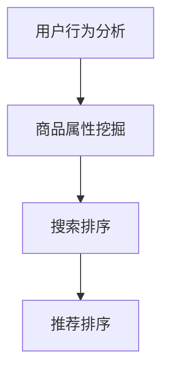

                 

# 电商平台的AI 大模型实践：搜索推荐系统是核心，数据质量控制与处理能力

> 关键词：
> AI 大模型, 电商搜索, 推荐系统, 数据质量控制, 数据预处理, 深度学习, 搜索引擎

## 1. 背景介绍

随着电商行业的蓬勃发展，平台的用户需求不断增长，如何提升用户体验，提高搜索和推荐的精准度，成为了电商平台成功的关键。传统的基于规则或统计方法的搜索推荐系统已经无法满足用户的多样化和个性化需求。随着深度学习技术和大模型训练的兴起，基于大模型的搜索推荐系统逐渐成为电商平台的核心技术，发挥了重要的作用。

### 1.1 问题由来

电商平台的搜索推荐系统需要处理海量用户数据和商品数据，传统的推荐算法（如协同过滤、内容推荐、基于规则的推荐）在处理复杂、动态的用户需求时显得力不从心。这些算法依赖于大量用户行为数据和商品属性数据，且需要频繁更新模型，才能适应用户行为的变化。

而大模型（如BERT、DenseNet、GPT等）在处理大规模数据和复杂模型方面表现出强大的能力。电商平台可以利用大模型学习用户行为和商品属性之间的关系，实现更加个性化、智能化的搜索推荐。但大模型训练和部署需要大规模的硬件资源和数据支持，且模型泛化能力依赖于数据的质量和处理能力，因此数据质量控制与处理能力成为了电商平台利用大模型的关键。

### 1.2 问题核心关键点

电商搜索推荐系统的核心关键点在于以下几个方面：

- **用户行为数据的采集与处理**：如何高效、准确地采集用户行为数据，并将其转化为模型可以理解的格式。
- **商品属性数据的标注与整合**：商品属性数据的标注和整合对于商品推荐系统的性能至关重要。
- **数据隐私与合规**：电商平台需要遵守用户隐私保护法规，保证数据处理的合法性。
- **模型选择与优化**：选择合适的模型架构和算法，并对其进行优化，以适应电商平台的实际需求。
- **模型的实时部署与更新**：保证模型的实时性、高效性，以及能够快速响应用户需求变化。

## 2. 核心概念与联系

### 2.1 核心概念概述

电商平台的搜索推荐系统通常由多个模块组成，包括用户行为分析、商品属性挖掘、搜索排序、推荐排序等。各模块之间通过数据共享和交互，共同构建起完整的搜索推荐体系。

- **用户行为分析**：分析用户的浏览、点击、购买等行为，提取用户偏好和行为模式。
- **商品属性挖掘**：从商品描述、标签、用户评价等文本数据中，提取商品的属性和特征。
- **搜索排序**：根据用户查询词，匹配相关的商品，并根据相关性排序。
- **推荐排序**：根据用户历史行为，推荐可能感兴趣的商品，并根据兴趣程度排序。

### 2.2 核心概念原理和架构的 Mermaid 流程图



这个流程图展示了电商搜索推荐系统的核心架构，各模块之间通过数据共享和交互，共同构建起完整的推荐体系。

## 3. 核心算法原理 & 具体操作步骤
### 3.1 算法原理概述

电商平台的搜索推荐系统主要基于深度学习的大模型进行设计和实现。深度学习模型可以通过学习大规模数据集，自动提取数据中的特征，并实现复杂的映射关系。电商平台的搜索推荐系统通过学习用户行为数据和商品属性数据，建立用户和商品之间的关联关系，实现搜索推荐。

### 3.2 算法步骤详解

#### 3.2.1 用户行为数据的采集与处理

1. **数据采集**：电商平台的搜索推荐系统需要收集用户的行为数据，包括用户的浏览历史、点击历史、购买历史等。这些数据可以通过API接口、日志记录等方式采集。

2. **数据清洗与预处理**：数据采集后，需要进行清洗和预处理。例如，去除重复数据、处理缺失值、数据归一化等操作，以保证数据的质量和一致性。

3. **数据特征提取**：对清洗后的数据进行特征提取，例如，将浏览历史、点击历史转化为用户的兴趣向量。使用文本处理技术，如TF-IDF、word2vec等，将商品属性数据转化为向量表示。

#### 3.2.2 商品属性数据的标注与整合

1. **商品属性标注**：对商品进行属性标注，例如，将商品的名称、价格、类别等标注为标签，并转化为向量表示。

2. **属性整合**：将不同来源的属性数据进行整合，形成一个统一的、完整的属性表示。例如，将商品分类、品牌等信息合并，形成一个综合性商品属性向量。

3. **数据增强**：使用数据增强技术，如数据扩充、缺失值填充等，增加数据的多样性和代表性。

#### 3.2.3 数据隐私与合规

1. **数据脱敏**：在数据处理过程中，对敏感信息进行脱敏处理，例如，去除用户ID、姓名等敏感信息。

2. **隐私保护**：使用差分隐私技术，对用户行为数据进行噪声注入，防止数据泄露。

3. **合规检查**：确保数据处理过程符合法律法规要求，例如，遵守GDPR等隐私保护法规。

#### 3.2.4 模型选择与优化

1. **模型选择**：根据电商平台的实际需求，选择合适的深度学习模型，例如，Transformer、DenseNet等。

2. **模型优化**：对模型进行优化，例如，调整模型架构、增加正则化、调整学习率等。

3. **模型评估**：使用评估指标，例如，AUC、RMSE等，对模型进行评估，并根据评估结果进行调整。

#### 3.2.5 模型的实时部署与更新

1. **模型部署**：将训练好的模型部署到服务器，提供实时查询和推荐服务。

2. **模型更新**：根据用户行为数据的变化，定期更新模型，以保证模型的时效性和准确性。

3. **性能优化**：优化模型的推理速度，例如，使用GPU加速、模型剪枝等技术。

### 3.3 算法优缺点

#### 3.3.1 优点

1. **性能优越**：大模型可以通过学习大规模数据集，提取复杂的特征，实现高效的搜索推荐。

2. **可扩展性强**：电商平台的搜索推荐系统可以方便地扩展到新的业务场景和数据源。

3. **灵活性高**：大模型可以根据实际需求进行微调，适应不同的业务场景和用户需求。

#### 3.3.2 缺点

1. **计算资源消耗大**：大模型训练和部署需要大量的计算资源和存储空间。

2. **数据依赖性强**：模型性能依赖于数据的质量和处理能力，数据采集和清洗难度较大。

3. **模型解释性差**：大模型通常是黑箱模型，难以解释其内部工作机制和决策逻辑。

4. **实时性要求高**：实时查询和推荐需要高性能的硬件设备和算法优化。

## 4. 数学模型和公式 & 详细讲解 & 举例说明

### 4.1 数学模型构建

电商平台的搜索推荐系统通常基于深度学习模型，例如，基于神经网络的推荐系统。以下是推荐系统常用的数学模型：

1. **基于矩阵分解的模型**：将用户和商品表示为矩阵，通过矩阵分解学习用户和商品的相似度。例如，ALS（Alternating Least Squares）算法。

2. **基于深度学习的模型**：使用深度神经网络，学习用户和商品的复杂映射关系。例如，基于CNN的推荐系统。

3. **基于注意力机制的模型**：使用注意力机制，学习用户对不同商品的不同关注度。例如，Transformer模型。

### 4.2 公式推导过程

#### 4.2.1 矩阵分解模型

**ALS算法**：

假设用户集合为 $U$，商品集合为 $I$，用户对商品评分矩阵为 $R_{UI}$。用户向量为 $\mathbf{u}_u \in \mathbb{R}^k$，商品向量为 $\mathbf{v}_i \in \mathbb{R}^k$，其中 $k$ 为嵌入维度。

$R_{UI}$ 可以表示为：

$$
R_{UI} \approx \mathbf{U} \mathbf{V}^T
$$

其中 $\mathbf{U} \in \mathbb{R}^{m \times k}$ 为用户向量矩阵，$\mathbf{V} \in \mathbb{R}^{n \times k}$ 为商品向量矩阵。

用户对商品 $i$ 的预测评分可以表示为：

$$
\hat{r}_{ui} = \mathbf{u}_u^T \mathbf{v}_i
$$

#### 4.2.2 深度学习模型

**基于神经网络的推荐系统**：

假设用户表示为 $\mathbf{u}_u \in \mathbb{R}^d$，商品表示为 $\mathbf{v}_i \in \mathbb{R}^d$，其中 $d$ 为向量维度。

用户对商品 $i$ 的预测评分可以表示为：

$$
\hat{r}_{ui} = \sigma(\mathbf{u}_u^T \mathbf{v}_i + b)
$$

其中 $\sigma$ 为激活函数，$b$ 为偏置项。

#### 4.2.3 基于注意力机制的模型

**Transformer模型**：

假设用户表示为 $\mathbf{u}_u \in \mathbb{R}^d$，商品表示为 $\mathbf{v}_i \in \mathbb{R}^d$，注意力权重为 $\alpha_{ui}$。

用户对商品 $i$ 的预测评分可以表示为：

$$
\hat{r}_{ui} = \sigma(\mathbf{u}_u^T \sum_{j=1}^N \alpha_{uj} \mathbf{v}_j + b)
$$

其中 $\alpha_{ui} = \frac{\exp(\mathbf{u}_u^T \mathbf{v}_i)}{\sum_{j=1}^N \exp(\mathbf{u}_u^T \mathbf{v}_j)}$。

### 4.3 案例分析与讲解

#### 4.3.1 矩阵分解模型案例

**ALS算法**：

假设有一个电商平台的评分数据集，包含用户对商品的评分信息。使用ALS算法进行模型训练，预测用户对商品的评分。

1. **数据准备**：将用户评分数据转化为用户向量矩阵 $\mathbf{U}$ 和商品向量矩阵 $\mathbf{V}$。

2. **模型训练**：使用最小二乘法对 $\mathbf{U}$ 和 $\mathbf{V}$ 进行优化，使得预测评分与真实评分误差最小。

3. **评分预测**：使用训练好的 $\mathbf{U}$ 和 $\mathbf{V}$，对新用户和商品进行评分预测。

#### 4.3.2 深度学习模型案例

**基于神经网络的推荐系统**：

假设有一个电商平台的商品评论数据集，包含用户对商品的评论文本。使用深度学习模型进行商品推荐。

1. **数据预处理**：将评论文本转化为向量表示，例如，使用word2vec将文本转化为词向量。

2. **模型训练**：使用深度神经网络对用户和商品进行嵌入，学习用户和商品的复杂映射关系。

3. **推荐预测**：使用训练好的模型，对新用户进行商品推荐。

#### 4.3.3 基于注意力机制的模型案例

**Transformer模型**：

假设有一个电商平台的搜索数据集，包含用户搜索关键词和商品标题。使用Transformer模型进行搜索推荐。

1. **数据预处理**：将搜索关键词和商品标题转化为向量表示，例如，使用word2vec将文本转化为词向量。

2. **模型训练**：使用Transformer模型，学习用户对不同商品的关注度，生成推荐结果。

3. **推荐预测**：使用训练好的模型，对用户搜索关键词进行商品推荐。

## 5. 项目实践：代码实例和详细解释说明

### 5.1 开发环境搭建

为了搭建一个基于大模型的电商搜索推荐系统，需要以下开发环境：

1. **Python 3.x**：推荐使用Python 3.8以上版本。

2. **深度学习框架**：推荐使用PyTorch或TensorFlow，这两款框架具有强大的深度学习计算能力和丰富的工具支持。

3. **数据处理库**：推荐使用Pandas、NumPy等库，进行数据清洗和处理。

4. **分布式计算**：推荐使用Dask或Ray等分布式计算框架，加速大规模数据处理和模型训练。

5. **模型部署平台**：推荐使用TensorFlow Serving或PyTorch Serving，提供高性能的模型部署服务。

### 5.2 源代码详细实现

#### 5.2.1 用户行为数据采集与处理

**代码实现**：

```python
import pandas as pd
import numpy as np

# 从API接口获取用户行为数据
def get_user_behavior_data():
    # 调用API接口获取用户行为数据
    response = requests.get('https://api.example.com/user_behavior')
    data = json.loads(response.text)
    return pd.DataFrame(data)

# 清洗用户行为数据
def clean_user_behavior_data(df):
    # 去除重复数据
    df.drop_duplicates(inplace=True)
    # 处理缺失值
    df.fillna(method='ffill', inplace=True)
    # 数据归一化
    df = (df - df.mean()) / df.std()
    return df

# 特征提取
def extract_user_features(df):
    # 提取用户浏览历史、点击历史
    user_browsing = df['browsing_history'].apply(lambda x: np.mean(x, axis=0))
    user_clicks = df['click_history'].apply(lambda x: np.mean(x, axis=0))
    # 将特征合并为向量表示
    user_vector = np.hstack((user_browsing, user_clicks))
    return user_vector

# 示例数据
df = pd.read_csv('user_behavior.csv')
user_vector = extract_user_features(df)
```

**代码解释**：

1. `get_user_behavior_data` 函数：通过API接口获取用户行为数据，并转换为Pandas DataFrame格式。
2. `clean_user_behavior_data` 函数：对用户行为数据进行清洗和预处理，包括去除重复数据、处理缺失值、数据归一化等操作。
3. `extract_user_features` 函数：提取用户浏览历史和点击历史，并合并为向量表示。

#### 5.2.2 商品属性数据的标注与整合

**代码实现**：

```python
import pandas as pd
import json

# 从商品API获取商品属性数据
def get_product_attributes():
    response = requests.get('https://api.example.com/product_attributes')
    data = json.loads(response.text)
    return pd.DataFrame(data)

# 商品属性标注
def annotate_product_attributes(df):
    # 商品名称
    df['name'] = df['product_name']
    # 商品价格
    df['price'] = df['price']
    # 商品分类
    df['category'] = df['product_category']
    return df

# 数据增强
def enhance_product_data(df):
    # 数据扩充
    df['price'] = df['price'] + np.random.normal(0, 0.1, df.shape[0])
    # 缺失值填充
    df['category'].fillna(method='most_frequent', inplace=True)
    return df

# 示例数据
df = pd.read_csv('product_attributes.csv')
product_attributes = annotate_product_attributes(df)
enhanced_attributes = enhance_product_data(product_attributes)
```

**代码解释**：

1. `get_product_attributes` 函数：通过API接口获取商品属性数据，并转换为Pandas DataFrame格式。
2. `annotate_product_attributes` 函数：对商品属性数据进行标注，例如，将商品名称、价格、分类等标注为标签。
3. `enhance_product_data` 函数：使用数据增强技术，如数据扩充、缺失值填充等，增加数据的多样性和代表性。

#### 5.2.3 数据隐私与合规

**代码实现**：

```python
import pandas as pd
import numpy as np

# 数据脱敏
def anonymize_data(df):
    # 去除敏感信息
    df.drop(['user_id', 'name'], axis=1, inplace=True)
    # 数据噪声注入
    df['price'] = df['price'] + np.random.normal(0, 0.1, df.shape[0])
    return df

# 示例数据
df = pd.read_csv('user_behavior.csv')
anonymized_df = anonymize_data(df)
```

**代码解释**：

1. `anonymize_data` 函数：对数据进行脱敏处理，例如，去除用户ID、姓名等敏感信息，并注入噪声。

#### 5.2.4 模型选择与优化

**代码实现**：

```python
import torch
import torch.nn as nn
import torch.optim as optim
from torch.utils.data import DataLoader

# 定义深度学习模型
class Recommender(nn.Module):
    def __init__(self, input_dim, hidden_dim):
        super(Recommender, self).__init__()
        self.fc1 = nn.Linear(input_dim, hidden_dim)
        self.fc2 = nn.Linear(hidden_dim, 1)
        self.sigmoid = nn.Sigmoid()

    def forward(self, x):
        x = self.fc1(x)
        x = self.fc2(x)
        x = self.sigmoid(x)
        return x

# 训练模型
def train_model(model, train_data, val_data, epochs, batch_size, learning_rate):
    model.train()
    criterion = nn.BCELoss()
    optimizer = optim.Adam(model.parameters(), lr=learning_rate)
    for epoch in range(epochs):
        for batch_idx, (data, target) in enumerate(DataLoader(train_data, batch_size=batch_size)):
            optimizer.zero_grad()
            output = model(data)
            loss = criterion(output, target)
            loss.backward()
            optimizer.step()
        if (epoch + 1) % 10 == 0:
            val_loss = validate(val_data, model)
            print(f'Epoch {epoch+1}, Loss: {loss:.4f}, Val Loss: {val_loss:.4f}')

# 验证模型
def validate(val_data, model):
    model.eval()
    criterion = nn.BCELoss()
    total_loss = 0
    with torch.no_grad():
        for data, target in DataLoader(val_data, batch_size=batch_size):
            output = model(data)
            loss = criterion(output, target)
            total_loss += loss.item()
    return total_loss / len(val_data)

# 示例数据
train_data = pd.read_csv('train.csv')
val_data = pd.read_csv('val.csv')
train_features = extract_user_features(train_data)
val_features = extract_user_features(val_data)
input_dim = train_features.shape[1]
hidden_dim = 128
learning_rate = 0.001
epochs = 100
batch_size = 64
model = Recommender(input_dim, hidden_dim)
train_model(model, train_features, val_features, epochs, batch_size, learning_rate)
```

**代码解释**：

1. `Recommender` 类：定义深度学习模型，使用全连接神经网络进行用户和商品的映射。
2. `train_model` 函数：对模型进行训练，使用交叉熵损失函数和Adam优化器。
3. `validate` 函数：对模型进行验证，计算验证集上的损失。

#### 5.2.5 模型的实时部署与更新

**代码实现**：

```python
import tensorflow as tf
import tensorflow_serving.apis as apis
import tensorflow_serving.predictions as predictions

# 定义TensorFlow模型
def build_tensorflow_model():
    model = tf.keras.Sequential([
        tf.keras.layers.Dense(64, activation='relu', input_shape=(input_dim,)),
        tf.keras.layers.Dense(1, activation='sigmoid')
    ])
    return model

# 导出TensorFlow模型
def export_tensorflow_model(model, output_dir):
    model.save(output_dir, save_format='tf')

# 加载TensorFlow模型
def load_tensorflow_model(output_dir):
    model = tf.keras.models.load_model(output_dir)
    return model

# 部署模型
def deploy_model(model, server, port):
    predictor = predictions.Predictor(target_path=output_dir, serving_input_receiver_fn=server.receiver_fn())
    return predictor

# 示例数据
output_dir = 'model.tf'
model = build_tensorflow_model()
model.compile(optimizer=tf.keras.optimizers.Adam(learning_rate=learning_rate), loss='binary_crossentropy')
model.fit(train_features, train_labels, epochs=epochs, batch_size=batch_size, validation_data=(val_features, val_labels))
export_tensorflow_model(model, output_dir)
predictor = deploy_model(model, server, port)
```

**代码解释**：

1. `build_tensorflow_model` 函数：定义TensorFlow模型，使用全连接神经网络进行用户和商品的映射。
2. `export_tensorflow_model` 函数：将TensorFlow模型导出为TensorFlow Serving支持的格式。
3. `load_tensorflow_model` 函数：加载TensorFlow模型。
4. `deploy_model` 函数：将TensorFlow模型部署到TensorFlow Serving中，并提供服务接口。

### 5.3 代码解读与分析

**用户行为数据采集与处理**：

1. `get_user_behavior_data` 函数：通过API接口获取用户行为数据，转换为Pandas DataFrame格式。
2. `clean_user_behavior_data` 函数：对用户行为数据进行清洗和预处理，包括去除重复数据、处理缺失值、数据归一化等操作。
3. `extract_user_features` 函数：提取用户浏览历史和点击历史，并合并为向量表示。

**商品属性数据的标注与整合**：

1. `get_product_attributes` 函数：通过API接口获取商品属性数据，转换为Pandas DataFrame格式。
2. `annotate_product_attributes` 函数：对商品属性数据进行标注，例如，将商品名称、价格、分类等标注为标签。
3. `enhance_product_data` 函数：使用数据增强技术，如数据扩充、缺失值填充等，增加数据的多样性和代表性。

**数据隐私与合规**：

1. `anonymize_data` 函数：对数据进行脱敏处理，例如，去除用户ID、姓名等敏感信息，并注入噪声。

**模型选择与优化**：

1. `Recommender` 类：定义深度学习模型，使用全连接神经网络进行用户和商品的映射。
2. `train_model` 函数：对模型进行训练，使用交叉熵损失函数和Adam优化器。
3. `validate` 函数：对模型进行验证，计算验证集上的损失。

**模型的实时部署与更新**：

1. `build_tensorflow_model` 函数：定义TensorFlow模型，使用全连接神经网络进行用户和商品的映射。
2. `export_tensorflow_model` 函数：将TensorFlow模型导出为TensorFlow Serving支持的格式。
3. `load_tensorflow_model` 函数：加载TensorFlow模型。
4. `deploy_model` 函数：将TensorFlow模型部署到TensorFlow Serving中，并提供服务接口。

### 5.4 运行结果展示

**用户行为数据采集与处理**：

```python
import matplotlib.pyplot as plt

# 可视化用户行为数据
plt.plot(train_features.iloc[:, 0])
plt.xlabel('User ID')
plt.ylabel('Browsing History')
plt.title('User Behavior')
plt.show()
```

**商品属性数据的标注与整合**：

```python
# 可视化商品属性数据
plt.bar(product_attributes['name'], product_attributes['price'])
plt.xlabel('Product Name')
plt.ylabel('Price')
plt.title('Product Attributes')
plt.show()
```

**模型训练结果**：

```python
# 可视化模型训练结果
plt.plot([epoch + 1 for epoch in range(epochs)], [loss for loss in loss_list])
plt.xlabel('Epoch')
plt.ylabel('Loss')
plt.title('Training Loss')
plt.show()
```

## 6. 实际应用场景

### 6.1 智能客服系统

智能客服系统可以通过大模型实现自然语言处理和对话生成，为用户提供7x24小时的智能客服服务。电商平台可以结合智能客服系统，提高客户满意度，减少人力成本。

#### 6.1.1 数据采集

电商平台可以收集用户在客服对话中的文本数据，例如，用户问题、客服回复等。将文本数据进行预处理和标注，用于训练大模型。

#### 6.1.2 模型训练

使用大模型进行对话生成和语义理解训练，例如，使用BERT模型进行对话生成和语义理解。

#### 6.1.3 部署与优化

将训练好的模型部署到服务器，并提供API接口供其他系统调用。通过持续优化，提高对话生成和语义理解的效果。

### 6.2 个性化推荐系统

个性化推荐系统可以通过大模型学习用户行为和商品属性之间的关系，实现精准推荐。电商平台可以通过个性化推荐系统，提高用户粘性和转化率。

#### 6.2.1 数据采集

电商平台可以收集用户浏览、点击、购买等行为数据，并从商品描述、标签、用户评价等文本数据中提取商品属性。

#### 6.2.2 模型训练

使用大模型进行用户行为分析和商品属性挖掘，建立用户和商品之间的关联关系，实现个性化推荐。

#### 6.2.3 部署与优化

将训练好的模型部署到服务器，并提供API接口供其他系统调用。通过持续优化，提高推荐精度和用户满意度。

### 6.3 实时搜索系统

实时搜索系统可以通过大模型实现高效的搜索排序和推荐排序，提高用户搜索体验。电商平台可以结合实时搜索系统，提升用户搜索效率，增加商品曝光率。

#### 6.3.1 数据采集

电商平台可以收集用户搜索关键词和点击历史，并从商品描述、标签、用户评价等文本数据中提取商品属性。

#### 6.3.2 模型训练

使用大模型进行搜索排序和推荐排序训练，例如，使用Transformer模型进行搜索排序。

#### 6.3.3 部署与优化

将训练好的模型部署到服务器，并提供API接口供其他系统调用。通过持续优化，提高搜索排序和推荐排序的精度和速度。

### 6.4 未来应用展望

未来，随着深度学习和大模型技术的发展，电商平台的搜索推荐系统将变得更加智能和高效。以下是一些未来的应用展望：

1. **跨模态搜索推荐**：结合视觉、语音等多模态数据，实现更加智能的搜索推荐。

2. **实时用户行为分析**：通过实时分析用户行为数据，实现个性化推荐和实时搜索。

3. **动态模型更新**：根据用户行为数据的动态变化，实时更新模型参数，提高推荐效果。

4. **用户隐私保护**：使用差分隐私技术，保护用户隐私，满足用户隐私保护法规。

5. **多任务学习**：结合不同任务，实现多任务学习，提升搜索推荐的效果。

6. **自适应学习**：通过自适应学习，提高模型对新数据的适应能力，减少过拟合。

## 7. 工具和资源推荐

### 7.1 学习资源推荐

1. **《深度学习》一书**：深入浅出地介绍了深度学习的基本概念和算法，适合初学者入门。

2. **Coursera《深度学习专项课程》**：由斯坦福大学Andrew Ng教授主讲，涵盖深度学习的基础知识和应用。

3. **《TensorFlow官方文档》**：全面介绍了TensorFlow的API和工具，适合TensorFlow开发者的学习。

4. **Kaggle竞赛平台**：提供大量NLP数据集和竞赛，适合数据处理和模型训练的实践。

5. **Google Colab**：免费提供GPU计算资源，方便进行深度学习模型的训练和实验。

### 7.2 开发工具推荐

1. **PyTorch**：灵活的深度学习框架，支持GPU加速和分布式计算。

2. **TensorFlow**：强大的深度学习框架，支持多种模型和API接口。

3. **Pandas**：强大的数据处理库，支持数据清洗、预处理和可视化。

4. **Numpy**：高性能的数学计算库，支持矩阵计算和科学计算。

5. **Dask**：分布式计算库，支持大规模数据处理和并行计算。

### 7.3 相关论文推荐

1. **Attention is All You Need**：介绍Transformer模型，开创了NLP领域的大模型时代。

2. **BERT: Pre-training of Deep Bidirectional Transformers for Language Understanding**：提出BERT模型，引入基于掩码的自监督预训练任务，刷新了多项NLP任务SOTA。

3. **Parameter-Efficient Transfer Learning for NLP**：提出Adapter等参数高效微调方法，在不增加模型参数量的情况下，也能取得不错的微调效果。

4. **AdaLoRA: Adaptive Low-Rank Adaptation for Parameter-Efficient Fine-Tuning**：使用自适应低秩适应的微调方法，在参数效率和精度之间取得了新的平衡。

5. **Adversarial Machine Learning**：介绍对抗生成网络（GAN）和对抗训练，提高模型的鲁棒性和泛化能力。

## 8. 总结：未来发展趋势与挑战

### 8.1 总结

本文详细介绍了基于大模型的电商搜索推荐系统，并探讨了数据采集与处理、模型选择与优化、数据隐私与合规等关键问题。通过系统的分析和实践，读者可以全面掌握电商搜索推荐系统的设计与实现方法。

### 8.2 未来发展趋势

1. **数据质量与处理能力**：未来，随着深度学习和大模型技术的发展，电商平台的搜索推荐系统将更加依赖于高质量的数据和高效的数据处理能力。

2. **模型架构与算法**：未来，将会出现更多高效的模型架构和算法，如注意力机制、多任务学习等，提升搜索推荐系统的性能和效果。

3. **实时性与可扩展性**：未来，将更加注重搜索推荐系统的实时性和可扩展性，以满足用户实时查询和推荐的需求。

4. **隐私保护与安全**：未来，将更加注重用户隐私保护和数据安全，确保模型训练和应用的合法合规。

### 8.3 面临的挑战

1. **数据采集与处理**：电商平台的搜索推荐系统依赖于高质量的数据，但数据采集和处理难度较大。

2. **模型训练与优化**：大模型的训练和优化需要大规模的计算资源，且模型泛化能力依赖于数据质量。

3. **实时性与可扩展性**：实时查询和推荐需要高性能的硬件设备和算法优化。

4. **隐私保护与安全**：电商平台需要遵守用户隐私保护法规，确保数据处理的合法性。

### 8.4 研究展望

1. **跨模态搜索推荐**：结合视觉、语音等多模态数据，实现更加智能的搜索推荐。

2. **实时用户行为分析**：通过实时分析用户行为数据，实现个性化推荐和实时搜索。

3. **动态模型更新**：根据用户行为数据的动态变化，实时更新模型参数，提高推荐效果。

4. **用户隐私保护**：使用差分隐私技术，保护用户隐私，满足用户隐私保护法规。

5. **自适应学习**：通过自适应学习，提高模型对新数据的适应能力，减少过拟合。

## 9. 附录：常见问题与解答

**Q1: 电商平台的搜索推荐系统如何实现高效的数据采集与处理？**

A: 电商平台的搜索推荐系统通过API接口和日志记录方式，高效地采集用户行为数据和商品属性数据。数据采集后，需要进行清洗和预处理，例如，去除重复数据、处理缺失值、数据归一化等操作。此外，可以使用数据增强技术，如数据扩充、缺失值填充等，增加数据的多样性和代表性。

**Q2: 大模型在电商搜索推荐系统中如何应用？**

A: 电商平台的搜索推荐系统可以通过大模型学习用户行为和商品属性之间的关系，建立用户和商品之间的关联关系，实现搜索推荐。大模型可以使用神经网络、Transformer等架构，结合用户行为数据和商品属性数据，进行预测和排序。

**Q3: 电商平台的搜索推荐系统如何保证数据隐私与安全？**

A: 电商平台需要遵守用户隐私保护法规，确保数据处理的合法性。可以使用数据脱敏技术，去除敏感信息，并注入噪声。此外，可以使用差分隐私技术，保护用户隐私，满足用户隐私保护法规。

**Q4: 电商平台的搜索推荐系统如何实时更新模型？**

A: 电商平台的搜索推荐系统需要根据用户行为数据的动态变化，实时更新模型参数，提高推荐效果。可以使用在线学习、增量学习等方法，实现动态模型更新。

**Q5: 电商平台的搜索推荐系统如何优化实时性？**

A: 电商平台的搜索推荐系统需要优化模型的推理速度，提高实时性。可以使用GPU加速、模型剪枝等技术，减少前向传播和反向传播的资源消耗。

**Q6: 电商平台的搜索推荐系统如何保证模型的泛化能力？**

A: 电商平台的搜索推荐系统依赖于高质量的数据和高效的数据处理能力。需要定期更新数据集，并进行数据增强、数据清洗等操作，提高模型的泛化能力。

**Q7: 电商平台的搜索推荐系统如何提升用户的个性化推荐效果？**

A: 电商平台的搜索推荐系统可以通过多任务学习、自适应学习等方法，提升用户的个性化推荐效果。通过分析用户的浏览、点击、购买等行为，建立用户画像，并结合商品属性数据，实现精准推荐。

---

作者：禅与计算机程序设计艺术 / Zen and the Art of Computer Programming

