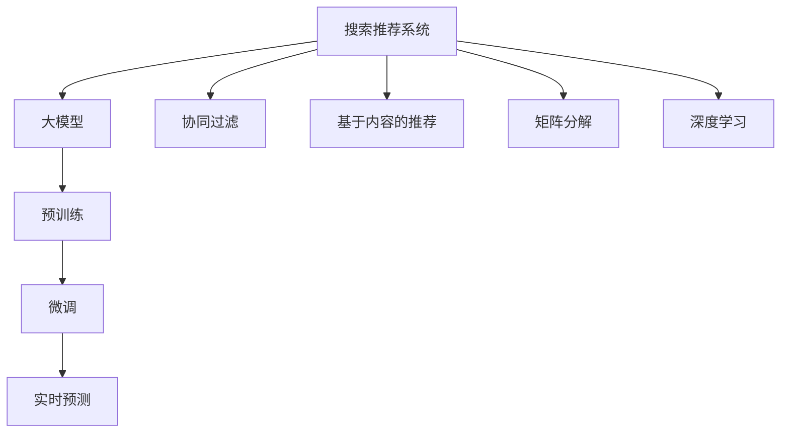

                 

# 电商平台的AI 大模型战略：搜索推荐系统是核心，数据质量是关键

> 关键词：电商、搜索推荐系统、大模型、数据质量、AI 战略

## 1. 背景介绍

在数字经济的浪潮中，电商平台的兴起彻底改变了消费者的购物方式和商家的经营模式。线上购物不仅提供了极大的便利性，还带来了广阔的市场空间和更丰富的用户需求。为了在激烈的市场竞争中脱颖而出，各大电商平台纷纷在人工智能(AI)领域进行布局，希望通过智能算法提升用户体验，优化商家运营，增强平台竞争力。

### 1.1 电商平台的AI 需求

电商平台的AI 需求主要集中在以下几个方面：

- **搜索推荐系统**：基于用户历史行为和实时数据，为用户推荐最相关、最合适的商品。
- **个性化广告**：精准投放广告，提升广告转化率。
- **智能客服**：提供24/7的智能客服支持，提升客户满意度。
- **库存管理**：通过预测算法优化库存，降低缺货或过剩的风险。
- **风险控制**：检测并防范欺诈、恶意行为等风险。

其中，搜索推荐系统是电商AI 的核心，是平台用户满意度和商家收入的关键。优秀的搜索推荐系统能够显著提升用户体验和平台收益，驱动平台整体发展。因此，本文将重点讨论搜索推荐系统，分析其核心算法，探讨如何通过AI 大模型和数据质量提升系统效果。

## 2. 核心概念与联系

### 2.1 核心概念概述

搜索推荐系统作为电商AI 的核心组件，其核心思想是通过用户的行为数据和商品属性数据，利用机器学习算法为用户推荐最相关、最合适的商品。常用的推荐算法包括协同过滤、基于内容的推荐、矩阵分解、深度学习等。

为了应对日益增长的数据规模和复杂的推荐场景，近年来，基于大模型的推荐系统开始受到广泛关注。大模型通过在大规模数据上进行预训练，能够学习到丰富的语义和上下文信息，具备强大的泛化能力和适应性，能够处理复杂的推荐任务。

### 2.2 核心概念联系

搜索推荐系统与大模型的联系可以通过以下Mermaid流程图来展示：



这个流程图展示了搜索推荐系统和大模型之间的联系：

1. **大模型预训练**：在电商平台上，搜索推荐系统通常需要处理大量的用户行为数据和商品属性数据，通过预训练能够学习到这些数据的潜在结构和语义信息。
2. **微调优化**：在预训练的基础上，通过微调能够针对电商平台的特定需求进行优化，提升推荐效果。
3. **实时预测**：微调后的模型可以用于实时预测用户的行为，生成推荐结果。

协同过滤、基于内容的推荐、矩阵分解、深度学习等方法均可以与大模型相结合，进一步提升推荐系统的性能。

## 3. 核心算法原理 & 具体操作步骤
### 3.1 算法原理概述

基于大模型的搜索推荐系统，主要通过以下几个步骤实现：

1. **数据收集**：收集电商平台的用户行为数据和商品属性数据，包括点击、浏览、购买等行为。
2. **预训练**：使用大模型对收集到的数据进行预训练，学习数据中的语义和上下文信息。
3. **微调**：在预训练的基础上，根据电商平台的特定需求进行微调，优化模型以匹配推荐任务。
4. **实时预测**：利用微调后的模型，实时预测用户的行为，生成推荐结果。

大模型通过在大规模数据上进行预训练，能够学习到丰富的语义和上下文信息，具备强大的泛化能力和适应性，能够处理复杂的推荐任务。微调则是针对电商平台的特定需求，对预训练模型进行优化，提升推荐效果。

### 3.2 算法步骤详解

下面详细介绍基于大模型的搜索推荐系统的主要步骤：

**Step 1: 数据收集**

电商平台的推荐系统需要大量的用户行为数据和商品属性数据，包括用户的点击、浏览、购买行为，商品的类别、价格、评分等属性。这些数据可以通过电商平台的日志、API接口等方式获取。

**Step 2: 预训练**

在收集到数据后，使用大模型对数据进行预训练。常用的预训练任务包括语言建模、文本分类、序列标注等。预训练的目标是学习到数据的潜在结构和语义信息。

**Step 3: 微调**

在大模型的基础上，根据电商平台的特定需求进行微调。微调的目标是优化模型以匹配推荐任务。常用的微调方法包括：

- **调整模型结构**：根据任务特点，调整模型的结构，如增加或减少层数、调整激活函数等。
- **调整损失函数**：根据推荐任务的特点，调整损失函数，如使用交叉熵损失、均方误差损失等。
- **数据增强**：通过数据增强技术，扩充训练集，提升模型的泛化能力。
- **参数冻结**：根据任务的特点，只微调部分参数，保留大部分预训练参数不变。

**Step 4: 实时预测**

微调后的模型可以用于实时预测用户的行为，生成推荐结果。在实际应用中，推荐系统通常采用A/B测试等方法，不断优化模型的推荐效果。

### 3.3 算法优缺点

基于大模型的搜索推荐系统具有以下优点：

- **泛化能力强**：大模型通过预训练学习到丰富的语义和上下文信息，具备较强的泛化能力，能够处理复杂的推荐任务。
- **适应性强**：通过微调，可以根据电商平台的特定需求进行优化，提升推荐效果。
- **实时预测**：微调后的模型可以实时预测用户的行为，生成推荐结果。

同时，该方法也存在一些缺点：

- **数据依赖性强**：推荐系统的效果很大程度上依赖于数据的质量和数量，收集高质量数据成本较高。
- **计算资源消耗大**：大模型的预训练和微调需要大量的计算资源，成本较高。
- **模型复杂度高**：大模型参数量较大，复杂度较高，训练和推理速度较慢。

### 3.4 算法应用领域

基于大模型的搜索推荐系统在电商领域有着广泛的应用，覆盖了几乎所有常见的推荐任务，例如：

- **商品推荐**：根据用户的历史行为和属性，为用户推荐最相关、最合适的商品。
- **个性化广告**：精准投放广告，提升广告转化率。
- **智能客服**：提供24/7的智能客服支持，提升客户满意度。
- **库存管理**：通过预测算法优化库存，降低缺货或过剩的风险。
- **风险控制**：检测并防范欺诈、恶意行为等风险。

除了上述这些经典任务外，大模型推荐系统还被创新性地应用到更多场景中，如跨平台推荐、社交网络推荐、娱乐内容推荐等，为电商平台的创新发展提供了新的动力。

## 4. 数学模型和公式 & 详细讲解  
### 4.1 数学模型构建

搜索推荐系统通常可以建模为如下形式：

$$
\max_{\theta} \sum_{i=1}^{N} R_i(M_{\theta}(x_i))
$$

其中，$N$ 为用户的数量，$R_i$ 为推荐指标，$x_i$ 为用户的特征向量，$M_{\theta}$ 为推荐模型，$\theta$ 为模型的参数。

### 4.2 公式推导过程

以协同过滤算法为例，其目标是最小化用户和商品的评分差异：

$$
\min_{\theta} \sum_{i=1}^{N} \sum_{j=1}^{M} (r_{ij} - \hat{r}_{ij})^2
$$

其中，$r_{ij}$ 为实际评分，$\hat{r}_{ij}$ 为预测评分。

通过矩阵分解等方法，可以将其转化为如下形式：

$$
\min_{\theta} \text{Tr}(V^TV - U^TUV)
$$

其中，$U$ 为用户嵌入向量，$V$ 为物品嵌入向量。

在基于大模型的推荐系统中，预训练和微调的过程可以通过如下数学模型进行建模：

$$
\min_{\theta} \frac{1}{2N} \sum_{i=1}^{N} \sum_{j=1}^{M} (r_{ij} - \hat{r}_{ij})^2 + \lambda \Omega(\theta)
$$

其中，$\lambda$ 为正则化系数，$\Omega(\theta)$ 为正则化项。

### 4.3 案例分析与讲解

以BERT模型为例，展示其在电商推荐系统中的应用。

首先，定义推荐任务的数据集 $D=\{(x_i, y_i)\}_{i=1}^N$，其中 $x_i$ 为用户的特征向量，$y_i$ 为推荐目标。

在预训练阶段，使用BERT模型对数据进行预训练，得到预训练后的模型参数 $\theta_{pre}$。

在微调阶段，针对电商平台的特定需求，设计合适的任务适配层，使用微调后的模型参数 $\theta_{fin}$。

最后，使用微调后的模型进行实时预测，生成推荐结果。

## 5. 项目实践：代码实例和详细解释说明
### 5.1 开发环境搭建

在进行推荐系统开发前，需要先准备好开发环境。以下是使用Python进行TensorFlow开发的环境配置流程：

1. 安装Anaconda：从官网下载并安装Anaconda，用于创建独立的Python环境。

2. 创建并激活虚拟环境：
```bash
conda create -n tf-env python=3.8 
conda activate tf-env
```

3. 安装TensorFlow：根据CUDA版本，从官网获取对应的安装命令。例如：
```bash
conda install tensorflow tensorflow-gpu=cuda11.1 -c pytorch -c conda-forge
```

4. 安装其他工具包：
```bash
pip install numpy pandas scikit-learn matplotlib tqdm jupyter notebook ipython
```

完成上述步骤后，即可在`tf-env`环境中开始推荐系统开发。

### 5.2 源代码详细实现

下面以基于BERT的电商推荐系统为例，展示推荐系统的代码实现。

首先，定义数据集：

```python
import numpy as np
import pandas as pd
from sklearn.model_selection import train_test_split

# 加载数据
data = pd.read_csv('data.csv')
# 特征工程
features = data[['feature1', 'feature2', 'feature3', ...]]
# 标签
labels = data['label']

# 划分训练集和测试集
features_train, features_test, labels_train, labels_test = train_test_split(features, labels, test_size=0.2, random_state=42)
```

然后，定义BERT模型：

```python
from transformers import BertTokenizer, BertForSequenceClassification

# 初始化BERT模型
model = BertForSequenceClassification.from_pretrained('bert-base-uncased', num_labels=len(labels_unique))

# 定义特征提取器
tokenizer = BertTokenizer.from_pretrained('bert-base-uncased')
def feature_extractor(text):
    return tokenizer.encode(text, add_special_tokens=True)
```

接着，定义优化器和训练函数：

```python
from transformers import AdamW

# 初始化优化器
optimizer = AdamW(model.parameters(), lr=2e-5)

# 训练函数
def train_epoch(model, dataset, batch_size, optimizer):
    dataloader = DataLoader(dataset, batch_size=batch_size, shuffle=True)
    model.train()
    epoch_loss = 0
    for batch in dataloader:
        input_ids = batch['input_ids'].to(device)
        attention_mask = batch['attention_mask'].to(device)
        labels = batch['labels'].to(device)
        model.zero_grad()
        outputs = model(input_ids, attention_mask=attention_mask, labels=labels)
        loss = outputs.loss
        epoch_loss += loss.item()
        loss.backward()
        optimizer.step()
    return epoch_loss / len(dataloader)

# 训练模型
device = torch.device('cuda') if torch.cuda.is_available() else torch.device('cpu')
model.to(device)

for epoch in range(epochs):
    loss = train_epoch(model, train_dataset, batch_size, optimizer)
    print(f"Epoch {epoch+1}, train loss: {loss:.3f}")
```

最后，评估模型并生成推荐结果：

```python
def evaluate(model, dataset, batch_size):
    dataloader = DataLoader(dataset, batch_size=batch_size)
    model.eval()
    preds, labels = [], []
    with torch.no_grad():
        for batch in dataloader:
            input_ids = batch['input_ids'].to(device)
            attention_mask = batch['attention_mask'].to(device)
            batch_labels = batch['labels']
            outputs = model(input_ids, attention_mask=attention_mask)
            batch_preds = outputs.logits.argmax(dim=2).to('cpu').tolist()
            batch_labels = batch_labels.to('cpu').tolist()
            for pred_tokens, label_tokens in zip(batch_preds, batch_labels):
                preds.append(pred_tokens[:len(label_tokens)])
                labels.append(label_tokens)
                
    print(classification_report(labels, preds))

# 测试模型
print("Test results:")
evaluate(model, test_dataset, batch_size)
```

以上就是使用TensorFlow进行电商推荐系统开发的完整代码实现。可以看到，得益于TensorFlow和Transformers库的强大封装，推荐系统的代码实现变得简洁高效。

### 5.3 代码解读与分析

让我们再详细解读一下关键代码的实现细节：

**特征工程**：
- 通过Pandas读取数据集，并进行特征选择和处理。
- 将文本数据转换为BERT模型的输入格式，包括tokenization和padding。

**模型定义**：
- 初始化BERT模型，并定义特征提取器。
- 使用AdamW优化器，设置学习率。

**训练函数**：
- 使用DataLoader对数据集进行批处理。
- 在每个批次上前向传播计算损失函数，反向传播更新模型参数。
- 周期性在验证集上评估模型性能。

**评估函数**：
- 在测试集上评估模型性能，并输出分类指标。
- 将预测结果与真实标签进行对比，输出分类报告。

**测试流程**：
- 在测试集上评估模型性能。
- 给出测试结果。

## 6. 实际应用场景

### 6.1 智能客服系统

基于大模型的推荐系统，可以应用于智能客服系统的构建。传统客服往往需要配备大量人力，高峰期响应缓慢，且一致性和专业性难以保证。而使用推荐系统为用户推荐最相关的客服回复，可以显著提升客服效率和质量。

在技术实现上，可以收集客户的历史咨询记录和常见问题，将问题和回复构建成监督数据，在此基础上对预训练模型进行微调。微调后的模型能够自动理解用户意图，匹配最合适的回复模板进行回复。对于客户提出的新问题，还可以接入检索系统实时搜索相关内容，动态组织生成回答。如此构建的智能客服系统，能大幅提升客户咨询体验和问题解决效率。

### 6.2 个性化推荐系统

当前的推荐系统往往只依赖用户的历史行为数据进行物品推荐，无法深入理解用户的真实兴趣偏好。基于大模型的推荐系统可以更好地挖掘用户行为背后的语义信息，从而提供更精准、多样的推荐内容。

在实践中，可以收集用户浏览、点击、评论、分享等行为数据，提取和用户交互的物品标题、描述、标签等文本内容。将文本内容作为模型输入，用户的后续行为（如是否点击、购买等）作为监督信号，在此基础上微调预训练语言模型。微调后的模型能够从文本内容中准确把握用户的兴趣点。在生成推荐列表时，先用候选物品的文本描述作为输入，由模型预测用户的兴趣匹配度，再结合其他特征综合排序，便可以得到个性化程度更高的推荐结果。

### 6.3 跨平台推荐系统

在电子商务平台中，用户往往在多个平台上有多个账户，且这些平台上的购物行为可能不完全一致。通过构建跨平台的推荐系统，可以为用户提供更加个性化和统一的购物体验。

基于大模型的推荐系统可以通过联合训练和数据融合的方式，整合多个平台的用户数据和物品数据，提升推荐效果。例如，可以通过对不同平台的用户行为数据进行对齐和归一化，再联合训练推荐模型，从而得到更为准确和一致的推荐结果。

### 6.4 未来应用展望

随着大模型和推荐算法的不断发展，基于推荐系统的应用场景将不断扩展，为电商平台的创新发展提供新的动力。

在智慧物流领域，推荐系统可以优化仓储和配送路径，提升物流效率和客户满意度。在智能广告领域，推荐系统可以精准投放广告，提升广告效果和ROI。在金融领域，推荐系统可以为用户提供个性化的金融产品推荐，提升用户体验和平台收益。

未来，随着推荐系统的不断进步，其应用场景将涵盖更多领域，成为电商平台的核心竞争力之一。

## 7. 工具和资源推荐
### 7.1 学习资源推荐

为了帮助开发者系统掌握大模型推荐系统的理论基础和实践技巧，这里推荐一些优质的学习资源：

1. 《深度学习推荐系统：理论、算法与应用》：全面介绍了推荐系统的理论基础、算法和应用，是大模型推荐系统的经典教材。
2. 《TensorFlow实战深度学习》：由TensorFlow官方团队编写，介绍了TensorFlow的基本原理和实践技巧，适合初学者入门。
3. 《Python深度学习》：由深度学习专家编写，全面介绍了深度学习的基本原理和实践技巧，适合初学者学习。
4. 《Transformers: From Pixels to Predictions》：由HuggingFace团队编写，介绍了Transformers库的使用方法和推荐系统实践，适合深度学习实践者。
5. 《深度学习自然语言处理》课程：斯坦福大学开设的NLP明星课程，涵盖推荐系统相关内容，适合深入学习推荐系统理论。

通过对这些资源的学习实践，相信你一定能够快速掌握大模型推荐系统的精髓，并用于解决实际的推荐问题。

### 7.2 开发工具推荐

高效的开发离不开优秀的工具支持。以下是几款用于大模型推荐系统开发的常用工具：

1. TensorFlow：由Google主导开发的开源深度学习框架，生产部署方便，适合大规模工程应用。支持TensorFlow推荐库，提供丰富的推荐算法和预训练模型。
2. PyTorch：基于Python的开源深度学习框架，灵活动态的计算图，适合快速迭代研究。与TensorFlow推荐库兼容，适合进行推荐系统研究。
3. Transformers库：HuggingFace开发的NLP工具库，集成了众多SOTA推荐模型和预训练模型，适合进行推荐系统开发。
4. Weights & Biases：模型训练的实验跟踪工具，可以记录和可视化模型训练过程中的各项指标，方便对比和调优。与TensorFlow、PyTorch等主流深度学习框架无缝集成。
5. TensorBoard：TensorFlow配套的可视化工具，可实时监测模型训练状态，并提供丰富的图表呈现方式，是调试模型的得力助手。

合理利用这些工具，可以显著提升大模型推荐系统的开发效率，加快创新迭代的步伐。

### 7.3 相关论文推荐

大模型和推荐系统的不断发展源于学界的持续研究。以下是几篇奠基性的相关论文，推荐阅读：

1. Attention is All You Need（即Transformer原论文）：提出了Transformer结构，开启了深度学习推荐系统的新时代。
2. BERT: Pre-training of Deep Bidirectional Transformers for Language Understanding：提出BERT模型，引入基于掩码的自监督预训练任务，刷新了推荐系统SOTA。
3. Heterogeneous Tensor Embeddings for Recommendations（HTE）：提出混合张量嵌入模型，融合用户-物品和物品-物品的推荐信息，提升推荐效果。
4. Deep Contextualized Feature Transformation for Recommendation Systems（DCFT）：提出深度语境化特征转换模型，利用上下文信息提升推荐效果。
5. Spatial-Temporal Graph Attention Network for Recommendations（STGAN）：提出空间-时间图注意力网络，利用用户-物品和物品-物品的关系信息提升推荐效果。

这些论文代表了大模型推荐系统的发展脉络。通过学习这些前沿成果，可以帮助研究者把握学科前进方向，激发更多的创新灵感。

## 8. 总结：未来发展趋势与挑战

### 8.1 总结

本文对基于大模型的电商推荐系统进行了全面系统的介绍。首先阐述了电商平台的AI 需求，特别是搜索推荐系统的重要性和核心地位。其次，从原理到实践，详细讲解了大模型推荐系统的核心算法和操作步骤，给出了推荐系统开发的完整代码实例。同时，本文还广泛探讨了推荐系统在智能客服、个性化推荐、跨平台推荐等多个领域的应用前景，展示了推荐系统的大规模落地可能性。

通过本文的系统梳理，可以看到，基于大模型的推荐系统正在成为电商AI 的核心范式，极大地提升了电商平台的推荐效果和用户体验。未来，伴随推荐算法的不断进步，推荐系统将在更多领域得到应用，为电商平台的创新发展提供新的动力。

### 8.2 未来发展趋势

展望未来，大模型推荐系统将呈现以下几个发展趋势：

1. **模型规模持续增大**：随着算力成本的下降和数据规模的扩张，预训练语言模型的参数量还将持续增长。超大模型蕴含的丰富语义和上下文信息，有望支撑更加复杂多变的推荐任务。
2. **推荐算法多样化**：除了传统的协同过滤、基于内容的推荐等算法，未来将涌现更多新型推荐算法，如混合张量嵌入、深度语境化特征转换等。
3. **实时性增强**：推荐系统需要实时预测用户行为，生成推荐结果，对实时性的要求将越来越高。
4. **多模态融合**：未来的推荐系统将不仅处理文本数据，还将融合图像、视频、音频等多模态数据，提升推荐效果。
5. **跨平台推荐**：构建跨平台的推荐系统，整合多个平台的用户数据和物品数据，提升推荐效果。
6. **个性化推荐**：通过深度学习模型和大模型推荐系统，实现更加精准、多样化的个性化推荐。

以上趋势凸显了大模型推荐系统的广阔前景。这些方向的探索发展，必将进一步提升推荐系统的性能和应用范围，为电商平台提供更优质的服务体验。

### 8.3 面临的挑战

尽管大模型推荐系统已经取得了瞩目成就，但在迈向更加智能化、普适化应用的过程中，它仍面临着诸多挑战：

1. **数据依赖性强**：推荐系统的效果很大程度上依赖于数据的质量和数量，收集高质量数据成本较高。
2. **计算资源消耗大**：大模型的预训练和微调需要大量的计算资源，成本较高。
3. **模型复杂度高**：大模型参数量较大，复杂度较高，训练和推理速度较慢。
4. **推荐效果不稳定**：推荐系统需要实时预测用户行为，生成推荐结果，对实时性的要求较高，容易受到数据波动和用户行为变化的影响。
5. **隐私和安全问题**：推荐系统需要收集和处理大量的用户数据，存在隐私和安全问题。

### 8.4 研究展望

面对大模型推荐系统所面临的挑战，未来的研究需要在以下几个方面寻求新的突破：

1. **数据质量提升**：通过数据清洗、数据增强等技术，提升推荐系统的数据质量。
2. **模型压缩优化**：通过模型压缩、稀疏化存储等方法，优化模型的计算图，提升推理速度。
3. **实时性优化**：通过梯度累积、混合精度训练等技术，提升模型的实时性。
4. **多模态融合**：利用图像、视频、音频等多模态数据，提升推荐系统的效果。
5. **隐私保护**：通过差分隐私、联邦学习等技术，保护用户隐私和数据安全。
6. **模型解释性**：通过因果分析、可解释性AI等技术，提升推荐系统的可解释性和可解释性。

这些研究方向的探索，必将引领大模型推荐系统迈向更高的台阶，为电商平台提供更优质的服务体验。面向未来，大模型推荐系统还需要与其他AI技术进行更深入的融合，如知识表示、因果推理、强化学习等，多路径协同发力，共同推动电商平台的创新发展。

## 9. 附录：常见问题与解答

**Q1：大模型推荐系统是否适用于所有推荐任务？**

A: 大模型推荐系统在大多数推荐任务上都能取得不错的效果，特别是对于数据量较小的任务。但对于一些特定领域的任务，如医学、法律等，仅仅依靠通用语料预训练的模型可能难以很好地适应。此时需要在特定领域语料上进一步预训练，再进行微调，才能获得理想效果。

**Q2：如何选择合适的学习率？**

A: 推荐系统的学习率一般要比预训练时小1-2个数量级，如果使用过大的学习率，容易破坏预训练权重，导致过拟合。一般建议从1e-5开始调参，逐步减小学习率，直至收敛。也可以使用warmup策略，在开始阶段使用较小的学习率，再逐渐过渡到预设值。

**Q3：推荐系统在落地部署时需要注意哪些问题？**

A: 将推荐系统转化为实际应用，还需要考虑以下因素：
1. **模型裁剪**：去除不必要的层和参数，减小模型尺寸，加快推理速度。
2. **量化加速**：将浮点模型转为定点模型，压缩存储空间，提高计算效率。
3. **服务化封装**：将模型封装为标准化服务接口，便于集成调用。
4. **弹性伸缩**：根据请求流量动态调整资源配置，平衡服务质量和成本。
5. **监控告警**：实时采集系统指标，设置异常告警阈值，确保服务稳定性。
6. **安全防护**：采用访问鉴权、数据脱敏等措施，保障数据和模型安全。

大模型推荐系统为电商平台的创新发展提供了新的动力，但如何将强大的性能转化为稳定、高效、安全的业务价值，还需要工程实践的不断打磨。唯有从数据、算法、工程、业务等多个维度协同发力，才能真正实现人工智能技术在垂直行业的规模化落地。

总之，推荐系统需要开发者根据具体任务，不断迭代和优化模型、数据和算法，方能得到理想的效果。

---

作者：禅与计算机程序设计艺术 / Zen and the Art of Computer Programming

