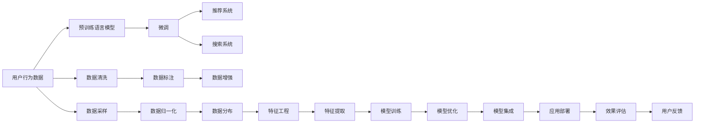

                 

# 电商平台的AI 大模型转型：搜索推荐系统是核心，数据质量控制是关键

## 1. 背景介绍

### 1.1 问题由来

近年来，人工智能（AI）技术在电商平台中的应用日益广泛，成为推动平台业务增长的重要引擎。特别是在搜索推荐系统方面，AI技术通过对用户行为数据的深度挖掘和智能推荐，极大地提升了用户购物体验和平台销售额。然而，随着用户需求的多样化和市场环境的快速变化，传统搜索推荐系统面临诸多挑战，亟需进行转型升级。

### 1.2 问题核心关键点

大模型在搜索推荐系统中的应用，正在成为电商平台AI转型的重要方向。通过预训练语言模型（如BERT、GPT等），大模型能够学习到丰富的语言和语义知识，在搜索、推荐等任务中展现出卓越的性能。但同时，大模型也带来了数据质量控制、模型推理效率、业务集成等新的挑战。

### 1.3 问题研究意义

本文聚焦于电商平台搜索推荐系统的AI转型，旨在探讨大模型技术在其中的应用潜力，并提出一套数据质量控制方案，以期在提升推荐效果的同时，保障数据安全和平台运营稳定。通过研究，希望为电商平台在AI技术应用中提供切实可行的参考。

## 2. 核心概念与联系

### 2.1 核心概念概述

为更好地理解大模型在搜索推荐系统中的应用，本节将介绍几个密切相关的核心概念：

- 大模型：以Transformer、BERT、GPT等为代表的预训练语言模型，通过在大规模无标签文本数据上进行自监督学习，学习到通用的语言表示。
- 预训练：指在大规模无标签数据上，通过自监督学习任务训练通用语言模型的过程，如掩码语言模型、下一个句子预测等。
- 微调(Fine-tuning)：在大模型的基础上，使用下游任务的标注数据，通过有监督学习优化模型性能的过程。
- 推荐系统：利用用户行为数据和商品信息，通过算法推荐用户可能感兴趣的物品的系统。
- 搜索系统：通过用户查询输入，从商品库中检索并推荐相关物品的系统。
- 数据质量控制：确保数据样本的准确性和完备性，防止数据噪声和偏差对模型训练造成影响的过程。

这些概念之间存在紧密联系，共同构成了电商平台AI转型的基础。通过预训练和微调技术，大模型能够学习到丰富的语言知识，提升推荐和搜索的精度；而数据质量控制则确保了模型的训练效果和平台运营的稳定。

### 2.2 核心概念原理和架构的 Mermaid 流程图



这个流程图展示了从用户行为数据到推荐和搜索系统的整个流程，并强调了数据质量控制的重要性。

## 3. 核心算法原理 & 具体操作步骤

### 3.1 算法原理概述

基于大模型的搜索推荐系统，其核心思想是：通过预训练语言模型学习通用的语言知识，在微调过程中，针对特定任务（如查询意图识别、物品描述匹配、用户行为预测等）进行优化，从而提高推荐和搜索的精准度。

具体来说，大模型通过自监督预训练任务学习到丰富的语言表示，然后在微调阶段，使用标注数据对其进行任务适配。在推荐系统中，大模型用于提取用户和商品之间的语义相似性，并进行个性化推荐；在搜索系统中，大模型用于解析用户查询，检索相关商品。

### 3.2 算法步骤详解

基于大模型的搜索推荐系统的一般步骤如下：

**Step 1: 准备预训练模型和数据集**
- 选择合适的预训练语言模型（如BERT、GPT等），作为初始化参数。
- 准备搜索推荐任务的数据集，包括用户行为数据、商品描述数据、查询数据等。

**Step 2: 添加任务适配层**
- 根据具体任务，在预训练模型顶层设计合适的输出层和损失函数。
- 对于推荐任务，通常使用分类任务，输出商品的相关度评分；对于搜索任务，使用回归任务，输出相关商品的距离或概率。

**Step 3: 设置微调超参数**
- 选择合适的优化算法（如AdamW、SGD等）及其参数，如学习率、批大小、迭代轮数等。
- 设置正则化技术及强度，包括权重衰减、Dropout、Early Stopping等。
- 确定冻结预训练参数的策略，如仅微调顶层，或全部参数都参与微调。

**Step 4: 执行梯度训练**
- 将训练集数据分批次输入模型，前向传播计算损失函数。
- 反向传播计算参数梯度，根据设定的优化算法和学习率更新模型参数。
- 周期性在验证集上评估模型性能，根据性能指标决定是否触发Early Stopping。
- 重复上述步骤直到满足预设的迭代轮数或Early Stopping条件。

**Step 5: 测试和部署**
- 在测试集上评估微调后模型的性能，对比微调前后的精度提升。
- 使用微调后的模型对新样本进行推理预测，集成到实际的应用系统中。
- 持续收集新的数据，定期重新微调模型，以适应数据分布的变化。

### 3.3 算法优缺点

基于大模型的搜索推荐系统具有以下优点：
1. 精度高：大模型通过自监督预训练和微调，能够学习到丰富的语言和语义知识，提升推荐和搜索的精度。
2. 鲁棒性强：大模型能够适应多样化的用户需求和数据分布，提升系统的鲁棒性。
3. 灵活性高：大模型可以通过微调适配不同的任务，灵活性高。

但同时，该方法也存在一些局限性：
1. 对标注数据依赖高：微调过程需要大量标注数据，标注成本较高。
2. 推理效率低：大模型参数量大，推理效率较低。
3. 模型复杂度高：大模型结构复杂，需要较高的计算资源。
4. 数据隐私问题：大模型在处理敏感数据时，需要严格的数据隐私保护措施。

### 3.4 算法应用领域

基于大模型的搜索推荐系统广泛应用于电商平台的各个业务环节，如：

- 商品推荐：根据用户的历史行为数据，推荐可能感兴趣的商品。
- 搜索结果排序：解析用户查询，推荐与查询最相关的商品。
- 个性化搜索：根据用户输入的查询，提供个性化的搜索结果。
- 用户画像生成：通过分析用户行为数据，生成用户画像，用于推荐和搜索。

除了这些核心应用外，大模型还在电商平台的客服、广告投放、市场分析等多个领域发挥重要作用，推动电商平台智能化转型。

## 4. 数学模型和公式 & 详细讲解

### 4.1 数学模型构建

假设预训练语言模型为 $M_{\theta}:\mathcal{X} \rightarrow \mathcal{Y}$，其中 $\mathcal{X}$ 为输入空间，$\mathcal{Y}$ 为输出空间，$\theta \in \mathbb{R}^d$ 为模型参数。假设搜索推荐任务的训练集为 $D=\{(x_i,y_i)\}_{i=1}^N, x_i \in \mathcal{X}, y_i \in \mathcal{Y}$。

定义模型 $M_{\theta}$ 在数据样本 $(x,y)$ 上的损失函数为 $\ell(M_{\theta}(x),y)$，则在数据集 $D$ 上的经验风险为：

$$
\mathcal{L}(\theta) = \frac{1}{N} \sum_{i=1}^N \ell(M_{\theta}(x_i),y_i)
$$

微调的优化目标是最小化经验风险，即找到最优参数：

$$
\theta^* = \mathop{\arg\min}_{\theta} \mathcal{L}(\theta)
$$

在实践中，我们通常使用基于梯度的优化算法（如AdamW、SGD等）来近似求解上述最优化问题。设 $\eta$ 为学习率，$\lambda$ 为正则化系数，则参数的更新公式为：

$$
\theta \leftarrow \theta - \eta \nabla_{\theta}\mathcal{L}(\theta) - \eta\lambda\theta
$$

其中 $\nabla_{\theta}\mathcal{L}(\theta)$ 为损失函数对参数 $\theta$ 的梯度，可通过反向传播算法高效计算。

### 4.2 公式推导过程

以下我们以推荐系统为例，推导交叉熵损失函数及其梯度的计算公式。

假设模型 $M_{\theta}$ 在输入 $x$ 上的输出为 $\hat{y}=M_{\theta}(x) \in [0,1]$，表示物品 $x$ 的相关度评分。真实标签 $y \in \{0,1\}$，其中 $y=1$ 表示物品 $x$ 与用户相关，$y=0$ 表示不相关。则推荐系统常用的损失函数为交叉熵损失函数：

$$
\ell(M_{\theta}(x),y) = -y\log M_{\theta}(x) - (1-y)\log(1-M_{\theta}(x))
$$

将其代入经验风险公式，得：

$$
\mathcal{L}(\theta) = -\frac{1}{N}\sum_{i=1}^N [y_i\log M_{\theta}(x_i)+(1-y_i)\log(1-M_{\theta}(x_i))]
$$

根据链式法则，损失函数对参数 $\theta_k$ 的梯度为：

$$
\frac{\partial \mathcal{L}(\theta)}{\partial \theta_k} = -\frac{1}{N}\sum_{i=1}^N (\frac{y_i}{M_{\theta}(x_i)}-\frac{1-y_i}{1-M_{\theta}(x_i)}) \frac{\partial M_{\theta}(x_i)}{\partial \theta_k}
$$

其中 $\frac{\partial M_{\theta}(x_i)}{\partial \theta_k}$ 可进一步递归展开，利用自动微分技术完成计算。

### 4.3 案例分析与讲解

假设我们使用BERT模型作为推荐系统的预训练模型，在微调过程中，我们使用推荐数据集 $D=\{(x_i,y_i)\}_{i=1}^N$，其中 $x_i$ 为用户历史行为数据，$y_i$ 为物品 $x_i$ 的相关度评分。

在微调过程中，我们设计了如下的损失函数：

$$
\mathcal{L}(\theta) = -\frac{1}{N}\sum_{i=1}^N [y_i\log M_{\theta}(x_i)+(1-y_i)\log(1-M_{\theta}(x_i))]
$$

其中，$M_{\theta}(x_i)$ 表示BERT模型在输入 $x_i$ 上的输出，即物品 $x_i$ 的相关度评分。在训练过程中，我们通过反向传播算法计算梯度，并利用优化算法更新模型参数。

例如，在AdamW优化算法下，我们设置学习率为 $2e-5$，批大小为 $128$，迭代轮数为 $10$，进行微调训练。在每个epoch结束时，我们在验证集上评估模型性能，并根据验证集上的损失和准确率调整学习率。最终，我们得到微调后的模型参数 $\theta^*$，用于实际推荐系统。

## 5. 项目实践：代码实例和详细解释说明

### 5.1 开发环境搭建

在进行搜索推荐系统的AI转型前，我们需要准备好开发环境。以下是使用Python进行PyTorch开发的环境配置流程：

1. 安装Anaconda：从官网下载并安装Anaconda，用于创建独立的Python环境。

2. 创建并激活虚拟环境：
```bash
conda create -n pytorch-env python=3.8 
conda activate pytorch-env
```

3. 安装PyTorch：根据CUDA版本，从官网获取对应的安装命令。例如：
```bash
conda install pytorch torchvision torchaudio cudatoolkit=11.1 -c pytorch -c conda-forge
```

4. 安装Transformers库：
```bash
pip install transformers
```

5. 安装各类工具包：
```bash
pip install numpy pandas scikit-learn matplotlib tqdm jupyter notebook ipython
```

完成上述步骤后，即可在`pytorch-env`环境中开始微调实践。

### 5.2 源代码详细实现

下面我们以推荐系统为例，给出使用Transformers库对BERT模型进行微调的PyTorch代码实现。

首先，定义推荐任务的数据处理函数：

```python
from transformers import BertTokenizer
from torch.utils.data import Dataset
import torch

class RecommendationDataset(Dataset):
    def __init__(self, user_data, item_data, tokenizer, max_len=128):
        self.user_data = user_data
        self.item_data = item_data
        self.tokenizer = tokenizer
        self.max_len = max_len
        
    def __len__(self):
        return len(self.user_data)
    
    def __getitem__(self, item):
        user_id, user_behaviors = self.user_data[item]
        item_id, item_info = self.item_data[item]
        
        encoding = self.tokenizer(user_behaviors, return_tensors='pt', max_length=self.max_len, padding='max_length', truncation=True)
        input_ids = encoding['input_ids'][0]
        attention_mask = encoding['attention_mask'][0]
        
        # 对物品信息进行编码
        item_info = item_info.tolist()
        item_info = [item_info] * self.max_len
        encoded_items = self.tokenizer(item_info, padding='max_length', truncation=True, return_tensors='pt')['input_ids']
        
        return {'input_ids': input_ids, 
                'attention_mask': attention_mask,
                'labels': encoded_items}
```

然后，定义模型和优化器：

```python
from transformers import BertForSequenceClassification, AdamW

model = BertForSequenceClassification.from_pretrained('bert-base-cased', num_labels=2)

optimizer = AdamW(model.parameters(), lr=2e-5)
```

接着，定义训练和评估函数：

```python
from torch.utils.data import DataLoader
from tqdm import tqdm
from sklearn.metrics import classification_report

device = torch.device('cuda') if torch.cuda.is_available() else torch.device('cpu')
model.to(device)

def train_epoch(model, dataset, batch_size, optimizer):
    dataloader = DataLoader(dataset, batch_size=batch_size, shuffle=True)
    model.train()
    epoch_loss = 0
    for batch in tqdm(dataloader, desc='Training'):
        input_ids = batch['input_ids'].to(device)
        attention_mask = batch['attention_mask'].to(device)
        labels = batch['labels'].to(device)
        model.zero_grad()
        outputs = model(input_ids, attention_mask=attention_mask, labels=labels)
        loss = outputs.loss
        epoch_loss += loss.item()
        loss.backward()
        optimizer.step()
    return epoch_loss / len(dataloader)

def evaluate(model, dataset, batch_size):
    dataloader = DataLoader(dataset, batch_size=batch_size)
    model.eval()
    preds, labels = [], []
    with torch.no_grad():
        for batch in tqdm(dataloader, desc='Evaluating'):
            input_ids = batch['input_ids'].to(device)
            attention_mask = batch['attention_mask'].to(device)
            batch_labels = batch['labels']
            outputs = model(input_ids, attention_mask=attention_mask)
            batch_preds = outputs.logits.argmax(dim=2).to('cpu').tolist()
            batch_labels = batch_labels.to('cpu').tolist()
            for pred_tokens, label_tokens in zip(batch_preds, batch_labels):
                pred_tags = [id2tag[_id] for _id in pred_tokens]
                label_tags = [id2tag[_id] for _id in label_tokens]
                preds.append(pred_tags[:len(label_tags)])
                labels.append(label_tags)
                
    print(classification_report(labels, preds))
```

最后，启动训练流程并在测试集上评估：

```python
epochs = 5
batch_size = 16

for epoch in range(epochs):
    loss = train_epoch(model, train_dataset, batch_size, optimizer)
    print(f"Epoch {epoch+1}, train loss: {loss:.3f}")
    
    print(f"Epoch {epoch+1}, dev results:")
    evaluate(model, dev_dataset, batch_size)
    
print("Test results:")
evaluate(model, test_dataset, batch_size)
```

以上就是使用PyTorch对BERT进行推荐系统微调的完整代码实现。可以看到，得益于Transformers库的强大封装，我们可以用相对简洁的代码完成BERT模型的加载和微调。

### 5.3 代码解读与分析

让我们再详细解读一下关键代码的实现细节：

**RecommendationDataset类**：
- `__init__`方法：初始化用户行为数据、物品信息、分词器等关键组件。
- `__len__`方法：返回数据集的样本数量。
- `__getitem__`方法：对单个样本进行处理，将用户行为数据和物品信息输入编码为token ids，并对其进行定长padding，最终返回模型所需的输入。

**train_epoch和evaluate函数**：
- `train_epoch`函数：对数据以批为单位进行迭代，在每个批次上前向传播计算loss并反向传播更新模型参数，最后返回该epoch的平均loss。
- `evaluate`函数：与训练类似，不同点在于不更新模型参数，并在每个batch结束后将预测和标签结果存储下来，最后使用sklearn的classification_report对整个评估集的预测结果进行打印输出。

**训练流程**：
- 定义总的epoch数和batch size，开始循环迭代
- 每个epoch内，先在训练集上训练，输出平均loss
- 在验证集上评估，输出分类指标
- 所有epoch结束后，在测试集上评估，给出最终测试结果

可以看到，PyTorch配合Transformers库使得BERT微调的代码实现变得简洁高效。开发者可以将更多精力放在数据处理、模型改进等高层逻辑上，而不必过多关注底层的实现细节。

当然，工业级的系统实现还需考虑更多因素，如模型的保存和部署、超参数的自动搜索、更灵活的任务适配层等。但核心的微调范式基本与此类似。

## 6. 实际应用场景

### 6.1 智能推荐系统

基于大模型的推荐系统在电商平台的商品推荐中取得了显著的效果，成为提升用户满意度和平台销售额的重要手段。传统推荐系统往往依赖于用户的历史行为数据进行推荐，难以适应用户的突发兴趣和多样化需求。而使用微调后的推荐模型，可以实时获取用户的最新兴趣信息，进行个性化的推荐，极大地提升推荐效果。

例如，在电商平台上，我们可以收集用户的浏览记录、购买记录、评价反馈等行为数据，使用BERT模型进行预训练，然后在微调过程中加入最新的用户行为数据。微调后的模型可以实时解析用户输入的查询，从推荐库中检索出相关商品，并进行排序推荐。此外，微调模型还可以学习商品间的语义相似性，提升相似商品之间的推荐相关度，增加用户停留时间和购物转化率。

### 6.2 智能搜索系统

搜索系统在电商平台中起着至关重要的作用，影响用户的购物体验和满意度。传统搜索系统往往依赖于关键词匹配，难以处理复杂的自然语言查询和语义理解。而使用微调后的搜索模型，可以更好地理解用户输入的查询，进行语义匹配和相关性排序，提升搜索结果的相关性和用户体验。

例如，在电商平台上，我们可以收集用户的历史搜索记录、相关性标注等数据，使用BERT模型进行预训练，然后在微调过程中加入新的搜索数据。微调后的模型可以解析用户输入的自然语言查询，从商品库中检索出相关商品，并进行排序推荐。此外，微调模型还可以学习商品的描述信息，提升查询结果的匹配度和可读性，增强用户的搜索体验。

### 6.3 用户画像生成

用户画像生成是电商平台个性化推荐和智能搜索的重要环节，通过分析用户行为数据，生成详细的用户画像，帮助平台更好地理解用户需求，进行个性化推荐和搜索。传统的用户画像生成方法往往依赖于规则和统计方法，难以应对复杂多变的数据分布和用户需求。而使用微调后的用户画像生成模型，可以更好地捕捉用户的行为模式和兴趣偏好，生成更加准确、全面、动态的用户画像。

例如，在电商平台上，我们可以收集用户的历史行为数据，如浏览记录、购买记录、评价反馈等，使用BERT模型进行预训练，然后在微调过程中加入新的用户行为数据。微调后的模型可以学习用户的兴趣偏好和行为模式，生成详细的用户画像，用于推荐和搜索。此外，微调模型还可以学习用户画像之间的相似性，提升推荐和搜索的个性化程度，增加用户的满意度。

### 6.4 未来应用展望

随着大模型和微调技术的不断发展，基于搜索推荐系统的AI转型将在电商平台上带来更多创新应用。

在智慧客服系统方面，基于微调的推荐和搜索模型可以实时解析用户输入，提供个性化的客服回复，提升用户互动体验。例如，电商平台可以收集用户的历史搜索记录、聊天对话等数据，使用BERT模型进行预训练，然后在微调过程中加入新的客服对话数据。微调后的模型可以实时解析用户的输入，从商品库中检索出相关商品，并生成个性化的客服回复，增强用户的购物体验。

在广告投放系统方面，基于微调的推荐和搜索模型可以精准匹配用户的兴趣和需求，提升广告投放效果。例如，电商平台可以收集用户的浏览记录、购买记录等行为数据，使用BERT模型进行预训练，然后在微调过程中加入新的广告数据。微调后的模型可以学习用户的兴趣偏好，推荐相关的广告内容，增加广告的点击率和转化率。

在市场分析系统方面，基于微调的推荐和搜索模型可以深入挖掘用户的潜在意图和行为模式，帮助平台进行市场分析和决策支持。例如，电商平台可以收集用户的搜索记录、评价反馈等数据，使用BERT模型进行预训练，然后在微调过程中加入新的市场数据。微调后的模型可以学习用户的潜在意图和行为模式，分析市场趋势和用户需求，帮助平台进行市场分析和决策支持。

## 7. 工具和资源推荐

### 7.1 学习资源推荐

为了帮助开发者系统掌握搜索推荐系统的AI转型，这里推荐一些优质的学习资源：

1. 《Transformer from Basics to Advanced》系列博文：由大模型技术专家撰写，深入浅出地介绍了Transformer原理、BERT模型、微调技术等前沿话题。

2. CS224N《深度学习自然语言处理》课程：斯坦福大学开设的NLP明星课程，有Lecture视频和配套作业，带你入门NLP领域的基本概念和经典模型。

3. 《Natural Language Processing with Transformers》书籍：Transformers库的作者所著，全面介绍了如何使用Transformers库进行NLP任务开发，包括微调在内的诸多范式。

4. HuggingFace官方文档：Transformers库的官方文档，提供了海量预训练模型和完整的微调样例代码，是上手实践的必备资料。

5. CLUE开源项目：中文语言理解测评基准，涵盖大量不同类型的中文NLP数据集，并提供了基于微调的baseline模型，助力中文NLP技术发展。

通过对这些资源的学习实践，相信你一定能够快速掌握搜索推荐系统的AI转型方法，并用于解决实际的NLP问题。

### 7.2 开发工具推荐

高效的开发离不开优秀的工具支持。以下是几款用于搜索推荐系统AI转型的常用工具：

1. PyTorch：基于Python的开源深度学习框架，灵活动态的计算图，适合快速迭代研究。大部分预训练语言模型都有PyTorch版本的实现。

2. TensorFlow：由Google主导开发的开源深度学习框架，生产部署方便，适合大规模工程应用。同样有丰富的预训练语言模型资源。

3. Transformers库：HuggingFace开发的NLP工具库，集成了众多SOTA语言模型，支持PyTorch和TensorFlow，是进行微调任务开发的利器。

4. Weights & Biases：模型训练的实验跟踪工具，可以记录和可视化模型训练过程中的各项指标，方便对比和调优。与主流深度学习框架无缝集成。

5. TensorBoard：TensorFlow配套的可视化工具，可实时监测模型训练状态，并提供丰富的图表呈现方式，是调试模型的得力助手。

6. Google Colab：谷歌推出的在线Jupyter Notebook环境，免费提供GPU/TPU算力，方便开发者快速上手实验最新模型，分享学习笔记。

合理利用这些工具，可以显著提升搜索推荐系统的AI转型效率，加快创新迭代的步伐。

### 7.3 相关论文推荐

搜索推荐系统的发展源于学界的持续研究。以下是几篇奠基性的相关论文，推荐阅读：

1. Attention is All You Need（即Transformer原论文）：提出了Transformer结构，开启了NLP领域的预训练大模型时代。

2. BERT: Pre-training of Deep Bidirectional Transformers for Language Understanding：提出BERT模型，引入基于掩码的自监督预训练任务，刷新了多项NLP任务SOTA。

3. Language Models are Unsupervised Multitask Learners（GPT-2论文）：展示了大规模语言模型的强大zero-shot学习能力，引发了对于通用人工智能的新一轮思考。

4. Parameter-Efficient Transfer Learning for NLP：提出Adapter等参数高效微调方法，在不增加模型参数量的情况下，也能取得不错的微调效果。

5. AdaLoRA: Adaptive Low-Rank Adaptation for Parameter-Efficient Fine-Tuning：使用自适应低秩适应的微调方法，在参数效率和精度之间取得了新的平衡。

这些论文代表了大模型微调技术的发展脉络。通过学习这些前沿成果，可以帮助研究者把握学科前进方向，激发更多的创新灵感。

## 8. 总结：未来发展趋势与挑战

### 8.1 总结

本文对基于大模型的电商搜索推荐系统的AI转型进行了全面系统的介绍。首先阐述了搜索推荐系统在大模型应用中的重要性和挑战，明确了微调在提升推荐效果、搜索精度和个性化程度方面的独特价值。其次，从原理到实践，详细讲解了微调的具体步骤和实施方法，给出了微调任务开发的完整代码实例。同时，本文还探讨了微调技术在电商平台的多个应用场景，展示了微调范式的巨大潜力。此外，本文精选了微调技术的各类学习资源，力求为开发者提供全方位的技术指引。

通过本文的系统梳理，可以看到，基于大模型的搜索推荐系统正在成为电商平台AI转型的重要方向，极大地提升了推荐和搜索的精度和个性化程度，为用户带来了更优质的购物体验。随着大模型和微调技术的不断发展，基于搜索推荐系统的AI转型必将在电商平台上迎来更多创新应用，为平台带来新的增长动力。

### 8.2 未来发展趋势

展望未来，搜索推荐系统的AI转型将呈现以下几个发展趋势：

1. 模型规模持续增大。随着算力成本的下降和数据规模的扩张，预训练语言模型的参数量还将持续增长。超大规模语言模型蕴含的丰富语言知识，有望支撑更加复杂多变的推荐和搜索任务。

2. 微调方法日趋多样。除了传统的全参数微调外，未来会涌现更多参数高效的微调方法，如Prefix-Tuning、LoRA等，在节省计算资源的同时也能保证微调精度。

3. 持续学习成为常态。随着数据分布的不断变化，微调模型也需要持续学习新知识以保持性能。如何在不遗忘原有知识的同时，高效吸收新样本信息，将成为重要的研究课题。

4. 标注样本需求降低。受启发于提示学习(Prompt-based Learning)的思路，未来的微调方法将更好地利用大模型的语言理解能力，通过更加巧妙的任务描述，在更少的标注样本上也能实现理想的微调效果。

5. 多模态微调崛起。当前的微调主要聚焦于纯文本数据，未来会进一步拓展到图像、视频、语音等多模态数据微调。多模态信息的融合，将显著提升语言模型对现实世界的理解和建模能力。

6. 模型通用性增强。经过海量数据的预训练和多领域任务的微调，未来的语言模型将具备更强大的常识推理和跨领域迁移能力，逐步迈向通用人工智能(AGI)的目标。

以上趋势凸显了大模型微调技术的广阔前景。这些方向的探索发展，必将进一步提升搜索推荐系统的性能和应用范围，为电商平台智能化转型提供新的技术路径。

### 8.3 面临的挑战

尽管大模型微调技术已经取得了瞩目成就，但在迈向更加智能化、普适化应用的过程中，它仍面临着诸多挑战：

1. 标注成本瓶颈。虽然微调大大降低了标注数据的需求，但对于长尾应用场景，难以获得充足的高质量标注数据，成为制约微调性能的瓶颈。如何进一步降低微调对标注样本的依赖，将是一大难题。

2. 模型鲁棒性不足。当前微调模型面对域外数据时，泛化性能往往大打折扣。对于测试样本的微小扰动，微调模型的预测也容易发生波动。如何提高微调模型的鲁棒性，避免灾难性遗忘，还需要更多理论和实践的积累。

3. 推理效率低。大模型参数量大，推理效率较低。如何通过模型压缩、量化加速等技术优化推理效率，提高用户体验，是需要解决的重要问题。

4. 模型可解释性不足。当前微调模型更像是"黑盒"系统，难以解释其内部工作机制和决策逻辑。对于医疗、金融等高风险应用，算法的可解释性和可审计性尤为重要。如何赋予微调模型更强的可解释性，将是亟待攻克的难题。

5. 数据隐私问题。预训练语言模型在处理敏感数据时，需要严格的数据隐私保护措施。如何在使用大模型时保护用户隐私，避免数据泄露，也是研究的重要方向。

6. 知识整合能力不足。现有的微调模型往往局限于任务内数据，难以灵活吸收和运用更广泛的先验知识。如何让微调过程更好地与外部知识库、规则库等专家知识结合，形成更加全面、准确的信息整合能力，还有很大的想象空间。

正视微调面临的这些挑战，积极应对并寻求突破，将是大模型微调走向成熟的必由之路。相信随着学界和产业界的共同努力，这些挑战终将一一被克服，大模型微调必将在构建智能推荐系统、智能搜索系统等方面发挥更大作用。

### 8.4 研究展望

面对大模型微调所面临的挑战，未来的研究需要在以下几个方面寻求新的突破：

1. 探索无监督和半监督微调方法。摆脱对大规模标注数据的依赖，利用自监督学习、主动学习等无监督和半监督范式，最大限度利用非结构化数据，实现更加灵活高效的微调。

2. 研究参数高效和计算高效的微调范式。开发更加参数高效的微调方法，在固定大部分预训练参数的同时，只更新极少量的任务相关参数。同时优化微调模型的计算图，减少前向传播和反向传播的资源消耗，实现更加轻量级、实时性的部署。

3. 融合因果和对比学习范式。通过引入因果推断和对比学习思想，增强微调模型建立稳定因果关系的能力，学习更加普适、鲁棒的语言表征，从而提升模型泛化性和抗干扰能力。

4. 引入更多先验知识。将符号化的先验知识，如知识图谱、逻辑规则等，与神经网络模型进行巧妙融合，引导微调过程学习更准确、合理的语言模型。同时加强不同模态数据的整合，实现视觉、语音等多模态信息与文本信息的协同建模。

5. 结合因果分析和博弈论工具。将因果分析方法引入微调模型，识别出模型决策的关键特征，增强输出解释的因果性和逻辑性。借助博弈论工具刻画人机交互过程，主动探索并规避模型的脆弱点，提高系统稳定性。

6. 纳入伦理道德约束。在模型训练目标中引入伦理导向的评估指标，过滤和惩罚有偏见、有害的输出倾向。同时加强人工干预和审核，建立模型行为的监管机制，确保输出符合人类价值观和伦理道德。

这些研究方向的探索，必将引领大模型微调技术迈向更高的台阶，为构建安全、可靠、可解释、可控的智能系统铺平道路。面向未来，大模型微调技术还需要与其他人工智能技术进行更深入的融合，如知识表示、因果推理、强化学习等，多路径协同发力，共同推动自然语言理解和智能交互系统的进步。只有勇于创新、敢于突破，才能不断拓展语言模型的边界，让智能技术更好地造福人类社会。

## 9. 附录：常见问题与解答

**Q1：大模型微调是否适用于所有搜索推荐任务？**

A: 大模型微调在大多数搜索推荐任务上都能取得不错的效果，特别是对于数据量较小的任务。但对于一些特定领域的任务，如医学、法律等，仅仅依靠通用语料预训练的模型可能难以很好地适应。此时需要在特定领域语料上进一步预训练，再进行微调，才能获得理想效果。此外，对于一些需要时效性、个性化很强的任务，如对话、推荐等，微调方法也需要针对性的改进优化。

**Q2：微调过程中如何选择合适的学习率？**

A: 微调的学习率一般要比预训练时小1-2个数量级，如果使用过大的学习率，容易破坏预训练权重，导致过拟合。一般建议从1e-5开始调参，逐步减小学习率。如果使用AdamW优化器，还可以考虑warmup策略，在开始阶段使用较小的学习率，再逐渐过渡到预设值。需要注意的是，不同的优化器(如AdamW、Adafactor等)以及不同的学习率调度策略，可能需要设置不同的学习率阈值。

**Q3：采用大模型微调时会面临哪些资源瓶颈？**

A: 目前主流的预训练大模型动辄以亿计的参数规模，对算力、内存、存储都提出了很高的要求。GPU/TPU等高性能设备是必不可少的，但即便如此，超大批次的训练和推理也可能遇到显存不足的问题。因此需要采用一些资源优化技术，如梯度积累、混合精度训练、模型并行等，来突破硬件瓶颈。同时，模型的存储和读取也可能占用大量时间和空间，需要采用模型压缩、稀疏化存储等方法进行优化。

**Q4：如何缓解微调过程中的过拟合问题？**

A: 过拟合是微调面临的主要挑战，尤其是在标注数据不足的情况下。常见的缓解策略包括：
1. 数据增强：通过回译、近义替换等方式扩充训练集
2. 正则化：使用L2正则、Dropout、Early Stopping等避免过拟合
3. 对抗训练：引入对抗样本，提高模型鲁棒性
4. 参数高效微调：只调整少量参数(如Adapter、Prefix等)，减小过拟合风险
5. 多模型集成：训练多个微调模型，取平均输出，抑制过拟合

这些策略往往需要根据具体任务和数据特点进行灵活组合。只有在数据、模型、训练、推理等各环节进行全面优化，才能最大限度地发挥大模型微调的威力。

**Q5：微调模型在落地部署时需要注意哪些问题？**

A: 将微调模型转化为实际应用，还需要考虑以下因素：
1. 模型裁剪：去除不必要的层和参数，减小模型尺寸，加快推理速度
2. 量化加速：将浮点模型转为定点模型，压缩存储空间，提高计算效率
3. 服务化封装：将模型封装为标准化服务接口，便于集成调用
4. 弹性伸缩：根据请求流量动态调整资源配置，平衡服务质量和成本
5. 监控告警：实时采集系统指标，设置异常告警阈值，确保服务稳定性
6. 安全防护：采用访问鉴权、数据脱敏等措施，保障数据和模型安全

大模型微调为NLP应用开启了广阔的想象空间，但如何将强大的性能转化为稳定、高效、安全的业务价值，还需要工程实践的不断打磨。唯有从数据、算法、工程、业务等多个维度协同发力，才能真正实现人工智能技术在垂直行业的规模化落地。总之，微调需要开发者根据具体任务，不断迭代和优化模型、数据和算法，方能得到理想的效果。

---

作者：禅与计算机程序设计艺术 / Zen and the Art of Computer Programming

