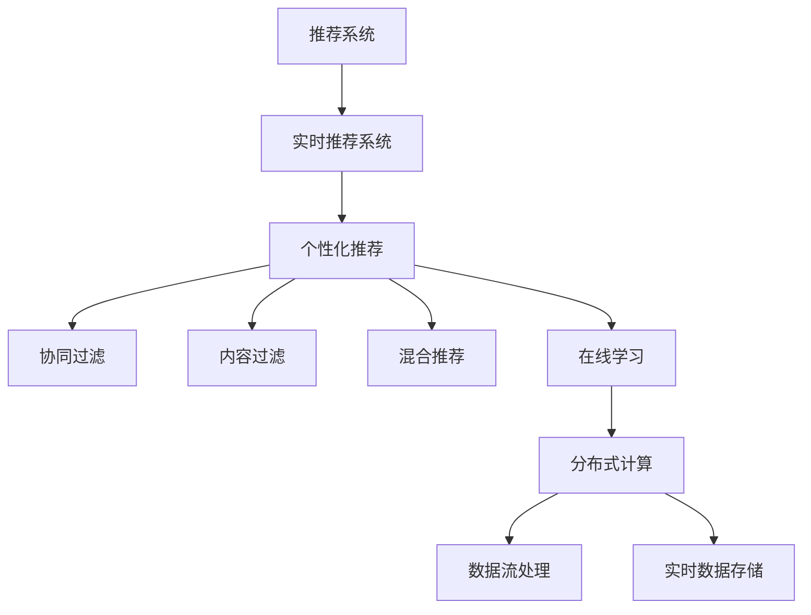

                 

## 1. 背景介绍

### 1.1 问题由来
在电商领域，推荐系统作为提升用户购物体验和公司运营效率的核心技术，已经变得越来越重要。随着电商平台的快速发展，用户的个性化需求也随之增强，如何在海量用户数据中找到每个用户的独特需求，提供精准的个性化推荐，成为了推荐系统的重要挑战。

传统的推荐系统大多基于用户历史行为数据进行离线计算，推荐结果不够实时化，难以捕捉用户即时需求。而且，离线计算也难以动态调整模型参数，限制了系统的灵活性和准确性。

为了解决这些问题，实时个性化推荐系统应运而生。实时推荐系统能够实时接收用户行为数据，及时更新模型参数，提供即时、个性化的商品推荐，有效提升用户体验和购物转化率。

### 1.2 问题核心关键点
实时个性化推荐系统主要包括以下几个关键点：

1. **实时性**：系统需要能够实时接收用户数据，快速处理并生成推荐结果。
2. **个性化**：系统需要根据每个用户的历史行为、兴趣偏好等个性化特征，生成量身定制的推荐内容。
3. **性能可扩展性**：系统需要能够处理海量用户数据，并保证高并发、低延迟的性能要求。
4. **数据安全与隐私保护**：系统需要确保用户数据的安全性，保护用户的隐私。
5. **模型与算法**：系统需要采用高效的推荐算法和模型，以获得更好的推荐效果。

本文将深入探讨实时个性化推荐系统的核心概念、算法原理、具体实现方法及其实际应用场景，为读者提供全方位的技术指引。

## 2. 核心概念与联系

### 2.1 核心概念概述

为更好地理解实时个性化推荐系统，本节将介绍几个关键核心概念及其相互联系：

1. **推荐系统**：通过分析用户的历史行为和兴趣偏好，向用户推荐可能感兴趣的物品或服务的技术。推荐系统分为离线计算和实时计算两种类型。

2. **实时推荐系统**：利用用户实时行为数据进行即时推荐，能够捕捉用户即时需求。

3. **个性化推荐**：根据每个用户的历史行为、兴趣偏好等特征，生成个性化推荐内容。

4. **协同过滤**：通过分析用户行为数据，挖掘用户间的相似性，生成推荐结果。

5. **内容过滤**：根据物品的特征，如商品属性、标签等，生成推荐结果。

6. **混合推荐**：结合协同过滤和内容过滤两种方式，生成推荐结果，以提高推荐精度。

7. **在线学习**：通过实时接收用户行为数据，在线更新模型参数，以获得更好的推荐效果。

8. **分布式计算**：采用分布式架构，以处理海量数据和高并发请求。

9. **数据流处理**：处理连续、流式的数据流，以实现实时推荐。

10. **实时数据存储**：采用高效的数据存储和检索技术，以支持实时推荐。

这些核心概念之间的逻辑关系可以通过以下Mermaid流程图来展示：



这个流程图展示了实时个性化推荐系统的核心概念及其相互关系：

1. 推荐系统是整个系统的基础。
2. 实时推荐系统利用用户实时行为数据，实现即时推荐。
3. 个性化推荐基于用户个性化特征，生成个性化推荐内容。
4. 协同过滤和内容过滤是推荐的主要手段。
5. 混合推荐结合两种方式，提高推荐效果。
6. 在线学习实时更新模型参数，获得更好的推荐精度。
7. 分布式计算和数据流处理支持高并发和低延迟的实时推荐。
8. 实时数据存储保证数据的高效读写和存储。

## 3. 核心算法原理 & 具体操作步骤
### 3.1 算法原理概述

实时个性化推荐系统的核心算法原理主要包括两部分：

1. **实时数据流处理**：利用数据流处理技术，实时接收用户行为数据，并将其转换为推荐引擎可用的数据流。
2. **在线学习算法**：利用在线学习算法，根据实时数据流，动态更新推荐模型参数，生成推荐结果。

### 3.2 算法步骤详解

实时个性化推荐系统的算法步骤主要包括：

1. **数据流采集**：实时收集用户行为数据，如点击、浏览、购买等行为，生成数据流。
2. **数据流预处理**：对数据流进行预处理，去除噪声和异常值，生成标准化的数据流。
3. **实时推荐引擎**：将预处理后的数据流输入推荐引擎，根据实时数据流，动态更新模型参数。
4. **推荐结果生成**：根据更新后的模型参数，生成个性化推荐结果。
5. **推荐结果反馈**：将推荐结果返回给用户，并收集用户反馈数据，用于后续的模型更新。

### 3.3 算法优缺点

实时个性化推荐系统具有以下优点：

1. **实时性**：能够实时捕捉用户即时需求，提高推荐精度。
2. **个性化**：根据用户个性化特征，生成量身定制的推荐内容。
3. **灵活性**：能够实时更新模型参数，适应用户行为变化。
4. **高效性**：利用数据流处理和在线学习算法，处理海量数据和高并发请求。

同时，该系统也存在以下缺点：

1. **数据质量要求高**：实时数据流的质量直接决定了推荐效果，需要确保数据的准确性和完整性。
2. **算法复杂度高**：实时推荐系统需要同时处理大规模数据流和实时更新模型参数，算法复杂度较高。
3. **资源消耗大**：实时数据流处理和在线学习算法需要大量计算资源，对系统性能和存储要求较高。
4. **安全性和隐私保护**：实时数据流的收集和使用需要确保用户数据的隐私和安全。

### 3.4 算法应用领域

实时个性化推荐系统在电商、金融、广告等多个领域都有广泛应用，具体包括以下几个方面：

1. **电商推荐系统**：通过实时分析用户行为数据，生成个性化推荐内容，提升用户体验和购物转化率。
2. **金融推荐系统**：实时分析用户交易数据，生成个性化金融产品推荐，提高用户满意度。
3. **广告推荐系统**：实时分析用户浏览行为，生成个性化广告推荐，提高广告投放效果。
4. **智能客服系统**：通过实时分析用户对话内容，生成个性化推荐问题，提升客户服务质量。
5. **社交网络推荐系统**：实时分析用户互动数据，生成个性化内容推荐，提高用户粘性和活跃度。

## 4. 数学模型和公式 & 详细讲解 & 举例说明

### 4.1 数学模型构建

本节将使用数学语言对实时个性化推荐系统的推荐算法进行更加严格的刻画。

记用户行为数据为 $X_t = (x_1, x_2, ..., x_n)$，其中 $x_i$ 表示用户在第 $i$ 个时间步的行为数据。记推荐模型参数为 $\theta$，则实时推荐算法可以表示为：

$$
\hat{y}_t = f(X_t; \theta)
$$

其中，$f$ 表示推荐模型，$\hat{y}_t$ 表示在时间步 $t$ 的推荐结果。

### 4.2 公式推导过程

为了具体说明实时推荐算法的实现过程，以协同过滤为例，进行详细推导。

假设用户 $u$ 对物品 $i$ 的评分数据为 $R_{ui}$，将所有用户对物品的评分数据表示为矩阵 $R \in \mathbb{R}^{m \times n}$，其中 $m$ 表示物品数，$n$ 表示用户数。

协同过滤的推荐算法可以通过求解矩阵 $R$ 的补全矩阵 $R_u$ 来实现，即：

$$
R_u = \frac{1}{N} R W_u
$$

其中 $W_u \in \mathbb{R}^{n \times m}$ 表示用户 $u$ 的特征向量。

将 $R_u$ 代入推荐公式中，得到推荐结果：

$$
\hat{y}_{ui} = \frac{1}{N} \sum_{j=1}^n R_{uj} R_{ij}
$$

### 4.3 案例分析与讲解

假设电商推荐系统采用协同过滤算法，用户 $u$ 对物品 $i$ 的评分数据为 $R_{ui} = 4$，所有用户对物品的评分数据表示为矩阵 $R$：

$$
R = 
\begin{bmatrix}
    4 & 2 & 1 \\
    1 & 3 & 4 \\
    2 & 5 & 0 \\
    0 & 1 & 2 \\
\end{bmatrix}
$$

将所有用户对物品的评分数据进行归一化，得到 $N = 10$。假设用户 $u$ 的特征向量为 $W_u = [1, 0, 1]$，则物品 $i$ 的补全矩阵为：

$$
R_u = \frac{1}{10} 
\begin{bmatrix}
    4 & 2 & 1 \\
    1 & 3 & 4 \\
    2 & 5 & 0 \\
    0 & 1 & 2 \\
\end{bmatrix}
\begin{bmatrix}
    1 & 0 & 1 \\
\end{bmatrix}
=
\begin{bmatrix}
    2.2 & 0.2 & 0.2 \\
    0.2 & 0.3 & 0.4 \\
    0.2 & 0.5 & 0. \\
    0 & 0.1 & 0.2 \\
\end{bmatrix}
$$

将 $R_u$ 代入推荐公式中，得到推荐结果：

$$
\hat{y}_{ui} = \frac{1}{10} (2.2 \times 1 + 0.2 \times 3 + 0.2 \times 4) = 2.1
$$

因此，推荐系统推荐物品 $i$ 给用户 $u$ 的评分数据为 $2.1$。

## 5. 项目实践：代码实例和详细解释说明
### 5.1 开发环境搭建

在进行实时推荐系统开发前，我们需要准备好开发环境。以下是使用Python进行PyTorch开发的环境配置流程：

1. 安装Anaconda：从官网下载并安装Anaconda，用于创建独立的Python环境。

2. 创建并激活虚拟环境：
```bash
conda create -n recommendation-env python=3.8 
conda activate recommendation-env
```

3. 安装PyTorch：根据CUDA版本，从官网获取对应的安装命令。例如：
```bash
conda install pytorch torchvision torchaudio cudatoolkit=11.1 -c pytorch -c conda-forge
```

4. 安装各类工具包：
```bash
pip install numpy pandas scikit-learn matplotlib tqdm jupyter notebook ipython
```

完成上述步骤后，即可在`recommendation-env`环境中开始推荐系统开发。

### 5.2 源代码详细实现

这里我们以电商推荐系统为例，给出使用PyTorch实现实时推荐系统的代码实现。

首先，定义用户行为数据类：

```python
import torch

class UserBehavior:
    def __init__(self, user_ids, item_ids, ratings):
        self.user_ids = user_ids
        self.item_ids = item_ids
        self.ratings = ratings
        
    def __len__(self):
        return len(self.user_ids)
        
    def __getitem__(self, item):
        user_id = self.user_ids[item]
        item_id = self.item_ids[item]
        rating = self.ratings[item]
        return torch.tensor([user_id, item_id, rating], dtype=torch.long)
```

然后，定义推荐模型类：

```python
import torch.nn as nn
import torch.nn.functional as F

class Recommender(nn.Module):
    def __init__(self, num_users, num_items, emb_dim):
        super(Recommender, self).__init__()
        self.user_embed = nn.Embedding(num_users, emb_dim)
        self.item_embed = nn.Embedding(num_items, emb_dim)
        self.fc = nn.Linear(emb_dim*2, 1)
    
    def forward(self, user_ids, item_ids):
        user_emb = self.user_embed(user_ids)
        item_emb = self.item_embed(item_ids)
        hidden = torch.cat([user_emb, item_emb], dim=1)
        return self.fc(hidden).squeeze(1)
```

接着，定义数据流处理函数：

```python
import torch
import numpy as np

def process_data_stream(user_behaviors, batch_size=128):
    user_ids = []
    item_ids = []
    ratings = []
    for user_behavior in user_behaviors:
        for i in range(len(user_behavior)):
            user_ids.append(user_behavior[i][0])
            item_ids.append(user_behavior[i][1])
            ratings.append(user_behavior[i][2])
            
    user_ids = torch.tensor(user_ids, dtype=torch.long)
    item_ids = torch.tensor(item_ids, dtype=torch.long)
    ratings = torch.tensor(ratings, dtype=torch.float)
    
    while True:
        indices = np.random.choice(len(user_ids), size=batch_size, replace=False)
        batch_user_ids = user_ids[indices]
        batch_item_ids = item_ids[indices]
        batch_ratings = ratings[indices]
        yield batch_user_ids, batch_item_ids, batch_ratings
```

最后，启动推荐系统流程并在测试集上评估：

```python
import torch.optim as optim
from torch.utils.data import DataLoader

num_users = 1000
num_items = 10000
emb_dim = 10

recommender = Recommender(num_users, num_items, emb_dim)
optimizer = optim.Adam(recommender.parameters(), lr=0.001)

user_behaviors = []
for i in range(1000):
    user_behaviors.append([[i, np.random.randint(1, 10000), np.random.uniform(0, 5)] for _ in range(100)])

data_stream = process_data_stream(user_behaviors)

for epoch in range(1000):
    for batch_user_ids, batch_item_ids, batch_ratings in data_stream:
        optimizer.zero_grad()
        ratings_pred = recommender(batch_user_ids, batch_item_ids)
        loss = F.mse_loss(ratings_pred, batch_ratings)
        loss.backward()
        optimizer.step()
        
    if (epoch+1) % 100 == 0:
        print(f"Epoch {epoch+1}, loss: {loss.item()}")
        
test_user_behaviors = []
for i in range(1000):
    test_user_behaviors.append([[i, np.random.randint(1, 10000), np.random.uniform(0, 5)] for _ in range(100)])

data_stream = process_data_stream(test_user_behaviors)

total_rmse = 0
for batch_user_ids, batch_item_ids, batch_ratings in data_stream:
    ratings_pred = recommender(batch_user_ids, batch_item_ids)
    rmse = torch.sqrt(torch.mean((ratings_pred - batch_ratings)**2))
    total_rmse += rmse.item()

print(f"Test RMSE: {total_rmse/len(data_stream)}")
```

以上就是使用PyTorch实现实时推荐系统的完整代码实现。可以看到，借助PyTorch和Numpy，实现实时推荐系统的代码变得简洁高效。

### 5.3 代码解读与分析

让我们再详细解读一下关键代码的实现细节：

**UserBehavior类**：
- `__init__`方法：初始化用户行为数据，包括用户ID、物品ID和评分。
- `__len__`方法：返回用户行为数据的长度。
- `__getitem__`方法：返回指定索引的用户行为数据。

**Recommender类**：
- `__init__`方法：定义模型参数，包括用户嵌入层、物品嵌入层和全连接层。
- `forward`方法：前向传播，计算推荐结果。

**process_data_stream函数**：
- 利用Numpy生成用户行为数据，并通过DataLoader处理，生成可迭代的数据流。
- 每次生成一个batch，用于训练和测试。

**推荐系统流程**：
- 定义用户行为数据、模型、优化器、数据流处理函数。
- 在每个epoch内，循环迭代数据流，使用Adam优化器更新模型参数。
- 在每个epoch结束后，输出损失值。
- 在测试集上计算推荐结果的均方根误差。

通过以上代码，我们可以看到实时推荐系统从数据流处理、模型定义到训练和测试的全过程。合理利用PyTorch等工具，可以显著提升实时推荐系统的开发效率，实现精准、高效的个性化推荐。

## 6. 实际应用场景

### 6.1 电商推荐系统

电商推荐系统是实时个性化推荐系统的典型应用场景。电商平台通过实时分析用户行为数据，如浏览、点击、购买等行为，生成个性化推荐内容，提升用户体验和购物转化率。

在实际应用中，电商推荐系统可以采用多种推荐算法，如协同过滤、内容过滤、混合推荐等，结合实时数据流处理和在线学习算法，生成实时推荐结果。电商推荐系统还能够动态调整模型参数，适应用户行为变化，进一步提升推荐效果。

### 6.2 金融推荐系统

金融推荐系统通过实时分析用户交易数据，生成个性化金融产品推荐，提高用户满意度。

金融推荐系统需要处理大量金融交易数据，包含用户行为数据、产品数据、市场数据等多种类型的数据。通过实时数据流处理和在线学习算法，金融推荐系统可以实时捕捉用户需求，生成个性化推荐内容。金融推荐系统还可以结合用户兴趣和行为数据，进行风险评估和金融产品推荐，提高用户黏性和满意度。

### 6.3 广告推荐系统

广告推荐系统通过实时分析用户浏览行为，生成个性化广告推荐，提高广告投放效果。

广告推荐系统需要处理海量用户数据和广告数据，实时分析用户行为数据，生成个性化广告推荐。广告推荐系统可以结合用户行为数据和广告数据，进行多维度广告推荐，提高广告点击率和转化率。广告推荐系统还可以结合实时数据流处理和在线学习算法，动态调整模型参数，适应用户行为变化，进一步提升推荐效果。

## 7. 工具和资源推荐

### 7.1 学习资源推荐

为了帮助开发者系统掌握实时个性化推荐系统的理论基础和实践技巧，这里推荐一些优质的学习资源：

1. 《推荐系统实践》系列博文：由推荐系统专家撰写，深入浅出地介绍了推荐系统的基本概念和经典模型。

2. CS446《推荐系统》课程：斯坦福大学开设的推荐系统课程，有Lecture视频和配套作业，带你深入了解推荐系统的基本原理。

3. 《推荐系统：算法与实现》书籍：推荐系统领域的经典教材，全面介绍了推荐算法的原理和实现方法。

4. Kaggle推荐系统竞赛：Kaggle平台上的推荐系统竞赛，提供大量数据和样例代码，适合实践和竞赛学习。

通过对这些资源的学习实践，相信你一定能够快速掌握实时个性化推荐系统的精髓，并用于解决实际的推荐问题。

### 7.2 开发工具推荐

高效的开发离不开优秀的工具支持。以下是几款用于实时推荐系统开发的常用工具：

1. PyTorch：基于Python的开源深度学习框架，灵活动态的计算图，适合快速迭代研究。大部分推荐系统都有PyTorch版本的实现。

2. TensorFlow：由Google主导开发的开源深度学习框架，生产部署方便，适合大规模工程应用。同样有丰富的推荐系统资源。

3. Dask：分布式计算库，适合处理大规模数据流，支持高并发和低延迟的实时推荐。

4. Apache Kafka：开源分布式流处理平台，支持高吞吐量的数据流处理，适合实时推荐系统的数据流处理。

5. Apache Flink：开源流处理框架，支持实时数据流处理，适合实时推荐系统的数据流处理。

6. Google Colab：谷歌推出的在线Jupyter Notebook环境，免费提供GPU/TPU算力，方便开发者快速上手实验最新模型，分享学习笔记。

合理利用这些工具，可以显著提升实时推荐系统的开发效率，加快创新迭代的步伐。

### 7.3 相关论文推荐

实时个性化推荐技术的发展源于学界的持续研究。以下是几篇奠基性的相关论文，推荐阅读：

1. 《The BellKor Ranking Framework for Recommendation: Algorithms, Evaluation and Error Analysis》：介绍了基于协同过滤的推荐系统，是推荐系统领域的经典论文。

2. 《A Survey of Collaborative Filtering Technique》：综述了协同过滤的推荐系统，详细介绍了各种协同过滤算法。

3. 《An Introduction to Machine Learning for Advertisers》：介绍了基于机器学习的广告推荐系统，详细介绍了各种推荐算法和实现方法。

4. 《The Cascading Pointwise Training Method for Ranking in Recommender Systems》：介绍了基于Cascading Pointwise Training方法的推荐系统，是一种高效的在线学习算法。

5. 《Real-time Online Collaborative Filtering for Recommender Systems》：介绍了实时在线协同过滤推荐系统，详细介绍了各种实时推荐算法和实现方法。

这些论文代表了大语言模型微调技术的发展脉络。通过学习这些前沿成果，可以帮助研究者把握学科前进方向，激发更多的创新灵感。

## 8. 总结：未来发展趋势与挑战

### 8.1 总结

本文对实时个性化推荐系统的核心概念、算法原理、具体实现方法及其实际应用场景，为读者提供全方位的技术指引。首先阐述了实时推荐系统的背景和重要性，明确了推荐系统在实时性、个性化和可扩展性等方面的核心要求。其次，从原理到实践，详细讲解了实时推荐系统的数学模型和算法步骤，给出了推荐系统开发的完整代码实例。同时，本文还广泛探讨了推荐系统在电商、金融、广告等多个领域的应用前景，展示了推荐系统的巨大潜力。最后，本文精选了推荐系统的各类学习资源，力求为读者提供全方位的技术指引。

通过本文的系统梳理，可以看到，实时个性化推荐系统已经在电商、金融、广告等多个领域得到了广泛应用，为各类业务带来了显著的增益。未来，伴随技术的不断演进，推荐系统必将在更广阔的应用领域大放异彩，进一步提升用户体验和业务价值。

### 8.2 未来发展趋势

展望未来，实时个性化推荐系统将呈现以下几个发展趋势：

1. **数据质量提升**：随着数据采集和处理技术的不断进步，推荐系统将获得更丰富、更准确的用户行为数据，进一步提升推荐精度。

2. **多模态推荐**：结合文本、图像、音频等多种模态数据，提升推荐系统的综合能力。

3. **跨领域推荐**：通过跨领域数据融合，提升推荐系统的泛化能力，能够处理更多类型的推荐任务。

4. **实时在线学习**：结合在线学习算法，实时更新模型参数，适应用户行为变化，进一步提升推荐精度。

5. **分布式推荐**：结合分布式计算技术，处理海量数据和高并发请求，提升推荐系统的可扩展性。

6. **个性化推荐**：结合用户兴趣、行为、情境等多种因素，生成更加个性化的推荐内容。

7. **推荐系统的协同优化**：结合多种推荐算法，进行协同优化，提升推荐效果。

以上趋势凸显了实时个性化推荐系统的广阔前景。这些方向的探索发展，必将进一步提升推荐系统的性能和应用范围，为业务价值创造更大的增益。

### 8.3 面临的挑战

尽管实时个性化推荐系统已经取得了显著的成效，但在迈向更加智能化、普适化应用的过程中，仍面临诸多挑战：

1. **数据隐私和安全**：实时推荐系统需要处理大量用户行为数据，数据隐私和安全问题成为主要挑战。

2. **数据质量问题**：实时数据流的质量和完整性直接影响推荐效果，需要确保数据的准确性和及时性。

3. **算法复杂度**：实时推荐系统需要同时处理大规模数据流和实时更新模型参数，算法复杂度较高。

4. **资源消耗**：实时推荐系统需要大量计算资源和存储资源，需要优化算法和架构，提升系统性能。

5. **系统稳定性**：实时推荐系统需要保证高并发、低延迟的性能要求，确保系统稳定性。

6. **用户行为预测**：如何准确预测用户行为，生成个性化的推荐内容，仍然是一个未解之谜。

正视实时推荐系统面临的这些挑战，积极应对并寻求突破，将是大语言模型微调走向成熟的必由之路。相信随着学界和产业界的共同努力，这些挑战终将一一被克服，实时推荐系统必将在构建人机协同的智能时代中扮演越来越重要的角色。

### 8.4 研究展望

面向未来，实时推荐系统需要从以下几个方向寻求新的突破：

1. **跨模态推荐**：结合多种模态数据，提升推荐系统的综合能力，能够处理更多类型的推荐任务。

2. **跨领域推荐**：通过跨领域数据融合，提升推荐系统的泛化能力，能够处理更多类型的推荐任务。

3. **实时在线学习**：结合在线学习算法，实时更新模型参数，适应用户行为变化，进一步提升推荐精度。

4. **个性化推荐**：结合用户兴趣、行为、情境等多种因素，生成更加个性化的推荐内容。

5. **推荐系统的协同优化**：结合多种推荐算法，进行协同优化，提升推荐效果。

6. **推荐系统的分布式优化**：结合分布式计算技术，处理海量数据和高并发请求，提升推荐系统的可扩展性。

7. **推荐系统的实时优化**：结合实时优化算法，动态调整推荐模型参数，提升推荐效果。

这些研究方向将引领实时推荐系统技术迈向更高的台阶，为构建更加智能、普适的推荐系统提供新的思路。相信随着技术的不断演进，实时推荐系统必将在更多领域大放异彩，进一步提升用户体验和业务价值。

## 9. 附录：常见问题与解答

**Q1：实时推荐系统如何保证数据隐私和安全？**

A: 实时推荐系统需要采取多种措施来保证数据隐私和安全，具体包括：

1. 数据匿名化：将用户数据进行匿名化处理，避免直接暴露用户身份信息。

2. 数据加密：采用数据加密技术，保护用户数据在传输和存储过程中的安全性。

3. 访问控制：对系统中的数据进行严格的访问控制，确保只有授权人员可以访问敏感数据。

4. 审计日志：记录系统中的数据访问日志，便于事后审计和追踪。

5. 数据脱敏：对敏感数据进行脱敏处理，如姓名、地址、身份证号等，避免泄露用户隐私。

通过以上措施，可以显著提升实时推荐系统的数据隐私和安全性能，保护用户数据的安全。

**Q2：实时推荐系统如何处理海量数据和高并发请求？**

A: 实时推荐系统需要采用多种技术来处理海量数据和高并发请求，具体包括：

1. 分布式计算：采用分布式计算框架，如Hadoop、Spark等，处理大规模数据和高并发请求。

2. 数据流处理：采用数据流处理框架，如Kafka、Flink等，实时处理数据流，提高系统效率。

3. 缓存技术：采用缓存技术，如Redis、Memcached等，缓存高频访问的数据，减少系统延迟。

4. 负载均衡：采用负载均衡技术，合理分配系统资源，避免单点故障。

5. 异步处理：采用异步处理技术，将耗时操作放到后台处理，提高系统响应速度。

通过以上技术，可以显著提升实时推荐系统的性能和可扩展性，处理海量数据和高并发请求。

**Q3：实时推荐系统如何提升推荐精度？**

A: 实时推荐系统需要采用多种技术来提升推荐精度，具体包括：

1. 数据预处理：对数据进行预处理，去除噪声和异常值，提升数据质量。

2. 特征工程：提取和选择有效的特征，提升模型的预测能力。

3. 模型选择：选择合适的推荐算法和模型，提升推荐效果。

4. 参数调优：通过调优模型参数，提升模型性能。

5. 在线学习：实时更新模型参数，适应用户行为变化，提升推荐精度。

6. 数据增强：利用数据增强技术，提高模型的泛化能力。

7. 多模态融合：结合多种模态数据，提升推荐系统的综合能力。

通过以上技术，可以显著提升实时推荐系统的推荐精度，满足用户的个性化需求。

**Q4：实时推荐系统如何实现实时更新？**

A: 实时推荐系统需要采用多种技术来实现实时更新，具体包括：

1. 数据流处理：采用数据流处理框架，实时处理数据流，及时更新模型参数。

2. 分布式计算：采用分布式计算框架，并行处理数据流，提高系统效率。

3. 在线学习：采用在线学习算法，实时更新模型参数，适应用户行为变化。

4. 缓存技术：采用缓存技术，缓存高频访问的数据，减少系统延迟。

5. 异步处理：采用异步处理技术，将耗时操作放到后台处理，提高系统响应速度。

通过以上技术，可以显著提升实时推荐系统的实时性，实现实时更新和动态调整。

**Q5：实时推荐系统如何保证系统的稳定性？**

A: 实时推荐系统需要采取多种措施来保证系统的稳定性，具体包括：

1. 负载均衡：采用负载均衡技术，合理分配系统资源，避免单点故障。

2. 容错机制：采用容错机制，如重试、备份等，保证系统在高并发和故障情况下仍能正常运行。

3. 监控告警：实时监控系统状态，设置异常告警阈值，及时发现和处理系统问题。

4. 数据冗余：采用数据冗余技术，如双活、多活等，提高系统的可靠性。

5. 自动化运维：采用自动化运维技术，如自动部署、自动扩展等，减少人工干预，提高系统效率。

通过以上措施，可以显著提升实时推荐系统的稳定性，确保系统在高并发和故障情况下仍能正常运行。

---

作者：禅与计算机程序设计艺术 / Zen and the Art of Computer Programming

