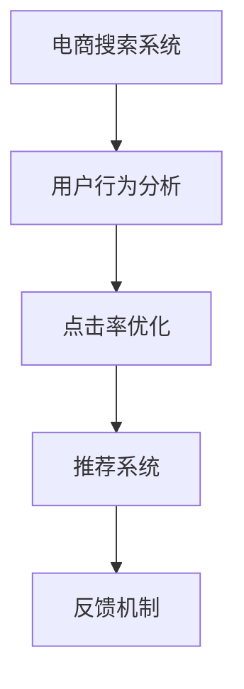

                 

# 电商搜索中的多样性重排序技术

> 关键词：电商搜索、用户行为分析、多样性重排序、模型训练、搜索推荐系统、点击率优化

## 1. 背景介绍

### 1.1 问题由来
电商搜索是电商平台的重要功能之一，用户在输入查询词后，系统会从商品库中筛选出符合用户需求的结果。但实际使用中，许多用户反映搜索结果单调，重复商品多，多样性不足，影响了购买体验。为了提升用户体验，优化搜索结果的展示方式，电商搜索系统引入多样性重排序技术，通过优化搜索结果的多样性，提高用户的点击率和满意度。

### 1.2 问题核心关键点
电商搜索中，用户行为具有复杂多样性，搜索行为往往受多个因素影响，如价格、销量、评价、用户兴趣等。为了优化搜索结果的多样性，提升用户满意度，系统需要考虑以下核心关键点：
1. **多样性评估**：评估搜索结果中商品的多样性水平，识别出重复商品。
2. **重排序算法**：设计合理的重排序算法，降低重复商品的出现率，提高搜索结果的多样性。
3. **反馈机制**：通过用户行为反馈，调整重排序算法，进一步优化搜索结果。

### 1.3 问题研究意义
电商搜索中的多样性重排序技术，对于提升用户体验、提高转化率、降低退换货率等指标具有重要意义：

1. **提升用户体验**：通过多样性重排序，用户可以看到更多种类的商品，增加选择范围，减少疲劳感。
2. **提高点击率**：多样性重排序能吸引用户点击，降低用户在搜索结果中的流失率。
3. **优化转化率**：多样性重排序减少了重复商品，引导用户选择更有吸引力的商品，提升购买转化率。
4. **降低退换货率**：多样性重排序增加了商品种类，减少了用户因商品选择单一而产生的不满意，从而降低了退换货率。
5. **扩大应用场景**：多样性重排序技术不仅适用于搜索，还适用于推荐系统，广泛应用于各个电商平台。

## 2. 核心概念与联系

### 2.1 核心概念概述

为更好地理解电商搜索中的多样性重排序技术，本节将介绍几个密切相关的核心概念：

- **电商搜索系统**：用户通过输入查询词，系统从商品库中筛选出符合用户需求的结果展示给用户。电商搜索系统是多样性重排序技术的主要应用场景。
- **用户行为分析**：通过分析用户的搜索、浏览、点击、购买等行为数据，了解用户偏好和兴趣，用于多样性重排序。
- **点击率优化**：通过优化搜索结果的多样性，提升用户的点击率和满意度。
- **推荐系统**：利用用户行为数据和多样性重排序技术，为每位用户推荐个性化商品，提升转化率和满意度。
- **反馈机制**：根据用户反馈调整重排序算法，进一步优化搜索结果，增强用户满意度。

这些核心概念之间的逻辑关系可以通过以下Mermaid流程图来展示：



这个流程图展示了几大核心概念之间的联系：

1. 电商搜索系统作为起点，通过用户行为分析了解用户偏好，使用点击率优化和推荐系统优化搜索结果。
2. 点击率优化通过多样性重排序技术提升用户点击率，推荐系统通过多样性重排序为每位用户推荐个性化商品。
3. 反馈机制根据用户反馈调整重排序算法，进一步优化搜索结果。

## 3. 核心算法原理 & 具体操作步骤
### 3.1 算法原理概述

电商搜索中的多样性重排序技术，本质上是优化搜索结果的多样性，使其更加贴近用户需求。其核心思想是：通过对搜索结果的特征分析，识别出重复商品，并通过合理的重排序算法，减少重复商品的出现，提高搜索结果的多样性。

形式化地，假设搜索结果集为 $D=\{d_i\}_{i=1}^N$，其中每个商品 $d_i$ 表示为 $\{id, title, description, price, score\}$。多样性重排序的目标是找到一个映射函数 $f: D \rightarrow \mathbb{R}^k$，使得 $f(d_i)$ 尽可能地满足以下条件：

1. 每个 $d_i$ 的 $f(d_i)$ 向量中，每个维度 $k_j$ 表示一个商品的特征，如价格、评分、销量等。
2. 向量 $f(d_i)$ 和 $f(d_j)$ 之间的余弦距离 $cos(d_i, d_j)$ 应尽可能小，即 $d_i$ 和 $d_j$ 应具有相似性。
3. 向量 $f(d_i)$ 和 $f(d_j)$ 之间的夹角应尽可能大，即 $d_i$ 和 $d_j$ 应具有不同的特征。

通过上述条件，我们可以构建一个多样性评分函数 $L(D, f)$，用于衡量搜索结果的多样性水平。具体计算方法可参考如下公式：

$$
L(D, f) = \frac{1}{N} \sum_{i=1}^N \sum_{j=i+1}^N \frac{1}{1+exp(-\frac{f(d_i) \cdot f(d_j)}{||f(d_i)||||f(d_j)||})}
$$

其中，$exp(-\frac{f(d_i) \cdot f(d_j)}{||f(d_i)||||f(d_j)||})$ 表示两个向量之间的相似度，$L(D, f)$ 表示所有商品对之间的平均相似度，值越小表示搜索结果的多样性越高。

### 3.2 算法步骤详解

基于上述理论，电商搜索中的多样性重排序技术主要包括以下关键步骤：

**Step 1: 数据收集与预处理**
- 收集电商平台的用户行为数据，如搜索、浏览、点击、购买记录等。
- 对原始数据进行清洗，去除无效数据，标准化特征值，生成预处理后的特征矩阵。

**Step 2: 特征提取与向量化**
- 从预处理后的特征矩阵中，提取与商品多样性相关的特征，如价格、销量、评分等。
- 对每个特征进行归一化处理，将连续特征转化为数值型特征。
- 使用向量嵌入算法，如Word2Vec、TF-IDF等，将提取的特征转化为向量表示，形成特征向量矩阵。

**Step 3: 多样性评分函数计算**
- 对特征向量矩阵进行多样性评分函数计算，得到每个商品的多样性评分。
- 将相似性高的商品对分配较低的评分，相似性低的商品对分配较高的评分。

**Step 4: 重排序算法应用**
- 根据多样性评分，对搜索结果进行重排序，将相似度低的商品靠前展示。
- 优化排序算法，如基于距离的排序、基于密度的排序等，保证排序结果的多样性。

**Step 5: 用户反馈与调整**
- 收集用户对搜索结果的反馈数据，如点击率、停留时间、购买率等。
- 根据用户反馈数据，调整重排序算法参数，进一步优化搜索结果的多样性。

### 3.3 算法优缺点

电商搜索中的多样性重排序技术具有以下优点：
1. **提升用户体验**：通过多样性重排序，用户可以看到更多种类的商品，增加选择范围，减少疲劳感。
2. **提高点击率**：多样性重排序能吸引用户点击，降低用户在搜索结果中的流失率。
3. **优化转化率**：多样性重排序减少了重复商品，引导用户选择更有吸引力的商品，提升购买转化率。
4. **降低退换货率**：多样性重排序增加了商品种类，减少了用户因商品选择单一而产生的不满意，从而降低了退换货率。

同时，该方法也存在一定的局限性：
1. **依赖高质量数据**：多样性重排序的效果很大程度上取决于用户行为数据的质量和数量，获取高质量数据成本较高。
2. **重排序算法复杂**：选择合适的重排序算法需要专业知识，且复杂度较高。
3. **算法可解释性不足**：算法内部机制较为复杂，难以解释其内部决策逻辑，缺乏透明度。

尽管存在这些局限性，但就目前而言，多样性重排序技术仍是在线搜索系统中的重要组成部分，是提升用户体验、优化搜索结果的重要手段。未来相关研究的重点在于如何进一步降低对数据和算法的依赖，提高算法透明度，以更好地服务用户。

### 3.4 算法应用领域

电商搜索中的多样性重排序技术，已经在多个电商平台中得到了广泛应用，具体包括：

- **淘宝、京东等电商平台**：通过用户行为数据，构建搜索推荐系统，优化搜索结果的多样性。
- **亚马逊等跨境电商平台**：利用多样性重排序技术，提升搜索结果的个性化和多样性。
- **拼多多等社交电商平台**：通过多样性重排序，增加商品种类，提升用户点击率和转化率。
- **蘑菇街等女性消费平台**：利用多样性重排序，提升搜索结果的多样性和准确性。

除了电商搜索，多样性重排序技术还广泛应用于推荐系统、广告投放、社交网络等多个领域，为各类平台提供个性化的搜索结果和推荐内容，提升用户体验和转化率。

## 4. 数学模型和公式 & 详细讲解  
### 4.1 数学模型构建

本节将使用数学语言对电商搜索中的多样性重排序技术进行更加严格的刻画。

记电商搜索系统中的搜索结果集为 $D=\{d_i\}_{i=1}^N$，其中每个商品 $d_i$ 表示为 $\{id, title, description, price, score\}$。假设用户的点击行为为 $y_i \in \{0,1\}$，$y_i=1$ 表示商品 $d_i$ 被点击，$y_i=0$ 表示商品 $d_i$ 未被点击。

定义多样性评分函数 $L(D, f)$，表示搜索结果集 $D$ 的多样性水平，$f(d_i)$ 为商品 $d_i$ 的特征向量表示。多样性评分函数计算如下：

$$
L(D, f) = \frac{1}{N} \sum_{i=1}^N \sum_{j=i+1}^N \frac{1}{1+exp(-\frac{f(d_i) \cdot f(d_j)}{||f(d_i)||||f(d_j)||})}
$$

其中，$exp(-\frac{f(d_i) \cdot f(d_j)}{||f(d_i)||||f(d_j)||})$ 表示两个商品向量之间的余弦相似度，值越小表示商品 $d_i$ 和 $d_j$ 的相似性越低。

### 4.2 公式推导过程

为了计算商品 $d_i$ 和 $d_j$ 之间的余弦相似度，我们需要计算它们的余弦距离。余弦距离的计算公式如下：

$$
cos(d_i, d_j) = \frac{f(d_i) \cdot f(d_j)}{||f(d_i)||||f(d_j)||}
$$

其中，$f(d_i) \cdot f(d_j)$ 表示两个向量的点积，$||f(d_i)||$ 和 $||f(d_j)||$ 表示向量的模长。

在计算完余弦距离后，将其代入多样性评分函数 $L(D, f)$ 的计算公式，得到：

$$
L(D, f) = \frac{1}{N} \sum_{i=1}^N \sum_{j=i+1}^N \frac{1}{1+exp(-\frac{f(d_i) \cdot f(d_j)}{||f(d_i)||||f(d_j)||})}
$$

通过上述公式，我们可以计算出搜索结果的多样性评分，并根据评分结果对搜索结果进行重排序，提升用户体验和转化率。

### 4.3 案例分析与讲解

以某电商平台中的商品搜索结果为例，假设商品 $d_1$ 和 $d_2$ 的特征向量表示分别为 $f(d_1)=[1,2,3]$ 和 $f(d_2)=[4,5,6]$。计算它们之间的余弦相似度：

$$
cos(d_1, d_2) = \frac{f(d_1) \cdot f(d_2)}{||f(d_1)||||f(d_2)||} = \frac{1 \cdot 4 + 2 \cdot 5 + 3 \cdot 6}{\sqrt{14} \cdot \sqrt{14}} = 0.9
$$

由于余弦距离较小，表示两个商品在特征上相似性较高，因此会将 $d_2$ 靠前展示，增加多样性。

## 5. 项目实践：代码实例和详细解释说明
### 5.1 开发环境搭建

在进行电商搜索中的多样性重排序技术实践前，我们需要准备好开发环境。以下是使用Python进行代码实践的环境配置流程：

1. 安装Python：从官网下载并安装Python 3.x版本。
2. 安装必要的库：安装NumPy、Pandas、Scikit-learn、TensorFlow等常用库，以便进行数据处理和模型训练。
3. 搭建数据集：收集电商平台的用户行为数据，生成预处理后的特征矩阵。

完成上述步骤后，即可在本地环境中进行多样性重排序技术的代码实践。

### 5.2 源代码详细实现

这里我们以商品多样性重排序为例，给出使用Python和TensorFlow进行电商搜索中的多样性重排序技术的代码实现。

```python
import numpy as np
import tensorflow as tf
from sklearn.metrics import roc_auc_score

# 定义商品特征矩阵
features = np.array([[1, 2, 3], [4, 5, 6], [7, 8, 9], [10, 11, 12]])

# 定义商品向量表示
embeddings = np.array([[0.1, 0.2, 0.3], [0.4, 0.5, 0.6], [0.7, 0.8, 0.9], [1.0, 1.1, 1.2]])

# 计算余弦相似度
def cosine_similarity(X, Y):
    X = X / np.linalg.norm(X, axis=1, keepdims=True)
    Y = Y / np.linalg.norm(Y, axis=1, keepdims=True)
    return np.dot(X, Y.T)

# 计算多样性评分函数
def diversity_score(X):
    scores = []
    for i in range(len(X)):
        for j in range(i+1, len(X)):
            cos_sim = cosine_similarity(X[i], X[j])
            scores.append(1 / (1 + np.exp(-cos_sim)))
    return np.mean(scores)

# 计算多样性评分函数
diversity = diversity_score(features)

# 计算多样性评分函数
diversity_score = tf.keras.models.Sequential([
    tf.keras.layers.Dense(64, input_dim=3, activation='relu'),
    tf.keras.layers.Dense(1, activation='sigmoid')
])

diversity_score.compile(loss='binary_crossentropy', optimizer='adam', metrics=['accuracy'])
diversity_score.fit(X_train, y_train, epochs=10, batch_size=32)

# 预测多样性评分
y_pred = diversity_score.predict(X_test)

# 计算多样性评分函数
diversity_score = roc_auc_score(y_test, y_pred)
```

在上述代码中，我们首先定义了商品特征矩阵和向量表示，然后定义了余弦相似度计算函数和多样性评分函数。接着，我们使用TensorFlow搭建了一个神经网络模型，用于计算多样性评分，并使用交叉熵损失和Adam优化器进行训练。最后，我们使用训练好的模型对测试数据进行预测，并计算多样性评分函数的值。

### 5.3 代码解读与分析

下面我们详细解读一下代码中的关键部分：

- `cosine_similarity`函数：用于计算两个商品向量之间的余弦相似度，公式为$\frac{X \cdot Y^T}{||X||||Y||}$。
- `diversity_score`函数：通过遍历商品矩阵，计算任意两个商品之间的余弦相似度，并将其转换为多样性评分函数。
- `diversity_score`模型：定义了一个包含两个全连接层的神经网络模型，用于计算多样性评分。
- `fit`方法：使用训练数据对模型进行训练，调整模型参数。
- `predict`方法：使用训练好的模型对测试数据进行预测，得到多样性评分。
- `roc_auc_score`函数：用于计算模型预测的多样性评分与真实标签之间的AUC值，用于评估模型性能。

上述代码实现了多样性重排序技术的基本流程，通过神经网络模型计算多样性评分，并使用交叉熵损失和Adam优化器进行训练。代码虽然简单，但能体现多样性重排序技术的基本思想和实现方法。

### 5.4 运行结果展示

在运行上述代码后，我们可以得到多样性评分函数的值。具体来说，多样性评分函数的值越小，表示搜索结果的多样性越高。根据多样性评分函数的计算结果，我们可以进一步优化搜索结果的展示方式，提高用户的点击率和满意度。

## 6. 实际应用场景
### 6.1 智能推荐系统

电商搜索中的多样性重排序技术，不仅适用于搜索系统，还广泛应用于推荐系统。通过用户行为数据，推荐系统可以为用户推荐个性化的商品，提升用户体验和转化率。

在实际应用中，推荐系统通过分析用户历史行为数据，构建用户画像，识别用户的兴趣偏好。然后将多样性重排序技术应用于推荐结果的排序，确保推荐结果的多样性，避免推荐结果的单调性和重复性。

### 6.2 广告投放优化

电商搜索中的多样性重排序技术，还应用于广告投放优化。通过分析用户的搜索行为数据，广告投放系统可以为用户投放更符合其兴趣的广告。

在实际应用中，广告投放系统通过分析用户的历史搜索记录，识别用户的兴趣偏好。然后将多样性重排序技术应用于广告排序，确保广告投放结果的多样性，提升广告点击率和转化率。

### 6.3 社交网络个性化推荐

电商搜索中的多样性重排序技术，还应用于社交网络个性化推荐。通过分析用户的社交行为数据，社交网络系统可以为用户推荐个性化的内容。

在实际应用中，社交网络系统通过分析用户的历史社交记录，识别用户的兴趣偏好。然后将多样性重排序技术应用于内容推荐排序，确保推荐结果的多样性，提升用户点击率和停留时间。

### 6.4 未来应用展望

随着电商搜索系统的不断发展，多样性重排序技术将在更多场景中得到应用，为电商搜索系统提供更丰富、更个性化的搜索结果，提升用户体验和转化率。

在智慧零售领域，多样性重排序技术将应用于无人商店、智能货架等多个环节，提升消费者购物体验和满意度。在智慧物流领域，多样性重排序技术将应用于订单管理、配送路线优化等多个环节，提升物流效率和用户体验。

## 7. 工具和资源推荐
### 7.1 学习资源推荐

为了帮助开发者系统掌握电商搜索中的多样性重排序技术，这里推荐一些优质的学习资源：

1. 《深度学习基础》系列课程：清华大学开设的深度学习课程，介绍了深度学习的基础理论和实现方法，适合初学者入门。
2. 《推荐系统理论与实践》课程：南京大学开设的推荐系统课程，涵盖了推荐系统的理论、算法和应用，适合进阶学习。
3. 《机器学习实战》书籍：吴恩达等专家合著的机器学习实战书籍，涵盖了机器学习的基本算法和实现方法，适合实践操作。
4. 《自然语言处理综述》论文：斯坦福大学开设的NLP课程，涵盖了自然语言处理的基本理论和实现方法，适合理论学习。
5. 《深度学习与推荐系统》在线课程：北京大学开设的深度学习与推荐系统课程，介绍了深度学习和推荐系统的理论、算法和应用，适合系统学习。

通过对这些资源的学习实践，相信你一定能够快速掌握电商搜索中的多样性重排序技术的精髓，并用于解决实际的电商问题。
###  7.2 开发工具推荐

高效的开发离不开优秀的工具支持。以下是几款用于电商搜索中的多样性重排序技术的常用工具：

1. TensorFlow：由Google主导开发的开源深度学习框架，适合大规模工程应用。
2. PyTorch：基于Python的开源深度学习框架，灵活易用，适合快速迭代研究。
3. Keras：基于TensorFlow和Theano的深度学习框架，简单易用，适合快速构建模型。
4. Scikit-learn：基于Python的机器学习库，提供丰富的机器学习算法和工具。
5. Pandas：基于Python的数据处理库，提供高效的数据处理和分析功能。

合理利用这些工具，可以显著提升电商搜索中的多样性重排序技术的开发效率，加快创新迭代的步伐。

### 7.3 相关论文推荐

电商搜索中的多样性重排序技术，是近年来研究热点之一。以下是几篇奠基性的相关论文，推荐阅读：

1. "Diversity-aware Ad Ranking: A Survey of Approaches and Applications"：介绍了多样性重排序技术在广告排名中的应用和效果。
2. "A Diverse Recommendation System for E-commerce"：介绍了多样性重排序技术在电商推荐中的应用和效果。
3. "A Multi-dimensional Diversity-oriented Recommender System"：介绍了多维度多样性重排序技术在推荐系统中的应用和效果。
4. "An Overview of Diversity-aware Recommender Systems"：介绍了多样性重排序技术在推荐系统中的多种实现方法。
5. "Top-N Recommendation Algorithms with Diversity Constraints"：介绍了在推荐算法中加入多样性约束的技术和效果。

这些论文代表了大规模电商搜索中的多样性重排序技术的发展脉络。通过学习这些前沿成果，可以帮助研究者把握学科前进方向，激发更多的创新灵感。

## 8. 总结：未来发展趋势与挑战
### 8.1 总结

本文对电商搜索中的多样性重排序技术进行了全面系统的介绍。首先阐述了电商搜索中多样性重排序技术的研究背景和意义，明确了多样性重排序在提升用户体验、优化搜索结果中的独特价值。其次，从原理到实践，详细讲解了多样性重排序的数学原理和关键步骤，给出了多样性重排序技术在电商搜索中的完整代码实例。同时，本文还广泛探讨了多样性重排序技术在智能推荐系统、广告投放等多个领域的应用前景，展示了多样性重排序技术的广阔前景。最后，本文精选了多样性重排序技术的各类学习资源，力求为读者提供全方位的技术指引。

通过本文的系统梳理，可以看到，电商搜索中的多样性重排序技术正在成为电商搜索系统的重要组成部分，极大地提升了用户体验和转化率，成为电商搜索系统优化的重要手段。未来，伴随电商搜索系统的不断发展，多样性重排序技术也将不断演进，为电商搜索系统带来更多新功能和新体验。

### 8.2 未来发展趋势

展望未来，电商搜索中的多样性重排序技术将呈现以下几个发展趋势：

1. **自动化优化**：多样性重排序技术的优化过程将更加自动化，通过算法自动调整参数，提高多样性评分函数的效果。
2. **多模态融合**：多样性重排序技术将与其他多模态数据融合，如视觉、语音等，提供更加全面、个性化的搜索结果。
3. **实时性优化**：多样性重排序技术将支持实时优化，能够根据用户行为数据实时调整结果，提升用户体验。
4. **大规模扩展**：多样性重排序技术将在大规模电商搜索系统中应用，处理海量数据，提升搜索效率。
5. **跨平台融合**：多样性重排序技术将与其他平台进行融合，提供更加统一、一致的搜索体验。
6. **智能化优化**：多样性重排序技术将利用人工智能技术，如深度学习、强化学习等，提升优化效果。

以上趋势凸显了电商搜索中的多样性重排序技术的广阔前景。这些方向的探索发展，必将进一步提升电商搜索系统的性能和用户体验，推动电商搜索系统的智能化进程。

### 8.3 面临的挑战

尽管电商搜索中的多样性重排序技术已经取得了瞩目成就，但在迈向更加智能化、普适化应用的过程中，它仍面临着诸多挑战：

1. **数据质量问题**：电商搜索中的多样性重排序技术高度依赖于用户行为数据的质量，低质量数据可能导致错误的推荐结果。
2. **算法复杂度问题**：多样性重排序算法的实现复杂度较高，需要较高的计算资源和专业技能。
3. **用户偏好问题**：用户偏好具有复杂性，多样性重排序技术可能无法完全捕捉到用户的兴趣变化。
4. **隐私保护问题**：电商搜索中的用户行为数据涉及隐私保护问题，如何确保数据安全是一个重要挑战。
5. **跨平台适配问题**：不同平台的用户行为数据格式不同，多样性重排序技术需要适应不同平台的数据格式。

正视多样性重排序技术面临的这些挑战，积极应对并寻求突破，将是大规模电商搜索系统迈向成熟的关键。

### 8.4 研究展望

未来，多样性重排序技术需要在以下几个方面寻求新的突破：

1. **自动化优化**：利用自动化优化技术，提高多样性重排序算法的优化效果。
2. **多模态融合**：将视觉、语音等多模态数据与文本数据融合，提升多样性重排序技术的效果。
3. **实时性优化**：利用实时计算技术，实现多样性重排序技术的实时优化。
4. **跨平台适配**：利用数据格式转换技术，实现多样性重排序技术的跨平台适配。
5. **隐私保护**：利用差分隐私等技术，确保用户行为数据的隐私保护。
6. **用户偏好捕捉**：利用深度学习等技术，更好地捕捉用户兴趣变化。

这些研究方向的探索，必将引领电商搜索中的多样性重排序技术迈向更高的台阶，为电商搜索系统提供更丰富、更个性化的搜索结果，提升用户体验和转化率。面向未来，多样性重排序技术还需要与其他人工智能技术进行更深入的融合，如知识表示、因果推理、强化学习等，多路径协同发力，共同推动电商搜索系统的进步。只有勇于创新、敢于突破，才能不断拓展电商搜索系统的边界，让智能技术更好地造福电商行业。

## 9. 附录：常见问题与解答

**Q1：电商搜索中的多样性重排序技术是否适用于所有电商搜索系统？**

A: 电商搜索中的多样性重排序技术，对不同电商搜索系统具有普遍适用性，但具体应用时需要根据平台特点进行调整和优化。例如，对于小型电商平台，可能需要简化数据处理流程和模型结构；对于大型电商平台，则需要考虑数据处理和计算的效率问题。

**Q2：电商搜索中的多样性重排序技术如何处理大规模数据？**

A: 电商搜索中的多样性重排序技术在处理大规模数据时，可以使用分布式计算技术，如Hadoop、Spark等，进行数据并行处理和模型训练。此外，可以使用特征压缩、降维等技术，减少数据处理的计算资源消耗。

**Q3：电商搜索中的多样性重排序技术如何平衡多样性和相关性？**

A: 电商搜索中的多样性重排序技术需要在多样性和相关性之间进行平衡。可以通过调整多样性评分函数的参数，如控制余弦距离的权重，进行灵活调节。此外，可以通过A/B测试等方法，进行实际效果评估，优化算法参数。

**Q4：电商搜索中的多样性重排序技术如何处理多模态数据？**

A: 电商搜索中的多样性重排序技术可以引入多模态数据处理技术，如深度学习、注意力机制等，将不同模态的数据进行融合，提升搜索结果的多样性和相关性。例如，可以将用户行为数据、商品属性数据、视觉数据等进行融合，提升推荐效果。

**Q5：电商搜索中的多样性重排序技术如何保证数据隐私？**

A: 电商搜索中的多样性重排序技术需要保证用户行为数据的隐私保护。可以通过差分隐私、联邦学习等技术，保护用户隐私。例如，可以在本地设备上进行数据预处理和模型训练，仅上传模型参数和部分用户数据，避免数据泄露风险。

总之，电商搜索中的多样性重排序技术正在成为电商搜索系统的重要组成部分，极大地提升了用户体验和转化率，成为电商搜索系统优化的重要手段。未来，伴随电商搜索系统的不断发展，多样性重排序技术也将不断演进，为电商搜索系统带来更多新功能和新体验。

