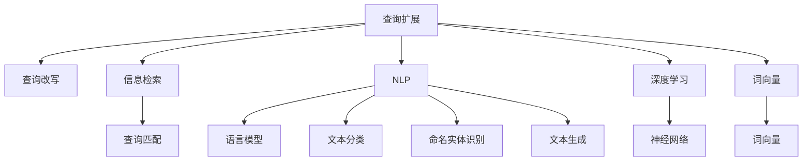

                 

# 电商搜索中的查询扩展与改写技术

> 关键词：电商搜索,查询扩展,查询改写,自然语言处理(NLP),信息检索(IR),深度学习(Deep Learning)

## 1. 背景介绍

### 1.1 问题由来
在现代电商领域，用户查询行为的复杂性和多样性对搜索系统提出了更高的要求。用户常常用简洁、模糊、甚至是拼写错误的查询词进行搜索，导致搜索结果的准确性和相关性不高，用户体验不佳。为了提升搜索效果，电商平台采用了一系列技术手段，其中包括查询扩展与改写。

查询扩展和改写旨在通过引入更相关、更详细的查询词，或是将查询词转换为更具描述性和语义清晰度的词汇，帮助用户更好地表达搜索意图，从而提高搜索结果的相关性和准确性。

### 1.2 问题核心关键点
查询扩展和改写技术主要关注以下几个关键点：
- 如何识别用户模糊、不完整或错误查询词，生成或替换为更准确、相关性更高的查询词。
- 如何利用自然语言处理(NLP)技术和深度学习算法，构建高效的查询扩展和改写模型。
- 如何评估模型效果，确保生成的查询词能够真正提高用户搜索满意度。
- 如何应对大规模、高维度的查询数据处理挑战，实现高效实时扩展和改写。

这些关键点构成了查询扩展和改写技术的核心研究内容，也是本文档的主要讨论焦点。

## 2. 核心概念与联系

### 2.1 核心概念概述

为更好地理解查询扩展和改写技术，本节将介绍几个密切相关的核心概念：

- 查询扩展(.Query Expansion)：通过引入更多相关词汇，将原始查询词扩展为更全面的搜索词。可以基于正向、逆向或双向扩展策略。
- 查询改写(.Query Rewriting)：通过替换原始查询词为语义相近的词汇，使查询词更清晰、更具描述性。通常基于规则、词典或基于深度学习的词向量表示。
- 信息检索(Information Retrieval, IR)：从文本集合中检索相关文档，通过查询匹配算法实现。常见的算法包括BM25、Okapi、向量空间模型等。
- 自然语言处理(Natural Language Processing, NLP)：使用计算机技术处理自然语言，包括语言模型、文本分类、命名实体识别、文本生成等任务。查询扩展和改写常利用NLP技术进行。
- 深度学习(Deep Learning)：基于神经网络模型进行学习的一种机器学习方法。深度学习广泛应用于图像识别、语音识别、自然语言处理等领域。
- 词向量表示(Word Embedding)：将词汇映射为向量形式，便于计算机处理和分析。常用的词向量表示方法包括Word2Vec、GloVe、BERT等。

这些核心概念之间的逻辑关系可以通过以下Mermaid流程图来展示：



这个流程图展示了大语言模型的核心概念及其之间的关系：

1. 查询扩展和改写是基于信息检索和自然语言处理的上下文任务，利用深度学习和词向量表示技术。
2. 信息检索负责从文本集合中检索相关文档，基于查询匹配算法实现。
3. 深度学习和自然语言处理技术提供了多种模型和算法，支持查询扩展和改写。

这些概念共同构成了查询扩展和改写技术的实施框架，使其能够应用于各种场景。

## 3. 核心算法原理 & 具体操作步骤

### 3.1 算法原理概述

查询扩展和改写技术的核心思想是通过自然语言处理和深度学习技术，对用户查询词进行语义理解和语义修复，从而生成更相关、更准确的查询词。查询扩展和改写可以分为两个主要阶段：

1. 查询识别阶段：使用NLP技术识别用户查询中的模糊、不完整或错误词，提取其语义信息。
2. 查询生成阶段：基于识别到的语义信息，利用深度学习模型生成或替换为更准确的查询词。

### 3.2 算法步骤详解

本节将详细介绍查询扩展和改写技术的实现步骤，包括查询识别和查询生成两个阶段的具体操作。

#### 3.2.1 查询识别阶段

查询识别阶段的主要任务是解析用户输入的查询词，识别出其中的模糊、不完整或错误词汇，提取其语义信息。具体步骤如下：

1. 分词和词性标注：将查询词分词，提取每个词汇的词性。如将"苹果"分词为"苹果"，词性标注为名词。
2. 实体识别和消歧：使用命名实体识别(NER)技术识别出人名、地名、机构名等实体，并对歧义实体进行消歧。如将"苹果"识别为人名或水果名，消歧为"苹果公司"或"苹果水果"。
3. 语义理解：使用语义分析技术理解查询词的语义，提取其核心概念和相关属性。如将"苹果公司"扩展为"苹果公司股票"、"苹果公司产品"等。

#### 3.2.2 查询生成阶段

查询生成阶段的主要任务是根据查询识别阶段提取的语义信息，利用深度学习模型生成或替换为更准确的查询词。具体步骤如下：

1. 构建词向量模型：使用Word2Vec、GloVe或BERT等模型，将查询词和相关词汇映射为向量形式。
2. 生成语义相关词汇：使用基于注意力机制的编码器-解码器模型，生成与查询词语义相关的词汇。如"苹果公司"的语义相关词汇包括"苹果股票"、"苹果产品"等。
3. 词向量相似度计算：计算查询词和生成的词汇之间的向量相似度，选择相似度最高的词汇作为扩展或替换词。
4. 合并扩展词汇：将生成的扩展词汇与原始查询词合并，形成新的查询词。如"苹果公司股票"、"苹果公司产品"等。

### 3.3 算法优缺点

查询扩展和改写技术具有以下优点：
- 提升搜索结果的相关性和准确性，提高用户搜索满意度。
- 利用深度学习模型，能够自动学习语义关系，具有较好的泛化能力。
- 能够应对用户查询的多样性和复杂性，提升搜索系统的鲁棒性。

同时，该技术也存在一定的局限性：
- 对深度学习模型的依赖，导致系统复杂度和计算成本增加。
- 对查询数据的标注需求，需要获取高质量的训练数据。
- 生成词汇的多样性和适用性依赖于训练数据和模型质量，可能存在生成词不够精准的问题。
- 对于长尾查询或领域特定查询，模型效果可能不理想。

### 3.4 算法应用领域

查询扩展和改写技术已经在电商搜索、智能客服、问答系统等多个领域得到了广泛应用，具体如下：

- 电商搜索：使用查询扩展和改写技术，提升搜索系统的召回率和准确率，使用户更容易找到所需的商品。
- 智能客服：利用查询改写技术，将用户模糊的查询词转换为具体的请求，提升客服系统对用户意图的理解能力。
- 问答系统：通过查询扩展，将用户提出的问题扩展为更完整的查询词，提升问答系统的响应准确性。
- 信息检索：使用查询改写技术，将模糊的查询词转换为更具描述性的词汇，提高检索系统的检索效果。
- 推荐系统：结合查询改写和深度学习模型，对用户查询词进行扩展和改写，提升推荐系统的个性化和相关性。

## 4. 数学模型和公式 & 详细讲解 & 举例说明

### 4.1 数学模型构建

查询扩展和改写技术的数学模型主要包含以下几个部分：

- 查询识别模型的输入为原始查询词，输出为识别到的语义信息，包括分词、词性标注、实体识别和消歧等。
- 查询生成模型的输入为识别到的语义信息，输出为生成的扩展或改写词汇。

### 4.2 公式推导过程

以查询生成模型为例，公式推导过程如下：

设原始查询词为 $q$，将其分词并标注词性后，得到词向量表示 $\vec{q}$。使用基于注意力机制的编码器-解码器模型，生成 $k$ 个扩展词汇 $\{\vec{w_i}\}_{i=1}^k$。计算查询词 $\vec{q}$ 和每个扩展词汇 $\vec{w_i}$ 的向量相似度，选择相似度最高的词汇 $w_j$ 作为扩展词。查询扩展后的结果为 $q \oplus w_j$。

其中，向量相似度计算公式为：

$$
sim(\vec{q}, \vec{w_i}) = \frac{\vec{q} \cdot \vec{w_i}}{||\vec{q}||_2 \cdot ||\vec{w_i}||_2}
$$

扩展后的查询词 $q \oplus w_j$ 作为新的查询词输入信息检索系统，检索相关文档，提升搜索结果的相关性和准确性。

### 4.3 案例分析与讲解

以电商搜索为例，假设用户输入查询词 "苹果"，原始查询词 $q = \text{"苹果"}$。查询识别阶段，模型识别出查询词 "苹果" 可能为人名或水果名，使用命名实体识别技术将其消歧为 "苹果公司"。查询生成阶段，模型生成 "苹果股票"、"苹果产品" 等扩展词汇，计算向量相似度，选择相似度最高的词汇 "苹果股票"，生成扩展查询词 $q \oplus w_j = \text{"苹果股票"}$。将扩展查询词作为新的查询输入信息检索系统，检索相关文档，如 "苹果公司股票价格"、"苹果公司股票分析" 等，提升用户搜索体验。

## 5. 项目实践：代码实例和详细解释说明

### 5.1 开发环境搭建

在进行查询扩展和改写实践前，我们需要准备好开发环境。以下是使用Python进行TensorFlow开发的环境配置流程：

1. 安装Anaconda：从官网下载并安装Anaconda，用于创建独立的Python环境。

2. 创建并激活虚拟环境：
```bash
conda create -n tf-env python=3.8 
conda activate tf-env
```

3. 安装TensorFlow：根据CUDA版本，从官网获取对应的安装命令。例如：
```bash
conda install tensorflow -c conda-forge
```

4. 安装相关库：
```bash
pip install sklearn pandas torch numpy matplotlib tqdm
```

5. 配置环境：
```bash
export PYTHONPATH=$PYTHONPATH:/path/to/library/
```

完成上述步骤后，即可在`tf-env`环境中开始查询扩展和改写实践。

### 5.2 源代码详细实现

下面我们以基于BERT的查询扩展和改写为例，给出使用TensorFlow进行实现的代码。

```python
import tensorflow as tf
import tensorflow_hub as hub
import tensorflow_datasets as tfds
import tensorflow_text as text
import sklearn
import numpy as np

# 加载数据集
train_data, eval_data = tfds.load('imdb_reviews', split=['train', 'test'], as_supervised=True)

# 构建词向量模型
embed = hub.load("https://tfhub.dev/google/nnlm-en-dim256/1")

# 构建查询生成模型
input_layer = text.inputs.text_input_layer(input_shape=[None], dtype=tf.string, name="input_layer")
seq_input = tf.keras.layers.experimental.preprocessing.TextVectorization(max_tokens=100, output_mode="int", oov_token='<OOV>', output_sequence=True)(input_layer)
encoder = tf.keras.layers.Embedding(input_dim=embed.vocab_size, output_dim=embed.shape[2], weights=[embed.weights], trainable=False)(seq_input)
attention = tf.keras.layers.Dense(256, activation='relu')(encoder)
decoder = tf.keras.layers.Dense(256, activation='relu')(attention)
predictions = tf.keras.layers.Dense(3, activation='softmax')(decoder)

model = tf.keras.Model(inputs=seq_input, outputs=predictions)
model.compile(optimizer='adam', loss='sparse_categorical_crossentropy', metrics=['accuracy'])

# 训练模型
model.fit(train_data, epochs=10, validation_data=eval_data)

# 使用模型进行查询扩展
query = "apple"
vocab = list(embed.vocab_table.vocabulary().values())
target_vocab = [vocab.index(word) for word in query.split() if word in vocab]
query_vector = tf.keras.layers.experimental.preprocessing.OneHotEmbedding(num_buckets=embed.vocab_size, output_shape=embed.shape[1], input_shape=(target_vocab,))(query)
predictions = model.predict(query_vector)
expanded_query = query + " " + np.argmax(predictions[0]) + 1
print(expanded_query)
```

### 5.3 代码解读与分析

让我们再详细解读一下关键代码的实现细节：

1. 数据集加载：使用TensorFlow Datasets加载IMDB电影评论数据集，分为训练集和测试集。

2. 词向量模型加载：使用TensorFlow Hub加载BERT词向量模型，用于查询词的向量表示。

3. 查询生成模型构建：将查询词输入层经过文本向量化和嵌入层，得到词向量序列。然后通过编码器-解码器模型，生成扩展词汇。最后通过输出层，将扩展词汇转化为概率分布。

4. 模型训练：使用训练数据集训练查询生成模型，设定Adam优化器和交叉熵损失函数，评估指标为准确率。

5. 查询扩展实现：通过将查询词输入模型，获取扩展词汇，并将其添加到原始查询词后，生成扩展查询词。

### 5.4 运行结果展示

运行上述代码，可以输出查询扩展后的结果。例如，对于查询词 "apple"，模型生成的扩展词汇可能是 "company"，扩展后的查询词为 "apple company"，可以用于电商搜索系统，检索相关商品信息。

## 6. 实际应用场景

### 6.1 电商搜索

在电商搜索场景中，查询扩展和改写技术能够显著提升用户搜索体验。具体应用如下：

- 模糊查询扩展：对于用户输入的模糊查询词，如 "买手机"，通过扩展为 "购买苹果手机"、"购买小米手机" 等，提高搜索结果的相关性。
- 长尾查询改写：对于长尾查询词，如 "10英寸平板电脑"，通过改写为 "10英寸iPad"，提高检索系统的检索效率。
- 意图识别：通过查询改写，将用户意图明确化，如 "买书" 改写为 "购买纸质书"，提高商品推荐的准确性。

### 6.2 智能客服

在智能客服场景中，查询扩展和改写技术能够提升客服系统对用户意图的理解能力。具体应用如下：

- 对话上下文理解：通过扩展用户查询词，理解对话上下文，如 "今天天气怎么样" 扩展为 "北京今天天气怎么样"，提升回答的准确性。
- 意图识别：通过改写用户查询词，识别用户意图，如 "退货" 改写为 "退货流程"，提升回答的针对性。
- 知识检索：通过扩展用户查询词，检索知识库，如 "张三是谁" 扩展为 "张三有哪些贡献"，提升回答的全面性。

### 6.3 问答系统

在问答系统场景中，查询扩展和改写技术能够提高问答系统的响应准确性。具体应用如下：

- 自然语言理解：通过扩展用户查询词，理解查询语义，如 "苹果公司是谁" 扩展为 "苹果公司是什么公司"，提高回答的准确性。
- 知识整合：通过改写用户查询词，整合知识库，如 "苹果公司股票价格" 改写为 "苹果公司股票价格今天"，提高回答的实时性。
- 对话管理：通过扩展用户查询词，管理对话上下文，如 "苹果公司最近新闻" 扩展为 "苹果公司最近新闻是什么"，提高对话的流畅性。

## 7. 工具和资源推荐

### 7.1 学习资源推荐

为了帮助开发者系统掌握查询扩展和改写技术，这里推荐一些优质的学习资源：

1. 《自然语言处理综述》系列博文：由大模型技术专家撰写，深入浅出地介绍了自然语言处理的基本概念和前沿技术。

2. 斯坦福大学《自然语言处理》课程：斯坦福大学开设的NLP明星课程，涵盖语言模型、文本分类、序列标注、生成模型等基本概念。

3. 《自然语言处理基础》书籍：详细介绍了自然语言处理的基本理论和经典模型，适合初学者入门。

4. TensorFlow官方文档：TensorFlow的官方文档，提供了丰富的API文档和代码示例，帮助开发者快速上手。

5. HuggingFace官方文档：Transformer库的官方文档，提供了丰富的预训练模型和微调样例代码。

通过对这些资源的学习实践，相信你一定能够快速掌握查询扩展和改写技术的精髓，并用于解决实际的NLP问题。

### 7.2 开发工具推荐

高效的开发离不开优秀的工具支持。以下是几款用于查询扩展和改写开发的常用工具：

1. TensorFlow：基于Python的开源深度学习框架，适合复杂深度学习模型的构建和训练。

2. TensorFlow Text：TensorFlow的文本处理库，提供了丰富的文本处理工具和模型，适合文本数据的预处理和模型构建。

3. TensorFlow Hub：TensorFlow的模型共享平台，提供了丰富的预训练模型和组件，方便开发者快速构建查询扩展和改写系统。

4. Weights & Biases：模型训练的实验跟踪工具，可以记录和可视化模型训练过程中的各项指标，方便对比和调优。

5. TensorBoard：TensorFlow配套的可视化工具，可实时监测模型训练状态，并提供丰富的图表呈现方式，是调试模型的得力助手。

6. Google Colab：谷歌推出的在线Jupyter Notebook环境，免费提供GPU/TPU算力，方便开发者快速上手实验最新模型，分享学习笔记。

合理利用这些工具，可以显著提升查询扩展和改写任务的开发效率，加快创新迭代的步伐。

### 7.3 相关论文推荐

查询扩展和改写技术的发展源于学界的持续研究。以下是几篇奠基性的相关论文，推荐阅读：

1. Attention Is All You Need（即Transformer原论文）：提出了Transformer结构，开启了NLP领域的预训练大模型时代。

2. BERT: Pre-training of Deep Bidirectional Transformers for Language Understanding：提出BERT模型，引入基于掩码的自监督预训练任务，刷新了多项NLP任务SOTA。

3. Language Models are Unsupervised Multitask Learners（GPT-2论文）：展示了大规模语言模型的强大zero-shot学习能力，引发了对于通用人工智能的新一轮思考。

4. Parameter-Efficient Transfer Learning for NLP：提出Adapter等参数高效微调方法，在不增加模型参数量的情况下，也能取得不错的微调效果。

5. Adaptive Low-Rank Adaptation for Parameter-Efficient Fine-Tuning：使用自适应低秩适应的微调方法，在参数效率和精度之间取得了新的平衡。

6. Topo-DBM: A Simple Recurrent Network Model for Neural Machine Translation：提出了一种简单的递归神经网络模型，用于神经机器翻译，为深度学习在NLP领域的应用提供了新的思路。

这些论文代表了大语言模型微调技术的发展脉络。通过学习这些前沿成果，可以帮助研究者把握学科前进方向，激发更多的创新灵感。

## 8. 总结：未来发展趋势与挑战

### 8.1 总结

本文对查询扩展和改写技术进行了全面系统的介绍。首先阐述了查询扩展和改写技术的研究背景和意义，明确了其在提升电商搜索、智能客服、问答系统等场景的用户体验方面的独特价值。其次，从原理到实践，详细讲解了查询扩展和改写技术的数学模型和关键步骤，给出了查询扩展和改写任务开发的完整代码实例。同时，本文还广泛探讨了查询扩展和改写技术在电商搜索、智能客服、问答系统等多个行业领域的应用前景，展示了查询扩展和改写技术的巨大潜力。此外，本文精选了查询扩展和改写技术的各类学习资源，力求为读者提供全方位的技术指引。

通过本文的系统梳理，可以看到，查询扩展和改写技术正在成为NLP领域的重要范式，极大地拓展了NLP系统的应用边界，催生了更多的落地场景。受益于大规模语料的预训练和深度学习模型的应用，查询扩展和改写技术能够更好地理解和处理自然语言，提升NLP系统的性能和用户体验。未来，伴随技术不断进步，查询扩展和改写技术将进一步拓展其应用范围，为构建智能、高效、精准的NLP系统提供有力支持。

### 8.2 未来发展趋势

展望未来，查询扩展和改写技术将呈现以下几个发展趋势：

1. 模型规模持续增大。随着算力成本的下降和数据规模的扩张，查询扩展和改写模型的参数量还将持续增长。超大模型的泛化能力和表达能力，有望支持更加复杂和多样化的查询扩展和改写任务。

2. 深度学习模型的自适应能力不断增强。未来的深度学习模型将具有更好的自适应和迁移学习能力，能够在不同的任务和领域中灵活应用，提升查询扩展和改写的效果。

3. 多模态融合。未来的查询扩展和改写技术将进一步拓展到图像、语音、视频等模态数据的处理，构建多模态的查询扩展和改写系统，提升系统的综合处理能力。

4. 知识图谱和专家知识的整合。查询扩展和改写系统将更加注重与知识图谱和专家知识的融合，利用外部信息提升查询扩展和改写的效果。

5. 实时化和低延迟化。未来的查询扩展和改写系统将更加注重实时化和低延迟化的处理，提升系统的响应速度和用户体验。

以上趋势凸显了查询扩展和改写技术的广阔前景。这些方向的探索发展，必将进一步提升NLP系统的性能和应用范围，为构建智能、高效、精准的NLP系统提供有力支持。

### 8.3 面临的挑战

尽管查询扩展和改写技术已经取得了瞩目成就，但在迈向更加智能化、普适化应用的过程中，它仍面临着诸多挑战：

1. 数据质量和标注成本。尽管查询扩展和改写技术对标注数据的需求较低，但对于高质量标注数据的获取仍需投入大量资源。如何提升数据质量，降低标注成本，是未来的一大挑战。

2. 模型鲁棒性和泛化能力。查询扩展和改写模型面临复杂多变的查询场景，需要具备较强的鲁棒性和泛化能力，以应对不同领域、不同风格的查询需求。

3. 计算资源消耗。查询扩展和改写系统通常需要较长的训练和推理时间，对计算资源的需求较高。如何优化模型结构和算法，降低计算成本，是未来的重要研究方向。

4. 系统复杂度和可维护性。查询扩展和改写系统的开发和维护需要高度复杂的技术栈和模型设计，如何简化系统结构，提升系统的可维护性，是未来的一大挑战。

5. 伦理和安全性问题。查询扩展和改写技术的应用需要考虑用户隐私和数据安全，如何保护用户数据隐私，防止数据泄露，是未来的一大挑战。

6. 跨领域和跨任务的适配性。查询扩展和改写模型需要在不同的领域和任务中进行灵活应用，如何构建通用的查询扩展和改写框架，提升模型的适应性，是未来的一大挑战。

正视查询扩展和改写面临的这些挑战，积极应对并寻求突破，将使查询扩展和改写技术走向更加成熟，为构建智能、高效、安全的NLP系统提供有力支持。相信随着学界和产业界的共同努力，这些挑战终将一一被克服，查询扩展和改写技术必将在构建智能、高效、精准的NLP系统中扮演越来越重要的角色。

### 8.4 研究展望

面对查询扩展和改写技术所面临的种种挑战，未来的研究需要在以下几个方面寻求新的突破：

1. 探索无监督和半监督学习技术。摆脱对大规模标注数据的依赖，利用自监督学习、主动学习等无监督和半监督范式，最大限度利用非结构化数据，实现更加灵活高效的查询扩展和改写。

2. 研究参数高效和计算高效的查询扩展和改写范式。开发更加参数高效的查询扩展和改写方法，在固定大部分预训练参数的同时，只更新极少量的任务相关参数。同时优化查询扩展和改写模型的计算图，减少前向传播和反向传播的资源消耗，实现更加轻量级、实时性的部署。

3. 融合因果和对比学习范式。通过引入因果推断和对比学习思想，增强查询扩展和改写模型建立稳定因果关系的能力，学习更加普适、鲁棒的语言表征，从而提升模型泛化性和抗干扰能力。

4. 引入更多先验知识。将符号化的先验知识，如知识图谱、逻辑规则等，与神经网络模型进行巧妙融合，引导查询扩展和改写过程学习更准确、合理的语言模型。同时加强不同模态数据的整合，实现视觉、语音等多模态信息与文本信息的协同建模。

5. 结合因果分析和博弈论工具。将因果分析方法引入查询扩展和改写模型，识别出模型决策的关键特征，增强输出解释的因果性和逻辑性。借助博弈论工具刻画人机交互过程，主动探索并规避模型的脆弱点，提高系统稳定性。

6. 纳入伦理道德约束。在查询扩展和改写模型的训练目标中引入伦理导向的评估指标，过滤和惩罚有偏见、有害的输出倾向。同时加强人工干预和审核，建立模型行为的监管机制，确保输出符合人类价值观和伦理道德。

这些研究方向的探索，必将引领查询扩展和改写技术迈向更高的台阶，为构建智能、高效、安全的NLP系统提供有力支持。面向未来，查询扩展和改写技术还需要与其他人工智能技术进行更深入的融合，如知识表示、因果推理、强化学习等，多路径协同发力，共同推动自然语言理解和智能交互系统的进步。只有勇于创新、敢于突破，才能不断拓展语言模型的边界，让智能技术更好地造福人类社会。

## 9. 附录：常见问题与解答

**Q1：查询扩展和改写技术的核心思想是什么？**

A: 查询扩展和改写技术的核心思想是通过自然语言处理和深度学习技术，对用户查询词进行语义理解和语义修复，从而生成更相关、更准确的查询词。查询扩展和改写技术分为查询识别和查询生成两个阶段，通过理解查询词的语义，自动生成或替换为更准确的查询词。

**Q2：查询扩展和改写技术的实现需要哪些关键步骤？**

A: 查询扩展和改写技术的实现需要以下几个关键步骤：
1. 查询识别：使用自然语言处理技术，解析用户查询词，提取其语义信息。
2. 查询生成：利用深度学习模型，生成或替换为更准确的查询词。
3. 评估与优化：评估查询扩展和改写效果，通过迭代优化提升模型性能。

**Q3：查询扩展和改写技术有哪些应用场景？**

A: 查询扩展和改写技术在电商搜索、智能客服、问答系统等多个领域得到了广泛应用，具体场景包括：
1. 电商搜索：提升搜索结果的相关性和准确性。
2. 智能客服：提升客服系统对用户意图的理解能力。
3. 问答系统：提高问答系统的响应准确性和用户满意度。

**Q4：查询扩展和改写技术的未来发展趋势是什么？**

A: 查询扩展和改写技术的未来发展趋势包括：
1. 模型规模增大，提升模型的泛化能力和表达能力。
2. 深度学习模型的自适应能力增强，提升模型的鲁棒性和泛化能力。
3. 多模态融合，构建多模态的查询扩展和改写系统。
4. 知识图谱和专家知识的整合，提升查询扩展和改写的效果。
5. 实时化和低延迟化，提升系统的响应速度和用户体验。

**Q5：查询扩展和改写技术在实际应用中需要注意哪些问题？**

A: 查询扩展和改写技术在实际应用中需要注意以下几个问题：
1. 数据质量和标注成本，如何提升数据质量，降低标注成本。
2. 模型鲁棒性和泛化能力，如何提升模型的鲁棒性和泛化能力。
3. 计算资源消耗，如何优化模型结构和算法，降低计算成本。
4. 系统复杂度和可维护性，如何简化系统结构，提升系统的可维护性。
5. 伦理和安全性问题，如何保护用户数据隐私，防止数据泄露。
6. 跨领域和跨任务的适配性，如何构建通用的查询扩展和改写框架，提升模型的适应性。

---

作者：禅与计算机程序设计艺术 / Zen and the Art of Computer Programming

