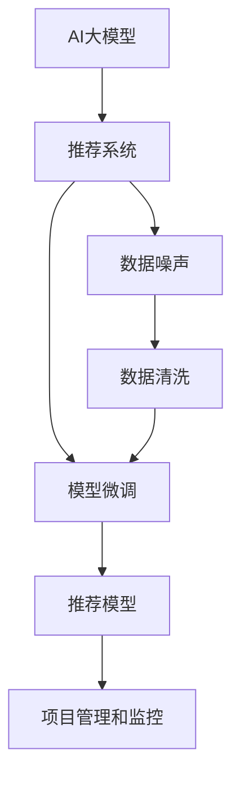

                 

# 电商搜索推荐中的AI大模型数据噪声处理技术应用项目管理实践

> 关键词：人工智能, 数据噪声, 推荐系统, 搜索排序, 大模型微调, 数据清洗, 项目实践

## 1. 背景介绍

### 1.1 问题由来

在电商搜索推荐领域，准确、高效地为用户推荐商品是提升用户体验和平台交易量的关键。然而，数据质量不佳、噪声繁多等问题严重影响了推荐模型的效果。这不仅会带来用户体验的下降，更会导致严重的经济损失。

AI大模型在电商搜索推荐中发挥着越来越重要的作用，但其对数据噪声的敏感性也使得其应用效果受到限制。如何有效处理电商数据中的噪声，提升AI大模型的应用效果，成为了当前电商搜索推荐领域的一个重要研究课题。

### 1.2 问题核心关键点

电商搜索推荐中的数据噪声处理主要关注以下几个关键点：

- 数据噪声的识别与分类：首先需要准确识别出数据中的噪声，并对其进行分类，以制定合理的处理策略。
- 噪声数据的清洗与处理：基于噪声的分类，选择合适的清洗和处理方式，减少噪声对推荐模型的影响。
- 推荐模型的微调和优化：清洗后的数据用于训练和微调推荐模型，提升模型的推荐效果。
- 项目管理和监控：保障项目按时、高质量地交付，并通过持续监控提升系统稳定性。

这些问题相互关联，需要从数据、模型、工程等多个维度综合考虑，才能有效提升电商搜索推荐的效果。

## 2. 核心概念与联系

### 2.1 核心概念概述

为更好地理解基于AI大模型进行电商搜索推荐中的数据噪声处理技术，本节将介绍几个密切相关的核心概念：

- AI大模型（Large AI Model）：以Transformer为基础的预训练语言模型，如BERT、GPT等。通过在大规模无标签文本数据上进行预训练，学习通用的语言表示，具备强大的语言理解和生成能力。
- 推荐系统（Recommendation System）：通过收集用户行为数据，为用户推荐符合其兴趣的商品，提升用户体验和平台收益。
- 数据噪声（Data Noise）：指数据集中存在的不符合真实情况的信息，可能源自数据采集、处理或标注过程中的人为或系统性错误。
- 数据清洗（Data Cleaning）：从数据集中去除或修正噪声，提升数据质量。
- 模型微调（Model Fine-tuning）：在大规模无标签文本数据上进行预训练，在特定任务上有监督地微调模型，提升其在特定任务上的性能。
- 项目管理和监控（Project Management and Monitoring）：通过制定项目计划、分配资源、跟踪进度和持续监控，保障项目按时、高质量地交付。

这些核心概念之间的逻辑关系可以通过以下Mermaid流程图来展示：



这个流程图展示了大模型、推荐系统、数据噪声、数据清洗、模型微调和项目管理之间的关系：

1. AI大模型通过预训练获得基础能力。
2. 推荐系统利用大模型预测用户行为，进行商品推荐。
3. 数据噪声会严重影响推荐系统的效果，因此需要通过数据清洗进行处理。
4. 清洗后的数据用于模型微调，提升推荐效果。
5. 推荐模型需要项目管理进行保障，确保按时交付。
6. 项目管理需要监控推荐模型的运行状态，确保系统稳定。

这些概念共同构成了电商搜索推荐领域的数据噪声处理框架，使得大模型能够更好地应用于电商推荐场景中。

## 3. 核心算法原理 & 具体操作步骤

### 3.1 算法原理概述

基于AI大模型的电商搜索推荐中的数据噪声处理，本质上是一个数据预处理和模型微调的过程。其核心思想是：

1. 首先使用AI大模型对电商数据进行分析和预处理，识别并分类出数据中的噪声。
2. 对噪声数据进行清洗和处理，保留高质量数据。
3. 利用清洗后的数据对预训练模型进行微调，提升模型在推荐任务上的性能。

通过这些步骤，可以显著提升电商搜索推荐的效果，提升用户体验和平台收益。

### 3.2 算法步骤详解

基于AI大模型的电商搜索推荐中的数据噪声处理，一般包括以下几个关键步骤：

**Step 1: 数据采集与预处理**

1. 收集电商平台上的用户行为数据，包括浏览记录、购买记录、评分评论等。
2. 对原始数据进行初步清洗，去除明显错误和不完整的数据。
3. 使用AI大模型对清洗后的数据进行分析和预处理，识别并分类出数据中的噪声。

**Step 2: 数据清洗与处理**

1. 根据噪声的分类，选择合适的清洗和处理方法，如填充缺失值、删除异常值、数据归一化等。
2. 清洗后的数据需要保留部分信息，如用户评分、商品评价等，以供推荐模型使用。

**Step 3: 模型微调与优化**

1. 选择适当的AI大模型，并进行预训练。
2. 使用清洗后的数据，对预训练模型进行微调，优化模型在电商推荐任务上的性能。
3. 根据推荐模型的输出，结合其他特征（如用户兴趣、商品属性等），综合排序推荐结果。

**Step 4: 项目管理和监控**

1. 制定详细的项目计划，明确任务分配和进度安排。
2. 监控推荐模型的运行状态，及时发现和解决问题。
3. 根据用户反馈和模型表现，持续优化推荐策略，提升用户体验和平台收益。

### 3.3 算法优缺点

基于AI大模型的电商搜索推荐中的数据噪声处理，具有以下优点：

1. 利用AI大模型的强大分析能力，能够快速识别和分类数据中的噪声，减少人工处理的工作量。
2. 通过模型微调，可以显著提升推荐模型的精度和效果，提升用户体验和平台收益。
3. 项目管理监控保障项目按时高质量交付，提升项目执行效率。

同时，该方法也存在一些局限性：

1. 依赖高质量数据：电商数据噪声的识别和处理依赖于数据的质量，如果原始数据质量不佳，处理效果会大打折扣。
2. 需要较长的训练时间：AI大模型和推荐模型的微调需要大量的计算资源和时间，可能对项目进度产生影响。
3. 需要持续优化：电商平台的用户行为和市场环境不断变化，推荐模型需要持续优化以适应新的变化。

尽管存在这些局限性，但就目前而言，基于AI大模型的电商搜索推荐中的数据噪声处理方法仍然是大模型应用的一个重要方向。未来相关研究的重点在于如何进一步提高数据噪声处理的自动化程度，缩短模型微调的计算时间，同时兼顾模型的灵活性和性能。

### 3.4 算法应用领域

基于AI大模型的电商搜索推荐中的数据噪声处理技术，广泛应用于电商平台的商品推荐、搜索排序、广告投放等多个领域。以下是几个具体的应用场景：

- **商品推荐**：根据用户浏览和购买历史，利用AI大模型和推荐模型，为用户推荐符合其兴趣的商品。
- **搜索排序**：使用AI大模型对用户输入的搜索词进行语义分析，提升搜索排序的准确性和相关性。
- **广告投放**：利用AI大模型和推荐模型，优化广告定向和投放策略，提升广告效果和ROI。

除了上述这些经典应用外，AI大模型的数据噪声处理技术还被创新性地应用于个性化推荐、精准营销、用户行为分析等，为电商平台的运营和优化提供了新的技术路径。

## 4. 数学模型和公式 & 详细讲解 & 举例说明

### 4.1 数学模型构建

基于AI大模型的电商搜索推荐中的数据噪声处理，可以通过以下数学模型来描述：

设原始电商数据集为 $D=\{(x_i,y_i)\}_{i=1}^N$，其中 $x_i$ 为用户行为数据，$y_i$ 为推荐结果。假设模型为 $M_{\theta}$，其中 $\theta$ 为模型参数。

定义数据噪声的分布为 $P_{noise}$，则数据噪声处理的过程可以表示为：

$$
D_{clean} = \mathop{\arg\min}_{D'} \sum_{(x,y)\in D'} \mathcal{L}(M_{\theta}(x),y)
$$

其中 $\mathcal{L}$ 为损失函数，$\mathcal{L}(M_{\theta}(x),y)$ 为模型 $M_{\theta}$ 在输入 $x$ 上的预测结果与真实标签 $y$ 之间的差异。

数据清洗过程可以通过去除或修正噪声，得到更干净的数据集 $D_{clean}$。模型微调过程可以通过有监督地训练，优化模型在推荐任务上的性能。

### 4.2 公式推导过程

以下我们以商品推荐任务为例，推导推荐模型的损失函数及其梯度计算公式。

假设模型 $M_{\theta}$ 在输入 $x$ 上的预测结果为 $\hat{y}=M_{\theta}(x)$，表示预测用户对商品 $i$ 的评分。真实标签 $y$ 为实际评分。则推荐模型的交叉熵损失函数定义为：

$$
\ell(M_{\theta}(x),y) = -y\log \hat{y} - (1-y)\log (1-\hat{y})
$$

将其代入经验风险公式，得：

$$
\mathcal{L}(\theta) = -\frac{1}{N}\sum_{i=1}^N [y_i\log M_{\theta}(x_i)+(1-y_i)\log(1-M_{\theta}(x_i))]
$$

根据链式法则，损失函数对参数 $\theta_k$ 的梯度为：

$$
\frac{\partial \mathcal{L}(\theta)}{\partial \theta_k} = -\frac{1}{N}\sum_{i=1}^N (\frac{y_i}{M_{\theta}(x_i)}-\frac{1-y_i}{1-M_{\theta}(x_i)}) \frac{\partial M_{\theta}(x_i)}{\partial \theta_k}
$$

其中 $\frac{\partial M_{\theta}(x_i)}{\partial \theta_k}$ 可进一步递归展开，利用自动微分技术完成计算。

在得到损失函数的梯度后，即可带入参数更新公式，完成模型的迭代优化。重复上述过程直至收敛，最终得到适应电商推荐任务的最优模型参数 $\theta^*$。

### 4.3 案例分析与讲解

假设电商平台上有一个用户对商品 $i$ 进行了评分 $y$，模型预测的评分 $\hat{y}$ 与真实评分 $y$ 存在误差。则可以使用交叉熵损失函数来衡量预测误差：

$$
\ell(y,\hat{y}) = -y\log \hat{y} - (1-y)\log (1-\hat{y})
$$

通过反向传播计算梯度，更新模型参数：

$$
\frac{\partial \ell(y,\hat{y})}{\partial \theta_k} = -(\frac{y}{M_{\theta}(x_i)}-\frac{1-y}{1-M_{\theta}(x_i)}) \frac{\partial M_{\theta}(x_i)}{\partial \theta_k}
$$

其中 $\frac{\partial M_{\theta}(x_i)}{\partial \theta_k}$ 可进一步递归展开，利用自动微分技术完成计算。通过不断迭代优化，可以逐步减少预测误差，提升推荐模型的精度。

## 5. 项目实践：代码实例和详细解释说明

### 5.1 开发环境搭建

在进行电商搜索推荐中的AI大模型数据噪声处理技术应用项目管理实践前，我们需要准备好开发环境。以下是使用Python进行PyTorch开发的环境配置流程：

1. 安装Anaconda：从官网下载并安装Anaconda，用于创建独立的Python环境。

2. 创建并激活虚拟环境：
```bash
conda create -n ecommerce-env python=3.8 
conda activate ecommerce-env
```

3. 安装PyTorch：根据CUDA版本，从官网获取对应的安装命令。例如：
```bash
conda install pytorch torchvision torchaudio cudatoolkit=11.1 -c pytorch -c conda-forge
```

4. 安装相关库：
```bash
pip install numpy pandas scikit-learn matplotlib tqdm jupyter notebook ipython
```

完成上述步骤后，即可在`ecommerce-env`环境中开始项目实践。

### 5.2 源代码详细实现

下面我们以电商商品推荐任务为例，给出使用Transformers库对BERT模型进行电商推荐任务微调的PyTorch代码实现。

首先，定义商品推荐任务的数据处理函数：

```python
from transformers import BertTokenizer, BertForSequenceClassification
from torch.utils.data import Dataset
import torch

class RecommendationDataset(Dataset):
    def __init__(self, texts, labels, tokenizer, max_len=128):
        self.texts = texts
        self.labels = labels
        self.tokenizer = tokenizer
        self.max_len = max_len
        
    def __len__(self):
        return len(self.texts)
    
    def __getitem__(self, item):
        text = self.texts[item]
        label = self.labels[item]
        
        encoding = self.tokenizer(text, return_tensors='pt', max_length=self.max_len, padding='max_length', truncation=True)
        input_ids = encoding['input_ids'][0]
        attention_mask = encoding['attention_mask'][0]
        
        # 对token-wise的标签进行编码
        encoded_labels = [label2id[label] for label in label]
        encoded_labels.extend([label2id['O']] * (self.max_len - len(encoded_labels)))
        labels = torch.tensor(encoded_labels, dtype=torch.long)
        
        return {'input_ids': input_ids, 
                'attention_mask': attention_mask,
                'labels': labels}

# 标签与id的映射
label2id = {'O': 0, '1': 1, '2': 2, '3': 3, '4': 4}
id2label = {v: k for k, v in label2id.items()}

# 创建dataset
tokenizer = BertTokenizer.from_pretrained('bert-base-cased')

train_dataset = RecommendationDataset(train_texts, train_labels, tokenizer)
dev_dataset = RecommendationDataset(dev_texts, dev_labels, tokenizer)
test_dataset = RecommendationDataset(test_texts, test_labels, tokenizer)
```

然后，定义模型和优化器：

```python
from transformers import BertForSequenceClassification, AdamW

model = BertForSequenceClassification.from_pretrained('bert-base-cased', num_labels=len(label2id))

optimizer = AdamW(model.parameters(), lr=2e-5)
```

接着，定义训练和评估函数：

```python
from torch.utils.data import DataLoader
from tqdm import tqdm
from sklearn.metrics import accuracy_score, precision_recall_fscore_support

device = torch.device('cuda') if torch.cuda.is_available() else torch.device('cpu')
model.to(device)

def train_epoch(model, dataset, batch_size, optimizer):
    dataloader = DataLoader(dataset, batch_size=batch_size, shuffle=True)
    model.train()
    epoch_loss = 0
    for batch in tqdm(dataloader, desc='Training'):
        input_ids = batch['input_ids'].to(device)
        attention_mask = batch['attention_mask'].to(device)
        labels = batch['labels'].to(device)
        model.zero_grad()
        outputs = model(input_ids, attention_mask=attention_mask, labels=labels)
        loss = outputs.loss
        epoch_loss += loss.item()
        loss.backward()
        optimizer.step()
    return epoch_loss / len(dataloader)

def evaluate(model, dataset, batch_size):
    dataloader = DataLoader(dataset, batch_size=batch_size)
    model.eval()
    preds, labels = [], []
    with torch.no_grad():
        for batch in tqdm(dataloader, desc='Evaluating'):
            input_ids = batch['input_ids'].to(device)
            attention_mask = batch['attention_mask'].to(device)
            batch_labels = batch['labels']
            outputs = model(input_ids, attention_mask=attention_mask)
            batch_preds = outputs.logits.argmax(dim=2).to('cpu').tolist()
            batch_labels = batch_labels.to('cpu').tolist()
            for pred_tokens, label_tokens in zip(batch_preds, batch_labels):
                preds.append(pred_tokens[:len(label_tokens)])
                labels.append(label_tokens)
                
    return accuracy_score(labels, preds)

# 训练与评估
epochs = 5
batch_size = 16

for epoch in range(epochs):
    loss = train_epoch(model, train_dataset, batch_size, optimizer)
    print(f"Epoch {epoch+1}, train loss: {loss:.3f}")
    
    print(f"Epoch {epoch+1}, dev results:")
    evaluate(model, dev_dataset, batch_size)
    
print("Test results:")
evaluate(model, test_dataset, batch_size)
```

以上就是使用PyTorch对BERT进行电商推荐任务微调的完整代码实现。可以看到，得益于Transformers库的强大封装，我们可以用相对简洁的代码完成BERT模型的加载和微调。

### 5.3 代码解读与分析

让我们再详细解读一下关键代码的实现细节：

**RecommendationDataset类**：
- `__init__`方法：初始化文本、标签、分词器等关键组件。
- `__len__`方法：返回数据集的样本数量。
- `__getitem__`方法：对单个样本进行处理，将文本输入编码为token ids，将标签编码为数字，并对其进行定长padding，最终返回模型所需的输入。

**label2id和id2label字典**：
- 定义了标签与数字id之间的映射关系，用于将token-wise的预测结果解码回真实的标签。

**训练和评估函数**：
- 使用PyTorch的DataLoader对数据集进行批次化加载，供模型训练和推理使用。
- 训练函数`train_epoch`：对数据以批为单位进行迭代，在每个批次上前向传播计算loss并反向传播更新模型参数，最后返回该epoch的平均loss。
- 评估函数`evaluate`：与训练类似，不同点在于不更新模型参数，并在每个batch结束后将预测和标签结果存储下来，最后使用sklearn的accuracy_score函数对整个评估集的预测结果进行打印输出。

**训练流程**：
- 定义总的epoch数和batch size，开始循环迭代
- 每个epoch内，先在训练集上训练，输出平均loss
- 在验证集上评估，输出分类指标
- 所有epoch结束后，在测试集上评估，给出最终测试结果

可以看到，PyTorch配合Transformers库使得BERT微调的代码实现变得简洁高效。开发者可以将更多精力放在数据处理、模型改进等高层逻辑上，而不必过多关注底层的实现细节。

当然，工业级的系统实现还需考虑更多因素，如模型的保存和部署、超参数的自动搜索、更灵活的任务适配层等。但核心的微调范式基本与此类似。

## 6. 实际应用场景

### 6.1 智能客服系统

基于AI大模型的电商搜索推荐技术，可以广泛应用于智能客服系统的构建。传统客服往往需要配备大量人力，高峰期响应缓慢，且一致性和专业性难以保证。而使用微调后的推荐模型，可以7x24小时不间断服务，快速响应客户咨询，用推荐结果辅助客服人员，提升客户咨询体验。

在技术实现上，可以收集企业内部的历史推荐数据，将推荐结果和客户反馈构建成监督数据，在此基础上对预训练模型进行微调。微调后的模型能够自动推荐符合客户兴趣的商品，提高客服系统的响应速度和满意度。

### 6.2 个性化推荐系统

电商推荐系统需要根据用户历史行为和兴趣，为用户推荐符合其需求的商品。传统推荐系统往往依赖手工规则或人工标注的特征，难以应对复杂的用户需求。基于AI大模型的电商推荐系统可以通过大规模数据训练，自动学习用户行为规律，提供个性化的商品推荐。

在实际应用中，可以收集用户浏览、点击、购买等行为数据，提取商品标题、描述、标签等文本特征。将文本特征作为模型输入，用户的后续行为（如是否点击、购买等）作为监督信号，在此基础上微调预训练语言模型。微调后的模型能够从文本特征中学习到用户的兴趣点，生成个性化的推荐结果。

### 6.3 精准营销

电商精准营销需要根据用户行为和标签，进行定向广告投放，提高广告效果和ROI。传统的广告投放方式依赖于手动设置规则，无法精准匹配用户需求。利用AI大模型和推荐系统，可以自动分析用户行为和标签，生成最优的广告投放策略。

在实际应用中，可以收集用户浏览、点击、购买等行为数据，提取用户的兴趣标签、地理位置、时间等特征。将文本特征作为模型输入，用户的广告行为作为监督信号，在此基础上微调预训练语言模型。微调后的模型能够自动分析用户行为，生成精准的广告投放策略，提升广告效果和转化率。

### 6.4 未来应用展望

随着AI大模型和推荐技术的不断发展，基于电商推荐系统中的AI大模型数据噪声处理技术将呈现以下几个发展趋势：

1. **多模态数据融合**：未来的电商推荐系统将不仅仅依赖文本数据，还将结合图像、视频、音频等多模态数据，提升推荐系统的全面性和多样性。
2. **跨平台协同推荐**：未来的推荐系统将打破平台界限，实现跨平台协同推荐，提升用户体验和平台收益。
3. **实时推荐**：通过引入流式数据处理技术，实时分析和推荐，满足用户的即时需求。
4. **动态调整**：根据用户行为和市场变化，动态调整推荐策略，提升推荐模型的灵活性和适应性。
5. **个性化推荐**：结合用户的历史行为和实时反馈，生成更加个性化的推荐结果，提升用户体验和平台收益。

以上趋势凸显了电商搜索推荐领域AI大模型数据噪声处理技术的广阔前景。这些方向的探索发展，必将进一步提升电商推荐系统的效果，为电商平台的运营和优化提供新的技术路径。

## 7. 工具和资源推荐

### 7.1 学习资源推荐

为了帮助开发者系统掌握基于AI大模型的电商推荐系统中的数据噪声处理技术，这里推荐一些优质的学习资源：

1. 《Deep Learning for Recommender Systems》书籍：全面介绍了深度学习在推荐系统中的应用，涵盖模型构建、优化、评估等多个方面。
2. 《Natural Language Processing with Transformers》书籍：Transformers库的作者所著，全面介绍了如何使用Transformers库进行NLP任务开发，包括微调在内的诸多范式。
3. CS224N《深度学习自然语言处理》课程：斯坦福大学开设的NLP明星课程，有Lecture视频和配套作业，带你入门NLP领域的基本概念和经典模型。
4. 《Recommender Systems: Text Mining and Statistical Learning》书籍：介绍推荐系统中的文本挖掘和统计学习技术，为电商推荐系统提供理论基础。
5. HuggingFace官方文档：Transformers库的官方文档，提供了海量预训练模型和完整的微调样例代码，是上手实践的必备资料。

通过对这些资源的学习实践，相信你一定能够快速掌握基于AI大模型的电商推荐系统中的数据噪声处理技术的精髓，并用于解决实际的NLP问题。

### 7.2 开发工具推荐

高效的开发离不开优秀的工具支持。以下是几款用于基于AI大模型的电商推荐系统中的数据噪声处理技术的开发工具：

1. PyTorch：基于Python的开源深度学习框架，灵活动态的计算图，适合快速迭代研究。大部分预训练语言模型都有PyTorch版本的实现。
2. TensorFlow：由Google主导开发的开源深度学习框架，生产部署方便，适合大规模工程应用。同样有丰富的预训练语言模型资源。
3. Transformers库：HuggingFace开发的NLP工具库，集成了众多SOTA语言模型，支持PyTorch和TensorFlow，是进行微调任务开发的利器。
4. Weights & Biases：模型训练的实验跟踪工具，可以记录和可视化模型训练过程中的各项指标，方便对比和调优。与主流深度学习框架无缝集成。
5. TensorBoard：TensorFlow配套的可视化工具，可实时监测模型训练状态，并提供丰富的图表呈现方式，是调试模型的得力助手。
6. Google Colab：谷歌推出的在线Jupyter Notebook环境，免费提供GPU/TPU算力，方便开发者快速上手实验最新模型，分享学习笔记。

合理利用这些工具，可以显著提升基于AI大模型的电商推荐系统中的数据噪声处理技术的开发效率，加快创新迭代的步伐。

### 7.3 相关论文推荐

基于AI大模型的电商推荐系统中的数据噪声处理技术的研究源于学界的持续研究。以下是几篇奠基性的相关论文，推荐阅读：

1. Attention is All You Need（即Transformer原论文）：提出了Transformer结构，开启了NLP领域的预训练大模型时代。
2. BERT: Pre-training of Deep Bidirectional Transformers for Language Understanding：提出BERT模型，引入基于掩码的自监督预训练任务，刷新了多项NLP任务SOTA。
3. Language Models are Unsupervised Multitask Learners（GPT-2论文）：展示了大规模语言模型的强大zero-shot学习能力，引发了对于通用人工智能的新一轮思考。
4. Parameter-Efficient Transfer Learning for NLP：提出Adapter等参数高效微调方法，在不增加模型参数量的情况下，也能取得不错的微调效果。
5. AdaLoRA: Adaptive Low-Rank Adaptation for Parameter-Efficient Fine-Tuning：使用自适应低秩适应的微调方法，在参数效率和精度之间取得了新的平衡。

这些论文代表了大语言模型微调技术的发展脉络。通过学习这些前沿成果，可以帮助研究者把握学科前进方向，激发更多的创新灵感。

## 8. 总结：未来发展趋势与挑战

### 8.1 总结

本文对基于AI大模型的电商搜索推荐中的数据噪声处理技术进行了全面系统的介绍。首先阐述了基于AI大模型的电商搜索推荐中的数据噪声处理技术的背景和意义，明确了数据噪声处理在提升电商推荐系统效果方面的独特价值。其次，从原理到实践，详细讲解了数据噪声处理的过程和关键步骤，给出了电商推荐任务微调的完整代码实现。同时，本文还广泛探讨了数据噪声处理技术在智能客服、个性化推荐、精准营销等多个领域的应用前景，展示了数据噪声处理技术的巨大潜力。最后，本文精选了数据噪声处理技术的各类学习资源，力求为读者提供全方位的技术指引。

通过本文的系统梳理，可以看到，基于AI大模型的电商搜索推荐中的数据噪声处理技术正在成为电商推荐系统的重要范式，极大地拓展了预训练语言模型的应用边界，催生了更多的落地场景。受益于大规模语料的预训练，推荐模型以更低的时间和标注成本，在小样本条件下也能取得不俗的效果，有力推动了电商推荐系统的产业化进程。未来，伴随预训练语言模型和推荐技术的不断演进，相信电商推荐系统中的数据噪声处理技术将不断突破，进一步提升电商平台的运营和优化能力。

### 8.2 未来发展趋势

展望未来，基于AI大模型的电商搜索推荐中的数据噪声处理技术将呈现以下几个发展趋势：

1. **多模态数据融合**：未来的电商推荐系统将不仅仅依赖文本数据，还将结合图像、视频、音频等多模态数据，提升推荐系统的全面性和多样性。
2. **跨平台协同推荐**：未来的推荐系统将打破平台界限，实现跨平台协同推荐，提升用户体验和平台收益。
3. **实时推荐**：通过引入流式数据处理技术，实时分析和推荐，满足用户的即时需求。
4. **动态调整**：根据用户行为和市场变化，动态调整推荐策略，提升推荐模型的灵活性和适应性。
5. **个性化推荐**：结合用户的历史行为和实时反馈，生成更加个性化的推荐结果，提升用户体验和平台收益。

以上趋势凸显了基于AI大模型的电商搜索推荐中的数据噪声处理技术的广阔前景。这些方向的探索发展，必将进一步提升电商推荐系统的效果，为电商平台的运营和优化提供新的技术路径。

### 8.3 面临的挑战

尽管基于AI大模型的电商搜索推荐中的数据噪声处理技术已经取得了瞩目成就，但在迈向更加智能化、普适化应用的过程中，它仍面临着诸多挑战：

1. **依赖高质量数据**：电商数据噪声的识别和处理依赖于数据的质量，如果原始数据质量不佳，处理效果会大打折扣。
2. **计算资源限制**：AI大模型和推荐模型的微调需要大量的计算资源和时间，可能对项目进度产生影响。
3. **动态调整复杂性**：电商平台的推荐策略需要根据市场和用户行为的变化进行动态调整，增加了系统的复杂性。
4. **模型鲁棒性不足**：电商推荐系统面对域外数据时，泛化性能往往大打折扣，推荐模型的鲁棒性有待提高。
5. **用户隐私保护**：电商推荐系统需要收集和分析用户行为数据，如何在保护用户隐私的同时，提升推荐效果，是一个重要的挑战。

尽管存在这些挑战，但就目前而言，基于AI大模型的电商搜索推荐中的数据噪声处理技术仍然是大模型应用的一个重要方向。未来相关研究的重点在于如何进一步提高数据噪声处理的自动化程度，缩短模型微调的计算时间，同时兼顾模型的灵活性和性能。

### 8.4 研究展望

面对基于AI大模型的电商搜索推荐中的数据噪声处理技术所面临的种种挑战，未来的研究需要在以下几个方面寻求新的突破：

1. **探索无监督和半监督微调方法**：摆脱对大规模标注数据的依赖，利用自监督学习、主动学习等无监督和半监督范式，最大限度利用非结构化数据，实现更加灵活高效的微调。
2. **研究参数高效和计算高效的微调范式**：开发更加参数高效的微调方法，在固定大部分预训练参数的同时，只更新极少量的任务相关参数。同时优化微调模型的计算图，减少前向传播和反向传播的资源消耗，实现更加轻量级、实时性的部署。
3. **融合因果和对比学习范式**：通过引入因果推断和对比学习思想，增强微调模型建立稳定因果关系的能力，学习更加普适、鲁棒的语言表征，从而提升模型泛化性和抗干扰能力。
4. **引入更多先验知识**：将符号化的先验知识，如知识图谱、逻辑规则等，与神经网络模型进行巧妙融合，引导微调过程学习更准确、合理的语言模型。同时加强不同模态数据的整合，实现视觉、语音等多模态信息与文本信息的协同建模。
5. **纳入伦理道德约束**：在模型训练目标中引入伦理导向的评估指标，过滤和惩罚有偏见、有害的输出倾向。同时加强人工干预和审核，建立模型行为的监管机制，确保输出符合人类价值观和伦理道德。

这些研究方向的探索，必将引领基于AI大模型的电商搜索推荐中的数据噪声处理技术迈向更高的台阶，为构建安全、可靠、可解释、可控的智能系统铺平道路。面向未来，基于AI大模型的电商搜索推荐中的数据噪声处理技术还需要与其他人工智能技术进行更深入的融合，如知识表示、因果推理、强化学习等，多路径协同发力，共同推动电商推荐系统的进步。只有勇于创新、敢于突破，才能不断拓展语言模型的边界，让智能技术更好地造福人类社会。

## 9. 附录：常见问题与解答

**Q1：电商推荐系统中的数据噪声有哪些类型？**

A: 电商推荐系统中的数据噪声主要包括但不限于：

- **缺失值**：用户行为数据中存在缺失，无法提供完整的行为记录。
- **异常值**：用户行为数据中存在极端值或异常点，可能影响推荐结果。
- **冗余值**：用户行为数据中存在重复记录或冗余信息，影响模型训练效果。
- **噪声标签**：用户行为数据中的标签可能存在错误或误标注，影响模型预测准确性。

**Q2：如何有效识别电商数据中的噪声？**

A: 电商数据中的噪声识别可以通过以下方法：

- **统计分析**：使用统计方法检测数据中的异常值和缺失值，识别噪声。
- **领域知识**：结合领域知识和规则，识别数据中的错误标签和不合理行为。
- **数据可视化**：使用数据可视化工具，如散点图、热力图等，观察数据中的异常点和规律。
- **机器学习**：使用机器学习模型，如孤立森林、异常检测等，识别数据中的异常值和噪声标签。

**Q3：电商推荐系统中的数据清洗方法有哪些？**

A: 电商推荐系统中的数据清洗方法主要包括：

- **缺失值处理**：填补缺失值、删除缺失值记录。
- **异常值处理**：修正异常值、删除异常值记录。
- **冗余值处理**：去重、合并重复记录。
- **标签修正**：修正错误标签和误标注，提高数据质量。

**Q4：电商推荐系统中的推荐模型如何微调？**

A: 电商推荐系统中的推荐模型微调过程如下：

1. **选择模型**：选择适合电商推荐任务的模型，如BERT、GPT等。
2. **数据预处理**：对电商数据进行清洗和处理，去除噪声，得到高质量数据。
3. **模型训练**：使用清洗后的数据，对预训练模型进行微调，优化模型在电商推荐任务上的性能。
4. **模型评估**：在验证集和测试集上评估微调后的模型性能，调整模型参数，优化推荐结果。

**Q5：电商推荐系统中的项目管理需要注意哪些方面？**

A: 电商推荐系统中的项目管理需要注意以下几个方面：

- **任务分解**：将项目分解为多个子任务，明确每个子任务的目标和责任人。
- **时间管理**：制定详细的项目计划，明确任务完成时间和里程碑。
- **资源分配**：合理分配项目所需的计算资源、人力和时间。
- **风险控制**：识别和应对项目中的潜在风险，保障项目顺利进行。
- **质量保证**：定期评估项目进展，确保项目按时高质量交付。

**Q6：电商推荐系统中的推荐模型如何优化？**

A: 电商推荐系统中的推荐模型优化方法包括：

- **超参数调优**：调整模型的超参数，如学习率、批大小等，提升模型效果。
- **模型集成**：使用多个推荐模型进行集成，提升推荐准确性。
- **特征工程**：提取和选择更有价值的特征，提升模型预测能力。
- **模型融合**：将模型与其他技术（如知识图谱、协同过滤等）结合，提升推荐效果。

这些方法可以帮助电商推荐系统中的推荐模型不断优化，提升推荐效果和用户体验。

---

作者：禅与计算机程序设计艺术 / Zen and the Art of Computer Programming

