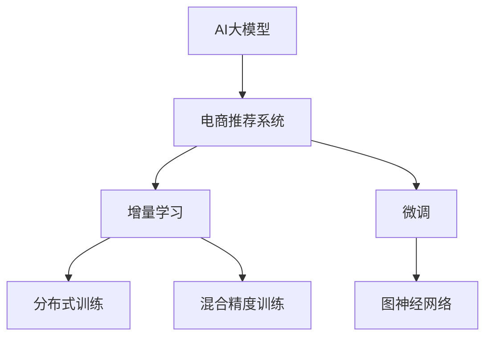

                 

# 电商搜索推荐中的AI大模型数据增量更新机制

## 1. 背景介绍

### 1.1 问题由来
随着电商行业的迅猛发展，用户需求日益个性化、多元化，传统的基于规则或人工设计的推荐系统已难以满足市场需求。人工智能技术在电商推荐中得以广泛应用，AI大模型因其庞大的参数量和丰富的语义理解能力，成为电商推荐系统的核心。

然而，AI大模型的训练成本高，更新频率低，难以实时响应用户需求。对于电商平台而言，用户在不断变化的需求中，需要实时、动态的推荐服务。如何在有限的计算资源下，快速更新AI大模型，成为电商搜索推荐系统的核心问题。

### 1.2 问题核心关键点
1. 数据更新机制：如何在有限的计算资源下，快速、高效地更新大模型，保证模型的实时响应性。
2. 模型适配性：如何使大模型在电商推荐场景中，快速适应新需求，提供精准推荐。
3. 计算效率：如何平衡计算资源和模型更新频率，实现快速、高效的推荐服务。

### 1.3 问题研究意义
实现AI大模型的快速、高效更新机制，对于提升电商推荐系统的实时性、个性化、精准度具有重要意义：

1. 提升用户体验：实时响应用户需求，提供个性化推荐，提升用户满意度。
2. 增强市场竞争力：通过精准推荐，增加销售额，提升市场份额。
3. 优化运营效率：减少人工干预，降低运营成本，提升平台运营效率。
4. 促进技术创新：推动AI大模型在电商领域的应用研究，促进技术进步。

## 2. 核心概念与联系

### 2.1 核心概念概述

为更好地理解电商搜索推荐中的AI大模型数据增量更新机制，本节将介绍几个密切相关的核心概念：

- AI大模型(AI Large Model)：以自回归(如GPT)或自编码(如BERT)模型为代表的大规模预训练语言模型。通过在大规模无标签文本语料上进行预训练，学习通用的语言表示，具备强大的语言理解和生成能力。

- 电商推荐系统(e-commerce recommendation system)：利用用户行为数据、商品数据等，通过模型预测用户可能感兴趣的商品，提供个性化推荐。

- 增量学习(incremental learning)：指在已有模型的基础上，通过新增数据对模型进行在线更新，而不是从头训练。

- 分布式训练(distributed training)：通过多个计算节点并行训练模型，提升训练效率，适应大规模数据。

- 混合精度训练(mixed-precision training)：将模型参数和梯度表示为低精度格式，降低计算资源消耗，提高训练速度。

- 微调(fine-tuning)：在大模型的基础上，通过有监督数据对模型进行适配，提升模型在特定任务上的表现。

- 图神经网络(Graph Neural Networks, GNN)：用于处理图结构数据的神经网络模型，在电商推荐中常用于商品关联关系建模。

这些核心概念之间的逻辑关系可以通过以下Mermaid流程图来展示：



这个流程图展示了大模型在电商推荐中的应用核心概念及其之间的关系：

1. AI大模型通过预训练获得基础能力。
2. 电商推荐系统利用大模型进行实时推荐。
3. 增量学习和大模型的联合使用，适应实时需求的变化。
4. 分布式训练和混合精度训练提升训练效率。
5. 微调和大模型的结合，提升模型在电商推荐场景中的适配性。
6. 图神经网络用于建模商品关联关系，提升推荐精度。

这些概念共同构成了电商搜索推荐系统和大模型数据增量更新机制的基本框架，使得电商推荐系统能够更好地利用大模型的能力，提供精准的个性化推荐服务。

## 3. 核心算法原理 & 具体操作步骤
### 3.1 算法原理概述

基于AI大模型的电商搜索推荐系统，其核心思想是利用大模型进行实时推荐，并通过增量学习机制，快速响应用户需求的动态变化。该机制的核心在于：

1. 构建大模型在电商推荐场景中的适配层，使其能够适应电商推荐的具体任务。
2. 通过增量学习机制，实时更新大模型，保证推荐结果的实时性和个性化。
3. 利用分布式训练和混合精度训练提升模型训练效率，适应大规模数据和高并行计算的需求。
4. 通过微调机制，利用新数据对模型进行局部优化，提升模型性能。
5. 利用图神经网络对商品关联关系进行建模，提升推荐精度。

### 3.2 算法步骤详解

基于AI大模型的电商搜索推荐系统，其核心步骤主要包括：

**Step 1: 准备数据集**
- 收集电商用户行为数据、商品数据、用户画像数据等。
- 清洗和标注数据，生成训练集、验证集和测试集。
- 将数据转换为模型所需的格式，如将商品ID转换为嵌入向量。

**Step 2: 设计模型架构**
- 选择适合电商推荐任务的大模型架构，如Transformer。
- 在模型顶层设计适配层，包括嵌入层、注意力机制、输出层等。
- 确定损失函数，如交叉熵损失、均方误差损失等。

**Step 3: 初始化模型和参数**
- 初始化模型参数，通常使用预训练模型作为初始化权重。
- 设置学习率、批大小、迭代轮数等超参数。

**Step 4: 分布式训练**
- 在多台计算节点上并行训练模型，提高训练效率。
- 使用混合精度训练技术，降低计算资源消耗，提升训练速度。

**Step 5: 增量学习**
- 在新数据到来时，利用增量学习机制，在线更新模型。
- 设计增量数据处理方法，如批处理、滑动窗口等，保证增量更新的效率和准确性。
- 通过微调机制，利用新数据对模型进行局部优化，提升模型性能。

**Step 6: 模型部署和评估**
- 将训练好的模型部署到推荐系统中。
- 在实时数据上评估模型的推荐效果，如准确率、召回率、F1分数等。
- 根据评估结果，调整模型参数，优化模型性能。

**Step 7: 持续监控和优化**
- 持续监控推荐系统的运行状态，检测异常情况。
- 根据用户反馈和运营数据，对模型进行优化，提升推荐效果。
- 定期更新模型参数，保持模型的实时性和性能。

以上是电商搜索推荐系统和大模型数据增量更新机制的一般流程。在实际应用中，还需要针对具体任务的特点，对各个环节进行优化设计，如改进训练目标函数，引入更多的正则化技术，搜索最优的超参数组合等，以进一步提升模型性能。

### 3.3 算法优缺点

基于AI大模型的电商搜索推荐系统具有以下优点：
1. 实时响应：通过增量学习机制，能够快速响应用户需求的变化。
2. 个性化推荐：利用大模型的通用语言理解能力，提供个性化推荐，提升用户满意度。
3. 精度高：大模型的庞大参数量和丰富的语义表示，能够提供精准的推荐结果。
4. 可扩展性强：通过分布式训练和混合精度训练，适应大规模数据和高并行计算的需求。
5. 灵活性强：通过微调机制，适应电商推荐的具体任务。

同时，该算法也存在一定的局限性：
1. 计算资源消耗大：大模型的庞大参数量和分布式训练，对计算资源和存储资源有较高要求。
2. 更新频率低：增量学习的效率较低，更新频率受限于新数据的数量和质量。
3. 模型复杂度高：大模型的复杂度和计算量较大，难以实时更新。
4. 过拟合风险：增量学习容易导致模型过拟合，影响推荐效果。
5. 数据依赖性高：电商推荐系统的推荐效果高度依赖数据的质量和数量。

尽管存在这些局限性，但就目前而言，基于AI大模型的电商推荐系统仍然是大规模数据和复杂场景下的首选方案。未来相关研究的重点在于如何进一步降低计算资源消耗，提高增量学习的效率，同时兼顾可解释性和伦理安全性等因素。

### 3.4 算法应用领域

基于AI大模型的电商搜索推荐系统，已经在电商行业得到了广泛的应用，覆盖了几乎所有常见的推荐场景，例如：

- 商品推荐：根据用户的历史浏览、点击、购买记录，推荐相关商品。
- 关联推荐：基于用户历史行为，推荐相关商品和相关商品。
- 实时推荐：根据用户实时行为，提供即时推荐。
- 个性化营销：根据用户画像，推送个性化广告和推荐。
- 趋势预测：基于用户行为数据，预测商品趋势和用户需求。
- 多模态推荐：结合图像、视频等多模态数据，提供更精准的推荐。

除了上述这些经典任务外，电商推荐系统还被创新性地应用到更多场景中，如用户行为分析、供应链优化、库存管理等，为电商业务带来了新的活力。随着电商行业的不断发展和AI技术的进步，相信电商推荐系统将会在更广阔的领域发挥更大的作用。

## 4. 数学模型和公式 & 详细讲解
### 4.1 数学模型构建

在本节中，我们将使用数学语言对电商搜索推荐系统中的AI大模型数据增量更新机制进行更加严格的刻画。

记电商推荐系统中的用户行为数据为 $D=\{(x_i, y_i)\}_{i=1}^N$，其中 $x_i$ 为输入特征， $y_i$ 为输出标签。用户行为数据可以包括用户ID、商品ID、浏览时间、点击次数等。

定义模型 $M_{\theta}$ 在输入 $x_i$ 上的输出为 $\hat{y}=M_{\theta}(x_i) \in \{0,1\}$，表示模型预测用户是否感兴趣。

假设模型 $M_{\theta}$ 在输入 $x_i$ 上的损失函数为 $\ell(M_{\theta}(x_i),y_i)$，则在数据集 $D$ 上的经验风险为：

$$
\mathcal{L}(\theta) = \frac{1}{N}\sum_{i=1}^N \ell(M_{\theta}(x_i),y_i)
$$

在实际应用中，我们通常使用交叉熵损失函数，即：

$$
\ell(M_{\theta}(x_i),y_i) = -[y_i\log M_{\theta}(x_i)+(1-y_i)\log(1-M_{\theta}(x_i))]
$$

### 4.2 公式推导过程

以下我们以电商推荐系统为例，推导交叉熵损失函数及其梯度的计算公式。

假设模型 $M_{\theta}$ 在输入 $x_i$ 上的输出为 $\hat{y}=M_{\theta}(x_i) \in [0,1]$，表示用户是否感兴趣的概率。真实标签 $y_i \in \{0,1\}$。则二分类交叉熵损失函数定义为：

$$
\ell(M_{\theta}(x_i),y_i) = -[y_i\log \hat{y} + (1-y_i)\log (1-\hat{y})]
$$

将其代入经验风险公式，得：

$$
\mathcal{L}(\theta) = -\frac{1}{N}\sum_{i=1}^N [y_i\log M_{\theta}(x_i)+(1-y_i)\log(1-M_{\theta}(x_i))]
$$

根据链式法则，损失函数对参数 $\theta_k$ 的梯度为：

$$
\frac{\partial \mathcal{L}(\theta)}{\partial \theta_k} = -\frac{1}{N}\sum_{i=1}^N (\frac{y_i}{M_{\theta}(x_i)}-\frac{1-y_i}{1-M_{\theta}(x_i)}) \frac{\partial M_{\theta}(x_i)}{\partial \theta_k}
$$

其中 $\frac{\partial M_{\theta}(x_i)}{\partial \theta_k}$ 可进一步递归展开，利用自动微分技术完成计算。

### 4.3 案例分析与讲解

电商推荐系统中的AI大模型数据增量更新机制，主要包括以下几个关键步骤：

1. 数据预处理：收集用户行为数据、商品数据、用户画像数据等，清洗和标注数据，生成训练集、验证集和测试集。
2. 模型初始化：使用预训练模型作为初始化权重，设置超参数。
3. 分布式训练：在多台计算节点上并行训练模型，提高训练效率。
4. 增量学习：在新数据到来时，利用增量学习机制，在线更新模型。
5. 微调：通过微调机制，利用新数据对模型进行局部优化，提升模型性能。
6. 模型部署：将训练好的模型部署到推荐系统中。
7. 持续监控和优化：持续监控推荐系统的运行状态，根据用户反馈和运营数据，对模型进行优化，提升推荐效果。

以下是电商推荐系统中的AI大模型数据增量更新机制的详细实现步骤：

**Step 1: 准备数据集**
- 收集电商用户行为数据、商品数据、用户画像数据等。
- 清洗和标注数据，生成训练集、验证集和测试集。
- 将数据转换为模型所需的格式，如将商品ID转换为嵌入向量。

**Step 2: 设计模型架构**
- 选择适合电商推荐任务的大模型架构，如Transformer。
- 在模型顶层设计适配层，包括嵌入层、注意力机制、输出层等。
- 确定损失函数，如交叉熵损失、均方误差损失等。

**Step 3: 初始化模型和参数**
- 初始化模型参数，通常使用预训练模型作为初始化权重。
- 设置学习率、批大小、迭代轮数等超参数。

**Step 4: 分布式训练**
- 在多台计算节点上并行训练模型，提高训练效率。
- 使用混合精度训练技术，降低计算资源消耗，提升训练速度。

**Step 5: 增量学习**
- 在新数据到来时，利用增量学习机制，在线更新模型。
- 设计增量数据处理方法，如批处理、滑动窗口等，保证增量更新的效率和准确性。
- 通过微调机制，利用新数据对模型进行局部优化，提升模型性能。

**Step 6: 模型部署和评估**
- 将训练好的模型部署到推荐系统中。
- 在实时数据上评估模型的推荐效果，如准确率、召回率、F1分数等。
- 根据评估结果，调整模型参数，优化模型性能。

**Step 7: 持续监控和优化**
- 持续监控推荐系统的运行状态，检测异常情况。
- 根据用户反馈和运营数据，对模型进行优化，提升推荐效果。
- 定期更新模型参数，保持模型的实时性和性能。

以上是电商搜索推荐系统和大模型数据增量更新机制的一般流程。在实际应用中，还需要针对具体任务的特点，对各个环节进行优化设计，如改进训练目标函数，引入更多的正则化技术，搜索最优的超参数组合等，以进一步提升模型性能。

## 5. 项目实践：代码实例和详细解释说明
### 5.1 开发环境搭建

在进行电商推荐系统开发前，我们需要准备好开发环境。以下是使用Python进行PyTorch开发的环境配置流程：

1. 安装Anaconda：从官网下载并安装Anaconda，用于创建独立的Python环境。

2. 创建并激活虚拟环境：
```bash
conda create -n pytorch-env python=3.8 
conda activate pytorch-env
```

3. 安装PyTorch：根据CUDA版本，从官网获取对应的安装命令。例如：
```bash
conda install pytorch torchvision torchaudio cudatoolkit=11.1 -c pytorch -c conda-forge
```

4. 安装Transformers库：
```bash
pip install transformers
```

5. 安装各类工具包：
```bash
pip install numpy pandas scikit-learn matplotlib tqdm jupyter notebook ipython
```

完成上述步骤后，即可在`pytorch-env`环境中开始电商推荐系统的开发。

### 5.2 源代码详细实现

下面我们以商品推荐任务为例，给出使用Transformers库对大模型进行电商推荐系统微调的PyTorch代码实现。

首先，定义商品推荐任务的数据处理函数：

```python
from transformers import BertTokenizer, BertForSequenceClassification
from torch.utils.data import Dataset
import torch

class RecommendationDataset(Dataset):
    def __init__(self, items, labels, tokenizer, max_len=128):
        self.items = items
        self.labels = labels
        self.tokenizer = tokenizer
        self.max_len = max_len
        
    def __len__(self):
        return len(self.items)
    
    def __getitem__(self, item):
        item = self.items[item]
        label = self.labels[item]
        
        encoding = self.tokenizer(item, return_tensors='pt', max_length=self.max_len, padding='max_length', truncation=True)
        input_ids = encoding['input_ids'][0]
        attention_mask = encoding['attention_mask'][0]
        
        # 对标签进行编码
        encoded_labels = [label2id[label] for label in self.labels]
        encoded_labels.extend([label2id['O']] * (self.max_len - len(encoded_labels)))
        labels = torch.tensor(encoded_labels, dtype=torch.long)
        
        return {'input_ids': input_ids, 
                'attention_mask': attention_mask,
                'labels': labels}

# 标签与id的映射
label2id = {'0': 0, '1': 1, 'O': 0}

# 创建dataset
tokenizer = BertTokenizer.from_pretrained('bert-base-cased')

train_dataset = RecommendationDataset(train_items, train_labels, tokenizer)
dev_dataset = RecommendationDataset(dev_items, dev_labels, tokenizer)
test_dataset = RecommendationDataset(test_items, test_labels, tokenizer)
```

然后，定义模型和优化器：

```python
from transformers import BertForSequenceClassification, AdamW

model = BertForSequenceClassification.from_pretrained('bert-base-cased', num_labels=2)

optimizer = AdamW(model.parameters(), lr=2e-5)
```

接着，定义训练和评估函数：

```python
from torch.utils.data import DataLoader
from tqdm import tqdm
from sklearn.metrics import classification_report

device = torch.device('cuda') if torch.cuda.is_available() else torch.device('cpu')
model.to(device)

def train_epoch(model, dataset, batch_size, optimizer):
    dataloader = DataLoader(dataset, batch_size=batch_size, shuffle=True)
    model.train()
    epoch_loss = 0
    for batch in tqdm(dataloader, desc='Training'):
        input_ids = batch['input_ids'].to(device)
        attention_mask = batch['attention_mask'].to(device)
        labels = batch['labels'].to(device)
        model.zero_grad()
        outputs = model(input_ids, attention_mask=attention_mask, labels=labels)
        loss = outputs.loss
        epoch_loss += loss.item()
        loss.backward()
        optimizer.step()
    return epoch_loss / len(dataloader)

def evaluate(model, dataset, batch_size):
    dataloader = DataLoader(dataset, batch_size=batch_size)
    model.eval()
    preds, labels = [], []
    with torch.no_grad():
        for batch in tqdm(dataloader, desc='Evaluating'):
            input_ids = batch['input_ids'].to(device)
            attention_mask = batch['attention_mask'].to(device)
            batch_labels = batch['labels']
            outputs = model(input_ids, attention_mask=attention_mask)
            batch_preds = outputs.logits.argmax(dim=2).to('cpu').tolist()
            batch_labels = batch_labels.to('cpu').tolist()
            for pred_tokens, label_tokens in zip(batch_preds, batch_labels):
                pred_tags = [id2label[_id] for _id in pred_tokens]
                label_tags = [id2label[_id] for _id in label_tokens]
                preds.append(pred_tags[:len(label_tags)])
                labels.append(label_tags)
                
    print(classification_report(labels, preds))
```

最后，启动训练流程并在测试集上评估：

```python
epochs = 5
batch_size = 16

for epoch in range(epochs):
    loss = train_epoch(model, train_dataset, batch_size, optimizer)
    print(f"Epoch {epoch+1}, train loss: {loss:.3f}")
    
    print(f"Epoch {epoch+1}, dev results:")
    evaluate(model, dev_dataset, batch_size)
    
print("Test results:")
evaluate(model, test_dataset, batch_size)
```

以上就是使用PyTorch对BERT模型进行电商推荐系统微调的完整代码实现。可以看到，得益于Transformers库的强大封装，我们可以用相对简洁的代码完成BERT模型的加载和微调。

### 5.3 代码解读与分析

让我们再详细解读一下关键代码的实现细节：

**RecommendationDataset类**：
- `__init__`方法：初始化商品、标签、分词器等关键组件。
- `__len__`方法：返回数据集的样本数量。
- `__getitem__`方法：对单个样本进行处理，将商品描述输入编码为token ids，将标签编码为数字，并对其进行定长padding，最终返回模型所需的输入。

**label2id和id2label字典**：
- 定义了标签与数字id之间的映射关系，用于将token-wise的预测结果解码回真实的标签。

**训练和评估函数**：
- 使用PyTorch的DataLoader对数据集进行批次化加载，供模型训练和推理使用。
- 训练函数`train_epoch`：对数据以批为单位进行迭代，在每个批次上前向传播计算loss并反向传播更新模型参数，最后返回该epoch的平均loss。
- 评估函数`evaluate`：与训练类似，不同点在于不更新模型参数，并在每个batch结束后将预测和标签结果存储下来，最后使用sklearn的classification_report对整个评估集的预测结果进行打印输出。

**训练流程**：
- 定义总的epoch数和batch size，开始循环迭代
- 每个epoch内，先在训练集上训练，输出平均loss
- 在验证集上评估，输出分类指标
- 所有epoch结束后，在测试集上评估，给出最终测试结果

可以看到，PyTorch配合Transformers库使得电商推荐系统的微调代码实现变得简洁高效。开发者可以将更多精力放在数据处理、模型改进等高层逻辑上，而不必过多关注底层的实现细节。

当然，工业级的系统实现还需考虑更多因素，如模型的保存和部署、超参数的自动搜索、更灵活的任务适配层等。但核心的微调范式基本与此类似。

## 6. 实际应用场景
### 6.1 智能客服系统

基于大模型微调的电商推荐系统，可以应用于智能客服系统的构建。传统的客服系统往往需要配备大量人力，高峰期响应缓慢，且一致性和专业性难以保证。而使用微调后的电商推荐系统，可以7x24小时不间断服务，快速响应客户咨询，用推荐商品的方式解决用户问题。

在技术实现上，可以收集企业内部的历史用户行为数据，将用户的历史浏览、点击、购买记录等作为监督数据，在此基础上对预训练电商推荐系统进行微调。微调后的推荐系统能够自动理解用户需求，推荐最相关的商品，并快速回复用户，提升客户体验和满意度。

### 6.2 金融理财产品推荐

金融行业需要实时推荐理财产品，帮助用户选择最优的金融产品。传统的推荐系统往往只能根据用户历史行为进行推荐，难以满足用户对新产品的需求。基于大模型微调的电商推荐系统，可以结合用户画像、市场行情、产品属性等多维数据，实时推荐最佳理财产品，帮助用户做出更明智的决策。

在实际应用中，可以收集金融用户的历史交易记录、行为数据等，构建金融领域特定的推荐模型。通过微调机制，利用新数据和新产品信息对模型进行更新，实时推荐最优理财产品，提升用户体验和平台收益。

### 6.3 社交电商个性化推荐

社交电商是电商行业的新兴领域，通过社交关系推荐商品，能够提升用户的粘性和转化率。基于大模型微调的电商推荐系统，可以利用社交网络中的关系数据，结合用户行为数据，推荐最适合用户兴趣的商品，提升社交电商平台的推荐效果。

在技术实现上，可以收集用户的社交关系数据、行为数据等，构建社交电商领域的推荐模型。通过微调机制，利用新数据和用户互动信息对模型进行更新，推荐最佳商品，提升用户互动和平台效益。

### 6.4 未来应用展望

随着电商行业的不断发展和AI技术的进步，基于大模型微调的电商推荐系统将会在更广泛的领域得到应用，为电商业务带来新的活力。

在智慧医疗领域，电商推荐系统可以帮助医院推荐合适的药品、医疗设备等，提升医疗服务水平。

在智能制造领域，电商推荐系统可以帮助企业推荐最优的原材料、生产设备等，提升生产效率和质量。

在智能物流领域，电商推荐系统可以帮助物流公司推荐最优的配送路线、仓储位置等，提升物流效率和用户体验。

此外，在企业生产、社会治理、文娱传媒等众多领域，电商推荐系统也将不断拓展其应用范围，为传统行业数字化转型升级提供新的技术路径。相信随着技术的日益成熟，电商推荐系统必将在构建人机协同的智能时代中扮演越来越重要的角色。

## 7. 工具和资源推荐
### 7.1 学习资源推荐

为了帮助开发者系统掌握电商推荐系统和大模型微调的理论基础和实践技巧，这里推荐一些优质的学习资源：

1. 《深度学习与推荐系统》系列博文：由深度学习领域专家撰写，全面介绍了推荐系统的基本概念和算法。

2. CS229《机器学习》课程：斯坦福大学开设的经典机器学习课程，有Lecture视频和配套作业，适合入门推荐系统领域的核心算法。

3. 《推荐系统实战》书籍：亚马逊推荐系统工程师撰写的实战手册，结合实际案例，深入浅出地讲解了电商推荐系统的开发和优化。

4. PyTorch官方文档：PyTorch的官方文档，提供了完整的电商推荐系统代码样例，适合初学者快速上手。

5. HuggingFace官方文档：Transformers库的官方文档，提供了海量预训练模型和微调样例代码，适合深入学习和实践。

6. Kaggle推荐系统竞赛：参加Kaggle的电商推荐系统竞赛，可以积累实际项目经验，提升推荐系统开发能力。

通过对这些资源的学习实践，相信你一定能够快速掌握电商推荐系统和大模型微调的精髓，并用于解决实际的电商推荐问题。
###  7.2 开发工具推荐

高效的开发离不开优秀的工具支持。以下是几款用于电商推荐系统开发的常用工具：

1. PyTorch：基于Python的开源深度学习框架，灵活动态的计算图，适合快速迭代研究。大部分电商推荐模型都有PyTorch版本的实现。

2. TensorFlow：由Google主导开发的开源深度学习框架，生产部署方便，适合大规模工程应用。同样有丰富的电商推荐模型资源。

3. Transformers库：HuggingFace开发的NLP工具库，集成了众多SOTA电商推荐模型，支持PyTorch和TensorFlow，是进行电商推荐系统开发的利器。

4. Weights & Biases：模型训练的实验跟踪工具，可以记录和可视化模型训练过程中的各项指标，方便对比和调优。与主流深度学习框架无缝集成。

5. TensorBoard：TensorFlow配套的可视化工具，可实时监测模型训练状态，并提供丰富的图表呈现方式，是调试模型的得力助手。

6. Jupyter Notebook：开源的交互式编程环境，支持Python、R等多种语言，适合快速迭代和实验新算法。

合理利用这些工具，可以显著提升电商推荐系统的开发效率，加快创新迭代的步伐。

### 7.3 相关论文推荐

电商推荐系统和大模型微调技术的发展源于学界的持续研究。以下是几篇奠基性的相关论文，推荐阅读：

1. Attention is All You Need（即Transformer原论文）：提出了Transformer结构，开启了电商推荐系统预训练大模型时代。

2. BERT: Pre-training of Deep Bidirectional Transformers for Language Understanding：提出BERT模型，引入基于掩码的自监督预训练任务，刷新了多项电商推荐系统SOTA。

3. LSTM: A Search Space Optimization Algorithm for Sequence Modeling：提出LSTM模型，成为电商推荐系统中重要的长序列建模方法。

4. Parameter-Efficient Transfer Learning for NLP：提出Adapter等参数高效微调方法，在不增加模型参数量的情况下，也能取得不错的电商推荐系统微调效果。

5. BERT: Pre-training of Deep Bidirectional Transformers for Language Understanding：提出BERT模型，引入基于掩码的自监督预训练任务，刷新了多项电商推荐系统SOTA。

6. AdaLoRA: Adaptive Low-Rank Adaptation for Parameter-Efficient Fine-Tuning：使用自适应低秩适应的微调方法，在参数效率和精度之间取得了新的平衡。

这些论文代表了大模型微调技术的发展脉络。通过学习这些前沿成果，可以帮助研究者把握学科前进方向，激发更多的创新灵感。

## 8. 总结：未来发展趋势与挑战

### 8.1 总结

本文对基于AI大模型的电商搜索推荐系统进行了全面系统的介绍。首先阐述了电商搜索推荐系统的研究背景和意义，明确了电商推荐系统在大模型微调技术下的实时性、个性化和精准度的提升。其次，从原理到实践，详细讲解了电商推荐系统中大模型的增量更新机制，给出了电商推荐系统微调的完整代码实现。同时，本文还广泛探讨了电商推荐系统在大规模数据和复杂场景中的应用前景，展示了电商推荐系统和大模型微调技术的巨大潜力。

通过本文的系统梳理，可以看到，基于大模型的电商搜索推荐系统正在成为电商推荐系统领域的重要范式，极大地拓展了电商推荐系统的应用边界，催生了更多的落地场景。得益于大模型的庞大参数量和丰富的语义表示，电商推荐系统能够提供精准的推荐结果，提升用户满意度，增加销售额，优化运营效率，推动电商行业的发展。未来，伴随电商行业的不断发展和AI技术的进步，电商推荐系统必将在更广泛的领域发挥更大的作用。

### 8.2 未来发展趋势

展望未来，电商搜索推荐系统将呈现以下几个发展趋势：

1. 模型规模持续增大。随着算力成本的下降和数据规模的扩张，电商推荐系统中的大模型参数量还将持续增长。超大规模语言模型蕴含的丰富语言知识，有望支撑更加复杂多变的电商推荐场景。

2. 微调方法日趋多样。除了传统的全参数微调外，未来会涌现更多参数高效的微调方法，如Prefix-Tuning、LoRA等，在节省计算资源的同时也能保证电商推荐系统的微调精度。

3. 持续学习成为常态。随着电商推荐数据的不断变化，微调系统也需要持续学习新知识以保持性能。如何在不遗忘原有知识的同时，高效吸收新数据信息，将成为重要的研究课题。

4. 标注样本需求降低。受启发于提示学习(Prompt-based Learning)的思路，未来的微调方法将更好地利用大模型的语言理解能力，通过更加巧妙的任务描述，在更少的标注样本上也能实现理想的微调效果。

5. 多模态电商推荐崛起。当前的电商推荐主要聚焦于文本数据，未来会进一步拓展到图像、视频、语音等多模态数据微调。多模态信息的融合，将显著提升电商推荐系统对现实世界的理解和建模能力。

6. 模型通用性增强。经过海量数据的预训练和多领域任务的微调，未来的电商推荐模型将具备更强的常识推理和跨领域迁移能力，逐步迈向通用人工智能(AGI)的目标。

以上趋势凸显了电商推荐系统和大模型微调技术的广阔前景。这些方向的探索发展，必将进一步提升电商推荐系统的实时性、个性化和精准度，为电商行业带来新的活力。

### 8.3 面临的挑战

尽管电商推荐系统和大模型微调技术已经取得了瞩目成就，但在迈向更加智能化、普适化应用的过程中，它仍面临着诸多挑战：

1. 标注成本瓶颈。虽然电商推荐系统中的微调技术可以降低标注数据的需求，但对于长尾应用场景，难以获得充足的高质量标注数据，成为制约微调性能的瓶颈。如何进一步降低微调对标注样本的依赖，将是一大难题。

2. 模型鲁棒性不足。当前电商推荐系统面对域外数据时，泛化性能往往大打折扣。对于测试样本的微小扰动，推荐系统的推荐结果容易发生波动。如何提高电商推荐系统的鲁棒性，避免灾难性遗忘，还需要更多理论和实践的积累。

3. 推理效率有待提高。大规模语言模型虽然精度高，但在实际部署时往往面临推理速度慢、内存占用大等效率问题。如何在保证性能的同时，简化模型结构，提升推理速度，优化资源占用，将是重要的优化方向。

4. 可解释性亟需加强。当前电商推荐系统更像是"黑盒"系统，难以解释其内部工作机制和决策逻辑。对于医疗、金融等高风险应用，算法的可解释性和可审计性尤为重要。如何赋予电商推荐系统更强的可解释性，将是亟待攻克的难题。

5. 安全性有待保障。电商推荐系统可能涉及用户隐私和数据安全问题，如数据泄露、恶意广告等。如何从数据和算法层面确保推荐系统输出的安全性，也是一个重要的研究方向。

6. 知识整合能力不足。现有的电商推荐系统往往局限于电商领域的数据，难以灵活吸收和运用更广泛的先验知识。如何让电商推荐系统更好地与外部知识库、规则库等专家知识结合，形成更加全面、准确的信息整合能力，还有很大的想象空间。

正视电商推荐系统和大模型微调面临的这些挑战，积极应对并寻求突破，将是大模型微调技术走向成熟的必由之路。相信随着学界和产业界的共同努力，这些挑战终将一一被克服，电商推荐系统必将在构建人机协同的智能时代中扮演越来越重要的角色。

### 8.4 研究展望

面对电商推荐系统和大模型微调所面临的挑战，未来的研究需要在以下几个方面寻求新的突破：

1. 探索无监督和半监督微调方法。摆脱对大规模标注数据的依赖，利用自监督学习、主动学习等无监督和半监督范式，最大限度利用非结构化数据，实现更加灵活高效的电商推荐系统微调。

2. 研究参数高效和计算高效的微调范式。开发更加参数高效的微调方法，在固定大部分预训练参数的同时，只更新极少量的任务相关参数。同时优化电商推荐系统的计算图，减少前向传播和反向传播的资源消耗，实现更加轻量级、实时性的部署。

3. 引入更多先验知识。将符号化的先验知识，如知识图谱、逻辑规则等，与神经网络模型进行巧妙融合，引导电商推荐系统学习更准确、合理的语言模型。同时加强不同模态数据的整合，实现视觉、语音等多模态信息与文本信息的协同建模。

4. 结合因果分析和博弈论工具。将因果分析方法引入电商推荐系统，识别出推荐系统的决策关键特征，增强推荐结果的因果性和逻辑性。借助博弈论工具刻画用户行为，主动探索并规避推荐系统的脆弱点，提高系统稳定性。

5. 纳入伦理道德约束。在电商推荐系统的训练目标中引入伦理导向的评估指标，过滤和惩罚有偏见、有害的输出倾向。同时加强人工干预和审核，建立推荐系统的监管机制，确保输出符合人类价值观和伦理道德。

这些研究方向的探索，必将引领电商推荐系统技术迈向更高的台阶，为电商行业带来新的突破。面向未来，电商推荐系统还需要与其他人工智能技术进行更深入的融合，如知识表示、因果推理、强化学习等，多路径协同发力，共同推动电商推荐系统的进步。只有勇于创新、敢于突破，才能不断拓展电商推荐系统的边界，让智能技术更好地造福电商行业。

## 9. 附录：常见问题与解答

**Q1：电商推荐系统是否适用于所有电商任务？**

A: 电商推荐系统在大多数电商任务上都能取得不错的效果，特别是对于数据量较小的任务。但对于一些特定领域的任务，如医药电商、珠宝电商等，仅仅依靠通用电商数据可能难以很好地适应。此时需要在特定领域电商数据上进一步预训练，再进行微调，才能获得理想效果。此外，对于一些需要时效性、个性化很强的任务，如个性化推荐、实时推荐等，电商推荐方法也需要针对性的改进优化。

**Q2：电商推荐系统如何处理长尾商品？**

A: 长尾商品在电商推荐系统中是一个重要的挑战。长尾商品的点击量低，数据稀疏，难以获取足够的用户行为数据进行推荐。电商推荐系统通常采用以下几种策略来处理长尾商品：

1. 使用协同过滤算法：利用用户历史行为数据，推荐与用户兴趣相似的店铺或商品。
2. 引入外部数据：结合商品的属性、评分、评论等信息，提升推荐的准确性。
3. 使用上下文感知模型：考虑用户的上下文信息，如地理位置、时间等，推荐相关的长尾商品。
4. 数据增强：通过数据增强技术，生成更多的长尾商品数据，提升推荐的覆盖面。

这些策略往往需要根据具体电商场景进行灵活组合。只有在数据、模型、训练、推理等各环节进行全面优化，才能最大限度地发挥电商推荐系统的潜力。

**Q3：电商推荐系统如何进行多目标优化？**

A: 电商推荐系统通常需要同时优化多个目标，如准确率、召回率、点击率、转化率等。多目标优化问题通常可以通过以下几种方法解决：

1. 加权综合优化：将多个目标权重化，通过加权综合优化函数进行优化。例如，可以将准确率和召回率分别赋予不同的权重，综合优化推荐结果。
2. 组合优化：将多个目标组合成一个优化目标，通过多目标优化算法进行优化。例如，可以将准确率和召回率组合成一个多目标优化问题，求解最优解。
3. 层次优化：将多个目标分成多个层次，先优化底层目标，再优化高层目标。例如，可以先优化商品相关性，再优化商品排序。
4. 分解优化：将多目标优化问题分解成多个单目标优化问题，分别求解。例如，可以将点击率和转化率分别优化，最后通过加权综合得到最终结果。

这些方法可以根据具体电商场景进行灵活选择。只有在多目标优化中取得平衡，才能实现电商推荐系统的综合优化。

**Q4：电商推荐系统如何进行多模态融合？**

A: 多模态融合是电商推荐系统中的重要研究方向。多模态融合通常包括以下几个步骤：

1. 数据采集：采集多种类型的电商数据，如文本、图像、视频、音频等。
2. 数据预处理：对不同模态的数据进行预处理，如文本清洗、图像增强、视频剪辑等。
3. 特征提取：对不同模态的数据进行特征提取，如文本词向量、图像卷积特征、视频光流特征等。
4. 融合方法：将不同模态的特征进行融合，提升推荐系统的表现。例如，可以使用加权融合、拼接融合、注意力融合等方法。
5. 模型训练：将多模态特征输入到模型中进行训练，优化模型参数。例如，可以使用Transformer、LSTM、CNN等模型进行训练。

多模态融合的关键在于选择合适的融合方法和模型，提升不同模态数据的互补性，实现多模态数据的协同建模。只有多模态融合得当，才能充分发挥电商推荐系统在大规模数据和复杂场景中的潜力。

**Q5：电商推荐系统如何进行用户画像建模？**

A: 用户画像建模是电商推荐系统中的重要研究方向。用户画像建模通常包括以下几个步骤：

1. 数据采集：收集用户的多种类型数据，如浏览历史、点击行为、购买记录、社交网络等。
2. 数据预处理：对不同类型的数据进行预处理，如去噪、归一化、标准化等。
3. 特征提取：对不同类型的数据进行特征提取，如行为特征、兴趣特征、社交特征等。
4. 画像建模：将不同特征进行组合，构建用户画像模型。例如，可以使用协同过滤、协同学习、深度学习等方法进行建模。
5. 画像应用：将用户画像应用于推荐系统中，提升推荐的个性化和精准度。例如，可以根据用户画像推荐相关的商品、店铺、活动等。

用户画像建模的关键在于选择合适的特征和模型，提升用户画像的准确性和完整性，实现用户行为的精细化刻画。只有用户画像准确，才能实现电商推荐系统的个性化推荐。

**Q6：电商推荐系统如何进行实时推荐？**

A: 实时推荐是电商推荐系统中的重要研究方向。实时推荐通常包括以下几个步骤：

1. 数据采集：实时采集用户的行为数据，如浏览记录、点击记录、购买记录等。
2. 数据处理：对实时数据进行预处理，如去重、过滤、归一化等。
3. 推荐模型：实时运行推荐模型，生成推荐结果。例如，可以使用基于大模型的实时推荐系统，或者使用分布式微调模型进行推荐。
4. 结果反馈：将推荐结果实时推送给用户，并收集用户的反馈数据。
5. 优化模型：根据用户反馈数据，优化推荐模型，提升推荐效果。

实时推荐的关键在于选择合适的推荐模型和算法，确保

