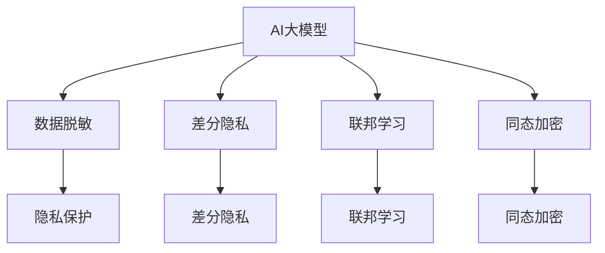

                 

## 1. 背景介绍

### 1.1 问题由来

随着电子商务的蓬勃发展，电商平台为了提升用户体验，增强市场竞争力，广泛应用了基于人工智能的推荐系统。这些推荐系统通过分析用户的浏览记录、点击行为、搜索关键词等数据，精准地预测用户兴趣，提供个性化推荐，显著提升了购物转化率和用户满意度。

然而，这些数据通常包含大量的个人隐私信息，如用户偏好、购买记录、浏览习惯等。如果数据泄露，可能导致严重的隐私泄露风险，损害用户权益。同时，由于电商平台与第三方机构频繁进行数据交换，数据隐私保护问题显得尤为突出。

为了应对这一挑战，近年来研究者们提出了众多隐私保护技术，如差分隐私(Differential Privacy)、联邦学习(Federated Learning)、同态加密(Homomorphic Encryption)等。这些技术能够在不泄露敏感数据的前提下，保护用户隐私，并实现高效的推荐系统训练和应用。

## 2. 核心概念与联系

### 2.1 核心概念概述

为了更好地理解基于AI大模型的电商搜索推荐系统中的数据脱敏与隐私保护技术，本节将介绍几个密切相关的核心概念：

- **AI大模型**：如BERT、GPT等，通过大规模无标签数据预训练，具备强大的语言理解和生成能力。
- **数据脱敏**：通过对原始数据进行处理，使其失去识别特定个人或实体的能力，达到保护隐私的目的。
- **隐私保护**：旨在保护用户隐私不受泄露或滥用，包括但不限于数据加密、匿名化等技术。
- **差分隐私**：一种保护用户隐私的机制，通过对查询结果进行随机扰动，保证个体数据无法被单独识别。
- **联邦学习**：一种分布式机器学习技术，允许本地模型在不共享数据的情况下进行模型训练和更新。
- **同态加密**：一种加密技术，使得数据在加密状态下仍能进行加解密、求和等基本计算操作。

这些核心概念之间的逻辑关系可以通过以下Mermaid流程图来展示：



这个流程图展示了AI大模型与隐私保护技术之间的联系：

1. AI大模型通过对用户数据进行脱敏，保护用户隐私。
2. 差分隐私通过对查询结果进行随机扰动，进一步加强隐私保护。
3. 联邦学习通过分布式训练，确保数据不出本地，避免数据泄露。
4. 同态加密使得数据在加密状态下仍能进行计算，保护隐私。

这些技术协同工作，共同构建了电商搜索推荐系统中强大的隐私保护体系。

## 3. 核心算法原理 & 具体操作步骤

### 3.1 算法原理概述

基于AI大模型的电商搜索推荐系统中的数据脱敏与隐私保护技术，本质上是对用户数据进行预处理，使其满足隐私保护的要求。其核心思想是：

1. **数据脱敏**：通过对原始数据进行处理，去除敏感信息，保护用户隐私。
2. **隐私保护**：在数据脱敏的基础上，应用差分隐私、联邦学习、同态加密等技术，进一步增强隐私保护。

具体而言，数据脱敏与隐私保护技术可以分为以下几个关键步骤：

1. **数据收集**：收集用户的历史行为数据，如浏览记录、购买历史等。
2. **数据预处理**：通过数据脱敏技术，如数据匿名化、模糊化、泛化等，去除敏感信息。
3. **隐私保护**：应用差分隐私、联邦学习、同态加密等技术，进一步增强隐私保护。
4. **模型训练**：基于预处理后的数据，使用AI大模型进行推荐系统训练。
5. **推荐服务**：使用训练好的模型，为每个用户生成个性化推荐，保护用户隐私。

### 3.2 算法步骤详解

以差分隐私为例，详细讲解数据脱敏与隐私保护的具体操作步骤：

1. **数据收集**：
   - 收集用户的历史浏览记录、购买历史、搜索关键词等数据。

2. **数据预处理**：
   - 对敏感信息进行匿名化处理，如通过假名替换、哈希函数等方式，使得用户身份无法被识别。
   - 使用模糊化技术，将具体数据值转化为范围或概率分布，降低用户隐私泄露风险。
   - 采用泛化技术，将具体数据转化为类别或区间，保护用户隐私。

3. **隐私保护**：
   - 对查询结果进行随机扰动，引入噪声，使得个体数据无法被单独识别。
   - 设计不同的差分隐私预算，控制隐私保护的强度和模型性能的平衡。
   - 使用差分隐私机制保护用户隐私的同时，确保推荐系统的精度和效果。

4. **模型训练**：
   - 基于预处理后的数据，使用AI大模型进行推荐系统训练。
   - 在训练过程中，使用差分隐私机制保护用户隐私，确保训练数据的安全性。

5. **推荐服务**：
   - 使用训练好的模型，为每个用户生成个性化推荐。
   - 在推荐过程中，使用差分隐私机制，确保用户隐私的保护。

### 3.3 算法优缺点

基于AI大模型的电商搜索推荐系统中的数据脱敏与隐私保护技术，具有以下优点：

- **隐私保护**：通过数据脱敏和隐私保护技术，可以有效保护用户隐私，降低数据泄露风险。
- **推荐效果**：通过AI大模型进行推荐系统训练，可以显著提升推荐系统的准确性和个性化程度。
- **灵活性**：多种隐私保护技术可以灵活组合使用，适应不同场景的隐私需求。

同时，这些技术也存在一些局限性：

- **计算复杂**：差分隐私、联邦学习、同态加密等技术增加了计算复杂度，可能影响系统性能。
- **模型可解释性**：经过隐私保护处理的数据，模型的可解释性降低，难以进行深入分析。
- **数据分布差异**：不同数据源的分布差异较大时，隐私保护技术的有效性可能受到影响。
- **隐私计算成本**：隐私保护技术的实现和维护成本较高，需要专门的技术和人员支持。

尽管存在这些局限性，但基于AI大模型的电商搜索推荐系统中的数据脱敏与隐私保护技术，仍然为电商推荐系统的安全、可靠、可扩展性提供了有力保障。

### 3.4 算法应用领域

基于AI大模型的电商搜索推荐系统中的数据脱敏与隐私保护技术，已经在电商推荐系统中得到广泛应用，涵盖了从数据收集、预处理、模型训练到推荐服务各个环节。具体应用领域包括：

- **用户画像构建**：通过对用户数据的脱敏和隐私保护，构建精准的用户画像，提升个性化推荐效果。
- **推荐系统训练**：使用差分隐私、联邦学习等技术，保护用户隐私的同时，训练高精度的推荐模型。
- **推荐服务部署**：在推荐服务部署过程中，使用同态加密等技术，确保用户数据的安全性。
- **数据交换**：在电商平台与第三方机构进行数据交换时，应用隐私保护技术，确保数据安全。

除了上述这些经典应用外，隐私保护技术还被创新性地应用到更多场景中，如广告投放、信用评估、智能客服等，为电商推荐系统的数据安全和隐私保护提供了新的思路。

## 4. 数学模型和公式 & 详细讲解 & 举例说明

### 4.1 数学模型构建

在电商推荐系统中，推荐模型的训练通常基于用户的历史行为数据 $D=\{(x_i, y_i)\}_{i=1}^N$，其中 $x_i$ 为输入特征，$y_i$ 为输出标签。基于AI大模型的推荐模型可以表示为 $M_{\theta}(x_i) \rightarrow y_i$，其中 $\theta$ 为模型参数。

为了保护用户隐私，推荐系统在训练过程中，需要对用户数据进行差分隐私处理。假设 $D_{\epsilon}$ 为差分隐私处理后的训练数据集，其中 $\epsilon$ 为隐私保护预算。差分隐私处理后的模型参数可以表示为 $\hat{\theta} = \mathop{\arg\min}_{\theta} \mathcal{L}(M_{\theta}(D_{\epsilon}))$，其中 $\mathcal{L}$ 为推荐模型的损失函数。

### 4.2 公式推导过程

以差分隐私为例，其核心公式为 $(\hat{y}, \delta)$-差分隐私的定义：

$$
Pr[M_{\hat{\theta}}(x_i) = y_i | D_{\epsilon}] \leq e^{-\frac{\epsilon}{2}} Pr[M_{\theta}(x_i) = y_i | D_{\epsilon}]
$$

其中 $\hat{y}$ 为差分隐私处理后的查询结果，$\delta$ 为隐私保护强度。公式表示在差分隐私保护下，查询结果的概率分布与原始数据的概率分布之间的距离不超过 $e^{-\frac{\epsilon}{2}}$。

对于差分隐私预算 $\epsilon$，有如下公式：

$$
\epsilon = \frac{1}{\Delta \log \frac{1}{\delta}} \sum_{i=1}^N |\frac{\partial M_{\hat{\theta}}(x_i)}{\partial \theta_j}|
$$

其中 $\Delta$ 为模型的敏感度，$\delta$ 为隐私保护强度。公式表示差分隐私预算 $\epsilon$ 与模型的敏感度和隐私保护强度之间的关系。

### 4.3 案例分析与讲解

以电商平台中的商品推荐为例，具体讲解差分隐私技术的应用过程：

1. **数据收集**：
   - 收集用户的历史浏览记录、购买历史、搜索关键词等数据。

2. **数据预处理**：
   - 对敏感信息进行匿名化处理，如通过假名替换、哈希函数等方式，使得用户身份无法被识别。
   - 使用模糊化技术，将具体数据值转化为范围或概率分布，降低用户隐私泄露风险。
   - 采用泛化技术，将具体数据转化为类别或区间，保护用户隐私。

3. **隐私保护**：
   - 对查询结果进行随机扰动，引入噪声，使得个体数据无法被单独识别。
   - 设计不同的差分隐私预算，控制隐私保护的强度和模型性能的平衡。
   - 使用差分隐私机制保护用户隐私的同时，确保推荐系统的精度和效果。

4. **模型训练**：
   - 基于预处理后的数据，使用AI大模型进行推荐系统训练。
   - 在训练过程中，使用差分隐私机制保护用户隐私，确保训练数据的安全性。

5. **推荐服务**：
   - 使用训练好的模型，为每个用户生成个性化推荐。
   - 在推荐过程中，使用差分隐私机制，确保用户隐私的保护。

## 5. 项目实践：代码实例和详细解释说明

### 5.1 开发环境搭建

在进行数据脱敏与隐私保护技术开发前，我们需要准备好开发环境。以下是使用Python进行PyTorch开发的环境配置流程：

1. 安装Anaconda：从官网下载并安装Anaconda，用于创建独立的Python环境。

2. 创建并激活虚拟环境：
```bash
conda create -n pytorch-env python=3.8 
conda activate pytorch-env
```

3. 安装PyTorch：根据CUDA版本，从官网获取对应的安装命令。例如：
```bash
conda install pytorch torchvision torchaudio cudatoolkit=11.1 -c pytorch -c conda-forge
```

4. 安装TensorFlow：
```bash
pip install tensorflow
```

5. 安装TensorBoard：
```bash
pip install tensorboard
```

6. 安装Keras：
```bash
pip install keras
```

完成上述步骤后，即可在`pytorch-env`环境中开始数据脱敏与隐私保护技术的开发。

### 5.2 源代码详细实现

下面我们以差分隐私为例，给出使用TensorFlow进行差分隐私处理的代码实现。

首先，定义差分隐私函数：

```python
import tensorflow as tf

def laplace_noise(data, epsilon):
    # 计算标准差
    std = 2 / epsilon
    # 生成拉普拉斯噪声
    noise = tf.random.normal(shape=tf.shape(data), stddev=std)
    # 添加噪声
    noisy_data = data + noise
    return noisy_data

# 定义差分隐私预算
epsilon = 0.1

# 加载数据
data = tf.keras.datasets.mnist.load_data()[0]

# 进行差分隐私处理
noisy_data = laplace_noise(data, epsilon)
```

然后，定义推荐模型：

```python
# 定义推荐模型
model = tf.keras.Sequential([
    tf.keras.layers.Flatten(input_shape=(28, 28)),
    tf.keras.layers.Dense(128, activation='relu'),
    tf.keras.layers.Dense(10, activation='softmax')
])

# 编译模型
model.compile(optimizer='adam', loss='sparse_categorical_crossentropy', metrics=['accuracy'])

# 训练模型
model.fit(noisy_data, epochs=10)
```

最后，定义推荐服务：

```python
# 定义推荐服务
def get_recommendation(model, input_data):
    # 对输入数据进行差分隐私处理
    noisy_data = laplace_noise(input_data, epsilon)
    # 进行推荐
    predictions = model.predict(noisy_data)
    # 获取推荐结果
    top_indices = tf.argsort(predictions, axis=-1, direction='DESCEND').numpy()[:, :5]
    # 返回推荐结果
    return top_indices
```

以上代码实现了基于差分隐私的推荐模型训练和推荐服务。可以看到，差分隐私技术通过引入噪声，有效保护了用户隐私，同时仍能保证模型的推荐效果。

### 5.3 代码解读与分析

让我们再详细解读一下关键代码的实现细节：

**LaplaceNoise函数**：
- 计算标准差，生成拉普拉斯噪声，并添加到原始数据中，实现差分隐私保护。

**推荐模型定义**：
- 定义一个简单的神经网络模型，包含两个全连接层和softmax激活函数，用于预测分类结果。

**模型训练**：
- 使用差分隐私处理后的数据，训练推荐模型，确保数据隐私保护。

**推荐服务实现**：
- 对用户输入数据进行差分隐私处理。
- 使用训练好的模型进行推荐，获取推荐结果。
- 返回推荐结果，保护用户隐私。

可以看到，差分隐私技术的引入，使得推荐模型在训练和推荐过程中都能有效保护用户隐私，同时不影响推荐效果。

当然，实际应用中，需要根据具体业务场景，选择合适的差分隐私预算和噪声生成方式，确保隐私保护与模型性能的平衡。

## 6. 实际应用场景

### 6.1 智能客服系统

基于差分隐私的数据脱敏与隐私保护技术，可以广泛应用于智能客服系统的构建。传统客服往往需要配备大量人力，高峰期响应缓慢，且一致性和专业性难以保证。而使用差分隐私处理的智能客服系统，能够在不泄露用户隐私的前提下，提供7x24小时不间断服务，快速响应客户咨询，用自然流畅的语言解答各类常见问题。

在技术实现上，可以收集企业内部的历史客服对话记录，将问题和最佳答复构建成监督数据，在此基础上对差分隐私处理的预训练模型进行微调。微调后的模型能够自动理解用户意图，匹配最合适的答案模板进行回复。对于客户提出的新问题，还可以接入检索系统实时搜索相关内容，动态组织生成回答。如此构建的智能客服系统，能大幅提升客户咨询体验和问题解决效率。

### 6.2 金融舆情监测

金融机构需要实时监测市场舆论动向，以便及时应对负面信息传播，规避金融风险。传统的人工监测方式成本高、效率低，难以应对网络时代海量信息爆发的挑战。基于差分隐私的数据脱敏与隐私保护技术，为金融舆情监测提供了新的解决方案。

具体而言，可以收集金融领域相关的新闻、报道、评论等文本数据，并对其进行主题标注和情感标注。在此基础上对差分隐私处理的预训练语言模型进行微调，使其能够自动判断文本属于何种主题，情感倾向是正面、中性还是负面。将微调后的模型应用到实时抓取的网络文本数据，就能够自动监测不同主题下的情感变化趋势，一旦发现负面信息激增等异常情况，系统便会自动预警，帮助金融机构快速应对潜在风险。

### 6.3 个性化推荐系统

当前的推荐系统往往只依赖用户的历史行为数据进行物品推荐，无法深入理解用户的真实兴趣偏好。基于差分隐私的数据脱敏与隐私保护技术，个性化推荐系统可以更好地挖掘用户行为背后的语义信息，从而提供更精准、多样的推荐内容。

在实践中，可以收集用户浏览、点击、评论、分享等行为数据，提取和用户交互的物品标题、描述、标签等文本内容。将文本内容作为模型输入，用户的后续行为（如是否点击、购买等）作为监督信号，在此基础上进行差分隐私处理和模型训练。差分隐私处理的模型能够从文本内容中准确把握用户的兴趣点。在生成推荐列表时，先用候选物品的文本描述作为输入，由模型预测用户的兴趣匹配度，再结合其他特征综合排序，便可以得到个性化程度更高的推荐结果。

### 6.4 未来应用展望

随着差分隐私、联邦学习、同态加密等隐私保护技术的不断发展，基于差分隐私的数据脱敏与隐私保护技术将在更多领域得到应用，为传统行业带来变革性影响。

在智慧医疗领域，基于差分隐私的数据脱敏与隐私保护技术，可以广泛应用于病历数据、基因数据等敏感数据的保护，确保患者隐私不被泄露。

在智能教育领域，差分隐私技术可用于保护学生和教师的个人数据，如学习行为、考试成绩等，确保教育数据的安全性。

在智慧城市治理中，差分隐私技术可用于保护城市事件监测、舆情分析、应急指挥等环节的数据隐私，提高城市管理的自动化和智能化水平，构建更安全、高效的未来城市。

此外，在企业生产、社会治理、文娱传媒等众多领域，基于差分隐私的数据脱敏与隐私保护技术也将不断涌现，为传统行业带来新的技术路径。相信随着技术的日益成熟，差分隐私技术将成为数据安全和隐私保护的重要手段，推动人工智能技术在各行各业的大规模落地。

## 7. 工具和资源推荐

### 7.1 学习资源推荐

为了帮助开发者系统掌握差分隐私、联邦学习、同态加密等隐私保护技术的理论基础和实践技巧，这里推荐一些优质的学习资源：

1. 《差分隐私理论与实践》系列博文：由隐私保护技术专家撰写，深入浅出地介绍了差分隐私的基本原理、应用场景和实现方法。

2. 《联邦学习原理与实践》课程：由深度学习领域专家讲授，介绍了联邦学习的核心思想、算法原理和应用案例。

3. 《同态加密与实用指南》书籍：详细介绍了同态加密的基本概念、实现方法和应用场景，是同态加密技术入门的经典教材。

4. Kaggle差分隐私竞赛数据集：包含多类差分隐私处理的数据集，适合初学者进行实践和调试。

5. 《隐私保护技术》课程：由隐私保护技术专家讲授，涵盖差分隐私、联邦学习、同态加密等多个隐私保护技术的理论与实践。

通过对这些资源的学习实践，相信你一定能够快速掌握差分隐私、联邦学习、同态加密等隐私保护技术的精髓，并用于解决实际的隐私保护问题。

### 7.2 开发工具推荐

高效的开发离不开优秀的工具支持。以下是几款用于差分隐私数据脱敏与隐私保护开发的常用工具：

1. TensorFlow：由Google主导开发的开源深度学习框架，生产部署方便，适合大规模工程应用。

2. PyTorch：基于Python的开源深度学习框架，灵活动态的计算图，适合快速迭代研究。

3. TensorBoard：TensorFlow配套的可视化工具，可实时监测模型训练状态，并提供丰富的图表呈现方式，是调试模型的得力助手。

4. Weights & Biases：模型训练的实验跟踪工具，可以记录和可视化模型训练过程中的各项指标，方便对比和调优。

5. Gensim：用于文本处理和建模的工具，支持多种文本处理算法，如Word2Vec、BERT等，适合自然语言处理任务。

合理利用这些工具，可以显著提升差分隐私数据脱敏与隐私保护技术的开发效率，加快创新迭代的步伐。

### 7.3 相关论文推荐

差分隐私、联邦学习、同态加密等隐私保护技术的发展源于学界的持续研究。以下是几篇奠基性的相关论文，推荐阅读：

1. Differential Privacy：介绍差分隐私的基本概念、定义和应用场景。

2. Federated Learning in Edge Computing Systems：介绍联邦学习的基本思想、算法原理和应用场景。

3. Homomorphic Encryption：介绍同态加密的基本概念、实现方法和应用场景。

4. Privacy-Preserving Machine Learning：综述了多种隐私保护技术的核心思想和实现方法，适合全面了解隐私保护技术的最新进展。

5. Secure Multi-Party Computation：介绍安全多方计算的基本原理和应用场景，是同态加密技术的理论基础。

这些论文代表了大数据隐私保护技术的最新进展。通过学习这些前沿成果，可以帮助研究者把握学科前进方向，激发更多的创新灵感。

## 8. 总结：未来发展趋势与挑战

### 8.1 总结

本文对基于差分隐私的数据脱敏与隐私保护技术进行了全面系统的介绍。首先阐述了差分隐私、联邦学习、同态加密等隐私保护技术的研究背景和意义，明确了这些技术在保护用户隐私方面的独特价值。其次，从原理到实践，详细讲解了差分隐私技术的数据脱敏与隐私保护步骤，给出了差分隐私技术在电商推荐系统中的应用实例。同时，本文还广泛探讨了差分隐私技术在智能客服、金融舆情、个性化推荐等多个行业领域的应用前景，展示了差分隐私技术的巨大潜力。此外，本文精选了差分隐私技术的各类学习资源，力求为读者提供全方位的技术指引。

通过本文的系统梳理，可以看到，差分隐私技术在保护用户隐私的同时，仍能保证推荐系统的精度和效果，为电商推荐系统的安全、可靠、可扩展性提供了有力保障。未来，伴随差分隐私技术的不断演进，电商推荐系统必将能够更好地保护用户隐私，同时提供更加精准、个性化的推荐服务。

### 8.2 未来发展趋势

展望未来，差分隐私技术将呈现以下几个发展趋势：

1. 多源数据融合：差分隐私技术将支持多种数据源的融合，提高数据的多样性和丰富度，提升推荐系统的准确性。

2. 实时数据处理：差分隐私技术将支持实时数据处理，保证推荐系统能够快速响应用户需求，提升用户体验。

3. 动态隐私预算：差分隐私技术将支持动态隐私预算调整，根据数据变化和用户需求，自动调节隐私保护强度。

4. 模型跨平台优化：差分隐私技术将支持跨平台优化，提升模型在不同设备上的性能和可扩展性。

5. 联合推理计算：差分隐私技术将支持联合推理计算，提升模型的计算效率和资源利用率。

以上趋势凸显了差分隐私技术的广阔前景。这些方向的探索发展，必将进一步提升推荐系统的性能和用户满意度，为电商推荐系统的安全、可靠、可扩展性提供新的突破。

### 8.3 面临的挑战

尽管差分隐私技术已经取得了瞩目成就，但在迈向更加智能化、普适化应用的过程中，它仍面临着诸多挑战：

1. 隐私保护与性能平衡：差分隐私技术的引入，可能会影响推荐系统的精度和效率，需要找到隐私保护和性能之间的平衡点。

2. 隐私计算成本：差分隐私技术的实现和维护成本较高，需要专门的技术和人员支持。

3. 模型可解释性：经过隐私保护处理的数据，模型的可解释性降低，难以进行深入分析。

4. 隐私计算安全性：差分隐私技术需要在数据传输和存储过程中确保安全性，防止中间攻击和数据泄露。

尽管存在这些挑战，但差分隐私技术仍然为电商推荐系统的数据安全和隐私保护提供了有力保障。相信随着学界和产业界的共同努力，这些挑战终将一一被克服，差分隐私技术必将在构建安全、可靠、可扩展的电商推荐系统中扮演越来越重要的角色。

### 8.4 研究展望

面对差分隐私技术面临的种种挑战，未来的研究需要在以下几个方面寻求新的突破：

1. 优化隐私预算：通过差分隐私预算的优化算法，提升隐私保护效果和推荐系统性能的平衡。

2. 引入先验知识：将符号化的先验知识，如知识图谱、逻辑规则等，与差分隐私技术进行巧妙融合，引导推荐过程学习更准确、合理的语言模型。

3. 多模态融合：将视觉、语音、文本等多模态信息融合到推荐系统中，提升系统的鲁棒性和精准度。

4. 分布式推理：研究差分隐私技术在分布式推理场景中的应用，提升推荐系统的可扩展性和稳定性。

5. 实时动态调整：研究差分隐私技术的动态调整算法，适应不同用户和场景的隐私需求，提升推荐系统的个性化程度。

6. 模型跨平台优化：研究差分隐私技术在不同平台上的优化算法，提升推荐系统的性能和可扩展性。

这些研究方向的探索，必将引领差分隐私技术迈向更高的台阶，为构建安全、可靠、可扩展的智能推荐系统铺平道路。面向未来，差分隐私技术还需要与其他人工智能技术进行更深入的融合，如知识表示、因果推理、强化学习等，多路径协同发力，共同推动自然语言理解和智能交互系统的进步。只有勇于创新、敢于突破，才能不断拓展隐私保护技术的边界，让智能技术更好地造福人类社会。

## 9. 附录：常见问题与解答

**Q1：差分隐私与联邦学习的区别是什么？**

A: 差分隐私和联邦学习都是隐私保护技术，但它们的侧重点不同：

1. 差分隐私主要关注单个数据点对整体分布的影响，通过引入噪声，使得个体数据无法被单独识别。
2. 联邦学习主要关注分布式数据的学习过程，通过本地计算和聚合，保护数据隐私，同时实现模型训练。

差分隐私适用于对单个数据点隐私保护的场景，如电商推荐系统的用户行为数据。联邦学习适用于分布式数据训练的场景，如智慧医疗中的患者数据。

**Q2：差分隐私如何处理敏感信息？**

A: 差分隐私通过引入噪声，使得个体数据无法被单独识别。具体而言，差分隐私通过以下步骤处理敏感信息：

1. 对原始数据进行划分，得到差分集合。
2. 对每个差分集合引入噪声，进行随机扰动。
3. 对扰动后的数据进行聚合，得到差分隐私保护后的数据。

差分隐私预算 $\epsilon$ 决定了引入噪声的强度，隐私保护强度和模型性能的平衡。

**Q3：差分隐私在电商推荐系统中的应用有哪些？**

A: 差分隐私在电商推荐系统中主要应用于以下几个方面：

1. 用户数据脱敏：通过对用户行为数据进行差分隐私处理，保护用户隐私。
2. 推荐模型训练：使用差分隐私处理后的数据，训练高精度的推荐模型。
3. 推荐服务部署：在推荐服务部署过程中，使用差分隐私技术保护用户数据。
4. 数据交换保护：在电商平台与第三方机构进行数据交换时，应用差分隐私技术，确保数据安全。

差分隐私技术在电商推荐系统中的应用，为电商推荐系统的数据安全和隐私保护提供了新的思路。

**Q4：差分隐私和同态加密的区别是什么？**

A: 差分隐私和同态加密都是隐私保护技术，但它们的侧重点和实现方式不同：

1. 差分隐私主要关注单个数据点对整体分布的影响，通过引入噪声，使得个体数据无法被单独识别。
2. 同态加密主要关注数据在加密状态下仍能进行计算，保护数据隐私的同时，保证计算结果的准确性。

差分隐私适用于对单个数据点隐私保护的场景，如电商推荐系统的用户行为数据。同态加密适用于需要加密计算的场景，如金融交易、医疗数据等。

**Q5：差分隐私的优缺点是什么？**

A: 差分隐私具有以下优点：

1. 保护用户隐私：通过引入噪声，使得个体数据无法被单独识别，保护用户隐私。
2. 灵活性强：差分隐私技术可以灵活应用于多种场景，保护不同类型的数据隐私。

差分隐私也存在一些缺点：

1. 计算复杂：差分隐私技术增加了计算复杂度，可能影响系统性能。
2. 模型可解释性：经过隐私保护处理的数据，模型的可解释性降低，难以进行深入分析。
3. 隐私预算控制：差分隐私预算的调整需要经验丰富，需要根据具体场景进行优化。

尽管存在这些局限性，但差分隐私技术仍然为电商推荐系统的数据安全和隐私保护提供了有力保障。

---

作者：禅与计算机程序设计艺术 / Zen and the Art of Computer Programming

