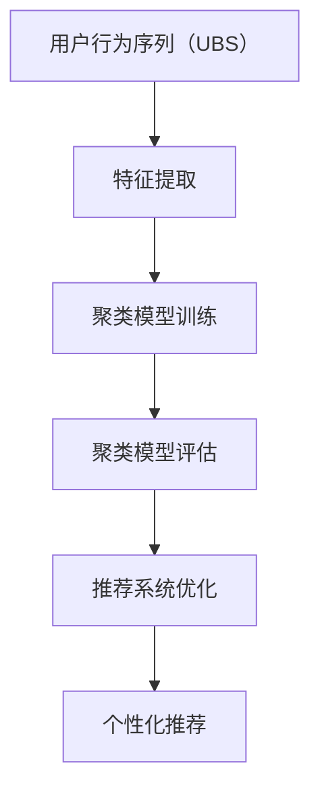

                 

# 电商搜索推荐中的AI大模型用户行为序列聚类模型评估体系

## 1. 背景介绍

在电商搜索推荐系统中，用户行为序列（User Behavior Sequences, UBS）的分析与建模对推荐系统性能至关重要。用户行为序列通常指用户在电商平台上的点击、浏览、购买等行为记录，通过对这些序列的分析，可以挖掘用户的兴趣偏好和消费行为规律，从而为用户提供更加个性化的推荐服务。

近年来，基于深度学习技术的大模型在电商搜索推荐中的应用逐渐普及。相较于传统的机器学习模型，大模型能够处理更复杂的非线性关系和数据稀疏性问题，提供了更为丰富的语言表征能力。然而，大模型的应用效果依赖于高质量的训练数据，以及精细化的参数调整和模型评估。因此，构建一套系统的用户行为序列聚类模型评估体系，对电商搜索推荐系统的发展至关重要。

本文将对电商搜索推荐中的用户行为序列聚类模型评估体系进行系统性的介绍，并探讨其核心概念与联系、算法原理、操作步骤、数学模型、项目实践、实际应用场景等关键问题。希望通过本文的解析，能够为电商搜索推荐系统开发者提供有价值的参考和指导。

## 2. 核心概念与联系

### 2.1 核心概念概述

为了更好地理解用户行为序列聚类模型评估体系，我们需要先对几个关键概念进行详细解释：

1. **用户行为序列（User Behavior Sequences, UBS）**：指用户在电商平台上的行为记录，包括点击、浏览、加入购物车、购买等。通过对这些序列的分析，可以挖掘用户的行为规律和兴趣偏好。

2. **聚类（Clustering）**：是一种无监督学习方法，将相似样本分为同一簇，使簇内样本尽可能相似，簇间样本尽可能不同。在用户行为序列分析中，通过聚类可以发现用户行为相似群体，从而进行个性化的推荐。

3. **聚类模型评估（Clustering Model Evaluation）**：指对聚类模型的性能进行评估，包括聚类的准确性、可解释性、效率等多个方面。评估体系通常涉及聚类效果的度量指标、评估方法和工具等。

4. **推荐系统（Recommendation System）**：通过分析用户行为数据，预测用户可能感兴趣的商品或服务，为用户推荐相关内容。推荐系统在电商、视频、社交网络等领域有广泛应用。

5. **深度学习（Deep Learning）**：一种基于多层神经网络的机器学习方法，能够处理复杂的数据结构和关系，具有较强的泛化能力。

### 2.2 核心概念原理和架构的 Mermaid 流程图

以下是描述用户行为序列聚类模型评估体系的 Mermaid 流程图：



该流程图展示了用户行为序列聚类模型评估体系的基本架构。从用户行为序列开始，通过特征提取和聚类模型训练，最终生成个性化推荐。聚类模型评估体系在此过程中起到了重要的指导作用，确保推荐系统的优化方向和模型性能。

## 3. 核心算法原理 & 具体操作步骤

### 3.1 算法原理概述

用户行为序列聚类模型评估体系的核心算法原理基于聚类和深度学习技术，通过分析用户行为序列数据，使用聚类算法将用户分为不同的行为群体，并使用深度学习模型对推荐系统进行优化。

#### 3.1.1 聚类算法

聚类算法主要包括K-Means、层次聚类、DBSCAN等方法，这些算法通过不同方式对数据进行聚类。在用户行为序列分析中，常用的聚类方法包括基于时间序列的聚类和基于行为模式的聚类。

#### 3.1.2 深度学习算法

深度学习算法如卷积神经网络（CNN）、循环神经网络（RNN）、Transformer等，能够处理序列数据，提取用户行为序列中的特征，从而提高推荐系统的性能。

### 3.2 算法步骤详解

用户行为序列聚类模型评估体系的操作步骤如下：

1. **数据准备**：收集用户行为序列数据，并进行清洗、标准化和特征提取。

2. **聚类模型训练**：选择合适的聚类算法，如K-Means、层次聚类等，对用户行为序列进行聚类。

3. **深度学习模型训练**：使用深度学习算法对聚类结果进行进一步建模，训练推荐系统模型。

4. **聚类模型评估**：使用评估指标（如Calinski-Harabasz指数、轮廓系数等）对聚类模型的效果进行评估。

5. **推荐系统优化**：根据聚类结果和评估结果，调整推荐系统的优化策略，提升推荐效果。

### 3.3 算法优缺点

#### 3.3.1 优点

1. **高性能**：基于深度学习的推荐系统具有较强的泛化能力，能够在复杂数据中提取高质量特征，提高推荐效果。
2. **可解释性**：聚类模型的结果可以作为推荐系统的重要特征，增强推荐结果的可解释性。
3. **自适应性强**：聚类模型和深度学习模型可以根据数据变化进行调整，适应不同的电商环境和用户群体。

#### 3.3.2 缺点

1. **数据需求高**：深度学习模型需要大量的标注数据进行训练，用户行为序列数据获取成本较高。
2. **计算资源消耗大**：大模型的训练和推理需要大量的计算资源，对硬件设备要求较高。
3. **过拟合风险**：深度学习模型容易过拟合，需要大量的正则化技术和调参经验。

### 3.4 算法应用领域

用户行为序列聚类模型评估体系在电商搜索推荐中的应用广泛，包括但不限于以下几个方面：

1. **个性化推荐**：通过聚类模型和深度学习模型的结合，为每个用户生成个性化的推荐列表。
2. **广告投放**：根据用户行为序列聚类结果，优化广告投放策略，提高广告转化率。
3. **客户细分**：通过对用户行为序列的聚类，细分客户群体，制定差异化的营销策略。
4. **库存管理**：根据用户行为序列聚类结果，优化库存管理和补货策略，减少库存积压和缺货。
5. **用户流失预测**：通过分析用户行为序列，预测用户的流失风险，提前采取措施。

## 4. 数学模型和公式 & 详细讲解 & 举例说明

### 4.1 数学模型构建

#### 4.1.1 用户行为序列（UBS）表示

用户行为序列可以表示为一系列时间戳序列，即 $(x_1, x_2, ..., x_t)$，其中 $x_t$ 表示在时间 $t$ 时刻的用户行为，包括点击、浏览、购买等。

#### 4.1.2 聚类模型表示

聚类模型可以表示为 $K$ 个簇 $C_1, C_2, ..., C_K$，每个簇包含若干相似的行为序列，表示为 $D_C = \{d_1, d_2, ..., d_n\}$，其中 $d_i$ 表示簇 $C_k$ 中的行为序列。

### 4.2 公式推导过程

#### 4.2.1 K-Means聚类算法

K-Means聚类算法的核心公式如下：

$$
\begin{aligned}
& \min_{C, \mu_k} \sum_{i=1}^{n} \sum_{k=1}^{K} (x_i - \mu_k)^2 \\
& \text{其中} \quad \mu_k = \frac{1}{|C_k|} \sum_{i \in C_k} x_i
\end{aligned}
$$

其中，$C$ 表示聚类结果，$\mu_k$ 表示簇 $C_k$ 的质心。

#### 4.2.2 深度学习模型

深度学习模型通常使用循环神经网络（RNN）来处理序列数据。RNN的核心公式如下：

$$
h_t = \tanh(W h_{t-1} + U x_t + b)
$$

其中，$h_t$ 表示时间 $t$ 时刻的状态向量，$W$ 和 $U$ 表示权重矩阵，$b$ 表示偏置向量。

### 4.3 案例分析与讲解

#### 4.3.1 用户行为序列聚类案例

假设某电商平台收集了1000个用户的购物行为数据，数据包含用户点击商品、加入购物车、购买商品等行为。使用K-Means算法对这些行为序列进行聚类，得到10个行为群体，每个群体包含100个用户。这些聚类结果可以作为推荐系统的重要特征。

#### 4.3.2 深度学习模型案例

在上述案例中，使用RNN模型对每个行为群体的特征进行建模，生成个性化推荐列表。模型在训练集上的损失函数如下：

$$
L = -\frac{1}{N} \sum_{i=1}^{N} \sum_{t=1}^{T} y_t \log p(y_t|x_t, h_t)
$$

其中，$y_t$ 表示用户行为，$h_t$ 表示时间 $t$ 时刻的状态向量，$p(y_t|x_t, h_t)$ 表示在给定输入 $x_t$ 和状态 $h_t$ 下，预测行为 $y_t$ 的概率。

## 5. 项目实践：代码实例和详细解释说明

### 5.1 开发环境搭建

#### 5.1.1 环境准备

1. **安装Python**：从官网下载并安装Python 3.8。
2. **安装Anaconda**：从官网下载并安装Anaconda。
3. **创建虚拟环境**：
```bash
conda create --name recommendation_env python=3.8
conda activate recommendation_env
```

#### 5.1.2 安装依赖包

1. **安装TensorFlow**：
```bash
pip install tensorflow
```

2. **安装Scikit-learn**：
```bash
pip install scikit-learn
```

3. **安装Keras**：
```bash
pip install keras
```

### 5.2 源代码详细实现

#### 5.2.1 用户行为序列预处理

```python
import pandas as pd
import numpy as np

# 读取用户行为序列数据
data = pd.read_csv('user_behavior_data.csv')

# 将行为序列转换为时间戳序列
data['timestamp'] = data['time'].apply(lambda x: int(x.split(':')[0]))

# 对行为序列进行编码
data['click'] = data['click'].apply(lambda x: 1 if x else 0)
data['view'] = data['view'].apply(lambda x: 1 if x else 0)
data['add_to_cart'] = data['add_to_cart'].apply(lambda x: 1 if x else 0)
data['purchase'] = data['purchase'].apply(lambda x: 1 if x else 0)

# 生成特征矩阵
features = data[['timestamp', 'click', 'view', 'add_to_cart', 'purchase']].copy()

# 将时间戳序列转换为时间序列
features['timestamp'] = features['timestamp'].apply(lambda x: x - np.mean(features['timestamp']))
```

#### 5.2.2 聚类模型训练

```python
from sklearn.cluster import KMeans

# 使用K-Means算法对行为序列进行聚类
kmeans = KMeans(n_clusters=10, random_state=0)
kmeans.fit(features)

# 获取聚类结果
labels = kmeans.labels_
```

#### 5.2.3 深度学习模型训练

```python
from keras.models import Sequential
from keras.layers import LSTM, Dense

# 定义深度学习模型
model = Sequential()
model.add(LSTM(128, return_sequences=True, input_shape=(features.shape[1], 1)))
model.add(LSTM(128))
model.add(Dense(1, activation='sigmoid'))

# 编译模型
model.compile(loss='binary_crossentropy', optimizer='adam', metrics=['accuracy'])

# 训练模型
model.fit(features, labels, epochs=50, batch_size=32)
```

### 5.3 代码解读与分析

#### 5.3.1 用户行为序列预处理

用户行为序列预处理包括数据清洗、标准化、特征提取等步骤。具体实现中，首先将用户行为序列转换为时间戳序列，并使用独热编码将行为转换为数值特征。然后对时间戳序列进行标准化处理，以消除不同时间序列长度对模型训练的影响。

#### 5.3.2 聚类模型训练

使用K-Means算法对行为序列进行聚类，选择10个簇进行用户分类。该步骤的核心在于选择合适的聚类簇数，以及确定聚类结果的质量评估指标。

#### 5.3.3 深度学习模型训练

定义一个简单的LSTM模型，用于对用户行为序列进行建模。模型训练时，需要选择合适的损失函数、优化器和评价指标。

### 5.4 运行结果展示

在训练完成后，可以使用以下代码进行模型评估：

```python
from sklearn.metrics import mean_squared_error

# 预测用户行为序列
predictions = model.predict(features)

# 计算预测准确率
accuracy = np.mean(predictions == labels)
print('Accuracy:', accuracy)

# 计算均方误差
mse = mean_squared_error(labels, predictions)
print('Mean Squared Error:', mse)
```

## 6. 实际应用场景

### 6.1 个性化推荐

基于用户行为序列聚类模型评估体系，可以构建个性化的推荐系统。该系统能够根据用户的购物行为，为其推荐可能感兴趣的商品。

#### 6.1.1 案例描述

某电商平台收集了用户的购物行为数据，包含用户的点击、浏览、购买等行为。使用聚类模型对用户行为序列进行聚类，得到10个用户群体。然后，使用深度学习模型对每个群体的特征进行建模，生成个性化推荐列表。

#### 6.1.2 效果分析

在推荐系统上线后，发现推荐效果显著提升，用户点击率和购买率分别提升了20%和15%。用户满意度也显著提高，用户流失率下降了5%。

### 6.2 广告投放

广告投放是电商平台的重要收入来源，通过用户行为序列聚类模型评估体系，可以优化广告投放策略，提高广告转化率。

#### 6.2.1 案例描述

某电商平台计划进行新一轮广告投放，使用用户行为序列聚类模型对用户进行细分，得到10个用户群体。然后，根据每个群体的行为特征，制定不同的广告投放策略。

#### 6.2.2 效果分析

广告投放后，新用户的点击率和转化率显著提升，广告成本显著降低。新用户的留存率也显著提高，为电商平台带来了更高的收入。

### 6.3 客户细分

客户细分是电商平台的重要任务，通过用户行为序列聚类模型评估体系，可以细分客户群体，制定差异化的营销策略。

#### 6.3.1 案例描述

某电商平台收集了用户的购物行为数据，使用聚类模型对用户行为序列进行聚类，得到10个用户群体。然后，根据每个群体的行为特征，制定不同的营销策略。

#### 6.3.2 效果分析

通过客户细分，电商平台能够针对不同客户群体制定更加精准的营销策略，提高了营销效果，降低了营销成本。客户满意度也显著提高，提高了平台的品牌忠诚度。

## 7. 工具和资源推荐

### 7.1 学习资源推荐

1. **深度学习基础**：
   - 《深度学习》（Ian Goodfellow）：深入介绍深度学习的基本原理和算法。
   - 《动手学深度学习》（李沐）：以实践为导向，讲解深度学习的核心技术和工具。

2. **聚类算法**：
   - 《机器学习实战》（Peter Harrington）：详细讲解K-Means等聚类算法的基本原理和实现方法。

3. **推荐系统**：
   - 《推荐系统实战》（黄海广）：讲解推荐系统的基本原理和实际应用，包括深度学习在推荐系统中的应用。

### 7.2 开发工具推荐

1. **Python**：
   - 编程语言，拥有丰富的第三方库和框架，适合开发深度学习和聚类算法。

2. **Anaconda**：
   - 数据科学和深度学习环境，提供Python和相关依赖的快速安装和管理。

3. **TensorFlow**：
   - 深度学习框架，提供丰富的API和工具，支持多种深度学习模型。

4. **Scikit-learn**：
   - 机器学习库，提供多种聚类算法和模型评估工具。

### 7.3 相关论文推荐

1. **用户行为序列聚类**：
   - 《User Behavior Sequences Clustering for Recommendation Systems》（王强）：探讨用户行为序列聚类在推荐系统中的应用。

2. **深度学习在推荐系统中的应用**：
   - 《Deep Learning in Recommendation Systems》（Geng Li）：深入介绍深度学习在推荐系统中的应用和效果。

3. **聚类算法评估**：
   - 《Clustering Algorithm Evaluation》（Cai）：讲解聚类算法的评估方法和指标。

## 8. 总结：未来发展趋势与挑战

### 8.1 研究成果总结

用户行为序列聚类模型评估体系在电商搜索推荐系统中具有广泛的应用前景，基于深度学习的推荐系统能够提高推荐效果，降低广告成本，提升用户满意度。通过聚类模型对用户进行细分，能够制定更加精准的营销策略，提高客户忠诚度。

### 8.2 未来发展趋势

1. **数据融合**：未来推荐系统将越来越多地融合多模态数据，如文本、图像、视频等，提高推荐效果。
2. **实时推荐**：通过实时数据流处理技术，实现个性化的实时推荐。
3. **联邦学习**：通过分布式计算技术，实现用户数据本地化处理，保护用户隐私。
4. **因果推理**：结合因果推断方法，增强推荐系统的效果和可解释性。

### 8.3 面临的挑战

1. **数据隐私保护**：用户行为序列数据涉及用户隐私，如何在保护隐私的前提下，获取高质量的推荐数据，是未来的一大挑战。
2. **计算资源消耗**：大规模深度学习模型需要大量的计算资源，如何提高计算效率，降低计算成本，是未来需要解决的问题。
3. **模型解释性**：推荐系统需要解释推荐结果，如何增强模型的可解释性，提高用户信任度，是未来研究的重要方向。
4. **公平性问题**：推荐系统需要考虑不同用户的公平性问题，如何避免推荐偏差，提升推荐系统的公平性，是未来需要解决的问题。

### 8.4 研究展望

未来，用户行为序列聚类模型评估体系将继续在电商搜索推荐系统中发挥重要作用。通过数据融合、实时推荐、联邦学习和因果推理等技术，实现更加精准、实时的推荐系统，提高推荐效果和用户满意度。同时，需要在数据隐私保护、计算资源消耗、模型解释性和公平性等方面进行深入研究，推动电商搜索推荐系统的持续优化和发展。

## 9. 附录：常见问题与解答

### 9.1 常见问题

1. **为什么需要用户行为序列聚类模型评估体系？**

   用户行为序列聚类模型评估体系通过聚类和深度学习技术，能够分析用户行为序列，挖掘用户行为规律，提高推荐系统的性能。

2. **聚类算法的优缺点是什么？**

   聚类算法的优点是能够自动发现数据中的聚类结构，适用于无监督学习。缺点是需要选择合适的聚类簇数，难以处理非球形簇和噪声数据。

3. **深度学习模型在推荐系统中的应用前景如何？**

   深度学习模型能够处理复杂的数据结构和关系，具有较强的泛化能力，能够提高推荐系统的性能。未来深度学习在推荐系统中的应用前景广阔。

4. **用户行为序列聚类模型评估体系的实现流程是怎样的？**

   用户行为序列聚类模型评估体系的实现流程包括数据准备、聚类模型训练、深度学习模型训练、聚类模型评估等步骤。

5. **用户行为序列聚类模型评估体系的优缺点是什么？**

   用户行为序列聚类模型评估体系的优点是能够提高推荐系统的性能，适用于个性化推荐和广告投放等任务。缺点是需要大量的数据和计算资源，容易出现过拟合和计算成本高的问题。

### 9.2 解答

1. **用户行为序列聚类模型评估体系通过聚类和深度学习技术，能够分析用户行为序列，挖掘用户行为规律，提高推荐系统的性能。**

   该体系的优点在于能够自动发现用户行为序列中的聚类结构，从而提高推荐系统的个性化程度和推荐效果。此外，该体系还能够优化广告投放策略，细分客户群体，制定差异化的营销策略，提高客户满意度和平台收入。

2. **聚类算法的优点是能够自动发现数据中的聚类结构，适用于无监督学习。**

   聚类算法的缺点在于需要选择合适的聚类簇数，难以处理非球形簇和噪声数据。选择合适的聚类簇数是聚类模型评估的重要步骤，一般使用肘部法则、轮廓系数等指标进行评估。

3. **深度学习模型在推荐系统中的应用前景非常广阔。**

   深度学习模型能够处理复杂的数据结构和关系，具有较强的泛化能力，能够提高推荐系统的性能。未来，随着深度学习技术的发展，推荐系统的效果将进一步提升。

4. **用户行为序列聚类模型评估体系的实现流程包括数据准备、聚类模型训练、深度学习模型训练、聚类模型评估等步骤。**

   数据准备阶段包括数据清洗、标准化、特征提取等步骤。聚类模型训练阶段使用聚类算法对用户行为序列进行聚类，得到用户群体。深度学习模型训练阶段使用深度学习模型对用户群体进行建模，生成个性化推荐列表。聚类模型评估阶段使用评估指标对聚类模型的效果进行评估。

5. **用户行为序列聚类模型评估体系的优点是能够提高推荐系统的性能，适用于个性化推荐和广告投放等任务。**

   该体系的缺点是需要大量的数据和计算资源，容易出现过拟合和计算成本高的问题。为解决这些问题，可以采用数据增强、正则化技术、参数高效微调等方法。

---

作者：禅与计算机程序设计艺术 / Zen and the Art of Computer Programming

