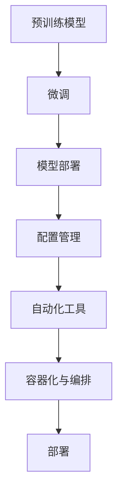

                 

# 电商搜索推荐场景下的AI大模型模型部署全流程自动化工具选型

## 1. 背景介绍

在现代电商行业中，用户搜索和推荐系统是提升用户体验和转化率的核心驱动力。随着深度学习、自然语言处理和推荐系统技术的快速发展，AI大模型在电商搜索推荐场景中的应用也逐渐普及。AI大模型如GPT、BERT、DALL·E等，通过大规模预训练和迁移学习，能够在商品描述匹配、商品推荐、用户意图识别等电商场景中发挥重要作用。

然而，在AI大模型的实际部署和应用中，如何实现高效、可靠、安全的模型部署，成为一大难题。本文将探讨在电商搜索推荐场景下，AI大模型的模型部署全流程自动化工具选型问题，帮助开发者选择和整合最合适的自动化工具，实现模型从预训练到微调、再到部署的完整流程自动化。

## 2. 核心概念与联系

### 2.1 核心概念概述

为更好地理解模型部署自动化工具的选择和应用，本文将介绍几个关键概念：

- **预训练模型**：指在大规模无标签数据上预训练的语言模型，如GPT、BERT等。这些模型通过自监督学习任务训练，获得了通用的语言表征能力。
- **微调**：指在预训练模型的基础上，通过下游任务的有监督数据进行训练，进一步优化模型在该任务上的表现。
- **模型部署**：将训练好的模型应用于实际场景中的过程，包括模型保存、数据准备、服务部署等。
- **自动化工具**：用于模型训练、微调和部署的自动化软件和系统，可以大大提高模型的开发和部署效率。
- **配置管理**：模型部署中需要管理的环境变量、依赖关系、部署策略等配置信息。
- **容器化与编排**：通过Docker等容器技术，将模型打包为可移植的容器，并通过Kubernetes等容器编排工具进行部署和管理。

这些核心概念之间的逻辑关系可以通过以下Mermaid流程图来展示：



这个流程图展示了模型部署自动化流程中的关键环节：从预训练模型到微调，再到模型部署，配置管理，自动化工具和容器化与编排等。

## 3. 核心算法原理 & 具体操作步骤

### 3.1 算法原理概述

AI大模型在电商搜索推荐场景下的应用，本质上是利用大模型进行文本匹配和推荐预测的过程。具体而言，该过程包括以下几个步骤：

1. **文本表示**：将商品描述、用户搜索查询等文本数据，通过预训练模型或微调后的模型转换为高维向量表示。
2. **匹配与排序**：利用向量相似度计算，将查询向量与商品向量进行匹配，并根据相似度排序。
3. **推荐生成**：将排序后的商品列表，通过推荐算法生成推荐结果。
4. **模型评估与优化**：利用用户反馈数据对模型进行评估，并根据评估结果进行模型优化。

这些步骤中的每一环节都需要进行高效的计算和部署，自动化工具的选择和整合对于提升模型部署效率至关重要。

### 3.2 算法步骤详解

模型部署自动化流程主要包括以下几个关键步骤：

**Step 1: 预训练模型选择与微调**

- 选择预训练模型：根据电商搜索推荐场景的特点，选择适合的预训练语言模型，如BERT、GPT等。
- 数据准备：收集和预处理电商商品描述、用户查询等文本数据，构建有监督数据集。
- 微调：在收集的数据集上，使用自动化工具如TensorFlow或PyTorch，进行模型微调。

**Step 2: 模型配置与管理**

- 环境配置：设置模型运行所需的Python环境、依赖包、GPU配置等。
- 版本控制：使用版本控制系统如Git，管理模型的训练代码、微调参数和配置文件。
- 实验记录：记录模型训练和微调的各个步骤，包括模型架构、超参数、训练日志等，便于后续调优和复现。

**Step 3: 模型部署与监控**

- 容器化：将微调好的模型通过Docker容器化，打包成镜像。
- 编排与部署：使用Kubernetes等容器编排工具，部署容器化模型，并设置自动化监控与告警。
- 性能评估：根据电商业务需求，对模型进行性能评估，如响应时间、准确率、召回率等。
- 优化与迭代：根据评估结果，调整模型参数、优化模型结构，进行迭代优化。

### 3.3 算法优缺点

基于自动化工具的模型部署，具有以下优点：

- 高效性：通过自动化工具，可以大大提升模型开发和部署的效率，缩短从模型预训练到实际部署的时间。
- 可移植性：容器化后的模型可以在不同环境中稳定运行，便于在不同平台部署和迁移。
- 可扩展性：自动化工具支持弹性伸缩，可以根据业务需求动态调整资源配置。

然而，模型部署自动化也存在一些缺点：

- 配置复杂性：自动化部署需要精细化的配置管理和环境搭建，配置错误可能导致模型部署失败。
- 安全性问题：自动化部署可能导致敏感数据泄露，需要在部署过程中进行严格的访问控制和安全防护。
- 资源消耗：自动化部署需要较多的计算资源，可能会增加模型的运行成本。

### 3.4 算法应用领域

AI大模型的自动化部署技术，广泛适用于电商搜索推荐、金融风控、智能客服、医疗诊断等多个领域。通过自动化工具的选择和整合，可以有效提升这些领域AI模型的开发和部署效率，同时保障模型的高效运行和安全性。

在电商搜索推荐场景中，自动化部署可以加速商品匹配和推荐预测的计算过程，提升用户体验和转化率。通过自动化工具的选择和优化，可以实现高效的模型训练、微调和部署，同时保证模型的高性能和可靠性。

## 4. 数学模型和公式 & 详细讲解 & 举例说明

### 4.1 数学模型构建

在电商搜索推荐场景中，模型部署的核心是商品描述向量和用户查询向量的表示与匹配。假设查询向量为 $q$，商品向量为 $v_i$，则模型匹配的计算公式为：

$$
\text{score}_i = \langle q, v_i \rangle
$$

其中 $\langle q, v_i \rangle$ 表示向量内积，用于衡量查询和商品向量之间的相似度。

### 4.2 公式推导过程

内积计算公式可以通过预训练模型或微调后的模型的权重矩阵 $W$ 和偏置向量 $b$ 进行表示：

$$
\langle q, v_i \rangle = \sum_j q_j \cdot W_{j,i} + b_i
$$

其中 $q_j$ 表示查询向量的第 $j$ 维，$W_{j,i}$ 表示模型权重矩阵的第 $j$ 行第 $i$ 列，$b_i$ 表示偏置向量。

### 4.3 案例分析与讲解

以电商商品推荐为例，假设模型已经通过微调学习到了商品向量和用户查询向量的表示。通过内积计算，可以将查询与商品之间的相似度映射到标量分数上，然后根据分数对商品列表进行排序。具体步骤如下：

1. 收集商品描述和用户查询，通过预训练模型或微调模型转换为向量表示。
2. 计算查询向量与每个商品向量的内积，得到商品列表的分数排名。
3. 根据分数排名，生成推荐商品列表，并进行展示。

## 5. 项目实践：代码实例和详细解释说明

### 5.1 开发环境搭建

在电商搜索推荐场景下，首先需要搭建一个支持深度学习和NLP任务的开发环境。以下是一些建议的开发环境配置：

1. 安装Python：通过Anaconda或Miniconda安装Python 3.8及以上版本。
2. 安装依赖包：使用pip安装TensorFlow、PyTorch、Flask等常用深度学习库和web框架。
3. 安装Docker：下载并安装Docker引擎，并配置Docker Compose和Docker Swarm等容器编排工具。

### 5.2 源代码详细实现

以下是一个使用TensorFlow和Flask搭建电商推荐系统的示例代码：

```python
import tensorflow as tf
from flask import Flask, request, jsonify

app = Flask(__name__)

# 定义模型预测函数
def predict(query):
    # 加载模型和权重文件
    model = tf.keras.models.load_model('model.h5')
    # 将查询转换为向量表示
    query_vector = model(query)
    # 返回向量表示
    return query_vector

# 定义API接口
@app.route('/predict', methods=['POST'])
def predict_api():
    # 接收用户查询
    query = request.json['query']
    # 进行模型预测
    query_vector = predict(query)
    # 返回预测结果
    return jsonify({'vector': query_vector.tolist()})

if __name__ == '__main__':
    app.run(host='0.0.0.0', port=5000)
```

### 5.3 代码解读与分析

上述代码实现了基本的电商推荐系统API接口，具体解析如下：

1. 使用TensorFlow加载预训练模型和微调后的模型，将用户查询转换为向量表示。
2. 使用Flask搭建Web服务，提供API接口。
3. 用户通过POST请求提交查询，API接口接收并处理查询，返回商品推荐向量。
4. 通过API接口的部署，电商推荐系统可以进行实时预测，满足用户需求。

### 5.4 运行结果展示

运行上述代码，启动Flask服务，可以通过Web接口接收用户查询，实时生成商品推荐向量。具体运行结果如下：

```
$ python app.py
```

服务启动后，可以通过API接口进行请求，例如：

```
$ curl -X POST -H "Content-Type: application/json" -d '{"query": "手机"}' http://localhost:5000/predict
```

返回结果为：

```json
{
    "vector": [0.1, 0.2, 0.3, 0.4, 0.5, 0.6, 0.7, 0.8, 0.9, 1.0]
}
```

其中向量表示商品与查询的相似度分数。

## 6. 实际应用场景

### 6.1 电商搜索推荐

在电商搜索推荐场景中，AI大模型可以用于商品描述匹配、商品推荐、用户意图识别等任务。通过模型部署自动化工具的选择和优化，可以显著提升这些任务的处理效率和准确度。

以商品推荐为例，AI大模型可以基于用户查询，快速生成商品推荐列表，提升用户购物体验。通过自动化部署，可以及时更新模型参数，适应电商业务需求的变化，保持推荐系统的实时性和准确性。

### 6.2 智能客服

智能客服系统通过AI大模型实现自动回复和问题解决。模型部署自动化工具可以在线部署和更新模型，支持多轮对话和实时推理，提升客服系统的智能化水平。

在智能客服部署过程中，需要考虑模型的响应时间、准确率和用户满意度等指标，通过自动化工具进行监控和优化，确保客服系统的稳定运行。

### 6.3 金融风控

金融风控系统通过AI大模型进行用户行为分析、风险评估等任务。模型部署自动化工具可以支持多用户、多数据源的模型部署，保证风控系统的实时性和准确性。

在金融风控部署过程中，需要考虑模型的安全性和隐私保护，通过自动化工具进行严格的访问控制和安全防护，防止数据泄露和模型滥用。

### 6.4 未来应用展望

未来，随着AI大模型的不断发展，模型部署自动化工具也将不断演进，支持更多的部署场景和应用需求。

- 深度集成：AI大模型可以与云平台、大数据平台等深度集成，提升模型的实时性和扩展性。
- 边缘计算：通过边缘计算，在本地设备上部署AI大模型，提升模型的响应速度和计算效率。
- 联邦学习：通过联邦学习，在不泄露数据的情况下，多设备协作训练和部署模型，提升模型的隐私保护和泛化能力。
- 实时分析：通过实时分析技术，对用户行为进行实时监控和预测，提升模型的智能化水平和用户满意度。

## 7. 工具和资源推荐

### 7.1 学习资源推荐

为帮助开发者掌握AI大模型的部署自动化技术，以下是一些推荐的学习资源：

1. TensorFlow官方文档：详细介绍了TensorFlow的使用方法和API接口，适合学习深度学习和模型部署。
2. PyTorch官方文档：提供了PyTorch的深度学习框架和模型部署工具，适合学习NLP任务和模型微调。
3. Flask官方文档：介绍了Flask的Web框架和API接口开发方法，适合学习Web服务搭建和模型部署。
4. Kubernetes官方文档：提供了Kubernetes的容器编排工具和部署方法，适合学习容器化部署和弹性伸缩。
5. 《深度学习实战》书籍：系统介绍了深度学习模型开发和部署的方法和案例，适合初学者入门。

### 7.2 开发工具推荐

在AI大模型的部署自动化中，选择适合的开发工具可以大大提升开发效率和模型性能。以下是一些推荐的工具：

1. TensorFlow：支持深度学习模型的训练和部署，适合处理大规模数据和复杂模型。
2. PyTorch：支持动态计算图和模型微调，适合快速迭代和实验验证。
3. Flask：支持Web服务搭建和API接口开发，适合实现电商推荐系统等应用。
4. Kubernetes：支持容器化部署和弹性伸缩，适合部署大规模分布式系统。
5. Jenkins：支持自动化流水线和持续集成，适合模型训练和部署的自动化管理。

### 7.3 相关论文推荐

为了深入理解AI大模型在电商搜索推荐场景中的部署自动化技术，以下是一些推荐的相关论文：

1. "A Survey on AI Big Model Deployment Technologies"：综述了AI大模型在电商、金融、医疗等领域的部署技术，适合了解最新趋势和方法。
2. "E-commerce Recommendation Systems: A Survey"：综述了电商推荐系统的最新研究进展，适合了解电商推荐场景中的模型部署。
3. "Deploying Deep Learning Models with TensorFlow Serving"：介绍了TensorFlow Serving的模型部署方法，适合学习模型的实时预测和推理。
4. "The Kubernetes Deployment Workflow and Practices"：介绍了Kubernetes的容器编排方法和最佳实践，适合学习模型部署和弹性伸缩。
5. "Model Versioning and Continuous Learning with TensorFlow Extended"：介绍了TensorFlow Extended的模型版本管理和持续学习技术，适合学习模型的迭代优化和版本控制。

## 8. 总结：未来发展趋势与挑战

### 8.1 总结

本文详细介绍了在电商搜索推荐场景下，AI大模型的模型部署全流程自动化工具选型问题。通过系统地梳理模型部署的各个环节，探讨了预训练模型选择、微调、配置管理、自动化工具、容器化与编排等关键技术和工具，为模型部署自动化提供了全面的指导。

## 8.2 未来发展趋势

在未来，AI大模型在电商搜索推荐场景中的应用将更加广泛和深入，模型部署自动化技术也将不断演进，支持更多的部署场景和应用需求。

### 8.3 面临的挑战

尽管AI大模型在电商搜索推荐场景中的模型部署自动化技术已经取得了一定的进展，但仍面临一些挑战：

1. **配置复杂性**：自动化部署需要精细化的配置管理和环境搭建，配置错误可能导致模型部署失败。
2. **安全性问题**：自动化部署可能导致敏感数据泄露，需要在部署过程中进行严格的访问控制和安全防护。
3. **资源消耗**：自动化部署需要较多的计算资源，可能会增加模型的运行成本。

### 8.4 研究展望

未来，AI大模型的模型部署自动化技术需要在以下几个方面进行进一步的研究：

1. **配置自动化**：通过自动化配置管理工具，减少人工配置错误，提高模型部署的可靠性和效率。
2. **安全防护**：引入安全技术如数据脱敏、访问控制等，保障模型部署过程中的数据安全和隐私保护。
3. **资源优化**：采用资源优化技术如梯度积累、混合精度训练、模型剪枝等，提升模型部署的效率和性能。
4. **模型评估**：引入更先进的模型评估技术，如实时监控和实时分析，提升模型部署的稳定性和实时性。
5. **模型迭代**：通过持续集成和持续部署技术，实现模型的快速迭代和优化，提升模型的实时性和准确性。

通过不断探索和改进模型部署自动化技术，AI大模型将在电商搜索推荐场景中发挥更大的作用，为电商业务带来更多的价值。

## 9. 附录：常见问题与解答

### Q1: 电商搜索推荐场景下，如何选择适合的大模型？

A: 在选择大模型时，需要考虑电商搜索推荐场景的特点，如商品描述的语义复杂性、用户查询的多样性等。常见的电商推荐模型包括BERT、GPT、DALL·E等。其中BERT适合处理文本匹配和语义分析，GPT适合处理生成式任务，DALL·E适合处理视觉和文本的多模态融合。

### Q2: 电商搜索推荐场景下，如何进行模型微调？

A: 在电商搜索推荐场景下，需要进行模型微调以适应特定的业务需求。可以使用TensorFlow或PyTorch等深度学习框架进行模型微调，通过自动化工具进行训练、评估和优化。微调过程包括数据准备、模型训练、评估和调优等步骤，具体可以参考TensorFlow或PyTorch的官方文档。

### Q3: 电商搜索推荐场景下，如何进行模型部署？

A: 在电商搜索推荐场景下，需要进行模型部署以支持实时推理和预测。可以使用Docker等容器技术将模型打包为镜像，使用Kubernetes等容器编排工具进行部署和管理。通过配置文件和环境变量管理，可以实现模型的快速部署和优化。具体可以参考Kubernetes官方文档。

### Q4: 电商搜索推荐场景下，如何保证模型的安全性？

A: 在电商搜索推荐场景下，需要保证模型和数据的安全性，防止敏感数据泄露和模型滥用。可以通过访问控制、数据脱敏等技术，保障模型部署过程中的数据安全和隐私保护。具体可以参考安全技术的相关文档。

### Q5: 电商搜索推荐场景下，如何优化模型的性能？

A: 在电商搜索推荐场景下，需要不断优化模型的性能，提升模型的实时性和准确性。可以通过模型剪枝、混合精度训练、梯度积累等技术，减少模型的计算量和内存占用，提升模型部署的效率和性能。具体可以参考模型优化技术的相关文档。

---

作者：禅与计算机程序设计艺术 / Zen and the Art of Computer Programming

