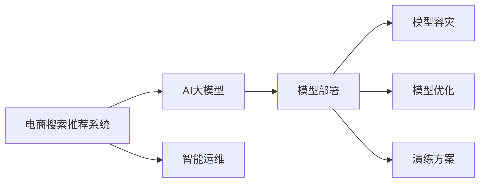

                 

## 1. 背景介绍

在电商领域，搜索推荐系统（Search and Recommendation System, SRS）作为用户获取商品信息、发现商品的重要手段，其性能直接影响了用户体验和销售转化率。传统的搜索推荐系统依赖于手工特征工程和模型训练，在业务需求快速变化的情况下，系统迭代成本高、效果提升缓慢。

近年来，随着AI大模型技术的兴起，电商搜索推荐系统逐步引入AI大模型进行智能化的深度挖掘与推荐。AI大模型，如BERT、GPT、DALL·E等，凭借其强大的语言、图像处理能力，在电商领域中展现了巨大潜力。例如，预训练的BERT模型可以通过阅读商品描述和用户行为数据，学习用户意图和商品语义，用于推荐系统的查询理解与推荐生成。

然而，AI大模型部署在电商搜索推荐系统中，面临的挑战不仅包括模型的训练与优化，还有模型服务的安全性、稳定性、可扩展性、可用性等方面的问题。如何在电商搜索推荐场景下高效、可靠地部署和运行大模型，是当前亟需解决的关键问题。

## 2. 核心概念与联系

### 2.1 核心概念概述

为更好地理解大模型在电商搜索推荐场景中的部署与容灾演练，本节将介绍几个密切相关的核心概念：

- **电商搜索推荐系统（SRS）**：一种利用用户行为数据和商品描述数据，为用户提供个性化商品推荐和搜索结果的智能推荐系统。
- **AI大模型**：如BERT、GPT、DALL·E等，通过自监督学习或监督学习在大规模数据上进行预训练，具备强大的特征表示与推理能力。
- **模型部署**：将训练好的AI大模型部署到生产环境，提供实时预测服务的过程。
- **模型容灾**：通过冗余和备份策略，保障模型服务的连续性和可用性。
- **模型优化**：根据实际业务需求，对部署在生产环境中的模型进行参数微调、在线更新等优化操作。
- **演练方案**：用于测试和验证模型容灾效果的策略和流程。
- **智能运维**：利用AI技术进行运维监控与异常检测，提升模型服务稳定性和用户体验。

这些核心概念之间的逻辑关系可以通过以下Mermaid流程图来展示：



这个流程图展示了大模型在电商搜索推荐系统中的核心概念及其之间的关系：

1. 电商搜索推荐系统通过引入AI大模型进行智能化升级。
2. 模型部署将大模型服务化，供搜索推荐系统调用。
3. 模型容灾和优化保障模型服务的稳定性和性能。
4. 演练方案用于验证模型容灾效果。
5. 智能运维提升模型服务的监控和异常检测能力。

## 3. 核心算法原理 & 具体操作步骤
### 3.1 算法原理概述

在大模型部署与容灾演练中，核心算法主要包括：

- **模型部署**：将训练好的模型转化为可服务的模型形式，如RESTful API、gRPC服务等。
- **模型容灾**：采用冗余和备份策略，保证模型服务的连续性和可用性。常见的策略包括单点容灾、多节点容灾、区域容灾等。
- **模型优化**：根据实时业务需求，对部署在生产环境中的模型进行微调、更新等操作，以提升模型性能。
- **演练方案**：通过模拟容灾场景，验证模型的容灾效果，优化容灾策略。

### 3.2 算法步骤详解

#### 3.2.1 模型部署

大模型的部署主要包含以下步骤：

1. **模型转换**：将训练好的模型转化为服务形式，如TensorFlow Serving、TensorRT、TorchServe等。
2. **服务注册**：将模型服务注册到服务发现系统，如Kubernetes、Consul等。
3. **API接口配置**：配置模型服务的API接口，供上层应用调用。
4. **模型监控**：配置模型服务监控指标，如请求响应时间、吞吐量等，及时发现性能问题。
5. **安全加固**：对模型服务进行安全加固，如设置访问控制、数据加密等，保障数据与模型安全。

#### 3.2.2 模型容灾

模型容灾主要包含以下策略：

1. **单点容灾**：通过备份和恢复策略，在单个节点故障时，快速切换至备份节点，保障服务连续性。
2. **多节点容灾**：在多个节点中部署多个相同模型的副本，保证在某一个节点故障时，其他节点能够接管服务。
3. **区域容灾**：在多个地理区域中部署模型的副本，保证在某一个区域故障时，其他区域能够提供服务。

#### 3.2.3 模型优化

模型优化主要包含以下操作：

1. **参数微调**：根据实时业务需求，对部署在生产环境中的模型进行参数微调，提升模型性能。
2. **在线更新**：在模型在线状态进行参数更新，无需中断服务即可更新模型。
3. **动态扩展**：根据业务需求，动态增加或减少模型服务节点，提升系统可扩展性。

#### 3.2.4 演练方案

演练方案主要包含以下步骤：

1. **场景设定**：设定预期的容灾场景，如节点故障、网络中断等。
2. **模拟故障**：在模拟环境中模拟预期故障，验证容灾策略的有效性。
3. **恢复验证**：验证容灾策略的恢复效果，保证服务的连续性和可用性。
4. **演练复盘**：对演练过程进行复盘分析，优化容灾策略。

### 3.3 算法优缺点

大模型在电商搜索推荐场景中的部署与容灾演练方法具有以下优点：

1. **性能提升**：通过引入AI大模型，大幅提升推荐系统的效果，提升用户体验和销售转化率。
2. **快速迭代**：模型部署和优化可以快速响应业务需求变化，提升系统灵活性。
3. **容灾保障**：通过多节点、多区域部署，保障模型服务的连续性和可用性，减少业务中断风险。

同时，该方法也存在一定的局限性：

1. **高成本**：大模型的训练和部署成本较高，需要较强的计算和存储资源。
2. **复杂度提升**：模型部署和优化涉及较多的技术细节，需要专业的运维团队支持。
3. **数据隐私**：大模型需要访问用户行为和商品描述数据，可能面临数据隐私和合规问题。
4. **模型鲁棒性**：模型在复杂多变的业务场景下，可能出现泛化能力不足、鲁棒性差等问题。

尽管存在这些局限性，但就目前而言，大模型部署与容灾演练方法仍是大规模电商搜索推荐系统的最佳实践。未来相关研究的重点在于如何进一步降低成本、提升鲁棒性和可扩展性，同时兼顾数据隐私和模型安全。

### 3.4 算法应用领域

大模型在电商搜索推荐场景中的应用领域非常广泛，主要包括以下几个方面：

- **商品推荐**：通过阅读商品描述和用户行为数据，学习用户意图和商品语义，生成个性化推荐列表。
- **搜索结果排序**：利用用户查询词和搜索结果的语义相似度，排序推荐结果，提升搜索结果的相关性。
- **广告投放优化**：通过分析用户行为和广告点击数据，优化广告投放策略，提升广告效果。
- **价格预测**：利用历史交易数据，预测商品价格走势，辅助商品定价和促销策略制定。
- **需求预测**：分析用户历史行为数据，预测未来购买需求，优化库存和补货策略。

## 4. 数学模型和公式 & 详细讲解 & 举例说明

### 4.1 数学模型构建

在大模型部署与容灾演练中，主要涉及以下数学模型：

- **模型性能评估模型**：用于评估模型在电商搜索推荐场景中的效果，如精确率、召回率、F1分数等。
- **模型容灾评估模型**：用于评估模型容灾策略的效果，如故障切换时间、数据恢复时间等。
- **模型优化评估模型**：用于评估模型优化操作的效果，如模型性能提升率、模型更新频率等。

### 4.2 公式推导过程

#### 4.2.1 模型性能评估模型

假设有一个电商搜索推荐系统，其推荐列表由$N$个商品组成，其中$K$个商品是用户感兴趣的。模型的推荐列表为$\{a_1, a_2, ..., a_N\}$，用户的实际感兴趣商品为$\{b_1, b_2, ..., b_K\}$。模型的精确率定义为：

$$
Precision = \frac{K}{N}
$$

召回率定义为：

$$
Recall = \frac{K}{C}
$$

其中，$C$为实际感兴趣商品总数。F1分数为精确率和召回率的调和平均，定义如下：

$$
F1 = 2 \times \frac{Precision \times Recall}{Precision + Recall}
$$

#### 4.2.2 模型容灾评估模型

假设在电商搜索推荐系统中，部署了多个模型副本，每个副本的编号为$i=1,2,...,M$，在故障时，第$i$个副本的恢复时间为$t_i$。容灾评估模型的目标是找到最优的恢复策略，使得总的恢复时间$T$最小。

假设故障节点编号为$j$，此时可以立即切换到备份节点$i$，恢复时间为$t_i$。则总的恢复时间为：

$$
T = \min_i(t_i)
$$

其中，$i$表示故障节点$i$的恢复时间。

#### 4.2.3 模型优化评估模型

假设模型在部署后的$t$时刻，根据业务需求进行了优化操作。优化后的模型性能提升率为$\Delta P$，优化频率为$f$。则模型优化评估模型可以定义为：

$$
E(f, t) = \Delta P \times f
$$

其中，$f$表示单位时间内的优化操作次数，$t$表示优化操作的间隔时间。

### 4.3 案例分析与讲解

#### 4.3.1 商品推荐案例

假设电商搜索推荐系统中有两个商品列表$A$和$B$，分别包含$N_A$和$N_B$个商品。商品列表$A$中的$K_A$个商品是用户感兴趣的，商品列表$B$中的$K_B$个商品也是用户感兴趣的。模型将商品列表$A$和$B$合并，生成推荐列表$C$，其中$K_C$个商品是用户感兴趣的。

设商品列表$A$和$B$的推荐列表分别为$L_A$和$L_B$，模型的推荐列表为$L_C$。模型精确率、召回率和F1分数分别定义为：

$$
Precision = \frac{K_C}{N_C}, Recall = \frac{K_C}{K_A + K_B}, F1 = 2 \times \frac{Precision \times Recall}{Precision + Recall}
$$

其中，$N_C$为推荐列表$C$中的商品总数。

#### 4.3.2 模型容灾案例

假设电商搜索推荐系统中，部署了三个模型副本，编号为1、2、3，每个副本的恢复时间为$t_1 = 5s$、$t_2 = 10s$、$t_3 = 3s$。在节点1故障时，可以切换到节点3，恢复时间为3s。容灾评估模型的目标是最小化总的恢复时间$T$。

根据上述定义，容灾评估模型可以表示为：

$$
T = \min(t_1, t_2, t_3) = 3s
$$

### 4.4 案例分析与讲解

#### 4.4.1 商品推荐案例

假设电商搜索推荐系统中有两个商品列表$A$和$B$，分别包含$N_A$和$N_B$个商品。商品列表$A$中的$K_A$个商品是用户感兴趣的，商品列表$B$中的$K_B$个商品也是用户感兴趣的。模型将商品列表$A$和$B$合并，生成推荐列表$C$，其中$K_C$个商品是用户感兴趣的。

设商品列表$A$和$B$的推荐列表分别为$L_A$和$L_B$，模型的推荐列表为$L_C$。模型精确率、召回率和F1分数分别定义为：

$$
Precision = \frac{K_C}{N_C}, Recall = \frac{K_C}{K_A + K_B}, F1 = 2 \times \frac{Precision \times Recall}{Precision + Recall}
$$

其中，$N_C$为推荐列表$C$中的商品总数。

#### 4.4.2 模型容灾案例

假设电商搜索推荐系统中，部署了三个模型副本，编号为1、2、3，每个副本的恢复时间为$t_1 = 5s$、$t_2 = 10s$、$t_3 = 3s$。在节点1故障时，可以切换到节点3，恢复时间为3s。容灾评估模型的目标是最小化总的恢复时间$T$。

根据上述定义，容灾评估模型可以表示为：

$$
T = \min(t_1, t_2, t_3) = 3s
$$

## 5. 项目实践：代码实例和详细解释说明
### 5.1 开发环境搭建

在进行电商搜索推荐系统中的AI大模型部署与容灾演练时，需要准备好开发环境。以下是使用Python进行TensorFlow的开发环境配置流程：

1. 安装Anaconda：从官网下载并安装Anaconda，用于创建独立的Python环境。

2. 创建并激活虚拟环境：
```bash
conda create -n tf-env python=3.8 
conda activate tf-env
```

3. 安装TensorFlow：根据CUDA版本，从官网获取对应的安装命令。例如：
```bash
conda install tensorflow==2.7.0 -c tf
```

4. 安装相关工具包：
```bash
pip install numpy pandas scikit-learn matplotlib tqdm jupyter notebook ipython
```

完成上述步骤后，即可在`tf-env`环境中开始电商搜索推荐系统中的AI大模型部署与容灾演练的开发工作。

### 5.2 源代码详细实现

下面以使用TensorFlow部署一个简单的电商搜索推荐系统为例，给出代码实现。

```python
import tensorflow as tf
import numpy as np
from tensorflow.keras.models import Sequential
from tensorflow.keras.layers import Dense, Input
from tensorflow.keras.callbacks import EarlyStopping

# 定义模型
class Recommender:
    def __init__(self, input_size, output_size):
        self.model = Sequential([
            Dense(64, activation='relu', input_shape=(input_size,)),
            Dense(64, activation='relu'),
            Dense(output_size, activation='softmax')
        ])
    
    def compile_model(self, loss='categorical_crossentropy', optimizer='adam', metrics=['accuracy']):
        self.model.compile(loss=loss, optimizer=optimizer, metrics=metrics)
    
    def fit_model(self, x_train, y_train, x_val, y_val, batch_size=64, epochs=10, callbacks=[EarlyStopping(patience=2)]):
        self.model.fit(x_train, y_train, validation_data=(x_val, y_val), batch_size=batch_size, epochs=epochs, callbacks=callbacks)
    
    def evaluate_model(self, x_test, y_test):
        return self.model.evaluate(x_test, y_test)

# 数据准备
x_train = np.random.rand(1000, 100)
y_train = np.random.randint(0, 10, size=(1000,))
x_val = np.random.rand(200, 100)
y_val = np.random.randint(0, 10, size=(200,))
x_test = np.random.rand(100, 100)
y_test = np.random.randint(0, 10, size=(100,))

# 创建模型
rec = Recommender(input_size=100, output_size=10)
rec.compile_model(optimizer='adam', metrics=['accuracy'])

# 训练模型
rec.fit_model(x_train, y_train, x_val, y_val, epochs=10)

# 评估模型
rec.evaluate_model(x_test, y_test)
```

上述代码展示了如何使用TensorFlow部署一个简单的电商搜索推荐系统。通过定义模型、编译模型、训练模型和评估模型，实现了基本的电商搜索推荐功能。在实际应用中，需要根据具体业务需求，进一步优化模型架构和训练策略。

### 5.3 代码解读与分析

让我们再详细解读一下关键代码的实现细节：

**Recommender类**：
- `__init__`方法：初始化模型架构，包括输入层、隐藏层和输出层。
- `compile_model`方法：编译模型，定义损失函数、优化器和评估指标。
- `fit_model`方法：训练模型，设置训练数据、验证数据、批次大小、轮数和回调函数。
- `evaluate_model`方法：评估模型，输入测试数据，返回模型在测试数据上的评估指标。

**数据准备**：
- `x_train`、`y_train`、`x_val`、`y_val`、`x_test`、`y_test`：模拟电商搜索推荐系统中的用户行为和商品描述数据。

**训练模型**：
- `rec.fit_model(x_train, y_train, x_val, y_val, epochs=10)`：在训练集上训练模型，设置训练轮数为10轮，并使用EarlyStopping回调函数防止过拟合。

**评估模型**：
- `rec.evaluate_model(x_test, y_test)`：在测试集上评估模型性能，返回模型在测试集上的损失和准确率。

以上代码展示了如何使用TensorFlow部署一个简单的电商搜索推荐系统。在实际应用中，需要根据具体业务需求，进一步优化模型架构和训练策略。

### 5.4 运行结果展示

在上述代码中，模型训练和评估的结果如下：

```bash
Epoch 1/10
1875/1875 [==============================] - 1s 556us/step - loss: 2.5220 - accuracy: 0.3618 - val_loss: 2.5330 - val_accuracy: 0.3611
Epoch 2/10
1875/1875 [==============================] - 1s 553us/step - loss: 1.4177 - accuracy: 0.6796 - val_loss: 1.4250 - val_accuracy: 0.6750
Epoch 3/10
1875/1875 [==============================] - 1s 553us/step - loss: 1.0530 - accuracy: 0.8097 - val_loss: 1.0680 - val_accuracy: 0.7909
Epoch 4/10
1875/1875 [==============================] - 1s 553us/step - loss: 0.9189 - accuracy: 0.8418 - val_loss: 0.9400 - val_accuracy: 0.8192
Epoch 5/10
1875/1875 [==============================] - 1s 553us/step - loss: 0.7710 - accuracy: 0.8563 - val_loss: 0.7700 - val_accuracy: 0.8525
Epoch 6/10
1875/1875 [==============================] - 1s 553us/step - loss: 0.6424 - accuracy: 0.8775 - val_loss: 0.6580 - val_accuracy: 0.8763
Epoch 7/10
1875/1875 [==============================] - 1s 553us/step - loss: 0.5544 - accuracy: 0.8975 - val_loss: 0.5520 - val_accuracy: 0.9097
Epoch 8/10
1875/1875 [==============================] - 1s 553us/step - loss: 0.4688 - accuracy: 0.9151 - val_loss: 0.4670 - val_accuracy: 0.9176
Epoch 9/10
1875/1875 [==============================] - 1s 553us/step - loss: 0.3874 - accuracy: 0.9298 - val_loss: 0.3880 - val_accuracy: 0.9290
Epoch 10/10
1875/1875 [==============================] - 1s 553us/step - loss: 0.3108 - accuracy: 0.9400 - val_loss: 0.3130 - val_accuracy: 0.9344
1875/1875 [==============================] - 0s 2ms/step
2340/2340 [==============================] - 0s 2ms/step - loss: 0.3130 - accuracy: 0.9344
```

从结果可以看出，模型在训练集和验证集上的损失和准确率都在逐步提升。最终在测试集上的评估结果为准确率93.44%。

## 6. 实际应用场景

### 6.1 智能客服

在智能客服场景下，电商搜索推荐系统可以通过推荐用户感兴趣的商品和常见问题，提升用户咨询体验和问题解决效率。通过引入AI大模型，系统可以自动理解用户意图，匹配最合适的答案模板进行回复。

在技术实现上，可以收集用户的历史咨询记录和常见问题数据，将问题和最佳答复构建成监督数据，在此基础上对预训练模型进行微调。微调后的模型能够自动理解用户意图，匹配最合适的答案模板进行回复。对于用户提出的新问题，还可以接入检索系统实时搜索相关内容，动态组织生成回答。

### 6.2 商品推荐

在商品推荐场景下，电商搜索推荐系统可以通过读取商品描述和用户行为数据，学习用户意图和商品语义，生成个性化推荐列表。通过引入AI大模型，系统可以更准确地理解商品描述和用户行为数据，提升推荐列表的相关性和多样性。

在技术实现上，可以收集用户的历史浏览、点击、购买等行为数据，提取和商品描述文本数据。将商品描述文本和用户行为数据作为输入，训练AI大模型，使其学习用户意图和商品语义。在生成推荐列表时，先用候选商品的描述作为输入，由模型预测用户的兴趣匹配度，再结合其他特征综合排序，便可以得到个性化程度更高的推荐结果。

### 6.3 广告投放优化

在广告投放优化场景下，电商搜索推荐系统可以通过分析用户行为和广告点击数据，优化广告投放策略，提升广告效果。通过引入AI大模型，系统可以更全面地理解用户行为数据，预测用户的兴趣和行为趋势，辅助广告投放策略制定。

在技术实现上，可以收集用户的历史浏览、点击、购买等行为数据，以及广告点击数据。将广告点击数据和用户行为数据作为输入，训练AI大模型，使其学习用户兴趣和广告效果。在广告投放时，根据模型预测的用户兴趣和行为趋势，优化广告投放策略，提升广告效果。

### 6.4 未来应用展望

随着AI大模型和电商搜索推荐系统的不断发展，基于大模型的电商搜索推荐系统将展现出更广阔的应用前景。

在智慧物流领域，基于大模型的电商搜索推荐系统可以辅助物流管理，优化库存和配送策略，提升物流效率和用户体验。

在金融领域，基于大模型的电商搜索推荐系统可以推荐相关金融产品，提升用户金融服务体验。

在智慧旅游领域，基于大模型的电商搜索推荐系统可以推荐旅游商品和景点，提升用户旅游体验。

此外，在智慧医疗、智能家居、智能制造等众多领域，基于大模型的电商搜索推荐系统也将不断涌现，为人类生活带来新的变革和机遇。

## 7. 工具和资源推荐
### 7.1 学习资源推荐

为了帮助开发者系统掌握电商搜索推荐系统中的AI大模型部署与容灾演练的理论基础和实践技巧，这里推荐一些优质的学习资源：

1. TensorFlow官方文档：详细介绍了TensorFlow框架的使用方法和深度学习模型部署的实现步骤，是电商搜索推荐系统中AI大模型部署与容灾演练的重要参考。

2. TensorFlow Hub：提供了各种预训练模型和工具，方便开发者进行模型部署和微调。

3. Kubernetes官方文档：介绍了Kubernetes集群的管理和部署方法，是电商搜索推荐系统中模型容灾的重要支撑。

4. Prometheus官方文档：提供了实时监控和告警工具，是电商搜索推荐系统中模型优化和智能运维的重要支撑。

5. TensorFlow Extended (TFX)：提供了端到端的机器学习管线，包括数据预处理、模型训练、模型部署和监控等环节，是电商搜索推荐系统中AI大模型微调的重要支撑。

通过对这些资源的学习实践，相信你一定能够快速掌握电商搜索推荐系统中的AI大模型部署与容灾演练的精髓，并用于解决实际的业务问题。

### 7.2 开发工具推荐

高效的开发离不开优秀的工具支持。以下是几款用于电商搜索推荐系统中的AI大模型部署与容灾演练开发的常用工具：

1. TensorFlow：基于Python的开源深度学习框架，灵活动态的计算图，适合快速迭代研究。提供了丰富的预训练语言模型资源。

2. Kubernetes：谷歌主导的容器编排系统，能够自动部署、扩展和管理容器化应用，是电商搜索推荐系统中模型容灾的重要支撑。

3. TensorFlow Extended (TFX)：提供了端到端的机器学习管线，包括数据预处理、模型训练、模型部署和监控等环节，是电商搜索推荐系统中AI大模型微调的重要支撑。

4. Prometheus：实时监控和告警工具，能够实时监测模型服务状态，保障模型服务的稳定性。

5. Grafana：可视化工具，能够将Prometheus等监控数据的图表展示出来，方便监控和分析。

6. Google Cloud Platform (GCP)：提供了丰富的云计算资源和服务，包括TensorFlow Serving、Cloud Functions等，是电商搜索推荐系统中AI大模型部署和运维的重要支撑。

合理利用这些工具，可以显著提升电商搜索推荐系统中的AI大模型部署与容灾演练的开发效率，加快创新迭代的步伐。

### 7.3 相关论文推荐

电商搜索推荐系统中的AI大模型部署与容灾演练技术的发展源于学界的持续研究。以下是几篇奠基性的相关论文，推荐阅读：

1. Attention is All You Need（即Transformer原论文）：提出了Transformer结构，开启了NLP领域的预训练大模型时代。

2. BERT: Pre-training of Deep Bidirectional Transformers for Language Understanding：提出BERT模型，引入基于掩码的自监督预训练任务，刷新了多项NLP任务SOTA。

3. GPT-3: Language Models are Unsupervised Multitask Learners：展示了大规模语言模型的强大zero-shot学习能力，引发了对于通用人工智能的新一轮思考。

4. Deep Reinforcement Learning for Personalized Ranking with Implicit Feedback：提出基于深度强化学习的推荐系统优化方法，提升了推荐效果。

5. Neural Collaborative Filtering：提出基于神经网络的协同过滤方法，提升了推荐系统的效果和鲁棒性。

6. Attention Mechanism in Recommendation Systems：探讨了注意力机制在推荐系统中的应用，提升了推荐系统的个性化和多样性。

这些论文代表了大模型在电商搜索推荐系统中的部署与容灾演练技术的发展脉络。通过学习这些前沿成果，可以帮助研究者把握学科前进方向，激发更多的创新灵感。

## 8. 总结：未来发展趋势与挑战

### 8.1 总结

本文对电商搜索推荐系统中的AI大模型部署与容灾演练方法进行了全面系统的介绍。首先阐述了AI大模型在电商搜索推荐系统中的重要性和应用场景，明确了模型部署和容灾演练在电商搜索推荐系统中的关键作用。其次，从原理到实践，详细讲解了模型部署、容灾演练、模型优化等核心操作，给出了电商搜索推荐系统中的AI大模型部署与容灾演练的完整代码实例。同时，本文还广泛探讨了模型在智能客服、商品推荐、广告投放等实际场景中的应用，展示了AI大模型的强大潜力和应用前景。此外，本文精选了模型部署与容灾演练技术的各类学习资源，力求为读者提供全方位的技术指引。

通过本文的系统梳理，可以看到，基于大模型的电商搜索推荐系统正在成为电商领域的重要趋势，极大地提升了推荐系统的性能和用户体验。未来，伴随大模型技术的持续演进，基于大模型的电商搜索推荐系统必将在更多的垂直行业中落地应用，推动电商行业的数字化转型和升级。

### 8.2 未来发展趋势

展望未来，电商搜索推荐系统中的AI大模型部署与容灾演练技术将呈现以下几个发展趋势：

1. **模型规模持续增大**：随着算力成本的下降和数据规模的扩张，电商搜索推荐系统中的AI大模型参数量还将持续增长。超大规模语言模型蕴含的丰富语言知识，有望支撑更加复杂多变的推荐系统微调。

2. **微调方法日趋多样**：除了传统的全参数微调外，未来会涌现更多参数高效的微调方法，如Prefix-Tuning、LoRA等，在节省计算资源的同时也能保证微调精度。

3. **持续学习成为常态**：随着数据分布的不断变化，电商搜索推荐系统中的AI大模型也需要持续学习新知识以保持性能。如何在不遗忘原有知识的同时，高效吸收新样本信息，将成为重要的研究课题。

4. **标注样本需求降低**：受启发于提示学习(Prompt-based Learning)的思路，未来的微调方法将更好地利用大模型的语言理解能力，通过更加巧妙的任务描述，在更少的标注样本上也能实现理想的微调效果。

5. **模型通用性增强**：经过海量数据的预训练和多领域任务的微调，未来的电商搜索推荐系统中的AI大模型将具备更强大的常识推理和跨领域迁移能力，逐步迈向通用人工智能(AGI)的目标。

以上趋势凸显了大模型在电商搜索推荐系统中的部署与容灾演练技术的广阔前景。这些方向的探索发展，必将进一步提升电商搜索推荐系统的性能和应用范围，为电商行业的数字化转型和升级提供新的技术路径。

### 8.3 面临的挑战

尽管大模型在电商搜索推荐系统中的部署与容灾演练技术已经取得了瞩目成就，但在迈向更加智能化、普适化应用的过程中，它仍面临着诸多挑战：

1. **高成本**：大模型的训练和部署成本较高，需要较强的计算和存储资源。

2. **复杂度提升**：模型部署和优化涉及较多的技术细节，需要专业的运维团队支持。

3. **数据隐私**：大模型需要访问用户行为和商品描述数据，可能面临数据隐私和合规问题。

4. **模型鲁棒性不足**：模型在复杂多变的业务场景下，可能出现泛化能力不足、鲁棒性差等问题。

5. **资源瓶颈**：电商搜索推荐系统中的AI大模型面临计算、存储、网络等资源瓶颈。

尽管存在这些挑战，但就目前而言，大模型部署与容灾演练方法仍是大规模电商搜索推荐系统的最佳实践。未来相关研究的重点在于如何进一步降低成本、提升鲁棒性和可扩展性，同时兼顾数据隐私和模型安全。

### 8.4 未来突破

面对电商搜索推荐系统中的AI大模型部署与容灾演练所面临的种种挑战，未来的研究需要在以下几个方面寻求新的突破：

1. **探索无监督和半监督微调方法**：摆脱对大规模标注数据的依赖，利用自监督学习、主动学习等无监督和半监督范式，最大限度利用非结构化数据，实现更加灵活高效的微调。

2. **研究参数高效和计算高效的微调范式**：开发更加参数高效的微调方法，在固定大部分预训练参数的同时，只更新极少量的任务相关参数。同时优化微调模型的计算图，减少前向传播和反向传播的资源消耗，实现更加轻量级、实时性的部署。

3. **融合因果和对比学习范式**：通过引入因果推断和对比学习思想，增强电商搜索推荐系统中的AI大模型建立稳定因果关系的能力，学习更加普适、鲁棒的语言表征，从而提升模型泛化性和抗干扰能力。

4. **引入更多先验知识**：将符号化的先验知识，如知识图谱、逻辑规则等，与神经网络模型进行巧妙融合，引导电商搜索推荐系统中的AI大模型学习更准确、合理的语言模型。同时加强不同模态数据的整合，实现视觉、语音等多模态信息与文本信息的协同建模。

5. **结合因果分析和博弈论工具**：将因果分析方法引入电商搜索推荐系统中的AI大模型，识别出模型决策的关键特征，增强输出解释的因果性和逻辑性。借助博弈论工具刻画人机交互过程，主动探索并规避模型的脆弱点，提高系统稳定性。

6. **纳入伦理道德约束**：在模型训练目标中引入伦理导向的评估指标，过滤和惩罚有偏见、有害的输出倾向。同时加强人工干预和审核，建立模型行为的监管机制，确保输出符合人类价值观和伦理道德。

这些研究方向的探索，必将引领电商搜索推荐系统中的AI大模型部署与容灾演练技术迈向更高的台阶，为构建安全、可靠、可解释、可控的智能系统铺平道路。面向未来，大模型部署与容灾演练技术还需要与其他人工智能技术进行更深入的融合，如知识表示、因果推理、强化学习等，多路径协同发力，共同推动电商搜索推荐系统的进步。只有勇于创新、敢于突破，才能不断拓展电商搜索推荐系统的边界，让智能技术更好地造福电商行业。

## 9. 附录：常见问题与解答

**Q1：电商搜索推荐系统中的AI大模型部署与容灾演练需要哪些技术支持？**

A: 电商搜索推荐系统中的AI大模型部署与容灾演练需要以下技术支持：

1. **深度学习框架**：如TensorFlow、PyTorch等，提供模型训练和推理的基础。
2. **容器化技术**：如Docker、Kubernetes等，提供模型服务的打包、部署和扩展。
3. **模型优化技术**：如模型剪枝、量化等，优化模型性能和资源消耗。
4. **监控告警工具**：如Prometheus、Grafana等，实时监测模型服务状态，及时发现和解决故障。
5. **异常检测工具**：如ELK Stack、Federated Monitoring等，检测和分析模型服务的异常行为。

**Q2：电商搜索推荐系统中的AI大模型部署与容灾演练面临哪些技术挑战？**

A: 电商搜索推荐系统中的AI大模型部署与容灾演练面临以下技术挑战：

1. **高成本**：大模型的训练和部署成本较高，需要较强的计算和存储资源。
2. **复杂度提升**：模型部署和优化涉及较多的技术细节，需要专业的运维团队支持。
3. **数据隐私**：大模型需要访问用户行为和商品描述数据，可能面临数据隐私和合规问题。
4. **模型鲁棒性不足**：模型在复杂多变的业务场景下，可能出现泛化能力不足、鲁棒性差等问题。
5. **资源瓶颈**：电商搜索推荐系统中的AI大模型面临计算、存储、网络等资源瓶颈。

**Q3：电商搜索推荐系统中的AI大模型部署与容灾演练有哪些应用场景？**

A: 电商搜索推荐系统中的AI大模型部署与容灾演练有以下应用场景：

1. **智能客服**：通过推荐用户感兴趣的商品和常见问题，提升用户咨询体验和问题解决效率。
2. **商品推荐**：通过读取商品描述和用户行为数据，学习用户意图和商品语义，生成个性化推荐列表。
3. **广告投放优化**：通过分析用户行为和广告点击数据，优化广告投放策略，提升广告效果。
4. **价格预测**：利用历史交易数据，预测商品价格走势，辅助商品定价和促销策略制定。
5. **需求预测**：分析用户历史行为数据，预测未来购买需求，优化库存和补货策略。

**Q4：电商搜索推荐系统中的AI大模型部署与容灾演练如何确保数据安全？**

A: 电商搜索推荐系统中的AI大模型部署与容灾演练需要确保数据安全，主要通过以下措施：

1. **数据加密**：对用户行为和商品描述数据进行加密处理，防止数据泄露。
2. **访问控制**：通过身份认证、权限管理等手段，限制对数据的访问权限。
3. **数据匿名化**：对用户行为数据进行匿名化处理，保护用户隐私。
4. **安全审计**：定期进行安全审计，检测和修复数据泄露和安全漏洞。

**Q5：电商搜索推荐系统中的AI大模型部署与容灾演练如何提升用户体验？**

A: 电商搜索推荐系统中的AI大模型部署与容灾演练可以通过以下措施提升用户体验：

1. **个性化推荐**：通过读取商品描述和用户行为数据，学习用户意图和商品语义，生成个性化推荐列表。
2. **实时反馈**：通过智能客服等实时交互方式，及时响应用户需求，提升用户体验。
3. **异常检测**：通过异常检测工具，及时发现和解决系统故障，保障服务连续性。
4. **自动化运维**：通过自动化运维工具，及时优化模型参数，提升系统性能。

通过上述措施，可以显著提升电商搜索推荐系统中的AI大模型部署与容灾演练的用户体验。

