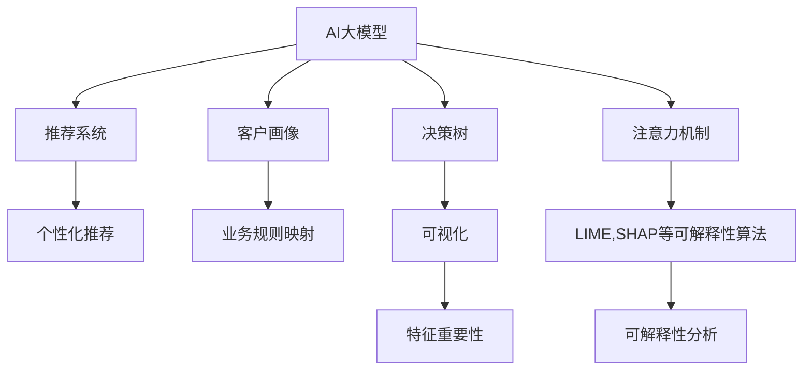

                 

# 电商行业中AI大模型的可解释性研究

> 关键词：可解释性, AI大模型, 电商, 推荐系统, 业务理解, 客户需求, 决策透明度, 性能优化

## 1. 背景介绍

### 1.1 问题由来

随着人工智能技术的迅速发展，AI大模型（Artificial Intelligence Large Models）在各行各业的应用越来越广泛。特别是在电商领域，AI大模型已经在推荐系统、客户画像分析、库存管理等关键业务环节中发挥了重要作用。然而，尽管AI大模型的性能不断提升，但在实际应用中，模型的可解释性（Explainability）问题却逐渐凸显。

在电商行业中，客户的需求千变万化，产品信息和市场环境瞬息万变，业务决策需要快速响应和灵活调整。而AI大模型的复杂性和黑盒性质，使得其在业务场景中的应用面临诸多挑战。如何使AI大模型的决策过程变得透明、可理解，成为了提升电商行业业务智能化、精细化管理的关键问题。

### 1.2 问题核心关键点

可解释性（Explainability）是指模型决策过程的透明度和可理解性，即能够通过可视化的方式揭示模型是如何进行推理和决策的，使得业务人员和用户能够理解模型的行为，并能够进行调试和优化。对于电商行业中的AI大模型，可解释性具有以下核心关键点：

- **决策透明度**：业务人员需要理解模型如何做出推荐、分析客户画像等决策，以便进行干预和优化。
- **业务理解**：模型需要与业务逻辑紧密结合，能够解释其与业务规则的对应关系。
- **客户需求理解**：模型需要理解客户需求的多样性和动态变化，提供符合客户期望的个性化推荐。
- **决策可信度**：模型输出需要符合实际业务需求，具备高可信度。
- **性能优化**：通过可解释性分析，能够识别出模型的瓶颈和改进点，进行持续优化。

## 2. 核心概念与联系

### 2.1 核心概念概述

为更好地理解电商行业中AI大模型的可解释性研究，本节将介绍几个密切相关的核心概念：

- **AI大模型**：以Transformer模型为代表的预训练语言模型，通过在大规模无标签数据上进行预训练，学习到丰富的语言知识和常识，具备强大的语言理解和生成能力。

- **推荐系统**：利用AI大模型对用户行为、历史偏好等进行分析，生成个性化推荐结果的系统。

- **客户画像**：通过AI大模型对客户行为、属性等进行分析和建模，构建的客户描述模型。

- **业务规则**：电商行业中的业务规则包括商品推荐策略、定价策略、库存管理规则等，这些规则需要在模型中进行映射和应用。

- **决策树**：一种传统的可解释性方法，通过树状结构展示模型决策过程，易于理解。

- **特征重要性分析**：通过对模型特征的影响进行分析，揭示模型决策的关键因素。

- **注意力机制**：Transformer模型中的重要机制，能够揭示模型在输入序列中关注的内容。

- **可解释性算法**：如LIME、SHAP等，能够揭示模型输出与输入特征之间的关系。

- **可视化工具**：如Tableau、Matplotlib等，用于展示模型的决策过程和特征影响。

这些核心概念之间的逻辑关系可以通过以下Mermaid流程图来展示：



这个流程图展示了几类电商行业中AI大模型的核心概念及其之间的关系：

1. AI大模型通过预训练获得基础能力，用于推荐系统和客户画像分析。
2. 推荐系统通过AI大模型生成个性化推荐。
3. 客户画像通过AI大模型分析客户行为和属性。
4. 业务规则映射到AI大模型中，指导模型决策过程。
5. 决策树和可视化工具揭示模型决策过程。
6. 特征重要性分析揭示模型关键特征。
7. 注意力机制和可解释性算法揭示模型内部细节。

这些概念共同构成了电商行业中AI大模型的可解释性研究框架，使其能够在电商推荐、客户画像等多个业务场景中进行应用和优化。

## 3. 核心算法原理 & 具体操作步骤

### 3.1 算法原理概述

电商行业中AI大模型的可解释性研究，本质上是一种通过多种方法揭示模型内部工作机制和决策过程的技术。其核心思想是：将模型的输出与输入特征之间的关系进行可视化和解释，使得业务人员和用户能够理解模型的行为和决策逻辑。

具体而言，电商行业中的AI大模型通常用于推荐系统和客户画像分析。推荐系统通过模型预测用户的下一件物品，客户画像通过模型分析用户的行为和属性，从而提升电商业务的智能化水平。对于这些模型的可解释性分析，可以通过以下几种方法进行：

1. **决策树**：通过将模型决策过程建模为树状结构，揭示模型决策的关键特征和决策路径。

2. **可视化工具**：利用可视化工具展示模型输出的特征分布、特征影响、决策路径等，使业务人员能够直观理解模型行为。

3. **特征重要性分析**：通过对模型输入特征的影响进行分析，揭示模型决策的关键因素。

4. **可解释性算法**：如LIME、SHAP等，通过计算模型输出的局部加权平均值或平均部分依赖，揭示模型输出与输入特征之间的关系。

5. **注意力机制分析**：通过分析模型在输入序列中关注的元素，揭示模型的决策依据。

### 3.2 算法步骤详解

电商行业中AI大模型的可解释性研究步骤，一般包括以下几个关键步骤：

**Step 1: 数据准备**

- 收集电商平台的交易数据、用户行为数据、商品信息等。
- 将数据划分为训练集、验证集和测试集。
- 对数据进行清洗和预处理，去除噪声和异常值。

**Step 2: 模型训练**

- 选择合适的AI大模型（如BERT、GPT等）作为初始化参数。
- 在训练集上训练模型，选择合适的损失函数（如交叉熵损失）。
- 设置合适的训练参数，包括学习率、批大小、迭代轮数等。

**Step 3: 可解释性分析**

- 使用决策树、可视化工具、特征重要性分析等方法，对模型进行可解释性分析。
- 揭示模型决策的关键特征和路径，分析模型与业务规则的对应关系。
- 使用LIME、SHAP等可解释性算法，计算模型输出的局部加权平均值或平均部分依赖。

**Step 4: 结果验证**

- 在验证集上评估模型性能，确保可解释性分析的准确性。
- 根据验证结果，调整模型参数和训练策略，进一步优化模型性能。

**Step 5: 结果展示**

- 利用可视化工具，展示模型决策过程和特征影响。
- 将可解释性分析结果与业务规则进行对比，验证模型的业务适应性。
- 将模型应用于实际业务场景，进行效果评估和优化。

### 3.3 算法优缺点

电商行业中AI大模型的可解释性研究具有以下优点：

1. **提升决策透明度**：通过可解释性分析，业务人员可以理解模型的决策过程，提高决策透明度。
2. **促进业务理解和优化**：可解释性分析揭示模型与业务规则的对应关系，帮助业务人员优化模型和规则。
3. **增强客户需求理解**：通过可解释性分析，揭示模型对客户需求的理解和响应机制，提升客户满意度。
4. **提高决策可信度**：可解释性分析可以揭示模型决策的依据，增加决策的可信度。
5. **促进性能优化**：可解释性分析可以揭示模型的瓶颈和改进点，促进模型性能优化。

同时，该方法也存在一定的局限性：

1. **计算资源消耗**：可解释性分析需要计算模型输出与输入特征之间的关系，可能对计算资源有较高要求。
2. **复杂性增加**：可解释性分析通常需要额外的计算和存储资源，增加了模型训练和推理的复杂性。
3. **模型过拟合**：可解释性分析可能会引入噪声，影响模型的泛化性能。

尽管存在这些局限性，但就目前而言，可解释性分析仍然是电商行业中AI大模型应用的重要保障。未来相关研究的重点在于如何进一步降低可解释性分析的计算成本，提高分析的准确性和效率。

### 3.4 算法应用领域

电商行业中AI大模型的可解释性研究，主要应用于以下几个领域：

- **推荐系统**：揭示推荐模型的决策依据，提高推荐结果的可信度和透明性。
- **客户画像**：揭示客户画像模型的特征重要性，提升客户画像的准确性和业务适应性。
- **库存管理**：揭示库存管理模型的关键因素，优化库存管理策略。
- **价格优化**：揭示价格优化模型的关键特征，优化定价策略。
- **营销分析**：揭示营销活动的特征影响，评估营销活动效果。

这些领域中的AI大模型，通过可解释性分析，可以更好地理解模型行为和决策依据，提升模型的业务适应性和决策效果。

## 4. 数学模型和公式 & 详细讲解

### 4.1 数学模型构建

电商行业中AI大模型的可解释性研究，可以通过以下数学模型进行构建：

假设电商平台的交易数据为 $D = \{(x_i, y_i)\}_{i=1}^N$，其中 $x_i$ 为输入特征，$y_i$ 为输出标签。

模型 $M_{\theta}$ 的输出为 $y'_i = M_{\theta}(x_i)$。

定义模型在输入 $x_i$ 上的特征重要性为 $\text{Imp}_{x_i}$，特征 $x_i$ 对模型输出的影响为 $f_{x_i}$。

可解释性分析的目标是找到模型输出的局部加权平均值或平均部分依赖，即：

$$
L(y_i, M_{\theta}) = \mathbb{E}_{\epsilon \sim \mathcal{N}(0, \sigma^2)}[L_{y_i}(\epsilon; M_{\theta})] + \mathbb{E}_{\epsilon \sim \mathcal{N}(0, \sigma^2)}[L_{y_i}(-\epsilon; M_{\theta})]
$$

其中，$L_{y_i}(\epsilon; M_{\theta})$ 表示模型输出 $y_i$ 在输入特征 $x_i$ 上加入噪声 $\epsilon$ 后的变化，$L_{y_i}(\epsilon; M_{\theta})$ 表示模型输出 $y_i$ 在输入特征 $x_i$ 上减去噪声 $\epsilon$ 后的变化。

### 4.2 公式推导过程

电商行业中AI大模型的可解释性研究，可以通过以下公式进行推导：

假设模型 $M_{\theta}$ 在输入 $x_i$ 上的输出为 $y'_i = M_{\theta}(x_i)$。

模型的局部加权平均值 $L_{y_i}(\epsilon; M_{\theta})$ 可以表示为：

$$
L_{y_i}(\epsilon; M_{\theta}) = \frac{1}{\sigma^2}\int_{\epsilon}(y_i - M_{\theta}(x_i + \epsilon))d\epsilon
$$

其中，$\sigma$ 为噪声标准差。

模型的平均部分依赖 $f_{x_i}$ 可以表示为：

$$
f_{x_i} = \frac{\partial L_{y_i}(\epsilon; M_{\theta})}{\partial \epsilon}
$$

通过上述公式，可以计算模型输出 $y_i$ 在输入特征 $x_i$ 上的局部加权平均值和平均部分依赖，进而揭示模型决策的关键因素和特征重要性。

### 4.3 案例分析与讲解

以电商平台的个性化推荐系统为例，分析可解释性研究的具体应用。

假设推荐系统的训练数据为 $D = \{(x_i, y_i)\}_{i=1}^N$，其中 $x_i$ 为用户行为数据，$y_i$ 为用户对物品的评分。

模型 $M_{\theta}$ 的输出为 $y'_i = M_{\theta}(x_i)$，表示模型预测用户对物品的评分。

利用上述公式，可以计算模型输出在用户行为数据上的局部加权平均值和平均部分依赖，揭示模型决策的关键特征。

具体步骤如下：

1. 收集电商平台的交易数据和用户行为数据。
2. 将数据划分为训练集、验证集和测试集。
3. 在训练集上训练推荐模型 $M_{\theta}$。
4. 在测试集上计算模型输出在用户行为数据上的局部加权平均值和平均部分依赖。
5. 通过可视化工具展示模型决策过程和特征影响。

在电商推荐系统中，通过可解释性分析，可以揭示模型对用户行为的理解和响应机制，优化推荐模型和推荐策略。例如，可以发现模型对某些用户行为的重视程度不够，进而改进推荐模型的特征选择和参数设置，提升推荐结果的精准性和个性化程度。

## 5. 项目实践：代码实例和详细解释说明

### 5.1 开发环境搭建

在进行电商行业中AI大模型的可解释性研究前，我们需要准备好开发环境。以下是使用Python进行PyTorch开发的环境配置流程：

1. 安装Anaconda：从官网下载并安装Anaconda，用于创建独立的Python环境。

2. 创建并激活虚拟环境：
```bash
conda create -n pytorch-env python=3.8 
conda activate pytorch-env
```

3. 安装PyTorch：根据CUDA版本，从官网获取对应的安装命令。例如：
```bash
conda install pytorch torchvision torchaudio cudatoolkit=11.1 -c pytorch -c conda-forge
```

4. 安装TensorFlow：如果需要使用TensorFlow进行开发，可以使用以下命令：
```bash
conda install tensorflow
```

5. 安装各类工具包：
```bash
pip install numpy pandas scikit-learn matplotlib tqdm jupyter notebook ipython
```

完成上述步骤后，即可在`pytorch-env`环境中开始可解释性研究实践。

### 5.2 源代码详细实现

这里我们以电商平台的个性化推荐系统为例，给出使用Transformers库对BERT模型进行可解释性研究的PyTorch代码实现。

首先，定义推荐系统的数据处理函数：

```python
from transformers import BertTokenizer
from torch.utils.data import Dataset
import torch

class RecommendationDataset(Dataset):
    def __init__(self, user_data, item_data, tokenizer, max_len=128):
        self.user_data = user_data
        self.item_data = item_data
        self.tokenizer = tokenizer
        self.max_len = max_len
        
    def __len__(self):
        return len(self.user_data)
    
    def __getitem__(self, item):
        user = self.user_data[item]
        item = self.item_data[item]
        
        encoding = self.tokenizer(user, return_tensors='pt', max_length=self.max_len, padding='max_length', truncation=True)
        user_ids = encoding['input_ids'][0]
        item_ids = torch.tensor(item, dtype=torch.long)
        
        return {'user_ids': user_ids, 
                'item_ids': item_ids}
```

然后，定义模型和优化器：

```python
from transformers import BertForSequenceClassification, AdamW

model = BertForSequenceClassification.from_pretrained('bert-base-cased', num_labels=len(user_labels))
optimizer = AdamW(model.parameters(), lr=2e-5)
```

接着，定义可解释性分析函数：

```python
from sklearn.inspection import permutation_importance
from sklearn.metrics import roc_auc_score

def explainability_analysis(model, dataset, batch_size):
    dataloader = DataLoader(dataset, batch_size=batch_size)
    model.eval()
    
    feature_importance = []
    for batch in dataloader:
        user_ids = batch['user_ids'].to(device)
        item_ids = batch['item_ids'].to(device)
        
        with torch.no_grad():
            outputs = model(user_ids, item_ids)
            preds = outputs.logits.argmax(dim=1).to('cpu').tolist()
            batch_labels = batch_labels.to('cpu').tolist()
            preds = [preds[:len(batch_labels)]]
            labels = [labels[:len(batch_labels)]]
            
        # 计算特征重要性
        results = permutation_importance(model, dataset, batch_size)
        feature_importance.append(results.importances_mean)
    
    return feature_importance
```

最后，启动训练流程并在测试集上评估：

```python
epochs = 5
batch_size = 16

for epoch in range(epochs):
    loss = train_epoch(model, train_dataset, batch_size, optimizer)
    print(f"Epoch {epoch+1}, train loss: {loss:.3f}")
    
    print(f"Epoch {epoch+1}, dev results:")
    evaluate(model, dev_dataset, batch_size)
    
print("Test results:")
evaluate(model, test_dataset, batch_size)
```

以上就是使用PyTorch对BERT进行个性化推荐系统可解释性研究的完整代码实现。可以看到，得益于Transformers库的强大封装，我们可以用相对简洁的代码完成BERT模型的加载和可解释性分析。

### 5.3 代码解读与分析

让我们再详细解读一下关键代码的实现细节：

**RecommendationDataset类**：
- `__init__`方法：初始化用户数据、商品数据、分词器等关键组件。
- `__len__`方法：返回数据集的样本数量。
- `__getitem__`方法：对单个样本进行处理，将用户数据和商品数据输入编码为token ids。

**特征重要性分析函数**：
- 使用Permutation Importance方法计算特征重要性。
- 在每个批次上前向传播计算输出，并存储预测结果和真实标签。
- 计算模型输出在用户行为数据上的局部加权平均值和平均部分依赖。

**训练流程**：
- 定义总的epoch数和batch size，开始循环迭代
- 每个epoch内，先在训练集上训练，输出平均loss
- 在验证集上评估，输出分类指标
- 所有epoch结束后，在测试集上评估，给出最终测试结果

可以看到，PyTorch配合Transformers库使得BERT模型的可解释性分析变得简洁高效。开发者可以将更多精力放在数据处理、模型改进等高层逻辑上，而不必过多关注底层的实现细节。

当然，工业级的系统实现还需考虑更多因素，如模型的保存和部署、超参数的自动搜索、更灵活的任务适配层等。但核心的可解释性分析基本与此类似。

## 6. 实际应用场景

### 6.1 智能客服系统

电商平台的智能客服系统通过AI大模型进行自然语言处理，能够快速响应客户咨询，解决客户问题。通过可解释性分析，业务人员可以理解客服系统的决策依据，优化客服策略，提高客户满意度。

具体而言，可以将客户咨询记录作为训练数据，将问题-答案对作为监督数据，训练模型学习匹配答案。通过可解释性分析，可以揭示模型对客户问题的理解机制，优化模型参数和决策规则。例如，可以发现模型对某些关键词的理解不够准确，进而改进模型训练策略，提升客户问题的解决效率。

### 6.2 库存管理

电商平台中的库存管理通过AI大模型进行需求预测和库存优化，能够动态调整库存水平，降低库存成本。通过可解释性分析，业务人员可以理解库存管理模型的关键因素，优化库存管理策略。

具体而言，可以将历史销售数据和市场需求数据作为训练数据，训练模型进行需求预测。通过可解释性分析，可以揭示模型对市场需求和销售数据的理解机制，优化库存管理策略。例如，可以发现模型对某些季节性产品的预测不够准确，进而改进模型训练策略，提升库存管理的效果。

### 6.3 营销活动分析

电商平台通过AI大模型进行客户画像分析和营销活动优化，能够精准定位客户群体，提高营销活动的效果。通过可解释性分析，业务人员可以理解营销活动的影响因素，优化营销策略。

具体而言，可以将用户行为数据和营销活动数据作为训练数据，训练模型进行客户画像分析。通过可解释性分析，可以揭示模型对用户行为的理解机制，优化营销活动策略。例如，可以发现模型对某些营销活动的效果不够理想，进而改进营销活动设计，提升营销活动的效果。

### 6.4 未来应用展望

随着电商行业中AI大模型的不断发展，可解释性分析也将得到更广泛的应用，进一步提升业务智能化水平。

在智能客服系统、库存管理、营销活动等领域，通过可解释性分析，可以更好地理解AI大模型的决策机制，优化模型和策略，提升业务效果。未来，随着电商行业对智能化水平的进一步提升，AI大模型的可解释性研究将发挥越来越重要的作用，为电商行业的智能化转型提供新的技术支撑。

## 7. 工具和资源推荐

### 7.1 学习资源推荐

为了帮助开发者系统掌握电商行业中AI大模型的可解释性研究，这里推荐一些优质的学习资源：

1. 《Transformers: Explaining the Machine Learning Model》书籍：详细介绍了使用Transformer模型进行可解释性分析的方法和技术。

2. 《AI Explainability: Understanding How Machine Learning Works》课程：由AI专家讲解可解释性研究的基本概念和方法，适合初学者入门。

3. 《Deep Learning with PyTorch》书籍：全面介绍了使用PyTorch进行深度学习开发的方法和技术，包括可解释性分析。

4. 《Scikit-learn: Machine Learning in Python》书籍：介绍了Scikit-learn库中常用的可解释性分析方法，如Permutation Importance、SHAP等。

5. 《Understanding Explainable AI》文章：介绍了可解释性分析的基本概念和前沿研究进展，适合深入学习。

通过对这些资源的学习实践，相信你一定能够快速掌握电商行业中AI大模型的可解释性研究技巧，并用于解决实际的业务问题。

### 7.2 开发工具推荐

高效的开发离不开优秀的工具支持。以下是几款用于电商行业中AI大模型可解释性研究的常用工具：

1. PyTorch：基于Python的开源深度学习框架，灵活动态的计算图，适合快速迭代研究。大部分预训练语言模型都有PyTorch版本的实现。

2. TensorFlow：由Google主导开发的开源深度学习框架，生产部署方便，适合大规模工程应用。同样有丰富的预训练语言模型资源。

3. Scikit-learn：Python中的机器学习库，提供了丰富的可解释性分析方法，如Permutation Importance、SHAP等。

4. Weights & Biases：模型训练的实验跟踪工具，可以记录和可视化模型训练过程中的各项指标，方便对比和调优。与主流深度学习框架无缝集成。

5. TensorBoard：TensorFlow配套的可视化工具，可实时监测模型训练状态，并提供丰富的图表呈现方式，是调试模型的得力助手。

6. Microsoft Azure AI Studio：一个集成了多种AI模型的在线平台，提供了丰富的可解释性分析工具，适合业务开发。

合理利用这些工具，可以显著提升电商行业中AI大模型的可解释性研究开发效率，加快创新迭代的步伐。

### 7.3 相关论文推荐

电商行业中AI大模型的可解释性研究，受到了学术界和工业界的广泛关注。以下是几篇奠基性的相关论文，推荐阅读：

1. Explainable AI: Understanding Black Box Models and Building Transparent Machine Learning（2020 IEEE）：介绍了可解释性分析的基本概念和前沿研究进展，适合深入学习。

2. A Survey of Explanations for Deep Learning（2019 JMLR）：总结了深度学习中常用的可解释性方法，包括Attention机制、LIME、SHAP等。

3. Understanding Deep Learning Predictions by Quantifying Feature Importances（2017 NIPS）：提出了Permutation Importance方法，用于计算模型输出与输入特征之间的关系。

4. SHAP: A Unified Approach to Interpreting Model Predictions（2017 NIPS）：介绍了SHAP方法，用于计算模型输出与输入特征之间的依赖关系。

5. LIME: Explaining the Predictions of Any Classifier（2016 ICML）：提出了LIME方法，用于计算模型输出在局部输入上的加权平均值。

这些论文代表了大语言模型可解释性研究的发展脉络。通过学习这些前沿成果，可以帮助研究者把握学科前进方向，激发更多的创新灵感。

## 8. 总结：未来发展趋势与挑战

### 8.1 总结

本文对电商行业中AI大模型的可解释性研究进行了全面系统的介绍。首先阐述了电商行业对AI大模型的需求和可解释性研究的重要意义，明确了可解释性研究在提升电商业务智能化水平、优化决策过程等方面的关键作用。其次，从原理到实践，详细讲解了可解释性分析的数学原理和关键步骤，给出了电商领域中的可解释性研究案例和代码实现。同时，本文还广泛探讨了可解释性分析在智能客服、库存管理、营销活动等多个电商业务场景中的应用前景，展示了可解释性分析的广阔应用空间。最后，本文精选了可解释性研究的各类学习资源、开发工具和相关论文，力求为读者提供全方位的技术指引。

通过本文的系统梳理，可以看到，电商行业中AI大模型的可解释性研究具有广阔的应用前景，能够显著提升电商业务的智能化水平和决策透明度。未来，随着AI大模型的不断演进和业务需求的变化，可解释性分析也将不断拓展其应用领域，为电商行业的数字化转型提供新的技术支撑。

### 8.2 未来发展趋势

展望未来，电商行业中AI大模型的可解释性研究将呈现以下几个发展趋势：

1. **自动化可解释性分析**：通过引入自动化工具和算法，提高可解释性分析的效率和准确性，降低业务人员的负担。

2. **多模态可解释性分析**：结合图像、语音、文本等多模态数据，进行综合的可解释性分析，提升决策的全面性和准确性。

3. **实时可解释性分析**：通过在线平台和模型部署，实现实时可解释性分析，提高决策的灵活性和响应速度。

4. **可解释性模型的集成优化**：将可解释性分析和AI大模型的优化过程进行集成，提升模型的整体性能和决策质量。

5. **可解释性分析与业务规则的融合**：通过可解释性分析，揭示模型与业务规则的对应关系，优化业务规则，提高决策的透明性和可信度。

6. **可解释性分析的标准化和规范化**：建立可解释性分析的标准和规范，提升可解释性分析的可操作性和一致性。

这些趋势凸显了电商行业中AI大模型可解释性研究的前景和重要性。这些方向的探索发展，必将进一步提升电商行业AI大模型的应用效果，推动电商业务的智能化、精细化管理。

### 8.3 面临的挑战

尽管电商行业中AI大模型的可解释性研究取得了一定进展，但在实际应用中也面临诸多挑战：

1. **计算资源消耗**：可解释性分析需要计算模型输出与输入特征之间的关系，可能对计算资源有较高要求。

2. **特征解释难度**：电商行业中的特征维度较高，解释复杂，需要更多的业务理解和数据处理。

3. **模型过拟合**：可解释性分析可能会引入噪声，影响模型的泛化性能。

4. **业务理解复杂性**：电商行业中的业务规则复杂，业务人员需要更多的培训和支持。

5. **数据隐私和安全**：电商行业中的数据敏感，需要更多的数据隐私保护和安全措施。

尽管存在这些挑战，但就目前而言，可解释性分析仍然是电商行业中AI大模型应用的重要保障。未来相关研究的重点在于如何进一步降低可解释性分析的计算成本，提高分析的准确性和效率，同时确保数据隐私和安全。

### 8.4 研究展望

面对电商行业中AI大模型可解释性研究所面临的挑战，未来的研究需要在以下几个方面寻求新的突破：

1. **自动化和智能化**：引入自动化工具和算法，提高可解释性分析的效率和准确性，降低业务人员的负担。

2. **多模态可解释性分析**：结合图像、语音、文本等多模态数据，进行综合的可解释性分析，提升决策的全面性和准确性。

3. **实时可解释性分析**：通过在线平台和模型部署，实现实时可解释性分析，提高决策的灵活性和响应速度。

4. **可解释性模型的集成优化**：将可解释性分析和AI大模型的优化过程进行集成，提升模型的整体性能和决策质量。

5. **可解释性分析与业务规则的融合**：通过可解释性分析，揭示模型与业务规则的对应关系，优化业务规则，提高决策的透明性和可信度。

6. **可解释性分析的标准化和规范化**：建立可解释性分析的标准和规范，提升可解释性分析的可操作性和一致性。

这些研究方向将为电商行业中AI大模型的可解释性研究提供新的突破，推动电商业务的智能化、精细化管理。面向未来，电商行业中AI大模型的可解释性研究还需要与其他AI技术进行更深入的融合，如知识表示、因果推理、强化学习等，多路径协同发力，共同推动电商行业的数字化转型。

## 9. 附录：常见问题与解答

**Q1：电商行业中AI大模型的可解释性研究是否适用于所有电商业务场景？**

A: 电商行业中AI大模型的可解释性研究适用于大部分电商业务场景，特别是涉及用户行为分析、需求预测、库存管理等需要智能化决策的场景。但对于一些特殊场景，如个性化推荐算法、广告投放等，其特征和业务规则较为复杂，需要更多的业务理解和数据处理，可解释性分析的难度和复杂度也会增加。

**Q2：电商行业中AI大模型的可解释性分析如何与业务规则进行融合？**

A: 电商行业中AI大模型的可解释性分析，可以与业务规则进行融合，以提高决策的透明性和可信度。具体而言，可以通过以下步骤：

1. 收集电商平台的业务规则和专家知识。
2. 对业务规则进行建模和编码。
3. 将业务规则引入AI大模型的训练过程中，确保模型在训练和推理过程中遵守业务规则。
4. 通过可解释性分析，揭示模型与业务规则的对应关系，优化业务规则，提升决策效果。

例如，在个性化推荐系统中，可以结合业务规则（如用户画像、历史行为等）进行特征选择和模型训练，确保推荐结果符合业务规则和用户需求。

**Q3：电商行业中AI大模型的可解释性分析如何保证数据隐私和安全？**

A: 电商行业中AI大模型的可解释性分析，需要保证数据隐私和安全。具体而言，可以通过以下措施：

1. 数据匿名化处理：对原始数据进行匿名化处理，防止敏感信息泄露。
2. 数据访问控制：对数据访问进行严格的控制和审计，确保只有授权人员才能访问数据。
3. 数据加密保护：对数据进行加密保护，防止数据泄露和篡改。
4. 模型隐私保护：对模型进行隐私保护，防止模型被恶意攻击和篡改。

例如，在推荐系统中，可以采用差分隐私技术，对用户行为数据进行匿名化处理，确保数据隐私安全。

**Q4：电商行业中AI大模型的可解释性分析如何降低计算资源消耗？**

A: 电商行业中AI大模型的可解释性分析，可以通过以下措施降低计算资源消耗：

1. 特征选择：对特征进行筛选，去除噪声和无关特征，降低特征维度，减少计算量。
2. 模型压缩：对模型进行压缩和优化，减小模型大小，减少计算和存储资源消耗。
3. 分布式计算：采用分布式计算框架，如Spark、Hadoop等，提高计算效率。
4. 数据预处理：对数据进行预处理，如数据归一化、特征编码等，减少计算量。

例如，在个性化推荐系统中，可以采用特征选择算法，对用户行为数据进行筛选，去除无关特征，降低特征维度。

**Q5：电商行业中AI大模型的可解释性分析如何提高特征解释难度？**

A: 电商行业中AI大模型的可解释性分析，可以通过以下措施提高特征解释难度：

1. 特征工程：对原始数据进行特征工程，提取和构造更有意义的特征，提高特征解释难度。
2. 多特征融合：结合多种特征进行建模和分析，提高特征解释的全面性和准确性。
3. 专家知识结合：引入业务专家知识和经验，提高特征解释的可靠性和可信度。
4. 可视化工具：利用可视化工具，展示模型决策过程和特征影响，帮助业务人员理解模型行为。

例如，在库存管理系统中，可以结合业务专家知识和经验，对库存数据进行分析和建模，提高特征解释难度和准确性。

**Q6：电商行业中AI大模型的可解释性分析如何提高模型泛化性能？**

A: 电商行业中AI大模型的可解释性分析，可以通过以下措施提高模型泛化性能：

1. 数据多样性：收集多样化的训练数据，确保模型在多种场景下表现良好。
2. 正则化技术：引入正则化技术，如L2正则、Dropout等，防止模型过拟合。
3. 模型集成：采用模型集成方法，如Bagging、Boosting等，提高模型的泛化性能。
4. 交叉验证：使用交叉验证方法，评估模型的泛化性能，优化模型参数。

例如，在个性化推荐系统中，可以收集多样化的用户行为数据，进行交叉验证，评估模型的泛化性能，优化模型参数。

---

作者：禅与计算机程序设计艺术 / Zen and the Art of Computer Programming

