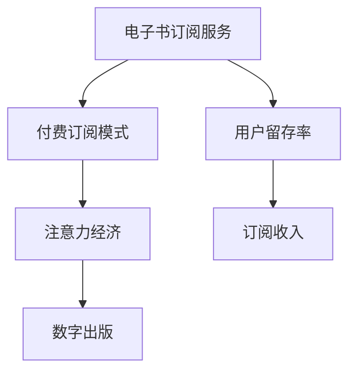
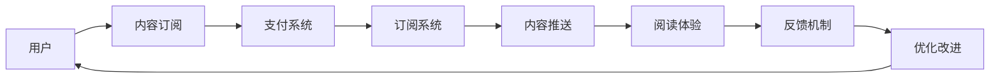

                 

# 电子书订阅服务在注意力经济中的兴起

## 1. 背景介绍

在数字化时代，电子书订阅服务作为一种新兴的阅读模式，正逐渐成为数字出版和消费的热点。它不仅仅是一种阅读习惯的转变，更是注意力经济时代的产物。在电子书订阅服务兴起的过程中，技术进步、商业模式创新、消费者行为转变等多重因素共同作用，推动了这一趋势的发展。本文旨在从多个角度分析电子书订阅服务兴起的背景，探讨其背后隐藏的商业价值和社会意义。

## 2. 核心概念与联系

### 2.1 核心概念概述

电子书订阅服务，也称为电子书订阅模式或付费订阅模式，是一种消费者定期支付费用以获取持续性的电子书阅读服务的商业模型。相较于传统的单次购买模式，订阅模式让消费者能够在固定周期内，持续获取新内容，从而保证了阅读的连续性和稳定性。

**核心概念**包括：

- **电子书订阅服务**：指消费者定期支付费用，以获得持续性阅读内容的商业模型。
- **付费订阅模式**：消费者通过定期付费获取服务的模式，常用于各类数字内容服务中。
- **注意力经济**：以吸引和维持用户注意力为核心，通过用户注意力变现的商业模式，通常涉及订阅、广告、付费等内容。
- **数字出版**：利用数字技术实现的内容出版和分发模式，包括电子书、有声书、在线课程等多种形式。
- **用户留存率**：衡量订阅服务用户持续使用服务的比例，直接影响服务收入。

这些概念之间的联系通过以下Mermaid流程图进行展示：



这个流程图说明了电子书订阅服务的三个主要方向：

1. 从电子书订阅服务（A）到付费订阅模式（B），强调了服务模式的选择。
2. 从付费订阅模式（B）到注意力经济（C），揭示了商业模式的核心价值。
3. 从注意力经济（C）到数字出版（D），指出了服务的介质和技术背景。
4. 从电子书订阅服务（A）到用户留存率（E），展示了服务用户持续性的衡量指标。

### 2.2 核心概念原理和架构的 Mermaid 流程图

在电子书订阅服务中，用户的注意力是核心资源。服务提供商通过提供优质内容和优质阅读体验，吸引和维持用户注意力，从而实现商业价值的变现。以下是一个简化的Mermaid流程图，展示了电子书订阅服务的工作流程：



这个流程图表明了电子书订阅服务的基本架构：

1. **用户（A）**：服务的终端用户，通过订阅服务获取内容。
2. **内容订阅（B）**：用户订阅的内容，可以是单本书籍、系列丛书或独家内容。
3. **支付系统（C）**：用户支付费用的系统，一般涉及第三方支付平台。
4. **订阅系统（D）**：管理用户订阅信息和支付信息，是服务核心数据所在。
5. **内容推送（E）**：将订阅内容推送给用户，确保用户及时获取新内容。
6. **阅读体验（F）**：为用户提供优质的阅读环境，如页面布局、字体选择、自动调整屏幕亮度等。
7. **反馈机制（G）**：收集用户反馈，优化阅读体验和服务内容。
8. **优化改进（H）**：根据用户反馈不断改进服务，提高用户留存率和满意度。

## 3. 核心算法原理 & 具体操作步骤

### 3.1 算法原理概述

电子书订阅服务涉及的核心算法主要集中在用户行为分析、推荐系统、个性化内容定制等方面。通过这些算法，服务提供商能够更好地理解用户需求，提升服务质量和用户体验。

- **用户行为分析**：通过分析用户阅读历史、订阅偏好、互动反馈等数据，了解用户兴趣和需求。
- **推荐系统**：根据用户行为分析结果，推荐个性化的内容，增加用户粘性。
- **个性化内容定制**：根据用户偏好，定制个性化的阅读方案和内容推送策略。

这些算法共同作用，形成了一个闭环的用户反馈和优化改进系统，不断提升服务质量。

### 3.2 算法步骤详解

电子书订阅服务的算法步骤大致包括以下几个方面：

**Step 1: 用户行为建模**
- 收集用户阅读数据、订阅历史、互动反馈等数据，构建用户行为模型。
- 使用机器学习算法（如协同过滤、内容推荐算法）分析用户兴趣和需求。

**Step 2: 内容推荐**
- 根据用户行为模型，推荐个性化的书籍、文章等阅读内容。
- 可以使用基于内容的推荐算法，结合用户历史行为和书籍元数据进行推荐。
- 也可以使用协同过滤算法，通过分析用户相似性推荐相关内容。

**Step 3: 个性化内容定制**
- 根据用户偏好，定制个性化的阅读方案和内容推送策略。
- 可以引入个性化学习算法，根据用户阅读偏好动态调整内容推送策略。
- 也可以使用多臂老虎机算法，优化内容推送策略，提升用户满意度。

**Step 4: 反馈机制**
- 收集用户反馈，了解用户对推荐内容的满意度。
- 使用情感分析算法，识别用户反馈中的情感倾向，进一步优化推荐系统。

**Step 5: 优化改进**
- 根据用户反馈和推荐效果，不断优化推荐算法和个性化定制策略。
- 使用强化学习算法，动态调整推荐策略，提高用户留存率。

通过以上步骤，电子书订阅服务可以不断提升用户满意度和留存率，实现商业价值的最大化。

### 3.3 算法优缺点

电子书订阅服务的算法优点包括：

1. **提升用户粘性**：通过个性化推荐，提升用户对服务的依赖，增加用户粘性。
2. **提高用户满意度**：根据用户行为分析，定制个性化内容，提升用户阅读体验。
3. **降低获客成本**：通过用户推荐和口碑传播，降低获客成本，提高服务覆盖率。

但这些算法也存在一些缺点：

1. **数据隐私问题**：收集用户数据需要严格遵守隐私保护法规，避免数据滥用。
2. **算法偏见**：推荐系统可能会因为数据偏差导致推荐结果不公平，需要进行算法偏见纠正。
3. **模型复杂度**：个性化推荐和内容定制涉及复杂算法，需要大量计算资源。

### 3.4 算法应用领域

电子书订阅服务的算法应用领域非常广泛，包括但不限于：

1. **在线教育**：通过个性化推荐和内容定制，提升学习体验和效果。
2. **新闻媒体**：根据用户兴趣推荐新闻文章，提高用户阅读量和互动率。
3. **文学创作**：通过分析用户阅读偏好，为作者提供创作灵感和方向。
4. **文化娱乐**：个性化推荐电影、电视剧等娱乐内容，增加用户参与度。
5. **科技资讯**：通过个性化推荐科技新闻和报告，帮助用户快速获取信息。

## 4. 数学模型和公式 & 详细讲解 & 举例说明

### 4.1 数学模型构建

在电子书订阅服务的推荐系统中，通常使用协同过滤和基于内容的推荐算法。以协同过滤算法为例，其数学模型构建如下：

假设用户集为 $U=\{u_1, u_2, ..., u_n\}$，物品集为 $I=\{i_1, i_2, ..., i_m\}$，用户 $u_i$ 对物品 $i_j$ 的评分记为 $r_{ij}$。协同过滤算法的基本模型如下：

$$
\hat{r}_{ij} = \text{cos}(\mathbf{u}_i \cdot \mathbf{v}_{i_j})
$$

其中 $\mathbf{u}_i$ 为第 $i$ 个用户的行为向量，$\mathbf{v}_{i_j}$ 为第 $i$ 个用户对物品 $j$ 的兴趣向量。

### 4.2 公式推导过程

协同过滤算法中，通过计算用户行为向量和物品兴趣向量之间的余弦相似度，来预测用户对物品的评分。余弦相似度的计算公式为：

$$
\text{cos}(\mathbf{u}_i \cdot \mathbf{v}_{i_j}) = \frac{\mathbf{u}_i \cdot \mathbf{v}_{i_j}}{\|\mathbf{u}_i\|\|\mathbf{v}_{i_j}\|}
$$

其中 $\mathbf{u}_i$ 和 $\mathbf{v}_{i_j}$ 分别表示用户 $i$ 的行为向量和物品 $j$ 的兴趣向量，$\|\mathbf{u}_i\|$ 和 $\|\mathbf{v}_{i_j}\|$ 分别为这两个向量的范数。

协同过滤算法的目标是最小化预测评分与实际评分的差距，常见的方法包括：

1. 均方误差（MSE）：$\text{MSE}=\frac{1}{N}\sum_{i=1}^N\sum_{j=1}^M (r_{ij}-\hat{r}_{ij})^2$
2. 平均绝对误差（MAE）：$\text{MAE}=\frac{1}{N}\sum_{i=1}^N\sum_{j=1}^M |r_{ij}-\hat{r}_{ij}|$
3. 均方根误差（RMSE）：$\text{RMSE}=\sqrt{\frac{1}{N}\sum_{i=1}^N\sum_{j=1}^M (r_{ij}-\hat{r}_{ij})^2}$

通过最小化这些损失函数，可以优化协同过滤算法的预测准确性。

### 4.3 案例分析与讲解

假设我们有一组用户对电影的评分数据：

| User  | Movie  | Rating |
|-------|--------|--------|
| Alice | Film1  | 4      |
| Alice | Film2  | 3      |
| Bob   | Film1  | 5      |
| Bob   | Film2  | 4      |
| Carol | Film1  | 5      |
| Carol | Film2  | 2      |

我们可以使用协同过滤算法，预测用户 Carol 对 Film3 的评分。首先，需要计算用户 Carol 的行为向量和 Film3 的兴趣向量：

- 用户 Carol 的行为向量 $\mathbf{u}_{\text{Carol}}=[5, 2]$，表示其对 Film1 和 Film2 的评分。
- 假设 Item2 的兴趣向量 $\mathbf{v}_{\text{Film2}}=[3, 4]$，表示其对 Film1 和 Film2 的评分偏好。

根据余弦相似度公式，计算用户 Carol 和 Item2 之间的相似度：

$$
\text{cos}(\mathbf{u}_{\text{Carol}} \cdot \mathbf{v}_{\text{Film2}}) = \frac{5 \times 3 + 2 \times 4}{\sqrt{5^2 + 2^2} \times \sqrt{3^2 + 4^2}} = \frac{21}{25}
$$

然后，根据协同过滤算法的评分预测公式，预测用户 Carol 对 Film3 的评分：

$$
\hat{r}_{\text{Carol}, \text{Film3}} = \frac{\text{cos}(\mathbf{u}_{\text{Carol}} \cdot \mathbf{v}_{\text{Film2}})}{\|\mathbf{v}_{\text{Film2}}\|}
$$

通过上述过程，我们可以预测用户 Carol 对 Film3 的评分，进一步进行个性化内容推荐。

## 5. 项目实践：代码实例和详细解释说明

### 5.1 开发环境搭建

电子书订阅服务的开发环境搭建包括以下步骤：

1. 安装Python：选择Python 3.x版本进行安装。
2. 安装Flask框架：使用命令 `pip install Flask` 安装Flask。
3. 安装SQLAlchemy：使用命令 `pip install SQLAlchemy` 安装SQLAlchemy。
4. 配置数据库：设置SQLAlchemy连接数据库的配置信息。
5. 运行应用：使用Flask启动服务，通过数据库读取用户数据和评分信息。

### 5.2 源代码详细实现

以下是一个简单的电子书订阅服务推荐系统的Flask应用示例：

```python
from flask import Flask, request, jsonify
from flask_sqlalchemy import SQLAlchemy
from sqlalchemy.orm import relationship
from math import sqrt

app = Flask(__name__)
app.config['SQLALCHEMY_DATABASE_URI'] = 'sqlite:///users.db'
db = SQLAlchemy(app)

class User(db.Model):
    id = db.Column(db.Integer, primary_key=True)
    name = db.Column(db.String(80), unique=True)
    movies = relationship('Movie', backref='users')

class Movie(db.Model):
    id = db.Column(db.Integer, primary_key=True)
    title = db.Column(db.String(120), unique=True)
    users = relationship('User', backref='movies')

def calculate_cosine_similarity(u1, v1, u2, v2):
    dot_product = u1.dot(v1)
    norm_u1 = sqrt(u1.dot(u1))
    norm_v1 = sqrt(v1.dot(v1))
    norm_u2 = sqrt(u2.dot(u2))
    norm_v2 = sqrt(v2.dot(v2))
    return dot_product / (norm_u1 * norm_v1 * norm_u2 * norm_v2)

@app.route('/predict', methods=['POST'])
def predict():
    data = request.get_json()
    user_id = data['user_id']
    movie_id = data['movie_id']
    user = User.query.get(user_id)
    movie = Movie.query.get(movie_id)
    u1 = user.movies.map(lambda m: m.rating)
    v1 = user.movies.map(lambda m: m.title)
    u2 = movie.users.map(lambda u: u.movies.rating)
    v2 = movie.users.movies.map(lambda m: m.title)
    cosine_similarity = calculate_cosine_similarity(u1, v1, u2, v2)
    rating = cosine_similarity / (sqrt(sum(u1)) * sqrt(sum(u2)))
    return jsonify({'rating': rating})

if __name__ == '__main__':
    app.run(debug=True)
```

在这个示例中，我们使用Flask和SQLAlchemy来搭建一个简单的推荐系统。通过计算用户行为向量和电影兴趣向量之间的余弦相似度，预测用户对电影的评分。

### 5.3 代码解读与分析

- `calculate_cosine_similarity` 函数计算两个向量之间的余弦相似度。
- `User` 和 `Movie` 类分别表示用户和电影，它们之间通过多对多关系连接。
- `/predict` 路由处理预测请求，从数据库中获取用户和电影的评分信息，计算余弦相似度，返回预测评分。

## 6. 实际应用场景

电子书订阅服务在多个实际应用场景中已经得到了广泛应用，以下是几个典型的案例：

### 6.1 在线教育平台

在线教育平台如Coursera、Udemy等，利用电子书订阅服务为学生提供个性化的学习资源推荐。平台通过分析学生的学习历史、互动反馈和课程评价，为学生推荐最合适的课程和资料，提高学习效果。

### 6.2 新闻媒体

新闻媒体如BBC、CNN等，利用电子书订阅服务为读者推荐个性化的新闻文章。平台通过分析用户的阅读历史和偏好，推荐相关的时事新闻和深度报道，提高用户阅读量和互动率。

### 6.3 文学创作平台

文学创作平台如Wattpad、Smashwords等，利用电子书订阅服务为作者提供个性化的创作激励和读者反馈。平台通过分析读者的阅读偏好，推荐相关的作品和作者，增加创作流量和互动性。

### 6.4 科技资讯平台

科技资讯平台如TechCrunch、Wired等，利用电子书订阅服务为科技爱好者推荐个性化的新闻和技术文章。平台通过分析用户的阅读历史和偏好，推荐最新的科技动态和深度报道，提高用户阅读量和参与度。

### 6.5 文化娱乐平台

文化娱乐平台如Netflix、Amazon Prime Video等，利用电子书订阅服务为用户推荐个性化的电影、电视剧和音乐内容。平台通过分析用户的观看历史和评分信息，推荐相关的娱乐内容，提高用户满意度和平台黏性。

## 7. 工具和资源推荐

### 7.1 学习资源推荐

为了帮助开发者系统掌握电子书订阅服务的开发技术，这里推荐一些优质的学习资源：

1. **Flask官方文档**：Flask框架的官方文档，提供详细的API指南和代码示例，帮助开发者快速上手Flask应用开发。
2. **SQLAlchemy官方文档**：SQLAlchemy的官方文档，提供详细的ORM使用和数据库操作教程，帮助开发者高效管理数据库。
3. **TensorFlow Machine Learning**：TensorFlow官方提供的机器学习教程，涵盖协同过滤、内容推荐等核心算法，适合深入学习。
4. **Coursera Machine Learning**：Coursera平台提供的机器学习课程，由斯坦福大学教授Andrew Ng讲授，是学习机器学习经典课程之一。
5. **Kaggle推荐系统竞赛**：Kaggle平台提供的推荐系统竞赛，通过实际竞赛项目，帮助开发者实践推荐系统开发。

### 7.2 开发工具推荐

为了提高电子书订阅服务的开发效率，以下几款工具推荐使用：

1. **Jupyter Notebook**：Jupyter Notebook提供了交互式的代码开发环境，支持Python和SQLAlchemy等工具的使用，适合数据分析和模型调试。
2. **Scikit-learn**：Scikit-learn是Python科学计算库，提供了丰富的机器学习算法，适合协同过滤和内容推荐等核心算法的实现。
3. **PyTorch**：PyTorch是深度学习框架，提供了灵活的模型定义和计算图，适合复杂推荐系统的实现。
4. **TensorFlow**：TensorFlow是Google提供的深度学习框架，提供了丰富的算法和工具，适合大规模推荐系统的实现。
5. **AWS SageMaker**：AWS SageMaker是亚马逊提供的机器学习平台，提供了云端计算资源和自动调参工具，适合分布式推荐系统的实现。

### 7.3 相关论文推荐

电子书订阅服务的核心算法和模型设计涉及众多前沿研究。以下是几篇奠基性的相关论文，推荐阅读：

1. **Collaborative Filtering for Implicit Feedback Datasets**：Adams、Brendan J. 等，NIPS 2006年论文，介绍了协同过滤算法的经典方法。
2. **The Netflix Prize**：Bennett、A. N., et al., 2007年论文，介绍了Netflix推荐系统竞赛和竞赛结果。
3. **Personalized Recommendation using Matrix Factorization**：Hofmann, T. 等，UAI 2005年论文，介绍了矩阵分解方法在推荐系统中的应用。
4. **Explicit and Implicit Feedback in Recommendation Systems**：Herlocker, J., R. K., et al., KDD 2002年论文，介绍了显式反馈和隐式反馈在推荐系统中的应用。
5. **Content-Based and Collaborative Recommendation Revisited**：Kleinberg, J., KDD 2003年论文，介绍了内容推荐和协同过滤的评价指标和方法。

## 8. 总结：未来发展趋势与挑战

### 8.1 研究成果总结

电子书订阅服务作为一种新兴的阅读模式，已经在多个领域得到了广泛应用，取得了显著的商业和社会效益。其背后的算法和模型设计涉及协同过滤、内容推荐、个性化定制等多个领域的前沿研究，推动了机器学习、自然语言处理等技术的发展。

### 8.2 未来发展趋势

展望未来，电子书订阅服务将呈现以下几个发展趋势：

1. **用户行为数据的深度挖掘**：随着数据采集技术的提升和计算资源的丰富，用户行为数据的深度挖掘将成为趋势。利用机器学习和大数据分析技术，可以从更深层次挖掘用户行为和需求，提供更个性化的推荐和定制服务。
2. **多模态推荐系统的应用**：除了文本数据外，用户的行为数据还包括图像、视频、语音等多种模态。多模态推荐系统的应用，将进一步提升推荐系统的准确性和多样性。
3. **实时推荐系统的实现**：实时推荐系统能够根据用户即时行为进行动态推荐，提高用户满意度和留存率。实时推荐系统需要结合流计算和大数据技术，实现数据的实时处理和分析。
4. **推荐系统的透明性和可解释性**：推荐系统的透明性和可解释性将成为重要研究方向。未来的推荐系统需要具备更好的可解释性，使用户能够理解推荐结果的依据，提升用户信任度和满意度。
5. **推荐系统的公平性和鲁棒性**：推荐系统的公平性和鲁棒性需要进一步提升。未来的推荐系统需要避免算法偏见，保护用户隐私，确保推荐结果的公平性和鲁棒性。

### 8.3 面临的挑战

电子书订阅服务在发展过程中，也面临着诸多挑战：

1. **数据隐私和安全**：用户行为数据的采集和存储需要严格遵守隐私保护法规，避免数据滥用和泄露。推荐系统需要具备良好的数据安全和隐私保护机制。
2. **算法偏见和公平性**：推荐系统可能会因为数据偏差导致推荐结果不公平，需要进行算法偏见纠正。未来的推荐系统需要具备更好的公平性和鲁棒性。
3. **计算资源消耗**：推荐系统涉及复杂算法和大规模数据处理，需要消耗大量计算资源。未来的推荐系统需要优化算法和资源消耗，提高运行效率。
4. **用户隐私保护**：用户行为数据的采集和存储需要严格遵守隐私保护法规，避免数据滥用和泄露。推荐系统需要具备良好的数据安全和隐私保护机制。
5. **算法复杂度和模型优化**：推荐系统的算法复杂度较高，模型优化难度大。未来的推荐系统需要更高效的算法和模型优化方法。

### 8.4 研究展望

面对电子书订阅服务面临的挑战，未来的研究需要在以下几个方面寻求新的突破：

1. **数据隐私保护技术**：发展数据隐私保护技术，如差分隐私、联邦学习等，保障用户数据安全和隐私。
2. **推荐系统公平性和鲁棒性**：研究推荐系统公平性和鲁棒性的优化方法，如对抗训练、鲁棒推荐算法等。
3. **实时推荐系统的实现**：结合流计算和大数据技术，实现实时推荐系统的构建和优化。
4. **推荐系统的透明性和可解释性**：发展推荐系统的透明性和可解释性技术，如可解释性推荐算法、可视化推荐系统等。
5. **多模态推荐系统的应用**：研究多模态推荐系统的构建方法，如跨模态学习、多模态嵌入等，提高推荐系统的多样性和准确性。

总之，电子书订阅服务作为一种新兴的阅读模式，在多个领域已经取得了显著的商业和社会效益。未来的发展需要技术、商业、社会等多方面的协同推进，才能实现更好的用户体验和商业价值。相信随着技术的不断进步和应用的不断拓展，电子书订阅服务将迎来更加广阔的发展前景。

## 9. 附录：常见问题与解答

**Q1: 电子书订阅服务中推荐算法的核心是什么？**

A: 电子书订阅服务中推荐算法的核心是协同过滤和基于内容的推荐。协同过滤算法通过分析用户行为和物品评分，预测用户对新物品的评分，从而进行推荐。基于内容的推荐算法通过分析物品属性和用户偏好，进行个性化推荐。

**Q2: 如何提高推荐系统的准确性和多样性？**

A: 提高推荐系统的准确性和多样性，可以通过以下方法：
1. 引入多种推荐算法，如协同过滤、基于内容的推荐、混合推荐等。
2. 使用多臂老虎机算法，优化推荐策略，平衡准确性和多样性。
3. 引入用户反馈机制，实时调整推荐算法，提高推荐效果。

**Q3: 电子书订阅服务如何处理用户隐私问题？**

A: 电子书订阅服务需要严格遵守隐私保护法规，处理用户隐私问题。可以采用以下方法：
1. 匿名化用户数据，去除敏感信息，保障用户隐私。
2. 使用差分隐私技术，对用户数据进行扰动处理，避免数据泄露。
3. 限制数据访问权限，只有授权人员才能访问用户数据。

**Q4: 电子书订阅服务如何实现实时推荐？**

A: 实现实时推荐系统，需要结合流计算和大数据技术。具体方法包括：
1. 实时采集用户行为数据，进行分析处理。
2. 使用流式算法，对实时数据进行在线处理。
3. 根据实时数据动态调整推荐策略，进行实时推荐。

**Q5: 电子书订阅服务如何提升用户满意度？**

A: 提升用户满意度的方法包括：
1. 提供个性化的推荐内容，满足用户个性化需求。
2. 优化阅读体验，如页面布局、字体选择、自动调整屏幕亮度等。
3. 收集用户反馈，不断改进推荐算法和内容定制策略。

总之，电子书订阅服务作为一种新兴的阅读模式，在多个领域已经取得了显著的商业和社会效益。未来的发展需要技术、商业、社会等多方面的协同推进，才能实现更好的用户体验和商业价值。相信随着技术的不断进步和应用的不断拓展，电子书订阅服务将迎来更加广阔的发展前景。

---

作者：禅与计算机程序设计艺术 / Zen and the Art of Computer Programming

