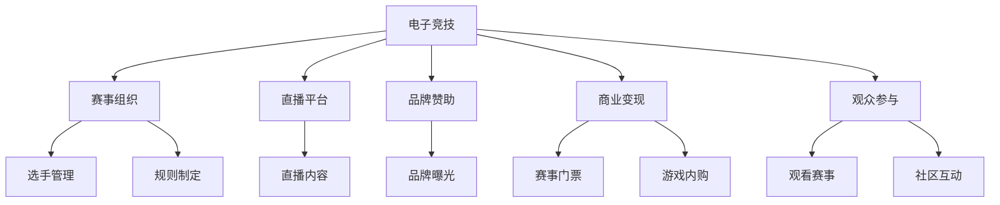

                 

# 电子竞技：注意力经济的新宠儿

## 1. 背景介绍

在数字化时代，电子竞技(Esports)作为一种新兴的体育赛事形式，已经迅速崛起为全球关注的焦点。它不仅吸引了数以亿计的年轻人，还引起了投资者的极大兴趣。作为注意力经济的一环，电子竞技对社会文化、经济乃至政治都产生了深远影响。

### 1.1 电子竞技的兴起

电子竞技是指利用各种电子设备（如PC、主机、手机等）进行的游戏竞技活动。它结合了电子技术、竞技运动和娱乐元素，具有高度互动性和趣味性。随着互联网和游戏技术的不断进步，电子竞技逐渐从一个小众爱好演变为大众现象。

### 1.2 电子竞技的全球化

电子竞技的崛起得益于其全球化的特性。全球化的电子竞技赛事，如《英雄联盟》全球总决赛、《绝地求生》全球大逃杀、《DOTA2》国际邀请赛等，吸引了来自世界各地的顶尖选手和观众。这些赛事不仅让选手有机会展示自我，也推动了电子竞技的全球化传播和普及。

### 1.3 电子竞技的商业化

电子竞技的商业化是其快速发展的另一大驱动力。通过赛事直播、品牌赞助、游戏内购等多种方式，电子竞技形成了庞大的商业生态系统。这不仅增加了赛事的吸引力和观众参与度，也创造了巨大的经济效益。

## 2. 核心概念与联系

### 2.1 核心概念概述

要深入理解电子竞技，首先需要掌握其核心概念和相互关系。以下为主要概念及其相互联系：

- **电子竞技**：结合电子技术和竞技运动的游戏竞技活动，具有高度互动性和趣味性。
- **赛事组织**：指电子竞技的组织和管理，包括赛事策划、选手管理、规则制定等。
- **直播平台**：提供赛事直播服务的平台，如虎牙、斗鱼、Bilibili等。
- **品牌赞助**：企业通过赞助电子竞技赛事获得品牌曝光和用户互动。
- **商业变现**：通过赛事门票、直播打赏、游戏内购等形式实现经济收益。
- **观众参与**：观众通过观看赛事、参与社区互动等方式参与电子竞技。

### 2.2 核心概念原理和架构的 Mermaid 流程图



通过这幅图，我们可以清晰地看到电子竞技生态系统的组成和它们之间的相互关系。

## 3. 核心算法原理 & 具体操作步骤

### 3.1 算法原理概述

电子竞技的运营和发展涉及到多个算法和技术的运用。以下是最核心的算法原理概述：

- **数据挖掘**：通过分析用户行为和赛事数据，挖掘用户喜好和赛事热点，为赛事组织和广告投放提供依据。
- **机器学习**：通过赛事历史数据和选手表现预测未来比赛结果，提高赛事的观赏性和公平性。
- **自然语言处理(NLP)**：分析赛事评论和社交媒体数据，了解观众情感和反馈，优化赛事组织。
- **智能推荐**：通过用户行为和偏好，智能推荐相关游戏和赛事内容，提升用户黏性和参与度。
- **图像识别**：通过分析观众的表情和动作，优化赛事直播效果，提升观众体验。

### 3.2 算法步骤详解

#### 3.2.1 数据挖掘

数据挖掘是电子竞技运营的基础。通过收集和分析用户行为数据，如游戏时间、胜率、观看时长等，可以挖掘出用户喜好的游戏类型、比赛风格等信息。这些信息可以用来优化游戏推荐和赛事组织。

数据挖掘步骤如下：

1. 数据收集：从游戏平台、直播平台、社交媒体等渠道收集用户行为数据。
2. 数据清洗：去除无效数据和异常值，保证数据的质量和完整性。
3. 数据挖掘：使用聚类、分类、关联规则等算法，分析数据中的模式和规律。
4. 结果呈现：将分析结果以可视化形式呈现，帮助决策者理解数据。

#### 3.2.2 机器学习

机器学习在电子竞技中的应用主要体现在比赛结果预测和选手评估上。通过历史数据训练模型，可以预测未来比赛结果，评估选手表现，从而提升赛事的观赏性和公平性。

机器学习步骤如下：

1. 数据准备：收集历史比赛数据，包括选手表现、比分、时间等。
2. 特征提取：将比赛数据转换为机器学习算法可以处理的特征向量。
3. 模型训练：使用训练数据集训练机器学习模型，如随机森林、神经网络等。
4. 模型评估：使用测试数据集评估模型性能，优化模型参数。
5. 应用部署：将训练好的模型部署到赛事中，进行比赛结果预测和选手评估。

#### 3.2.3 自然语言处理(NLP)

自然语言处理在电子竞技中的应用主要是情感分析和赛事评论。通过分析观众评论和社交媒体数据，可以了解观众对赛事的看法和情感，为赛事组织和广告投放提供依据。

NLP步骤如下：

1. 文本收集：从社交媒体、论坛等渠道收集评论和帖子。
2. 文本预处理：去除停用词、标点等噪声，进行分词和词性标注。
3. 情感分析：使用情感分析算法，如情感词典、深度学习模型等，分析评论情感。
4. 结果呈现：将情感分析结果可视化，帮助赛事组织者理解观众情感。

#### 3.2.4 智能推荐

智能推荐通过分析用户行为和偏好，智能推荐相关游戏和赛事内容，提升用户黏性和参与度。智能推荐的核心是协同过滤和基于内容的推荐算法。

智能推荐步骤如下：

1. 数据收集：从游戏平台、社交媒体等渠道收集用户行为数据。
2. 数据清洗：去除无效数据和异常值，保证数据的质量和完整性。
3. 特征提取：将用户行为数据转换为推荐算法可以处理的特征向量。
4. 推荐算法：使用协同过滤、基于内容的推荐算法，生成推荐列表。
5. 结果呈现：将推荐列表呈现给用户，提升用户参与度。

#### 3.2.5 图像识别

图像识别在电子竞技中的应用主要是观众表情和动作的识别。通过分析观众的表情和动作，可以优化赛事直播效果，提升观众体验。

图像识别步骤如下：

1. 图像收集：从赛事直播中收集观众表情和动作视频。
2. 图像预处理：对视频进行分割和增强处理，去除噪声。
3. 模型训练：使用卷积神经网络（CNN）等模型，训练图像识别模型。
4. 结果呈现：将图像识别结果与赛事数据结合，优化赛事直播效果。

### 3.3 算法优缺点

#### 3.3.1 优点

- **准确性和效率**：数据挖掘和机器学习算法能够从海量数据中提取有价值的信息，提高赛事预测和组织效率。
- **实时性**：智能推荐和图像识别技术能够实时分析用户行为和观众反馈，提升用户体验。
- **多维度分析**：通过自然语言处理和图像识别，赛事组织者可以从多个维度分析用户行为和观众情感，优化赛事内容。

#### 3.3.2 缺点

- **数据隐私**：用户行为数据的收集和使用需要遵守隐私保护法规，防止数据泄露。
- **模型复杂度**：大规模数据和复杂模型增加了系统构建和维护的难度。
- **资源消耗**：数据挖掘和机器学习算法需要大量的计算资源，增加了硬件投入。

### 3.4 算法应用领域

电子竞技涉及到多个领域，包括游戏开发、赛事组织、直播平台、品牌赞助、商业变现和观众参与等。以下是对这些领域的应用概述：

#### 3.4.1 游戏开发

电子竞技离不开游戏开发的支持。通过数据分析和机器学习，游戏开发者可以优化游戏设计，提升游戏平衡性。同时，游戏开发者也可以使用图像识别技术，提升游戏画面的美观度和用户体验。

#### 3.4.2 赛事组织

赛事组织是电子竞技的核心。通过数据挖掘和机器学习，赛事组织者可以预测比赛结果，优化赛事赛程和选手搭配。同时，赛事组织者也可以通过自然语言处理和图像识别，提升赛事直播效果和观众体验。

#### 3.4.3 直播平台

直播平台是电子竞技的重要载体。通过智能推荐和图像识别技术，直播平台可以提升用户黏性和参与度。同时，直播平台也可以通过品牌赞助和商业变现，实现经济收益。

#### 3.4.4 品牌赞助

品牌赞助是电子竞技的重要经济来源。通过数据挖掘和机器学习，品牌赞助商可以精准定位目标用户，提升品牌曝光和用户互动。

#### 3.4.5 商业变现

商业变现是电子竞技的重要收入来源。通过赛事门票、直播打赏、游戏内购等方式，电子竞技可以创造出巨大的经济效益。

#### 3.4.6 观众参与

观众参与是电子竞技的重要组成部分。通过数据挖掘和智能推荐，赛事组织者可以提升观众参与度。同时，赛事组织者也可以通过赛事评论和社交媒体，了解观众情感和反馈，优化赛事内容。

## 4. 数学模型和公式 & 详细讲解 & 举例说明

### 4.1 数学模型构建

电子竞技中涉及到的数学模型主要集中在数据挖掘、机器学习和智能推荐等环节。以下是对这些模型的数学模型构建。

#### 4.1.1 数据挖掘

数据挖掘的数学模型主要涉及聚类、分类和关联规则等算法。以聚类算法为例，其数学模型如下：

$$
K-means = \underset{k}{\arg\min} \sum_{i=1}^{N} \min_{j=1}^{k} ||x_i - \mu_j||^2
$$

其中，$x_i$ 表示样本，$\mu_j$ 表示聚类中心，$||\cdot||$ 表示范数，$k$ 表示聚类数。

#### 4.1.2 机器学习

机器学习的数学模型主要涉及回归、分类和神经网络等算法。以神经网络为例，其数学模型如下：

$$
\min_{\theta} \frac{1}{N} \sum_{i=1}^{N} (y_i - h_{\theta}(x_i))^2
$$

其中，$y_i$ 表示真实标签，$h_{\theta}(x_i)$ 表示神经网络输出，$\theta$ 表示模型参数。

#### 4.1.3 智能推荐

智能推荐的数学模型主要涉及协同过滤和基于内容的推荐算法。以协同过滤为例，其数学模型如下：

$$
P_{ij} = \frac{\sum_{k=1}^{K} a_{ik}b_{kj}}{\sqrt{\sum_{k=1}^{K}a_{ik}^2}\sqrt{\sum_{k=1}^{K}b_{kj}^2}}
$$

其中，$P_{ij}$ 表示用户 $i$ 对物品 $j$ 的评分，$a_{ik}$ 表示用户 $i$ 对物品 $k$ 的评分，$b_{kj}$ 表示物品 $k$ 对物品 $j$ 的评分，$K$ 表示物品数量。

### 4.2 公式推导过程

#### 4.2.1 数据挖掘

数据挖掘的公式推导主要涉及聚类算法的推导。以K-means算法为例，其公式推导如下：

$$
K-means = \underset{k}{\arg\min} \sum_{i=1}^{N} \min_{j=1}^{k} ||x_i - \mu_j||^2
$$

其中，$x_i$ 表示样本，$\mu_j$ 表示聚类中心，$||\cdot||$ 表示范数，$k$ 表示聚类数。

推导过程如下：

1. 初始化聚类中心。随机选择 $k$ 个样本作为初始聚类中心。
2. 分配样本到聚类中心。计算每个样本到聚类中心的距离，将样本分配到距离最近的聚类中心。
3. 更新聚类中心。根据分配后的样本，计算新的聚类中心。
4. 重复迭代。直到聚类中心不再变化，或达到最大迭代次数。

#### 4.2.2 机器学习

机器学习的公式推导主要涉及神经网络的推导。以神经网络为例，其公式推导如下：

$$
\min_{\theta} \frac{1}{N} \sum_{i=1}^{N} (y_i - h_{\theta}(x_i))^2
$$

其中，$y_i$ 表示真实标签，$h_{\theta}(x_i)$ 表示神经网络输出，$\theta$ 表示模型参数。

推导过程如下：

1. 前向传播。将输入样本 $x_i$ 输入神经网络，得到输出 $h_{\theta}(x_i)$。
2. 计算误差。计算预测输出与真实标签之间的误差。
3. 反向传播。根据误差反向传播，计算梯度。
4. 参数更新。根据梯度和学习率，更新模型参数。

#### 4.2.3 智能推荐

智能推荐的公式推导主要涉及协同过滤的推导。以协同过滤为例，其公式推导如下：

$$
P_{ij} = \frac{\sum_{k=1}^{K} a_{ik}b_{kj}}{\sqrt{\sum_{k=1}^{K}a_{ik}^2}\sqrt{\sum_{k=1}^{K}b_{kj}^2}}
$$

其中，$P_{ij}$ 表示用户 $i$ 对物品 $j$ 的评分，$a_{ik}$ 表示用户 $i$ 对物品 $k$ 的评分，$b_{kj}$ 表示物品 $k$ 对物品 $j$ 的评分，$K$ 表示物品数量。

推导过程如下：

1. 计算相似度。计算用户 $i$ 和物品 $j$ 的相似度。
2. 计算评分。根据相似度和用户评分，计算物品 $j$ 的评分。

### 4.3 案例分析与讲解

#### 4.3.1 数据挖掘案例

以《英雄联盟》电子竞技赛事为例，通过对玩家游戏行为数据的分析，可以挖掘出玩家喜好的游戏角色、装备、地图等信息。这些信息可以用来优化游戏推荐和赛事组织。

数据挖掘案例步骤如下：

1. 收集游戏数据。从游戏平台收集玩家游戏数据。
2. 数据清洗。去除无效数据和异常值，保证数据的质量和完整性。
3. 数据挖掘。使用聚类算法，将玩家分成不同的群体。
4. 结果呈现。将聚类结果可视化，帮助决策者理解数据。

#### 4.3.2 机器学习案例

以《DOTA2》电子竞技赛事为例，通过历史数据训练机器学习模型，可以预测比赛结果，评估选手表现。

机器学习案例步骤如下：

1. 数据准备。收集历史比赛数据，包括选手表现、比分、时间等。
2. 特征提取。将比赛数据转换为机器学习算法可以处理的特征向量。
3. 模型训练。使用随机森林算法，训练比赛结果预测模型。
4. 模型评估。使用测试数据集评估模型性能，优化模型参数。
5. 应用部署。将训练好的模型部署到赛事中，进行比赛结果预测和选手评估。

#### 4.3.3 智能推荐案例

以《绝地求生》电子竞技赛事为例，通过用户行为数据，智能推荐相关游戏和赛事内容，提升用户黏性和参与度。

智能推荐案例步骤如下：

1. 数据收集。从游戏平台收集用户行为数据。
2. 数据清洗。去除无效数据和异常值，保证数据的质量和完整性。
3. 特征提取。将用户行为数据转换为推荐算法可以处理的特征向量。
4. 推荐算法。使用协同过滤算法，生成推荐列表。
5. 结果呈现。将推荐列表呈现给用户，提升用户参与度。

## 5. 项目实践：代码实例和详细解释说明

### 5.1 开发环境搭建

在进行电子竞技相关开发前，需要先准备好开发环境。以下是使用Python进行PyTorch开发的环境配置流程：

1. 安装Anaconda：从官网下载并安装Anaconda，用于创建独立的Python环境。
2. 创建并激活虚拟环境：
```bash
conda create -n pytorch-env python=3.8 
conda activate pytorch-env
```
3. 安装PyTorch：根据CUDA版本，从官网获取对应的安装命令。例如：
```bash
conda install pytorch torchvision torchaudio cudatoolkit=11.1 -c pytorch -c conda-forge
```
4. 安装transformers库：
```bash
pip install transformers
```
5. 安装各类工具包：
```bash
pip install numpy pandas scikit-learn matplotlib tqdm jupyter notebook ipython
```

完成上述步骤后，即可在`pytorch-env`环境中开始电子竞技相关开发。

### 5.2 源代码详细实现

这里我们以智能推荐系统为例，给出使用PyTorch进行电子竞技智能推荐开发的PyTorch代码实现。

首先，定义推荐系统的输入数据：

```python
import pandas as pd
from sklearn.model_selection import train_test_split

# 数据读取
df = pd.read_csv('game_data.csv')

# 数据清洗
df = df.dropna()

# 特征提取
df = pd.get_dummies(df)

# 数据划分
train_df, test_df = train_test_split(df, test_size=0.2, random_state=42)
```

然后，定义推荐模型：

```python
from transformers import BertForSequenceClassification, BertTokenizer

# 初始化模型和分词器
model = BertForSequenceClassification.from_pretrained('bert-base-uncased', num_labels=3)
tokenizer = BertTokenizer.from_pretrained('bert-base-uncased')

# 数据预处理
def preprocess_data(text):
    inputs = tokenizer.encode_plus(text, max_length=128, return_tensors='pt', padding='max_length')
    return inputs['input_ids'], inputs['attention_mask']
```

接着，定义训练和评估函数：

```python
from torch.utils.data import Dataset, DataLoader
from torch.nn import CrossEntropyLoss
from tqdm import tqdm

# 定义数据集
class GameDataset(Dataset):
    def __init__(self, data, tokenizer):
        self.data = data
        self.tokenizer = tokenizer
        
    def __len__(self):
        return len(self.data)
    
    def __getitem__(self, idx):
        inputs, labels = self.data.iloc[idx]
        return preprocess_data(inputs), labels

# 定义数据加载器
train_loader = DataLoader(GameDataset(train_df, tokenizer), batch_size=32, shuffle=True)
test_loader = DataLoader(GameDataset(test_df, tokenizer), batch_size=32, shuffle=False)

# 定义损失函数和优化器
criterion = CrossEntropyLoss()
optimizer = AdamW(model.parameters(), lr=2e-5)
```

最后，启动训练流程并在测试集上评估：

```python
epochs = 5
batch_size = 32

for epoch in range(epochs):
    train_loss = 0.0
    for batch in tqdm(train_loader, desc='Training'):
        inputs, labels = batch
        optimizer.zero_grad()
        outputs = model(inputs[0], attention_mask=inputs[1])
        loss = criterion(outputs, labels)
        loss.backward()
        optimizer.step()
        train_loss += loss.item()
    print(f'Epoch {epoch+1}, train loss: {train_loss/len(train_loader):.3f}')
    
test_loss = 0.0
with torch.no_grad():
    for batch in tqdm(test_loader, desc='Evaluating'):
        inputs, labels = batch
        outputs = model(inputs[0], attention_mask=inputs[1])
        loss = criterion(outputs, labels)
        test_loss += loss.item()
    print(f'Test loss: {test_loss/len(test_loader):.3f}')
```

以上就是使用PyTorch对电子竞技智能推荐系统进行开发的完整代码实现。可以看到，借助Transformer库的强大封装，我们可以用相对简洁的代码完成模型的训练和推理。

### 5.3 代码解读与分析

让我们再详细解读一下关键代码的实现细节：

**GameDataset类**：
- `__init__`方法：初始化数据集和分词器。
- `__len__`方法：返回数据集的样本数量。
- `__getitem__`方法：对单个样本进行处理，将文本输入编码为token ids，并计算标签。

**preprocess_data函数**：
- 对输入文本进行分词和编码，生成模型所需的输入。

**train_loader和test_loader**：
- 使用PyTorch的DataLoader对数据集进行批次化加载，供模型训练和推理使用。

**criterion和optimizer**：
- 定义损失函数和优化器。

**训练流程**：
- 定义总的epoch数和batch size，开始循环迭代
- 每个epoch内，先在训练集上训练，输出平均loss
- 在测试集上评估，输出损失
- 所有epoch结束后，给出最终的测试损失

可以看到，PyTorch配合Transformer库使得电子竞技智能推荐系统的开发变得简洁高效。开发者可以将更多精力放在模型改进和算法优化上，而不必过多关注底层的实现细节。

当然，工业级的系统实现还需考虑更多因素，如模型的保存和部署、超参数的自动搜索、更灵活的任务适配层等。但核心的智能推荐范式基本与此类似。

## 6. 实际应用场景

### 6.1 赛事组织

电子竞技赛事组织是电子竞技的核心。通过数据分析和机器学习，赛事组织者可以优化赛事赛程和选手搭配，提高赛事的观赏性和公平性。

具体而言，可以收集赛事历史数据，包括选手表现、比分、时间等。通过机器学习算法，预测比赛结果，评估选手表现。例如，通过随机森林算法，可以预测《英雄联盟》全球总决赛的胜负，评估《DOTA2》国际邀请赛的选手实力。

### 6.2 直播平台

电子竞技直播平台是电子竞技的重要载体。通过智能推荐和图像识别技术，直播平台可以提升用户黏性和参与度。

具体而言，可以收集用户行为数据，如观看时长、点击率等。通过智能推荐算法，生成个性化推荐列表。例如，通过协同过滤算法，为《绝地求生》观众推荐相关游戏内容。同时，通过图像识别技术，分析观众表情和动作，优化直播效果。

### 6.3 品牌赞助

品牌赞助是电子竞技的重要经济来源。通过数据分析和机器学习，品牌赞助商可以精准定位目标用户，提升品牌曝光和用户互动。

具体而言，可以收集用户行为数据，如观看赛事、参与讨论等。通过数据分析算法，识别目标用户群体。例如，通过聚类算法，将《英雄联盟》赛事的观众分为不同的群体，帮助品牌赞助商精准投放广告。

### 6.4 未来应用展望

随着电子竞技的不断发展，未来将有更多新技术和新应用出现。

未来，电子竞技将向更多元化、个性化方向发展。通过虚拟现实(VR)、增强现实(AR)等技术，提升赛事体验。例如，通过VR技术，让《英雄联盟》观众沉浸在虚拟游戏世界中，增强互动体验。

未来，电子竞技将向全球化、普及化方向发展。通过全球化的赛事组织和直播平台，提升全球观众的参与度。例如，通过全球化的赛事直播平台，让世界各地的观众实时参与《绝地求生》大逃杀游戏。

未来，电子竞技将向智能化、高效化方向发展。通过智能推荐和图像识别技术，提升用户体验。例如，通过智能推荐算法，为《英雄联盟》观众推荐个性化游戏内容。

未来，电子竞技将向生态化、协同化方向发展。通过构建完整的生态系统，促进电子竞技的健康发展。例如，通过构建电子竞技生态系统，促进游戏开发、赛事组织、直播平台、品牌赞助等环节的协同发展。

总之，电子竞技的未来充满了无限可能，随着技术的不断进步，必将带来更多创新和突破。

## 7. 工具和资源推荐

### 7.1 学习资源推荐

为了帮助开发者系统掌握电子竞技的算法和模型，这里推荐一些优质的学习资源：

1. 《电子竞技数据挖掘与机器学习》系列博文：由电子竞技领域专家撰写，深入浅出地介绍了电子竞技中的数据挖掘和机器学习技术。

2. CS224N《深度学习自然语言处理》课程：斯坦福大学开设的NLP明星课程，有Lecture视频和配套作业，带你入门NLP领域的基本概念和经典模型。

3. 《自然语言处理与电子竞技》书籍：结合自然语言处理和电子竞技，介绍电子竞技中的数据分析、情感分析、智能推荐等技术。

4. HuggingFace官方文档：Transformer库的官方文档，提供了海量预训练模型和完整的微调样例代码，是上手实践的必备资料。

5. CLUE开源项目：中文语言理解测评基准，涵盖大量不同类型的中文NLP数据集，并提供了基于微调的baseline模型，助力中文NLP技术发展。

通过对这些资源的学习实践，相信你一定能够快速掌握电子竞技的算法和模型，并用于解决实际的NLP问题。

### 7.2 开发工具推荐

高效的开发离不开优秀的工具支持。以下是几款用于电子竞技开发的常用工具：

1. PyTorch：基于Python的开源深度学习框架，灵活动态的计算图，适合快速迭代研究。大部分预训练语言模型都有PyTorch版本的实现。

2. TensorFlow：由Google主导开发的开源深度学习框架，生产部署方便，适合大规模工程应用。同样有丰富的预训练语言模型资源。

3. Transformers库：HuggingFace开发的NLP工具库，集成了众多SOTA语言模型，支持PyTorch和TensorFlow，是进行电子竞技任务开发的利器。

4. Weights & Biases：模型训练的实验跟踪工具，可以记录和可视化模型训练过程中的各项指标，方便对比和调优。与主流深度学习框架无缝集成。

5. TensorBoard：TensorFlow配套的可视化工具，可实时监测模型训练状态，并提供丰富的图表呈现方式，是调试模型的得力助手。

6. Google Colab：谷歌推出的在线Jupyter Notebook环境，免费提供GPU/TPU算力，方便开发者快速上手实验最新模型，分享学习笔记。

合理利用这些工具，可以显著提升电子竞技相关任务的开发效率，加快创新迭代的步伐。

### 7.3 相关论文推荐

电子竞技涉及到多个领域，包括数据挖掘、机器学习、智能推荐等。以下是几篇奠基性的相关论文，推荐阅读：

1. "Data Mining Techniques for Competitive Gaming"：介绍在电子竞技中应用数据挖掘技术的方法和效果。

2. "Machine Learning in Competitive Gaming"：介绍在电子竞技中应用机器学习技术的方法和效果。

3. "Intelligent Recommendation Systems for Competitive Gaming"：介绍在电子竞技中应用智能推荐技术的方法和效果。

4. "Sentiment Analysis in Competitive Gaming"：介绍在电子竞技中应用自然语言处理技术进行情感分析的方法和效果。

5. "Visual Speech Recognition in Competitive Gaming"：介绍在电子竞技中应用图像识别技术进行视觉分析的方法和效果。

这些论文代表了大语言模型微调技术的发展脉络。通过学习这些前沿成果，可以帮助研究者把握学科前进方向，激发更多的创新灵感。

## 8. 总结：未来发展趋势与挑战

### 8.1 总结

本文对电子竞技的算法和模型进行了全面系统的介绍。首先阐述了电子竞技的兴起、全球化和商业化过程，明确了电子竞技作为注意力经济一环的重要地位。其次，从数据挖掘、机器学习和智能推荐等环节，详细讲解了电子竞技中算法的原理和步骤。最后，通过代码实例和案例分析，展示了电子竞技相关任务的开发实践。

通过本文的系统梳理，可以看到，电子竞技依托于算法和模型的技术创新，已经成为全球关注的新宠儿。得益于数据挖掘和机器学习的进步，赛事组织者可以优化赛事内容，提升用户参与度。通过智能推荐和图像识别技术，直播平台可以提升用户体验，品牌赞助商可以精准投放广告。未来，随着VR、AR等新技术的应用，电子竞技将进一步普及和深化，创造更多经济和社会价值。

### 8.2 未来发展趋势

展望未来，电子竞技的发展将呈现以下几个趋势：

1. 技术融合：电子竞技将与其他技术领域深度融合，如虚拟现实、增强现实、人工智能等，提升赛事体验和用户参与度。

2. 生态构建：电子竞技将构建完整的生态系统，促进游戏开发、赛事组织、直播平台、品牌赞助等环节的协同发展。

3. 数据驱动：电子竞技将更加依赖数据驱动决策，通过大数据分析优化赛事内容，提高用户参与度。

4. 智能化演进：电子竞技将向智能化方向演进，通过机器学习和智能推荐技术，提升赛事组织和用户体验。

5. 全球化拓展：电子竞技将向全球化方向拓展，通过全球化的赛事组织和直播平台，提升全球观众的参与度。

以上趋势凸显了电子竞技作为注意力经济一环的广阔前景。这些方向的探索发展，必将进一步提升电子竞技的普及度和影响力，为经济和社会发展注入新的活力。

### 8.3 面临的挑战

尽管电子竞技发展迅速，但在迈向更加智能化、全球化应用的过程中，仍面临诸多挑战：

1. 数据隐私：用户行为数据的收集和使用需要遵守隐私保护法规，防止数据泄露。

2. 模型复杂度：大规模数据和复杂模型增加了系统构建和维护的难度。

3. 资源消耗：数据挖掘和机器学习算法需要大量的计算资源，增加了硬件投入。

4. 用户参与度：如何提高用户参与度和黏性，是电子竞技发展的关键。

5. 赛事公平性：如何保证赛事的公平性，避免选手之间的利益冲突，需要进一步探索。

6. 商业化风险：如何平衡商业利益和用户利益，防止过度商业化，是电子竞技健康发展的关键。

正视电子竞技面临的这些挑战，积极应对并寻求突破，将有助于电子竞技向更加智能化、全球化和健康化的方向发展。

### 8.4 研究展望

面对电子竞技所面临的挑战，未来的研究需要在以下几个方面寻求新的突破：

1. 数据隐私保护：如何保护用户隐私，同时充分利用数据，提高赛事质量，是电子竞技健康发展的关键。

2. 模型优化：如何设计简单高效的算法，降低模型复杂度和计算资源消耗，是电子竞技可持续发展的重要方向。

3. 用户参与度提升：如何通过数据挖掘和智能推荐技术，提升用户参与度和黏性，增加赛事的吸引力。

4. 赛事公平性保证：如何通过机器学习和智能推荐技术，优化赛事组织，保证赛事的公平性，增加用户的信任感和满意度。

5. 商业化平衡：如何平衡商业利益和用户利益，防止过度商业化，增加用户粘性和赛事吸引力。

6. 全球化拓展：如何通过全球化的赛事组织和直播平台，提升全球观众的参与度，增加赛事的国际影响力。

这些研究方向的探索，必将引领电子竞技向更加智能化、全球化和健康化的方向发展，为经济和社会发展注入新的动力。

## 9. 附录：常见问题与解答

**Q1：电子竞技的商业模式主要有哪些？**

A: 电子竞技的商业模式主要包括以下几种：

1. 赛事组织：通过举办各类电子竞技赛事，吸引观众观看和参与，收取门票、广告赞助等费用。

2. 直播平台：通过提供赛事直播服务，收取用户订阅和打赏费用。

3. 品牌赞助：通过赛事直播平台和社交媒体，为品牌进行广告投放，收取赞助费用。

4. 游戏内购：通过游戏平台和直播平台，进行游戏内购，收取用户消费费用。

**Q2：电子竞技中的数据挖掘主要有哪些应用？**

A: 电子竞技中的数据挖掘主要包括以下几种应用：

1. 赛事预测：通过收集和分析历史比赛数据，预测未来比赛结果。

2. 选手评估：通过分析选手表现数据，评估选手实力和潜力。

3. 用户行为分析：通过分析用户观看和参与数据，了解用户喜好和行为特征。

4. 广告投放：通过分析用户行为数据，精准定位目标用户，进行广告投放。

**Q3：电子竞技中的机器学习主要有哪些应用？**

A: 电子竞技中的机器学习主要包括以下几种应用：

1. 赛事预测：通过历史数据训练模型，预测未来比赛结果。

2. 选手评估：通过分析选手表现数据，评估选手实力和潜力。

3. 广告投放：通过分析用户行为数据，精准定位目标用户，进行广告投放。

4. 智能推荐：通过用户行为数据，生成个性化推荐列表，提升用户黏性和参与度。

**Q4：电子竞技中的智能推荐主要有哪些应用？**

A: 电子竞技中的智能推荐主要包括以下几种应用：

1. 游戏内容推荐：通过用户行为数据，生成个性化游戏推荐，提升用户参与度。

2. 赛事内容推荐：通过用户行为数据，生成个性化赛事推荐，提升赛事观看率和参与度。

3. 品牌广告推荐：通过用户行为数据，生成个性化品牌广告推荐，提升品牌曝光和用户互动。

4. 用户互动推荐：通过用户行为数据，生成个性化用户互动推荐，提升用户粘性和平台活跃度。

**Q5：电子竞技中的图像识别主要有哪些应用？**

A: 电子竞技中的图像识别主要包括以下几种应用：

1. 观众表情识别：通过分析观众表情，优化赛事直播效果，提升观众体验。

2. 动作识别：通过分析观众动作，进行用户行为分析，提升用户参与度。

3. 作弊识别：通过分析比赛视频，识别作弊行为，保证赛事公平性。

4. 内容审核：通过图像识别技术，进行内容审核和分类，保证赛事内容健康。

**Q6：电子竞技中的智能推荐算法有哪些？**

A: 电子竞技中的智能推荐算法主要包括以下几种：

1. 协同过滤算法：通过用户行为数据，生成个性化推荐列表。

2. 基于内容的推荐算法：通过游戏内容、赛事内容等特征，生成个性化推荐列表。

3. 深度学习推荐算法：通过神经网络模型，生成个性化推荐列表。

4. 混合推荐算法：结合多种推荐算法，生成更加精准的个性化推荐列表。

**Q7：电子竞技中的赛事直播平台主要有哪些应用？**

A: 电子竞技中的赛事直播平台主要包括以下几种应用：

1. 赛事直播：通过直播平台，吸引观众观看比赛，增加观众互动。

2. 用户互动：通过直播平台，进行用户互动，提升用户黏性和平台活跃度。

3. 广告投放：通过直播平台，进行品牌广告投放，收取赞助费用。

4. 商业变现：通过直播平台，进行游戏内购、付费订阅等商业变现。

总之，电子竞技作为注意力经济的一环，通过算法和模型的技术创新，已经迅速崛起为全球关注的焦点。未来，随着技术的不断进步和应用的不断拓展，电子竞技必将为经济和社会发展注入新的活力。

