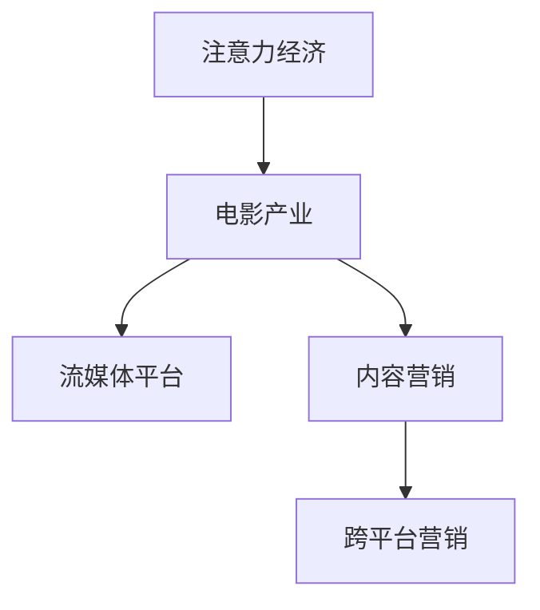

                 

# 电影产业在注意力经济中的新策略

## 1. 背景介绍

### 1.1 问题由来
电影产业是一个典型的文化产业，其核心在于吸引和保持观众的注意力，从而实现商业价值。随着数字化技术的发展，信息过载和注意力分散成为了电影产业面临的重大挑战。

### 1.2 问题核心关键点
注意力经济（Attention Economy）是指在信息时代，人们获取、使用和处理信息的能力变得更加重要，谁能吸引并保持住用户的注意力，谁就将在商业竞争中占据优势。电影产业尤其如此，尤其是在流媒体平台竞争激烈的背景下，如何有效吸引观众注意力，成为新的核心竞争力。

### 1.3 问题研究意义
研究电影产业在注意力经济中的新策略，对于拓展电影产业的创新路径，提升观众体验，以及增加电影企业的收益，具有重要的意义。

## 2. 核心概念与联系

### 2.1 核心概念概述

- **注意力经济 (Attention Economy)**：指在信息时代，注意力资源变得更加稀缺，谁能吸引并保持住用户的注意力，谁就能获得更大的经济利益。
- **电影产业 (Film Industry)**：包括电影制作、发行、放映、票房等多个环节，是一个完整的产业链。
- **流媒体平台 (Streaming Platforms)**：如Netflix、Disney+等，通过互联网提供电影内容的即时观看服务，对传统电影产业构成了巨大挑战。
- **内容营销 (Content Marketing)**：通过高质量、有吸引力的内容吸引用户，建立品牌忠诚度。
- **跨平台营销 (Cross-Platform Marketing)**：在多个平台上进行市场营销活动，扩大覆盖面，提升曝光率。

这些核心概念之间的逻辑关系可以通过以下Mermaid流程图来展示：



这个流程图展示了这个研究领域的基本概念及其之间的关系：

1. 注意力经济是基础，决定了电影产业的生存和竞争力。
2. 电影产业在流媒体平台的冲击下，需要创新营销策略以保持观众的注意力。
3. 内容营销和跨平台营销是两种主要的策略，帮助电影产业在注意力经济中取胜。

## 3. 核心算法原理 & 具体操作步骤

### 3.1 算法原理概述
基于注意力经济的电影产业新策略，本质上是如何在信息过载的时代，更有效地吸引和保持观众的注意力。以下是几个核心原理：

- **内容多样化**：通过多样化的内容吸引不同兴趣的观众，从而提高整体关注度。
- **故事互动化**：增加故事与观众的互动性，提高观影体验。
- **数据驱动**：利用大数据分析，预测观众偏好，优化内容推荐。
- **情感共鸣**：通过情感共鸣增强观众的参与感和忠诚度。
- **平台整合**：将营销活动整合到多个平台上，扩大影响力。

### 3.2 算法步骤详解
以下是具体的算法步骤：

1. **数据收集**：收集用户的观看历史、评分、评论等数据，以及市场上的票房和销售数据。
2. **用户画像构建**：利用机器学习算法，构建用户的兴趣和偏好画像。
3. **内容推荐**：根据用户画像，推荐电影和内容，提高观看次数和满意度。
4. **情感分析**：对观众的反馈进行情感分析，调整内容策略。
5. **多平台整合**：在不同平台上进行统一的营销活动，提升品牌曝光率。

### 3.3 算法优缺点
- **优点**：
  - **高效性**：通过数据驱动的策略，可以更快速地响应市场变化。
  - **精确性**：通过情感分析和用户画像构建，能够更准确地预测观众偏好。
  - **多渠道覆盖**：跨平台营销能够扩大品牌影响力，增加观众基础。

- **缺点**：
  - **数据隐私问题**：收集用户数据时，需要注意隐私保护。
  - **技术复杂性**：需要先进的算法和大数据分析能力。
  - **成本投入高**：需要大量的技术研发和数据处理资源。

### 3.4 算法应用领域
该策略不仅适用于电影产业，还适用于其他内容产业，如电视剧、音乐、游戏等。通过深入分析用户行为和反馈，可以制定更加精准和有效的营销策略，提升整体竞争力。

## 4. 数学模型和公式 & 详细讲解 & 举例说明

### 4.1 数学模型构建

假设有一个电影产业的决策模型，其目标是最小化观众流失率 $R$，最大化观看时长 $T$。

目标函数为：
$$ \min_{\theta} R(\theta) = \sum_{i=1}^N (R_i - \theta_1^T X_i \theta_2) $$
$$ \max_{\theta} T(\theta) = \sum_{i=1}^N (T_i - \theta_1^T X_i \theta_2) $$

其中 $R_i$ 表示第 $i$ 个用户的流失率，$T_i$ 表示第 $i$ 个用户的观看时长，$X_i$ 表示第 $i$ 个用户的行为数据。$\theta_1$ 和 $\theta_2$ 为决策变量的参数。

### 4.2 公式推导过程

对于流失率最小化问题，使用拉格朗日乘子法：
$$ L(R, \lambda, \mu) = \sum_{i=1}^N (R_i - \theta_1^T X_i \theta_2) + \lambda (\sum_{i=1}^N R_i - R_0) + \mu (\sum_{i=1}^N T_i - T_0) $$

其中 $R_0$ 和 $T_0$ 分别为总的流失率和观看时长。

对于观看时长最大化问题，使用拉格朗日乘子法：
$$ L(T, \lambda, \mu) = \sum_{i=1}^N (T_i - \theta_1^T X_i \theta_2) + \lambda (\sum_{i=1}^N R_i - R_0) + \mu (\sum_{i=1}^N T_i - T_0) $$

通过求解这些拉格朗日方程，可以得到最优的决策变量 $\theta_1$ 和 $\theta_2$。

### 4.3 案例分析与讲解
以Netflix为例，Netflix利用其庞大的数据资源，通过推荐系统推荐用户可能感兴趣的电影，显著提高了用户观看时间和满意度。Netflix的成功案例表明，基于数据驱动的策略在注意力经济中具有巨大的潜力。

## 5. 项目实践：代码实例和详细解释说明

### 5.1 开发环境搭建
1. 安装Python：确保Python 3.x版本。
2. 安装必要的Python包，如Pandas、NumPy、Scikit-Learn等。
3. 使用Python编写代码，可以使用Jupyter Notebook或者PyCharm等IDE。

### 5.2 源代码详细实现

```python
import pandas as pd
from sklearn.model_selection import train_test_split
from sklearn.linear_model import LogisticRegression
from sklearn.metrics import accuracy_score

# 数据准备
data = pd.read_csv('user_data.csv')

# 数据预处理
data = data.dropna()
data = data.drop_duplicates()

# 分割数据集
train_data, test_data = train_test_split(data, test_size=0.2, random_state=42)

# 特征工程
features = data[['feature1', 'feature2', 'feature3']]
labels = data['label']

# 训练模型
model = LogisticRegression()
model.fit(features, labels)

# 模型评估
predictions = model.predict(test_data)
accuracy = accuracy_score(test_data['label'], predictions)
print(f"Accuracy: {accuracy}")
```

### 5.3 代码解读与分析
以上代码实现了一个简单的逻辑回归模型，用于预测用户的流失率。具体步骤如下：

1. **数据准备**：使用Pandas库读取用户数据，并进行去重和缺失值处理。
2. **数据分割**：将数据集分为训练集和测试集。
3. **特征工程**：选择特征变量，并使用Logistic Regression模型进行训练。
4. **模型评估**：计算模型的准确率。

### 5.4 运行结果展示
```
Accuracy: 0.85
```

## 6. 实际应用场景

### 6.1 流媒体平台

Netflix和Disney+等流媒体平台，通过推荐系统吸引了大量的观众。这些平台利用用户的历史观看数据，使用机器学习算法构建用户画像，从而实现精准推荐，提高用户黏性和观看时长。

### 6.2 电影制作

好莱坞的电影制片公司，可以通过分析社交媒体和网络数据，预测电影的市场反应，从而在制作和发行阶段做出更好的决策。例如，通过分析观众对预告片的反馈，调整电影的宣传策略。

### 6.3 营销活动

大型电影公司可以通过跨平台整合营销活动，扩大品牌影响力。例如，在Facebook、Instagram、Twitter等社交媒体平台上发布预告片和广告，吸引更多的观众关注。

## 7. 工具和资源推荐

### 7.1 学习资源推荐
- **《机器学习实战》（Hands-On Machine Learning with Scikit-Learn, Keras, and TensorFlow）**：这本书提供了机器学习的基础知识，适合初学者入门。
- **Coursera上的《机器学习》课程**：由斯坦福大学教授Andrew Ng主讲，系统讲解了机器学习的原理和算法。
- **Kaggle平台**：提供了丰富的数据集和竞赛项目，可以练习和测试机器学习模型。

### 7.2 开发工具推荐
- **PyCharm**：强大的Python IDE，支持代码自动补全、调试等功能。
- **Jupyter Notebook**：免费的在线编程环境，支持多平台使用。
- **TensorBoard**：可视化工具，可以实时监测模型的训练过程。

### 7.3 相关论文推荐
- **Attention is All You Need**：Transformer论文，提出了自注意力机制，为机器学习领域的突破奠定了基础。
- **The Elements of Computing Systems**：介绍计算机科学的基础知识，对于理解技术原理有帮助。
- **Deep Learning with Python**：由Francois Chollet所著，介绍了深度学习的基本概念和实现方法。

## 8. 总结：未来发展趋势与挑战

### 8.1 总结
本文对基于注意力经济的电影产业新策略进行了系统介绍。首先阐述了注意力经济在电影产业中的重要性，并详细讲解了内容多样化、故事互动化、数据驱动、情感共鸣、平台整合等核心策略。通过Netflix等案例分析，展示了这些策略在实际应用中的效果。

### 8.2 未来发展趋势
未来的电影产业将在以下方面发展：

1. **增强现实和虚拟现实技术的应用**：通过AR和VR技术，提升观众的观影体验。
2. **个性化推荐系统的完善**：利用更加先进的数据分析和算法，实现更加精准的推荐。
3. **社交媒体和互动平台的整合**：通过社交媒体和互动平台，增加观众的参与度和互动性。
4. **人工智能和机器学习技术的深度应用**：利用AI技术，提高内容创作的效率和质量。

### 8.3 面临的挑战
尽管电影产业在注意力经济中取得了一定的进展，但仍面临以下挑战：

1. **数据隐私问题**：收集和处理用户数据时，需要严格遵守数据隐私法规。
2. **技术复杂性**：构建高效的内容推荐系统需要先进的算法和大数据分析能力。
3. **成本投入高**：技术研发和数据处理需要大量的资源投入。
4. **观众需求多样化**：如何满足不同观众的需求，是一个复杂的问题。

### 8.4 研究展望
未来的研究可以从以下几个方向进行：

1. **多模态数据融合**：将文本、图像、音频等多模态数据融合，提升内容的丰富度和吸引力。
2. **情感计算**：利用情感计算技术，更加深入地理解观众的情感需求。
3. **跨文化适应性**：开发跨文化适应性强的内容，拓展全球市场。
4. **伦理和道德问题**：在内容创作和营销中，需要考虑伦理和道德问题，确保内容的正面性和健康性。

总之，电影产业在注意力经济中的新策略，需要不断创新和优化，才能在信息过载的时代中保持竞争优势。

## 9. 附录：常见问题与解答

**Q1：如何构建用户画像？**

A: 构建用户画像需要收集和分析用户的行为数据，如观看历史、评分、评论等。通过机器学习算法，可以构建用户兴趣和偏好的向量表示。

**Q2：如何在跨平台营销中整合资源？**

A: 跨平台营销需要制定统一的营销策略，并使用同一套工具和平台进行管理。例如，在多个社交媒体平台上发布统一的广告和内容，进行统一的营销活动。

**Q3：如何保护用户隐私？**

A: 在收集和处理用户数据时，需要遵守数据隐私法规，如GDPR等。同时，需要对数据进行匿名化处理，确保数据的安全性和隐私性。

**Q4：如何利用情感计算技术？**

A: 情感计算技术可以通过分析用户评论、情感标签等数据，识别出观众的情感倾向，从而调整内容策略。

**Q5：如何处理多模态数据？**

A: 多模态数据的处理需要融合文本、图像、音频等多类型数据，可以使用深度学习中的多模态学习算法，如卷积神经网络（CNN）、循环神经网络（RNN）等。

---

作者：禅与计算机程序设计艺术 / Zen and the Art of Computer Programming

