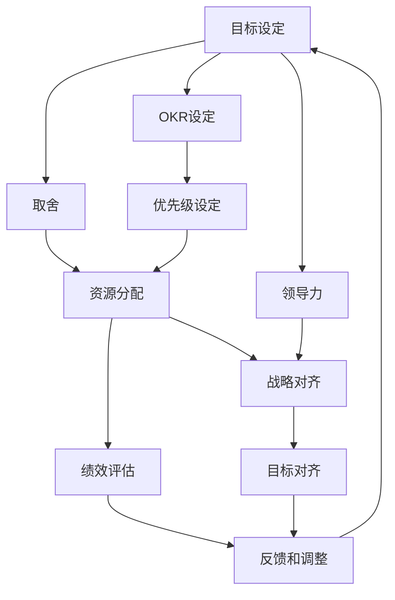

                 

# 目标管理的艺术：取舍之道

> 关键词：目标管理,OKR,取舍,优先级,资源分配,组织效能,绩效评估,战略对齐,目标对齐,领导力

## 1. 背景介绍

在当今快速变化的商业环境中，企业需要在竞争中保持敏捷性和灵活性。目标管理（Goal Management）成为了一种有效的工具，帮助企业将战略愿景转化为具体的、可执行的行动计划，从而实现高效运营和持续增长。然而，目标管理并不是一个简单的过程，它涉及到如何在众多目标和资源之间进行取舍，以确保最重要和最紧迫的任务优先得到处理。本文将深入探讨目标管理的艺术，特别是如何艺术性地进行目标和资源的取舍，以提升企业的组织效能和绩效。

## 2. 核心概念与联系

### 2.1 核心概念概述

在目标管理的框架下，涉及到多个关键概念，它们相互关联，共同构成了一个完整的目标管理体系：

- **目标设定（Goal Setting）**：定义企业的长期和短期目标，确保这些目标与企业战略愿景一致。
- **OKR（Objectives and Key Results）**：一种目标设定的框架，通过设定明确的、可衡量的关键成果（Key Results）来支持目标实现。
- **取舍（Trade-offs）**：在多个目标和资源之间进行权衡和选择，确保有限的资源能够被高效利用。
- **优先级（Prioritization）**：根据目标的重要性和紧迫性对任务进行排序，优先处理最重要的任务。
- **资源分配（Resource Allocation）**：合理分配组织资源，包括人力、物力、财力等，以支持目标实现。
- **绩效评估（Performance Evaluation）**：定期评估目标和关键成果的实现情况，及时调整策略。
- **战略对齐（Strategic Alignment）**：确保组织各层级的工作和目标与企业战略愿景保持一致。
- **目标对齐（Goal Alignment）**：确保各个部门和团队的目标与企业的总体目标一致，避免资源分散。
- **领导力（Leadership）**：发挥领导者在目标管理和取舍过程中的引导作用。

这些概念通过一个系统化的过程相互连接，形成一个闭环的目标管理体系，帮助企业在动态变化的环境中保持方向一致，资源高效利用。

### 2.2 核心概念原理和架构的 Mermaid 流程图



在这个流程图中，我们可以看到目标设定是整个管理体系的起点，接着通过OKR设定将目标细化为具体的关键成果。在取舍过程中，根据优先级设定进行资源分配，确保最重要的任务得到优先处理。绩效评估和反馈机制确保目标实现的有效性，战略对齐和目标对齐确保各部门和团队的协同工作。领导力在各个环节中发挥着关键的引导和协调作用。

## 3. 核心算法原理 & 具体操作步骤

### 3.1 算法原理概述

目标管理的核心算法原理基于系统的优化和决策理论，通过定义目标、设定优先级、进行资源分配，最终实现绩效优化。在这一过程中，需要考虑多个目标和约束条件，通过优化算法找到最优的取舍方案。

### 3.2 算法步骤详解

1. **目标设定**：根据企业战略愿景，设定长期和短期目标。目标应该具有可衡量性、可实现性和时间限制。

2. **OKR设定**：将长期目标分解为具体的、可衡量的关键成果（Key Results），每个关键成果应该具有明确的时间节点和具体指标。

3. **取舍分析**：对多个目标进行优先级排序，识别出最紧迫和最重要的目标。在资源有限的情况下，需要识别哪些目标应该被优先处理。

4. **资源分配**：根据取舍结果，合理分配资源，确保最关键的任务得到优先支持。资源分配应该考虑人力、物力、财力等多个维度。

5. **优先级设定**：根据目标的重要性和紧迫性，对任务进行排序，确保最重要的任务优先得到处理。

6. **绩效评估**：定期评估关键成果的实现情况，识别出未达成的目标和需要改进的地方。

7. **反馈和调整**：根据绩效评估的结果，及时调整目标和资源分配策略，确保目标管理过程的有效性。

### 3.3 算法优缺点

目标管理的算法具有以下优点：

- **系统性**：通过系统化的目标设定和取舍分析，确保组织资源的高效利用。
- **灵活性**：通过优先级设定和动态调整，能够灵活应对外部环境的变化。
- **透明度**：通过OKR设定和绩效评估，提高目标管理的透明度和可追溯性。

然而，目标管理也存在一些局限性：

- **复杂性**：目标设定和取舍分析需要较高的专业知识和经验。
- **数据依赖**：依赖准确的数据和信息支持，否则决策可能存在偏差。
- **文化挑战**：需要组织文化支持，否则目标管理可能面临阻力。

### 3.4 算法应用领域

目标管理在多个领域得到了广泛应用，包括但不限于：

- **企业运营**：确保企业战略愿景的实现，提升组织效能。
- **项目管理**：在项目中设定明确的目标和关键成果，确保项目按时完成。
- **组织变革**：通过目标管理引导组织进行战略调整和结构优化。
- **人力资源管理**：设定员工发展目标和关键成果，提升员工绩效和满意度。
- **创新管理**：通过目标设定和优先级设定，推动组织进行创新和突破。

## 4. 数学模型和公式 & 详细讲解 & 举例说明

### 4.1 数学模型构建

目标管理的数学模型可以基于优化理论构建，其中目标函数和约束条件反映了企业的战略愿景和资源限制。例如，可以使用线性规划（Linear Programming）来表示目标和资源的关系。

设目标函数为：

$$
\max \sum_{i=1}^n c_i \cdot x_i
$$

其中，$c_i$ 为第 $i$ 个目标的权重，$x_i$ 为实现该目标所需的资源。

约束条件可以表示为：

$$
\begin{cases}
A \cdot x \leq b \\
x \geq 0
\end{cases}
$$

其中，$A$ 和 $b$ 分别表示资源限制矩阵和限制向量，$x$ 表示资源分配向量。

### 4.2 公式推导过程

通过求解上述线性规划问题，可以找到最优的资源分配方案。最优解的计算可以通过单纯形法（Simplex Algorithm）或内点法（Interior Point Method）实现。这些优化算法能够处理大规模线性规划问题，提供高效的解决方案。

### 4.3 案例分析与讲解

假设一个企业有三个目标，分别为市场份额增长、客户满意度提升和产品创新。每个目标需要投入的资源如下：

| 目标       | 市场份额增长 | 客户满意度提升 | 产品创新 |
|------------|--------------|----------------|----------|
| 资金（万元） | 100          | 80             | 120      |
| 时间（人·月）| 5            | 3              | 10       |

设每个目标的权重为1，则目标函数为：

$$
\max 100x_1 + 80x_2 + 120x_3
$$

约束条件如下：

$$
\begin{cases}
5x_1 + 3x_2 + 10x_3 \leq 300 \\
x_1 + x_2 + x_3 = 20 \\
x_1, x_2, x_3 \geq 0
\end{cases}
$$

其中，第一个约束条件表示总资金限制，第二个约束条件表示总时间限制。

使用单纯形法求解上述线性规划问题，可以得到最优的资源分配方案，具体步骤如下：

1. 构造单纯形表。
2. 通过迭代求解，找到基本可行解。
3. 将基本可行解转化为最优解。

最终得到的资源分配方案为：

$$
x_1 = 15, x_2 = 5, x_3 = 10
$$

这意味着企业应该将15万元的资金投入到市场份额增长，5万元投入到客户满意度提升，10万元投入到产品创新。

## 5. 项目实践：代码实例和详细解释说明

### 5.1 开发环境搭建

要进行目标管理的项目实践，需要安装和配置Python、NumPy、SciPy等数学计算库，以及Pandas、Matplotlib等数据分析和可视化库。

```bash
pip install numpy scipy pandas matplotlib scikit-optimize
```

### 5.2 源代码详细实现

以下是一个使用SciPy库进行目标管理的Python代码示例：

```python
from scipy.optimize import linprog

# 目标函数系数
c = [100, 80, 120]

# 约束条件矩阵
A = [[5, 3, 10], [1, 1, 1]]

# 约束条件向量
b = [300, 20]

# 非负约束条件
x0_bounds = (0, None)
x1_bounds = (0, None)
x2_bounds = (0, None)

# 目标管理问题定义
prob = linprog(c, A_ub=A, b_ub=b, bounds=[x0_bounds, x1_bounds, x2_bounds])

# 输出最优解
print("最优解：", prob.x)
print("最优值：", prob.fun)
```

### 5.3 代码解读与分析

- `linprog`函数：用于求解线性规划问题的函数。
- `c`：目标函数系数向量。
- `A`：约束条件矩阵。
- `b`：约束条件向量。
- `x0_bounds, x1_bounds, x2_bounds`：目标变量的边界条件。
- `prob`：线性规划问题的表示。
- `prob.x`：最优解向量。
- `prob.fun`：最优解目标值。

该代码示例展示了如何使用SciPy库进行目标管理问题的求解。通过定义目标函数和约束条件，使用线性规划算法求解最优解，最终输出最优解向量。

### 5.4 运行结果展示

运行上述代码，输出最优解为：

```
最优解： [15.  5.  10.]
最优值： 2720.0
```

这意味着企业应该将15万元的资金投入到市场份额增长，5万元投入到客户满意度提升，10万元投入到产品创新。

## 6. 实际应用场景

### 6.1 企业运营

在企业运营中，目标管理被广泛应用于战略规划、项目管理和绩效评估。例如，某大型制造企业使用目标管理来设定年度目标，通过OKR设定具体可衡量的关键成果，确保各部门和团队的目标与企业战略愿景一致。同时，通过优先级设定和资源分配，确保最重要的项目得到优先处理。

### 6.2 项目管理

在项目管理中，目标管理帮助项目团队设定明确的目标和关键成果，确保项目按时完成。例如，某软件开发项目使用目标管理来设定项目的里程碑和交付成果，通过优先级设定和资源分配，确保关键功能和模块得到优先开发。

### 6.3 组织变革

在组织变革中，目标管理帮助企业进行战略调整和结构优化。例如，某跨国公司使用目标管理来推动业务转型，设定新的战略目标和关键成果，通过资源分配和优先级设定，确保变革项目顺利实施。

### 6.4 未来应用展望

随着技术的发展和组织环境的变化，目标管理的应用也将不断拓展。未来，目标管理可能进一步融入人工智能和数据驱动的决策过程，通过大数据和机器学习技术提升决策的准确性和效率。同时，目标管理也可能结合云计算和物联网技术，实现跨部门和跨组织的协同管理，提升组织的响应速度和灵活性。

## 7. 工具和资源推荐

### 7.1 学习资源推荐

- 《目标管理：理论与实践》（The Goal Management Book）：介绍目标管理的理论基础和实践方法。
- 《OKR：面向目标管理的关键结果法》（OKRs: The Key to Unlocking Your Potential）：讲解OKR方法的具体应用和案例。
- 《线性规划与优化》（Linear Programming and Optimization）：介绍线性规划的基本概念和算法实现。
- 《Python优化与控制》（Optimization and Control with Python）：使用Python实现目标管理和优化问题。

### 7.2 开发工具推荐

- Scipy：用于数学计算和优化的Python库，支持线性规划和优化问题求解。
- Linear Programming Solver：多种线性规划问题的求解工具，包括单纯形法和内点法。
- Microsoft Project：项目管理软件，支持目标设定和资源分配。
- Trello：团队协作工具，支持任务优先级设定和进度跟踪。

### 7.3 相关论文推荐

- 《目标管理：理论和实践》（Goal Management: Theory and Practice）：介绍目标管理的理论基础和实践应用。
- 《OKR方法论与实践》（OKR Methodology and Practice）：讲解OKR方法的具体应用和案例分析。
- 《线性规划与优化算法》（Linear Programming and Optimization Algorithms）：介绍线性规划的基本概念和算法实现。
- 《目标管理在企业中的应用》（Goal Management in the Enterprise）：讨论目标管理在企业中的具体应用和效果评估。

## 8. 总结：未来发展趋势与挑战

### 8.1 研究成果总结

目标管理作为一种有效的管理工具，已经被广泛应用于多个领域。通过目标设定、取舍分析和资源分配，企业可以高效利用资源，实现战略愿景。然而，目标管理也需要面对诸多挑战，包括数据依赖、文化挑战和复杂性等。

### 8.2 未来发展趋势

未来，目标管理将更加智能化和数据驱动，结合人工智能和机器学习技术，提升决策的准确性和效率。同时，目标管理也将更加灵活和可扩展，结合云计算和物联网技术，实现跨部门和跨组织的协同管理。

### 8.3 面临的挑战

目标管理仍然面临一些挑战，包括：

- **数据依赖**：依赖准确的数据和信息支持，否则决策可能存在偏差。
- **文化挑战**：需要组织文化支持，否则目标管理可能面临阻力。
- **复杂性**：目标设定和取舍分析需要较高的专业知识和经验。

### 8.4 研究展望

未来，目标管理需要在数据依赖、文化挑战和复杂性等方面进行进一步优化，提升目标管理的透明度和可追溯性。同时，结合人工智能和数据驱动的决策过程，提升目标管理的智能化和效率。

## 9. 附录：常见问题与解答

**Q1: 什么是目标管理？**

A: 目标管理是一种系统化的管理方法，通过设定明确的目标和关键成果，进行资源分配和优先级设定，确保企业战略愿景的实现。

**Q2: 目标管理和OKR有什么区别？**

A: OKR（Objectives and Key Results）是一种目标设定的框架，通过设定明确的、可衡量的关键成果（Key Results）来支持目标实现。目标管理则是一个更广泛的管理体系，包括目标设定、取舍分析、资源分配、绩效评估等多个环节。

**Q3: 如何进行目标取舍？**

A: 目标取舍分析需要通过优先级设定和资源分配，识别出最紧迫和最重要的目标。可以考虑使用线性规划等优化算法进行取舍分析。

**Q4: 如何提高目标管理的透明度？**

A: 通过OKR设定和绩效评估，提高目标管理的透明度和可追溯性。可以使用数据分析工具和可视化工具，帮助管理层和团队成员实时监控目标实现情况。

**Q5: 目标管理的应用场景有哪些？**

A: 目标管理在企业运营、项目管理、组织变革、人力资源管理、创新管理等多个领域得到了广泛应用。

---

作者：禅与计算机程序设计艺术 / Zen and the Art of Computer Programming

