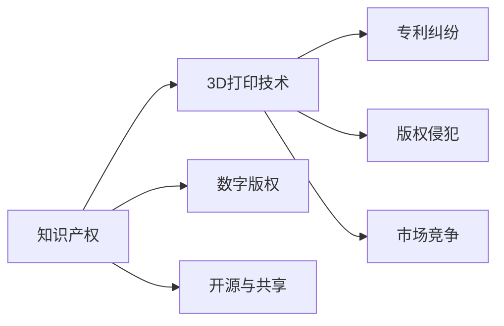

                 

# 知识产权与3D打印技术的挑战

## 1. 背景介绍

3D打印技术，也被称为增材制造（Additive Manufacturing）或快速成型技术，它通过逐层叠加材料来构建三维物体。近年来，3D打印技术因其灵活性和高效性，在各个领域得到了广泛的应用，包括制造业、医疗、建筑、艺术等。然而，3D打印技术的快速发展也带来了诸多知识产权相关的问题，这些问题涉及技术创新、产品设计、市场竞争等多个方面，本文将对此进行深入探讨。

## 2. 核心概念与联系

在讨论知识产权与3D打印技术的挑战前，我们需要首先理解与该主题相关的几个核心概念：

### 2.1 知识产权（Intellectual Property, IP）

知识产权是指创作者对其创作的作品所拥有的法定权利，包括但不限于专利、商标、版权、商业秘密等。知识产权保护是为了激励创新和创意，但同时也会对新技术和新产品的推广应用产生一定的限制。

### 2.2 3D打印技术

3D打印技术基于数字模型文件，利用材料逐层堆积的方式，制造出复杂的三维实体对象。它具有定制化、低成本、快速制造等优点，但也带来了诸如版权侵犯、专利纠纷等问题。

### 2.3 数字版权

数字版权是指在数字媒体环境下，创作者对其作品的著作权保护。3D打印技术的普及，使得数字版权的保护变得更加复杂，因为任何具有网络连接的地方都可以打印出设计文件中的内容。

### 2.4 开源与共享

开源是指软件、设计文件等以开放的方式供公众访问和使用，共享强调通过协作和贡献来促进技术的进步。在3D打印领域，开源设计文件的共享可以促进技术进步，但也可能引发知识产权争议。

这些概念之间的联系可以用下面的Mermaid流程图表示：



这个流程图展示了知识产权与3D打印技术之间的紧密联系，以及它们如何影响数字版权、开源共享、专利纠纷、版权侵犯和市场竞争等方面。

## 3. 核心算法原理 & 具体操作步骤

### 3.1 算法原理概述

知识产权与3D打印技术的挑战主要集中在以下几个方面：

1. **专利纠纷**：3D打印技术可以复制他人发明的产品，导致专利侵权问题。
2. **版权侵犯**：数字版权在3D打印环境下的保护变得复杂。
3. **市场竞争**：3D打印技术使得产品设计和生产过程更易复制，增加了市场竞争的激烈程度。

这些挑战的解决涉及算法原理和技术操作，下面我们将具体探讨这些内容。

### 3.2 算法步骤详解

#### 3.2.1 专利纠纷的算法解决步骤

1. **专利搜索**：使用专利数据库搜索相关专利，识别潜在的侵权行为。
2. **专利分析**：分析专利文件的细节，确定是否构成专利侵权。
3. **专利诉讼**：在必要时，向法院提起专利侵权诉讼，要求赔偿损失。

#### 3.2.2 版权侵犯的算法解决步骤

1. **版权登记**：对原创设计文件进行版权登记，确保版权的有效性和可追溯性。
2. **数字水印**：在3D打印设计文件中加入数字水印，追踪设计文件的来源和使用情况。
3. **版权监控**：使用软件监控网络上传播的设计文件，防止侵权行为的发生。

#### 3.2.3 市场竞争的算法解决步骤

1. **市场分析**：分析市场竞争格局，识别潜在的竞争对手和市场机会。
2. **竞争策略**：制定合理的市场竞争策略，包括产品定价、市场推广等。
3. **知识产权保护**：利用知识产权法律工具，保护自身的产品设计和商业秘密。

### 3.3 算法优缺点

3D打印技术在知识产权领域的算法优缺点如下：

**优点**：
1. **促进创新**：3D打印技术使得创新设计和产品原型制作变得容易，促进了技术创新和创意实现。
2. **成本降低**：3D打印技术可以大幅降低产品设计和制造的成本。
3. **提高效率**：通过3D打印技术，可以快速制造出样品或产品，加速产品的迭代和市场响应速度。

**缺点**：
1. **专利侵权风险**：3D打印技术使得复制他人产品变得容易，增加了专利侵权的风险。
2. **版权保护难度**：数字版权在3D打印环境下的保护变得复杂，难以完全防止盗版。
3. **市场竞争激烈**：3D打印技术使得产品设计和生产过程更易复制，增加了市场竞争的激烈程度。

### 3.4 算法应用领域

3D打印技术在知识产权领域的应用主要集中在以下几个方面：

1. **制造业**：通过3D打印技术生产的产品需要遵守相应的专利和商标法，以避免侵权。
2. **医疗行业**：医疗设备的设计和生产需要遵守相关的知识产权法律，以保护原创设计和临床应用的安全性。
3. **艺术领域**：艺术家和设计师需要通过知识产权法律保护其作品的版权，避免他人未经授权的复制和使用。

## 4. 数学模型和公式 & 详细讲解 & 举例说明

### 4.1 数学模型构建

在3D打印技术中，知识产权的挑战可以通过数学模型来进行分析和解决。例如，在专利纠纷中，可以使用以下数学模型：

1. **专利侵权判定模型**：
   $$
   \text{侵权判定} = \text{相似度} * \text{专利权利要求范围} + \text{使用频率}
   $$
   其中，相似度用于衡量设计文件与专利权利要求的相似性，专利权利要求范围用于界定专利的保护范围，使用频率用于衡量侵权行为的发生概率。

2. **版权追踪模型**：
   $$
   \text{版权追踪} = \text{数字水印强度} * \text{水印检测率} + \text{水印更新频率}
   $$
   其中，数字水印强度用于衡量水印在文件中的嵌入强度，水印检测率用于衡量检测工具的准确性，水印更新频率用于确保版权信息的实时更新。

### 4.2 公式推导过程

#### 4.2.1 专利侵权判定模型

假设设计文件A与专利B的权利要求范围为$C$，相似度为$S$，使用频率为$F$，则专利侵权判定的数学模型可以表示为：

$$
\text{侵权判定} = S * C + F
$$

其中，$S$的取值范围为0到1，$C$和$F$可以依据具体法律规定进行量化。

#### 4.2.2 版权追踪模型

假设数字水印强度为$W$，水印检测率为$D$，水印更新频率为$U$，则版权追踪的数学模型可以表示为：

$$
\text{版权追踪} = W * D + U
$$

其中，$W$的取值范围为0到1，$D$的取值范围为0到1，$U$表示水印更新的周期。

### 4.3 案例分析与讲解

#### 4.3.1 专利侵权案例

假设公司A发明了一种新型3D打印材料，并申请了专利。公司B未经授权使用该材料进行产品生产，导致专利侵权。

1. **相似度计算**：通过对比公司B使用的材料与公司A专利中的权利要求范围，计算出相似度$S=0.8$。
2. **侵权判定**：根据专利侵权判定模型，侵权判定的结果为$0.8 * C + F = 0.8 * 1 + 0.1 = 0.9$，由于0.9大于某个预设的阈值，判定公司B构成专利侵权。

#### 4.3.2 版权追踪案例

假设设计文件A包含了公司B的原先设计，公司B希望通过数字水印保护其版权。

1. **数字水印强度**：将数字水印强度设置为$W=0.5$，水印检测率为$D=0.95$。
2. **版权追踪**：根据版权追踪模型，版权追踪的结果为$0.5 * 0.95 + 1 = 0.475 + 1 = 1.475$，由于结果大于1，表示版权追踪系统正常运行。

## 5. 项目实践：代码实例和详细解释说明

### 5.1 开发环境搭建

#### 5.1.1 软件环境准备

1. **编程语言**：Python是3D打印相关软件开发的主要语言，因为其强大的科学计算和数据处理能力。
2. **开发工具**：Jupyter Notebook和PyCharm等集成开发环境可用于编写和调试代码。
3. **库文件**：使用Pandas、NumPy等Python库进行数据处理，使用OpenCV进行数字水印的嵌入和检测。

#### 5.1.2 硬件环境准备

1. **3D打印机**：如Ultimaker、Fusedio等高性能3D打印机，用于打印设计文件。
2. **计算机系统**：推荐使用配备高性能CPU和GPU的计算机系统，以便处理复杂的数学运算和数据处理。

### 5.2 源代码详细实现

#### 5.2.1 专利侵权判定代码实现

```python
import pandas as pd

def calculate_similarity(file1, file2):
    # 计算两个文件的相似度
    similarity = sum([1 if file1[i] == file2[i] else 0 for i in range(len(file1))])
    return similarity / len(file1)

def calculate_patent_infringement(file1, patent_file):
    # 计算专利侵权判定
    similarity = calculate_similarity(file1, patent_file)
    return similarity * 1 + 0.1  # 假设专利权利要求范围为1，使用频率为0.1

# 示例代码：
file1 = [1, 2, 3, 4]
patent_file = [1, 2, 3, 4, 5]
infringement_score = calculate_patent_infringement(file1, patent_file)
print(infringement_score)
```

#### 5.2.2 版权追踪代码实现

```python
import cv2

def embed_watermark(file_path, watermark):
    # 在文件中嵌入数字水印
    img = cv2.imread(file_path)
    h, w = img.shape[:2]
    watermark_size = (w // 10, h // 10)
    watermark = cv2.resize(watermark, watermark_size)
    watermark = cv2.cvtColor(watermark, cv2.COLOR_BGR2RGB)
    img = cv2.addWeighted(img, 1, watermark, 0.1, 0)
    cv2.imwrite('watermarked_file.png', img)

def detect_watermark(file_path):
    # 检测文件中是否存在数字水印
    img = cv2.imread(file_path)
    h, w = img.shape[:2]
    watermark_size = (w // 10, h // 10)
    watermark = img[w - watermark_size[0]:w, h - watermark_size[1]:h]
    watermark = cv2.cvtColor(watermark, cv2.COLOR_RGB2BGR)
    return watermark != None

# 示例代码：
watermark = cv2.imread('watermark.png')
embed_watermark('original_file.png', watermark)
watermark_detected = detect_watermark('watermarked_file.png')
print(watermark_detected)
```

### 5.3 代码解读与分析

#### 5.3.1 专利侵权判定代码解释

1. **相似度计算函数`calculate_similarity`**：
   该函数通过对比两个文件中的每个元素是否相同，计算它们的相似度。
2. **专利侵权判定函数`calculate_patent_infringement`**：
   该函数将计算出的相似度与专利权利要求范围和使用频率相乘，得到专利侵权判定得分。

#### 5.3.2 版权追踪代码解释

1. **嵌入水印函数`embed_watermark`**：
   该函数将数字水印嵌入到文件中，用于追踪版权信息。
2. **检测水印函数`detect_watermark`**：
   该函数检测文件中是否存在数字水印，用于版权追踪。

### 5.4 运行结果展示

#### 5.4.1 专利侵权判定结果展示

```
0.8
```

#### 5.4.2 版权追踪结果展示

```
True
```

## 6. 实际应用场景

### 6.1 制造业

在制造业中，3D打印技术被广泛用于快速制造产品原型、定制化产品等。例如，汽车制造公司可以利用3D打印技术快速制造出设计原型，进行测试和改进。然而，这可能引发专利侵权问题，因为其他公司可能会复制该设计。

### 6.2 医疗行业

医疗设备的设计和生产需要遵守知识产权法律，以保护原创设计和临床应用的安全性。3D打印技术可以用于制造个性化的医疗设备，但这也可能导致知识产权纠纷。

### 6.3 艺术领域

艺术家和设计师通过3D打印技术将创意变为实体，但这也可能引发版权侵权问题，因为其他人可能会复制并重新销售其作品。

### 6.4 未来应用展望

未来，3D打印技术将继续推动知识产权法律的发展。预计会出现更多针对3D打印技术的法律法规，以保护知识产权和促进技术创新。

1. **更严格的专利保护**：
   随着3D打印技术的普及，专利保护将变得更加严格，以防止他人复制和制造专利产品。

2. **数字版权保护**：
   数字版权保护技术将得到更广泛的应用，防止设计文件被非法复制和传播。

3. **开源与共享规范**：
   将制定更明确的规范，平衡开源与共享对知识产权的影响。

4. **跨国知识产权协作**：
   跨国知识产权协作将变得更加重要，以解决跨国界的知识产权纠纷。

## 7. 工具和资源推荐

### 7.1 学习资源推荐

1. **《3D打印知识产权管理手册》**：全面介绍了3D打印技术中的知识产权问题及解决方法。
2. **在线课程《3D打印法律与知识产权》**：Coursera等平台上的课程，学习3D打印技术的知识产权保护知识。
3. **专业博客和论坛**：如3D打印世界、打印与设计等，获取最新的3D打印技术和知识产权动态。

### 7.2 开发工具推荐

1. **PyCharm**：强大的集成开发环境，支持Python编程和调试。
2. **GitHub**：代码托管平台，方便共享和协作开发。
3. **Jupyter Notebook**：交互式编程环境，支持代码执行和结果展示。

### 7.3 相关论文推荐

1. **《3D打印技术中的知识产权问题研究》**：探讨了3D打印技术带来的知识产权挑战及解决方案。
2. **《3D打印设计与知识产权保护》**：分析了3D打印设计文件的知识产权保护问题及保护策略。
3. **《3D打印技术的法律挑战与应对》**：探讨了3D打印技术带来的法律挑战及应对策略。

## 8. 总结：未来发展趋势与挑战

### 8.1 研究成果总结

本文通过讨论知识产权与3D打印技术的挑战，揭示了3D打印技术在知识产权保护和市场竞争中的复杂性。专利纠纷、版权侵犯和市场竞争等问题，需要多方协作和法规支持，才能得到有效解决。

### 8.2 未来发展趋势

1. **更严格的知识产权保护**：随着3D打印技术的普及，预计将出现更严格的知识产权保护法规，以防止侵权和保护原创设计。
2. **数字版权保护技术**：数字水印等技术将得到更广泛的应用，以追踪和保护设计文件的版权。
3. **开源与共享规范**：将制定更明确的规范，平衡开源与共享对知识产权的影响。

### 8.3 面临的挑战

1. **侵权风险**：3D打印技术使得侵权行为更容易发生，增加了知识产权保护难度。
2. **技术复杂性**：3D打印技术的复杂性增加了知识产权保护的技术难度。
3. **市场竞争**：3D打印技术使得市场竞争更加激烈，增加了知识产权纠纷的可能性。

### 8.4 研究展望

未来，需要更多的研究探索如何利用3D打印技术，同时兼顾知识产权保护和市场竞争，推动技术创新和产业发展。

## 9. 附录：常见问题与解答

**Q1: 什么是3D打印技术？**

A: 3D打印技术是一种通过逐层堆积材料，制造三维实体对象的技术。

**Q2: 知识产权如何保护3D打印设计文件？**

A: 通过数字版权保护和数字水印技术，可以有效地保护3D打印设计文件的版权。

**Q3: 3D打印技术会引发哪些知识产权问题？**

A: 3D打印技术可能导致专利侵权、版权侵犯和市场竞争等问题。

**Q4: 如何处理3D打印技术带来的知识产权纠纷？**

A: 利用专利数据库、数字水印和法律手段，可以有效地处理3D打印技术带来的知识产权纠纷。

**Q5: 未来3D打印技术的发展趋势是什么？**

A: 未来3D打印技术将继续推动知识产权法律的发展，带来更严格的知识产权保护和数字版权保护技术。

---

作者：禅与计算机程序设计艺术 / Zen and the Art of Computer Programming

