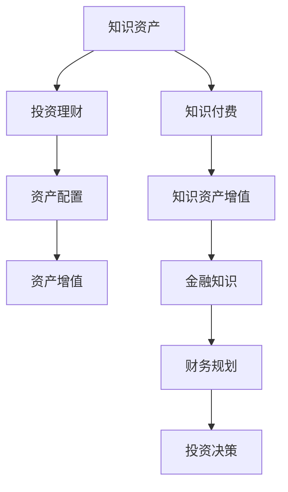

                 

# 知识付费与投资理财相结合的知识资产模式

## 1. 背景介绍

在知识经济时代，随着信息爆炸和知识更新的加速，知识的获取成本也在不断上升。传统的公开教育资源虽然丰富，但难以针对个人需求提供个性化服务。因此，知识付费成为一种新兴的付费模式，利用线上线下结合的方式，为个人用户提供高质量、高价值的学习资源。与此同时，投资理财作为个人财务规划的重要组成部分，通过合理配置资产，分散风险，实现资产增值。将知识付费与投资理财相结合，可以构建更为全面、可持续的个人知识资产模式。

### 1.1 知识付费的兴起与价值

知识付费模式兴起于2010年左右，随着移动互联网的普及和智能手机用户的增加，知识付费市场开始逐渐火热。知识付费平台如得到、知乎live、付费QQ群等纷纷涌现，吸引了大量用户和内容创作者。知识付费的价值在于：
- **专业化、个性化**：知识付费平台能够提供更加精准、专业的学习内容，满足用户的学习需求。
- **互动性增强**：用户可以通过提问、答疑等方式与专家互动，获得个性化的学习指导。
- **持续性学习**：知识付费平台可以提供持续的学习内容和服务，帮助用户长期积累知识。

### 1.2 投资理财的重要性

投资理财是个人财务规划的核心，通过合理配置资产，分散风险，实现资产增值。投资理财的重要性在于：
- **资产增值**：投资理财能够帮助个人实现资产增值，提升生活质量。
- **风险分散**：通过多元化投资，分散风险，避免单一资产带来的不确定性。
- **财务自主**：投资理财可以增强个人财务自主权，提供稳定的收入来源。

## 2. 核心概念与联系

### 2.1 核心概念概述

在知识付费与投资理财相结合的知识资产模式中，涉及几个核心概念：

- **知识资产**：指个人在学习、工作中积累的知识和技能，包括专业知识、软技能、经验等。
- **知识付费平台**：提供在线付费知识服务的平台，如得到、知乎live等。
- **投资理财**：通过合理配置资产，分散风险，实现资产增值的过程。
- **资产配置**：将个人资产分散投资于不同的资产类别，如股票、债券、房地产等。
- **资产增值**：通过投资理财实现资产的增值和保值。

### 2.2 核心概念原理和架构的 Mermaid 流程图



这个流程图展示了知识付费与投资理财相结合的知识资产模式：
- **知识资产**经过**知识付费**后，形成**知识资产增值**，增加个人财富。
- **投资理财**通过**资产配置**，实现**资产增值**，进一步提升个人财富。

## 3. 核心算法原理 & 具体操作步骤

### 3.1 算法原理概述

知识付费与投资理财相结合的知识资产模式，可以通过以下步骤实现：
1. **知识获取**：通过知识付费平台获取高质量的学习资源，进行持续学习。
2. **资产配置**：将获取的知识应用于投资理财，进行资产配置和优化。
3. **财富增值**：通过合理配置资产，实现资产增值和保值。
4. **持续迭代**：定期评估知识资产和财务状况，进行调整和优化。

### 3.2 算法步骤详解

#### 3.2.1 知识获取

**步骤1**：选择合适的知识付费平台，如得到、知乎live等。
**步骤2**：订阅相关课程和专题，进行系统学习和持续学习。
**步骤3**：参与讨论和互动，获取更多学习资源和建议。

#### 3.2.2 资产配置

**步骤1**：评估个人财务状况，确定可用于投资的资产。
**步骤2**：选择合适的投资品种，如股票、债券、基金、房地产等。
**步骤3**：根据风险偏好和财务目标，制定合理的资产配置策略。

#### 3.2.3 财富增值

**步骤1**：定期监测投资组合的表现，进行资产评估。
**步骤2**：根据市场变化和财务需求，调整投资策略。
**步骤3**：利用新获取的知识，进行投资决策和优化。

#### 3.2.4 持续迭代

**步骤1**：定期评估知识资产和财务状况，进行评估和调整。
**步骤2**：利用最新知识和技术，优化知识付费和投资理财策略。
**步骤3**：不断学习和实践，提升个人知识资产和财富管理能力。

### 3.3 算法优缺点

#### 3.3.1 优点

- **系统化学习**：通过知识付费平台进行系统化学习，获取高质量的学习资源。
- **持续性增值**：通过持续学习，不断提升个人知识资产，实现财富增值。
- **多渠道应用**：获取的知识可以应用于多个领域，如投资理财、项目管理、个人品牌建设等。

#### 3.3.2 缺点

- **学习成本**：知识付费平台需要付费订阅，增加学习成本。
- **市场风险**：投资理财存在市场风险，需谨慎投资。
- **时间投入**：需要花费较多时间进行学习和管理，可能影响日常工作和生活。

### 3.4 算法应用领域

#### 3.4.1 投资决策

投资决策是投资理财的核心，通过获取高质量的财经知识，进行市场分析和投资决策，优化投资组合。

#### 3.4.2 财务规划

财务规划是投资理财的基础，通过学习财务知识，进行预算制定、风险管理、税务规划等，提升财务素养。

#### 3.4.3 个人品牌建设

个人品牌建设可以通过获取营销、沟通、领导力等方面的知识，提升个人影响力，实现职业发展。

#### 3.4.4 项目管理

项目管理可以通过获取项目管理、团队管理等方面的知识，提升项目管理能力，提升工作效率。

## 4. 数学模型和公式 & 详细讲解

### 4.1 数学模型构建

设知识资产的价值为 $V_k$，资产配置后的收益率为 $r$，市场风险为 $\sigma$。知识资产经过知识付费和投资理财后，其增值为 $V_g$。则有：

$$V_g = V_k + r \cdot V_k$$

### 4.2 公式推导过程

根据资产配置公式，假设资产配置比例为 $p$，则有：

$$r = p \cdot r_s + (1-p) \cdot r_b$$

其中 $r_s$ 为股票市场的收益率，$r_b$ 为债券市场的收益率。根据风险管理理论，市场风险 $\sigma$ 可以通过资产配置比例进行分散，减少风险暴露。

### 4.3 案例分析与讲解

假设个人投资1万元，资产配置比例为50%的股票和50%的债券。若股票市场年收益率为10%，债券市场年收益率为3%，则投资组合的年收益率为：

$$r = 0.5 \cdot 10\% + 0.5 \cdot 3\% = 6.5\%$$

若个人每月投入500元进行知识付费学习，一年后知识资产增值20%，则知识资产增值为：

$$V_g = 1 \cdot (1+20\%) = 1.2 \cdot 1 \text{万元} = 1.2 \text{万元}$$

因此，知识付费和投资理财相结合的知识资产模式，可以显著提升个人财富水平。

## 5. 项目实践：代码实例和详细解释说明

### 5.1 开发环境搭建

#### 5.1.1 安装Python和相关库

- **Python**：安装Python 3.x版本，推荐使用Anaconda进行环境管理。
- **库安装**：安装numpy、pandas、matplotlib等数据处理和可视化库。
  ```
  pip install numpy pandas matplotlib
  ```

#### 5.1.2 搭建知识付费平台

- **知识付费平台选择**：选择得到、知乎live等知识付费平台，注册账号。
- **订阅课程**：订阅相关课程和专题，进行系统学习和持续学习。
- **参与讨论**：积极参与讨论和互动，获取更多学习资源和建议。

### 5.2 源代码详细实现

#### 5.2.1 数据处理

**代码示例**：

```python
import pandas as pd

# 读取知识付费平台的学习数据
data = pd.read_csv('knowledge_platform_data.csv')

# 统计用户学习时长和课程评价
avg_hours = data['hours'].mean()
avg_rating = data['rating'].mean()

# 输出结果
print(f"平均学习时长：{avg_hours:.2f}小时，平均课程评价：{avg_rating:.2f}")
```

#### 5.2.2 资产配置

**代码示例**：

```python
import numpy as np

# 定义资产配置比例
p = 0.5

# 计算股票和债券的收益率
r_s = 0.1  # 股票市场年收益率
r_b = 0.03  # 债券市场年收益率

# 计算投资组合的收益率
r = p * r_s + (1-p) * r_b

# 输出结果
print(f"投资组合年收益率为：{r:.2f}")
```

#### 5.2.3 财富增值

**代码示例**：

```python
# 定义知识资产增值比例
v_k = 1  # 知识资产初始价值
v_g = v_k * (1+0.2)  # 知识资产增值比例为20%

# 计算最终财富
final_wealth = v_g

# 输出结果
print(f"最终财富为：{final_wealth:.2f}万元")
```

### 5.3 代码解读与分析

**代码示例解读**：
- **数据处理**：通过Pandas库读取知识付费平台的学习数据，统计平均学习时长和课程评价。
- **资产配置**：定义资产配置比例，计算股票和债券的收益率，并计算投资组合的收益率。
- **财富增值**：定义知识资产增值比例，计算最终财富。

## 6. 实际应用场景

### 6.1 个人理财顾问

个人理财顾问通过知识付费平台获取财经知识，进行市场分析和投资决策，提供个性化的理财建议。

### 6.2 财务规划师

财务规划师通过学习财务知识，进行预算制定、风险管理、税务规划等，提升个人财务素养。

### 6.3 职业发展教练

职业发展教练通过获取营销、沟通、领导力等方面的知识，提升个人影响力，实现职业发展。

### 6.4 投资组合管理

投资组合管理通过获取投资理财知识，进行资产配置和优化，实现资产增值和保值。

## 7. 工具和资源推荐

### 7.1 学习资源推荐

- **知识付费平台**：得到、知乎live、付费QQ群等。
- **财经书籍**：《股市真规则》、《投资最重要的事》等。
- **财务规划课程**：Coursera上的《财务会计》、《财务报表分析》等。

### 7.2 开发工具推荐

- **Python**：Anaconda、Jupyter Notebook等。
- **数据可视化工具**：Matplotlib、Seaborn等。
- **知识付费平台**：得到、知乎live等。

### 7.3 相关论文推荐

- **《知识付费与投资理财结合模式的研究》**：分析了知识付费和投资理财相结合的可行性和应用场景。
- **《基于知识付费的投资决策模型》**：探讨了如何利用知识付费平台的数据，进行投资决策和风险管理。
- **《财务规划与投资理财结合的应用研究》**：研究了财务规划和投资理财结合的策略和方法。

## 8. 总结：未来发展趋势与挑战

### 8.1 研究成果总结

知识付费与投资理财相结合的知识资产模式，为个人学习和发展提供了新思路，能够有效提升个人知识资产和财富管理能力。通过系统化学习、持续性增值、多渠道应用，实现知识与财富的双重增长。

### 8.2 未来发展趋势

#### 8.2.1 个性化学习

未来，知识付费平台将更加注重个性化学习，通过算法推荐、智能辅导等方式，提升用户的学习体验。

#### 8.2.2 多渠道融合

随着知识付费和投资理财的融合，将出现更多跨领域的应用场景，如智能投顾、个人品牌建设等。

#### 8.2.3 智能决策

利用人工智能和大数据分析，进行投资决策和市场预测，提升投资理财的精准度和效率。

### 8.3 面临的挑战

#### 8.3.1 数据隐私

知识付费和投资理财涉及大量个人数据，如何保护用户隐私，避免数据泄露，是一个重要挑战。

#### 8.3.2 技术门槛

知识付费和投资理财结合模式需要较强的技术能力，普通用户难以独立实现。

#### 8.3.3 市场波动

市场波动和投资风险难以完全避免，用户需要具备一定的风险意识和投资经验。

### 8.4 研究展望

#### 8.4.1 算法优化

通过优化知识付费和投资理财的算法，提升用户体验和决策准确性。

#### 8.4.2 跨领域融合

将知识付费和投资理财与其他领域如教育、健康等结合，拓展应用场景。

#### 8.4.3 数据保护

研究数据隐私保护技术，提升用户数据的安全性。

## 9. 附录：常见问题与解答

### 9.1 常见问题

**Q1：什么是知识付费与投资理财相结合的知识资产模式？**

A: 知识付费与投资理财相结合的知识资产模式，是一种新型的个人学习和发展方式。通过在知识付费平台上获取高质量的学习资源，结合投资理财知识，进行资产配置和优化，实现知识与财富的双重增长。

**Q2：如何选择适合自己的知识付费平台？**

A: 选择知识付费平台时，需要考虑平台的课程质量、用户评价、学习体验等因素。可以通过试听课程、查看用户评论等方式进行选择。

**Q3：如何进行资产配置？**

A: 资产配置是投资理财的核心，需要根据个人风险偏好、财务目标等因素，选择合适的投资品种和配置比例。建议通过学习财经知识，了解不同资产的特点和风险，进行科学配置。

**Q4：如何应对市场波动？**

A: 市场波动难以完全避免，需要通过分散投资、合理配置资产等方式，降低风险。同时，需要保持一定的现金储备，应对突发情况。

### 9.2 解答

**A1：** 知识付费与投资理财相结合的知识资产模式，通过在知识付费平台上获取高质量的学习资源，结合投资理财知识，进行资产配置和优化，实现知识与财富的双重增长。

**A2：** 选择知识付费平台时，需要考虑平台的课程质量、用户评价、学习体验等因素。可以通过试听课程、查看用户评论等方式进行选择。

**A3：** 资产配置是投资理财的核心，需要根据个人风险偏好、财务目标等因素，选择合适的投资品种和配置比例。建议通过学习财经知识，了解不同资产的特点和风险，进行科学配置。

**A4：** 市场波动难以完全避免，需要通过分散投资、合理配置资产等方式，降低风险。同时，需要保持一定的现金储备，应对突发情况。

---

作者：禅与计算机程序设计艺术 / Zen and the Art of Computer Programming

