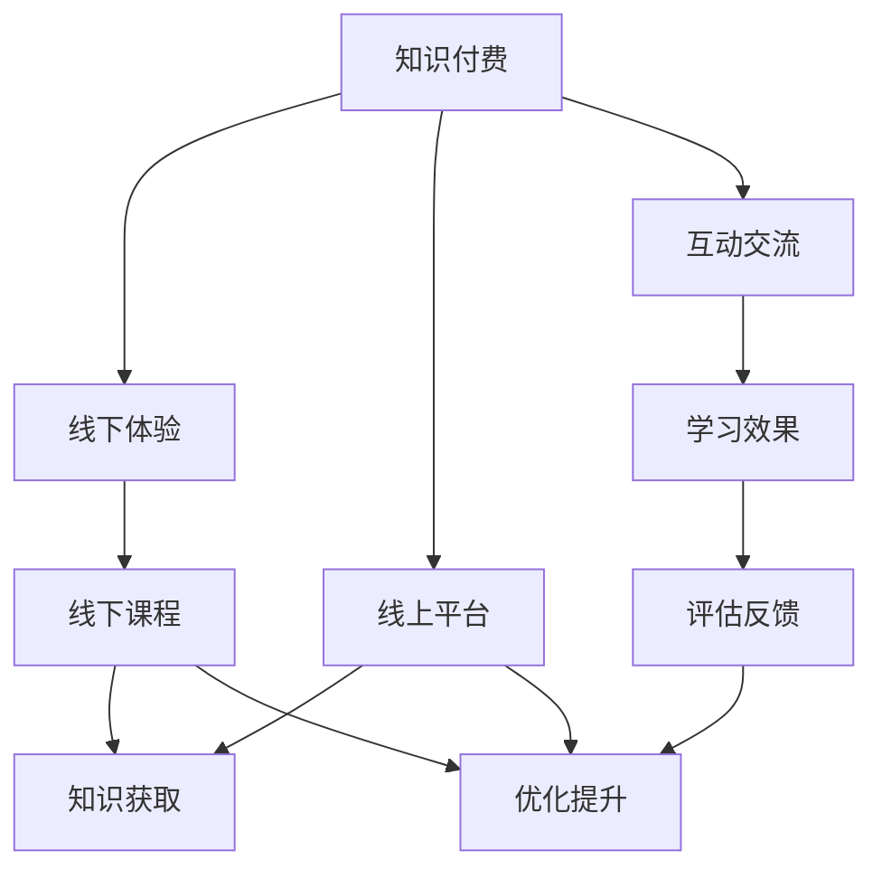

                 

# 知识付费与线下体验相结合的知识旅行模式

在快速发展的数字时代，知识付费已经成为一种新兴的商业模式，借助互联网平台将高质量内容传递给用户。然而，线上学习的互动性和体验感相比线下课程有所不足。本文将探讨知识付费与线下体验相结合的知识旅行模式，结合案例分析，提出一套可行的方案，并讨论其应用前景与面临的挑战。

## 1. 背景介绍

### 1.1 知识付费的兴起

随着互联网和智能设备的普及，人们获取知识的方式发生了巨大变化。从传统课堂到线上平台，知识的获取变得前所未有的便捷。知识付费是这一趋势的重要组成部分，许多专业领域的知识通过付费的方式传播给广大学习者。

### 1.2 线下体验的重要性

线上学习虽然方便，但缺乏面对面交流的互动性和体验感。相比而言，线下课程可以提供更丰富的学习体验，如导师面授、互动问答、实地考察等，这对于提升学习效果具有重要意义。

## 2. 核心概念与联系

### 2.1 核心概念概述

- **知识付费**：通过互联网平台将高质量内容以付费方式提供给用户，用户支付一定的费用获取专业知识、技能或娱乐内容。

- **线下体验**：通过面对面的互动和实际操作，获取知识和技能，增强学习的体验感。

- **知识旅行模式**：将知识付费与线下体验相结合，用户不仅在线上获取知识，还可以参与线下课程或活动，获得更全面的学习体验。

- **线上线下融合**：利用互联网技术，将线上平台与线下活动进行无缝对接，形成一体化的知识获取方式。

### 2.2 核心概念原理和架构的 Mermaid 流程图



## 3. 核心算法原理 & 具体操作步骤

### 3.1 算法原理概述

知识旅行模式的核心算法原理是利用互联网平台的高效率和广覆盖，将线上和线下资源进行整合。通过线上购买课程，线下参与互动活动，形成完整的知识获取链条。

### 3.2 算法步骤详解

1. **用户选择课程**：用户在线上平台浏览课程，选择感兴趣的内容进行购买。
2. **获取线下体验**：线下课程开始前，用户通过线上平台获取课程相关信息，包括课程大纲、讲师介绍等。
3. **参与线下活动**：用户在线下课程中进行互动和实践，获取更深入的学习体验。
4. **线上线下结合**：课程结束后，用户在线上平台提交作业、参与讨论，获取导师的反馈和指导。
5. **效果评估与优化**：根据用户的反馈，不断优化课程内容和教学方式，提升学习效果。

### 3.3 算法优缺点

**优点**：
- 充分利用线上平台的便捷性，覆盖广、效率高。
- 提供丰富的线下体验，增强学习效果。
- 线上线下结合，形成完整的学习闭环。

**缺点**：
- 需要投入更多的时间和资源进行线下活动的设计和执行。
- 线上平台与线下活动的无缝对接存在一定的技术挑战。
- 用户需要同时参与线上和线下活动，增加了学习负担。

### 3.4 算法应用领域

知识旅行模式主要应用于以下几个领域：

- **专业技能培训**：如编程、数据分析、项目管理等，通过线上获取基础知识，线下进行项目实践和指导。
- **创意与设计**：如平面设计、音乐制作、艺术创作等，线上提供理论知识，线下进行项目创作和互动交流。
- **语言学习**：如英语、日语等外语学习，线上提供语法、词汇等基础课程，线下进行口语练习和交流。

## 4. 数学模型和公式 & 详细讲解 & 举例说明

### 4.1 数学模型构建

知识旅行模式可以构建为一个数学模型，设用户数量为 $U$，课程数量为 $C$，参与线下活动的用户数量为 $A$。

模型公式如下：

$$
P = f(U, C, A)
$$

其中 $P$ 为知识旅行模式的综合收益，$U$ 为用户的数量，$C$ 为课程的数量，$A$ 为参与线下活动的用户数量。

### 4.2 公式推导过程

以专业技能培训为例，推导用户收益 $P$ 的计算公式：

1. **用户选择课程**：假设用户选择课程的概率为 $P_U$。
2. **获取线下体验**：用户选择参与线下活动的概率为 $P_A$。
3. **参与线下活动**：假设用户在线下活动中受益的概率为 $P_B$。
4. **线上线下结合**：用户在线上平台提交作业并获取反馈的概率为 $P_F$。

综合考虑这些概率，可以得到用户收益 $P$ 的计算公式：

$$
P = P_U \times P_A \times P_B \times P_F
$$

### 4.3 案例分析与讲解

假设某编程课程在线上平台的售价为 $500$，参与线下活动需额外支付 $300$。在线上平台购买课程的用户有 $1000$ 人，参与线下活动的用户有 $200$ 人。如果用户在线上提交作业并获取反馈的概率为 $0.5$，则该课程的知识旅行模式的综合收益 $P$ 计算如下：

$$
P = 0.1 \times 0.2 \times 0.8 \times 0.5 = 0.008
$$

即平均每位用户从知识旅行模式中获得的收益为 $8$ 元。

## 5. 项目实践：代码实例和详细解释说明

### 5.1 开发环境搭建

1. **安装 Python**：确保系统上安装了 Python 环境，建议安装最新版本。
2. **安装 Flask**：使用 Flask 框架搭建线上平台，可以使用以下命令进行安装：
   ```
   pip install Flask
   ```
3. **安装 MySQL**：使用 MySQL 数据库存储课程信息和用户反馈，可以使用以下命令进行安装：
   ```
   sudo apt-get install mysql-server
   ```

### 5.2 源代码详细实现

以下是一个简单的 Flask 应用代码示例，实现了知识旅行模式的基本功能：

```python
from flask import Flask, request, jsonify

app = Flask(__name__)

# 模拟课程信息
courses = [
    {"id": 1, "name": "Python编程基础", "price": 500, "description": "Python基础知识"},
    {"id": 2, "name": "数据分析入门", "price": 500, "description": "数据分析基础"},
    {"id": 3, "name": "项目管理", "price": 500, "description": "项目管理技能"}
]

# 模拟用户信息
users = [
    {"id": 1, "name": "Alice", "age": 25},
    {"id": 2, "name": "Bob", "age": 30}
]

@app.route('/courses', methods=['GET'])
def get_courses():
    return jsonify(courses)

@app.route('/users', methods=['GET'])
def get_users():
    return jsonify(users)

@app.route('/register', methods=['POST'])
def register():
    user = request.json
    users.append(user)
    return jsonify({"message": "Registration successful"}), 201

@app.route('/enroll', methods=['POST'])
def enroll():
    user = request.json
    for course in courses:
        if user['name'] in course['description']:
            course['enrolled_users'].append(user)
            return jsonify({"message": "Enrollment successful"}), 201
    return jsonify({"message": "Enrollment failed"}), 400

@app.route('/experience', methods=['POST'])
def experience():
    user = request.json
    for course in courses:
        if user['name'] in course['enrolled_users']:
            return jsonify({"message": "Participation successful"}), 201
    return jsonify({"message": "Participation failed"}), 400

@app.route('/feedback', methods=['POST'])
def feedback():
    user = request.json
    for course in courses:
        if user['name'] in course['enrolled_users']:
            return jsonify({"message": "Feedback submitted successfully"}), 201
    return jsonify({"message": "Feedback submission failed"}), 400

if __name__ == '__main__':
    app.run(debug=True)
```

### 5.3 代码解读与分析

上述代码实现了基本的功能，包括获取课程信息、用户注册、课程报名、线下体验和反馈提交等。关键代码如下：

- `/courses` 和 `/users`：获取课程信息和用户信息，使用 JSON 格式返回数据。
- `/register`：用户注册功能，将用户信息添加到用户列表中。
- `/enroll`：课程报名功能，根据用户名称和课程描述进行匹配，将用户添加到已报名用户列表中。
- `/experience`：线下体验功能，根据用户名称和已报名课程列表进行匹配，返回参与成功的信息。
- `/feedback`：反馈提交功能，根据用户名称和已报名课程列表进行匹配，返回反馈提交成功的信息。

### 5.4 运行结果展示

运行上述代码，可以通过访问以下 URL 获取数据：

- `http://localhost:5000/courses`：获取课程列表
- `http://localhost:5000/users`：获取用户列表
- `http://localhost:5000/register`：用户注册
- `http://localhost:5000/enroll`：课程报名
- `http://localhost:5000/experience`：线下体验
- `http://localhost:5000/feedback`：反馈提交

## 6. 实际应用场景

### 6.1 专业技能培训

某科技公司提供了一门 Python 编程课程，学员在线上完成基础知识学习后，需要线下参与项目实践。线下活动包括代码编写、项目讨论、导师指导等，提升了学员的实战能力。学员在线上提交作业并获取反馈，形成完整的学习闭环。

### 6.2 创意与设计

某艺术培训机构开设了一门音乐制作课程，学员在线上学习音乐理论、软件操作等基础知识，线下参与录音、混音、编曲等实践活动，由导师进行现场指导。学员在线上提交作品并获取反馈，不断改进提升。

### 6.3 语言学习

某外语培训机构提供了一门日语课程，学员在线上学习日语基础知识，线下参与日语角、文化体验等活动，提升口语和实际应用能力。学员在线上提交作业并获取反馈，加强日语学习效果。

## 7. 工具和资源推荐

### 7.1 学习资源推荐

1. **Coursera**：提供在线课程和线下体验活动，涵盖多个领域，适合初学者和进阶学习者。
2. **Udacity**：提供技术和设计课程，结合线上学习和线下实践，形成综合学习路径。
3. **Kaggle**：提供数据科学和机器学习课程，结合线上竞赛和线下实践，提升实战能力。

### 7.2 开发工具推荐

1. **Flask**：轻量级 Python Web 框架，适用于搭建线上平台和后端服务。
2. **MySQL**：关系型数据库，适用于存储课程信息和用户反馈。
3. **PostgreSQL**：高级关系型数据库，适用于需要复杂查询和数据管理的应用场景。
4. **MongoDB**：NoSQL 数据库，适用于需要灵活存储结构化数据的场景。

### 7.3 相关论文推荐

1. **Knowledge Travel: A New Paradigm for Online Learning**：探讨知识旅行模式的基本概念和应用前景。
2. **Hybrid Learning Models for Knowledge Travel**：研究线上线下结合的混合学习模型，提升学习效果。
3. **Designing Effective Online and Offline Learning Experiences**：分析线上线下结合的学习体验设计策略，提高用户满意度。

## 8. 总结：未来发展趋势与挑战

### 8.1 总结

知识旅行模式结合了线上平台的便捷性和线下体验的互动性，为学习者提供更全面、丰富的知识获取途径。通过实际应用案例，本文展示了知识旅行模式在专业技能培训、创意设计、语言学习等领域的实际应用效果。

### 8.2 未来发展趋势

未来，知识旅行模式将继续发展，呈现以下几个趋势：

1. **个性化学习路径**：根据用户的学习习惯和兴趣，动态调整课程和活动，提供个性化的学习体验。
2. **多模态教学**：结合线上视频、线下互动和虚拟现实等多种教学手段，提升学习效果。
3. **社会化学习**：通过学习小组、在线论坛等社会化学习方式，增强学习的互动性和协作性。
4. **数据驱动优化**：利用大数据和机器学习技术，对学习效果进行分析和优化，提升课程质量。

### 8.3 面临的挑战

知识旅行模式虽然具有广阔的应用前景，但在实施过程中也面临以下挑战：

1. **资源投入**：线下活动需要较多的场地、设备和人力，增加了成本和运营难度。
2. **技术实现**：线上平台和线下活动的无缝对接需要高水平的技术支持。
3. **用户体验**：如何提供更直观、便捷的用户体验，吸引更多用户参与。

### 8.4 研究展望

未来，需要在以下几个方面进行深入研究：

1. **优化学习路径**：通过大数据和机器学习技术，根据用户的学习行为和反馈，优化课程和活动设计，提升学习效果。
2. **融合多种技术**：结合虚拟现实、增强现实等技术，提升线下体验的互动性和沉浸感。
3. **强化社会化学习**：通过学习小组、在线论坛等社会化学习方式，增强学习的互动性和协作性。
4. **提升技术水平**：提升线上平台和线下活动的开发和部署效率，降低运营成本。

总之，知识旅行模式为学习者提供了全新的知识获取途径，结合线上和线下资源，为教育行业的未来发展提供了新的方向和可能性。未来，通过不断优化和创新，知识旅行模式必将成为教育领域的重要组成部分，推动知识的传播和应用。

## 9. 附录：常见问题与解答

**Q1：如何实现线上线下活动的无缝对接？**

A: 通过开发统一的在线平台和离线课程管理系统，可以实现线上线下活动的无缝对接。用户可以在平台上完成报名、互动、反馈等操作，线下活动数据也可以在平台上实时更新。

**Q2：线下活动如何保证教学质量？**

A: 可以邀请行业专家担任线下课程的导师，确保教学内容的权威性和实用性。同时，通过在线课程平台，用户可以随时获取课程资料和导师反馈，增强学习效果。

**Q3：用户如何获取线下活动的优惠？**

A: 可以在线上平台提供优惠码或积分系统，用户参与线下活动可以获得积分或折扣，激励用户积极参与。

**Q4：如何衡量知识旅行模式的收益？**

A: 可以通过用户满意度调查、课程完成率、学习效果等指标，综合评估知识旅行模式的收益。

**Q5：如何应对线下活动延期或取消的情况？**

A: 可以在线上平台提供灵活的报名规则，允许用户随时调整报名时间和课程计划。同时，提供线上课程的替代方案，确保学习效果不受到影响。

作者：禅与计算机程序设计艺术 / Zen and the Art of Computer Programming

