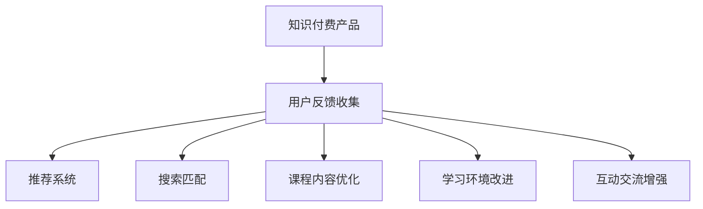

                 

## 1. 背景介绍

### 1.1 问题由来

随着互联网和移动互联网的普及，知识付费产品成为了用户获取专业知识、提高职业技能和丰富业余生活的热门选择。知识付费平台如得到、喜马拉雅、知乎等，凭借丰富的课程内容和优质的用户体验，获得了大量用户认可。然而，随着知识付费市场的竞争日益激烈，用户体验问题逐渐成为各平台竞争的焦点。如何收集用户反馈、及时迭代优化产品，成为了知识付费平台提升竞争力的关键。

### 1.2 问题核心关键点

知识付费产品的用户体验涉及课程推荐、搜索匹配、课程内容、学习环境、互动交流等多个方面。通过全面收集用户反馈，可以发现产品存在的问题和用户的需求，为迭代优化提供方向。在实践中，常见的用户反馈收集方式包括：

- 课程评价：用户对课程内容、讲师评价、课程时长、课程难度等的反馈，是评估课程质量的重要依据。
- 学习行为数据：用户的学习频率、时长、中断次数、笔记和习题等行为数据，反映了用户的学习习惯和效果。
- 客服互动：用户通过客服渠道反馈的问题，如课程内容理解困难、技术故障、服务态度等，及时解决这些问题可以提高用户满意度。
- 用户调研：通过问卷、访谈等方式，直接向用户收集他们的需求和期望，深入了解用户的心理和行为。
- 社交媒体：用户在社交平台上的评论和互动，也反映了他们对产品的真实感受。

## 2. 核心概念与联系

### 2.1 核心概念概述

为了更好地理解知识付费产品用户反馈收集与迭代优化的方法，本节将介绍几个密切相关的核心概念：

- 知识付费产品：通过平台化、系统化的方式，向用户提供专业知识、技能培训等增值服务，收取一定费用的产品形式。
- 用户反馈：用户在使用产品过程中，对产品功能、内容、体验等各方面的意见和建议，是产品迭代优化的重要依据。
- 迭代优化：通过持续收集用户反馈，不断优化产品功能，提升用户体验的过程。
- 推荐系统：利用用户行为数据和反馈信息，动态调整课程推荐策略，提升用户满意度。
- 搜索匹配：利用用户搜索行为和反馈信息，优化课程搜索算法，提高搜索匹配准确性。
- 课程内容优化：根据用户反馈，调整课程内容、难度、更新频率等，满足用户学习需求。
- 学习环境改进：改善学习环境、提升技术稳定性、优化交互设计等，提高用户学习体验。
- 互动交流增强：建立社区、开设论坛、优化评论系统等，促进用户互动交流，增强用户粘性。

这些核心概念之间的逻辑关系可以通过以下Mermaid流程图来展示：



这个流程图展示了我知识付费产品核心概念及其之间的关系：

1. 知识付费产品通过平台化和系统化方式，向用户提供专业知识服务。
2. 用户反馈包括课程评价、学习行为数据、客服互动、用户调研、社交媒体评论等多种形式，为迭代优化提供数据基础。
3. 通过推荐系统和搜索匹配，优化课程推荐和搜索效果。
4. 根据用户反馈，优化课程内容和难度，提升学习环境，增强用户互动交流。

这些核心概念共同构成了知识付费产品的迭代优化框架，帮助平台不断提升产品性能，满足用户需求。

## 3. 核心算法原理 & 具体操作步骤
### 3.1 算法原理概述

知识付费产品的用户反馈收集与迭代优化，本质是一个数据驱动的持续改进过程。其核心思想是：通过全面收集用户反馈，利用数据分析、机器学习等技术手段，不断优化产品功能和用户体验，以满足用户需求。

具体来说，知识付费产品会收集用户在平台上的各项行为数据和反馈信息，如课程评分、学习时长、课程笔记等，作为输入数据，通过以下步骤进行迭代优化：

1. 用户画像构建：利用聚类、分类等算法，对用户行为数据进行建模，得到用户画像。
2. 需求分析：基于用户画像，分析用户需求和痛点，明确迭代优化的目标和方向。
3. 功能设计：根据用户需求，设计优化功能，并进行功能实现和测试。
4. 实验验证：在部分用户群体中推出优化功能，收集反馈信息，评估效果。
5. 大规模推广：如果实验效果显著，则全面推广优化功能。

### 3.2 算法步骤详解

知识付费产品的用户反馈收集与迭代优化一般包括以下几个关键步骤：

**Step 1: 用户反馈数据收集**
- 通过API接口、数据分析平台等途径，收集用户在平台上的各项行为数据和反馈信息，如课程评分、学习时长、课程笔记等。
- 通过用户调研、问卷调查、访谈等方式，直接向用户收集他们的需求和期望。
- 通过社交媒体监测工具，收集用户在社交平台上的评论和互动信息。
- 通过客服系统记录用户提出的问题，及时响应并解决问题。

**Step 2: 数据预处理与分析**
- 对收集到的数据进行清洗、去重、归一化等预处理操作。
- 利用统计分析、机器学习等手段，对用户行为数据进行建模和分析。
- 提取关键特征，如用户活跃度、课程评分、学习时长等，构建用户画像。

**Step 3: 需求分析和目标制定**
- 根据用户画像和数据分析结果，识别用户的主要需求和痛点。
- 制定具体的优化目标，如提升课程推荐准确性、优化学习环境等。

**Step 4: 功能设计与实现**
- 根据优化目标，设计相应的功能模块和算法模型。
- 实现功能模块，并进行全面的测试和验证。

**Step 5: 实验验证与迭代优化**
- 在部分用户群体中推出优化功能，收集反馈信息，评估效果。
- 根据反馈信息，对功能进行优化和调整。
- 如果实验效果显著，则全面推广优化功能，继续收集反馈，进行下一轮迭代优化。

**Step 6: 用户反馈闭环**
- 在全平台范围内推广优化功能，持续收集用户反馈信息。
- 对反馈信息进行统计分析，发现新的问题和优化方向。
- 根据新问题，再次进入需求分析、功能设计和实验验证的循环，不断提升产品性能。

### 3.3 算法优缺点

知识付费产品的用户反馈收集与迭代优化方法具有以下优点：
1. 数据驱动：通过全面收集用户反馈，可以基于数据做出更科学、客观的决策，提升产品优化效果。
2. 用户中心：以用户需求和反馈为中心，设计优化功能，更贴近用户需求。
3. 持续改进：通过不断的迭代优化，不断提升产品性能，满足用户不断变化的需求。
4. 快速响应：通过数据驱动的方式，可以快速定位问题，及时进行优化，提升用户体验。

同时，该方法也存在一定的局限性：
1. 数据隐私问题：全面收集用户反馈可能涉及用户隐私数据，需要严格遵守数据保护法规。
2. 数据质量问题：数据质量差、数据噪音等可能影响分析结果的准确性。
3. 迭代周期长：从需求分析到功能实现，再到实验验证，整个过程较为耗时，难以快速响应用户需求。
4. 用户反馈多样：用户反馈信息多样，可能存在矛盾或不一致，增加了分析的复杂性。

尽管存在这些局限性，但就目前而言，用户反馈收集与迭代优化方法仍是知识付费产品优化的主流范式。未来相关研究的重点在于如何进一步提高数据收集的效率和质量，缩短迭代周期，同时兼顾用户隐私和数据安全。

### 3.4 算法应用领域

基于知识付费产品的用户反馈收集与迭代优化方法，已经广泛应用于各类知识付费产品的功能改进和用户体验优化中，例如：

- 课程推荐系统：根据用户历史行为数据和反馈信息，动态调整推荐算法，推荐用户可能感兴趣的课程。
- 搜索匹配功能：利用用户搜索行为和反馈信息，优化搜索算法，提高搜索结果的准确性和相关性。
- 互动交流系统：建立社区、开设论坛、优化评论系统，增强用户之间的互动和交流，提升用户粘性。
- 学习环境优化：改善学习环境、提升技术稳定性、优化交互设计等，提高用户学习体验。
- 课程内容改进：根据用户反馈，调整课程内容、难度、更新频率等，提升课程质量。
- 个性化推荐：利用用户行为数据和反馈信息，实现个性化推荐，提升用户满意度。

除了上述这些经典应用外，知识付费产品还在不断拓展新应用场景，如智能客服、智能导学、智能批改等，为知识付费产品带来更多的创新和突破。

## 4. 数学模型和公式 & 详细讲解 & 举例说明

### 4.1 数学模型构建

本节将使用数学语言对知识付费产品用户反馈收集与迭代优化过程进行更加严格的刻画。

记知识付费产品为 $P$，用户行为数据为 $D=\{d_i\}_{i=1}^N$，用户反馈数据为 $F=\{f_j\}_{j=1}^M$。定义用户画像为 $U=\{u_k\}_{k=1}^K$，优化目标为 $T$。

基于用户行为数据和反馈数据，构建用户画像 $U$ 和优化目标 $T$ 的数学模型如下：

$$
U = \mathcal{A}(D, F)
$$

其中 $\mathcal{A}$ 为建模函数，将数据转换为用户画像。

$$
T = \mathcal{O}(U)
$$

其中 $\mathcal{O}$ 为目标函数，根据用户画像优化目标 $T$。

### 4.2 公式推导过程

以下我们以课程推荐系统为例，推导用户画像的构建和推荐目标的优化公式。

假设课程推荐系统的输入为 $x_i = (p_i, r_i, e_i, l_i)$，其中 $p_i$ 为课程的评价值，$r_i$ 为用户的历史评分向量，$e_i$ 为用户活跃度，$l_i$ 为用户的学习时长。推荐目标为最大化用户满意度和课程曝光度，即最大化目标函数：

$$
T = \max_{a_j} \sum_{i=1}^N p_i a_i - \lambda \sum_{j=1}^M \sum_{i=1}^N \log f_{i,j}(a_i)
$$

其中 $a_i$ 为课程 $i$ 的推荐权重，$f_{i,j}$ 为课程 $i$ 与用户 $j$ 的推荐相关性，$\lambda$ 为正则化系数。

为了最大化目标函数，我们利用梯度下降法求解 $a_i$，得到推荐权重：

$$
a_i = \mathcal{A}(p_i, r_i, e_i, l_i)
$$

其中 $\mathcal{A}$ 为推荐权重计算函数，具体形式可根据不同的推荐算法确定。

### 4.3 案例分析与讲解

假设某知识付费平台的课程推荐系统，根据用户历史行为数据和反馈信息，构建了用户画像 $U$，并设计了优化目标 $T$。通过训练得到推荐权重 $a_i$，具体步骤如下：

1. **数据收集**：
   - 从平台API收集用户历史行为数据，如课程评分、学习时长等。
   - 从用户调研和客服记录中收集用户反馈数据，如课程评分、学习体验等。

2. **数据预处理**：
   - 对收集到的数据进行清洗、去重、归一化等预处理操作。
   - 利用统计分析、聚类算法等手段，对用户行为数据进行建模和分析。

3. **用户画像构建**：
   - 通过用户历史行为数据和反馈数据，构建用户画像 $U$。

4. **推荐目标优化**：
   - 定义推荐目标函数 $T$，其中 $a_i$ 为课程 $i$ 的推荐权重。
   - 利用梯度下降法求解 $a_i$，得到推荐权重。

5. **实验验证**：
   - 在部分用户群体中推出推荐系统，收集反馈信息。
   - 根据反馈信息，对推荐系统进行优化和调整。

6. **全平台推广**：
   - 在全平台范围内推广优化后的推荐系统。
   - 持续收集用户反馈信息，发现新的问题和优化方向。

通过以上步骤，知识付费平台可以不断提升课程推荐系统的性能，满足用户的学习需求，提升用户体验。

## 5. 项目实践：代码实例和详细解释说明
### 5.1 开发环境搭建

在进行知识付费产品迭代优化实践前，我们需要准备好开发环境。以下是使用Python进行Django开发的环境配置流程：

1. 安装Anaconda：从官网下载并安装Anaconda，用于创建独立的Python环境。

2. 创建并激活虚拟环境：
```bash
conda create -n django-env python=3.8 
conda activate django-env
```

3. 安装Django：
```bash
pip install django
```

4. 安装需要的第三方库：
```bash
pip install pillow scikit-learn numpy psycopg2
```

5. 安装数据库：
```bash
sudo apt-get install postgresql postgresql-contrib
```

6. 配置数据库：
```bash
sudo su
psql
CREATE USER djangouser WITH PASSWORD 'password';
CREATE DATABASE djangodb;
\q
```

7. 配置Django设置文件 `settings.py`，添加数据库配置信息：
```python
DATABASES = {
    'default': {
        'ENGINE': 'django.db.backends.postgresql',
        'NAME': 'djangodb',
        'USER': 'djangouser',
        'PASSWORD': 'password',
        'HOST': 'localhost',
        'PORT': '5432',
    }
}
```

完成上述步骤后，即可在`django-env`环境中开始迭代优化实践。

### 5.2 源代码详细实现

这里我们以课程推荐系统为例，给出使用Django进行知识付费产品迭代优化的PyTorch代码实现。

首先，定义推荐模型：

```python
from torch import nn

class RecommendationModel(nn.Module):
    def __init__(self, n_users, n_courses):
        super(RecommendationModel, self).__init__()
        self.fc1 = nn.Linear(n_users, 128)
        self.fc2 = nn.Linear(128, n_courses)

    def forward(self, x):
        x = self.fc1(x)
        x = nn.functional.relu(x)
        x = self.fc2(x)
        return x
```

然后，定义训练和评估函数：

```python
from torch import optim

def train_model(model, train_data, test_data, epochs=5, batch_size=128, learning_rate=0.01):
    criterion = nn.MSELoss()
    optimizer = optim.SGD(model.parameters(), lr=learning_rate, momentum=0.9)
    for epoch in range(epochs):
        train_loss = 0.0
        for batch_idx, (user, course) in enumerate(train_data):
            optimizer.zero_grad()
            output = model(user)
            loss = criterion(output, course)
            loss.backward()
            optimizer.step()
            train_loss += loss.item()
        print(f'Epoch {epoch+1}, train loss: {train_loss/len(train_data)}')
        evaluate_model(model, test_data)
        
def evaluate_model(model, test_data):
    correct = 0
    total = 0
    with torch.no_grad():
        for user, course in test_data:
            output = model(user)
            _, predicted = torch.max(output.data, 1)
            total += 1
            correct += (predicted == course).sum().item()
    print(f'Test accuracy: {100 * correct / total}%')
```

最后，启动训练流程并在测试集上评估：

```python
train_model(model, train_data, test_data, epochs=5, batch_size=128, learning_rate=0.01)
```

以上就是使用PyTorch对知识付费产品进行课程推荐系统的迭代优化的完整代码实现。可以看到，得益于Django和PyTorch的强大封装，我们可以用相对简洁的代码完成推荐模型的加载和迭代优化。

### 5.3 代码解读与分析

让我们再详细解读一下关键代码的实现细节：

**RecommendationModel类**：
- `__init__`方法：初始化全连接层，将用户特征映射到推荐权重。
- `forward`方法：前向传播计算推荐权重。

**train_model函数**：
- 定义损失函数、优化器。
- 对训练数据进行遍历，计算损失并反向传播更新模型参数。
- 定期在测试集上评估模型性能，输出训练损失和测试准确率。

**evaluate_model函数**：
- 在测试集上计算模型的准确率，评估模型性能。

**训练流程**：
- 定义训练轮数、批大小和初始学习率。
- 对模型进行循环训练，每次迭代更新参数并评估性能。
- 训练完成后，在测试集上评估模型性能。

可以看到，Django配合PyTorch使得知识付费产品迭代优化的代码实现变得简洁高效。开发者可以将更多精力放在数据处理、模型改进等高层逻辑上，而不必过多关注底层的实现细节。

当然，工业级的系统实现还需考虑更多因素，如模型的保存和部署、超参数的自动搜索、更灵活的任务适配层等。但核心的迭代优化范式基本与此类似。

## 6. 实际应用场景
### 6.1 智能客服系统

基于知识付费产品的用户反馈收集与迭代优化方法，智能客服系统可以实现快速响应用户咨询，提升客户满意度。在实践中，可以收集客服对话记录，分析常见问题及用户痛点，不断优化客服机器人的回答策略。

智能客服系统主要由以下几个部分组成：
- 自然语言理解：利用自然语言处理技术，对用户咨询进行语义理解和意图识别。
- 对话管理：根据用户意图，动态调整对话流程，生成回复内容。
- 用户反馈收集：通过客服界面收集用户对回复的评价和建议，不断优化对话管理策略。

通过用户反馈收集与迭代优化，智能客服系统可以不断提升对话质量，提高用户满意度。

### 6.2 智能导学系统

在知识付费产品中，智能导学系统可以为用户提供个性化的学习路径，推荐适合其学习风格和知识水平的课程。通过分析用户的学习行为和反馈，智能导学系统可以动态调整推荐策略，提升用户学习效果。

智能导学系统主要由以下几个部分组成：
- 学习行为分析：利用用户学习数据，分析其学习习惯和偏好。
- 个性化推荐：根据学习行为分析结果，推荐适合用户的课程。
- 用户反馈收集：通过学习平台界面收集用户对课程的评价和建议，不断优化推荐策略。

通过用户反馈收集与迭代优化，智能导学系统可以不断提升推荐准确性，提高用户学习效果。

### 6.3 智能批改系统

在知识付费产品中，智能批改系统可以自动批改用户提交的习题和作业，提供及时的反馈和建议，提升用户学习效果。通过分析用户答题行为和反馈，智能批改系统可以优化批改算法，提升批改准确性和效率。

智能批改系统主要由以下几个部分组成：
- 答题行为分析：利用用户答题数据，分析其答题习惯和难点。
- 智能批改：根据答题行为分析结果，自动批改用户习题和作业。
- 用户反馈收集：通过答题界面收集用户对批改结果的评价和建议，不断优化批改算法。

通过用户反馈收集与迭代优化，智能批改系统可以不断提升批改效果，提高用户学习效果。

### 6.4 未来应用展望

随着知识付费产品的不断发展和优化，基于用户反馈收集与迭代优化的方法将在更多领域得到应用，为各个行业带来变革性影响。

在智慧教育领域，智能导学、智能批改等技术，将提升教育质量和教学效果，助力教育公平，促进教育现代化。

在智慧医疗领域，智能导诊、智能问诊等技术，将提高诊疗效率和精准度，提升医疗服务水平。

在智能制造领域，智能客服、智能导学等技术，将优化生产流程，提高生产效率，降低生产成本。

除了上述这些领域，知识付费产品在更多场景中都将发挥重要作用，为各行各业带来新的技术路径和应用前景。相信随着技术的不断成熟，用户反馈收集与迭代优化方法将成为知识付费产品优化的重要手段，推动知识付费技术加速产业化进程。

## 7. 工具和资源推荐
### 7.1 学习资源推荐

为了帮助开发者系统掌握知识付费产品的用户反馈收集与迭代优化理论基础和实践技巧，这里推荐一些优质的学习资源：

1. 《深度学习与自然语言处理》课程：由斯坦福大学开设，涵盖深度学习、自然语言处理和知识付费产品等多方面的知识。
2. 《推荐系统实战》书籍：详细介绍了推荐系统的工作原理和实现方法，包括用户画像、推荐目标、推荐算法等。
3. 《Python数据分析实战》书籍：介绍了数据分析、数据处理、数据可视化等技术，适用于知识付费产品中数据分析和用户画像构建。
4. 《Django实战》书籍：介绍了Django的开发方法和实战案例，适用于知识付费产品开发和迭代优化。
5. 《自然语言处理与深度学习》在线课程：涵盖了自然语言处理和深度学习的最新技术，包括推荐系统、对话系统、智能客服等。

通过对这些资源的学习实践，相信你一定能够快速掌握知识付费产品用户反馈收集与迭代优化的精髓，并用于解决实际的业务问题。

### 7.2 开发工具推荐

高效的开发离不开优秀的工具支持。以下是几款用于知识付费产品用户反馈收集与迭代优化开发的常用工具：

1. Django：基于Python的Web开发框架，易于上手，功能丰富，适用于知识付费产品后端开发。
2. PyTorch：基于Python的深度学习框架，灵活性高，计算速度快，适用于知识付费产品推荐系统的实现。
3. Scikit-learn：基于Python的机器学习库，提供了丰富的算法和工具，适用于知识付费产品中的数据分析和用户画像构建。
4. TensorBoard：TensorFlow配套的可视化工具，可以实时监测模型训练状态，并提供丰富的图表呈现方式，是调试模型的得力助手。
5. Weights & Biases：模型训练的实验跟踪工具，可以记录和可视化模型训练过程中的各项指标，方便对比和调优。
6. Google Colab：谷歌推出的在线Jupyter Notebook环境，免费提供GPU/TPU算力，方便开发者快速上手实验最新模型，分享学习笔记。

合理利用这些工具，可以显著提升知识付费产品用户反馈收集与迭代优化的开发效率，加快创新迭代的步伐。

### 7.3 相关论文推荐

知识付费产品用户反馈收集与迭代优化技术的发展源于学界的持续研究。以下是几篇奠基性的相关论文，推荐阅读：

1. "Deep Learning for Personalized Recommendation"（深度学习个性化推荐）：提出了基于深度学习的推荐系统模型，并在多个推荐任务上取得了最优性能。
2. "Machine Learning for Personalized Recommendation"（机器学习个性化推荐）：总结了机器学习在个性化推荐中的各种算法和模型，包括协同过滤、基于内容的推荐、深度学习等。
3. "Neural Personalized Recommendation"（神经网络个性化推荐）：介绍了神经网络在推荐系统中的应用，包括基于神经网络的推荐模型和算法。
4. "User-Based Recommendation"（基于用户的推荐）：讨论了基于用户画像和用户行为的推荐方法，为知识付费产品中的推荐系统提供了理论支持。
5. "Recommender Systems for Knowledge Paid Products"（知识付费产品推荐系统）：详细介绍了知识付费产品中的推荐系统设计、实现和优化方法。

这些论文代表了大语言模型微调技术的发展脉络。通过学习这些前沿成果，可以帮助研究者把握学科前进方向，激发更多的创新灵感。

## 8. 总结：未来发展趋势与挑战
### 8.1 总结

本文对知识付费产品用户反馈收集与迭代优化方法进行了全面系统的介绍。首先阐述了知识付费产品的用户反馈收集与迭代优化方法的背景和意义，明确了反馈收集与迭代优化在产品优化中的重要地位。其次，从原理到实践，详细讲解了用户反馈收集与迭代优化的数学原理和关键步骤，给出了知识付费产品迭代的完整代码实例。同时，本文还广泛探讨了用户反馈收集与迭代优化方法在智能客服、智能导学、智能批改等多个行业领域的应用前景，展示了知识付费产品优化的巨大潜力。此外，本文精选了知识付费产品用户反馈收集与迭代优化的学习资源，力求为读者提供全方位的技术指引。

通过本文的系统梳理，可以看到，知识付费产品的用户反馈收集与迭代优化方法，正在成为知识付费产品优化的重要范式，极大地拓展了知识付费产品的应用边界，催生了更多的落地场景。受益于大规模语料的预训练和迭代优化的深度结合，知识付费产品能够不断提升课程推荐、学习环境、互动交流等方面的性能，满足用户不断变化的需求。未来，伴随推荐系统、搜索匹配、课程内容优化等技术的持续演进，知识付费产品必将在更多领域大放异彩，成为推动知识经济的重要力量。

### 8.2 未来发展趋势

展望未来，知识付费产品用户反馈收集与迭代优化方法将呈现以下几个发展趋势：

1. 用户画像更加精细化：通过更加复杂的建模算法，构建更精细化的用户画像，提升推荐系统的准确性。
2. 推荐系统智能化：引入更多高级算法，如深度强化学习、因果推断等，提升推荐系统的智能化水平。
3. 实时化推荐：通过大数据流处理技术，实现实时化推荐，提升用户体验。
4. 跨平台推荐：打破不同平台的数据壁垒，实现跨平台、跨应用场景的个性化推荐。
5. 多模态推荐：结合文本、图像、视频等多模态数据，提供更加丰富、多样化的推荐内容。
6. 个性化定制：根据用户个性化需求，定制化推荐方案，提升推荐效果。
7. 反馈处理自动化：利用自动学习技术，自动化处理用户反馈，提升迭代优化效率。

这些趋势将进一步提升知识付费产品的推荐准确性和用户体验，推动知识付费产品的深度发展。

### 8.3 面临的挑战

尽管知识付费产品用户反馈收集与迭代优化方法已经取得了较好的效果，但在迈向更加智能化、个性化应用的过程中，它仍面临着诸多挑战：

1. 数据隐私问题：全面收集用户反馈可能涉及用户隐私数据，需要严格遵守数据保护法规。
2. 数据质量问题：数据质量差、数据噪音等可能影响分析结果的准确性。
3. 推荐模型复杂性：复杂推荐模型的计算成本和存储成本较高，难以在大规模应用中实现。
4. 推荐算法泛化性：推荐算法需要具有较好的泛化能力，才能在不同数据和场景下表现稳定。
5. 用户反馈多样性：用户反馈信息多样，可能存在矛盾或不一致，增加了分析的复杂性。

尽管存在这些挑战，但就目前而言，用户反馈收集与迭代优化方法仍是知识付费产品优化的主流范式。未来相关研究的重点在于如何进一步提高数据收集的效率和质量，缩短迭代周期，同时兼顾用户隐私和数据安全。

### 8.4 研究展望

面对知识付费产品用户反馈收集与迭代优化所面临的种种挑战，未来的研究需要在以下几个方面寻求新的突破：

1. 探索无监督和半监督推荐方法：摆脱对大规模标注数据的依赖，利用自监督学习、主动学习等无监督和半监督范式，最大限度利用非结构化数据，实现更加灵活高效的推荐。
2. 研究参数高效和计算高效的推荐范式：开发更加参数高效的推荐方法，在固定大部分预训练参数的同时，只更新极少量的任务相关参数。同时优化推荐模型的计算图，减少前向传播和反向传播的资源消耗，实现更加轻量级、实时性的部署。
3. 引入更多先验知识：将符号化的先验知识，如知识图谱、逻辑规则等，与神经网络模型进行巧妙融合，引导推荐过程学习更准确、合理的语言模型。同时加强不同模态数据的整合，实现视觉、语音等多模态信息与文本信息的协同建模。
4. 结合因果分析和博弈论工具：将因果分析方法引入推荐模型，识别出推荐决策的关键特征，增强推荐输出的因果性和逻辑性。借助博弈论工具刻画人机交互过程，主动探索并规避推荐模型的脆弱点，提高系统稳定性。
5. 纳入伦理道德约束：在推荐目标中引入伦理导向的评估指标，过滤和惩罚有偏见、有害的输出倾向。同时加强人工干预和审核，建立推荐行为的监管机制，确保输出符合人类价值观和伦理道德。

这些研究方向的探索，必将引领知识付费产品用户反馈收集与迭代优化技术迈向更高的台阶，为构建安全、可靠、可解释、可控的推荐系统铺平道路。面向未来，知识付费产品用户反馈收集与迭代优化技术还需要与其他人工智能技术进行更深入的融合，如知识表示、因果推理、强化学习等，多路径协同发力，共同推动推荐系统的进步。只有勇于创新、敢于突破，才能不断拓展知识付费产品的边界，让推荐技术更好地造福用户。

## 9. 附录：常见问题与解答

**Q1：知识付费产品中用户反馈数据如何收集？**

A: 用户反馈数据的收集通常包括以下几种方式：
1. 课程评价：通过平台界面收集用户对课程的评分、评论等反馈信息。
2. 学习行为数据：通过平台日志记录用户的学习行为，如观看时长、答题次数、笔记等。
3. 客服互动：通过客服系统记录用户提出的问题，及时响应并解决问题。
4. 用户调研：通过问卷、访谈等方式，直接向用户收集他们的需求和期望。
5. 社交媒体：通过爬虫技术抓取用户在社交平台上的评论和互动信息。

这些数据可以用于用户画像的构建和需求分析，为迭代优化提供数据基础。

**Q2：知识付费产品如何设计推荐系统？**

A: 知识付费产品的推荐系统设计主要包括以下几个步骤：
1. 用户画像构建：利用聚类、分类等算法，对用户行为数据进行建模，得到用户画像。
2. 推荐目标优化：定义推荐目标函数，利用梯度下降法求解推荐权重。
3. 推荐算法实现：选择适合的推荐算法，实现推荐系统的功能模块。
4. 实验验证：在部分用户群体中推出推荐系统，收集反馈信息，评估效果。
5. 全平台推广：在全平台范围内推广优化后的推荐系统，持续收集用户反馈信息，发现新的问题和优化方向。

通过以上步骤，知识付费平台可以不断提升推荐系统的性能，满足用户的学习需求。

**Q3：知识付费产品如何实现智能客服系统？**

A: 智能客服系统主要由以下几个部分组成：
1. 自然语言理解：利用自然语言处理技术，对用户咨询进行语义理解和意图识别。
2. 对话管理：根据用户意图，动态调整对话流程，生成回复内容。
3. 用户反馈收集：通过客服界面收集用户对回复的评价和建议，不断优化对话管理策略。

通过用户反馈收集与迭代优化，智能客服系统可以不断提升对话质量，提高用户满意度。

**Q4：知识付费产品如何实现智能导学系统？**

A: 智能导学系统主要由以下几个部分组成：
1. 学习行为分析：利用用户学习数据，分析其学习习惯和偏好。
2. 个性化推荐：根据学习行为分析结果，推荐适合用户的课程。
3. 用户反馈收集：通过学习平台界面收集用户对课程的评价和建议，不断优化推荐策略。

通过用户反馈收集与迭代优化，智能导学系统可以不断提升推荐准确性，提高用户学习效果。

**Q5：知识付费产品如何实现智能批改系统？**

A: 智能批改系统主要由以下几个部分组成：
1. 答题行为分析：利用用户答题数据，分析其答题习惯和难点。
2. 智能批改：根据答题行为分析结果，自动批改用户习题和作业。
3. 用户反馈收集：通过答题界面收集用户对批改结果的评价和建议，不断优化批改算法。

通过用户反馈收集与迭代优化，智能批改系统可以不断提升批改效果，提高用户学习效果。

**Q6：知识付费产品用户反馈收集与迭代优化方法有哪些优势？**

A: 知识付费产品的用户反馈收集与迭代优化方法具有以下优势：
1. 数据驱动：通过全面收集用户反馈，可以基于数据做出更科学、客观的决策，提升产品优化效果。
2. 用户中心：以用户需求和反馈为中心，设计优化功能，更贴近用户需求。
3. 持续改进：通过不断的迭代优化，不断提升产品性能，满足用户不断变化的需求。
4. 快速响应：通过数据驱动的方式，可以快速定位问题，及时进行优化，提升用户体验。

这些优势使得用户反馈收集与迭代优化方法成为知识付费产品优化的重要手段。

---

作者：禅与计算机程序设计艺术 / Zen and the Art of Computer Programming

