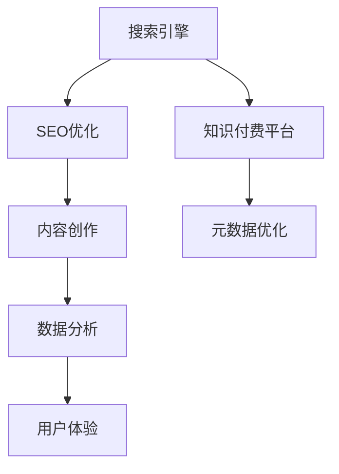

                 

# 知识付费内容的SEO优化策略

> 关键词：知识付费, SEO优化, 搜索引擎, 内容创作, 数据分析, 用户体验, 元数据优化

## 1. 背景介绍

### 1.1 问题由来
随着互联网技术的迅猛发展，知识付费平台成为了越来越多人获取知识和技能的重要渠道。然而，在知识付费的海洋中，如何吸引和留住用户，如何提高用户对平台的粘性，如何实现商业变现，成为知识付费平台必须面对的挑战。SEO（搜索引擎优化）作为互联网营销的重要手段，能够帮助知识付费内容获得更高的搜索排名，从而吸引更多的流量，带来更多的商业机会。

### 1.2 问题核心关键点
本文聚焦于知识付费内容的SEO优化策略，通过分析搜索引擎的工作原理、用户搜索行为，以及知识付费内容的特点，提出了一套系统化的SEO优化方案，帮助知识付费平台提升搜索排名，吸引更多的用户访问。

## 2. 核心概念与联系

### 2.1 核心概念概述

为更好地理解知识付费内容的SEO优化策略，本节将介绍几个密切相关的核心概念：

- 搜索引擎（Search Engine）：利用爬虫技术收集互联网上的信息，并根据算法对这些信息进行排序和索引，使用户可以通过关键词查询获得相关信息的工具。
- SEO（Search Engine Optimization）：通过优化网站结构和内容，使其在搜索引擎中排名更高的技术。
- 知识付费平台（Knowledge Paywall Platform）：为用户提供有偿获取专业知识、技能、经验等服务，以知识为商品的交易平台。
- 内容创作（Content Creation）：为知识付费平台提供原创、优质、高价值的内容，是SEO优化的核心。
- 数据分析（Data Analysis）：通过收集、分析和解读数据，指导SEO策略的制定和优化。
- 用户体验（User Experience, UX）：指用户在使用知识付费平台时的主观体验，包括界面设计、交互流程、加载速度等方面。
- 元数据（Metadata）：描述网页内容、主题、结构等信息的标签，搜索引擎通过元数据来决定网页的权重和排序。

这些核心概念之间的逻辑关系可以通过以下Mermaid流程图来展示：



这个流程图展示了我们要研究的核心概念及其之间的关系：

1. 搜索引擎通过爬虫抓取和索引知识付费平台的内容，并根据SEO优化的结果进行排序。
2. 内容创作是SEO优化的基础，高质量的内容能吸引用户关注和分享。
3. 数据分析通过用户行为数据的分析，指导SEO策略的制定和优化。
4. 用户体验直接影响用户的粘性和满意度，优化用户体验能提升SEO效果。
5. 元数据优化通过合理设置标签和描述，提升内容在搜索引擎中的排名。

这些概念共同构成了知识付费内容SEO优化的框架，使得优化策略更具针对性和系统性。

## 3. 核心算法原理 & 具体操作步骤
### 3.1 算法原理概述

知识付费内容的SEO优化，本质上是通过对内容、元数据、用户体验等各个维度的优化，提升内容在搜索引擎中的可见性和用户点击率，从而实现更高的搜索引擎排名。核心思想是：

1. **提高内容的可搜索性**：通过优化内容的关键词、标题、摘要等元数据，提升搜索引擎对内容的理解和索引。
2. **优化用户体验**：通过优化网站结构和页面加载速度，提升用户体验，从而提升用户停留时间和用户粘性。
3. **数据分析指导**：通过分析用户行为数据，了解用户需求和搜索习惯，指导SEO策略的调整和优化。

### 3.2 算法步骤详解

基于上述核心思想，知识付费内容的SEO优化一般包括以下几个关键步骤：

**Step 1: 数据收集与分析**
- 收集知识付费平台的用户行为数据，包括搜索记录、浏览路径、点击行为等。
- 使用数据分析工具（如Google Analytics、百度统计等）分析用户行为模式，识别用户兴趣和需求。

**Step 2: 关键词研究和选择**
- 通过工具（如Google Keyword Planner、百度关键词工具等）进行关键词研究，确定高搜索量且与知识付费平台内容相关的高质量关键词。
- 结合用户行为数据，进一步筛选出用户感兴趣且高频搜索的关键词。

**Step 3: 内容优化**
- 根据关键词优化内容的标题、摘要、正文，确保内容与关键词高度相关。
- 使用长尾关键词和专业术语，增加内容的深度和专业性。
- 优化页面结构，确保内容易于阅读和理解。

**Step 4: 用户体验优化**
- 优化网站加载速度，减少页面加载时间。
- 优化页面布局和交互设计，提升用户体验。
- 优化移动端适配，提升在移动设备上的访问体验。

**Step 5: 元数据优化**
- 合理设置标题标签（Title）、描述标签（Meta Description）、关键词标签（Meta Keywords）等元数据，提升内容的搜索引擎可见性。
- 使用标准化的元数据格式，确保搜索引擎可以正确理解和索引内容。

**Step 6: 数据分析和调整**
- 定期监控搜索引擎排名和流量变化，分析数据找出优化效果不佳的原因。
- 根据数据分析结果，调整SEO策略，持续优化内容和体验。

### 3.3 算法优缺点

知识付费内容的SEO优化方法具有以下优点：
1. **提升搜索排名**：通过优化内容和用户体验，有效提升搜索引擎排名，吸引更多流量。
2. **提高用户粘性**：提升用户体验，增加用户停留时间和转化率。
3. **实现商业变现**：优化后的内容更具吸引力，提升商业广告和付费订阅的点击率。

同时，该方法也存在一定的局限性：
1. **需要持续投入**：SEO优化是一个持续的过程，需要定期监测和调整策略，投入大量时间和资源。
2. **效果难以量化**：SEO优化效果受多方面因素影响，难以量化评估其对平台商业变现的直接贡献。
3. **用户需求变化**：搜索引擎算法不断更新，用户搜索行为也在变化，需要不断调整优化策略以适应新变化。

尽管存在这些局限性，但就目前而言，SEO优化仍是知识付费平台提升搜索排名和商业变现的重要手段。未来相关研究的方向可能在于如何结合AI和大数据技术，更智能地优化SEO策略，实现更精准的内容推荐和流量引导。

### 3.4 算法应用领域

知识付费内容的SEO优化方法在多个领域都有广泛应用，例如：

- 教育培训：通过优化课程内容、讲师介绍、学习路径等，提升搜索引擎排名，吸引更多学习者访问。
- 专业技能培训：优化技能培训内容，吸引专业人士和技能爱好者进行付费订阅。
- 技术分享：通过优化技术博客、技术分享视频等，提升搜索引擎排名，吸引技术开发者关注。
- 职场发展：优化职业规划、面试技巧、简历优化等资源，帮助求职者提升竞争力。
- 生活娱乐：优化生活技巧、健康养生、旅游攻略等内容，吸引广泛的受众群体。

除了这些常见应用外，知识付费内容在法律、金融、医疗等领域的SEO优化也具有很高的价值，能显著提升平台在相关领域的知名度和影响力。

## 4. 数学模型和公式 & 详细讲解  
### 4.1 数学模型构建

SEO优化涉及多个维度的数据和行为分析，建立一个数学模型可以更系统地指导优化过程。以下是一个简化的SEO优化数学模型：

假设知识付费平台上有 $N$ 个内容，每个内容 $i$ 的关键词权重为 $w_i$，标题标签为 $T_i$，描述标签为 $D_i$，点击率（CTR）为 $C_i$，访问量（PV）为 $V_i$。目标是最大化搜索引擎排名 $R$，则模型如下：

$$
\max_{w_i, T_i, D_i} R = f(w_i, T_i, D_i, C_i, V_i)
$$

其中，$f$ 为搜索引擎排名函数，可能包括关键词匹配度、用户点击率、页面访问量等多种因素的综合评估。

### 4.2 公式推导过程

以用户点击率 $CTR$ 为例，推导一个简化版的点击率计算公式。假设用户通过关键词 $k$ 搜索到内容 $i$，则点击率 $CTR_i$ 计算如下：

$$
CTR_i = \frac{C_i}{V_i} = \frac{点击次数}{访问量}
$$

由于用户点击行为受多方面因素影响，实际计算中需要考虑用户行为数据、关键词匹配度、页面质量等多种因素。因此，完整的点击率计算公式会更复杂，涉及多个维度的数据和行为分析。

### 4.3 案例分析与讲解

以一个教育类知识付费平台为例，分析SEO优化的具体应用：

1. **数据收集与分析**：
   - 收集用户行为数据，包括搜索历史、浏览路径、点击行为等。
   - 使用数据分析工具分析用户行为模式，发现用户对“Python编程入门”和“人工智能应用”两个关键词的搜索量较高。

2. **关键词研究和选择**：
   - 通过工具研究“Python编程入门”和“人工智能应用”的搜索量、竞争度和相关度。
   - 进一步分析用户行为数据，确定用户对“Python编程技巧”和“机器学习应用”的兴趣。

3. **内容优化**：
   - 优化“Python编程入门”和“人工智能应用”的标题和摘要，确保关键词与内容高度相关。
   - 引入“Python编程技巧”和“机器学习应用”的长尾关键词，提升内容的深度和专业性。

4. **用户体验优化**：
   - 优化网站加载速度，确保页面快速加载。
   - 优化页面布局和交互设计，提升用户阅读体验。
   - 优化移动端适配，确保在移动设备上也能良好访问。

5. **元数据优化**：
   - 合理设置标题标签和描述标签，确保搜索引擎可以正确理解和索引内容。
   - 使用标准化的元数据格式，提升搜索引擎的抓取效率。

6. **数据分析和调整**：
   - 定期监测搜索引擎排名和流量变化，分析数据找出优化效果不佳的原因。
   - 根据数据分析结果，调整SEO策略，持续优化内容和体验。

通过上述分析，可以看到SEO优化是一个系统性工程，需要多方面的配合和优化。只有全面考虑用户需求、内容质量、用户体验和搜索引擎算法，才能实现理想的SEO效果。

## 5. 项目实践：代码实例和详细解释说明
### 5.1 开发环境搭建

在进行SEO优化实践前，我们需要准备好开发环境。以下是使用Python进行SEO优化开发的流程：

1. 安装Python：从官网下载并安装Python，确保版本为3.6或以上。
2. 安装SEO优化库：使用pip安装SEO相关的库，如scrapy、BeautifulSoup、lxml等，用于爬取和解析网页。
3. 安装数据分析工具：安装Google Analytics、百度统计等工具，用于数据分析。
4. 安装爬虫工具：安装Scrapy或BeautifulSoup，用于爬取和解析搜索引擎的网页数据。
5. 安装SEO优化工具：安装SEO优化工具，如SEMrush、Ahrefs等，用于关键词研究和优化。

完成上述步骤后，即可在Python环境中开始SEO优化实践。

### 5.2 源代码详细实现

这里我们以一个简单的SEO优化程序为例，展示如何通过Python代码实现SEO优化：

```python
import requests
from bs4 import BeautifulSoup
import re

# 定义目标网站和关键词
target_url = 'https://example.com/'
keywords = ['Python编程入门', '人工智能应用', 'Python编程技巧', '机器学习应用']

# 获取网站页面内容
response = requests.get(target_url)
soup = BeautifulSoup(response.content, 'html.parser')

# 提取页面标题和摘要
title = soup.title.string
summary = soup.find('meta', attrs={'name': 'description'})['content']

# 优化关键词
keywords = [''.join(re.findall(r'\b\w+\b', word.lower())) for word in keywords]
keywords = list(set(keywords))

# 优化元数据
updated_title = ' '.join(keywords) + ' ' + title
updated_description = ' '.join(keywords) + ' ' + summary

# 输出优化后的元数据
print(f'优化后的标题：{updated_title}')
print(f'优化后的描述：{updated_description}')
```

在这个代码示例中，我们首先通过requests库获取目标网站的内容，然后使用BeautifulSoup库解析页面，提取标题和描述。接着，对关键词进行优化，去除标点符号和特殊字符，并去除重复关键词。最后，根据优化后的关键词重新构建标题和描述，并输出优化结果。

### 5.3 代码解读与分析

让我们再详细解读一下关键代码的实现细节：

**目标网站和关键词**：
- 通过定义目标网站和关键词，指定要优化的网页和优化目标。

**获取页面内容**：
- 使用requests库获取目标网站的网页内容，确保获取到的内容完整且准确。

**解析页面**：
- 使用BeautifulSoup库解析网页，提取出标题和描述。

**关键词优化**：
- 使用正则表达式，去除关键词中的标点符号和特殊字符，确保关键词的标准化。
- 使用set去除重复关键词，确保关键词的多样性。

**元数据优化**：
- 根据优化后的关键词重新构建标题和描述，提升关键词在元数据中的出现频率。
- 优化后的标题和描述更具可读性和吸引力，提升搜索引擎排名。

**输出优化结果**：
- 输出优化后的标题和描述，供开发者参考和修改。

## 6. 实际应用场景
### 6.1 教育培训平台

教育培训平台通过优化课程内容和推荐系统，提升用户搜索和访问的便捷性和满意度。SEO优化可以帮助教育平台提升搜索引擎排名，吸引更多学习者访问平台，发现感兴趣的课程，从而提高转化率和用户粘性。

具体而言，教育平台可以通过以下方式进行SEO优化：
- 优化课程标题和摘要，确保与用户搜索的关键词高度相关。
- 优化讲师介绍和课程推荐，提升用户对课程的兴趣。
- 优化学习路径和课程结构，确保内容易于阅读和理解。
- 提升用户体验，如优化页面加载速度，提升移动端适配，确保用户能在各种设备上流畅访问。

### 6.2 技术分享平台

技术分享平台通过优化技术博客、技术分享视频等资源，提升搜索引擎排名，吸引技术开发者关注和分享。SEO优化可以帮助技术平台提升搜索引擎排名，吸引更多开发者访问平台，发现感兴趣的技术博客和视频，从而提高点击率和分享率。

具体而言，技术平台可以通过以下方式进行SEO优化：
- 优化技术博客和视频标题和摘要，确保与用户搜索的关键词高度相关。
- 优化技术博客和视频内容，确保技术深度和专业性。
- 优化技术博客和视频标签，提升内容的搜索引擎可见性。
- 提升用户体验，如优化页面加载速度，提升移动端适配，确保开发者能在各种设备上流畅访问。

### 6.3 生活娱乐平台

生活娱乐平台通过优化旅游攻略、生活技巧、健康养生等资源，提升搜索引擎排名，吸引广泛的受众群体。SEO优化可以帮助生活娱乐平台提升搜索引擎排名，吸引更多用户访问平台，发现感兴趣的内容，从而提高点击率和用户粘性。

具体而言，生活娱乐平台可以通过以下方式进行SEO优化：
- 优化旅游攻略、生活技巧、健康养生等内容的标题和摘要，确保与用户搜索的关键词高度相关。
- 优化旅游攻略、生活技巧、健康养生等内容的标签，提升内容的搜索引擎可见性。
- 提升用户体验，如优化页面加载速度，提升移动端适配，确保用户能在各种设备上流畅访问。

### 6.4 未来应用展望

随着SEO优化技术的不断进步，未来的应用场景将更加广泛，具体包括：

- **跨平台SEO优化**：优化跨平台内容，提升在搜索引擎、社交媒体、内容分发平台等多渠道的可见性和用户粘性。
- **个性化SEO优化**：根据用户行为数据，进行个性化SEO优化，提升个性化推荐的精准度和用户体验。
- **多语言SEO优化**：针对不同语言和文化背景的用户，进行多语言SEO优化，提升全球用户访问和互动的便捷性。
- **实时SEO优化**：结合AI和大数据技术，进行实时SEO优化，动态调整SEO策略，适应搜索引擎算法和用户需求的变化。
- **社交SEO优化**：结合社交媒体平台的SEO优化策略，提升社交媒体内容的可见性和互动率。

## 7. 工具和资源推荐
### 7.1 学习资源推荐

为了帮助开发者系统掌握SEO优化的理论基础和实践技巧，这里推荐一些优质的学习资源：

1. **《搜索引擎优化：指南与案例》（英文名：SEO Handbook）**：
   - 该书系统介绍了SEO优化理论基础、关键词研究、内容优化、用户体验优化等多个方面，并通过实际案例进行详细讲解。
   - 该书适合初学者和SEO从业者系统学习SEO优化。

2. **《SEO优化实战：从零到精通》**：
   - 该书从SEO优化的基础概念出发，通过实战案例详细讲解SEO优化的各个环节。
   - 该书适合有一定SEO基础的学习者深入实践。

3. **《SEO深度学习：SEO的未来》**：
   - 该书结合AI和大数据技术，探讨了SEO优化的未来方向和新技术应用。
   - 该书适合希望了解SEO优化前沿技术的从业者阅读。

4. **Google官方SEO指南**：
   - Google提供的SEO优化指南，详细介绍了Google搜索引擎的工作原理和优化策略。
   - 该指南适合希望深入了解搜索引擎工作机制的学习者。

5. **SEMrush和Ahrefs官方教程**：
   - SEMrush和Ahrefs作为SEO优化的常用工具，提供了丰富的教程和案例，帮助用户提升SEO技能。
   - 该教程适合希望通过工具辅助SEO优化的学习者。

通过对这些资源的学习实践，相信你一定能够系统掌握SEO优化的精髓，并用于解决实际的SEO问题。

### 7.2 开发工具推荐

高效的SEO优化开发离不开优秀的工具支持。以下是几款用于SEO优化开发的常用工具：

1. **SEMrush**：
   - SEMrush是一款SEO优化工具，提供关键词研究、内容优化、竞争分析等功能。
   - SEMrush适合SEO优化和数据分析的综合使用。

2. **Ahrefs**：
   - Ahrefs是另一款SEO优化工具，提供反向链接分析、内容排名监测等功能。
   - Ahrefs适合SEO优化和竞争分析的综合使用。

3. **Google Analytics**：
   - Google Analytics是数据分析工具，可以监测网站流量、用户行为等数据。
   - Google Analytics适合SEO优化和数据分析的综合使用。

4. **Scrapy**：
   - Scrapy是一款爬虫工具，可以用于抓取和解析搜索引擎的网页数据。
   - Scrapy适合SEO优化和数据抓取的综合使用。

5. **BeautifulSoup**：
   - BeautifulSoup是一款解析网页的库，可以用于提取网页的标题、摘要等元数据。
   - BeautifulSoup适合SEO优化和网页解析的综合使用。

合理利用这些工具，可以显著提升SEO优化的效率和效果，加快SEO策略的迭代和优化。

### 7.3 相关论文推荐

SEO优化技术的发展源于学界的持续研究。以下是几篇奠基性的相关论文，推荐阅读：

1. **《搜索引擎中的网页排序算法》**：
   - 该论文介绍了搜索引擎中的网页排序算法，包括PageRank、TF-IDF等基础算法。
   - 该论文适合希望了解搜索引擎工作机制的学习者。

2. **《基于用户行为的SEO优化策略》**：
   - 该论文通过分析用户行为数据，提出了多种基于用户行为的SEO优化策略。
   - 该论文适合希望通过用户行为数据指导SEO策略的学习者。

3. **《SEO优化的机器学习方法》**：
   - 该论文探讨了使用机器学习方法进行SEO优化的新思路，如深度学习、强化学习等。
   - 该论文适合希望了解SEO优化前沿技术的从业者阅读。

这些论文代表了大语言模型微调技术的发展脉络。通过学习这些前沿成果，可以帮助研究者把握学科前进方向，激发更多的创新灵感。

## 8. 总结：未来发展趋势与挑战

### 8.1 总结

本文对知识付费内容的SEO优化策略进行了全面系统的介绍。首先阐述了SEO优化在知识付费平台中的应用背景和意义，明确了SEO优化在提升流量、增强用户粘性、实现商业变现方面的独特价值。其次，从原理到实践，详细讲解了SEO优化的数学模型和关键步骤，给出了SEO优化任务开发的完整代码实例。同时，本文还广泛探讨了SEO优化方法在教育培训、技术分享、生活娱乐等多个行业领域的应用前景，展示了SEO优化方法的巨大潜力。此外，本文精选了SEO优化的各类学习资源，力求为读者提供全方位的技术指引。

通过本文的系统梳理，可以看到，SEO优化作为知识付费平台的重要营销手段，不仅能显著提升平台的搜索排名和流量，还能提高用户体验和商业变现能力，是知识付费平台不可或缺的一部分。SEO优化需要开发者根据具体平台和内容，不断迭代和优化策略，方能得到理想的效果。

### 8.2 未来发展趋势

展望未来，SEO优化技术将呈现以下几个发展趋势：

1. **智能化SEO优化**：结合AI和大数据技术，进行实时、个性化的SEO优化，提升优化策略的精准度和效果。
2. **跨平台SEO优化**：优化跨平台内容，提升在搜索引擎、社交媒体、内容分发平台等多渠道的可见性和用户粘性。
3. **社交SEO优化**：结合社交媒体平台的SEO优化策略，提升社交媒体内容的可见性和互动率。
4. **多语言SEO优化**：针对不同语言和文化背景的用户，进行多语言SEO优化，提升全球用户访问和互动的便捷性。
5. **实时SEO优化**：结合AI和大数据技术，进行实时SEO优化，动态调整SEO策略，适应搜索引擎算法和用户需求的变化。
6. **个性化SEO优化**：根据用户行为数据，进行个性化SEO优化，提升个性化推荐的精准度和用户体验。

这些趋势凸显了SEO优化技术的广阔前景，为知识付费平台带来了更多的优化可能和应用空间。

### 8.3 面临的挑战

尽管SEO优化技术已经取得了一定的成就，但在迈向更加智能化、全面化应用的过程中，它仍面临着诸多挑战：

1. **用户需求变化**：搜索引擎算法不断更新，用户搜索行为也在变化，需要不断调整优化策略以适应新变化。
2. **数据质量和处理**：SEO优化依赖于高质量的数据，但数据质量和处理的准确性对优化效果有很大影响，需要持续优化数据收集和处理流程。
3. **多渠道数据整合**：跨平台、跨渠道的数据整合和分析复杂，需要高效的算法和工具支持。
4. **用户体验优化**：SEO优化需要综合考虑用户体验，提升网站加载速度、页面结构、交互设计等多个方面，需要多方面的优化配合。
5. **个性化SEO**：基于用户行为数据的个性化SEO优化，需要大量的数据和算法支持，且数据隐私和安全问题需慎重考虑。

正视SEO优化面临的这些挑战，积极应对并寻求突破，将使SEO优化技术不断向更高的层次迈进，为知识付费平台带来更大的商业价值和用户满意度。

### 8.4 研究展望

面对SEO优化所面临的种种挑战，未来的研究需要在以下几个方面寻求新的突破：

1. **结合AI和大数据技术**：利用机器学习、深度学习等技术，进行实时、个性化SEO优化，提升优化策略的精准度和效果。
2. **跨平台和跨渠道优化**：结合社交媒体、内容分发平台的SEO优化策略，进行跨平台、跨渠道的SEO优化，提升SEO效果的多样性和广度。
3. **多语言和文化优化**：针对不同语言和文化背景的用户，进行多语言SEO优化，提升全球用户访问和互动的便捷性。
4. **社交SEO优化**：结合社交媒体平台的SEO优化策略，提升社交媒体内容的可见性和互动率，增强用户互动和粘性。
5. **用户体验优化**：通过优化网站加载速度、页面结构、交互设计等多个方面，提升用户体验，从而提升SEO效果。
6. **个性化SEO优化**：利用用户行为数据，进行个性化SEO优化，提升个性化推荐的精准度和用户体验。

这些研究方向的探索，必将引领SEO优化技术迈向更高的台阶，为知识付费平台带来更大的商业价值和用户满意度。面向未来，SEO优化需要与其他人工智能技术进行更深入的融合，如知识表示、因果推理、强化学习等，多路径协同发力，共同推动知识付费平台的进步。只有勇于创新、敢于突破，才能不断拓展SEO优化的边界，让知识付费平台在数字化转型中不断进步。

## 9. 附录：常见问题与解答

**Q1：SEO优化对知识付费平台有什么具体作用？**

A: SEO优化对知识付费平台的作用主要体现在以下几个方面：
1. 提升搜索引擎排名：通过优化内容、元数据、用户体验等各个维度的优化，提升搜索引擎对平台的排名，吸引更多的流量。
2. 增加用户粘性：通过优化用户体验，提高用户的访问质量和停留时间，增加用户粘性，提升平台的用户忠诚度。
3. 实现商业变现：优化后的内容更具吸引力和价值，提升广告点击率和付费订阅的转化率，实现商业变现。

**Q2：如何进行关键词研究和选择？**

A: 关键词研究和选择是SEO优化的核心环节，主要步骤如下：
1. 使用工具（如Google Keyword Planner、百度关键词工具等）进行关键词研究，确定高搜索量且与平台内容相关的高质量关键词。
2. 结合用户行为数据，进一步筛选出用户感兴趣且高频搜索的关键词。
3. 分析关键词的竞争度、相关度和搜索量，选择合适的高质量和长尾关键词。

**Q3：SEO优化和数据分析的关系是什么？**

A: SEO优化和数据分析是相辅相成的关系。SEO优化依赖于数据分析，通过分析用户行为数据，了解用户需求和搜索习惯，指导SEO策略的制定和优化。同时，数据分析通过监控SEO优化效果，提供数据支持和反馈，帮助优化策略的调整和改进。两者结合，可以形成闭环优化机制，提升SEO效果。

**Q4：如何进行内容优化？**

A: 内容优化是SEO优化的基础环节，主要步骤如下：
1. 优化内容的标题和摘要，确保与关键词高度相关，提升搜索引擎的理解和索引。
2. 优化内容的长尾关键词和专业术语，提升内容的深度和专业性。
3. 优化页面结构和内容布局，确保内容易于阅读和理解。

**Q5：如何进行用户体验优化？**

A: 用户体验优化是SEO优化的重要环节，主要步骤如下：
1. 优化网站加载速度，确保页面快速加载。
2. 优化页面布局和交互设计，提升用户阅读体验。
3. 优化移动端适配，确保在移动设备上也能良好访问。

通过这些优化步骤，可以提升用户体验，从而提升SEO效果。

---

作者：禅与计算机程序设计艺术 / Zen and the Art of Computer Programming

