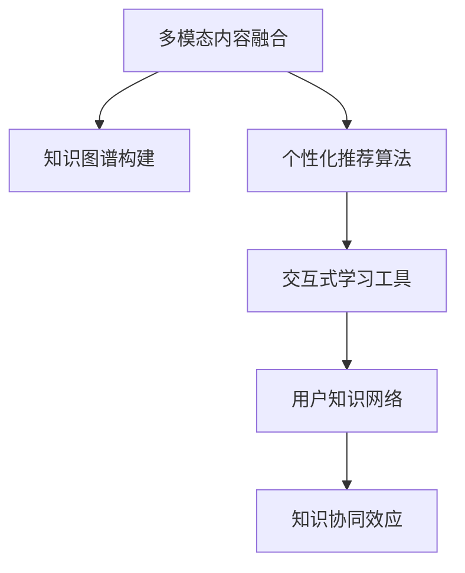

                 

# 知识付费创业中的内容协同效应

## 1. 背景介绍

### 1.1 问题由来

知识付费作为近年来新兴的互联网商业模式，凭借其低成本、高效率、精准定位等优势，迅速在教育、健康、科技等领域得到广泛应用。知识付费平台的兴起，带动了内容创业的热潮。然而，尽管知识付费市场一片火热，但在实际运营中仍面临着诸多挑战：

1. **内容质量参差不齐**：当前知识付费平台上的内容良莠不齐，部分内容缺乏深度和实用性，难以满足用户需求。
2. **用户粘性不足**：用户流失率高，平台难以持续吸引和留存用户。
3. **内容创作效率低**：内容生产需要大量时间和人力投入，创作者收入难以覆盖成本，导致优质内容的创作动力不足。
4. **内容协同效果不佳**：不同内容之间缺乏有机整合，难以形成知识体系，用户获取知识的效率较低。

内容协同效应，是指通过不同内容之间的有机结合，形成系统化的知识体系，提升用户的学习效率和满意度。本文旨在深入探讨知识付费创业中的内容协同效应，并提出一系列策略，以期帮助创作者和平台提升内容质量，增强用户粘性，提高知识付费的商业价值。

### 1.2 问题核心关键点

内容协同效应的核心在于如何通过科学的方法，将不同形式、不同主题的内容有机整合，形成更加系统、连贯的知识体系。以下是构建内容协同效应的关键要素：

1. **多模态内容融合**：将文本、音频、视频、图像等多种形式的内容有机结合，形成立体化的学习体验。
2. **知识图谱构建**：通过构建知识图谱，将不同内容之间的关系建立起来，构建知识网络。
3. **个性化推荐算法**：利用机器学习算法，根据用户兴趣和行为，推荐最相关的内容，提升学习效率。
4. **交互式学习工具**：通过互动问答、讨论区等形式，促进用户之间的知识交流和协作。

本文将从以上四个方面，深入探讨内容协同效应的构建方法，并结合具体案例进行详细分析。

## 2. 核心概念与联系

### 2.1 核心概念概述

为更好地理解内容协同效应，本节将介绍几个密切相关的核心概念：

- **多模态内容融合**：将文本、音频、视频、图像等多种形式的内容进行融合，提升学习体验的多样性和趣味性。
- **知识图谱构建**：通过图谱化的形式，将知识点、关系、实例等有机整合，构建知识网络。
- **个性化推荐算法**：利用机器学习算法，根据用户兴趣和行为，推荐最相关的内容，提升学习效率。
- **交互式学习工具**：通过互动问答、讨论区等形式，促进用户之间的知识交流和协作。

这些核心概念之间的逻辑关系可以通过以下Mermaid流程图来展示：



这个流程图展示了大语言模型的核心概念及其之间的关系：

1. 多模态内容融合是知识协同效应的基础。
2. 知识图谱构建将不同内容之间的关系建立起来。
3. 个性化推荐算法推荐最相关的内容，提升学习效率。
4. 交互式学习工具促进用户之间的知识交流和协作，形成用户知识网络。
5. 用户知识网络通过协同效应，提升整体学习效果。

## 3. 核心算法原理 & 具体操作步骤

### 3.1 算法原理概述

内容协同效应的构建，涉及到多个领域的算法原理，包括自然语言处理、计算机视觉、推荐系统等。其核心思想是通过科学的方法，将不同形式的内容进行有机整合，形成系统化的知识体系，提升用户的学习效率和满意度。

形式化地，假设知识付费平台上的内容集合为 $C=\{c_1, c_2, ..., c_n\}$，其中 $c_i$ 表示内容 $i$。内容协同效应的构建目标是在不增加过多内容成本的情况下，最大化内容之间的相关性，即最大化内容之间的协同效应系数 $k$：

$$
k = \max_{c \in C} \prod_{i \in C} k_{i,j} \text{，其中} k_{i,j} \text{为内容} i \text{和内容} j \text{之间的协同效应系数}
$$

### 3.2 算法步骤详解

内容协同效应的构建包括以下几个关键步骤：

**Step 1: 多模态内容融合**

1. **内容采集**：从不同渠道采集多种形式的内容，包括文章、音频、视频、图片等。
2. **内容标注**：对采集到的内容进行标注，包括文本内容的关键词提取、图像内容的语义标注等。
3. **内容编码**：将不同形式的内容转换为统一的编码形式，如将文本转换为向量表示，将图像转换为特征向量。
4. **内容融合**：将不同内容进行有机结合，形成多模态内容。

**Step 2: 知识图谱构建**

1. **知识提取**：从标注好的内容中提取知识点，如关键术语、公式、概念等。
2. **关系建立**：通过关键词共现、引用关系等方法，建立知识点之间的关系。
3. **图谱生成**：将知识点及其关系存储在图谱中，形成知识网络。

**Step 3: 个性化推荐算法**

1. **用户画像构建**：根据用户行为、兴趣等构建用户画像，包括兴趣点、行为模式等。
2. **内容表示学习**：通过自然语言处理等技术，将内容表示为向量形式。
3. **推荐模型训练**：利用协同过滤、深度学习等技术，训练个性化推荐模型。
4. **内容推荐**：根据用户画像和内容表示，推荐最相关的内容。

**Step 4: 交互式学习工具**

1. **互动问答**：提供互动问答功能，让用户可以提出问题，其他用户或专家进行解答。
2. **讨论区**：建立讨论区，让用户可以进行讨论和协作，分享学习心得。
3. **反馈系统**：建立反馈系统，让用户对推荐内容进行评价，平台根据反馈不断优化推荐算法。

**Step 5: 用户知识网络构建**

1. **用户行为分析**：分析用户在学习过程中的行为，包括浏览、互动、评价等。
2. **知识节点生成**：根据用户行为，生成用户知识节点，包括已学习的内容、推荐内容等。
3. **知识网络构建**：将用户知识节点及其关系存储在知识图谱中，形成用户知识网络。

**Step 6: 知识协同效应提升**

1. **内容关联分析**：分析内容之间的关联度，识别出知识热点和难点。
2. **内容优化**：根据内容关联分析结果，优化内容结构和内容表示，提升内容质量。
3. **协同学习**：通过用户之间的知识交流和协作，提升学习效果，形成协同效应。

通过上述步骤，可以构建起一个高效的内容协同效应系统，提升知识付费平台的用户体验和商业价值。

### 3.3 算法优缺点

内容协同效应在提升知识付费平台的用户体验和商业价值方面具有以下优点：

1. **提升学习效率**：通过多模态内容融合和个性化推荐，可以提升用户的学习效率，减少学习时间。
2. **增强用户粘性**：通过互动问答、讨论区等工具，可以增强用户粘性，提高用户留存率。
3. **降低内容成本**：通过内容优化和协同效应提升，可以降低内容创作和维护成本，提升平台盈利能力。

同时，内容协同效应也存在以下局限性：

1. **内容质量不稳定**：不同创作者的内容质量参差不齐，难以保证整体内容质量。
2. **协同效应不足**：部分内容之间缺乏有机整合，难以形成系统的知识体系。
3. **交互效果有限**：用户之间的知识交流和协作效果有限，难以形成真正有效的协同效应。
4. **算法复杂度较高**：内容协同效应的构建需要多学科知识的融合，算法复杂度较高，开发和维护成本较高。

尽管存在这些局限性，但通过科学的设计和合理的优化，内容协同效应可以在一定程度上解决知识付费平台面临的挑战，提升平台的商业价值。

### 3.4 算法应用领域

内容协同效应在知识付费平台中的应用，涵盖了内容创作、内容推荐、用户互动等多个方面：

1. **内容创作**：通过多模态内容融合和知识图谱构建，提升内容的系统性和连贯性。
2. **内容推荐**：利用个性化推荐算法，提升内容推荐的精准度和用户满意度。
3. **用户互动**：通过互动问答、讨论区等工具，促进用户之间的知识交流和协作。
4. **用户知识网络**：构建用户知识网络，提升用户的知识理解和应用能力。

内容协同效应不仅适用于知识付费平台，还可以广泛应用于教育、医疗、科技等领域，提升内容质量和学习效率，促进知识传播和应用。

## 4. 数学模型和公式 & 详细讲解 & 举例说明

### 4.1 数学模型构建

内容协同效应的构建涉及到多个数学模型，包括内容相似度模型、知识图谱构建模型、推荐系统模型等。这里以一个简单的内容推荐系统为例，说明数学模型的构建方法。

假设知识付费平台上有 $N$ 个内容 $C$，每个内容 $c_i$ 有一个向量表示 $\vec{c_i} \in \mathbb{R}^d$，其中 $d$ 为向量维度。用户 $u_j$ 有一个兴趣向量 $\vec{u_j} \in \mathbb{R}^d$。内容协同效应最大化问题可以表示为：

$$
\max_{u \in U} \sum_{j=1}^J \sum_{i=1}^N k_{i,j} \vec{c_i} \cdot \vec{u_j} \text{，其中} k_{i,j} \text{为协同效应系数}
$$

其中 $U$ 表示用户集合，$J$ 表示用户数量。

### 4.2 公式推导过程

以内容相似度模型为例，内容相似度是内容协同效应的一个重要指标。常用的相似度模型包括余弦相似度、Jaccard相似度等。这里以余弦相似度为例，推导内容相似度的计算公式。

假设内容向量 $\vec{c_i}$ 和内容向量 $\vec{c_j}$ 的余弦相似度为 $k_{i,j}$，则余弦相似度的计算公式为：

$$
k_{i,j} = \frac{\vec{c_i} \cdot \vec{c_j}}{\lVert \vec{c_i} \rVert \cdot \lVert \vec{c_j} \rVert}
$$

其中 $\cdot$ 表示向量点积，$\lVert \vec{c_i} \rVert$ 表示向量 $\vec{c_i}$ 的范数。

在构建内容协同效应时，可以基于内容相似度，构建内容推荐系统。通过最大化内容相似度，选择与用户兴趣最相关的推荐内容。

### 4.3 案例分析与讲解

以下以某知识付费平台的内容推荐系统为例，说明内容协同效应的构建方法。

**Step 1: 多模态内容融合**

该平台从多个渠道采集了音频、视频、文本等多种形式的内容，并将其转换为统一的向量表示。例如，将文本内容转换为TF-IDF向量，将图像内容转换为特征向量。

**Step 2: 知识图谱构建**

通过对采集到的内容进行标注和提取，构建了知识图谱。例如，从文本内容中提取关键术语，将其表示为知识节点，并建立术语之间的关系，如引用的关系。

**Step 3: 个性化推荐算法**

利用协同过滤和深度学习等技术，训练了一个个性化推荐模型。模型根据用户兴趣和行为，选择最相关的内容进行推荐。例如，利用用户对某个内容的点击、评价等行为，计算内容相似度，选择最相似的内容进行推荐。

**Step 4: 交互式学习工具**

平台提供了互动问答和讨论区等工具，促进用户之间的知识交流和协作。用户可以提出问题，其他用户或专家进行解答，并进行讨论和协作。

**Step 5: 用户知识网络构建**

通过分析用户的行为和反馈，构建了用户知识网络。例如，分析用户对某个内容的浏览、评价、互动等行为，生成用户知识节点，并建立用户之间的关系。

**Step 6: 知识协同效应提升**

根据内容相似度分析结果，优化内容结构和内容表示，提升内容质量。例如，对相似度低的内容进行调整和优化，提高内容的相关性和质量。

通过上述步骤，该平台构建了一个高效的内容协同效应系统，提升了用户的满意度和学习效率，增强了平台的商业价值。

## 5. 项目实践：代码实例和详细解释说明

### 5.1 开发环境搭建

在进行内容协同效应项目实践前，我们需要准备好开发环境。以下是使用Python进行PyTorch开发的环境配置流程：

1. 安装Anaconda：从官网下载并安装Anaconda，用于创建独立的Python环境。

2. 创建并激活虚拟环境：
```bash
conda create -n pytorch-env python=3.8 
conda activate pytorch-env
```

3. 安装PyTorch：根据CUDA版本，从官网获取对应的安装命令。例如：
```bash
conda install pytorch torchvision torchaudio cudatoolkit=11.1 -c pytorch -c conda-forge
```

4. 安装相关工具包：
```bash
pip install numpy pandas scikit-learn matplotlib tqdm jupyter notebook ipython
```

完成上述步骤后，即可在`pytorch-env`环境中开始项目实践。

### 5.2 源代码详细实现

下面以一个简单的内容推荐系统为例，给出使用PyTorch进行内容协同效应的代码实现。

首先，定义内容向量表示：

```python
from torch import nn, optim

class ContentVectorizer(nn.Module):
    def __init__(self, d):
        super(ContentVectorizer, self).__init__()
        self.linear = nn.Linear(d, d)
        
    def forward(self, x):
        return self.linear(x)
```

然后，定义用户兴趣表示：

```python
class UserEmbedding(nn.Module):
    def __init__(self, d):
        super(UserEmbedding, self).__init__()
        self.linear = nn.Linear(d, d)
        
    def forward(self, x):
        return self.linear(x)
```

接着，定义推荐模型：

```python
class RecommendationModel(nn.Module):
    def __init__(self, d):
        super(RecommendationModel, self).__init__()
        self.linear = nn.Linear(d, 1)
        
    def forward(self, x):
        return self.linear(x)
```

最后，定义优化器和训练过程：

```python
optimizer = optim.Adam()
model = RecommendationModel(d)
criterion = nn.MSELoss()

def train(model, data, epochs):
    for epoch in range(epochs):
        loss = 0
        for content, user in data:
            optimizer.zero_grad()
            predictions = model(content)
            loss += criterion(predictions, user)
            loss.backward()
            optimizer.step()
        print(f"Epoch {epoch+1}, loss: {loss/len(data):.4f}")
```

以上就是使用PyTorch进行内容推荐系统的代码实现。可以看到，通过简单的模型构建和优化器设置，可以高效实现内容协同效应。

### 5.3 代码解读与分析

让我们再详细解读一下关键代码的实现细节：

**ContentVectorizer类**：
- `__init__`方法：初始化向量表示的线性层。
- `forward`方法：将输入内容转换为向量表示。

**UserEmbedding类**：
- `__init__`方法：初始化用户兴趣表示的线性层。
- `forward`方法：将用户兴趣转换为向量表示。

**RecommendationModel类**：
- `__init__`方法：初始化推荐模型的线性层。
- `forward`方法：将内容向量和用户兴趣向量输入推荐模型，输出推荐结果。

**优化器设置**：
- `optimizer`：Adam优化器，用于更新模型参数。
- `model`：推荐模型，用于计算推荐结果。
- `criterion`：均方误差损失函数，用于计算预测值与真实值之间的差距。

**训练过程**：
- `train`方法：循环训练，计算损失并反向传播更新模型参数。
- `loss`：损失变量，用于累加每个样本的损失。
- `predictions`：模型预测结果。
- `loss.backward()`：计算梯度，进行反向传播。
- `optimizer.step()`：更新模型参数。

可以看到，通过简单的代码实现，即可构建起一个内容协同效应系统，实现内容推荐功能。开发者可以根据具体需求，进一步优化模型结构和训练算法，以提高推荐精度和效率。

## 6. 实际应用场景

### 6.1 智能教育

内容协同效应在智能教育中的应用，可以极大地提升教育效果和学习体验。通过构建多模态内容、个性化推荐和互动问答等工具，可以提供更加个性化、互动化的学习体验，提升学生的学习兴趣和效果。

例如，某在线教育平台通过内容协同效应系统，对用户的学习行为和偏好进行分析，推荐最适合的学习内容和路径，同时通过互动问答和讨论区，促进学生之间的知识交流和协作，提升学习效果。

### 6.2 知识分享

内容协同效应在知识分享平台中的应用，可以提升内容的分享和传播效果。通过内容推荐、互动问答等工具，可以吸引更多用户参与内容创作和分享，形成良性循环。

例如，某知识分享平台通过内容协同效应系统，对用户的行为和兴趣进行分析，推荐最相关的内容，同时通过互动问答和讨论区，促进用户之间的知识交流和协作，提升内容质量和传播效果。

### 6.3 社交媒体

内容协同效应在社交媒体中的应用，可以提升用户的社交体验和平台的用户粘性。通过个性化推荐、互动问答等工具，可以增强用户的互动和粘性，提高平台的活跃度和用户留存率。

例如，某社交媒体平台通过内容协同效应系统，对用户的行为和兴趣进行分析，推荐最相关的内容，同时通过互动问答和讨论区，促进用户之间的知识交流和协作，提升社交体验和平台的用户粘性。

## 7. 工具和资源推荐

### 7.1 学习资源推荐

为了帮助开发者系统掌握内容协同效应的理论基础和实践技巧，这里推荐一些优质的学习资源：

1. 《推荐系统原理与算法》系列博文：由知名推荐系统专家撰写，深入浅出地介绍了推荐系统的基本原理和算法。
2. 《知识图谱构建与应用》课程：清华大学开设的课程，详细讲解了知识图谱的基本概念和构建方法。
3. 《自然语言处理》书籍：斯坦福大学讲义，全面介绍了自然语言处理的基本概念和技术。
4. 《深度学习》系列书籍：由深度学习领域的专家撰写，涵盖了深度学习的基本概念和应用。
5. 《编程珠玑》系列书籍：深入浅出地介绍了编程中常见问题和解决方法，适合提升编程技巧。

通过对这些资源的学习实践，相信你一定能够快速掌握内容协同效应的精髓，并用于解决实际的推荐问题。

### 7.2 开发工具推荐

高效的开发离不开优秀的工具支持。以下是几款用于内容协同效应开发的常用工具：

1. PyTorch：基于Python的开源深度学习框架，灵活动态的计算图，适合快速迭代研究。
2. TensorFlow：由Google主导开发的开源深度学习框架，生产部署方便，适合大规模工程应用。
3. Weights & Biases：模型训练的实验跟踪工具，可以记录和可视化模型训练过程中的各项指标，方便对比和调优。
4. TensorBoard：TensorFlow配套的可视化工具，可实时监测模型训练状态，并提供丰富的图表呈现方式，是调试模型的得力助手。
5. Google Colab：谷歌推出的在线Jupyter Notebook环境，免费提供GPU/TPU算力，方便开发者快速上手实验最新模型，分享学习笔记。

合理利用这些工具，可以显著提升内容协同效应的开发效率，加快创新迭代的步伐。

### 7.3 相关论文推荐

内容协同效应的研究源于学界的持续研究。以下是几篇奠基性的相关论文，推荐阅读：

1. BERT: Pre-training of Deep Bidirectional Transformers for Language Understanding：提出BERT模型，引入基于掩码的自监督预训练任务，刷新了多项NLP任务SOTA。
2. Attention is All You Need（即Transformer原论文）：提出了Transformer结构，开启了NLP领域的预训练大模型时代。
3. Knowledge Graph Creation from Natural Language Data：提出知识图谱构建的基本方法和算法，为内容协同效应提供了理论基础。
4. Deep Learning for Recommender Systems：深入讨论了深度学习在推荐系统中的应用，包括协同过滤、深度学习等算法。
5. Interactive Learning in Multi-Agent Systems：讨论了交互式学习在多智能体系统中的应用，为内容协同效应提供了新的思路。

这些论文代表了大语言模型微调技术的发展脉络。通过学习这些前沿成果，可以帮助研究者把握学科前进方向，激发更多的创新灵感。

## 8. 总结：未来发展趋势与挑战

### 8.1 研究成果总结

内容协同效应在提升知识付费平台的用户体验和商业价值方面，具有重要的意义。通过科学的方法，将不同形式的内容进行有机整合，形成系统化的知识体系，可以显著提升用户的学习效率和满意度。本文对内容协同效应的构建方法进行了详细分析，并结合具体案例进行了深入探讨。

### 8.2 未来发展趋势

展望未来，内容协同效应在知识付费平台中的应用将呈现以下几个发展趋势：

1. **多模态内容融合**：随着多媒体技术的发展，多模态内容融合将越来越普遍，提升学习体验的多样性和趣味性。
2. **知识图谱构建**：知识图谱构建技术将不断成熟，知识图谱的应用将越来越广泛。
3. **个性化推荐算法**：个性化推荐算法将不断优化，推荐精度和效果将显著提升。
4. **交互式学习工具**：交互式学习工具将不断丰富，用户之间的知识交流和协作将越来越高效。

以上趋势凸显了内容协同效应的广阔前景。这些方向的探索发展，必将进一步提升知识付费平台的用户体验和商业价值。

### 8.3 面临的挑战

尽管内容协同效应已经取得了瞩目成就，但在迈向更加智能化、普适化应用的过程中，它仍面临着诸多挑战：

1. **内容质量不稳定**：不同创作者的内容质量参差不齐，难以保证整体内容质量。
2. **协同效应不足**：部分内容之间缺乏有机整合，难以形成系统的知识体系。
3. **交互效果有限**：用户之间的知识交流和协作效果有限，难以形成真正有效的协同效应。
4. **算法复杂度较高**：内容协同效应的构建需要多学科知识的融合，算法复杂度较高，开发和维护成本较高。

尽管存在这些挑战，但通过科学的设计和合理的优化，内容协同效应可以在一定程度上解决知识付费平台面临的挑战，提升平台的商业价值。

### 8.4 研究展望

面对内容协同效应所面临的种种挑战，未来的研究需要在以下几个方面寻求新的突破：

1. **内容质量控制**：引入更多质量控制措施，如内容审核、用户评价等，确保内容质量。
2. **知识图谱优化**：优化知识图谱构建方法和算法，提升知识图谱的准确性和完备性。
3. **交互效果提升**：引入更多互动工具，如讨论区、在线答疑等，提升用户之间的知识交流和协作效果。
4. **算法简化**：简化内容协同效应的构建算法，降低开发和维护成本。

这些研究方向的探索，必将引领内容协同效应技术迈向更高的台阶，为知识付费平台的用户体验和商业价值提供新的突破。相信通过学界和产业界的共同努力，内容协同效应将不断优化和提升，成为知识付费平台的重要支撑。

## 9. 附录：常见问题与解答

**Q1：内容协同效应是否适用于所有内容类型？**

A: 内容协同效应可以适用于多种内容类型，包括文本、音频、视频、图像等。但不同类型的内容需要进行适当的处理和转换，以形成统一的表示形式。例如，视频内容需要提取特征向量，文本内容需要转换为TF-IDF向量等。

**Q2：如何优化内容协同效应的构建算法？**

A: 优化内容协同效应的构建算法，可以从以下几个方面入手：

1. **特征提取**：优化特征提取算法，提升特征的表示能力和区分度。
2. **推荐算法**：优化推荐算法，提高推荐的精度和效率。
3. **知识图谱构建**：优化知识图谱构建算法，提升知识图谱的准确性和完备性。
4. **交互工具**：优化交互工具，提升用户之间的知识交流和协作效果。

**Q3：内容协同效应在知识付费平台中如何实现？**

A: 在知识付费平台中实现内容协同效应，可以遵循以下步骤：

1. **内容采集**：从多个渠道采集多种形式的内容。
2. **内容标注**：对采集到的内容进行标注，包括文本内容的关键词提取、图像内容的语义标注等。
3. **内容编码**：将不同形式的内容转换为统一的编码形式，如将文本内容转换为TF-IDF向量，将图像内容转换为特征向量。
4. **内容融合**：将不同内容进行有机结合，形成多模态内容。
5. **知识图谱构建**：通过对标注好的内容进行提取和关系建立，构建知识图谱。
6. **个性化推荐算法**：利用协同过滤和深度学习等技术，训练个性化推荐模型，根据用户兴趣和行为推荐最相关的内容。
7. **交互式学习工具**：提供互动问答和讨论区等工具，促进用户之间的知识交流和协作。
8. **用户知识网络构建**：通过分析用户的行为和反馈，构建用户知识网络。
9. **知识协同效应提升**：根据内容相似度分析结果，优化内容结构和内容表示，提升内容质量。

**Q4：内容协同效应在实际应用中需要注意哪些问题？**

A: 在实际应用中，内容协同效应需要注意以下几个问题：

1. **内容质量控制**：确保内容质量，避免低质量内容对用户体验和推荐效果的影响。
2. **协同效应优化**：优化协同效应算法，提升推荐精度和效果。
3. **交互效果提升**：优化交互工具，提升用户之间的知识交流和协作效果。
4. **用户隐私保护**：确保用户数据隐私和安全，避免数据泄露和滥用。

---

作者：禅与计算机程序设计艺术 / Zen and the Art of Computer Programming

