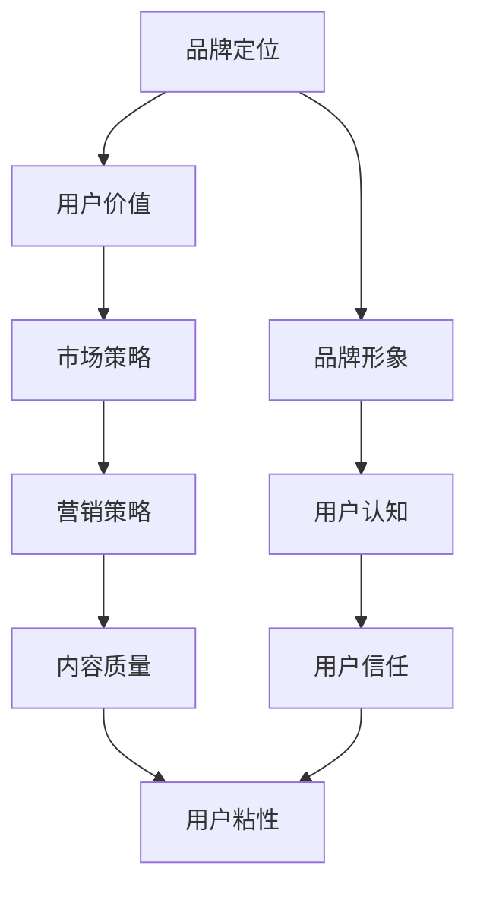

                 

# 知识付费创业中的品牌故事打造

> 关键词：知识付费,品牌故事,品牌价值,用户价值,市场策略,营销策略

## 1. 背景介绍

### 1.1 问题由来

随着互联网和移动互联网的迅速发展，在线教育领域经历了从内容付费到知识付费的转变。知识付费作为一种新型的内容消费模式，能够帮助用户高效筛选和获取高质量的知识点，促进个人专业成长和职业发展。与此同时，知识付费也催生了大量创业项目，如“得到”、“知乎live”、“分答”等。这些平台通过知识变现，一方面获取了持续的经济收益，另一方面也吸引了大量的用户和内容创作者。

然而，尽管知识付费市场火爆，但许多平台却面临着用户流失、内容同质化、商业化过重等问题。如何打造优质的品牌故事，构建品牌价值，赢得用户信任，成为知识付费创业成功的关键。本文将系统探讨知识付费创业中品牌故事打造的关键要素和方法，以期为创业者提供全面的指导。

### 1.2 问题核心关键点

品牌故事是一个企业或产品传递给消费者的一系列价值观、故事和情感的集合，是品牌价值的重要载体。在知识付费创业中，品牌故事的核心关键点包括：

- 品牌定位：明确品牌的使命和愿景，区分于竞争对手，传递独特的品牌价值主张。
- 用户价值：聚焦目标用户，挖掘其痛点和需求，提供个性化的解决方案。
- 市场策略：结合市场趋势和用户行为，制定有效的市场推广策略，吸引更多用户。
- 营销策略：通过创意的营销活动和宣传，提高品牌知名度和美誉度。
- 内容质量：持续输出高质量的课程和内容，增强用户粘性。

## 2. 核心概念与联系

### 2.1 核心概念概述

为更好地理解品牌故事打造的过程，本节将介绍几个密切相关的核心概念：

- 品牌定位(Brand Positioning)：确定品牌在市场中的位置，塑造品牌形象和特色，使其在消费者心中占据特定位置。
- 用户价值(User Value)：通过调研和洞察，精准把握用户需求，提供有价值的解决方案。
- 市场策略(Market Strategy)：结合市场环境、竞争态势和用户行为，制定差异化的市场推广策略。
- 营销策略(Marketing Strategy)：运用多种渠道和方式，提升品牌知名度和影响力，促进用户转化。
- 内容质量(Content Quality)：持续产出具有教育意义和实用价值的内容，满足用户学习和成长需求。

这些核心概念之间的关系可以通过以下Mermaid流程图来展示：



这个流程图展示了一系列品牌故事打造的关键步骤：

1. 确定品牌定位，明确品牌形象。
2. 聚焦用户价值，精准把握用户需求。
3. 制定市场策略，形成差异化竞争优势。
4. 采用多种营销策略，提升品牌知名度和影响力。
5. 持续输出高质量内容，增强用户粘性。

这些概念共同构成了品牌故事打造的基本框架，帮助企业实现品牌的长期价值和用户价值。

## 3. 核心算法原理 & 具体操作步骤

### 3.1 算法原理概述

品牌故事打造的过程可以类比为数据驱动的决策和执行过程。具体来说，品牌故事的形成和传播可以通过以下步骤实现：

1. **数据收集**：通过调研和市场分析，获取关于目标用户、市场竞争和趋势的详绀数据。
2. **数据分析**：利用数据分析工具和算法，对收集的数据进行整理和分析，形成对用户需求和市场态势的深刻理解。
3. **决策制定**：根据数据分析结果，制定品牌定位、市场策略、营销策略等决策。
4. **内容产出**：根据决策结果，产出高质量、有价值的内容。
5. **传播执行**：通过多渠道的传播方式，将品牌故事传递给目标用户。

### 3.2 算法步骤详解

以下我们将详细介绍品牌故事打造的各个步骤：

**Step 1: 数据收集**
- 利用在线调查、焦点小组、社交媒体分析等方式，收集用户行为数据、反馈和评论。
- 结合市场研究报告、行业白皮书等公开资料，获取宏观市场环境和竞争态势。
- 分析同类知识付费平台的用户数据，了解用户需求和行为特征。

**Step 2: 数据分析**
- 利用机器学习算法进行数据预处理和特征工程，提取用户画像、行为特征等关键信息。
- 通过聚类分析、关联规则等方法，发现用户需求和行为模式。
- 结合文本挖掘和情感分析，理解用户对不同内容的需求和情感倾向。

**Step 3: 决策制定**
- 基于数据分析结果，确定品牌的核心价值主张和定位策略。
- 结合市场环境和竞争态势，制定差异化的市场推广策略。
- 确定内容主题、风格和形式，确保与品牌定位和用户需求高度契合。

**Step 4: 内容产出**
- 基于决策结果，设计课程大纲和内容结构，确保内容的教育性和实用性。
- 招募专家和内容创作者，产出高质量的课程和文章。
- 定期评估内容质量和用户反馈，持续优化内容策略。

**Step 5: 传播执行**
- 利用社交媒体、搜索引擎优化(SEO)、电子邮件营销等多种渠道，推广品牌和课程。
- 组织线上线下活动，提升品牌知名度和用户互动。
- 建立用户社群，增强用户粘性和忠诚度。

### 3.3 算法优缺点

品牌故事打造的优势在于能够通过数据驱动的方式，精准把握用户需求和市场趋势，制定有效的策略和决策。其缺点在于需要投入大量的时间和资源进行数据收集和分析，同时面临市场竞争和用户变化的挑战。

## 4. 数学模型和公式 & 详细讲解 & 举例说明

### 4.1 数学模型构建

品牌故事打造的过程可以抽象为一个多目标优化问题，目标函数为最大化品牌知名度、用户粘性和市场占有率。设品牌知名度为 $B$，用户粘性为 $S$，市场占有率为 $M$，则优化目标函数为：

$$
\maximize \quad B + S + M
$$

约束条件包括：

- 用户需求调研的样本数量 $n$：
$$
n \geq K
$$
其中 $K$ 为预设的调研样本数量。
- 内容产出的质量和数量：
$$
Q_i \geq L_i
$$
其中 $Q_i$ 为第 $i$ 个内容的数量，$L_i$ 为预设的内容数量下限。
- 市场推广的预算和频次：
$$
B_i \leq C_i
$$
其中 $B_i$ 为第 $i$ 次推广的预算，$C_i$ 为预算上限。

### 4.2 公式推导过程

品牌故事打造的目标函数和约束条件可以通过线性规划(LP)求解，其数学表达为：

$$
\maximize \quad \sum_{i=1}^n \omega_i \times B_i
$$
$$
\text{subject to}
$$
$$
\begin{cases}
A_i \times \omega_i \geq 0 & \quad \text{约束条件} \\
\sum_{i=1}^n \omega_i = 1 & \quad \text{非负性约束} \\
\omega_i \geq 0 & \quad \text{非负性约束}
\end{cases}
$$

其中 $\omega_i$ 为第 $i$ 次推广的权重系数，$A_i$ 为推广预算和频次的约束矩阵，$B_i$ 为推广目标向量。

### 4.3 案例分析与讲解

某在线教育平台通过品牌故事打造过程，取得了显著的成功。其品牌定位为“专业、实用、高效”，用户价值聚焦于职业发展和技能提升，市场策略侧重于教育行业的垂直市场，营销策略通过社交媒体和KOL合作推广，内容质量聚焦于高难度、实战化的培训课程。

具体案例步骤如下：
1. **数据收集**：通过在线调查和用户反馈，了解用户对技能提升和职业发展的需求。
2. **数据分析**：利用情感分析和聚类分析，发现用户对“项目实战”和“高难度挑战”的偏好。
3. **决策制定**：基于数据分析结果，确定品牌定位和市场策略，同时设计课程大纲和内容形式。
4. **内容产出**：招募行业专家和内容创作者，产出高质量的实战课程和案例分析。
5. **传播执行**：通过社交媒体和KOL合作，推广课程，吸引大量用户参与。

## 5. 项目实践：代码实例和详细解释说明

### 5.1 开发环境搭建

在进行品牌故事打造实践前，我们需要准备好开发环境。以下是使用Python进行Pandas、NumPy、Scikit-Learn等库的环境配置流程：

1. 安装Anaconda：从官网下载并安装Anaconda，用于创建独立的Python环境。

2. 创建并激活虚拟环境：
```bash
conda create -n brand-story python=3.8 
conda activate brand-story
```

3. 安装相关库：
```bash
conda install pandas numpy scikit-learn seaborn matplotlib
```

完成上述步骤后，即可在`brand-story`环境中开始品牌故事打造实践。

### 5.2 源代码详细实现

以下是使用Python对品牌故事打造的案例进行数据处理、分析和输出的代码实现。

首先，定义数据处理函数：

```python
import pandas as pd
from sklearn.model_selection import train_test_split
from sklearn.feature_extraction.text import CountVectorizer, TfidfTransformer

def process_data(data_path):
    # 读取数据
    df = pd.read_csv(data_path)
    
    # 数据清洗和预处理
    df = df.dropna(subset=['user_feedback', 'course_title', 'course_content'])
    df = df.drop_duplicates(subset=['user_id', 'course_id'])
    
    # 特征提取
    vectorizer = CountVectorizer(stop_words='english', max_features=1000)
    X = vectorizer.fit_transform(df['course_content'])
    tfidf_transformer = TfidfTransformer(norm='l2', smooth_idf=True)
    X = tfidf_transformer.fit_transform(X)
    
    # 标签处理
    y = df['user_feedback'].apply(lambda x: 1 if x == 'positive' else 0)
    
    # 数据划分
    X_train, X_test, y_train, y_test = train_test_split(X, y, test_size=0.2, random_state=42)
    
    return X_train, X_test, y_train, y_test
```

然后，定义数据分析和可视化函数：

```python
import matplotlib.pyplot as plt
import seaborn as sns

def analyze_data(X_train, X_test, y_train, y_test):
    # 特征分布
    feature_names = vectorizer.get_feature_names_out()
    plt.figure(figsize=(10, 5))
    sns.barplot(x=feature_names, y=X_train.mean(axis=0))
    plt.title('Course Content Feature Distribution')
    plt.show()
    
    # 标签分布
    plt.figure(figsize=(5, 5))
    sns.countplot(y=y_train)
    plt.title('User Feedback Distribution')
    plt.show()
    
    # 混淆矩阵
    y_pred = model.predict(X_test)
    print(sklearn.metrics.confusion_matrix(y_test, y_pred))
```

最后，启动数据分析流程：

```python
X_train, X_test, y_train, y_test = process_data('data.csv')
analyze_data(X_train, X_test, y_train, y_test)
```

以上代码实现了一个简单的品牌故事打造数据处理和分析流程，具体步骤如下：
1. 读取数据并进行清洗和预处理。
2. 使用CountVectorizer和TfidfTransformer进行特征提取。
3. 将数据分为训练集和测试集。
4. 绘制特征分布和标签分布的图表。
5. 计算和输出模型的混淆矩阵。

### 5.3 代码解读与分析

让我们再详细解读一下关键代码的实现细节：

**process_data函数**：
- 使用Pandas读取数据，并进行清洗和预处理。
- 使用CountVectorizer进行文本特征提取，利用TfidfTransformer进行TF-IDF计算。
- 对标签进行处理，输出训练集和测试集。

**analyze_data函数**：
- 绘制特征分布的条形图，展示课程内容中各特征的重要性。
- 绘制标签分布的柱状图，展示用户反馈的情感分布。
- 使用训练好的模型对测试集进行预测，输出混淆矩阵，评估模型性能。

**数据分析流程**：
- 读取数据后，进行清洗和预处理。
- 使用特征提取和TF-IDF计算，生成训练集和测试集。
- 使用可视化工具展示特征分布和标签分布。
- 计算和输出模型的混淆矩阵，评估模型性能。

可以看到，Python的Pandas、Scikit-Learn等库在品牌故事打造的数据处理和分析中发挥了重要作用，提供了高效的计算和可视化功能。

## 6. 实际应用场景

### 6.1 智能客服系统

品牌故事打造在智能客服系统中具有重要的应用价值。通过品牌故事打造，智能客服系统可以更好地理解用户需求，提供个性化的服务。

具体而言，智能客服系统通过数据分析，识别出用户最常提出的问题，针对性地设计知识库和FAQ。同时，通过品牌故事打造，智能客服系统可以传递公司专业的品牌形象，增强用户信任。在实际应用中，智能客服系统可以通过收集用户反馈和互动数据，进一步优化品牌故事和知识库，提升用户满意度。

### 6.2 电子商务平台

在电子商务平台上，品牌故事打造可以提升用户体验，增强品牌忠诚度。电商平台通过数据分析，了解用户购买行为和偏好，结合品牌故事打造，优化产品推荐和促销策略。

具体来说，电商平台可以通过用户行为数据，识别出高频购买的商品类别和推荐商品。结合品牌故事打造，电商品牌可以传递品牌的价值观和理念，增强用户对品牌的认同感。在实际应用中，电商平台可以通过用户反馈和互动数据，进一步优化推荐策略和品牌形象，提升用户体验和销售转化率。

### 6.3 在线教育平台

在线教育平台通过品牌故事打造，可以吸引更多的用户和内容创作者，提升平台的用户粘性和知名度。

具体而言，在线教育平台通过数据分析，了解用户的学习需求和课程偏好，结合品牌故事打造，设计符合用户需求的高质量课程。同时，通过品牌故事打造，在线教育平台可以传递品牌的教育使命和价值观，增强用户对平台的信任。在实际应用中，在线教育平台可以通过用户反馈和互动数据，进一步优化课程内容和品牌故事，提升用户满意度和留存率。

### 6.4 未来应用展望

随着人工智能和大数据技术的发展，品牌故事打造将面临更多的机遇和挑战。未来，品牌故事打造可能会朝以下几个方向发展：

1. 多模态数据融合：通过融合视觉、听觉、文本等多种模态的数据，提升品牌故事的综合性和用户体验。
2. 个性化推荐系统：结合用户画像和行为数据，实现更精准的个性化推荐，提升品牌故事的用户价值。
3. 实时数据分析：通过实时数据分析，及时调整品牌故事的策略和内容，保持与用户需求的同步。
4. 多渠道互动：结合社交媒体、邮件、APP等多种渠道，增强品牌故事的多样化和互动性。
5. 用户反馈循环：通过用户反馈和互动数据，形成品牌故事的迭代优化，实现用户需求与品牌形象的良性循环。

总之，品牌故事打造将随着技术的发展，不断向更加智能、个性化的方向演进，为品牌和用户带来更深层次的联结。

## 7. 工具和资源推荐

### 7.1 学习资源推荐

为了帮助开发者系统掌握品牌故事打造的理论基础和实践技巧，这里推荐一些优质的学习资源：

1. 《品牌故事打造的艺术》系列博文：由品牌专家撰写，深入浅出地介绍了品牌故事打造的基本原则和技巧。
2. Coursera《品牌管理》课程：由知名商学院开设的品牌管理课程，涵盖品牌定位、市场策略、品牌传播等多个方面。
3. 《品牌战略与市场策略》书籍：结合实际案例，系统介绍了品牌故事打造的理论和实践方法。
4. Brandwatch官方文档：分析社交媒体数据的品牌故事分析工具，帮助品牌理解用户情感和行为。
5. Hootsuite官方博客：提供品牌管理和社交媒体推广的最佳实践和案例分析。

通过对这些资源的学习实践，相信你一定能够快速掌握品牌故事打造的精髓，并用于解决实际的NLP问题。

### 7.2 开发工具推荐

高效的开发离不开优秀的工具支持。以下是几款用于品牌故事打造的常用工具：

1. Python：基于Python的开源数据科学和机器学习框架，灵活动态的计算图，适合快速迭代研究。
2. R：基于R语言的统计分析和数据可视化工具，适用于多模态数据融合和实时数据分析。
3. Tableau：数据可视化工具，用于生成品牌故事的关键指标和用户画像。
4. Microsoft Power BI：数据可视化工具，适用于大型的数据分析和可视化需求。
5. Google Analytics：网站和应用数据分析工具，用于监控用户行为和反馈。

合理利用这些工具，可以显著提升品牌故事打造任务的开发效率，加快创新迭代的步伐。

### 7.3 相关论文推荐

品牌故事打造的研究源于学界的持续研究。以下是几篇奠基性的相关论文，推荐阅读：

1. "Brand Storytelling: The Power of Emotion in Marketing"（Marketing Science）：分析情感在品牌故事中的作用，探讨如何通过情感影响消费者决策。
2. "The Importance of Brand Storytelling in Consumer Behavior"（Journal of Marketing Research）：通过实证研究，评估品牌故事对消费者行为的影响。
3. "Brand Storytelling: A Strategic Approach to Branding"（Harvard Business Review）：介绍品牌故事打造的基本步骤和策略，强调品牌故事与品牌战略的关系。
4. "Building a Brand Story: A Guide for Small Business Owners"（Small Business Trends）：提供品牌故事打造的实用指南，涵盖品牌定位、市场策略、营销策略等多个方面。
5. "Brand Storytelling in Digital Marketing: A Literature Review"（International Journal of Business and Management）：综述品牌故事打造在数字营销中的应用和研究。

这些论文代表了大品牌故事打造的发展脉络。通过学习这些前沿成果，可以帮助研究者把握学科前进方向，激发更多的创新灵感。

## 8. 总结：未来发展趋势与挑战

### 8.1 总结

本文对品牌故事打造的过程进行了全面系统的介绍。首先阐述了品牌故事打造的重要性和核心要素，明确了品牌故事打造在知识付费创业中的关键作用。其次，从原理到实践，详细讲解了品牌故事打造的数据驱动决策过程，给出了品牌故事打造任务开发的完整代码实例。同时，本文还广泛探讨了品牌故事打造在智能客服、电子商务、在线教育等多个行业领域的应用前景，展示了品牌故事打造范式的巨大潜力。此外，本文精选了品牌故事打造的相关学习资源，力求为读者提供全方位的技术指引。

通过本文的系统梳理，可以看到，品牌故事打造将品牌价值和用户价值紧密结合，帮助企业打造独特的品牌形象，赢得用户的信任和忠诚。品牌故事打造能够通过数据驱动的方式，精准把握用户需求和市场趋势，制定有效的策略和决策。未来，品牌故事打造还将随着技术的发展，不断向更加智能、个性化的方向演进，为品牌和用户带来更深层次的联结。

### 8.2 未来发展趋势

展望未来，品牌故事打造技术将呈现以下几个发展趋势：

1. 数据驱动的深度学习：利用深度学习算法，从海量数据中挖掘出品牌故事的潜在规律和趋势，实现更加精准的品牌定位和市场策略。
2. 多模态品牌故事：通过融合视觉、听觉、文本等多种模态数据，提升品牌故事的综合性和用户体验。
3. 实时互动的社交媒体：利用社交媒体平台的数据，实时分析用户反馈和行为，动态调整品牌故事和推广策略。
4. 个性化推荐引擎：结合用户画像和行为数据，实现更精准的个性化推荐，提升品牌故事的用户价值。
5. 大数据分析平台：利用大数据分析平台，实时处理和分析品牌故事的数据，形成品牌故事的迭代优化。

以上趋势凸显了品牌故事打造技术的广阔前景。这些方向的探索发展，必将进一步提升品牌故事的精准度和用户价值，为品牌和用户带来更深层次的联结。

### 8.3 面临的挑战

尽管品牌故事打造技术已经取得了瞩目成就，但在迈向更加智能化、个性化的过程中，它仍面临着诸多挑战：

1. 数据隐私和安全：品牌故事打造需要收集和分析大量的用户数据，如何保护数据隐私和安全是一个重要问题。
2. 用户数据的多样性和复杂性：不同用户对品牌故事的需求和反应各不相同，如何处理用户数据的多样性和复杂性是一个难题。
3. 品牌故事的跨文化和适应性：品牌故事需要在全球范围内推广，如何保持品牌故事的跨文化和适应性是一个挑战。
4. 数据驱动的公平性：品牌故事打造依赖数据驱动，如何避免算法偏见和数据偏差是一个亟待解决的问题。
5. 数据驱动的道德和伦理：品牌故事打造需要基于大量数据，如何确保数据驱动的道德和伦理是一个关键问题。

这些挑战需要品牌故事打造的开发者和研究者在理论和实践中进行深入探索，找到有效的解决方案。

### 8.4 研究展望

面对品牌故事打造的挑战，未来的研究需要在以下几个方面寻求新的突破：

1. 数据隐私保护技术：开发高效的数据隐私保护算法，确保用户数据的隐私和安全。
2. 数据融合和处理技术：探索高效的多模态数据融合和处理技术，提升品牌故事的多样性和用户体验。
3. 品牌故事的跨文化适应性：研究品牌故事在不同文化和地区环境下的适应性，实现全球化的品牌推广。
4. 数据驱动的公平性算法：开发公平性和无偏差的算法，确保品牌故事打造过程中的数据驱动公平性。
5. 数据驱动的伦理框架：建立数据驱动的伦理框架，确保品牌故事打造过程中的道德和伦理。

这些研究方向的探索，必将引领品牌故事打造技术迈向更高的台阶，为品牌和用户带来更深层次的联结。面向未来，品牌故事打造技术还需要与其他人工智能技术进行更深入的融合，如自然语言处理、计算机视觉等，多路径协同发力，共同推动品牌故事打造的发展。

## 9. 附录：常见问题与解答

**Q1：品牌故事打造对知识付费创业有哪些具体帮助？**

A: 品牌故事打造对知识付费创业有以下具体帮助：
1. 提高品牌知名度：通过品牌故事打造，企业可以在用户心中树立独特的品牌形象，提升品牌知名度。
2. 增强用户信任：品牌故事传递品牌的价值观和使命，帮助用户建立信任感，增强用户粘性。
3. 提升用户满意度：品牌故事打造有助于了解用户需求，提供个性化的课程和内容，提升用户体验和满意度。
4. 促进用户转化：品牌故事帮助用户理解品牌价值和课程优势，促进用户转化和复购。

**Q2：品牌故事打造中，如何选择合适的品牌定位？**

A: 选择合适的品牌定位是品牌故事打造的关键步骤，通常需要考虑以下几个因素：
1. 品牌的使命和愿景：明确品牌的使命和愿景，确定品牌的核心价值观。
2. 竞争对手分析：分析竞争对手的品牌定位和市场策略，找到差异化的定位点。
3. 目标用户需求：通过调研和数据分析，了解目标用户的需求和痛点，确定品牌定位。
4. 市场趋势：结合市场环境和趋势，制定差异化的品牌定位策略。
5. 品牌故事一致性：确保品牌定位与品牌故事的一致性，传递一致的品牌形象。

**Q3：品牌故事打造的实施过程中需要注意哪些关键点？**

A: 品牌故事打造的实施过程中需要注意以下几个关键点：
1. 数据收集和处理：确保数据的质量和完整性，进行有效的数据清洗和预处理。
2. 数据分析和洞察：利用数据分析工具和算法，深入理解用户需求和市场趋势，形成数据驱动的洞察。
3. 决策制定和执行：基于数据分析结果，制定品牌定位、市场策略、营销策略等决策，并执行具体的品牌故事打造任务。
4. 内容产出和优化：产出高质量的课程和内容，并根据用户反馈和数据分析结果进行持续优化。
5. 传播和互动：通过多种渠道进行品牌故事的传播和互动，提升品牌知名度和用户粘性。

**Q4：品牌故事打造在知识付费创业中面临的主要挑战有哪些？**

A: 品牌故事打造在知识付费创业中面临的主要挑战包括：
1. 数据隐私和安全：品牌故事打造需要收集和分析大量的用户数据，如何保护数据隐私和安全是一个重要问题。
2. 用户数据的多样性和复杂性：不同用户对品牌故事的需求和反应各不相同，如何处理用户数据的多样性和复杂性是一个难题。
3. 品牌故事的跨文化和适应性：品牌故事需要在全球范围内推广，如何保持品牌故事的跨文化和适应性是一个挑战。
4. 数据驱动的公平性：品牌故事打造依赖数据驱动，如何避免算法偏见和数据偏差是一个亟待解决的问题。
5. 数据驱动的道德和伦理：品牌故事打造需要基于大量数据，如何确保数据驱动的道德和伦理是一个关键问题。

**Q5：品牌故事打造的未来发展方向有哪些？**

A: 品牌故事打造的未来发展方向包括：
1. 数据驱动的深度学习：利用深度学习算法，从海量数据中挖掘出品牌故事的潜在规律和趋势，实现更加精准的品牌定位和市场策略。
2. 多模态品牌故事：通过融合视觉、听觉、文本等多种模态数据，提升品牌故事的综合性和用户体验。
3. 实时互动的社交媒体：利用社交媒体平台的数据，实时分析用户反馈和行为，动态调整品牌故事和推广策略。
4. 个性化推荐引擎：结合用户画像和行为数据，实现更精准的个性化推荐，提升品牌故事的用户价值。
5. 大数据分析平台：利用大数据分析平台，实时处理和分析品牌故事的数据，形成品牌故事的迭代优化。

这些方向将推动品牌故事打造技术向更加智能化、个性化的方向演进，为品牌和用户带来更深层次的联结。

---

作者：禅与计算机程序设计艺术 / Zen and the Art of Computer Programming

