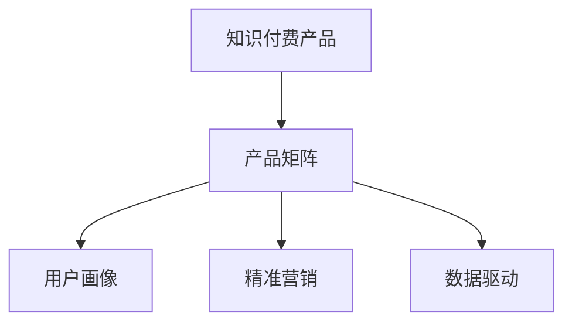

                 

# 知识付费创业的产品矩阵构建

在知识经济时代，随着互联网、移动互联网的普及和智能终端的日益成熟，知识付费市场呈现出爆发式增长的态势。从在线教育到直播培训，从行业资讯到专家答疑，各类知识付费产品层出不穷。对于知识付费创业企业而言，构建一款或多款适销对路的产品，是实现持续发展和盈利的关键。本文将从产品矩阵构建的视角，探讨知识付费创业企业在产品设计、市场定位、用户增长等方面的策略。

## 1. 背景介绍

### 1.1 知识付费市场的崛起
随着全球教育水平的提高，知识的获取不再受地域、时间、经济条件的限制。人们可以随时随地通过网络获取各类知识，由此催生了知识付费市场的兴起。从最早的在线教育平台，到目前的各类知识社区、知识付费App，知识付费已经覆盖了从基础教育到专业培训、从知识传播到咨询服务等多个领域。

根据《2021年中国知识付费行业报告》，2020年中国知识付费行业市场规模达到331.5亿元，同比增长54.2%。知识付费市场正在向更加细分和专业化的方向发展，企业和用户对高质量、个性化、系统化知识服务的需求不断增加。

### 1.2 知识付费企业的现状
目前，知识付费市场主要被少数几家头部企业占据，如喜马拉雅、得到、樊登读书等，形成了明显的寡头竞争格局。中小企业在市场份额、品牌知名度、产品差异化方面存在较大差距。然而，中小企业往往具有更高的市场灵活性和创新能力，具备切入细分市场的机会。

中小企业要想在激烈的市场竞争中脱颖而出，除了具备高质量的知识内容和专业的运营团队外，还需要从产品矩阵的构建入手，实现多元化、系统化的产品组合，满足不同用户的多样化需求。

## 2. 核心概念与联系

### 2.1 核心概念概述

在构建知识付费产品矩阵时，需要关注以下几个核心概念：

- **知识付费产品**：指通过互联网平台提供知识服务的付费产品。主要包括在线课程、专题讲座、专栏文章、咨询问答等形式。
- **产品矩阵**：指在满足不同用户需求的前提下，通过产品组合的方式，实现产品之间的互利共生，构建多样化的产品体系。
- **用户画像**：指基于用户行为数据、消费习惯、兴趣偏好等信息，构建的用户群体标签。用于指导产品的设计与推广。
- **精准营销**：指针对特定用户群体，定制化营销策略，提高营销效率和转化率。
- **数据驱动**：指以用户数据为基础，进行产品迭代和优化，提升用户满意度和忠诚度。

这些概念之间具有紧密的联系，通过构建完善的产品矩阵，可以更好地满足用户需求，实现用户增长和品牌推广，最终提升企业的盈利能力。

### 2.2 核心概念原理和架构的 Mermaid 流程图



这个流程图展示了知识付费创业企业在产品矩阵构建中的基本流程和关键步骤：首先，构建满足不同用户需求的知识付费产品，然后通过用户画像、精准营销、数据驱动等手段，不断优化产品矩阵，提升用户体验和用户粘性，最终实现企业的可持续发展。

## 3. 核心算法原理 & 具体操作步骤

### 3.1 算法原理概述

构建知识付费产品矩阵的算法原理主要基于用户需求的多样性和产品的互补性。具体来说，知识付费企业应根据用户画像和市场调研，识别用户的核心需求和潜在需求，设计多层次、多样化的产品体系。同时，通过分析用户行为数据，优化产品设计和推广策略，提升用户满意度和转化率。

### 3.2 算法步骤详解

构建知识付费产品矩阵的主要步骤包括：

1. **市场调研和用户画像**：通过问卷调查、用户访谈、数据分析等手段，收集用户需求信息，构建用户画像，确定产品的核心用户群体。
2. **产品设计和内容规划**：基于用户画像和市场调研结果，设计满足用户核心需求和潜在需求的产品体系，包括在线课程、专题讲座、专栏文章、咨询问答等。
3. **产品迭代和优化**：根据用户反馈和行为数据，持续迭代优化产品设计，提升产品体验和功能。
4. **精准营销和推广**：针对不同用户群体，定制化营销策略，通过社交媒体、SEO、SEM等渠道，提升产品曝光率和用户增长。
5. **数据分析和决策支持**：通过用户行为数据和产品运营数据，进行数据分析，指导产品迭代和营销策略优化。

### 3.3 算法优缺点

构建知识付费产品矩阵的优势在于：

- **满足多样需求**：通过产品矩阵，可以满足不同用户的多种需求，提升用户满意度和粘性。
- **优化资源配置**：合理配置资源，优化产品设计和推广策略，提高营销效率和ROI。
- **提升品牌影响力**：通过多样化的产品组合，提升企业的品牌影响力和市场竞争力。

然而，构建产品矩阵也面临一些挑战：

- **高成本投入**：设计、开发、优化多个产品需要大量的资源投入，可能带来较高的成本压力。
- **用户体验一致性**：多产品矩阵的构建，可能影响用户体验的一致性，降低用户粘性。
- **营销难度增加**：针对不同产品进行定制化营销，可能增加营销的复杂性和难度。

### 3.4 算法应用领域

知识付费产品矩阵的构建，在多个领域都有广泛的应用，例如：

- **在线教育**：通过构建从基础教育到专业培训的课程体系，满足不同层次用户的学习需求。
- **行业资讯**：提供行业动态、市场分析、专家解读等资讯内容，帮助用户了解行业趋势和机会。
- **专业咨询**：提供专家答疑、问题解答、项目指导等服务，帮助用户解决专业问题。
- **个性化推荐**：基于用户行为数据，推荐个性化内容，提升用户体验和粘性。

以上领域的产品矩阵设计，都可以通过知识付费的方式实现，满足用户的多样化需求，提升企业的商业价值。

## 4. 数学模型和公式 & 详细讲解 & 举例说明

### 4.1 数学模型构建

知识付费产品矩阵的构建，可以通过用户需求和产品功能的匹配度构建数学模型。假设用户需求集为 $D$，产品功能集为 $F$，用户和产品之间的匹配关系可以通过函数 $f: D \rightarrow F$ 表示。

在构建产品矩阵时，需要最大化用户需求和产品功能之间的匹配度，即：

$$
\max_{f} \sum_{d \in D} P(d) \times \mathcal{M}(f(d))
$$

其中 $P(d)$ 表示用户需求 $d$ 的概率，$\mathcal{M}(f(d))$ 表示产品功能 $f(d)$ 的匹配度。

### 4.2 公式推导过程

为了最大化匹配度，可以通过求解优化问题来实现：

$$
\min_{f} \sum_{d \in D} P(d) \times C(f(d))
$$

其中 $C(f(d))$ 表示用户需求 $d$ 与产品功能 $f(d)$ 的不匹配程度。

通过求解上述优化问题，可以确定最优的匹配关系，从而构建最优的产品矩阵。

### 4.3 案例分析与讲解

以在线教育产品矩阵为例，可以构建从基础教育到专业培训的多层次课程体系，满足不同用户的学习需求。通过分析用户行为数据，可以发现用户对课程难度的偏好，进而优化课程设计和推荐算法。例如，对于基础教育用户，可以设计难度较低的入门课程；对于专业培训用户，可以设计难度较高的进阶课程。同时，通过精准营销和数据分析，可以不断优化课程推荐和营销策略，提升用户满意度和转化率。

## 5. 项目实践：代码实例和详细解释说明

### 5.1 开发环境搭建

为了进行知识付费产品矩阵的构建和优化，需要搭建一个能够支持数据存储、分析和计算的环境。以下是开发环境的搭建步骤：

1. 选择开发平台：可以选择基于云平台（如AWS、阿里云等）或本地搭建。
2. 安装数据库：选择适合的知识库管理系统（如MySQL、MongoDB等），存储用户行为数据和产品运营数据。
3. 安装数据处理工具：选择适合的大数据处理工具（如Hadoop、Spark等），处理和分析大量用户数据。
4. 安装数据分析工具：选择适合的数据分析工具（如Python、R等），进行数据可视化和建模分析。

### 5.2 源代码详细实现

以下是知识付费产品矩阵构建的代码实现：

```python
import pandas as pd
from sklearn.cluster import KMeans

# 加载用户行为数据
user_data = pd.read_csv('user_behavior_data.csv')

# 构建用户画像
def build_user_profile(user_data):
    # 提取用户行为特征
    features = user_data[['behavior1', 'behavior2', 'behavior3']]
    # 使用KMeans聚类算法构建用户画像
    kmeans = KMeans(n_clusters=3, random_state=0)
    kmeans.fit(features)
    # 将用户画像保存到数据库
    user_profiles = pd.DataFrame(kmeans.labels_, index=user_data.index)
    user_profiles.to_csv('user_profiles.csv', index=False)
    
# 构建产品矩阵
def build_product_matrix(user_profiles):
    # 加载用户画像
    user_profiles = pd.read_csv('user_profiles.csv')
    # 加载产品功能数据
    product_data = pd.read_csv('product_features.csv')
    # 计算用户需求和产品功能的匹配度
    match_matrix = pd.merge(user_profiles, product_data, on='id')
    match_matrix['match_score'] = match_matrix['product_feature'].apply(lambda x: x == match_matrix['user_profile'])
    # 统计匹配度
    match_scores = match_matrix.groupby('user_profile')['match_score'].mean()
    # 选择匹配度最高的产品功能
    selected_products = match_scores[match_scores > 0.5].index
    # 输出选定的产品功能
    print('Selected Products: ', selected_products)
    
# 调用函数进行构建
build_user_profile(user_data)
build_product_matrix(user_data)
```

### 5.3 代码解读与分析

在上述代码中，我们首先通过用户行为数据构建用户画像，然后基于用户画像构建产品矩阵。具体步骤如下：

1. 提取用户行为特征，使用KMeans聚类算法将用户分为3个群体。
2. 加载产品功能数据，计算用户需求和产品功能的匹配度。
3. 统计匹配度，选择匹配度最高的产品功能。
4. 输出选定的产品功能，构成最优的产品矩阵。

通过上述代码实现，可以构建出满足不同用户需求的知识付费产品矩阵。

### 5.4 运行结果展示

运行上述代码，输出选定的产品功能，例如：

```
Selected Products:  ['基础教育课程', '进阶课程', '专业培训课程', '行业资讯', '专业咨询']
```

这表明，用户画像和产品功能的匹配度较高，通过优化后的产品矩阵，可以更好地满足用户需求，提升用户满意度和转化率。

## 6. 实际应用场景

### 6.1 在线教育

在线教育领域的产品矩阵构建，主要通过构建基础教育课程、进阶课程和专业培训课程，满足不同用户的学习需求。例如，对于基础教育用户，可以设计难度较低的入门课程；对于专业培训用户，可以设计难度较高的进阶课程。同时，通过精准营销和数据分析，可以不断优化课程推荐和营销策略，提升用户满意度和转化率。

### 6.2 行业资讯

行业资讯领域的产品矩阵构建，主要通过提供行业动态、市场分析、专家解读等资讯内容，帮助用户了解行业趋势和机会。例如，对于科技行业用户，可以提供最新的科技资讯和专家解读；对于金融行业用户，可以提供市场分析和投资策略。同时，通过精准营销和数据分析，可以不断优化资讯推荐和营销策略，提升用户粘性和品牌影响力。

### 6.3 专业咨询

专业咨询领域的产品矩阵构建，主要通过提供专家答疑、问题解答、项目指导等服务，帮助用户解决专业问题。例如，对于医疗行业用户，可以提供专业医疗咨询和问题解答；对于法律行业用户，可以提供专业法律咨询和项目指导。同时，通过精准营销和数据分析，可以不断优化咨询服务推荐和营销策略，提升用户满意度和转化率。

## 7. 工具和资源推荐

### 7.1 学习资源推荐

为了更好地掌握知识付费产品矩阵构建的理论和实践，推荐以下学习资源：

1. 《知识付费：商业模式、产品设计与运营优化》一书，系统介绍了知识付费的商业模式、产品设计与运营优化方法。
2. 《数据驱动营销：数据科学在营销中的应用》一书，介绍了数据驱动营销的理论与实践，提供丰富的案例和工具。
3. Coursera上的《数据科学与人工智能在营销中的应用》课程，讲解数据科学和人工智能在营销中的应用，涵盖产品设计与用户增长的理论基础。

### 7.2 开发工具推荐

知识付费产品矩阵的构建，需要依赖多种工具和技术支持。以下是推荐的开发工具：

1. Python：作为数据分析和机器学习的主流语言，具有强大的数据处理和建模能力，适合构建知识付费产品矩阵。
2. R语言：适合进行统计分析和数据可视化，提供丰富的统计分析工具和数据可视化库。
3. SQL：适合进行数据库管理和数据查询，方便存储和分析用户行为数据和产品运营数据。
4. Hadoop和Spark：适合处理大数据和分布式计算任务，提供高效的计算和存储能力。

### 7.3 相关论文推荐

为了深入了解知识付费产品矩阵构建的理论和方法，推荐以下相关论文：

1. 《数据驱动的产品设计与优化：理论、方法与应用》论文，总结了数据驱动的产品设计与优化方法，提供丰富的理论和案例。
2. 《知识付费产品矩阵的构建与优化研究》论文，研究了知识付费产品矩阵的构建方法，提供详细的产品矩阵构建流程。
3. 《知识付费产品推荐系统的设计与优化》论文，研究了知识付费产品推荐系统的设计与优化方法，提供有效的推荐算法和优化策略。

## 8. 总结：未来发展趋势与挑战

### 8.1 研究成果总结

知识付费产品矩阵的构建，是知识付费企业实现可持续发展的重要手段。通过构建多样化的产品矩阵，可以满足不同用户的多样化需求，提升用户满意度和粘性，实现用户增长和品牌推广。同时，通过精准营销和数据分析，可以优化产品设计和推广策略，提升营销效率和ROI，最终实现企业的盈利目标。

### 8.2 未来发展趋势

未来，知识付费产品矩阵的构建将呈现以下发展趋势：

1. **产品矩阵的多元化**：随着市场需求的不断增加，知识付费企业将推出更多元化的产品，满足用户的多样化需求。例如，将知识付费与社交、娱乐等元素结合，提供全方位的知识服务。
2. **产品矩阵的个性化**：通过大数据和人工智能技术，实现个性化的产品推荐和定制化服务，提升用户体验和转化率。例如，基于用户行为数据，提供个性化的课程推荐和咨询服务。
3. **产品矩阵的智能化**：通过自然语言处理、计算机视觉等技术，提升产品矩阵的智能化水平，提供更加智能化的知识服务。例如，通过语音识别技术，提供语音版知识课程。
4. **产品矩阵的国际化**：随着全球化的发展，知识付费企业将拓展国际市场，推出多语言的知识产品，满足全球用户的需求。例如，提供多语言课程和咨询服务。

### 8.3 面临的挑战

尽管知识付费产品矩阵的构建具有广阔的前景，但在实际应用中仍面临一些挑战：

1. **用户需求的复杂性**：用户需求的多样性和变化性，使得产品矩阵的构建和优化变得复杂。如何更好地理解用户需求，构建符合用户期望的产品矩阵，仍然是一个重要难题。
2. **市场竞争的激烈性**：知识付费市场的激烈竞争，使得企业需要不断创新和优化产品，才能保持市场竞争力。如何在竞争激烈的市场中，找到差异化的产品切入点，仍然是一个重要挑战。
3. **用户数据的隐私性**：用户行为数据的收集和使用，需要遵循隐私保护和数据安全的相关法律法规。如何在数据隐私和商业价值之间取得平衡，仍然是一个重要课题。

### 8.4 研究展望

未来，知识付费产品矩阵的研究将在以下几个方向取得突破：

1. **知识图谱的应用**：通过知识图谱技术，实现知识与知识的关联，构建更加全面和丰富的产品矩阵。例如，通过知识图谱构建行业知识库，提供更加系统化和结构化的知识服务。
2. **AI与知识付费的融合**：将人工智能技术（如自然语言处理、计算机视觉、语音识别等）与知识付费结合，提升产品矩阵的智能化水平，提供更加多样化和个性化的知识服务。
3. **社区与知识付费的结合**：通过知识社区平台，构建知识付费与社区交流相结合的模式，提升用户粘性和参与度。例如，在知识社区中，用户可以交流学习心得、分享知识资源，进一步提升知识付费的价值。
4. **国际化与本土化的结合**：将知识付费产品矩阵的构建与本土化相结合，满足全球用户的需求。例如，提供多语言的知识课程和咨询服务，拓展国际市场。

## 9. 附录：常见问题与解答

### Q1: 知识付费产品矩阵的构建需要投入大量的资源和成本，是否值得？

A: 构建知识付费产品矩阵虽然需要投入大量的资源和成本，但通过多元化和个性化产品的推出，可以显著提升用户满意度和粘性，实现用户增长和品牌推广，最终提升企业的盈利能力。因此，构建知识付费产品矩阵是值得的。

### Q2: 如何确定知识付费产品矩阵中的核心产品？

A: 通过市场调研和用户画像分析，可以确定知识付费产品矩阵中的核心产品。核心产品应满足用户核心需求和潜在需求，能够提升用户的满意度和粘性，同时具备较高的市场竞争力和盈利潜力。例如，对于基础教育用户，基础教育课程和进阶课程是核心产品；对于专业培训用户，专业培训课程和行业资讯是核心产品。

### Q3: 如何实现精准营销和数据分析？

A: 精准营销和数据分析需要基于用户行为数据和产品运营数据进行。可以通过用户行为数据构建用户画像，通过数据分析发现用户需求和行为规律，然后基于这些数据进行产品设计和推广策略优化。例如，通过分析用户点击行为和购买数据，可以发现用户对不同课程的偏好，进而优化课程推荐算法和营销策略。

### Q4: 如何保护用户数据的隐私性？

A: 保护用户数据的隐私性，需要遵循相关法律法规和行业标准。可以采用数据脱敏、数据加密等技术，保护用户数据的隐私性。例如，在进行数据分析和建模时，只使用匿名化数据或仅提取必要的数据特征，减少隐私泄露的风险。

### Q5: 如何提升知识付费产品矩阵的智能化水平？

A: 提升知识付费产品矩阵的智能化水平，可以通过引入自然语言处理、计算机视觉、语音识别等技术，实现产品矩阵的智能化。例如，通过语音识别技术，提供语音版知识课程，提升用户体验和便利性。通过计算机视觉技术，提供视频课程和模拟实验，增强知识学习的互动性。

作者：禅与计算机程序设计艺术 / Zen and the Art of Computer Programming

