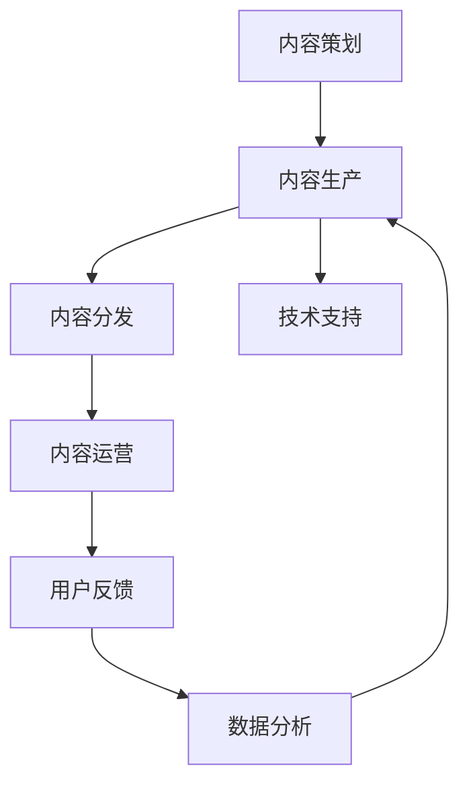

                 

# 知识付费创业的内容体系构建方法

## 1. 背景介绍

在知识经济和信息爆炸的时代，内容已经成为最珍贵的资产之一。对于知识付费创业来说，构建一个高质量、多样化、可持续的内容体系是赢得市场和用户的关键。本文将系统介绍如何构建有效的知识付费内容体系，涵盖内容策划、生产、推广、运营等全流程，为内容创业者提供全面、实用的方法论。

## 2. 核心概念与联系

### 2.1 核心概念概述

为更好地理解知识付费创业的内容体系构建方法，本节将介绍几个核心概念及其关系：

- **内容策划 (Content Planning)**：基于用户需求和市场趋势，制定内容计划和目标，决定内容主题、形式、分发渠道等策略。
- **内容生产 (Content Production)**：按照策划的内容计划，组织团队进行内容创作、制作、编辑和审核。
- **内容分发 (Content Distribution)**：利用各种渠道将内容推送给目标用户，以吸引用户关注和参与。
- **内容运营 (Content Operations)**：监测内容效果，分析用户反馈，持续优化内容策略，提升内容质量和用户粘性。
- **用户反馈 (User Feedback)**：收集用户对内容的意见和建议，迭代改进内容产品和用户体验。
- **数据分析 (Data Analytics)**：通过数据分析工具和技术，对内容效果进行量化评估，指导内容运营优化。
- **技术支持 (Technical Support)**：利用技术手段，如自动化工具、API接口等，提高内容生产、分发和运营效率。

这些概念共同构成了知识付费内容体系的框架，形成一个闭环的系统，确保内容从策划到运营的全生命周期管理。

### 2.2 核心概念原理和架构的 Mermaid 流程图



## 3. 核心算法原理 & 具体操作步骤

### 3.1 算法原理概述

知识付费创业的内容体系构建方法，基于内容生命周期管理的闭环系统，遵循以下基本原理：

- **用户导向**：一切内容策划和生产都应以用户需求为中心，通过调研分析确定热门主题和形式。
- **数据驱动**：通过用户反馈和数据分析，不断优化内容策略，确保内容的质量和相关性。
- **技术支撑**：利用自动化工具和技术手段，提高内容生产、分发和运营的效率，降低成本。
- **持续迭代**：基于用户反馈和市场变化，持续调整和优化内容产品和运营策略，确保内容体系的生命力。

### 3.2 算法步骤详解

构建知识付费创业的内容体系，需要经过以下关键步骤：

**Step 1: 内容市场调研**
- 分析用户需求：通过问卷调查、社交媒体分析、用户行为数据等手段，了解用户的兴趣和痛点。
- 竞争对比分析：研究竞争对手的内容体系和用户反馈，寻找差异化竞争点。
- 趋势预测：结合行业报告、技术发展趋势，预测未来的内容需求和形式。

**Step 2: 内容主题和形式策划**
- 主题设定：根据调研结果，设定具体的内容主题和系列化方案。
- 形式设计：确定内容的具体形式，如文字、音频、视频、直播等，以及分发渠道（如APP、公众号、社交媒体等）。
- 内容计划：制定详细的生产计划，包括内容周期、人员分工、进度安排等。

**Step 3: 内容生产与制作**
- 团队组织：组建或招募专业内容团队，确保高质量内容产出。
- 创作流程：设计创作流程，包括选题、调研、撰写、编辑、审核等环节。
- 制作工具：利用内容管理系统、图形设计工具、音视频编辑软件等，提升内容制作效率和质量。

**Step 4: 内容分发与推广**
- 渠道选择：根据内容形式和用户群体，选择合适的分发渠道。
- 推广策略：制定内容推广计划，包括SEO优化、社交媒体推广、付费广告等。
- 分发实施：利用技术手段，自动化地分发内容，确保内容覆盖面和到达率。

**Step 5: 内容运营与优化**
- 监测指标：设置关键运营指标，如用户参与度、留存率、转化率等，进行实时监测。
- 反馈收集：通过用户调查、评论、评分等方式，收集用户反馈。
- 内容优化：根据反馈结果，调整内容策略，优化内容和形式。

### 3.3 算法优缺点

基于内容生命周期管理的知识付费创业内容体系构建方法，具有以下优点：

- **系统化管理**：通过闭环流程，确保内容从策划到运营的各个环节有序进行，提高效率。
- **用户中心**：以用户需求为导向，确保内容的相关性和吸引力，提升用户粘性。
- **数据驱动**：通过数据分析，持续优化内容策略，保持竞争力。
- **技术支撑**：利用技术手段，提高内容生产、分发和运营效率。

同时，该方法也存在以下局限性：

- **资源投入大**：需要组建专业的内容团队和进行技术投入，成本较高。
- **运营复杂**：内容运营涉及多方面协调，需要细致的管理和执行。
- **市场变化快**：内容体系需要不断迭代调整，以适应快速变化的市场。
- **依赖技术**：对技术工具的依赖较高，需要持续更新和维护。

尽管有这些局限，但基于内容生命周期管理的方法仍是最为主流和系统的知识付费内容构建策略。

### 3.4 算法应用领域

基于内容生命周期管理的方法，适用于各种知识付费平台和应用场景，包括但不限于：

- **在线教育平台**：如Coursera、Udemy、Khan Academy等，内容主要以课程和视频形式分发。
- **知识付费APP**：如得到、喜马拉雅、知乎live等，内容形式多样，涉及音频、视频、文字等。
- **内容营销网站**：如Medium、博客园、简书等，通过文章和博客形式分享知识。
- **专业社群平台**：如行业论坛、技术社区、专业协会等，提供深度文章和专家讲座。
- **企业内训平台**：如企业大学、内部培训系统等，提供定制化的员工培训课程。

## 4. 数学模型和公式 & 详细讲解 & 举例说明

### 4.1 数学模型构建

本文将构建一个简化版的用户参与度预测模型，以帮助内容创业者评估内容策略的效果。设用户参与度 $y$ 为因变量，内容相关性 $x_1$、内容深度 $x_2$、内容更新频率 $x_3$ 为自变量，构建线性回归模型：

$$
y = \beta_0 + \beta_1 x_1 + \beta_2 x_2 + \beta_3 x_3 + \epsilon
$$

其中，$\beta_0$ 为截距，$\beta_1$、$\beta_2$、$\beta_3$ 为系数，$\epsilon$ 为误差项。

### 4.2 公式推导过程

假设我们已经收集到 $N$ 个样本数据，每个样本包括用户参与度 $y_i$ 和自变量 $x_{ij}(j=1,2,3)$。利用最小二乘法求解模型参数，即：

$$
\beta_0, \beta_1, \beta_2, \beta_3 = \arg\min \sum_{i=1}^N (y_i - (\beta_0 + \beta_1 x_{i1} + \beta_2 x_{i2} + \beta_3 x_{i3}))^2
$$

利用矩阵形式，上述公式可以写为：

$$
(\beta_0, \beta_1, \beta_2, \beta_3)^T = (X^TX)^{-1}X^Ty
$$

其中 $X$ 为自变量矩阵，$y$ 为因变量向量。

### 4.3 案例分析与讲解

假设我们有一个在线教育平台，收集了50门课程的用户参与度数据，每个课程包含相关性、深度和更新频率等特征。通过构建上述线性回归模型，预测参与度的变化，调整内容策略。

## 5. 项目实践：代码实例和详细解释说明

### 5.1 开发环境搭建

在进行内容体系构建的实践前，我们需要准备好开发环境。以下是使用Python进行项目开发的环境配置流程：

1. 安装Anaconda：从官网下载并安装Anaconda，用于创建独立的Python环境。

2. 创建并激活虚拟环境：
```bash
conda create -n content-env python=3.8 
conda activate content-env
```

3. 安装所需的Python包：
```bash
conda install pandas numpy scikit-learn matplotlib tqdm
```

完成上述步骤后，即可在`content-env`环境中开始内容构建的实践。

### 5.2 源代码详细实现

这里我们以在线教育平台为例，构建用户参与度预测模型。

```python
import pandas as pd
import numpy as np
from sklearn.linear_model import LinearRegression
from sklearn.model_selection import train_test_split

# 数据读取
data = pd.read_csv('user_interaction.csv')

# 数据处理
X = data[['x1', 'x2', 'x3']]
y = data['y']

# 模型训练
X_train, X_test, y_train, y_test = train_test_split(X, y, test_size=0.2, random_state=42)
model = LinearRegression()
model.fit(X_train, y_train)

# 预测并输出结果
y_pred = model.predict(X_test)
print(y_pred)
```

### 5.3 代码解读与分析

让我们再详细解读一下关键代码的实现细节：

**数据读取**：
- 使用Pandas库从CSV文件中读取用户参与度数据，并将其转换为数据框。

**数据处理**：
- 从数据框中提取自变量和因变量，并分别赋值给矩阵$X$和向量$y$。

**模型训练**：
- 利用train_test_split函数将数据集分为训练集和测试集。
- 创建并训练线性回归模型，使用训练集数据拟合模型参数。

**预测并输出结果**：
- 利用训练好的模型对测试集进行预测，并输出预测结果。

通过上述代码，我们实现了简单的用户参与度预测模型。需要注意的是，实际应用中可能需要对数据进行更多的预处理和特征工程，以提升模型性能。

### 5.4 运行结果展示

执行上述代码后，输出预测的用户参与度结果。

## 6. 实际应用场景

### 6.1 在线教育平台

在线教育平台是知识付费创业的主要场景之一。通过构建内容体系，平台可以提供系统化的学习路径，满足用户的多样化学习需求。

**内容策划**：根据用户调研和行业趋势，设计多学科、多层次的课程内容，包括K-12教育、职业教育、职场技能等。

**内容生产**：组建名师团队和内容编辑，进行课程制作和审核，确保内容质量和专业性。

**内容分发**：通过平台网站、移动应用、社交媒体等多种渠道分发课程，增加用户覆盖面。

**内容运营**：通过数据分析，优化课程推荐和广告投放策略，提升用户参与度和留存率。

### 6.2 知识付费APP

知识付费APP是内容分发的重要渠道。平台通过构建多样化内容体系，吸引用户订阅和付费。

**内容策划**：根据用户兴趣和市场需求，设计专题和专栏，涵盖读书、职场、健康等多个领域。

**内容生产**：引入专业作者和KOL，提供音频、视频、文字等多种形式的内容，丰富用户体验。

**内容分发**：通过个性化推荐系统，将内容精准推送给目标用户，增加用户黏性。

**内容运营**：通过用户反馈和数据分析，不断优化内容策略，提升用户满意度和转化率。

### 6.3 内容营销网站

内容营销网站通过优质的内容吸引访问和订阅，实现流量变现。

**内容策划**：围绕网站定位，策划热点话题和长尾内容，如技术博客、行业分析等。

**内容生产**：组建专业作者团队，进行内容创作和编辑，确保内容质量。

**内容分发**：通过SEO优化、社交媒体推广等方式，提升网站流量和品牌影响力。

**内容运营**：通过用户互动和数据分析，优化内容策略，提升用户参与度和转化率。

### 6.4 未来应用展望

伴随互联网技术和数据科学的不断发展，知识付费内容体系构建将呈现以下几个发展趋势：

1. **个性化推荐**：利用机器学习和用户画像，提供个性化的内容推荐，提升用户满意度。
2. **多渠道分发**：结合社交媒体、视频平台等多种渠道，扩大内容覆盖面，提升用户参与度。
3. **智能交互**：引入AI技术，实现智能聊天机器人、内容生成等互动功能，提升用户体验。
4. **内容社区化**：构建用户社区和知识共享平台，增强用户粘性和互动性。
5. **内容协同创作**：通过众包和协作机制，实现用户内容生成和编辑，丰富内容来源。
6. **内容版权保护**：引入区块链和数字签名技术，保护内容版权和知识产权。

## 7. 工具和资源推荐

### 7.1 学习资源推荐

为了帮助内容创业者掌握内容体系构建的方法论，以下是一些优质的学习资源：

1. **《内容营销秘籍》系列博文**：深入浅出地介绍了内容策划、生产、分发、运营的全流程方法，适合内容创业者和市场营销人员阅读。

2. **《数据驱动的内容营销》课程**：通过实际案例讲解数据分析在内容运营中的应用，帮助内容创业者提升数据素养。

3. **《内容营销入门指南》书籍**：系统介绍了内容营销的基本概念、策略和实践，适合内容新人入门学习。

4. **Google Analytics网站分析工具**：通过分析网站流量和用户行为数据，帮助内容创业者优化内容策略。

5. **SEMrush SEO优化工具**：帮助内容创业者进行搜索引擎优化，提升内容的搜索引擎排名和访问量。

6. **HubSpot内容管理系统**：提供强大的内容管理功能和运营工具，帮助内容创业者高效生产和管理内容。

通过这些资源的学习实践，相信内容创业者能够系统掌握内容体系构建的方法论，成功打造出吸引用户的优质内容。

### 7.2 开发工具推荐

高效的开发离不开优秀的工具支持。以下是几款常用的内容运营工具：

1. **Hootsuite**：全球领先的社交媒体管理平台，支持多渠道内容发布和分析。

2. **Buffer**：提供简单易用的社交媒体内容管理和分析工具，适合小型内容团队使用。

3. **Google Analytics**：强大的网站流量分析工具，提供详细的数据报告和用户行为分析。

4. **SEMrush**：全面的搜索引擎优化工具，帮助内容创业者优化搜索引擎排名。

5. **Trello**：项目管理工具，帮助内容团队进行任务管理和协作。

6. **Asana**：任务管理和团队协作工具，支持内容运营的流程化管理。

合理利用这些工具，可以显著提升内容运营的效率和效果，降低人力和时间成本。

### 7.3 相关论文推荐

内容体系构建的持续发展得益于学界的不断研究。以下是几篇具有代表性的相关论文，推荐阅读：

1. **内容推荐系统的研究综述**：综述了内容推荐系统的最新进展和应用，提供了丰富的理论和技术基础。

2. **内容分发的多任务学习**：通过多任务学习，提升内容分发的精准度和用户满意度。

3. **用户行为分析与内容运营**：利用用户行为数据，优化内容策略，提升用户参与度和留存率。

4. **社交媒体内容优化**：研究社交媒体内容的形式和发布策略，提升社交媒体内容的吸引力和传播效果。

5. **内容协同创作的社会网络分析**：通过社会网络分析，优化内容协同创作的效率和质量。

这些论文代表了大数据和机器学习在内容体系构建中的前沿应用，有助于内容创业者深入理解相关技术和方法。

## 8. 总结：未来发展趋势与挑战

### 8.1 总结

本文系统介绍了知识付费创业的内容体系构建方法，从内容策划、生产、分发、运营的全流程出发，提供了系统化、数据驱动、技术支撑的内容运营策略。通过深入浅出的案例分析，帮助内容创业者提升内容运营的效果。

通过本文的学习实践，相信内容创业者能够掌握构建内容体系的方法论，成功打造出吸引用户的优质内容。

### 8.2 未来发展趋势

展望未来，内容体系构建将呈现以下几个发展趋势：

1. **个性化推荐系统**：利用大数据和机器学习，提供个性化的内容推荐，提升用户满意度。
2. **多渠道分发策略**：结合社交媒体、视频平台等多种渠道，扩大内容覆盖面，提升用户参与度。
3. **智能互动技术**：引入AI技术，实现智能聊天机器人、内容生成等互动功能，提升用户体验。
4. **内容社区化平台**：构建用户社区和知识共享平台，增强用户粘性和互动性。
5. **内容协同创作机制**：通过众包和协作机制，实现用户内容生成和编辑，丰富内容来源。
6. **内容版权保护技术**：引入区块链和数字签名技术，保护内容版权和知识产权。

### 8.3 面临的挑战

尽管内容体系构建的方法已经取得了不错的效果，但在实现过程中仍面临诸多挑战：

1. **数据隐私和安全**：用户数据隐私和安全问题，需要严格遵守相关法律法规，保护用户隐私。
2. **内容版权问题**：原创内容的版权保护，需要构建有效的版权管理系统，防止侵权行为。
3. **技术复杂度**：内容运营涉及多方面技术，需要具备一定的技术素养和知识储备。
4. **内容质量控制**：确保内容质量，避免低俗、误导性内容的出现，需要严格的内容审核机制。
5. **用户运营成本**：内容生产和运营需要投入大量人力和资源，如何高效管理，降低成本，是一个重要问题。

尽管有这些挑战，但通过不断创新和优化，相信内容体系构建将不断突破瓶颈，实现更高效、更高质量的内容运营。

### 8.4 研究展望

面向未来，内容体系构建的研究将不断深入，可能涉及以下几个方向：

1. **用户行为分析**：利用深度学习和大数据分析，深入理解用户需求和行为，优化内容策略。
2. **内容协同创作**：引入协同创作工具和平台，促进用户之间的知识共享和内容合作。
3. **跨媒体内容运营**：实现跨媒体内容整合和分发，提升内容的多渠道效果。
4. **AI技术应用**：利用自然语言处理、计算机视觉等AI技术，提升内容创作和运营的效率。
5. **内容版权管理**：构建基于区块链的内容版权管理系统，保护内容创作者权益。

这些研究方向的探索，将推动内容体系的不断创新和优化，为内容创业者和用户带来更多价值。

## 9. 附录：常见问题与解答

**Q1：如何评估内容策略的效果？**

A: 评估内容策略的效果，可以通过以下指标进行衡量：
- 用户参与度：如观看次数、阅读量、点赞、评论等。
- 用户留存率：如日活跃用户数、月留存率等。
- 用户转化率：如付费订阅用户比例、广告点击率等。

**Q2：如何提高内容质量？**

A: 提高内容质量，可以从以下几个方面入手：
- 内容策划：深入了解用户需求，设计有价值、有吸引力的内容主题。
- 内容生产：组建专业团队，进行高质量的内容创作和编辑。
- 内容审核：建立严格的内容审核机制，避免低俗、误导性内容的出现。

**Q3：如何降低内容运营成本？**

A: 降低内容运营成本，可以从以下几个方面入手：
- 自动化工具：利用内容管理系统、自动化发布工具等，提高内容生产和发布效率。
- 多渠道分发：通过社交媒体、搜索引擎、视频平台等多种渠道分发内容，扩大覆盖面。
- 用户互动：通过用户评论、互动等，提升内容粘性和用户留存率，减少人力投入。

通过优化内容策略和运营方式，可以有效降低内容运营成本，提升内容效益。

**Q4：如何保护内容版权？**

A: 保护内容版权，可以从以下几个方面入手：
- 版权登记：通过版权登记，获取法律保护。
- 数字签名：利用数字签名技术，保护内容的完整性和真实性。
- 区块链技术：利用区块链技术，建立内容版权管理系统，确保内容版权的透明和可追溯。

通过构建有效的版权保护机制，可以有效保护内容创作者权益，避免侵权行为。

**Q5：如何利用数据分析提升内容策略？**

A: 利用数据分析提升内容策略，可以通过以下步骤进行：
- 数据收集：收集用户行为数据、内容浏览数据等，进行数据清洗和整理。
- 数据建模：利用机器学习模型，对用户行为和内容效果进行建模分析。
- 策略优化：根据分析结果，调整和优化内容策略，提升内容质量和用户满意度。

通过数据驱动的内容运营，可以有效提升内容策略的科学性和效果。

---

作者：禅与计算机程序设计艺术 / Zen and the Art of Computer Programming

