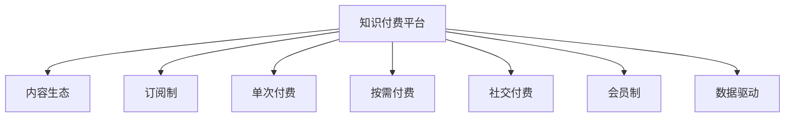

                 

# 知识付费创业的商业模式创新

## 1. 背景介绍

在数字化浪潮的推动下，知识付费成为互联网经济发展的重要驱动力。从“得到”、“喜马拉雅”到“知识星球”、“小鹅通”，各大平台纷纷涌入知识付费赛道，并已逐渐成为推动用户增长、提升用户黏性的重要手段。然而，随着市场竞争的加剧，单纯以内容为核心的知识付费模型面临诸多挑战。本文将从商业模式创新、技术驱动创新和用户体验提升三个维度探讨知识付费创业的新方向，助力创业者和平台在知识付费领域实现突破。

## 2. 核心概念与联系

### 2.1 核心概念概述

为更好地理解知识付费创业的商业模式创新，本节将介绍几个密切相关的核心概念：

- **知识付费平台**：以“知识付费”为核心定位，提供专业化、系统化、结构化的知识和技能服务，让用户以付费的方式获取高质量内容的平台。
- **内容生态**：包括内容生产者、内容运营、内容消费者等多个角色，以及他们之间的关系和互动。
- **订阅制**：用户定期支付固定费用，获得平台上所有或特定内容的服务模式。
- **单次付费**：用户基于内容获取价值的大小，每次访问支付相应费用的服务模式。
- **按需付费**：用户根据自身需求，按需购买单篇或单节内容的服务模式。
- **社交付费**：用户通过分享、推荐等方式，获得其他用户的奖励，以此付费的方式获得平台内容的服务模式。
- **会员制**：用户支付固定费用，获得平台上特定服务的会员模式。
- **数据驱动**：通过大数据和人工智能技术，对用户行为进行分析，提升平台运营效率和用户体验的服务模式。

这些概念之间的逻辑关系可以通过以下Mermaid流程图来展示：



这个流程图展示了一站式知识付费平台的核心要素及其之间的关系：

1. 知识付费平台以内容为核心，形成内容生态。
2. 平台采用多种付费方式，满足不同用户需求。
3. 用户通过会员制、社交付费等多元机制获取平台内容。
4. 平台利用数据驱动技术，提升用户体验和运营效率。

## 3. 核心算法原理 & 具体操作步骤
### 3.1 算法原理概述

知识付费创业的商业模式创新，本质上是对用户需求和平台运营策略的优化。核心在于构建可持续发展的盈利模式，提升用户粘性和满意度。

以用户需求为出发点，结合大数据分析、用户行为预测等技术手段，优化订阅模式、推荐机制、个性化内容定制等，以提升用户体验和平台收益。

在实际操作中，通常包括以下几个关键步骤：

- **用户画像构建**：通过收集用户行为数据，构建用户画像，识别不同用户群体的需求和偏好。
- **内容精准推荐**：利用协同过滤、基于内容的推荐算法等，向用户推荐高质量内容。
- **订阅模式优化**：设计灵活的订阅模式，如按需购买、自动续费等，增强用户粘性。
- **个性化内容定制**：根据用户画像和行为数据，提供个性化推荐和定制化内容，提升用户体验。
- **社交激励机制**：建立内容分享、推荐奖励机制，通过社交网络效应，扩大内容传播范围，提升平台活跃度。
- **数据驱动运营**：利用数据分析和机器学习技术，持续优化运营策略，提升平台效益。

### 3.2 算法步骤详解

**Step 1: 用户画像构建**
1. 收集用户行为数据，包括浏览记录、购买记录、评价反馈等。
2. 使用用户画像工具（如Apache Mahout、TensorFlow等），对数据进行处理和分析。
3. 根据用户的行为特征，构建用户画像，标识出不同用户群体的需求和偏好。

**Step 2: 内容精准推荐**
1. 设计推荐算法，如协同过滤、基于内容的推荐算法、混合推荐算法等。
2. 对推荐算法进行训练和优化，以提升推荐准确率和用户体验。
3. 将推荐结果推送给用户，并通过A/B测试等手段不断优化推荐策略。

**Step 3: 订阅模式优化**
1. 设计灵活的订阅模式，如单次付费、按需付费、自动续费等。
2. 通过数据分析和用户调研，选择最合适的订阅模式，满足不同用户的需求。
3. 设计用户忠诚计划，如积分兑换、优惠券等，提升用户粘性。

**Step 4: 个性化内容定制**
1. 分析用户画像，识别不同用户群体的需求。
2. 设计个性化推荐和定制化内容生成机制，如根据用户偏好生成个性化视频课程、文章等。
3. 利用大数据和机器学习技术，不断优化个性化推荐算法，提升用户体验。

**Step 5: 社交激励机制**
1. 设计内容分享、推荐奖励机制，如积分奖励、平台币等。
2. 通过社交网络效应，扩大内容传播范围，提升平台活跃度。
3. 利用数据分析和用户反馈，不断优化激励机制，提升用户参与度。

**Step 6: 数据驱动运营**
1. 收集和分析平台运营数据，包括用户行为数据、内容消费数据、营销数据等。
2. 利用数据分析和机器学习技术，持续优化运营策略，提升平台效益。
3. 通过A/B测试、用户调研等手段，不断验证和优化运营策略。

### 3.3 算法优缺点

知识付费创业的商业模式创新，通过优化订阅模式、推荐机制、个性化内容定制等，可以显著提升用户体验和平台收益，但也存在一些局限性：

**优点**：
1. 提升用户粘性：通过订阅模式、个性化推荐等方式，增强用户对平台的依赖。
2. 提升内容价值：精准推荐和个性化内容定制，提升了内容的价值和用户体验。
3. 多元化盈利模式：订阅、单次付费、按需付费等多样化付费方式，增强了平台的收入来源。
4. 数据驱动运营：通过数据分析和机器学习，提升平台运营效率和决策准确性。

**缺点**：
1. 数据隐私问题：大量用户行为数据的收集和使用，可能带来用户隐私和数据安全问题。
2. 内容质量依赖：内容质量和推荐算法的优劣，直接决定了用户满意度和平台收益。
3. 运营成本高：数据分析、算法优化、内容定制等，需要大量的技术投入和运营成本。
4. 用户群体复杂：不同用户群体的需求和偏好差异较大，难以统一管理。

尽管存在这些局限性，但就目前而言，知识付费创业的商业模式创新仍是主要的发展方向，各大平台纷纷在这方面投入大量资源。未来相关研究将集中在如何更好地保护用户隐私、提升内容质量、降低运营成本等方面，以实现商业模式的持续优化和创新。

### 3.4 算法应用领域

知识付费创业的商业模式创新，在多个领域已经得到了广泛的应用，例如：

- **教育培训**：如编程、外语、职业资格等各类在线教育课程。
- **职业技能**：如项目管理、人力资源、金融投资等各类职业技能培训课程。
- **健康医疗**：如心理辅导、营养学、中医养生等各类健康管理课程。
- **商业管理**：如市场营销、品牌管理、财务管理等各类商业管理课程。
- **文化艺术**：如音乐、美术、文学等各类文化艺术课程。
- **生活技能**：如厨艺、摄影、旅行等各类生活技能课程。

除了上述这些经典领域外，知识付费创业还在更多场景中得到了应用，如企业内部培训、职业发展规划、个人兴趣拓展等，为知识传播和技能提升提供了新的途径。

## 4. 数学模型和公式 & 详细讲解 & 举例说明
### 4.1 数学模型构建

在知识付费创业中，主要涉及用户画像构建、内容推荐算法、订阅模式优化等多个数学模型。

以协同过滤推荐算法为例，设用户集为 $U$，物品集为 $I$，用户 $u$ 对物品 $i$ 的评分矩阵为 $R$。用户 $u$ 与用户 $v$ 的相似度为 $S_{uv}$，用户 $v$ 对物品 $i$ 的评分 $r_{vi}$，则协同过滤推荐算法的目标函数为：

$$
\min_{\theta} \frac{1}{|I|}\sum_{u=1}^{|U|} \sum_{i=1}^{|I|} (R_{ui} - \theta_u^T \hat{R}_{vi})^2
$$

其中 $\hat{R}_{vi}$ 为物品 $i$ 的预测评分，$S_{uv}$ 为相似度函数。

### 4.2 公式推导过程

以用户画像构建为例，设用户行为数据为 $D=\{(x_i,y_i)\}_{i=1}^N$，其中 $x_i$ 为行为特征向量，$y_i$ 为标签向量。使用线性回归模型进行用户画像构建：

$$
\hat{y}_i = \theta^T x_i
$$

其中 $\theta$ 为模型参数。

利用最小二乘法求解模型参数 $\theta$：

$$
\theta = (X^TX)^{-1}X^Ty
$$

其中 $X$ 为特征矩阵，$y$ 为标签向量。

### 4.3 案例分析与讲解

以内容推荐为例，设用户 $u$ 对物品 $i$ 的评分矩阵为 $R_{ui}$，物品 $i$ 的特征向量为 $f_i$，用户 $u$ 的特征向量为 $g_u$。利用基于内容的推荐算法，用户 $u$ 对物品 $i$ 的预测评分 $p_{ui}$ 为：

$$
p_{ui} = g_u^Tf_i
$$

其中 $g_u$ 和 $f_i$ 均为归一化后的特征向量。

## 5. 项目实践：代码实例和详细解释说明
### 5.1 开发环境搭建

在进行知识付费项目开发前，我们需要准备好开发环境。以下是使用Python进行PyTorch开发的环境配置流程：

1. 安装Anaconda：从官网下载并安装Anaconda，用于创建独立的Python环境。

2. 创建并激活虚拟环境：
```bash
conda create -n pytorch-env python=3.8 
conda activate pytorch-env
```

3. 安装PyTorch：根据CUDA版本，从官网获取对应的安装命令。例如：
```bash
conda install pytorch torchvision torchaudio cudatoolkit=11.1 -c pytorch -c conda-forge
```

4. 安装TensorFlow：
```bash
pip install tensorflow
```

5. 安装各类工具包：
```bash
pip install numpy pandas scikit-learn matplotlib tqdm jupyter notebook ipython
```

完成上述步骤后，即可在`pytorch-env`环境中开始知识付费项目开发。

### 5.2 源代码详细实现

这里我们以推荐系统为例，给出使用PyTorch进行内容推荐的PyTorch代码实现。

首先，定义推荐模型类：

```python
import torch
import torch.nn as nn

class Recommender(nn.Module):
    def __init__(self, input_dim, output_dim):
        super(Recommender, self).__init__()
        self.fc1 = nn.Linear(input_dim, 32)
        self.fc2 = nn.Linear(32, output_dim)
    
    def forward(self, x):
        x = torch.relu(self.fc1(x))
        x = self.fc2(x)
        return x
```

然后，定义数据加载器和优化器：

```python
from torch.utils.data import Dataset
from torch.optim import SGD

class RecommendationDataset(Dataset):
    def __init__(self, data, labels):
        self.data = data
        self.labels = labels
        
    def __len__(self):
        return len(self.data)
    
    def __getitem__(self, item):
        return self.data[item], self.labels[item]

model = Recommender(input_dim, output_dim)
optimizer = SGD(model.parameters(), lr=0.01)
```

接着，定义训练和评估函数：

```python
def train(model, data_loader, optimizer, num_epochs):
    model.train()
    for epoch in range(num_epochs):
        for data, target in data_loader:
            optimizer.zero_grad()
            output = model(data)
            loss = nn.MSELoss()(output, target)
            loss.backward()
            optimizer.step()
    
def evaluate(model, data_loader):
    model.eval()
    correct = 0
    total = 0
    with torch.no_grad():
        for data, target in data_loader:
            output = model(data)
            total += target.size(0)
            correct += torch.sum(output == target)
    print('Accuracy: {:.2f}%'.format(correct / total * 100))
```

最后，启动训练流程并在测试集上评估：

```python
data_loader = DataLoader(train_dataset, batch_size=32)
train(model, data_loader, optimizer, num_epochs=10)
evaluate(model, test_loader)
```

以上就是使用PyTorch进行内容推荐的完整代码实现。可以看到，借助PyTorch，我们可以很方便地搭建推荐模型，并进行训练和评估。

### 5.3 代码解读与分析

让我们再详细解读一下关键代码的实现细节：

**Recommender类**：
- `__init__`方法：定义模型的结构和初始化参数。
- `forward`方法：实现模型的前向传播过程。

**推荐模型训练**：
- 使用PyTorch的DataLoader对数据集进行批次化加载，供模型训练和推理使用。
- 训练函数`train`：对数据以批为单位进行迭代，在每个批次上前向传播计算损失函数并反向传播更新模型参数。
- 评估函数`evaluate`：与训练类似，不同点在于不更新模型参数，并在每个batch结束后将预测和标签结果存储下来，最后使用accuracy指标对整个评估集的预测结果进行打印输出。

**推荐模型评估**：
- 定义准确率计算函数`evaluate`，计算模型在测试集上的准确率。

以上代码展示了知识付费项目中的推荐系统开发流程，主要包括模型搭建、数据加载、模型训练和评估等关键步骤。开发者可以根据具体需求，对模型进行优化和扩展，以实现更加精准和高效的推荐服务。

## 6. 实际应用场景
### 6.1 智慧培训平台

智慧培训平台是知识付费创业的重要应用场景之一。平台通过整合大量优质教育资源，采用多种推荐算法和订阅模式，帮助用户高效获取和学习知识。

在技术实现上，可以采用基于内容的推荐算法，将用户的学习进度、偏好和历史行为数据作为输入，输出推荐内容。同时，采用订阅模式，如年卡、月卡等，帮助用户获得长期稳定的学习支持。平台还可以引入社区互动、实时答疑等功能，提升用户的学习体验。

### 6.2 企业内部培训

企业在知识管理、员工培训等方面，也面临着巨大的需求。通过智慧培训平台，企业可以实现内部知识的共享和传播，提升员工的知识水平和技能水平。

平台可以整合企业内部的培训课程、技术文档、知识库等资源，采用推荐算法和订阅模式，为用户提供个性化的学习体验。同时，平台还可以引入直播课程、在线考试等功能，帮助员工高效学习和考核。

### 6.3 在线教育
在线教育是知识付费创业的重要领域之一。平台通过整合优质教育资源，采用推荐算法和订阅模式，帮助用户高效获取和学习知识。

平台可以整合各类在线课程、电子书、视频讲座等资源，采用推荐算法和订阅模式，为用户提供个性化的学习体验。同时，平台还可以引入互动讨论、在线测试等功能，提升用户的学习效果。

### 6.4 未来应用展望

随着知识付费创业的不断发展，未来在以下领域将有更多应用：

- **多模态学习**：结合视频、音频、图像等多种模态信息，提升知识传播的丰富性和互动性。
- **AR/VR交互**：结合虚拟现实技术，提升知识传播的沉浸式体验。
- **实时互动**：结合实时通信、互动讨论等功能，提升用户的学习效果和体验。
- **社交化学习**：结合社交网络功能，提升知识传播和学习的社交性。
- **个性化学习**：结合用户画像和行为数据，提供个性化的学习体验和推荐。
- **智能推荐**：结合人工智能技术，提升知识推荐的精准性和智能化。

以上领域的发展将进一步推动知识付费创业的创新和应用，为知识传播和学习带来新的突破。

## 7. 工具和资源推荐
### 7.1 学习资源推荐

为了帮助开发者系统掌握知识付费创业的理论基础和实践技巧，这里推荐一些优质的学习资源：

1. 《知识付费：商业逻辑、技术架构与实战案例》系列博文：由知识付费专家撰写，深入浅出地介绍了知识付费的商业逻辑、技术架构和实际案例。

2. 《知识付费：构建智慧培训平台》课程：在线教育平台提供的知识付费课程，涵盖知识付费创业的各个环节，帮助学员掌握知识付费的实践技巧。

3. 《知识付费：数据分析与推荐算法》书籍：介绍数据分析和推荐算法的原理与应用，帮助开发者设计高效的知识推荐系统。

4. 《知识付费：社交网络与用户行为分析》文章：介绍社交网络和用户行为分析的原理与应用，帮助开发者优化知识付费平台的运营策略。

5. 《知识付费：商业模型与营销策略》文章：介绍知识付费的商业模式和营销策略，帮助平台制定有效的商业策略。

通过对这些资源的学习实践，相信你一定能够快速掌握知识付费创业的精髓，并用于解决实际的业务问题。

### 7.2 开发工具推荐

高效的开发离不开优秀的工具支持。以下是几款用于知识付费开发常用的工具：

1. PyTorch：基于Python的开源深度学习框架，灵活动态的计算图，适合快速迭代研究。各大知识付费平台几乎都有PyTorch版本的实现。

2. TensorFlow：由Google主导开发的开源深度学习框架，生产部署方便，适合大规模工程应用。各大知识付费平台都有TensorFlow版本的实现。

3. Apache Mahout：Apache基金会开发的机器学习库，提供协同过滤等推荐算法的实现，适合推荐系统开发。

4. Jupyter Notebook：基于Python的交互式开发环境，支持多种编程语言和数据分析工具，适合知识付费平台的数据分析和模型测试。

5. Weights & Biases：模型训练的实验跟踪工具，可以记录和可视化模型训练过程中的各项指标，方便对比和调优。与主流深度学习框架无缝集成。

6. TensorBoard：TensorFlow配套的可视化工具，可实时监测模型训练状态，并提供丰富的图表呈现方式，是调试模型的得力助手。

合理利用这些工具，可以显著提升知识付费项目开发的效率，加快创新迭代的步伐。

### 7.3 相关论文推荐

知识付费创业的发展得益于学界的持续研究。以下是几篇奠基性的相关论文，推荐阅读：

1. Recommender Systems in Large-Scale Service-Oriented E-Learning Platforms（推荐系统在大型服务导向的在线教育平台中的应用）：提出基于协同过滤的推荐算法，提升在线教育平台的推荐精度。

2. Learning to Recommend What You Didn't Know You Wanted（推荐你不知道你需要的）：提出基于协同过滤的推荐算法，提升用户发现新内容的概率。

3. Multi-Armed Bandit Algorithms for Optimizing Online Platforms（多臂老虎机算法优化在线平台）：提出多臂老虎机算法，优化在线平台的用户留存和转化率。

4. User Profiling for Recommendation Systems：用户画像在推荐系统中的应用，提升推荐系统的个性化和精准度。

5. Deep Interest Evolution Network for Recommendation（深度兴趣演化网络推荐）：提出深度兴趣演化网络，提升推荐系统的稳定性和鲁棒性。

这些论文代表了大规模知识付费平台推荐系统的研究脉络。通过学习这些前沿成果，可以帮助研究者把握推荐系统的发展方向，激发更多的创新灵感。

## 8. 总结：未来发展趋势与挑战
### 8.1 总结

本文对知识付费创业的商业模式创新进行了全面系统的介绍。首先阐述了知识付费创业的背景和意义，明确了商业模式创新的核心方向。其次，从用户需求、内容推荐、订阅模式等关键环节，详细讲解了知识付费创业的商业模式创新方法。最后，介绍了知识付费创业在多个领域的应用前景，并展望了未来的发展趋势。

通过本文的系统梳理，可以看到，知识付费创业的商业模式创新正成为推动知识传播和技能提升的重要手段，但也面临着用户需求多样化、数据隐私问题、运营成本高等诸多挑战。未来相关研究需要在用户画像构建、推荐算法优化、运营策略提升等方面不断突破，才能实现商业模式的持续优化和创新。

### 8.2 未来发展趋势

展望未来，知识付费创业将呈现以下几个发展趋势：

1. **多模态知识传播**：结合视频、音频、图像等多种模态信息，提升知识传播的丰富性和互动性。
2. **实时互动学习**：结合实时通信、互动讨论等功能，提升用户的学习效果和体验。
3. **社交化学习**：结合社交网络功能，提升知识传播和学习的社交性。
4. **个性化学习**：结合用户画像和行为数据，提供个性化的学习体验和推荐。
5. **智能推荐**：结合人工智能技术，提升知识推荐的精准性和智能化。
6. **跨界融合应用**：结合大数据、人工智能、物联网等技术，推动知识付费创业向更多领域拓展。

以上趋势凸显了知识付费创业的广阔前景。这些方向的探索发展，必将进一步推动知识付费平台的创新和应用，为知识传播和学习带来新的突破。

### 8.3 面临的挑战

尽管知识付费创业的商业模式创新已经取得了不少成绩，但在迈向更加智能化、普适化应用的过程中，它仍面临着诸多挑战：

1. **用户需求多样化**：不同用户群体的需求和偏好差异较大，难以统一管理。
2. **数据隐私问题**：大量用户行为数据的收集和使用，可能带来用户隐私和数据安全问题。
3. **运营成本高**：数据分析、算法优化、内容定制等，需要大量的技术投入和运营成本。
4. **内容质量依赖**：内容质量和推荐算法的优劣，直接决定了用户满意度和平台收益。
5. **用户群体复杂**：不同用户群体的需求和偏好差异较大，难以统一管理。

尽管存在这些挑战，但就目前而言，知识付费创业的商业模式创新仍是主要的发展方向，各大平台纷纷在这方面投入大量资源。未来相关研究需要在如何更好地保护用户隐私、提升内容质量、降低运营成本等方面不断突破，以实现商业模式的持续优化和创新。

### 8.4 研究展望

面对知识付费创业所面临的种种挑战，未来的研究需要在以下几个方面寻求新的突破：

1. **数据隐私保护**：如何更好地保护用户隐私和数据安全，是知识付费创业中亟待解决的问题。未来需要在技术和管理层面采取措施，确保数据的安全和用户的隐私。
2. **内容质量提升**：如何提升内容质量和推荐算法的优劣，是知识付费创业中长期面临的挑战。未来需要在内容审核、内容推荐等方面不断优化，提升用户体验和平台收益。
3. **运营成本控制**：如何降低运营成本，是知识付费创业中需要不断优化的方向。未来需要在技术和管理层面进行优化，提升运营效率和效益。
4. **用户需求满足**：如何更好地满足不同用户群体的需求和偏好，是知识付费创业中长期面临的挑战。未来需要在用户画像构建、个性化推荐等方面不断优化，提升用户满意度和粘性。
5. **跨界融合应用**：如何结合大数据、人工智能、物联网等技术，推动知识付费创业向更多领域拓展，是未来需要探索的方向。未来需要在技术融合、应用场景等方面进行深入研究，推动知识付费创业的创新和应用。

这些研究方向的探索，必将引领知识付费创业的商业模式创新走向更高的台阶，为知识传播和学习带来新的突破。

## 9. 附录：常见问题与解答

**Q1：知识付费创业是否适用于所有行业？**

A: 知识付费创业适用于绝大多数行业，特别是需要提升员工技能、获取新知识、满足个性化学习需求的行业。如教育培训、健康医疗、商业管理、文化艺术等。但对于一些特殊行业，如金融、制造等，需要结合具体需求进行定制化开发。

**Q2：知识付费平台如何提升用户粘性？**

A: 提升用户粘性是知识付费创业的重要目标。可以通过多种方式实现：
1. 提供高质量内容，满足用户需求。
2. 设计灵活的订阅模式，如年卡、月卡等，帮助用户获得长期稳定的学习支持。
3. 引入社区互动、实时答疑等功能，提升用户的学习体验。
4. 定期推出新课程和活动，保持用户新鲜感。

**Q3：知识付费平台的推荐算法如何设计？**

A: 推荐算法是知识付费平台的核心，可以采用协同过滤、基于内容的推荐算法、混合推荐算法等。设计推荐算法时，需要考虑用户画像构建、数据预处理、模型训练等多个环节。常用的推荐算法框架包括Apache Mahout、TensorFlow等。

**Q4：知识付费平台的运营策略如何设计？**

A: 运营策略是知识付费平台成功的关键。可以设计灵活的订阅模式、引入社交网络互动、定期推出新内容等策略，提升用户粘性和平台收益。同时，可以通过数据分析和用户调研，不断优化运营策略，提升运营效率和效益。

**Q5：知识付费平台的隐私保护措施如何实现？**

A: 保护用户隐私是知识付费平台的重要任务。可以采用数据加密、用户匿名化、权限控制等措施，确保用户数据的安全和隐私。同时，需要制定隐私政策和用户协议，明确数据的使用范围和保护措施。

通过这些问题的解答，可以看到知识付费创业在多个领域的广泛应用前景和面临的挑战。未来，随着技术的不断进步和市场的不断成熟，知识付费创业必将迎来更加广阔的发展空间和应用场景。

