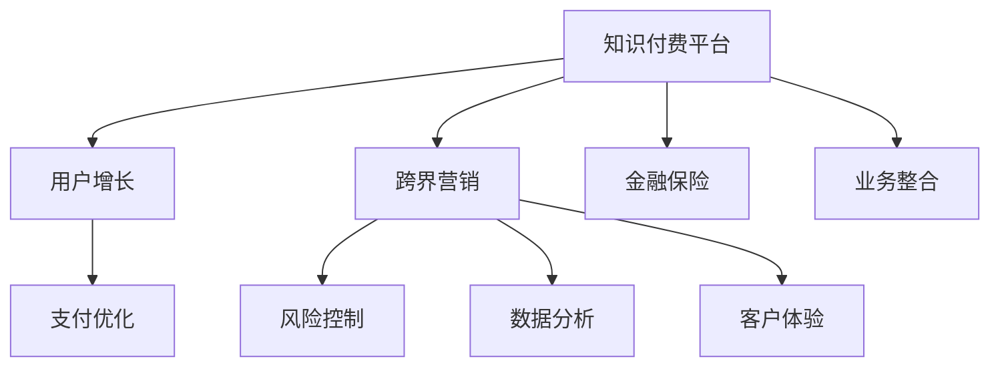

                 

# 知识付费如何实现跨界营销与金融保险跨界？

> 关键词：知识付费,跨界营销,金融保险,用户增长,支付优化,风险控制,数据分析,客户体验

## 1. 背景介绍

### 1.1 问题由来
在当今信息爆炸的时代，知识付费已经成为了一个快速增长的市场。它不仅提供了高质量的内容，而且还让消费者对有价值的信息有了更高效的获取途径。然而，如何通过跨界营销和金融保险等手段来进一步提升知识付费平台的收入和用户粘性，成为了一个亟待解决的问题。本文将探讨知识付费平台如何结合跨界营销策略，在金融保险领域进行创新尝试，实现双赢发展。

### 1.2 问题核心关键点
核心问题在于，知识付费平台如何利用跨界营销策略，特别是与金融保险的结合，来提升用户体验、优化支付流程、降低风险、增强用户粘性并提升平台收入。

## 2. 核心概念与联系

### 2.1 核心概念概述
1. **知识付费**：基于在线平台的知识服务模式，用户通过付费获取专业、高质量的内容，如在线课程、专业文章、书籍等。
2. **跨界营销**：将不同领域的产品或服务通过创造性的方式进行联合推广，以吸引更广泛的用户群体。
3. **金融保险**：涵盖银行、保险、信贷等多个子领域，为用户提供资金管理和风险保障服务。
4. **用户增长**：通过有效的市场推广策略，增加平台的用户数量。
5. **支付优化**：简化支付流程，提高用户体验。
6. **风险控制**：在金融保险应用中，通过数据模型和算法来识别、评估和管理风险。
7. **数据分析**：利用数据挖掘和统计分析来发现用户行为模式和趋势。
8. **客户体验**：提高用户在使用服务时的满意度，增强用户忠诚度。

### 2.2 核心概念原理和架构的 Mermaid 流程图


## 3. 核心算法原理 & 具体操作步骤

### 3.1 算法原理概述
知识付费平台的跨界营销与金融保险结合的核心在于，通过数据和算法优化用户体验，同时提供与金融保险相关的服务，如资金管理、风险评估等，增加用户粘性，并提升收入。

### 3.2 算法步骤详解
1. **数据收集与分析**：
   - 收集用户行为数据，如购买记录、阅读时长、评分等。
   - 利用数据挖掘技术发现用户偏好和行为模式。
   - 通过A/B测试等方法验证营销策略的效果。

2. **个性化推荐与内容分发**：
   - 根据用户画像和行为数据，推荐个性化的内容。
   - 利用推荐系统算法，如协同过滤、内容过滤等，优化内容分发策略。

3. **跨界营销策略设计**：
   - 与金融保险机构合作，推出联名产品或服务。
   - 设计吸引用户参与的促销活动，如联合举办在线讲座、推出专属优惠等。

4. **风险控制与用户保障**：
   - 利用数据分析技术，建立用户风险模型，识别高风险用户。
   - 实施动态定价策略，降低金融产品风险。
   - 提供用户保障机制，如退款保障、保证保险等，增加用户信任感。

### 3.3 算法优缺点
**优点**：
- 通过跨界营销策略，增加了用户粘性，提升了用户终身价值。
- 与金融保险机构的合作，为平台提供了新的收入来源。
- 数据驱动的个性化推荐，提高了用户满意度，增加了重复购买率。

**缺点**：
- 与金融保险的跨界合作，需要解决监管和合规问题，增加了运营成本。
- 数据隐私和安全问题，需采取严格的数据保护措施。
- 跨界营销策略的成功，高度依赖于平台对不同领域的理解和整合能力。

### 3.4 算法应用领域
知识付费平台跨界营销与金融保险结合的应用场景包括但不限于：
- 联合推出理财课程或金融产品。
- 推出专属的保险服务，如健康保险、财产保险等。
- 提供投资咨询、财务规划等服务。
- 利用大数据分析，为用户提供个性化金融产品推荐。

## 4. 数学模型和公式 & 详细讲解

### 4.1 数学模型构建
设知识付费平台的用户数量为 $U$，平台内容库的总数为 $C$，每位用户的月活跃用户数为 $A$，金融保险产品的用户数量为 $F$，平台每月的总收益为 $R$。

**用户增长模型**：
$$
\text{用户增长率} = \frac{\Delta U}{U}
$$

**内容消费模型**：
$$
\text{内容消费量} = \text{用户数} \times \text{人均消费量}
$$

**收益模型**：
$$
R = C \times \text{每单位内容的付费率}
$$

**金融保险产品销售模型**：
$$
R_{\text{金融}} = F \times \text{每单位金融产品的收费}
$$

### 4.2 公式推导过程
**用户增长率推导**：
根据用户留存率和转化率，可以得到用户增长率：
$$
\text{用户增长率} = r_1 \times r_2 \times ... \times r_n
$$
其中 $r_i$ 为每次用户转化率。

**内容消费量推导**：
假设每位用户平均每月消费 $k$ 项内容，则：
$$
\text{内容消费量} = U \times k
$$

**收益模型推导**：
设每项内容的付费率为 $p$，则总收益为：
$$
R = C \times p
$$

**金融保险产品销售模型推导**：
设每单位金融产品的收费为 $c$，则销售收益为：
$$
R_{\text{金融}} = F \times c
$$

### 4.3 案例分析与讲解
以某知识付费平台为例，假设平台每月活跃用户为10万，内容库为1万，每位用户平均每月消费3项内容，每项内容的付费率为1元。如果与一家保险公司合作推出专属保险产品，每月有5%的用户购买，每单位产品收费50元，则平台的月收益为：

$$
R = 100000 \times 3 \times 1 + 100000 \times 5\% \times 50 = 350,000 \text{元}
$$

## 5. 项目实践：代码实例和详细解释说明

### 5.1 开发环境搭建
1. **选择编程语言和框架**：Python + Flask。
2. **安装相关依赖**：Flask、requests、numpy、pandas等。
3. **搭建开发环境**：使用Python的virtualenv环境。

### 5.2 源代码详细实现
以下是一个简化的代码框架，用于实现知识付费平台的用户增长和金融保险产品的销售统计。

```python
from flask import Flask, request, jsonify
import pandas as pd

app = Flask(__name__)

# 用户数据
user_data = {
    'user1': {'id': 1, 'age': 30, 'email': 'user1@example.com'},
    'user2': {'id': 2, 'age': 25, 'email': 'user2@example.com'}
}

# 内容数据
content_data = {
    'content1': {'title': '内容1', 'type': '课程', 'price': 19.9},
    'content2': {'title': '内容2', 'type': '书籍', 'price': 29.9}
}

# 金融产品数据
product_data = {
    'product1': {'title': '产品1', 'type': '健康保险', 'price': 200},
    'product2': {'title': '产品2', 'type': '财产保险', 'price': 300}
}

@app.route('/users', methods=['GET'])
def get_users():
    return jsonify(user_data)

@app.route('/content', methods=['GET'])
def get_content():
    return jsonify(content_data)

@app.route('/products', methods=['GET'])
def get_products():
    return jsonify(product_data)

@app.route('/purchase', methods=['POST'])
def purchase():
    data = request.get_json()
    if data['product'] in product_data:
        # 计算收益
        user_id = data['user_id']
        product_price = product_data[data['product']]['price']
        if 'subscription' in data:
            # 订阅产品
            subscription_price = content_data[data['subscription']]['price']
            total_price = product_price + subscription_price
        else:
            total_price = product_price
        return jsonify({'success': True, 'total_price': total_price})
    else:
        return jsonify({'success': False, 'error': '产品不存在'})

if __name__ == '__main__':
    app.run(debug=True)
```

### 5.3 代码解读与分析
此代码实现了一个基本的知识付费平台后台管理系统，包括用户、内容和金融产品的管理，以及用户购买产品时收益的计算。

- **用户数据管理**：通过Python字典存储用户信息，实现简单的用户管理。
- **内容数据管理**：通过Python字典存储内容信息，包括内容标题、类型和价格。
- **金融产品管理**：通过Python字典存储金融产品信息，包括产品标题、类型和价格。
- **购买处理**：接收用户购买请求，计算并返回购买总金额。

### 5.4 运行结果展示
运行上述代码后，可以通过访问以下URL来获取数据：
- `http://localhost:5000/users`：获取用户数据。
- `http://localhost:5000/content`：获取内容数据。
- `http://localhost:5000/products`：获取金融产品数据。
- `http://localhost:5000/purchase`：用户购买产品，计算收益。

## 6. 实际应用场景

### 6.1 智能投顾
知识付费平台可以与智能投顾合作，为用户提供个性化的投资建议和产品推荐。通过用户画像和行为数据，智能投顾可以生成符合用户风险承受能力和收益预期的投资组合，并通过平台向用户展示。

### 6.2 健康管理
平台可以与健康保险公司合作，提供健康管理服务。通过收集用户健康数据，结合保险产品的条款和价格，向用户推荐合适的健康保险产品，并提供个性化的健康管理建议。

### 6.3 财务管理
知识付费平台可以与财务顾问合作，提供财务管理服务。通过分析用户收入、支出、资产和负债情况，财务顾问可以为用户制定个性化的理财计划，并通过平台向用户展示。

## 7. 工具和资源推荐

### 7.1 学习资源推荐
1. **《数据科学与大数据技术》**：讲解数据科学与大数据技术的经典教材，适合基础知识入门。
2. **Kaggle竞赛平台**：提供丰富的数据集和竞赛项目，锻炼数据分析和机器学习技能。
3. **Coursera在线课程**：提供数据分析、机器学习和金融等领域的专业课程，适合深入学习。
4. **GitHub开源项目**：参与和贡献开源项目，积累实践经验。

### 7.2 开发工具推荐
1. **Jupyter Notebook**：用于数据探索和机器学习实验的强大工具。
2. **TensorFlow**：开源机器学习框架，适合深度学习模型开发。
3. **Flask**：轻量级Web框架，适合快速开发后端API。
4. **MySQL / MongoDB**：常用的关系型和文档型数据库，适合存储和管理数据。

### 7.3 相关论文推荐
1. **《数据驱动的用户增长策略》**：详细介绍了用户增长模型的构建和应用。
2. **《跨界营销的理论与实践》**：探讨了跨界营销的战略和实施方法。
3. **《金融风险控制与用户行为分析》**：介绍了金融产品风险控制和用户行为分析的方法。

## 8. 总结：未来发展趋势与挑战

### 8.1 总结
本文详细介绍了知识付费平台如何通过跨界营销策略与金融保险结合，提升用户增长和平台收入。通过数据分析和算法优化，平台能够更好地理解用户需求，提供个性化服务，增强用户粘性。未来，随着大数据和人工智能技术的不断发展，知识付费平台将有更多的创新应用场景，推动跨界营销与金融保险的深度融合。

### 8.2 未来发展趋势
1. **AI与大数据深度结合**：利用AI技术优化用户体验，提高平台竞争力。
2. **个性化金融服务普及**：通过数据驱动的个性化服务，满足用户多样化的需求。
3. **跨界合作模式创新**：探索更多领域的跨界合作，拓展平台服务范围。
4. **数据隐私与安全保护**：建立严格的数据隐私和安全保护机制，确保用户数据安全。

### 8.3 面临的挑战
1. **数据隐私与合规问题**：如何平衡用户数据隐私和平台需求，遵守相关法律法规。
2. **用户信任与满意度**：如何在跨界合作中保持用户信任，提升用户体验。
3. **平台技术架构**：如何构建高效、可扩展的平台架构，支持不断增长的用户和内容。
4. **市场竞争压力**：如何应对市场竞争，保持平台的市场竞争力。

### 8.4 研究展望
未来研究可集中在以下几个方向：
1. **数据驱动的用户行为分析**：通过深度学习和自然语言处理技术，进一步挖掘用户行为数据，优化推荐系统。
2. **跨界合作的创新模式**：探索更多领域的合作模式，如教育、旅游等，丰富平台服务内容。
3. **智能投顾与健康管理**：深入研究智能投顾和健康管理服务的技术实现，提升服务质量。
4. **金融保险产品的创新设计**：结合用户行为数据，设计符合用户需求的个性化金融产品。

## 9. 附录：常见问题与解答

**Q1：跨界营销与金融保险结合的意义是什么？**

A: 跨界营销与金融保险结合的意义在于，通过将不同领域的产品或服务结合，不仅可以为知识付费平台带来新的收入来源，还可以提升用户体验和粘性，增强平台竞争力。

**Q2：如何选择合适的金融保险合作伙伴？**

A: 选择合适的金融保险合作伙伴应考虑其市场影响力、产品创新性、品牌知名度和用户信任度等因素。同时，应确保合作伙伴的产品符合监管要求，具有可操作性和可持续性。

**Q3：在跨界营销中如何保护用户数据隐私？**

A: 在跨界营销中保护用户数据隐私，应采用严格的访问控制、数据加密、数据脱敏等措施，确保用户数据在传输和存储过程中的安全。同时，应遵守相关法律法规，如GDPR、CCPA等，保障用户隐私权。

**Q4：如何确保跨界营销活动的成功？**

A: 确保跨界营销活动的成功，需要做好市场调研、用户需求分析、目标设定和效果评估。同时，应选择合适的营销渠道和推广策略，优化用户体验，提升品牌影响力。

---

作者：禅与计算机程序设计艺术 / Zen and the Art of Computer Programming

