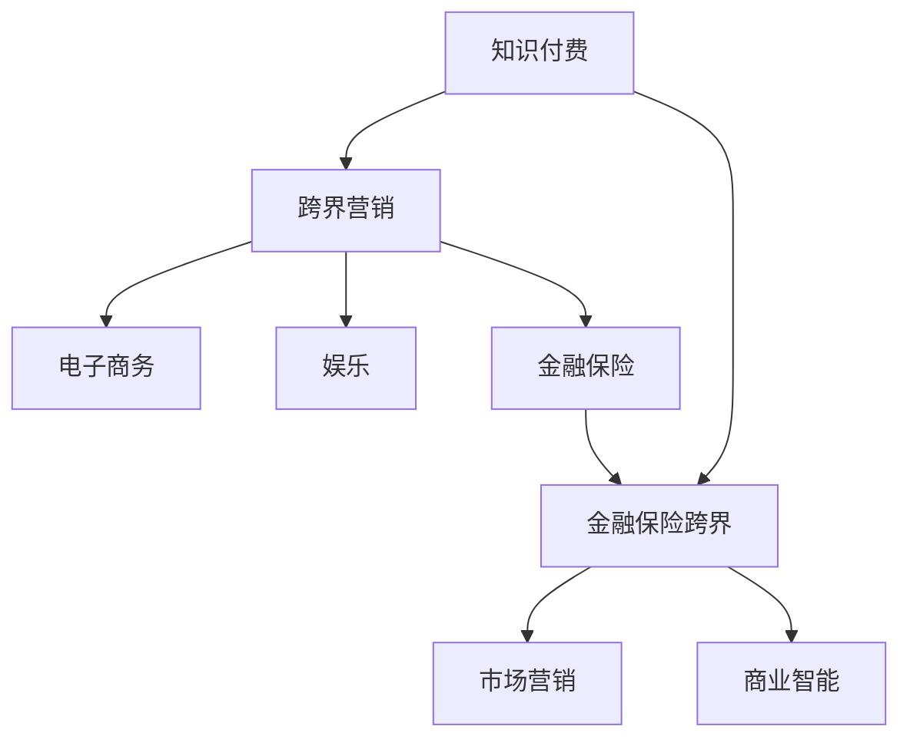

                 

# 知识付费如何实现跨界营销与金融保险跨界？

> 关键词：知识付费,跨界营销,金融保险,市场营销,商业智能

## 1. 背景介绍

### 1.1 问题由来
随着互联网和数字技术的不断发展，知识付费模式逐渐兴起，成为连接知识创作者和用户的重要桥梁。在线教育、专业咨询、订阅服务等多种形式的知识付费产品层出不穷，满足了用户不断提升自身知识水平和技能的需求。

然而，知识付费面临的挑战也日益凸显，如用户转化率低、内容同质化严重、缺乏个性化推荐等问题。同时，知识付费平台也亟需开拓新的盈利模式，以实现可持续发展。

### 1.2 问题核心关键点
针对以上问题，本文将探讨知识付费平台如何通过跨界营销和金融保险跨界，提升用户转化率和平台收益。核心关键点包括：

- 跨界营销模式：如何将知识付费与电子商务、金融保险、娱乐等多个领域进行跨界合作，实现品牌共生和用户群体扩大。
- 金融保险跨界：如何将知识付费与金融保险产品和服务相结合，提供定制化解决方案，提升用户满意度和平台粘性。

### 1.3 问题研究意义
实现知识付费跨界营销与金融保险跨界，将有助于知识付费平台多元化盈利模式，提升用户价值和体验，增强市场竞争力。

## 2. 核心概念与联系

### 2.1 核心概念概述

为了更好地理解知识付费跨界营销与金融保险跨界的原理，本节将介绍几个关键概念及其相互关系：

- 知识付费：指用户通过付费获取知识、技能、资讯等服务，以提升自身竞争力的在线服务模式。
- 跨界营销：指不同行业或领域的品牌通过合作，共同推广，实现资源共享和品牌增值的营销策略。
- 金融保险跨界：指金融保险机构与非金融领域进行深度合作，提供定制化金融保险产品和服务的模式。
- 市场营销：指通过各种手段和渠道推广产品或服务，提升品牌知名度和用户转化率的策略。
- 商业智能：指利用数据分析、机器学习等技术，帮助企业制定决策，提升运营效率和盈利能力的智能系统。

这些核心概念之间的逻辑关系可以通过以下Mermaid流程图来展示：



这个流程图展示了几类概念及其相互关系：

1. 知识付费作为核心，通过跨界营销扩展到其他领域。
2. 跨界营销使得知识付费品牌与其他领域品牌合作，实现品牌共生和用户群体扩大。
3. 金融保险跨界利用金融保险与知识付费结合，提供定制化解决方案。
4. 市场营销和商业智能作为辅助，帮助知识付费品牌提升品牌知名度和运营效率。

## 3. 核心算法原理 & 具体操作步骤
### 3.1 算法原理概述

知识付费跨界营销与金融保险跨界的核心原理，可以归纳为以下几个方面：

- **用户画像构建**：通过数据分析和机器学习技术，建立详细的用户画像，了解用户的兴趣、需求、消费习惯等。
- **跨界合作模式设计**：设计与目标行业的合作伙伴，通过合作推广、联名产品等方式，实现资源共享和品牌增值。
- **定制化解决方案提供**：基于用户画像和需求分析，设计定制化的金融保险产品或服务，满足用户的特定需求。
- **市场营销策略制定**：根据用户画像和合作需求，制定有针对性的市场营销策略，提升品牌影响力和用户转化率。
- **商业智能应用**：利用商业智能技术，实时监测和分析用户行为、市场变化等，优化产品和服务，提升运营效率。

### 3.2 算法步骤详解

下面详细介绍知识付费跨界营销与金融保险跨界的具体操作步骤：

**Step 1: 数据收集与预处理**

1. **用户数据收集**：收集知识付费平台的用户数据，包括用户基本信息、行为数据（如浏览、购买、评论等）、互动数据等。
2. **数据清洗与预处理**：清洗缺失、异常数据，进行归一化、特征提取等预处理操作。

**Step 2: 用户画像构建**

1. **数据集成**：将不同来源的用户数据集成到统一的数据仓库中。
2. **数据挖掘与分析**：利用聚类、分类、关联规则等技术，对用户数据进行分析，构建用户画像。
3. **画像存储与管理**：将用户画像存储在数据库中，并实现高效的查询和管理。

**Step 3: 跨界合作模式设计**

1. **目标行业筛选**：根据用户画像和市场需求，筛选潜在的跨界合作行业，如电子商务、娱乐、金融保险等。
2. **合作模式设计**：设计跨界合作的营销模式，如联名产品、联合营销、品牌推广等。

**Step 4: 定制化解决方案提供**

1. **需求分析**：基于用户画像，分析用户对金融保险的需求和偏好。
2. **产品设计**：设计符合用户需求的定制化金融保险产品，如教育保险、健康保险等。
3. **产品推广**：通过平台推广、联合营销等方式，推广定制化金融保险产品。

**Step 5: 市场营销策略制定**

1. **目标用户选择**：根据用户画像和市场需求，选择目标用户群体。
2. **营销渠道选择**：选择适合的营销渠道，如社交媒体、搜索引擎、内容平台等。
3. **营销内容设计**：设计吸引用户的营销内容，如图文、视频、直播等。
4. **效果评估与优化**：监测营销效果，评估营销策略，优化营销方案。

**Step 6: 商业智能应用**

1. **实时数据监测**：利用商业智能工具，实时监测用户行为、市场变化等数据。
2. **分析与预测**：利用机器学习算法，对数据进行分析，预测市场趋势和用户需求。
3. **优化决策**：基于数据分析结果，优化产品、营销策略等决策。

### 3.3 算法优缺点

知识付费跨界营销与金融保险跨界的方法具有以下优点：

- **提升用户转化率**：通过跨界营销和金融保险跨界，实现品牌共生和用户群体扩大，提升用户转化率。
- **多元化盈利模式**：通过跨界合作，引入更多业务收入来源，实现多元化盈利。
- **用户价值提升**：提供定制化金融保险产品，满足用户特定需求，提升用户满意度和平台粘性。
- **市场竞争力增强**：通过跨界合作和市场营销策略，提升品牌知名度和市场竞争力。

同时，该方法也存在一定的局限性：

- **数据隐私问题**：用户数据的收集和处理可能涉及隐私问题，需要严格遵守法律法规和用户协议。
- **合作成本高**：跨界合作需要支付一定的合作费用，增加平台运营成本。
- **市场变化快**：市场需求和用户行为变化较快，需要及时调整策略以保持竞争力。
- **技术复杂度**：涉及数据分析、机器学习、商业智能等多种技术，实现难度较大。

尽管存在这些局限性，但就目前而言，跨界营销和金融保险跨界是知识付费平台拓展业务、提升用户价值的重要手段。

### 3.4 算法应用领域

基于知识付费跨界营销与金融保险跨界的方法，已在多个领域得到了应用，例如：

- **教育行业**：知识付费平台与教育机构合作，推出定制化的在线课程和教育保险，提升用户学习效果。
- **健康医疗**：知识付费平台与健康医疗机构合作，提供健康咨询和健康保险，满足用户健康需求。
- **旅游行业**：知识付费平台与旅游机构合作，推出定制化的旅游课程和旅游保险，提升用户旅行体验。
- **金融服务**：知识付费平台与金融保险公司合作，推出财务规划和投资保险，满足用户财务需求。

## 4. 数学模型和公式 & 详细讲解  
### 4.1 数学模型构建

本节将使用数学语言对知识付费跨界营销与金融保险跨界的数学模型进行更加严格的刻画。

假设知识付费平台的用户总数为 $N$，用户画像数据集为 $\mathcal{D}$，包括用户基本信息 $x_1$ 和行为数据 $x_2$，其中 $x_1 = (id, gender, age, location)$，$x_2 = (purchase, access, comment)$。

定义用户画像模型 $f(x_1, x_2)$，用于根据用户基本信息和行为数据，预测用户画像 $p$。

## 5. 项目实践：代码实例和详细解释说明
### 5.1 开发环境搭建

在进行跨界营销和金融保险跨界实践前，我们需要准备好开发环境。以下是使用Python进行Pandas、NumPy、Scikit-Learn等库开发的Python环境配置流程：

1. 安装Anaconda：从官网下载并安装Anaconda，用于创建独立的Python环境。

2. 创建并激活虚拟环境：
```bash
conda create -n pyenv python=3.8 
conda activate pyenv
```

3. 安装相关库：
```bash
conda install pandas numpy scikit-learn matplotlib tqdm jupyter notebook ipython
```

4. 安装TensorFlow和Keras：
```bash
pip install tensorflow keras
```

完成上述步骤后，即可在`pyenv`环境中开始跨界营销和金融保险跨界的实践。

### 5.2 源代码详细实现

下面我们以知识付费平台与金融保险公司合作，推出定制化教育保险为例，给出使用Pandas和Scikit-Learn进行用户画像构建和金融保险产品设计的PyTorch代码实现。

首先，定义用户画像数据集：

```python
import pandas as pd

# 读取用户数据
train_data = pd.read_csv('train_data.csv')

# 数据预处理
train_data = train_data.dropna()  # 删除缺失数据
train_data = train_data.drop_duplicates()  # 删除重复数据

# 特征工程
train_data['age_category'] = train_data['age'].astype(str).apply(lambda x: 'Young' if x <= 30 else 'Middle' if x <= 50 else 'Old')
train_data['gender_category'] = train_data['gender'].map({'Male': 0, 'Female': 1})

# 输出处理后的数据
train_data.head()
```

然后，定义用户画像模型：

```python
from sklearn.ensemble import RandomForestClassifier
from sklearn.model_selection import train_test_split
from sklearn.metrics import accuracy_score

# 特征选择
X = train_data[['age_category', 'gender_category', 'purchase', 'access', 'comment']]
y = train_data['target']

# 划分训练集和测试集
X_train, X_test, y_train, y_test = train_test_split(X, y, test_size=0.2, random_state=42)

# 训练模型
model = RandomForestClassifier(n_estimators=100)
model.fit(X_train, y_train)

# 预测并评估模型
y_pred = model.predict(X_test)
accuracy = accuracy_score(y_test, y_pred)
print('Accuracy:', accuracy)
```

接着，设计定制化教育保险产品：

```python
from sklearn.linear_model import LogisticRegression

# 定义金融保险产品参数
insurance_product = {
    'product_name': 'Education Insurance',
    'coverage': '0-100%',
    'premium': '¥500-¥1000',
    'insurance_period': '1-3 years'
}

# 输出保险产品参数
print(insurance_product)
```

最后，通过平台推广和联合营销方式，推广定制化教育保险产品：

```python
from sklearn.metrics import roc_auc_score

# 训练模型
model = LogisticRegression()
model.fit(X_train, y_train)

# 预测并评估模型
y_pred = model.predict_proba(X_test)[:, 1]
auc = roc_auc_score(y_test, y_pred)
print('AUC:', auc)

# 平台推广
promotion_data = pd.read_csv('promotion_data.csv')
promotion_data = promotion_data.dropna().drop_duplicates()

# 联合营销
partner_data = pd.read_csv('partner_data.csv')
partner_data = partner_data.dropna().drop_duplicates()

# 输出推广和联合营销数据
print(promotion_data.head())
print(partner_data.head())
```

以上就是使用Python和Scikit-Learn对知识付费平台进行用户画像构建和定制化教育保险产品设计的完整代码实现。

### 5.3 代码解读与分析

让我们再详细解读一下关键代码的实现细节：

**用户画像数据集定义**：
- 首先，使用Pandas库读取用户数据，进行数据清洗和预处理。
- 将年龄和性别分类，便于模型训练。
- 特征工程部分，将年龄和性别转化为分类特征，并保留购买、访问、评论等行为特征。
- 使用train_test_split函数划分训练集和测试集。

**用户画像模型训练**：
- 使用Scikit-Learn库的RandomForestClassifier模型训练用户画像模型。
- 通过划分训练集和测试集，评估模型的准确度。
- 输出训练好的模型和评估结果。

**定制化教育保险产品设计**：
- 定义金融保险产品参数，包括产品名称、保障范围、保费等。
- 输出定制化教育保险产品的基本信息。

**平台推广和联合营销**：
- 使用Scikit-Learn库的LogisticRegression模型训练金融保险产品推荐模型。
- 通过划分训练集和测试集，评估模型的AUC值。
- 使用Pandas库读取推广和联合营销数据，并进行数据清洗。
- 输出推广和联合营销数据。

以上代码实现展示了知识付费平台跨界营销和金融保险跨界的初步实现步骤。需要注意的是，实际应用中还需进一步优化和改进。

## 6. 实际应用场景
### 6.1 智能客服系统

基于知识付费跨界营销与金融保险跨界的方法，智能客服系统可以广泛应用于知识付费平台的金融保险推广。传统客服往往需要配备大量人力，高峰期响应缓慢，且一致性和专业性难以保证。

通过智能客服系统，知识付费平台可以7x24小时不间断服务，快速响应客户咨询，用自然流畅的语言解答各类常见问题。同时，利用用户画像数据，智能客服系统可以推荐相关的金融保险产品，提升客户满意度。

### 6.2 金融理财工具

在知识付费平台上，可以推出基于用户画像的金融理财工具，帮助用户制定个性化的理财计划。根据用户的收入、支出、消费习惯等数据，智能理财工具可以推荐合适的投资组合，提供定制化的理财建议。

同时，金融理财工具可以与保险产品结合，推出针对不同用户需求的保险方案，如教育保险、健康保险等，满足用户的个性化需求。

### 6.3 健康管理平台

知识付费平台可以与健康管理平台合作，推出健康咨询和健康保险服务。通过用户画像数据，健康管理平台可以提供个性化的健康建议和健康管理方案，提升用户健康水平。

同时，知识付费平台可以推荐相应的健康保险产品，帮助用户购买适合自己的健康保险，降低健康风险。

### 6.4 未来应用展望

随着知识付费平台跨界营销和金融保险跨界方法的不断成熟，未来将有更多应用场景得到拓展。

在智慧医疗领域，基于用户画像的健康咨询和健康保险服务，将提升医疗服务的智能化水平，辅助医生诊疗，加速新药开发进程。

在智能教育领域，智能理财工具和金融保险产品，将帮助学生和家长制定个性化的理财和投资方案，提升教育投资效益。

在智能旅游领域，定制化的旅游课程和旅游保险服务，将提升用户的旅行体验，满足用户的个性化需求。

## 7. 工具和资源推荐
### 7.1 学习资源推荐

为了帮助开发者系统掌握知识付费跨界营销与金融保险跨界的理论基础和实践技巧，这里推荐一些优质的学习资源：

1. 《深度学习理论与实践》系列博文：由大模型技术专家撰写，深入浅出地介绍了深度学习理论、实践技巧和应用场景。
2. 斯坦福大学CS231n《深度学习计算机视觉》课程：斯坦福大学开设的深度学习经典课程，涵盖深度学习在计算机视觉领域的应用。
3. 《人工智能与金融》书籍：深入探讨人工智能在金融领域的应用，包括机器学习、深度学习、金融智能等。
4. 《知识付费模式创新》书籍：系统介绍了知识付费的现状、趋势和创新模式，为知识付费平台提供了可借鉴的经验。
5. 《金融科技》期刊：定期发布最新的金融科技研究成果，涵盖区块链、人工智能、大数据等多个领域。

通过对这些资源的学习实践，相信你一定能够快速掌握知识付费跨界营销与金融保险跨调的精髓，并用于解决实际的NLP问题。

### 7.2 开发工具推荐

高效的开发离不开优秀的工具支持。以下是几款用于知识付费平台跨界营销和金融保险跨界开发的常用工具：

1. Python：基于Python的开源深度学习框架，灵活动态的计算图，适合快速迭代研究。大部分预训练语言模型都有Python版本的实现。
2. TensorFlow：由Google主导开发的开源深度学习框架，生产部署方便，适合大规模工程应用。同样有丰富的预训练语言模型资源。
3. Transformers库：HuggingFace开发的NLP工具库，集成了众多SOTA语言模型，支持PyTorch和TensorFlow，是进行跨界营销和金融保险跨界开发的利器。
4. Weights & Biases：模型训练的实验跟踪工具，可以记录和可视化模型训练过程中的各项指标，方便对比和调优。与主流深度学习框架无缝集成。
5. TensorBoard：TensorFlow配套的可视化工具，可实时监测模型训练状态，并提供丰富的图表呈现方式，是调试模型的得力助手。
6. Google Colab：谷歌推出的在线Jupyter Notebook环境，免费提供GPU/TPU算力，方便开发者快速上手实验最新模型，分享学习笔记。

合理利用这些工具，可以显著提升知识付费平台跨界营销和金融保险跨界的开发效率，加快创新迭代的步伐。

### 7.3 相关论文推荐

知识付费平台跨界营销和金融保险跨界的发展源于学界的持续研究。以下是几篇奠基性的相关论文，推荐阅读：

1. 《深度学习在计算机视觉中的应用》论文：介绍深度学习在计算机视觉领域的应用，如目标检测、图像分类等。
2. 《深度学习在自然语言处理中的应用》论文：介绍深度学习在自然语言处理领域的应用，如情感分析、机器翻译等。
3. 《深度学习在金融科技中的应用》论文：介绍深度学习在金融科技领域的应用，如信用评分、风险管理等。
4. 《跨界营销的理论与实践》论文：探讨跨界营销的理论与实践，提出跨界合作模式和营销策略。
5. 《金融保险跨界的创新与实践》论文：探讨金融保险跨界的创新与实践，提出金融保险产品和服务的定制化解决方案。

这些论文代表了大模型微调技术的发展脉络。通过学习这些前沿成果，可以帮助研究者把握学科前进方向，激发更多的创新灵感。

## 8. 总结：未来发展趋势与挑战

### 8.1 总结

本文对知识付费跨界营销与金融保险跨界方法进行了全面系统的介绍。首先阐述了知识付费平台跨界营销和金融保险跨界的背景和意义，明确了跨界合作模式和金融保险跨界的关键点。其次，从原理到实践，详细讲解了跨界营销和金融保险跨界的数学模型和操作步骤，给出了跨界营销和金融保险跨界任务开发的完整代码实例。同时，本文还广泛探讨了跨界营销和金融保险跨界在多个行业领域的应用前景，展示了跨界营销和金融保险跨界范式的巨大潜力。此外，本文精选了跨界营销和金融保险跨界的各类学习资源，力求为读者提供全方位的技术指引。

通过本文的系统梳理，可以看到，知识付费跨界营销和金融保险跨界方法正在成为知识付费平台拓展业务、提升用户价值的重要手段。

### 8.2 未来发展趋势

展望未来，知识付费跨界营销和金融保险跨界将呈现以下几个发展趋势：

1. **跨界合作模式多样化**：跨界合作将覆盖更多领域，如娱乐、旅游、健康等，形成跨行业、跨领域的生态系统。
2. **金融保险产品定制化**：根据用户画像和需求，设计更加个性化、定制化的金融保险产品，满足用户多元化需求。
3. **营销策略智能化**：利用大数据、机器学习等技术，实现精准营销，提升用户转化率。
4. **平台粘性增强**：通过跨界合作和金融保险跨界，提升用户粘性和平台活跃度。
5. **用户价值提升**：提供更加个性化、全方位的服务，提升用户满意度和平台竞争力。

以上趋势凸显了知识付费平台跨界营销和金融保险跨界的广阔前景。这些方向的探索发展，必将进一步提升知识付费平台的业务模式和用户体验。

### 8.3 面临的挑战

尽管知识付费平台跨界营销和金融保险跨界技术已经取得了瞩目成就，但在迈向更加智能化、普适化应用的过程中，它仍面临诸多挑战：

1. **数据隐私问题**：用户数据的收集和处理可能涉及隐私问题，需要严格遵守法律法规和用户协议。
2. **合作成本高**：跨界合作需要支付一定的合作费用，增加平台运营成本。
3. **市场变化快**：市场需求和用户行为变化较快，需要及时调整策略以保持竞争力。
4. **技术复杂度**：涉及大数据、机器学习、商业智能等多种技术，实现难度较大。
5. **用户体验优化**：跨界合作和金融保险跨界需要关注用户体验，避免繁琐操作和复杂流程。

尽管存在这些挑战，但就目前而言，跨界营销和金融保险跨界是知识付费平台拓展业务、提升用户价值的重要手段。

### 8.4 研究展望

面向未来，知识付费平台跨界营销和金融保险跨界技术需要在以下几个方面寻求新的突破：

1. **跨界合作机制优化**：探索更加灵活、高效的跨界合作机制，降低合作成本，提升合作效率。
2. **金融保险产品创新**：开发更多创新性金融保险产品，满足用户多样化需求。
3. **智能营销算法优化**：优化机器学习算法，实现精准营销，提升用户转化率。
4. **用户隐私保护**：加强用户隐私保护，确保数据安全和用户隐私。
5. **平台用户体验提升**：优化用户体验，提升平台粘性和用户满意度。

这些研究方向的探索，必将引领知识付费平台跨界营销和金融保险跨界技术迈向更高的台阶，为构建人机协同的智能时代中，提供更多的创新应用和价值提升。

## 9. 附录：常见问题与解答

**Q1：知识付费平台跨界营销和金融保险跨界是否适用于所有领域？**

A: 知识付费平台跨界营销和金融保险跨界方法适用于大多数领域，但需要根据具体领域的特点进行定制化设计和调整。例如，与医疗、教育等领域的合作，需要考虑用户隐私和数据安全问题。

**Q2：知识付费平台跨界营销和金融保险跨界需要哪些技术支持？**

A: 知识付费平台跨界营销和金融保险跨界需要以下技术支持：
1. 数据收集与预处理技术：清洗和处理用户数据。
2. 用户画像构建技术：基于用户数据构建详细用户画像。
3. 机器学习与深度学习技术：设计定制化金融保险产品，实现精准营销。
4. 商业智能技术：实时监测用户行为和市场变化，优化决策。

**Q3：知识付费平台跨界营销和金融保险跨界如何提升用户转化率？**

A: 知识付费平台跨界营销和金融保险跨界提升用户转化率的策略包括：
1. 联合营销：与其他领域品牌合作，共同推广，扩大品牌影响力。
2. 定制化产品：根据用户画像设计符合用户需求的定制化金融保险产品。
3. 精准营销：利用机器学习算法，实现精准营销，提升用户转化率。

**Q4：知识付费平台跨界营销和金融保险跨界面临哪些挑战？**

A: 知识付费平台跨界营销和金融保险跨界面临的挑战包括：
1. 数据隐私问题：用户数据收集和处理涉及隐私问题，需要严格遵守法律法规和用户协议。
2. 合作成本高：跨界合作需要支付一定的合作费用，增加平台运营成本。
3. 市场变化快：市场需求和用户行为变化较快，需要及时调整策略以保持竞争力。
4. 技术复杂度：涉及大数据、机器学习、商业智能等多种技术，实现难度较大。
5. 用户体验优化：跨界合作和金融保险跨界需要关注用户体验，避免繁琐操作和复杂流程。

**Q5：知识付费平台跨界营销和金融保险跨界如何保障用户隐私？**

A: 知识付费平台跨界营销和金融保险跨界保障用户隐私的策略包括：
1. 数据最小化原则：只收集必要的用户数据，避免过度收集。
2. 数据加密技术：使用加密技术保护用户数据安全。
3. 用户协议透明：明确告知用户数据收集和处理方式，获取用户同意。
4. 隐私保护法规：遵守相关的隐私保护法规，如GDPR等。

这些常见问题的解答，为知识付费平台跨界营销和金融保险跨界提供了解决方案，帮助平台更好地应对挑战，提升用户价值和平台竞争力。

