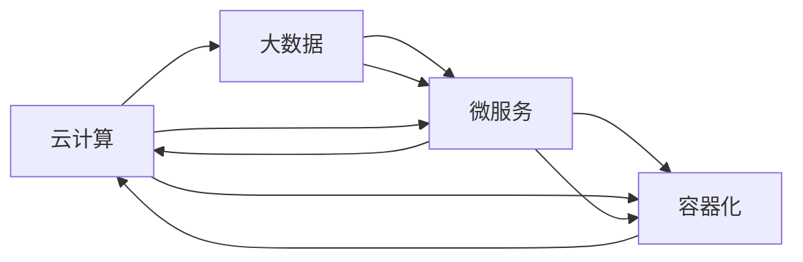

                 

# 知识付费平台的技术架构：从0到1的构建

> 关键词：知识付费平台, 技术架构, 系统设计, 大数据, 云计算, 微服务, 容器化

## 1. 背景介绍

在数字经济时代，知识和信息成为重要的生产要素。知识付费平台的兴起，使知识的获取更加便捷和高效。为了满足日益增长的知识需求，构建稳定、高效、安全的知识付费平台，成为各互联网企业的共同目标。本文将从技术架构的角度，探讨如何从0到1构建一个典型的知识付费平台。

## 2. 核心概念与联系

### 2.1 核心概念概述

构建知识付费平台涉及多个技术领域，包括云计算、大数据、微服务、容器化等。每个技术环节相互关联，共同支撑平台的稳定运行和业务发展。

- **云计算**：通过弹性计算资源和云服务，为平台提供高效稳定的基础设施。
- **大数据**：通过收集、存储、分析用户行为数据，为业务决策提供数据支持。
- **微服务**：将平台拆分为多个独立、自治的服务模块，提高系统的可扩展性和灵活性。
- **容器化**：通过Docker等容器技术，实现应用的无缝迁移和快速部署。

### 2.2 核心概念原理和架构的 Mermaid 流程图

这个流程图展示了云计算、大数据、微服务、容器化之间的相互作用和依赖关系。

## 3. 核心算法原理 & 具体操作步骤

### 3.1 算法原理概述

知识付费平台的技术架构涉及多个子系统，包括用户管理、内容管理、推荐系统、支付系统等。这些子系统之间需要进行数据交换、逻辑调用等操作。为了保证系统的稳定性和可靠性，需要进行全面的架构设计和算法优化。

### 3.2 算法步骤详解

#### 3.2.1 需求分析和系统设计

- **需求调研**：与业务团队进行深入交流，明确平台的业务需求和功能要求。
- **系统设计**：基于需求，设计系统的整体架构和模块划分，确定各个模块之间的接口和数据流。
- **技术选型**：根据需求和技术趋势，选择合适的云服务、大数据平台、微服务框架和容器化技术。

#### 3.2.2 架构设计与实施

- **云架构设计**：选择合适的云服务提供商，设计云架构，包括虚拟机、负载均衡、CDN等组件。
- **大数据架构设计**：选择合适的数据仓库、数据分析工具，设计数据收集、存储、清洗和分析流程。
- **微服务设计**：将系统划分为多个独立、自治的服务模块，设计服务间的接口和通信协议。
- **容器化部署**：使用Docker等容器技术，实现应用的封装、迁移和部署。

#### 3.2.3 测试与优化

- **单元测试**：对各个服务模块进行单元测试，确保模块功能正确。
- **集成测试**：对各个服务模块进行集成测试，验证服务间接口的正确性。
- **负载测试**：通过负载测试工具，模拟高并发访问场景，确保系统的稳定性和扩展性。
- **性能优化**：根据测试结果，优化系统性能，包括数据库查询、网络通信、服务调用等环节。

### 3.3 算法优缺点

#### 3.3.1 优点

- **可扩展性**：通过微服务设计，平台可以快速扩展新功能和服务。
- **高可用性**：通过云架构和负载均衡，平台能够实现高可用性和容错性。
- **高效性**：通过大数据分析和容器化部署，平台能够快速响应和处理用户请求。

#### 3.3.2 缺点

- **复杂性高**：系统设计涉及多个技术领域，设计和实施复杂。
- **维护成本高**：系统庞大复杂，维护成本较高。
- **数据隐私问题**：大数据分析涉及大量用户数据，需要严格的数据隐私保护措施。

### 3.4 算法应用领域

知识付费平台的技术架构设计适用于多种业务场景，包括在线教育、数字出版、专业咨询等。通过技术架构设计，可以实现业务创新和优化，提高平台的竞争力和用户满意度。

## 4. 数学模型和公式 & 详细讲解 & 举例说明

### 4.1 数学模型构建

#### 4.1.1 用户行为分析模型

- **用户行为数据**：包括浏览、搜索、购买、评价等行为数据。
- **模型结构**：线性回归、逻辑回归、决策树等。
- **目标**：预测用户行为，个性化推荐内容。

#### 4.1.2 推荐系统模型

- **用户画像**：基于用户历史行为数据，构建用户画像。
- **推荐算法**：协同过滤、基于内容的推荐、深度学习等。
- **目标**：提高推荐准确性和用户体验。

### 4.2 公式推导过程

#### 4.2.1 线性回归模型

- **模型公式**：$y = \beta_0 + \beta_1x_1 + \beta_2x_2 + ... + \beta_nx_n$
- **目标函数**：$J(\beta) = \frac{1}{2m}\sum_{i=1}^m(y_i - \hat{y}_i)^2$
- **优化算法**：梯度下降

#### 4.2.2 协同过滤算法

- **模型公式**：$\hat{y}_{ij} = \sum_{k \in \mathcal{N}_j} \alpha_k r_{ik}y_{kj}$
- **目标函数**：$J(\alpha) = \frac{1}{2}\sum_{i=1}^m\sum_{j=1}^n(y_{ij} - \hat{y}_{ij})^2$
- **优化算法**：梯度下降、奇异值分解

### 4.3 案例分析与讲解

#### 4.3.1 用户行为分析模型应用

- **数据收集**：使用日志、API接口等技术手段，收集用户行为数据。
- **数据清洗**：对数据进行去重、去噪、处理缺失值等操作。
- **模型训练**：使用线性回归模型进行训练，生成用户行为预测模型。
- **应用场景**：在推荐系统、个性化内容推送、用户流失预警等方面应用模型结果。

#### 4.3.2 推荐系统模型应用

- **用户画像**：使用用户历史数据，构建用户画像，包括兴趣、偏好、行为等。
- **推荐算法**：使用协同过滤算法，根据用户画像推荐相关内容。
- **应用场景**：个性化推荐、内容推荐、广告推荐等。

## 5. 项目实践：代码实例和详细解释说明

### 5.1 开发环境搭建

#### 5.1.1 环境准备

- **虚拟机**：在云计算平台上搭建虚拟机，安装操作系统、开发工具等。
- **数据库**：安装MySQL、PostgreSQL等关系型数据库。
- **大数据平台**：安装Hadoop、Spark等大数据处理工具。
- **微服务框架**：安装Docker、Kubernetes等容器化工具。

#### 5.1.2 开发环境配置

- **编程语言**：选择Python、Java等开发语言。
- **框架和库**：安装Flask、Django等Web框架，TensorFlow、PyTorch等机器学习库。
- **云服务配置**：配置云服务账号、安全组、虚拟机等资源。

### 5.2 源代码详细实现

#### 5.2.1 用户管理模块

- **用户注册和登录**：使用Django框架实现用户注册和登录功能。
- **用户信息管理**：使用MySQL数据库存储用户信息，实现用户信息的管理和查询。

#### 5.2.2 内容管理模块

- **内容上传和存储**：使用AWS S3等云存储服务存储内容。
- **内容分类和标签**：使用ElasticSearch等搜索引擎实现内容的分类和标签管理。

#### 5.2.3 推荐系统模块

- **协同过滤算法**：使用TensorFlow实现协同过滤推荐算法。
- **深度学习推荐**：使用PyTorch实现深度学习推荐模型。

### 5.3 代码解读与分析

#### 5.3.1 用户管理模块实现

- **注册和登录**：使用Flask框架实现RESTful接口，处理用户注册和登录请求。
- **用户信息管理**：使用MySQL数据库，使用SQL语句进行用户信息的管理和查询。

#### 5.3.2 内容管理模块实现

- **内容上传和存储**：使用AWS S3服务，通过Python SDK实现内容上传和存储。
- **内容分类和标签**：使用ElasticSearch，通过Python SDK实现内容的分类和标签管理。

#### 5.3.3 推荐系统模块实现

- **协同过滤算法**：使用TensorFlow，定义协同过滤算法的模型结构，训练并使用模型进行推荐。
- **深度学习推荐**：使用PyTorch，定义深度学习推荐模型的结构，训练并使用模型进行推荐。

### 5.4 运行结果展示

#### 5.4.1 用户管理模块测试

- **用户注册和登录测试**：使用Postman等工具，发送注册和登录请求，验证注册和登录功能是否正常。
- **用户信息管理测试**：使用Postman等工具，发送用户信息修改请求，验证信息修改功能是否正常。

#### 5.4.2 内容管理模块测试

- **内容上传和存储测试**：使用Postman等工具，发送内容上传请求，验证内容是否成功上传并存储到云存储服务中。
- **内容分类和标签测试**：使用Postman等工具，发送内容分类和标签修改请求，验证分类和标签管理功能是否正常。

#### 5.4.3 推荐系统模块测试

- **协同过滤算法测试**：使用Postman等工具，发送推荐请求，验证协同过滤算法是否能够正常推荐相关内容。
- **深度学习推荐测试**：使用Postman等工具，发送深度学习推荐请求，验证深度学习模型是否能够正常推荐相关内容。

## 6. 实际应用场景

### 6.1 在线教育平台

知识付费平台在在线教育领域具有广泛的应用前景。通过知识付费平台，用户可以方便地订阅和购买优质课程，享受到高质量的教育资源。平台可以根据用户的学习行为数据，推荐适合的课程和学习内容，提升学习效果。

### 6.2 数字出版平台

知识付费平台在数字出版领域也有重要应用。数字出版平台可以提供电子书、有声书等数字内容，用户可以按需购买和阅读。平台可以根据用户的阅读行为数据，推荐相关书籍和内容，增加用户粘性，提高内容消费量。

### 6.3 专业咨询平台

知识付费平台在专业咨询领域也有广泛应用。专业咨询平台可以提供专业领域的咨询服务，用户可以根据需求购买服务。平台可以根据用户的咨询行为数据，推荐相关的咨询服务，提升服务质量和用户满意度。

### 6.4 未来应用展望

#### 6.4.1 智能推荐

未来知识付费平台将更加注重智能推荐算法的研究和应用。通过机器学习和大数据分析，平台可以更加精准地推荐内容，提升用户满意度和平台营收。

#### 6.4.2 个性化服务

未来知识付费平台将更加注重个性化服务的设计和实现。平台可以根据用户的行为数据，提供个性化的内容推荐、课程推荐、广告推荐等，提升用户体验。

#### 6.4.3 多渠道融合

未来知识付费平台将更加注重多渠道融合的设计和实现。平台可以同时支持Web、移动端、社交媒体等多渠道的接入，提供更加全面、便捷的服务。

## 7. 工具和资源推荐

### 7.1 学习资源推荐

#### 7.1.1 在线课程

- **Coursera**：提供各类在线课程，涵盖云计算、大数据、微服务、容器化等领域。
- **Udemy**：提供各类实战项目和课程，帮助开发者深入学习技术细节。

#### 7.1.2 书籍

- **《云计算架构实践》**：介绍云计算的架构设计和实践方法。
- **《大数据技术架构》**：介绍大数据平台的架构设计和应用场景。
- **《微服务架构设计》**：介绍微服务架构的设计原则和最佳实践。
- **《容器化技术基础》**：介绍容器化技术的原理和应用场景。

### 7.2 开发工具推荐

#### 7.2.1 云服务

- **AWS**：提供全面的云计算服务，包括计算、存储、网络等。
- **阿里云**：提供云计算、大数据、人工智能等综合解决方案。
- **腾讯云**：提供云服务、大数据、安全等综合解决方案。

#### 7.2.2 大数据平台

- **Hadoop**：提供分布式存储和计算框架，支持大规模数据处理。
- **Spark**：提供内存计算和数据处理框架，支持实时数据处理。

#### 7.2.3 微服务框架

- **Django**：Python的Web框架，支持RESTful接口设计。
- **Flask**：轻量级的Web框架，适合快速开发Web应用。

#### 7.2.4 容器化工具

- **Docker**：容器化工具，支持应用的封装、迁移和部署。
- **Kubernetes**：容器编排工具，支持分布式系统的管理和调度。

### 7.3 相关论文推荐

#### 7.3.1 云计算

- **《云架构设计》**：介绍云计算的架构设计和应用场景。
- **《弹性计算资源管理》**：介绍云计算资源管理和调度方法。

#### 7.3.2 大数据

- **《大数据分析与应用》**：介绍大数据平台的设计和应用方法。
- **《数据挖掘与分析》**：介绍大数据分析的算法和技术。

#### 7.3.3 微服务

- **《微服务架构设计》**：介绍微服务架构的设计原则和最佳实践。
- **《微服务与云计算》**：介绍微服务与云计算的结合方法。

#### 7.3.4 容器化

- **《容器化技术基础》**：介绍容器化技术的原理和应用场景。
- **《容器编排与调度》**：介绍容器编排工具的设计和应用方法。

## 8. 总结：未来发展趋势与挑战

### 8.1 研究成果总结

本文从技术架构的角度，探讨了知识付费平台的构建方法和应用场景。通过云计算、大数据、微服务、容器化等技术的综合应用，知识付费平台可以实现高可用性、高效性、可扩展性等特性，满足用户的个性化需求。

### 8.2 未来发展趋势

#### 8.2.1 云计算的普及和深化

云计算技术将继续深化，提供更全面、更灵活的计算和存储资源，为知识付费平台提供稳定的基础设施。

#### 8.2.2 大数据和人工智能的融合

大数据技术和人工智能技术的融合将进一步提升知识付费平台的推荐和服务能力，提供更加精准和个性化的内容推荐和个性化服务。

#### 8.2.3 微服务的广泛应用

微服务架构将继续得到广泛应用，提升知识付费平台的可扩展性和灵活性，支持新功能的快速迭代和扩展。

#### 8.2.4 容器化和云原生技术的成熟

容器化和云原生技术的成熟将进一步提升知识付费平台的部署和运维效率，降低运营成本，提高系统稳定性。

### 8.3 面临的挑战

#### 8.3.1 数据隐私和安全问题

知识付费平台涉及大量用户数据，需要严格的数据隐私保护措施，防止数据泄露和滥用。

#### 8.3.2 技术复杂性和维护成本

知识付费平台涉及多个技术领域，设计和实施复杂，维护成本较高，需要具备一定的技术积累和经验。

#### 8.3.3 系统稳定性和高可用性

知识付费平台需要保证系统的稳定性和高可用性，避免单点故障和业务中断。

#### 8.3.4 用户体验和个性化服务

知识付费平台需要提供个性化的内容和推荐，提升用户体验，满足用户的多样化需求。

### 8.4 研究展望

#### 8.4.1 强化推荐算法的研究

未来的知识付费平台将更加注重推荐算法的研究和应用，通过强化学习和大数据分析，实现更加精准和个性化的推荐。

#### 8.4.2 跨平台多渠道融合

未来的知识付费平台将更加注重跨平台多渠道的融合，支持Web、移动端、社交媒体等多渠道的接入，提供更加全面、便捷的服务。

#### 8.4.3 数据隐私和安全保护

未来的知识付费平台将更加注重数据隐私和安全保护，通过数据加密、访问控制等措施，保障用户数据的安全。

#### 8.4.4 实时数据处理和分析

未来的知识付费平台将更加注重实时数据处理和分析，通过流式计算和大数据分析，及时响应用户需求，提升服务质量。

## 9. 附录：常见问题与解答

### 9.1 常见问题

**Q1：如何选择合适的云服务提供商？**

A: 选择合适的云服务提供商需要考虑多个因素，包括计算资源、存储资源、网络带宽、安全性等。可以参考云计算市场的用户评价和案例分析，选择适合自己业务的云服务提供商。

**Q2：如何保证数据隐私和安全？**

A: 保证数据隐私和安全需要采用多种措施，包括数据加密、访问控制、权限管理等。可以采用云服务提供商提供的数据隐私和安全保护措施，同时结合自己的业务需求，制定严格的数据隐私和安全策略。

**Q3：如何提升系统稳定性？**

A: 提升系统稳定性需要采用多种措施，包括负载均衡、容错机制、监控告警等。可以采用云服务提供商提供的稳定性和高可用性保障措施，同时结合自己的业务需求，制定系统稳定性和高可用性策略。

### 9.2 解答

通过本文的系统梳理，可以看到，构建知识付费平台需要综合考虑多个技术领域的知识和实践经验。云计算、大数据、微服务、容器化等技术的综合应用，可以提升平台的稳定性和扩展性，满足用户的个性化需求。未来，知识付费平台需要在推荐算法、跨平台融合、数据隐私和安全等方面进行深入研究和优化，才能不断提升用户体验和服务质量。

---

作者：禅与计算机程序设计艺术 / Zen and the Art of Computer Programming

